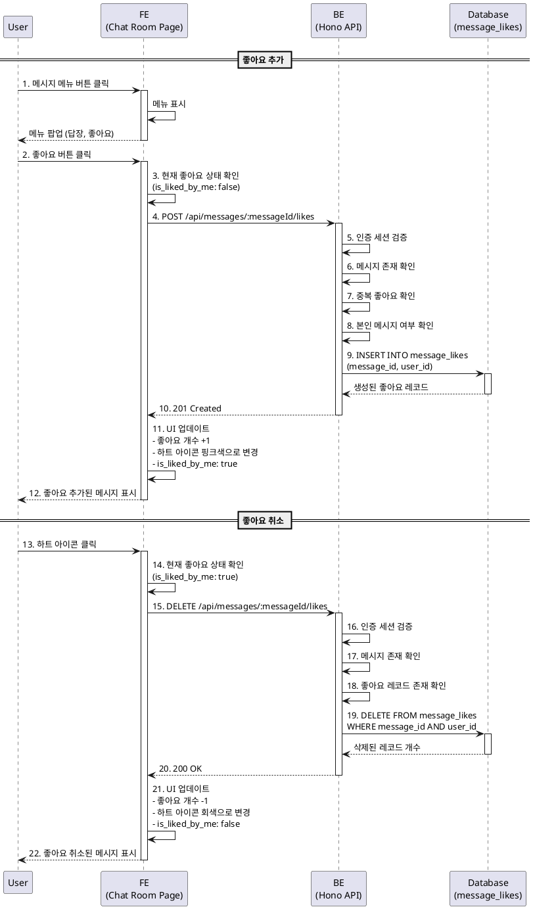

# 유스케이스: 메시지 좋아요 / 좋아요 취소

## 유스케이스 ID: UC-012

### 제목
채팅방 메시지에 좋아요 추가 및 취소

---

## 1. 개요

### 1.1 목적
사용자가 채팅방 내 다른 사용자의 메시지에 좋아요를 표시하거나 취소할 수 있도록 한다. 이를 통해 사용자는 긍정적인 반응을 간단하게 표현할 수 있으며, 메시지에 대한 참여도를 시각적으로 확인할 수 있다.

### 1.2 범위
- 메시지 메뉴를 통한 좋아요 추가
- 좋아요 표시 영역 클릭을 통한 좋아요 토글 (추가/취소)
- 메시지별 좋아요 개수 및 내 좋아요 여부 표시
- 실시간 좋아요 상태 반영

**제외 사항**:
- 좋아요한 사용자 목록 표시 기능
- 내 메시지에 대한 좋아요 기능 (남의 메시지만 가능)
- 좋아요 알림 기능

### 1.3 액터
- **주요 액터**: 인증된 사용자
- **부 액터**: 없음

---

## 2. 선행 조건

- 사용자가 로그인된 상태여야 한다.
- 사용자가 채팅방 상세 페이지(`/chat-rooms/:id`)에 접근해 있어야 한다.
- 채팅방에 메시지가 존재해야 한다.
- 좋아요 대상 메시지가 남의 메시지여야 한다 (내 메시지는 좋아요 불가).

---

## 3. 참여 컴포넌트

- **프론트엔드 (채팅방 상세 페이지)**: 메시지 메뉴 제공, 좋아요 표시 영역 제공, 좋아요 토글 요청
- **백엔드 API**: 좋아요 추가/취소 처리
  - `POST /api/messages/:messageId/likes` (좋아요 추가)
  - `DELETE /api/messages/:messageId/likes` (좋아요 취소)
- **데이터베이스**: `message_likes` 테이블에 좋아요 레코드 삽입/삭제
- **상태 관리**: 메시지 목록 및 좋아요 상태 관리 (React Query)

---

## 4. 기본 플로우 (Basic Flow)

### 4.1 단계별 흐름

#### 플로우 A: 메시지 메뉴를 통한 좋아요 추가

1. **사용자**: 메시지 목록에서 남의 메시지 우측 메뉴 버튼을 클릭한다.
   - 입력: 메뉴 버튼 클릭 이벤트
   - 처리: 메시지 메뉴 표시
   - 출력: 메뉴 팝업 (답장, 좋아요 버튼)

2. **사용자**: 메뉴에서 '좋아요' 버튼을 클릭한다.
   - 입력: 좋아요 버튼 클릭 이벤트, 메시지 ID
   - 처리: 좋아요 추가 요청 준비
   - 출력: 메시지 ID

3. **프론트엔드**: 현재 좋아요 상태를 확인한다.
   - 입력: 메시지의 좋아요 상태 (`is_liked_by_me`)
   - 처리: 좋아요 여부 확인
   - 출력: 좋아요 상태 (false → 추가 필요)

4. **프론트엔드**: 백엔드 API에 좋아요 추가 요청을 보낸다.
   - 입력: `POST /api/messages/:messageId/likes`
   - 처리: HTTP 요청 전송
   - 출력: API 응답 대기

5. **백엔드**: 요청 유효성 검증 (인증, 메시지 존재, 중복 방지)
   - 입력: 요청 헤더 (인증 토큰), 메시지 ID
   - 처리:
     - Supabase Auth 세션 검증
     - 메시지 존재 여부 확인
     - 이미 좋아요한 메시지인지 확인 (중복 방지)
     - 본인 메시지가 아닌지 확인 (비즈니스 규칙)
   - 출력: 검증 결과 (성공 또는 에러)

6. **백엔드**: 데이터베이스에 좋아요 레코드 삽입
   - 입력: 좋아요 데이터 (message_id, user_id)
   - 처리: `message_likes` 테이블에 신규 레코드 INSERT (UNIQUE 제약으로 중복 방지)
   - 출력: 생성된 좋아요 레코드

7. **백엔드**: 성공 응답 반환
   - 입력: 생성된 좋아요 레코드
   - 처리: 응답 포맷 구성 (JSON)
   - 출력: HTTP 201 Created

8. **프론트엔드**: 응답 수신 후 UI 업데이트
   - 입력: 백엔드 응답
   - 처리:
     - 메시지의 좋아요 개수 +1
     - 하트 아이콘 색상 변경 (회색 → 핑크)
     - `is_liked_by_me` 상태 업데이트 (false → true)
   - 출력: 업데이트된 메시지 목록

9. **사용자**: 좋아요가 추가된 메시지를 확인한다.
   - 입력: 업데이트된 메시지 UI
   - 처리: UI 렌더링
   - 출력: 핑크색 하트 아이콘 + 좋아요 개수 표시

#### 플로우 B: 좋아요 표시 영역 클릭을 통한 좋아요 취소

1. **사용자**: 이미 좋아요한 메시지의 하트 아이콘을 클릭한다.
   - 입력: 하트 아이콘 클릭 이벤트, 메시지 ID
   - 처리: 좋아요 취소 요청 준비
   - 출력: 메시지 ID

2. **프론트엔드**: 현재 좋아요 상태를 확인한다.
   - 입력: 메시지의 좋아요 상태 (`is_liked_by_me`)
   - 처리: 좋아요 여부 확인
   - 출력: 좋아요 상태 (true → 취소 필요)

3. **프론트엔드**: 백엔드 API에 좋아요 취소 요청을 보낸다.
   - 입력: `DELETE /api/messages/:messageId/likes`
   - 처리: HTTP 요청 전송
   - 출력: API 응답 대기

4. **백엔드**: 요청 유효성 검증 (인증, 메시지 존재)
   - 입력: 요청 헤더 (인증 토큰), 메시지 ID
   - 처리:
     - Supabase Auth 세션 검증
     - 메시지 존재 여부 확인
     - 좋아요 레코드 존재 여부 확인
   - 출력: 검증 결과 (성공 또는 에러)

5. **백엔드**: 데이터베이스에서 좋아요 레코드 삭제
   - 입력: 좋아요 데이터 (message_id, user_id)
   - 처리: `message_likes` 테이블에서 해당 레코드 DELETE
   - 출력: 삭제된 레코드 개수

6. **백엔드**: 성공 응답 반환
   - 입력: 삭제 결과
   - 처리: 응답 포맷 구성 (JSON)
   - 출력: HTTP 200 OK

7. **프론트엔드**: 응답 수신 후 UI 업데이트
   - 입력: 백엔드 응답
   - 처리:
     - 메시지의 좋아요 개수 -1
     - 하트 아이콘 색상 변경 (핑크 → 회색)
     - `is_liked_by_me` 상태 업데이트 (true → false)
   - 출력: 업데이트된 메시지 목록

8. **사용자**: 좋아요가 취소된 메시지를 확인한다.
   - 입력: 업데이트된 메시지 UI
   - 처리: UI 렌더링
   - 출력: 회색 하트 아이콘 + 좋아요 개수 표시

### 4.2 시퀀스 다이어그램

---

## 5. 대안 플로우 (Alternative Flows)

### 5.1 대안 플로우 1: 좋아요 표시 영역 클릭으로 좋아요 추가

**시작 조건**: 아직 좋아요하지 않은 메시지의 하트 아이콘 영역 클릭 (메뉴를 거치지 않음)

**단계**:
1. 사용자가 메시지의 하트 아이콘 영역을 직접 클릭
2. 프론트엔드가 현재 좋아요 상태 확인 (`is_liked_by_me: false`)
3. 좋아요 추가 API 호출 (`POST /api/messages/:messageId/likes`)
4. 백엔드에서 좋아요 레코드 삽입
5. UI 업데이트 (좋아요 개수 +1, 하트 아이콘 핑크색)

**결과**: 메뉴를 거치지 않고 직접 좋아요 추가 성공

### 5.2 대안 플로우 2: 좋아요 개수가 0인 메시지

**시작 조건**: 좋아요가 하나도 없는 메시지

**단계**:
1. 사용자가 메시지 메뉴에서 좋아요 버튼 클릭
2. 좋아요 추가 API 호출
3. 백엔드에서 좋아요 레코드 삽입 (첫 번째 좋아요)
4. UI 업데이트 (좋아요 개수 0 → 1, 하트 아이콘 표시)

**결과**: 첫 번째 좋아요 추가 성공

---

## 6. 예외 플로우 (Exception Flows)

### 6.1 예외 상황 1: 인증되지 않은 사용자

**발생 조건**: 사용자 세션이 만료되었거나 유효하지 않은 경우

**처리 방법**:
1. 백엔드에서 401 Unauthorized 응답
2. 프론트엔드에서 인증 상태 초기화
3. 로그인 페이지로 리다이렉트

**에러 코드**: `401 Unauthorized`

**사용자 메시지**: "세션이 만료되었습니다. 다시 로그인해주세요."

### 6.2 예외 상황 2: 존재하지 않는 메시지

**발생 조건**: 메시지가 삭제되었거나 유효하지 않은 메시지 ID

**처리 방법**:
1. 백엔드에서 404 Not Found 응답
2. 프론트엔드에서 에러 메시지 표시
3. 메시지 목록 새로고침 (삭제된 메시지 제거)

**에러 코드**: `404 Not Found`

**사용자 메시지**: "메시지를 찾을 수 없습니다."

### 6.3 예외 상황 3: 중복 좋아요 시도

**발생 조건**: 이미 좋아요한 메시지에 다시 좋아요 추가 시도

**처리 방법**:
1. 백엔드에서 UNIQUE 제약 조건 위반 감지
2. 409 Conflict 응답 또는 200 OK 응답 (멱등성 처리)
3. 프론트엔드에서 이미 좋아요 상태 유지

**에러 코드**: `409 Conflict` 또는 `200 OK`

**사용자 메시지**: 없음 (이미 좋아요 상태이므로 변경 없음)

### 6.4 예외 상황 4: 본인 메시지에 좋아요 시도

**발생 조건**: 사용자가 자신의 메시지에 좋아요 시도 (UI에서 방지되어야 하지만 백엔드에서도 검증)

**처리 방법**:
1. 백엔드에서 메시지 발신자 확인
2. 403 Forbidden 응답
3. 프론트엔드에서 에러 메시지 표시

**에러 코드**: `403 Forbidden`

**사용자 메시지**: "본인 메시지에는 좋아요를 할 수 없습니다."

### 6.5 예외 상황 5: 좋아요 취소 시 레코드 없음

**발생 조건**: 이미 좋아요 취소된 메시지에 다시 취소 시도 (동시성 이슈)

**처리 방법**:
1. 백엔드에서 삭제할 레코드 없음 감지
2. 200 OK 응답 (멱등성 처리)
3. 프론트엔드에서 이미 좋아요 취소 상태 유지

**에러 코드**: `200 OK` 또는 `404 Not Found`

**사용자 메시지**: 없음 (이미 좋아요 취소 상태이므로 변경 없음)

### 6.6 예외 상황 6: 네트워크 연결 오류

**발생 조건**: API 요청 중 네트워크 연결이 끊긴 경우

**처리 방법**:
1. 프론트엔드에서 네트워크 에러 감지
2. 에러 메시지 표시
3. 재시도 버튼 제공 또는 자동 재시도

**에러 코드**: `Network Error`

**사용자 메시지**: "네트워크 연결을 확인해주세요."

### 6.7 예외 상황 7: 서버 오류 (5xx)

**발생 조건**: 백엔드에서 예상치 못한 오류 발생

**처리 방법**:
1. 백엔드에서 500 Internal Server Error 응답
2. 서버 측 에러 로깅
3. 프론트엔드에서 일반 에러 메시지 표시
4. 재시도 안내

**에러 코드**: `500 Internal Server Error`

**사용자 메시지**: "좋아요 처리에 실패했습니다. 잠시 후 다시 시도해주세요."

---

## 7. 후행 조건 (Post-conditions)

### 7.1 성공 시 (좋아요 추가)

- **데이터베이스 변경**:
  - `message_likes` 테이블에 신규 레코드 삽입
  - 컬럼 값:
    - `message_id`: 대상 메시지 ID
    - `user_id`: 현재 사용자 ID
    - `created_at`: 현재 시간
- **시스템 상태**:
  - 메시지의 좋아요 개수 +1
  - 내 좋아요 여부 true로 변경
  - 하트 아이콘 핑크색 표시
- **외부 시스템**: 없음

### 7.2 성공 시 (좋아요 취소)

- **데이터베이스 변경**:
  - `message_likes` 테이블에서 해당 레코드 삭제
- **시스템 상태**:
  - 메시지의 좋아요 개수 -1
  - 내 좋아요 여부 false로 변경
  - 하트 아이콘 회색 표시
- **외부 시스템**: 없음

### 7.3 실패 시

- **데이터 롤백**: 데이터베이스에 변경 사항 없음
- **시스템 상태**:
  - 에러 메시지 표시
  - 기존 좋아요 상태 유지 (롤백)
  - 메시지 목록 상태 변경 없음

---

## 8. 비즈니스 규칙 (Business Rules)

### BR-012-1: 좋아요 대상 제한
- 사용자는 남의 메시지에만 좋아요를 할 수 있다.
- 본인이 작성한 메시지에는 좋아요를 할 수 없다.
- 프론트엔드 UI에서 내 메시지에는 좋아요 버튼이 표시되지 않아야 한다.

### BR-012-2: 중복 좋아요 방지
- 한 사용자는 하나의 메시지에 한 번만 좋아요를 할 수 있다.
- 데이터베이스의 UNIQUE 제약 조건으로 중복 방지: `(message_id, user_id)`
- 중복 좋아요 시도 시 에러 처리 또는 멱등성 보장

### BR-012-3: 좋아요 토글 기능
- 이미 좋아요한 메시지의 하트 아이콘을 클릭하면 좋아요가 취소된다.
- 좋아요하지 않은 메시지의 하트 아이콘을 클릭하면 좋아요가 추가된다.
- 좋아요 상태는 메시지별로 독립적으로 관리된다.

### BR-012-4: 좋아요 개수 표시
- 메시지에 좋아요가 1개 이상인 경우, 하트 아이콘과 개수를 표시한다.
- 좋아요가 0개인 경우, 하트 아이콘을 표시하지 않거나 회색으로 표시한다.
- 내가 좋아요한 메시지는 핑크색 하트 아이콘으로 표시한다.

### BR-012-5: 메시지 삭제 시 좋아요 처리
- 메시지가 삭제되면 해당 메시지의 모든 좋아요도 함께 삭제된다.
- 데이터베이스 외래 키 제약 조건: `ON DELETE CASCADE`

### BR-012-6: 사용자 탈퇴 시 좋아요 처리
- 사용자가 탈퇴하면 해당 사용자의 모든 좋아요도 함께 삭제된다.
- 데이터베이스 외래 키 제약 조건: `ON DELETE CASCADE`

---

## 9. 비기능 요구사항

### 9.1 성능
- 좋아요 추가/취소 API 응답 시간은 평균 300ms 이하여야 한다.
- UI 업데이트는 API 응답 후 즉시(100ms 이내) 반영되어야 한다.
- 메시지 목록 조회 시 좋아요 정보는 한 번의 쿼리로 함께 조회되어야 한다 (N+1 쿼리 방지).
- 낙관적 업데이트(Optimistic Update)를 통해 사용자 경험을 개선할 수 있다.

### 9.2 보안
- Supabase Auth 세션 검증을 통해 인증된 사용자만 좋아요를 추가/취소할 수 있다.
- 본인 메시지에 대한 좋아요 시도는 백엔드에서 차단되어야 한다.
- 메시지 ID와 사용자 ID는 UUID로 관리되어 추측 공격을 방지한다.

### 9.3 가용성
- 네트워크 오류 발생 시 재시도 메커니즘을 제공한다.
- 서버 오류 발생 시 사용자에게 명확한 피드백을 제공한다.
- 동시성 이슈(중복 좋아요, 중복 취소)에 대한 멱등성을 보장한다.

---

## 10. UI/UX 요구사항

### 10.1 화면 구성

#### 메시지 메뉴 (남의 메시지)
- **위치**: 메시지 우측 메뉴 버튼 클릭 시 표시
- **메뉴 항목**:
  - 답장
  - 좋아요
- **스타일**: 카카오톡 스타일 메뉴 팝업

#### 좋아요 표시 영역
- **위치**: 메시지 하단 또는 우측 하단
- **내용**:
  - 하트 아이콘
    - 내가 좋아요: 핑크색 채워진 하트
    - 그 외: 회색 빈 하트
  - 좋아요 개수 (1개 이상일 때만 표시)
- **스타일**: 클릭 가능한 버튼 형태, 작은 크기
- **상태**:
  - 좋아요 0개: 하트 아이콘 숨김 또는 회색 표시
  - 좋아요 1개 이상: 하트 아이콘 + 개수 표시

#### 좋아요 애니메이션 (선택 사항)
- **효과**: 좋아요 추가 시 하트 아이콘 확대/축소 애니메이션
- **피드백**: 클릭 시 즉각적인 시각적 피드백 제공

### 10.2 사용자 경험

- **간편성**: 메시지 메뉴 또는 하트 아이콘 클릭 한 번으로 좋아요 추가/취소 가능
- **직관성**: 핑크색 하트 = 내가 좋아요, 회색 하트 = 좋아요 안 함
- **즉시성**: 좋아요 추가/취소 시 즉시 UI에 반영 (낙관적 업데이트 권장)
- **피드백**: 좋아요 상태 변경 시 시각적 피드백 제공 (애니메이션, 색상 변경)
- **일관성**: 카카오톡과 유사한 좋아요 경험
- **접근성**: 터치하기 쉬운 크기와 위치

---

## 11. 테스트 시나리오

### 11.1 성공 케이스

| 테스트 케이스 ID | 입력값 | 기대 결과 |
|-----------------|--------|----------|
| TC-012-01 | 메시지 메뉴에서 좋아요 버튼 클릭 | 좋아요 추가 성공, 하트 아이콘 핑크색, 개수 +1 |
| TC-012-02 | 하트 아이콘 영역 클릭 (좋아요 안 함 상태) | 좋아요 추가 성공, 하트 아이콘 핑크색, 개수 +1 |
| TC-012-03 | 하트 아이콘 영역 클릭 (이미 좋아요 함) | 좋아요 취소 성공, 하트 아이콘 회색, 개수 -1 |
| TC-012-04 | 좋아요 추가 후 다시 취소 | 좋아요 토글 정상 작동 |
| TC-012-05 | 좋아요가 0개인 메시지에 첫 좋아요 추가 | 하트 아이콘 표시 + 개수 1 표시 |

### 11.2 실패 케이스

| 테스트 케이스 ID | 입력값 | 기대 결과 |
|-----------------|--------|----------|
| TC-012-06 | 인증되지 않은 사용자 | 401 Unauthorized, 로그인 페이지로 리다이렉트 |
| TC-012-07 | 존재하지 않는 메시지 ID | 404 Not Found, 에러 메시지 표시 |
| TC-012-08 | 중복 좋아요 시도 | 409 Conflict 또는 멱등성 처리, 상태 유지 |
| TC-012-09 | 본인 메시지에 좋아요 시도 | 403 Forbidden, 에러 메시지 표시 |
| TC-012-10 | 이미 취소된 좋아요 재취소 시도 | 멱등성 처리, 상태 유지 |
| TC-012-11 | 네트워크 연결 끊김 | 네트워크 에러 메시지, 재시도 안내 |
| TC-012-12 | 서버 오류 (500) | 서버 에러 메시지 표시 |

---

## 12. 관련 유스케이스

- **선행 유스케이스**:
  - UC-002 (로그인): 사용자 인증 필요
  - UC-007 (채팅방 상세 조회): 채팅방에 접근해 있어야 함
  - UC-008 (메시지 목록 조회): 메시지가 존재해야 함
- **후행 유스케이스**:
  - 없음 (좋아요는 독립적인 기능)
- **연관 유스케이스**:
  - UC-009 (텍스트 메시지 전송): 전송된 메시지에 좋아요 가능
  - UC-010 (이모티콘 메시지 전송): 전송된 메시지에 좋아요 가능
  - UC-011 (메시지 답장): 답장 메시지에도 좋아요 가능
  - UC-013 (메시지 삭제): 메시지 삭제 시 좋아요도 함께 삭제

---

## 13. 변경 이력

| 버전 | 날짜 | 작성자 | 변경 내용 |
|------|------|--------|-----------|
| 1.0 | 2025-10-20 | Claude Code | 초기 작성 |

---

## 부록

### A. 용어 정의

- **좋아요 (Like)**: 메시지에 대한 긍정적인 반응을 표시하는 기능
- **좋아요 토글 (Like Toggle)**: 좋아요 상태를 추가/취소로 전환하는 동작
- **좋아요 개수 (Like Count)**: 특정 메시지에 달린 총 좋아요 수
- **내 좋아요 (My Like)**: 현재 사용자가 해당 메시지에 좋아요를 했는지 여부
- **멱등성 (Idempotency)**: 동일한 요청을 여러 번 수행해도 결과가 동일함을 보장하는 속성

### B. 참고 자료

- PRD: `/docs/prd.md` - 6.4 메시지 상호작용 > F-011: 메시지 좋아요
- Userflow: `/docs/userflow.md` - 3.5 메시지 좋아요 / 좋아요 취소
- Database: `/docs/database.md` - 3.4 좋아요 (message_likes) 테이블
- API 명세: PRD 8.5 좋아요
  - `POST /api/messages/:messageId/likes` (좋아요 추가)
  - `DELETE /api/messages/:messageId/likes` (좋아요 취소)
