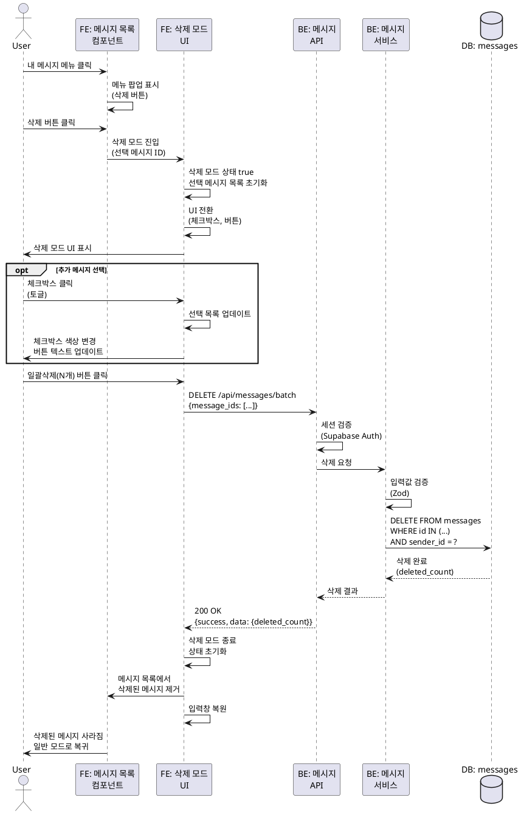

# 유스케이스: UC-013 메시지 삭제

## 제목
채팅방에서 내 메시지 삭제하기 (단일/일괄)

---

## 1. 개요

### 1.1 목적
사용자가 자신이 보낸 메시지를 삭제할 수 있도록 하여, 잘못 전송한 메시지나 불필요한 메시지를 제거할 수 있게 한다.

### 1.2 범위
- 메시지 삭제 모드 진입 (단일 메시지 선택)
- 삭제 대상 메시지 선택/해제 (여러 메시지 토글)
- 메시지 일괄 삭제 실행
- 삭제 모드 취소

**제외 사항**:
- 남의 메시지 삭제 (권한 없음)
- 메시지 수정 기능
- 삭제된 메시지 복구

### 1.3 액터
- **주요 액터**: 로그인한 사용자 (메시지 발신자)
- **부 액터**: 채팅방에 접속한 다른 사용자들 (삭제 후 업데이트 확인)

---

## 2. 선행 조건

- 사용자가 로그인 상태여야 함
- 사용자가 채팅방 상세 페이지(`/chat-rooms/:id`)에 접근한 상태
- 채팅방에 사용자 본인이 보낸 메시지가 1개 이상 존재해야 함

---

## 3. 참여 컴포넌트

### 3.1 프론트엔드
- **메시지 목록 컴포넌트**: 메시지 표시 및 메뉴 버튼
- **메시지 메뉴 컴포넌트**: 삭제 버튼 (내 메시지만)
- **삭제 모드 UI**: 체크박스, 취소/일괄삭제 버튼
- **상태 관리**: 삭제 모드 상태, 선택된 메시지 ID 목록

### 3.2 백엔드
- **메시지 삭제 API**: `DELETE /api/messages/batch`
- **메시지 서비스**: 권한 검증 및 삭제 처리

### 3.3 데이터베이스
- **messages 테이블**: 메시지 삭제
- **message_likes 테이블**: 연관된 좋아요도 CASCADE로 자동 삭제
- **messages.reply_to_message_id**: 답장 대상 메시지 삭제 시 SET NULL

---

## 4. 기본 플로우 (Basic Flow)

### 4.1 단계별 흐름

#### 1. 사용자: 내 메시지 메뉴 열기
- **입력**: 자신의 메시지 우측 메뉴 버튼 클릭
- **처리**: 메시지 메뉴 팝업 표시
- **출력**: 메뉴 항목 표시 (내 메시지: "삭제")

#### 2. 사용자: 삭제 버튼 클릭
- **입력**: 메뉴에서 "삭제" 버튼 클릭
- **처리**: 삭제 모드 진입 이벤트 발생
- **출력**: -

#### 3. 프론트엔드: 삭제 모드 진입
- **입력**: 삭제 버튼 클릭 이벤트, 선택된 메시지 ID
- **처리**:
  - 삭제 모드 상태를 `true`로 설정
  - 선택된 메시지를 삭제 대상 목록에 추가 (초기값)
  - UI 전환:
    - 내 메시지에 체크박스 표시 (파란색: 선택됨, 회색: 선택 안 됨)
    - 하단 입력창을 '취소', '일괄삭제(N개)' 버튼으로 대체
- **출력**:
  - 삭제 모드 UI 표시
  - 초기 선택된 메시지: 파란색 체크
  - 나머지 내 메시지: 회색 체크
  - 남의 메시지: 체크박스 없음

#### 4. 사용자: 삭제 대상 메시지 선택/해제 (선택 사항)
- **입력**: 체크박스 클릭하여 삭제 대상 토글
- **처리**:
  - 체크박스 클릭 시 해당 메시지 ID를 삭제 대상 목록에 추가/제거
  - 삭제 대상 개수 업데이트
- **출력**:
  - 체크박스 색상 변경 (파란색 ↔ 회색)
  - '일괄삭제(N개)' 버튼 텍스트 업데이트
  - N=0인 경우 버튼 비활성화

#### 5. 사용자: 일괄삭제 버튼 클릭
- **입력**: '일괄삭제(N개)' 버튼 클릭
- **처리**: 삭제 요청 이벤트 발생
- **출력**: -

#### 6. 프론트엔드: 삭제 요청 전송
- **입력**: 삭제 대상 메시지 ID 배열
- **처리**: `DELETE /api/messages/batch` API 호출
  - 요청 본문: `{ "message_ids": ["uuid1", "uuid2", ...] }`
- **출력**: 로딩 상태 표시

#### 7. 백엔드: 인증 검증
- **입력**: HTTP 요청의 세션 토큰
- **처리**: Supabase Auth 세션 검증
- **출력**:
  - 성공: 사용자 ID 추출
  - 실패: 401 Unauthorized 응답

#### 8. 백엔드: 입력값 검증
- **입력**: `message_ids` (UUID 배열)
- **처리**:
  - Zod 스키마 검증
  - 배열 길이 확인 (1개 이상)
  - 각 ID가 유효한 UUID인지 확인
- **출력**:
  - 성공: 다음 단계 진행
  - 실패: 400 Bad Request 응답

#### 9. 백엔드: 권한 검증 및 메시지 삭제
- **입력**: 삭제 대상 메시지 ID 배열, 현재 사용자 ID
- **처리**:
  - `messages` 테이블에서 `sender_id = 현재 사용자 ID`인 메시지만 삭제
  - SQL: `DELETE FROM messages WHERE id = ANY($1::uuid[]) AND sender_id = $2`
- **출력**:
  - 성공: 삭제된 메시지 개수 반환
  - 실패: 500 Internal Server Error

#### 10. 백엔드: 응답 반환
- **입력**: 삭제된 메시지 개수
- **처리**: JSON 응답 생성
- **출력**:
  - HTTP 200 OK
  - 응답 본문:
    ```json
    {
      "success": true,
      "data": {
        "deleted_count": 3
      }
    }
    ```

#### 11. 프론트엔드: UI 업데이트
- **입력**: 서버 응답 데이터
- **처리**:
  - 삭제 모드 종료 (상태 초기화)
  - 삭제된 메시지를 목록에서 제거
  - 하단 입력창 복원
  - 메시지 목록 새로고침 (선택 사항)
- **출력**:
  - 삭제된 메시지가 목록에서 사라짐
  - 삭제 모드 UI 제거
  - 일반 입력창 표시

### 4.2 시퀀스 다이어그램



---

## 5. 대안 플로우 (Alternative Flows)

### 5.1 대안 플로우 1: 단일 메시지만 삭제

**시작 조건**: 사용자가 삭제 모드에서 추가 선택 없이 바로 삭제

**단계**:
1. 사용자가 메시지 메뉴에서 "삭제" 클릭
2. 삭제 모드 진입 (해당 메시지만 선택된 상태)
3. 사용자가 바로 '일괄삭제(1개)' 버튼 클릭
4. 기본 플로우 실행 (1개 메시지만 삭제)

**결과**: 선택된 1개 메시지만 삭제됨

### 5.2 대안 플로우 2: 삭제 모드 취소

**시작 조건**: 사용자가 삭제 모드에서 삭제하지 않기로 결정

**단계**:
1. 삭제 모드 진입 후 메시지 선택
2. 사용자가 '취소' 버튼 클릭
3. 프론트엔드에서 삭제 모드 종료:
   - 삭제 모드 상태 `false`로 설정
   - 선택된 메시지 목록 초기화
   - 체크박스 UI 제거
   - 하단 입력창 복원
4. 일반 모드로 복귀

**결과**: 메시지는 삭제되지 않고, 일반 채팅 모드로 복귀

### 5.3 대안 플로우 3: 모든 선택 해제 후 버튼 비활성화

**시작 조건**: 사용자가 모든 메시지 선택을 해제

**단계**:
1. 삭제 모드 진입 (1개 이상 선택된 상태)
2. 사용자가 모든 체크박스를 클릭하여 선택 해제
3. 선택된 메시지 개수가 0이 됨
4. '일괄삭제(0개)' 버튼 비활성화
5. 사용자는 취소하거나 다시 선택해야 함

**결과**: 삭제 버튼이 비활성화되어 실수로 삭제 요청을 보내지 않음

---

## 6. 예외 플로우 (Exception Flows)

### 6.1 예외 상황 1: 삭제 대상이 비어있음

**발생 조건**: 프론트엔드에서 비활성화를 우회하여 빈 배열로 요청

**처리 방법**:
1. 백엔드에서 `message_ids` 배열 길이 검증
2. 배열이 비어있으면 400 Bad Request 응답
3. 에러 메시지: "삭제할 메시지를 선택해주세요."

**에러 코드**: `NO_MESSAGES_SELECTED` (HTTP 400)

**사용자 메시지**: "삭제할 메시지를 선택해주세요."

### 6.2 예외 상황 2: 다른 사용자의 메시지 삭제 시도

**발생 조건**: 권한 없는 메시지 ID가 포함된 경우

**처리 방법**:
1. 백엔드에서 `sender_id = 현재 사용자 ID` 조건으로 삭제
2. 권한 없는 메시지는 자동으로 삭제 대상에서 제외
3. 실제 삭제된 개수만 반환 (에러 아님)
4. (선택) 프론트엔드에서 삭제된 개수가 요청한 개수보다 적으면 경고 표시

**에러 코드**: (에러 아님, 정상 처리)

**사용자 메시지**: (선택) "일부 메시지는 삭제할 수 없습니다."

### 6.3 예외 상황 3: 인증되지 않은 사용자

**발생 조건**: 세션이 만료되었거나 로그아웃된 상태에서 삭제 시도

**처리 방법**:
1. 백엔드에서 401 Unauthorized 응답
2. 프론트엔드에서 인증 상태 초기화
3. 로그인 페이지로 리다이렉트
4. "세션이 만료되었습니다. 다시 로그인해주세요." 메시지 표시

**에러 코드**: `UNAUTHORIZED` (HTTP 401)

**사용자 메시지**: "세션이 만료되었습니다. 다시 로그인해주세요."

### 6.4 예외 상황 4: 이미 삭제된 메시지

**발생 조건**: 삭제 요청 전에 다른 곳에서 이미 삭제됨

**처리 방법**:
1. 백엔드에서 존재하는 메시지만 삭제
2. 존재하지 않는 ID는 무시 (에러 아님)
3. 실제 삭제된 개수만 반환
4. 프론트엔드에서 메시지 목록 새로고침

**에러 코드**: (에러 아님, 정상 처리)

**사용자 메시지**: (선택) "일부 메시지는 이미 삭제되었습니다."

### 6.5 예외 상황 5: 네트워크 연결 끊김

**발생 조건**: 삭제 요청 중 네트워크 오류 발생

**처리 방법**:
1. 네트워크 에러 감지
2. "네트워크 연결을 확인해주세요" 에러 메시지 표시
3. 재시도 버튼 제공
4. 삭제 모드 유지 (선택 상태 유지)

**에러 코드**: `NETWORK_ERROR`

**사용자 메시지**: "네트워크 연결을 확인해주세요."

### 6.6 예외 상황 6: 서버 오류 (5xx)

**발생 조건**: 서버에서 예상치 못한 오류 발생

**처리 방법**:
1. 백엔드에서 500 Internal Server Error 응답
2. 에러 로깅 (서버 측)
3. "일시적인 오류가 발생했습니다. 잠시 후 다시 시도해주세요" 에러 메시지 표시
4. 삭제 모드 유지 또는 종료 (선택)

**에러 코드**: `INTERNAL_SERVER_ERROR` (HTTP 500)

**사용자 메시지**: "일시적인 오류가 발생했습니다. 잠시 후 다시 시도해주세요."

---

## 7. 후행 조건 (Post-conditions)

### 7.1 성공 시

**데이터베이스 변경**:
- `messages` 테이블에서 삭제 대상 메시지 삭제
  - 조건: `id IN (message_ids) AND sender_id = 현재 사용자 ID`
- `message_likes` 테이블에서 연관된 좋아요 자동 삭제 (CASCADE)
- 답장 대상으로 참조된 경우: 참조하는 메시지의 `reply_to_message_id`를 NULL로 설정 (SET NULL)

**시스템 상태**:
- 삭제 모드 종료
- 메시지 목록에서 삭제된 메시지 제거
- 하단 입력창 복원
- 선택 상태 초기화

**외부 시스템**:
- (실시간 업데이트 활성화 시) Supabase Realtime을 통해 다른 사용자에게 메시지 삭제 이벤트 전송

### 7.2 실패 시

**데이터 롤백**:
- 데이터베이스 변경 없음 (DELETE 실패 또는 미실행)

**시스템 상태**:
- 삭제 모드 유지 (선택 상태 유지)
- 에러 메시지 표시
- 재시도 가능

---

## 8. 비즈니스 규칙 (Business Rules)

### BR-1: 본인 메시지만 삭제 가능
- 사용자는 자신이 보낸 메시지만 삭제할 수 있음
- 남의 메시지는 삭제 버튼이 표시되지 않음
- 백엔드에서도 `sender_id` 조건으로 권한 검증

### BR-2: 삭제 모드 진입 조건
- 채팅방에 본인이 보낸 메시지가 1개 이상 있어야 함
- 로그인 상태여야 함

### BR-3: 삭제 대상 개수 제한 없음
- 한 번에 삭제할 수 있는 메시지 개수에 제한 없음
- 단, 최소 1개 이상 선택해야 삭제 버튼 활성화

### BR-4: CASCADE 삭제
- 메시지 삭제 시 연관된 좋아요도 자동 삭제
- 답장 대상 메시지 삭제 시 답장 메시지의 `reply_to_message_id`는 NULL로 설정

### BR-5: 삭제 취소 불가
- 한 번 삭제된 메시지는 복구 불가
- 삭제 전에 명확한 UI 제공 (삭제 모드, 선택 상태 표시)

### BR-6: 삭제 모드 독립성
- 삭제 모드와 일반 모드는 명확히 구분됨
- 삭제 모드에서는 메시지 전송 불가 (입력창 숨김)
- 삭제 모드에서는 답장, 좋아요 등 다른 액션 불가

---

## 9. 비기능 요구사항

### 9.1 성능
- **응답 시간**: 메시지 삭제 API 평균 응답 시간 < 500ms
- **일괄 삭제**: 최대 100개 메시지 동시 삭제 시 < 1초
- **UI 업데이트**: 삭제 후 목록 렌더링 < 200ms

### 9.2 보안
- **인증**: Supabase Auth 세션 검증 (모든 요청)
- **권한**: 본인의 메시지만 삭제 가능 (백엔드에서 `sender_id` 검증)
- **SQL Injection 방지**: Prepared Statement 사용

### 9.3 가용성
- **에러 핸들링**: 모든 예외 상황에 대한 사용자 친화적 에러 메시지
- **재시도 로직**: 네트워크 오류 시 수동 재시도 가능
- **상태 유지**: 네트워크 오류 시 선택 상태 유지

### 9.4 사용성
- **명확한 UI**: 삭제 모드와 일반 모드 구분 명확
- **시각적 피드백**: 선택된 메시지는 파란색 체크, 선택 안 된 메시지는 회색 체크
- **실수 방지**: 삭제 대상이 없으면 버튼 비활성화
- **취소 용이**: 취소 버튼을 눈에 띄게 배치

---

## 10. UI/UX 요구사항

### 10.1 화면 구성

#### 일반 모드
- **내 메시지**: 우측 정렬, 메뉴 버튼 (삭제)
- **남의 메시지**: 좌측 정렬, 메뉴 버튼 (답장, 좋아요)

#### 삭제 모드
- **내 메시지**:
  - 좌측에 체크박스 추가
  - 선택된 메시지: 파란색 체크 아이콘
  - 선택 안 된 메시지: 회색 체크 아이콘
  - 체크박스 클릭 시 선택/해제 토글
- **남의 메시지**: 체크박스 없음 (변화 없음)
- **하단 영역**:
  - 입력창 숨김
  - 좌측: '취소' 버튼 (회색)
  - 우측: '일괄삭제(N개)' 버튼 (빨간색 또는 파란색)
  - N=0인 경우 버튼 비활성화

### 10.2 사용자 경험

- **명확한 모드 전환**: 삭제 모드 진입 시 배경색 변경 또는 헤더 표시
- **즉각적 피드백**: 체크박스 클릭 시 즉시 색상 변경
- **삭제 확인**: (선택) 일괄삭제 버튼 클릭 시 확인 다이얼로그 표시
- **로딩 인디케이터**: 삭제 요청 중 로딩 상태 표시
- **취소 용이**: 취소 버튼을 눈에 띄게 배치, 실수 방지

---

## 11. 테스트 시나리오

### 11.1 성공 케이스

| 테스트 케이스 ID | 입력값 | 기대 결과 |
|----------------|--------|----------|
| TC-013-01 | 단일 메시지 삭제 | 1개 메시지 삭제 성공, 목록에서 제거 |
| TC-013-02 | 여러 메시지 선택 후 일괄 삭제 | 선택된 모든 메시지 삭제 성공 |
| TC-013-03 | 모든 내 메시지 삭제 | 모든 메시지 삭제 성공 |
| TC-013-04 | 삭제 모드 진입 후 취소 | 메시지 삭제되지 않음, 일반 모드 복귀 |
| TC-013-05 | 체크박스 토글 (선택/해제) | 버튼 텍스트 업데이트, 색상 변경 |

### 11.2 실패 케이스

| 테스트 케이스 ID | 입력값 | 기대 결과 |
|----------------|--------|----------|
| TC-013-06 | 삭제 대상 0개로 요청 | 400 에러, "삭제할 메시지를 선택해주세요" |
| TC-013-07 | 남의 메시지 ID 포함 | 권한 있는 메시지만 삭제, 에러 없음 |
| TC-013-08 | 로그아웃 상태에서 삭제 | 401 에러, 로그인 페이지로 리다이렉트 |
| TC-013-09 | 이미 삭제된 메시지 | 존재하는 메시지만 삭제, 에러 없음 |
| TC-013-10 | 네트워크 끊김 상태 | 네트워크 에러, 재시도 버튼 표시 |

---

## 12. 관련 유스케이스

### 선행 유스케이스
- **UC-002**: 로그인
- **UC-007**: 채팅방 상세 조회
- **UC-008**: 메시지 목록 조회
- **UC-009**: 텍스트 메시지 전송 (삭제할 메시지 생성)

### 후행 유스케이스
- **UC-008**: 메시지 목록 조회 (삭제 후 새로고침)

### 연관 유스케이스
- **UC-011**: 메시지 좋아요 (삭제 시 좋아요도 CASCADE 삭제)
- **UC-009**: 메시지 답장 (답장 대상 삭제 시 SET NULL)

---

## 13. 변경 이력

| 버전 | 날짜 | 작성자 | 변경 내용 |
|------|------|--------|-----------|
| 1.0 | 2025-10-20 | Claude Code | 초기 작성 |

---

## 부록

### A. 용어 정의

- **삭제 모드**: 여러 메시지를 선택하여 일괄 삭제할 수 있는 UI 상태
- **삭제 대상**: 삭제 모드에서 선택된 메시지들
- **일괄 삭제**: 여러 메시지를 한 번에 삭제하는 동작
- **CASCADE 삭제**: 메시지 삭제 시 연관된 좋아요도 자동으로 삭제되는 것
- **SET NULL**: 답장 대상 메시지 삭제 시 답장 메시지의 참조를 NULL로 설정하는 것

### B. 참고 자료

- PRD 문서: `/docs/prd.md`
- Userflow 문서: `/docs/userflow.md` - 3.6, 3.7, 3.8 메시지 삭제
- Database 문서: `/docs/database.md` - messages, message_likes 테이블
- API 명세: `DELETE /api/messages/batch`

### C. API 명세 상세

#### 요청

```http
DELETE /api/messages/batch
Content-Type: application/json
Authorization: Bearer <session_token>

{
  "message_ids": [
    "550e8400-e29b-41d4-a716-446655440000",
    "550e8400-e29b-41d4-a716-446655440001",
    "550e8400-e29b-41d4-a716-446655440002"
  ]
}
```

#### 응답 (성공)

```http
HTTP/1.1 200 OK
Content-Type: application/json

{
  "success": true,
  "data": {
    "deleted_count": 3
  }
}
```

#### 응답 (실패 - 선택된 메시지 없음)

```http
HTTP/1.1 400 Bad Request
Content-Type: application/json

{
  "success": false,
  "error": {
    "code": "NO_MESSAGES_SELECTED",
    "message": "삭제할 메시지를 선택해주세요."
  }
}
```

#### 응답 (실패 - 인증 오류)

```http
HTTP/1.1 401 Unauthorized
Content-Type: application/json

{
  "success": false,
  "error": {
    "code": "UNAUTHORIZED",
    "message": "세션이 만료되었습니다. 다시 로그인해주세요."
  }
}
```

---

**문서 종료**
