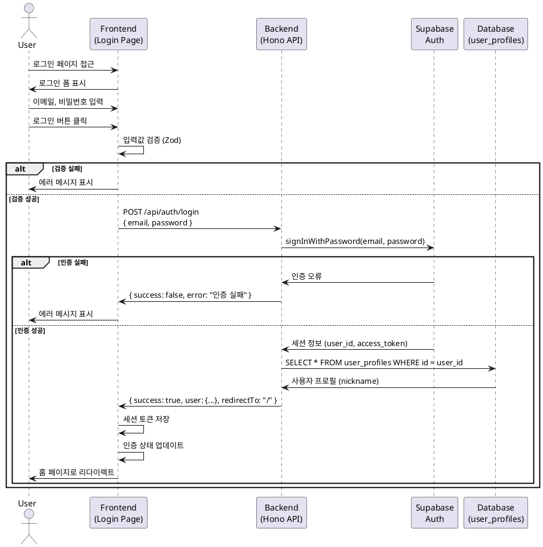

# 유스케이스: 로그인

## 유스케이스 ID: UC-002

### 제목
사용자 로그인

---

## 1. 개요

### 1.1 목적
등록된 사용자가 이메일과 비밀번호를 입력하여 채팅 서비스에 로그인하고, 인증된 상태로 서비스를 이용할 수 있도록 한다.

### 1.2 범위
- 로그인 페이지에서 이메일/비밀번호 입력 및 검증
- Supabase Auth를 통한 인증 처리
- 세션 생성 및 인증 상태 관리
- 로그인 성공 시 홈 페이지 또는 이전 페이지로 리다이렉트
- 로그인 실패 시 에러 메시지 표시

**제외 사항:**
- 소셜 로그인 (향후 확장 가능)
- 자동 로그인 (Remember Me)
- 이중 인증 (2FA)

### 1.3 액터
- **주요 액터**: 미인증 사용자 (회원가입을 완료한 사용자)
- **부 액터**: Supabase Auth 서비스

---

## 2. 선행 조건

- 사용자가 이미 회원가입을 완료하여 계정이 존재한다.
- 사용자가 로그인 페이지(`/login`)에 접근할 수 있다.
- 사용자가 현재 로그인되지 않은 상태이다.

---

## 3. 참여 컴포넌트

- **프론트엔드 (FE)**:
  - 로그인 페이지 컴포넌트 (`/app/login/page.tsx`)
  - React Hook Form + Zod를 사용한 클라이언트 검증
  - React Query를 통한 API 호출

- **백엔드 (BE)**:
  - Hono 라우터 (`POST /api/auth/login`)
  - Supabase Auth 클라이언트
  - 세션 관리 미들웨어

- **데이터베이스 (DB)**:
  - Supabase Auth (`auth.users`)
  - `user_profiles` 테이블 (닉네임 조회용)

---

## 4. 기본 플로우 (Basic Flow)

### 4.1 단계별 흐름

1. **사용자**: 로그인 페이지(`/login`) 접근
   - 입력: URL 직접 입력 또는 링크 클릭
   - 처리: Next.js 라우팅
   - 출력: 로그인 폼 표시

2. **사용자**: 이메일과 비밀번호 입력
   - 입력: 이메일 (문자열), 비밀번호 (문자열)
   - 처리: React Hook Form 상태 관리
   - 출력: 입력 필드 값 업데이트

3. **사용자**: 로그인 버튼 클릭
   - 입력: 버튼 클릭 이벤트
   - 처리: 폼 제출 트리거
   - 출력: 검증 시작

4. **프론트엔드**: 입력값 검증 (Zod)
   - 입력: 이메일, 비밀번호
   - 처리:
     - 이메일: 비어있지 않은지 확인
     - 비밀번호: 비어있지 않은지 확인
   - 출력: 검증 성공 시 API 요청, 실패 시 에러 메시지 표시

5. **프론트엔드**: 로그인 API 요청
   - 입력: `{ email, password }`
   - 처리: `POST /api/auth/login` 요청 전송
   - 출력: 로딩 상태 표시

6. **백엔드**: 요청 수신 및 Supabase Auth 인증
   - 입력: `{ email, password }`
   - 처리:
     - Supabase Auth `signInWithPassword` 호출
     - 인증 성공 시 세션 토큰 생성
   - 출력: 세션 정보 또는 에러

7. **백엔드**: 사용자 프로필 조회
   - 입력: 인증된 사용자 ID
   - 처리: `user_profiles` 테이블에서 닉네임 조회
   - 출력: 사용자 프로필 정보

8. **백엔드**: 응답 반환
   - 입력: 세션 정보, 사용자 프로필
   - 처리: JSON 응답 생성
   - 출력: `{ success: true, user: { id, email, nickname }, redirectTo: '/' }`

9. **프론트엔드**: 응답 처리
   - 입력: 성공 응답
   - 처리:
     - 세션 토큰을 쿠키 또는 로컬 스토리지에 저장
     - 인증 상태 업데이트 (React Query 캐시)
   - 출력: 리다이렉트 준비

10. **프론트엔드**: 페이지 리다이렉트
    - 입력: `redirectTo` 경로 (기본값: `/`)
    - 처리: Next.js 라우터를 통한 페이지 이동
    - 출력: 홈 페이지 또는 `redirectedFrom` 파라미터로 지정된 페이지로 이동

### 4.2 시퀀스 다이어그램



---

## 5. 대안 플로우 (Alternative Flows)

### 5.1 대안 플로우 1: redirectedFrom 파라미터를 통한 리다이렉트

**시작 조건**: 비인증 사용자가 인증이 필요한 페이지에 접근하여 로그인 페이지로 리다이렉트된 경우

**단계**:
1. 사용자가 로그인 페이지 접근 시 URL에 `redirectedFrom` 파라미터가 포함됨
   - 예: `/login?redirectedFrom=/chat-rooms/abc-123`
2. 로그인 성공 시 백엔드가 `redirectTo` 값으로 `redirectedFrom` 경로를 반환
3. 프론트엔드가 해당 경로로 리다이렉트

**결과**: 사용자가 원래 접근하려던 페이지로 이동

### 5.2 대안 플로우 2: 이미 로그인된 사용자의 로그인 페이지 접근

**시작 조건**: 사용자가 이미 인증된 상태에서 로그인 페이지에 접근

**단계**:
1. 프론트엔드에서 인증 상태 확인 (페이지 로드 시)
2. 이미 로그인된 상태임을 감지
3. 자동으로 홈 페이지(`/`)로 리다이렉트

**결과**: 로그인 페이지가 표시되지 않고 홈 페이지로 이동

---

## 6. 예외 플로우 (Exception Flows)

### 6.1 예외 상황 1: 존재하지 않는 이메일

**발생 조건**: 사용자가 회원가입하지 않은 이메일을 입력한 경우

**처리 방법**:
1. Supabase Auth에서 인증 실패 응답 반환
2. 백엔드가 에러 응답 생성
3. 프론트엔드가 "이메일 또는 비밀번호가 잘못되었습니다" 메시지 표시

**에러 코드**: `AUTH_INVALID_CREDENTIALS` (HTTP 401)

**사용자 메시지**: "이메일 또는 비밀번호가 올바르지 않습니다."

### 6.2 예외 상황 2: 잘못된 비밀번호

**발생 조건**: 사용자가 올바른 이메일이지만 잘못된 비밀번호를 입력한 경우

**처리 방법**:
1. Supabase Auth에서 인증 실패 응답 반환
2. 백엔드가 에러 응답 생성
3. 프론트엔드가 "이메일 또는 비밀번호가 잘못되었습니다" 메시지 표시

**에러 코드**: `AUTH_INVALID_CREDENTIALS` (HTTP 401)

**사용자 메시지**: "이메일 또는 비밀번호가 올바르지 않습니다."

**참고**: 보안상 이메일 존재 여부를 노출하지 않기 위해 동일한 메시지 사용

### 6.3 예외 상황 3: 빈 입력값

**발생 조건**: 사용자가 이메일 또는 비밀번호를 입력하지 않고 로그인 시도

**처리 방법**:
1. 클라이언트 측 Zod 검증에서 에러 감지
2. API 요청을 보내지 않음
3. 해당 필드 아래 에러 메시지 표시

**에러 코드**: 클라이언트 검증 (API 요청 없음)

**사용자 메시지**:
- 이메일: "이메일을 입력해주세요."
- 비밀번호: "비밀번호를 입력해주세요."

### 6.4 예외 상황 4: 네트워크 오류

**발생 조건**: 로그인 API 요청 중 네트워크 연결이 끊김

**처리 방법**:
1. 프론트엔드에서 네트워크 에러 감지
2. React Query의 에러 처리 로직 실행
3. 사용자에게 네트워크 오류 메시지 표시

**에러 코드**: `NETWORK_ERROR` (클라이언트 측)

**사용자 메시지**: "네트워크 연결을 확인해주세요."

### 6.5 예외 상황 5: 서버 오류 (5xx)

**발생 조건**: Supabase 또는 백엔드 서버에서 예상치 못한 오류 발생

**처리 방법**:
1. 백엔드에서 5xx 응답 반환
2. 에러 로깅 (서버 측)
3. 프론트엔드에서 일반적인 에러 메시지 표시

**에러 코드**: `INTERNAL_SERVER_ERROR` (HTTP 500)

**사용자 메시지**: "일시적인 오류가 발생했습니다. 잠시 후 다시 시도해주세요."

### 6.6 예외 상황 6: 세션 만료

**발생 조건**: 로그인 후 일정 시간이 지나 세션이 만료된 경우

**처리 방법**:
1. API 요청 시 401 Unauthorized 응답 수신
2. 프론트엔드에서 인증 상태 초기화
3. 로그인 페이지로 리다이렉트
4. "세션이 만료되었습니다. 다시 로그인해주세요." 메시지 표시

**에러 코드**: `SESSION_EXPIRED` (HTTP 401)

**사용자 메시지**: "세션이 만료되었습니다. 다시 로그인해주세요."

---

## 7. 후행 조건 (Post-conditions)

### 7.1 성공 시

- **세션 상태**:
  - Supabase Auth 세션이 생성됨
  - 세션 토큰이 쿠키/로컬 스토리지에 저장됨
  - 클라이언트 측 인증 상태가 "인증됨"으로 업데이트됨

- **사용자 상태**:
  - 사용자가 인증된 상태로 전환
  - 홈 페이지 또는 원래 접근하려던 페이지로 이동

- **시스템 상태**:
  - 사용자가 인증이 필요한 모든 페이지에 접근 가능
  - API 요청 시 인증 토큰이 자동으로 포함됨

### 7.2 실패 시

- **세션 상태**:
  - 세션이 생성되지 않음
  - 인증 상태는 "미인증"으로 유지

- **사용자 상태**:
  - 사용자는 로그인 페이지에 머무름
  - 에러 메시지가 표시됨
  - 입력한 비밀번호는 초기화됨 (보안)

- **시스템 상태**:
  - 인증이 필요한 페이지에 접근 불가
  - 로그인/회원가입 페이지만 접근 가능

---

## 8. 비기능 요구사항

### 8.1 성능
- 로그인 API 응답 시간: 평균 500ms 이하
- 페이지 로딩 시간: 1.5초 이하
- 로그인 성공 후 리다이렉트 시간: 200ms 이하

### 8.2 보안
- **인증**: Supabase Auth를 통한 안전한 인증 처리
- **암호화**: HTTPS를 통한 통신 (비밀번호 평문 전송 방지)
- **세션 관리**:
  - 세션 토큰은 HttpOnly 쿠키로 저장 (XSS 공격 방지)
  - CSRF 방지: Supabase Auth 토큰 사용
- **에러 메시지**: 이메일 존재 여부를 노출하지 않음 (계정 열거 공격 방지)
- **입력 검증**: XSS 방지를 위한 입력값 sanitization

### 8.3 가용성
- Supabase Auth 서비스 가용성: 99.9% 이상
- 로그인 실패 시 사용자 친화적인 에러 메시지 제공
- 네트워크 오류 시 재시도 안내

### 8.4 사용성
- 간결한 로그인 폼 (이메일, 비밀번호만)
- 명확한 에러 메시지
- 로딩 상태 표시 (버튼 비활성화, 스피너)
- 회원가입 페이지로 이동 링크 제공

---

## 9. UI/UX 요구사항

### 9.1 화면 구성

**로그인 페이지 (`/login`)**:
- 서비스 로고
- 이메일 입력 필드
  - 타입: `email`
  - 플레이스홀더: "이메일을 입력하세요"
  - 자동완성: `autocomplete="email"`
- 비밀번호 입력 필드
  - 타입: `password`
  - 플레이스홀더: "비밀번호를 입력하세요"
  - 자동완성: `autocomplete="current-password"`
- 로그인 버튼
  - 레이블: "로그인"
  - 비활성화 조건: 로딩 중
- 회원가입 링크
  - 레이블: "계정이 없으신가요? 회원가입"
  - 경로: `/signup`
- 에러 메시지 표시 영역
  - 위치: 해당 필드 아래 또는 폼 상단

### 9.2 사용자 경험

- **폼 검증**:
  - 실시간 검증 없음 (제출 시에만 검증)
  - 에러 메시지는 빨간색으로 표시
  - 에러 발생 시 해당 필드에 포커스

- **로딩 상태**:
  - 로그인 버튼 클릭 시 버튼 비활성화
  - 로딩 스피너 표시
  - 입력 필드 비활성화 (중복 제출 방지)

- **성공 시**:
  - 부드러운 페이지 전환 (Next.js 라우팅)
  - 로딩 인디케이터 표시

- **실패 시**:
  - 에러 메시지 표시
  - 비밀번호 필드 초기화
  - 이메일 필드에 포커스

- **접근성**:
  - 키보드 탐색 지원 (Tab, Enter)
  - ARIA 레이블 적용
  - 스크린 리더 지원

---

## 10. 비즈니스 규칙

### 10.1 인증 규칙
- Supabase Auth를 통해서만 인증 처리
- 클라이언트와 서버 측 인증 방식이 동일해야 함
- 세션 토큰은 Supabase Auth에서 관리

### 10.2 접근 제어
- 비로그인 사용자는 로그인/회원가입 페이지만 접근 가능
- 로그인된 사용자가 로그인 페이지 접근 시 자동으로 홈으로 리다이렉트
- 인증이 필요한 페이지 접근 시 로그인 페이지로 리다이렉트 (`redirectedFrom` 파라미터 포함)

### 10.3 보안 규칙
- 비밀번호는 평문으로 저장하지 않음 (Supabase Auth가 처리)
- 로그인 실패 시 이메일 존재 여부를 노출하지 않음
- 세션 토큰은 HttpOnly 쿠키로 저장

### 10.4 에러 처리 규칙
- 클라이언트 검증 에러: API 요청 없이 즉시 표시
- 서버 검증 에러: API 응답 후 표시
- 일반 에러 메시지 사용 (보안상 상세 정보 노출 금지)

---

## 11. API 명세

### 11.1 로그인 API

**엔드포인트**: `POST /api/auth/login`

**요청**:
```json
{
  "email": "user@example.com",
  "password": "password123"
}
```

**요청 스키마 (Zod)**:
```typescript
{
  email: z.string().email(),
  password: z.string().min(1)
}
```

**성공 응답** (HTTP 200):
```json
{
  "success": true,
  "user": {
    "id": "uuid",
    "email": "user@example.com",
    "nickname": "사용자닉네임"
  },
  "redirectTo": "/"
}
```

**실패 응답** (HTTP 401):
```json
{
  "success": false,
  "error": "AUTH_INVALID_CREDENTIALS",
  "message": "이메일 또는 비밀번호가 올바르지 않습니다."
}
```

**실패 응답** (HTTP 500):
```json
{
  "success": false,
  "error": "INTERNAL_SERVER_ERROR",
  "message": "일시적인 오류가 발생했습니다. 잠시 후 다시 시도해주세요."
}
```

---

## 12. 테스트 시나리오

### 12.1 성공 케이스

| 테스트 케이스 ID | 입력값 | 기대 결과 |
|----------------|--------|----------|
| TC-002-01 | 올바른 이메일, 비밀번호 | 로그인 성공, 홈 페이지로 리다이렉트 |
| TC-002-02 | 올바른 이메일, 비밀번호 + redirectedFrom 파라미터 | 로그인 성공, redirectedFrom 페이지로 리다이렉트 |
| TC-002-03 | 로그인된 상태에서 로그인 페이지 접근 | 자동으로 홈 페이지로 리다이렉트 |

### 12.2 실패 케이스

| 테스트 케이스 ID | 입력값 | 기대 결과 |
|----------------|--------|----------|
| TC-002-04 | 빈 이메일, 올바른 비밀번호 | 클라이언트 검증 에러: "이메일을 입력해주세요." |
| TC-002-05 | 올바른 이메일, 빈 비밀번호 | 클라이언트 검증 에러: "비밀번호를 입력해주세요." |
| TC-002-06 | 존재하지 않는 이메일, 임의 비밀번호 | 서버 에러: "이메일 또는 비밀번호가 올바르지 않습니다." |
| TC-002-07 | 올바른 이메일, 잘못된 비밀번호 | 서버 에러: "이메일 또는 비밀번호가 올바르지 않습니다." |
| TC-002-08 | 네트워크 연결 끊김 상태에서 로그인 시도 | 네트워크 에러: "네트워크 연결을 확인해주세요." |

---

## 13. 관련 유스케이스

- **선행 유스케이스**:
  - UC-001: 회원가입 (로그인하기 위해서는 먼저 회원가입이 필요)

- **후행 유스케이스**:
  - UC-003: 로그아웃
  - UC-005: 채팅방 목록 조회
  - UC-011: 마이페이지 조회

- **연관 유스케이스**:
  - UC-001: 회원가입 (로그인 페이지에서 회원가입 링크 제공)

---

## 14. 변경 이력

| 버전 | 날짜 | 작성자 | 변경 내용 |
|------|------|--------|-----------|
| 1.0  | 2025-10-20 | Claude Code | 초기 작성 |

---

## 부록

### A. 용어 정의

- **Supabase Auth**: Supabase에서 제공하는 인증 서비스로, 사용자 등록, 로그인, 세션 관리 등을 처리
- **세션 토큰**: 인증된 사용자를 식별하기 위한 임시 토큰
- **redirectedFrom**: 비인증 사용자가 인증이 필요한 페이지에 접근했을 때, 로그인 후 돌아갈 페이지를 지정하는 URL 파라미터
- **HttpOnly 쿠키**: JavaScript에서 접근할 수 없는 쿠키로, XSS 공격을 방지

### B. 참고 자료

- [Supabase Auth Documentation](https://supabase.com/docs/guides/auth)
- [Next.js Authentication](https://nextjs.org/docs/authentication)
- [React Hook Form](https://react-hook-form.com/)
- [Zod Validation](https://zod.dev/)
- PRD: `/docs/prd.md`
- Userflow: `/docs/userflow.md` (섹션 1.2)
- Database: `/docs/database.md`
