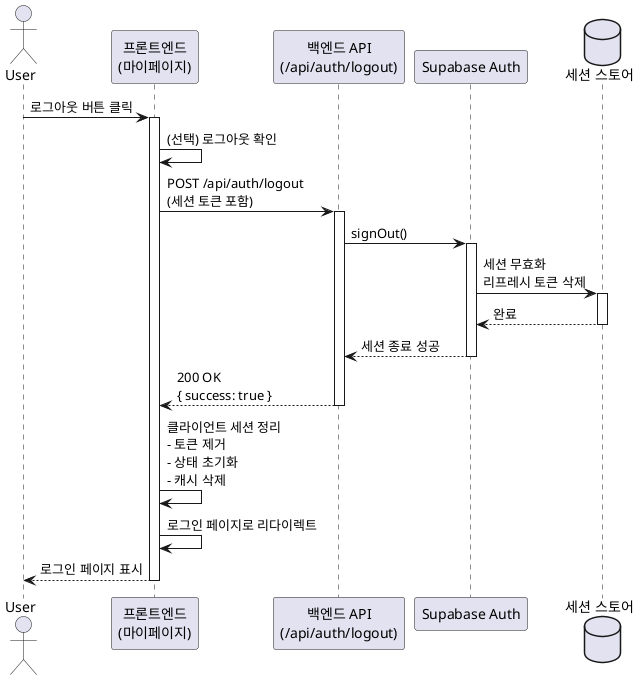

# 유스케이스: 로그아웃

## 유스케이스 ID: UC-003

### 제목
사용자 로그아웃

---

## 1. 개요

### 1.1 목적
로그인된 사용자가 시스템에서 안전하게 로그아웃하여 인증 세션을 종료하고, 비인증 상태로 전환합니다.

### 1.2 범위
- 마이페이지에서 로그아웃 버튼을 통한 세션 종료
- 클라이언트 및 서버 측 세션 정리
- 로그인 페이지로 리다이렉트
- **제외 사항**: 자동 로그아웃, 타임아웃 처리 (향후 확장 가능)

### 1.3 액터
- **주요 액터**: 로그인된 사용자
- **부 액터**: Supabase Auth (인증 서비스)

---

## 2. 선행 조건

- 사용자가 로그인된 상태여야 함
- 유효한 Supabase Auth 세션이 존재해야 함
- 사용자가 마이페이지(`/my-page`)에 접근 가능한 상태여야 함

---

## 3. 참여 컴포넌트

- **프론트엔드**: 마이페이지 컴포넌트, 로그아웃 버튼 UI
- **백엔드 API**: `POST /api/auth/logout` 엔드포인트
- **Supabase Auth**: 세션 관리 및 로그아웃 처리
- **인증 미들웨어**: 세션 검증 및 컨텍스트 주입
- **클라이언트 스토리지**: 세션 토큰 저장소 (쿠키/로컬 스토리지)

---

## 4. 기본 플로우 (Basic Flow)

### 4.1 트리거
사용자가 마이페이지에서 '로그아웃' 버튼을 클릭

### 4.2 단계별 흐름

1. **사용자**: 마이페이지(`/my-page`)에서 '로그아웃' 버튼 클릭
   - 입력: 버튼 클릭 이벤트
   - 처리: 로그아웃 확인 (선택 사항)
   - 출력: 로그아웃 요청 시작

2. **프론트엔드**: 서버에 로그아웃 요청 전송
   - 입력: 없음 (현재 세션 정보 사용)
   - 처리: `POST /api/auth/logout` API 호출
   - 출력: 서버 응답 대기

3. **백엔드 API**: 로그아웃 요청 처리
   - 입력: 세션 토큰 (쿠키/헤더)
   - 처리: Supabase Auth `signOut()` 호출
   - 출력: 로그아웃 성공 응답

4. **Supabase Auth**: 세션 종료
   - 입력: 세션 토큰
   - 처리:
     - 서버 측 세션 무효화
     - 리프레시 토큰 삭제
   - 출력: 세션 종료 완료

5. **프론트엔드**: 클라이언트 측 세션 정리
   - 입력: 서버 응답
   - 처리:
     - 세션 토큰 제거 (쿠키/로컬 스토리지)
     - 인증 상태 초기화
     - React Query 캐시 초기화
     - Zustand 전역 상태 초기화
   - 출력: 로그인 페이지로 리다이렉트

6. **시스템**: 로그인 페이지 표시
   - 입력: 리다이렉트 요청
   - 처리: `/login` 페이지 렌더링
   - 출력: 로그인 페이지 화면 표시

### 4.3 시퀀스 다이어그램



---

## 5. 대안 플로우 (Alternative Flows)

### 5.1 대안 플로우 1: 네트워크 연결 끊김

**시작 조건**: 로그아웃 API 요청 중 네트워크 오류 발생

**단계**:
1. 프론트엔드에서 API 요청 실패 감지
2. 서버 측 세션은 종료되지 않았으나, 클라이언트 측에서 세션 토큰 삭제
3. 로그인 페이지로 리다이렉트
4. 사용자에게 "로그아웃이 완료되었습니다" 메시지 표시

**결과**:
- 클라이언트 측 세션은 제거되어 로그인 페이지로 이동
- 서버 측 세션은 유지될 수 있으나, 다음 로그인 시 새 세션 생성
- 사용자 경험상 로그아웃 완료로 처리

**비고**: Supabase Auth의 세션은 시간이 지나면 자동 만료되므로, 클라이언트 측 정리만으로도 충분한 보안 수준 유지

### 5.2 대안 플로우 2: 이미 로그아웃된 상태

**시작 조건**: 로그아웃 버튼 클릭 시점에 이미 세션이 만료되어 있음

**단계**:
1. 프론트엔드에서 로그아웃 API 요청 전송
2. 백엔드에서 401 Unauthorized 응답 (세션 없음)
3. 프론트엔드에서 클라이언트 세션 정리
4. 로그인 페이지로 리다이렉트

**결과**: 정상적으로 로그인 페이지로 이동, 에러 메시지 없음

---

## 6. 예외 플로우 (Exception Flows)

### 6.1 예외 상황 1: 서버 오류 (5xx)

**발생 조건**: 로그아웃 처리 중 서버에서 예상치 못한 오류 발생

**처리 방법**:
1. 백엔드에서 5xx 에러 응답
2. 프론트엔드에서 에러 감지
3. 클라이언트 측 세션 정리 (토큰 제거)
4. 로그인 페이지로 리다이렉트
5. 에러 로깅 (서버 측)

**에러 코드**: `500 Internal Server Error`

**사용자 메시지**: "로그아웃 처리 중 문제가 발생했습니다. 다시 시도해주세요."

**비고**: 클라이언트 측 세션은 제거하여 보안 유지

### 6.2 예외 상황 2: Supabase Auth 연결 실패

**발생 조건**: Supabase Auth 서비스 연결 불가 또는 타임아웃

**처리 방법**:
1. 백엔드에서 Supabase Auth 호출 실패
2. 에러 로깅
3. 503 Service Unavailable 응답
4. 프론트엔드에서 클라이언트 세션 정리
5. 로그인 페이지로 리다이렉트

**에러 코드**: `503 Service Unavailable`

**사용자 메시지**: "인증 서비스에 일시적인 문제가 발생했습니다. 잠시 후 다시 시도해주세요."

---

## 7. 후행 조건 (Post-conditions)

### 7.1 성공 시

- **세션 상태**:
  - Supabase Auth 세션 종료 및 리프레시 토큰 삭제
  - 클라이언트 측 세션 토큰 제거 (쿠키/로컬 스토리지)
- **시스템 상태**:
  - 사용자 인증 상태 초기화
  - React Query 캐시 초기화
  - Zustand 전역 상태 초기화
- **페이지 상태**: 로그인 페이지(`/login`)로 리다이렉트
- **데이터베이스 변경**: 없음 (세션 정보만 삭제)

### 7.2 실패 시

- **클라이언트 세션**: 반드시 제거 (보안 우선)
- **시스템 상태**: 로그인 페이지로 리다이렉트
- **서버 세션**: 유지될 수 있으나, 자동 만료 대기
- **에러 로깅**: 서버 측 에러 로그 기록

---

## 8. 비즈니스 규칙

### 8.1 보안 규칙
- 로그아웃 실패 시에도 클라이언트 측 세션은 반드시 제거
- 로그아웃 후 브라우저 뒤로가기로 인증 페이지 접근 불가
- 로그아웃 API는 인증된 사용자만 호출 가능 (미들웨어 검증)

### 8.2 UX 규칙
- 로그아웃 확인 다이얼로그는 선택 사항 (사용자 경험 고려)
- 로그아웃 후 로그인 페이지로 즉시 리다이렉트
- 에러 발생 시에도 사용자는 로그인 페이지로 이동
- 네트워크 오류 시 에러 메시지 없이 로그아웃 완료 처리

### 8.3 데이터 처리
- 사용자 데이터는 유지 (로그아웃은 세션 종료만)
- React Query 캐시는 전체 초기화
- Zustand 전역 상태는 초기값으로 리셋

---

## 9. 비기능 요구사항

### 9.1 성능
- 로그아웃 API 응답 시간: 평균 300ms 이하
- 페이지 리다이렉트 시간: 100ms 이하
- 전체 로그아웃 프로세스: 1초 이내 완료

### 9.2 보안
- 로그아웃 후 기존 세션 토큰 완전 무효화
- 리프레시 토큰 삭제로 재인증 불가
- CSRF 방지: Supabase Auth 토큰 사용
- XSS 방지: 세션 토큰은 HttpOnly 쿠키 사용 권장

### 9.3 가용성
- Supabase Auth 연결 실패 시에도 클라이언트 로그아웃 처리
- 네트워크 오류 시에도 사용자 경험 유지
- 로그아웃 실패율 < 0.1%

---

## 10. UI/UX 요구사항

### 10.1 화면 구성
- **마이페이지**:
  - 헤더: 뒤로가기 버튼
  - 사용자 정보 표시 (이메일, 닉네임)
  - 닉네임 수정 폼
  - **로그아웃 버튼**: 하단에 명확하게 배치, 강조 색상 사용

### 10.2 사용자 경험
- 로그아웃 버튼 클릭 시:
  - (선택) 확인 다이얼로그: "로그아웃 하시겠습니까?"
  - 로딩 인디케이터 표시 (짧은 시간)
  - 완료 후 즉시 로그인 페이지로 이동
- 에러 발생 시:
  - 토스트 메시지로 에러 표시 (짧은 시간)
  - 로그인 페이지로 자동 이동

### 10.3 접근성
- 로그아웃 버튼은 키보드 접근 가능
- 스크린 리더 지원: "로그아웃" 레이블 명확히 제공
- 버튼 크기: 최소 44x44px (터치 타겟)

---

## 11. 테스트 시나리오

### 11.1 성공 케이스

| 테스트 케이스 ID | 전제 조건 | 수행 단계 | 기대 결과 |
|----------------|----------|----------|----------|
| TC-003-01 | 로그인된 상태 | 마이페이지에서 로그아웃 버튼 클릭 | 로그아웃 성공, 로그인 페이지로 이동 |
| TC-003-02 | 로그인된 상태 | 로그아웃 후 브라우저 뒤로가기 | 로그인 페이지로 리다이렉트 (인증 필요 페이지 접근 불가) |
| TC-003-03 | 로그인된 상태 | 로그아웃 후 직접 `/my-page` URL 접근 | 로그인 페이지로 리다이렉트 |

### 11.2 실패 케이스

| 테스트 케이스 ID | 전제 조건 | 수행 단계 | 기대 결과 |
|----------------|----------|----------|----------|
| TC-003-04 | 로그인된 상태 | 네트워크 연결 끊김 상태에서 로그아웃 | 클라이언트 세션 제거, 로그인 페이지로 이동 |
| TC-003-05 | 세션 만료 상태 | 로그아웃 버튼 클릭 | 401 에러 무시, 로그인 페이지로 이동 |
| TC-003-06 | 로그인된 상태 | Supabase Auth 서비스 다운 | 503 에러, 클라이언트 세션 제거 후 로그인 페이지로 이동 |

### 11.3 Edge Case 테스트

| 테스트 케이스 ID | 전제 조건 | 수행 단계 | 기대 결과 |
|----------------|----------|----------|----------|
| TC-003-07 | 로그인된 상태 | 로그아웃 버튼 연속 클릭 | 첫 클릭만 처리, 중복 요청 방지 |
| TC-003-08 | 로그인된 상태 | 로그아웃 중 페이지 새로고침 | 로그아웃 완료 후 로그인 페이지 표시 |
| TC-003-09 | 여러 탭에서 로그인 | 한 탭에서 로그아웃 | 모든 탭에서 세션 종료 (세션 스토리지 공유) |

---

## 12. API 명세

### 12.1 로그아웃 API

**엔드포인트**: `POST /api/auth/logout`

**요청**:
```http
POST /api/auth/logout HTTP/1.1
Content-Type: application/json
Cookie: sb-access-token=<token>; sb-refresh-token=<token>
```

**요청 본문**: 없음

**응답 (성공)**:
```json
{
  "success": true,
  "message": "로그아웃이 완료되었습니다"
}
```

**응답 코드**:
- `200 OK`: 로그아웃 성공
- `401 Unauthorized`: 세션 없음 (이미 로그아웃됨)
- `500 Internal Server Error`: 서버 오류
- `503 Service Unavailable`: Supabase Auth 연결 실패

---

## 13. 관련 유스케이스

- **선행 유스케이스**:
  - UC-002: 로그인 (로그인된 상태여야 로그아웃 가능)
  - UC-001: 회원가입 (회원가입 후 로그인 → 로그아웃)
- **후행 유스케이스**:
  - UC-002: 로그인 (로그아웃 후 재로그인)
- **연관 유스케이스**:
  - UC-004: 닉네임 수정 (같은 마이페이지에서 수행)
  - 세션 만료 처리 (자동 로그아웃)

---

## 14. 구현 참고사항

### 14.1 프론트엔드 구현
```typescript
// 예시: React Query를 사용한 로그아웃 훅
const useLogout = () => {
  const queryClient = useQueryClient();

  return useMutation({
    mutationFn: async () => {
      const response = await apiClient.post('/api/auth/logout');
      return response.data;
    },
    onSuccess: () => {
      // 클라이언트 세션 정리
      queryClient.clear();
      // Zustand 상태 초기화
      authStore.reset();
      // 로그인 페이지로 리다이렉트
      router.push('/login');
    },
    onError: (error) => {
      // 에러 발생 시에도 클라이언트 세션 정리
      queryClient.clear();
      authStore.reset();
      router.push('/login');
    },
  });
};
```

### 14.2 백엔드 구현
```typescript
// 예시: Hono 라우터
app.post('/api/auth/logout', async (c) => {
  try {
    const supabase = c.get('supabase');
    const { error } = await supabase.auth.signOut();

    if (error) {
      c.get('logger').error('Logout failed', error);
      return c.json({ success: false, message: '로그아웃 실패' }, 500);
    }

    return c.json({ success: true, message: '로그아웃 완료' });
  } catch (error) {
    c.get('logger').error('Logout exception', error);
    return c.json({ success: false, message: '서버 오류' }, 500);
  }
});
```

---

## 15. 변경 이력

| 버전 | 날짜 | 작성자 | 변경 내용 |
|------|------|--------|-----------|
| 1.0  | 2025-10-20 | Claude Code | 초기 작성 |

---

## 부록

### A. 용어 정의

- **세션 (Session)**: 사용자 인증 상태를 유지하는 임시 데이터
- **액세스 토큰 (Access Token)**: API 요청 시 사용하는 단기 인증 토큰
- **리프레시 토큰 (Refresh Token)**: 액세스 토큰 갱신을 위한 장기 토큰
- **Supabase Auth**: Supabase에서 제공하는 인증 서비스
- **세션 무효화**: 서버 측에서 세션을 삭제하여 더 이상 사용할 수 없게 만드는 것

### B. 참고 자료

- [Supabase Auth Documentation - Sign Out](https://supabase.com/docs/reference/javascript/auth-signout)
- [Next.js Authentication Best Practices](https://nextjs.org/docs/authentication)
- [React Query - Cache Management](https://tanstack.com/query/latest/docs/react/guides/query-invalidation)
- PRD: `/docs/prd.md` - F-003: 로그아웃
- Userflow: `/docs/userflow.md` - 1.3 로그아웃

---

**문서 종료**
