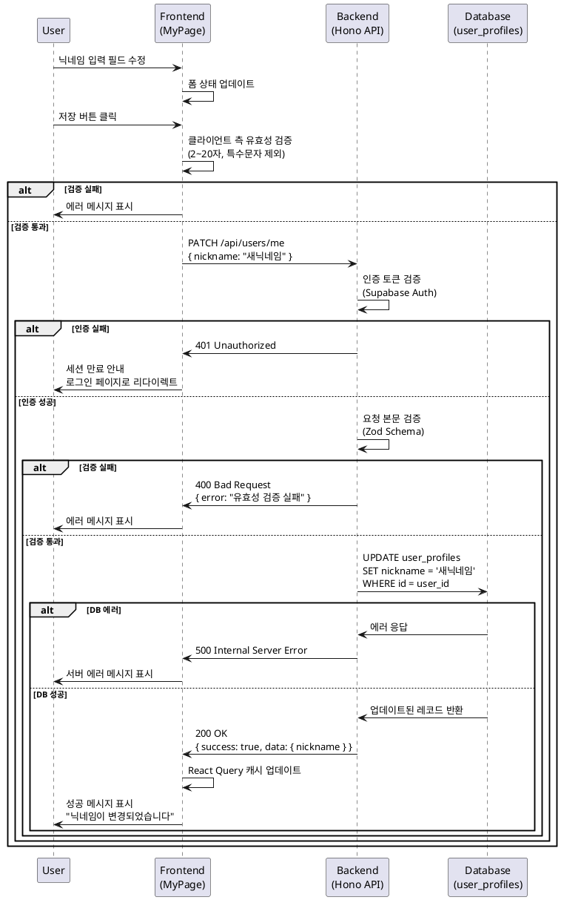

# 유스케이스: 닉네임 수정

## 유스케이스 ID: UC-004

### 제목
마이페이지에서 사용자 닉네임 수정

---

## 1. 개요

### 1.1 목적
로그인한 사용자가 자신의 닉네임을 변경하여 채팅방에서 표시되는 이름을 관리할 수 있도록 한다.

### 1.2 범위
- 마이페이지에서의 닉네임 수정 기능
- 닉네임 유효성 검증
- 변경 결과 피드백 제공

**제외 사항**:
- 이메일 변경 (Supabase Auth에서 관리)
- 비밀번호 변경
- 프로필 이미지 업로드

### 1.3 액터
- **주요 액터**: 로그인한 사용자
- **부 액터**: 없음

---

## 2. 선행 조건

- 사용자가 로그인된 상태여야 함
- 마이페이지(`/my-page`)에 접근한 상태여야 함
- 현재 닉네임이 조회되어 표시된 상태여야 함

---

## 3. 참여 컴포넌트

### 3.1 프론트엔드
- **페이지**: `/my-page` (마이페이지)
- **컴포넌트**: 닉네임 입력 폼, 저장 버튼, 에러/성공 메시지 표시 영역
- **검증**: React Hook Form + Zod (클라이언트 측 유효성 검증)
- **상태 관리**: React Query (서버 상태), 로컬 상태 (폼 입력)

### 3.2 백엔드
- **API**: `PATCH /api/users/me`
- **미들웨어**: 인증 미들웨어 (Supabase Auth 세션 검증)
- **서비스**: 사용자 프로필 업데이트 서비스
- **스키마**: `UpdateNicknameRequestSchema`, `UpdateNicknameResponseSchema`

### 3.3 데이터베이스
- **테이블**: `user_profiles`
- **변경 컬럼**: `nickname`

---

## 4. 기본 플로우 (Basic Flow)

### 4.1 트리거
사용자가 마이페이지에서 닉네임 입력 필드를 수정한 후 저장 버튼을 클릭

### 4.2 단계별 흐름

1. **사용자**: 마이페이지에서 현재 닉네임을 확인
   - 입력: 없음
   - 처리: 기존 닉네임이 입력 필드에 표시됨
   - 출력: 닉네임 입력 필드

2. **사용자**: 닉네임 입력 필드를 수정
   - 입력: 새로운 닉네임 (2~20자)
   - 처리: 입력값이 폼 상태에 반영됨
   - 출력: 수정된 입력 필드 값

3. **사용자**: 저장 버튼 클릭
   - 입력: 저장 버튼 클릭 이벤트
   - 처리: 폼 제출 이벤트 발생
   - 출력: 없음

4. **프론트엔드**: 클라이언트 측 유효성 검증
   - 입력: 닉네임 입력값
   - 처리: Zod 스키마로 검증 (2~20자, 특수문자 제외)
   - 출력: 검증 통과 또는 에러 메시지

5. **프론트엔드**: API 요청 전송
   - 입력: `{ nickname: "새로운닉네임" }`
   - 처리: `PATCH /api/users/me` 요청
   - 출력: HTTP 요청

6. **백엔드**: 인증 확인
   - 입력: HTTP 요청 헤더 (인증 토큰)
   - 처리: Supabase Auth 세션 검증
   - 출력: 사용자 ID 또는 401 에러

7. **백엔드**: 요청 본문 검증
   - 입력: 요청 본문 `{ nickname }`
   - 처리: Zod 스키마로 재검증
   - 출력: 검증된 데이터 또는 400 에러

8. **백엔드**: 데이터베이스 업데이트
   - 입력: 사용자 ID, 새로운 닉네임
   - 처리: `UPDATE user_profiles SET nickname = $1 WHERE id = $2`
   - 출력: 업데이트된 레코드 또는 에러

9. **백엔드**: 응답 반환
   - 입력: 업데이트된 프로필 데이터
   - 처리: 성공 응답 포맷팅
   - 출력: `{ success: true, data: { nickname: "새로운닉네임" } }`

10. **프론트엔드**: 성공 처리
    - 입력: 응답 데이터
    - 처리: React Query 캐시 업데이트, 성공 메시지 표시
    - 출력: 토스트 또는 인라인 성공 메시지

11. **사용자**: 변경 완료 확인
    - 입력: 없음
    - 처리: 없음
    - 출력: 업데이트된 닉네임 표시 및 성공 메시지

### 4.3 시퀀스 다이어그램



---

## 5. 대안 플로우 (Alternative Flows)

### 5.1 대안 플로우 1: 변경 사항 없이 저장

**시작 조건**: 사용자가 닉네임을 수정하지 않고 저장 버튼 클릭

**단계**:
1. 프론트엔드에서 기존 닉네임과 입력값 비교
2. 변경 사항이 없음을 감지
3. 옵션 A: API 요청을 전송하지 않고 "변경 사항이 없습니다" 메시지 표시
4. 옵션 B: API 요청을 전송하되 서버에서 업데이트 스킵

**결과**: 데이터베이스 변경 없음, 사용자에게 변경 사항 없음을 안내

---

## 6. 예외 플로우 (Exception Flows)

### 6.1 예외 상황 1: 닉네임 유효성 검증 실패 (클라이언트)

**발생 조건**:
- 닉네임이 2자 미만
- 닉네임이 20자 초과
- 특수문자 포함
- 빈 문자열

**처리 방법**:
1. React Hook Form이 에러 감지
2. 해당 입력 필드 아래에 에러 메시지 표시
3. 저장 버튼 비활성화 또는 제출 차단

**에러 코드**: 클라이언트 측 검증 (HTTP 요청 미전송)

**사용자 메시지**:
- "닉네임은 2~20자여야 합니다"
- "특수문자는 사용할 수 없습니다"
- "닉네임을 입력해주세요"

---

### 6.2 예외 상황 2: 인증 실패 (세션 만료)

**발생 조건**:
- 사용자의 인증 세션이 만료된 상태에서 저장 시도
- 인증 토큰이 유효하지 않음

**처리 방법**:
1. 백엔드에서 401 Unauthorized 응답 반환
2. 프론트엔드에서 인증 상태 초기화
3. 로그인 페이지로 리다이렉트
4. "세션이 만료되었습니다. 다시 로그인해주세요" 메시지 표시

**에러 코드**: `401 Unauthorized`

**사용자 메시지**: "세션이 만료되었습니다. 다시 로그인해주세요"

---

### 6.3 예외 상황 3: 서버 측 유효성 검증 실패

**발생 조건**:
- 클라이언트 검증을 우회한 요청 (개발자 도구 등)
- 클라이언트와 서버 검증 규칙 불일치

**처리 방법**:
1. 백엔드에서 Zod 스키마 검증 실패
2. 400 Bad Request 응답 반환
3. 프론트엔드에서 에러 메시지 표시

**에러 코드**: `400 Bad Request`

**사용자 메시지**: "유효하지 않은 닉네임입니다. 2~20자의 한글, 영문, 숫자만 사용해주세요"

---

### 6.4 예외 상황 4: 데이터베이스 에러

**발생 조건**:
- 데이터베이스 연결 실패
- 트랜잭션 실패
- 제약 조건 위반 (예: NULL 값 등)

**처리 방법**:
1. 백엔드에서 에러 로깅
2. 500 Internal Server Error 응답 반환
3. 프론트엔드에서 일반적인 에러 메시지 표시
4. 재시도 버튼 제공

**에러 코드**: `500 Internal Server Error`

**사용자 메시지**: "일시적인 오류가 발생했습니다. 잠시 후 다시 시도해주세요"

---

### 6.5 예외 상황 5: 네트워크 연결 끊김

**발생 조건**:
- 사용자의 인터넷 연결 불안정
- 서버 응답 없음 (타임아웃)

**처리 방법**:
1. React Query의 재시도 로직 실행 (최대 3회)
2. 재시도 실패 시 네트워크 에러 메시지 표시
3. 재시도 버튼 제공

**에러 코드**: 네트워크 에러 (HTTP 요청 실패)

**사용자 메시지**: "네트워크 연결을 확인해주세요"

---

## 7. 후행 조건 (Post-conditions)

### 7.1 성공 시

**데이터베이스 변경**:
- `user_profiles` 테이블의 해당 사용자 레코드에서 `nickname` 컬럼 업데이트
- 변경 시간은 자동으로 기록되지 않음 (updated_at 컬럼 없음)

**시스템 상태**:
- React Query 캐시에서 사용자 프로필 정보 업데이트
- 마이페이지에 새로운 닉네임 표시
- 성공 메시지 표시 (3초 후 자동 사라짐)

**부가 효과**:
- 이후 전송하는 채팅 메시지에 새로운 닉네임이 표시됨
- 과거 메시지의 발신자 닉네임은 변경되지 않음 (데이터 무결성 유지)

### 7.2 실패 시

**데이터 롤백**:
- 데이터베이스 변경 없음
- 입력 필드는 사용자가 입력한 값 유지 (재입력 불필요)

**시스템 상태**:
- React Query 캐시 변경 없음
- 에러 메시지 표시
- 사용자는 수정 후 재시도 가능

---

## 8. 비즈니스 규칙

### 8.1 닉네임 형식 규칙
- **최소 길이**: 2자
- **최대 길이**: 20자
- **허용 문자**: 한글, 영문, 숫자
- **금지 문자**: 특수문자 (공백 포함)
- **정규식**: `/^[가-힣a-zA-Z0-9]{2,20}$/`

### 8.2 변경 제한
- 닉네임 변경 횟수 제한 없음
- 변경 시간 제한 없음 (즉시 변경 가능)
- 중복 닉네임 허용 (UNIQUE 제약 조건 없음)

### 8.3 데이터 무결성
- 과거 메시지의 발신자 닉네임은 변경되지 않음
  - 메시지 테이블은 `sender_id`만 저장
  - 메시지 조회 시 실시간으로 `user_profiles`와 JOIN
  - 따라서 닉네임 변경 시 과거 메시지에도 새 닉네임이 표시됨
  - **주의**: 데이터베이스 설계 문서 검토 결과, 실시간 JOIN 방식이므로 새 닉네임이 과거 메시지에도 적용됨

### 8.4 보안 규칙
- 본인의 닉네임만 수정 가능 (사용자 ID로 확인)
- XSS 방지: 입력값 sanitization (서버 측)
- 인증된 사용자만 접근 가능

---

## 9. 비기능 요구사항

### 9.1 성능
- **API 응답 시간**: 평균 300ms 이하
- **데이터베이스 쿼리**: 단일 UPDATE 쿼리로 처리
- **클라이언트 검증**: 실시간 검증 (입력 중 debounce 적용)

### 9.2 보안
- **인증**: Supabase Auth 세션 기반
- **권한**: 본인의 프로필만 수정 가능
- **입력 검증**: 클라이언트 + 서버 양측 검증
- **XSS 방지**: HTML 태그 이스케이프 처리

### 9.3 사용성
- **즉각적인 피드백**: 입력 중 실시간 검증 메시지
- **명확한 에러 메시지**: 무엇이 잘못되었는지 구체적으로 안내
- **재시도 용이성**: 에러 발생 시 입력값 유지

---

## 10. UI/UX 요구사항

### 10.1 화면 구성
- **헤더**: 뒤로가기 버튼 (홈으로 이동)
- **사용자 정보 섹션**:
  - 이메일 표시 (읽기 전용, 회색 텍스트)
  - 닉네임 입력 필드 (활성화, 수정 가능)
- **저장 버튼**: 변경 사항이 있을 때 활성화
- **로그아웃 버튼**: 페이지 하단

### 10.2 사용자 경험
- **입력 중 검증**: 입력 필드에서 포커스 아웃 시 즉시 검증
- **성공 피드백**: 토스트 메시지 또는 입력 필드 아래 녹색 체크 아이콘
- **에러 피드백**: 입력 필드 테두리 빨간색, 아래에 에러 메시지
- **로딩 상태**: 저장 버튼에 스피너 표시, 버튼 비활성화

---

## 11. 테스트 시나리오

### 11.1 성공 케이스

| 테스트 케이스 ID | 입력값 | 기대 결과 |
|----------------|--------|----------|
| TC-004-01      | "홍길동" (3자, 한글) | 성공: 닉네임 업데이트, 성공 메시지 표시 |
| TC-004-02      | "User123" (7자, 영문+숫자) | 성공: 닉네임 업데이트, 성공 메시지 표시 |
| TC-004-03      | "테스트사용자12345678" (20자, 한글+숫자) | 성공: 닉네임 업데이트, 성공 메시지 표시 |
| TC-004-04      | "AB" (2자, 최소 길이) | 성공: 닉네임 업데이트, 성공 메시지 표시 |

### 11.2 실패 케이스

| 테스트 케이스 ID | 입력값 | 기대 결과 |
|----------------|--------|----------|
| TC-004-05      | "A" (1자, 최소 길이 미달) | 실패: "닉네임은 2~20자여야 합니다" 에러 메시지 |
| TC-004-06      | "가나다라마바사아자차카타파하A" (21자, 최대 길이 초과) | 실패: "닉네임은 2~20자여야 합니다" 에러 메시지 |
| TC-004-07      | "홍길동!" (특수문자 포함) | 실패: "특수문자는 사용할 수 없습니다" 에러 메시지 |
| TC-004-08      | "홍 길동" (공백 포함) | 실패: "특수문자는 사용할 수 없습니다" 에러 메시지 |
| TC-004-09      | "" (빈 문자열) | 실패: "닉네임을 입력해주세요" 에러 메시지 |
| TC-004-10      | 세션 만료 상태에서 저장 | 실패: 401 에러, 로그인 페이지로 리다이렉트 |

### 11.3 엣지 케이스

| 테스트 케이스 ID | 시나리오 | 기대 결과 |
|----------------|---------|----------|
| TC-004-11      | 변경 사항 없이 저장 | API 요청 미전송 또는 "변경 사항이 없습니다" 메시지 |
| TC-004-12      | 네트워크 연결 끊김 상태에서 저장 | 재시도 로직 실행 후 네트워크 에러 메시지 |
| TC-004-13      | 저장 중 페이지 이탈 | 요청 취소 또는 백그라운드 완료 |
| TC-004-14      | 동일한 닉네임으로 연속 변경 | 성공 (중복 닉네임 허용) |

---

## 12. API 명세

### 12.1 엔드포인트
```
PATCH /api/users/me
```

### 12.2 요청

**헤더**:
```
Authorization: Bearer {supabase_access_token}
Content-Type: application/json
```

**본문** (JSON):
```json
{
  "nickname": "새로운닉네임"
}
```

**스키마** (Zod):
```typescript
const UpdateNicknameRequestSchema = z.object({
  nickname: z.string()
    .min(2, "닉네임은 2~20자여야 합니다")
    .max(20, "닉네임은 2~20자여야 합니다")
    .regex(/^[가-힣a-zA-Z0-9]+$/, "특수문자는 사용할 수 없습니다")
});
```

### 12.3 응답

**성공 (200 OK)**:
```json
{
  "success": true,
  "data": {
    "id": "user-uuid",
    "nickname": "새로운닉네임",
    "email": "user@example.com"
  }
}
```

**실패 - 인증 실패 (401 Unauthorized)**:
```json
{
  "success": false,
  "error": {
    "code": "UNAUTHORIZED",
    "message": "인증이 필요합니다"
  }
}
```

**실패 - 유효성 검증 실패 (400 Bad Request)**:
```json
{
  "success": false,
  "error": {
    "code": "VALIDATION_ERROR",
    "message": "닉네임은 2~20자여야 합니다",
    "details": [
      {
        "field": "nickname",
        "message": "닉네임은 2~20자여야 합니다"
      }
    ]
  }
}
```

**실패 - 서버 에러 (500 Internal Server Error)**:
```json
{
  "success": false,
  "error": {
    "code": "INTERNAL_SERVER_ERROR",
    "message": "일시적인 오류가 발생했습니다"
  }
}
```

---

## 13. 데이터베이스 쿼리

### 13.1 닉네임 업데이트
```sql
UPDATE user_profiles
SET nickname = $1
WHERE id = $2
RETURNING id, nickname;
```

**파라미터**:
- `$1`: 새로운 닉네임 (string)
- `$2`: 사용자 ID (uuid, 인증 토큰에서 추출)

**반환값**:
- `id`: 사용자 ID (uuid)
- `nickname`: 업데이트된 닉네임 (varchar)

---

## 14. 관련 유스케이스

- **선행 유스케이스**:
  - UC-002: 로그인 (마이페이지 접근을 위한 인증 필요)
  - UC-마이페이지 조회: 현재 닉네임 확인 (암묵적 선행)

- **후행 유스케이스**:
  - UC-008: 텍스트 메시지 전송 (변경된 닉네임으로 메시지 전송)
  - UC-009: 이모티콘 메시지 전송 (변경된 닉네임으로 메시지 전송)

- **연관 유스케이스**:
  - UC-003: 로그아웃 (마이페이지의 다른 기능)
  - UC-001: 회원가입 (최초 닉네임 설정)

---

## 15. 변경 이력

| 버전 | 날짜 | 작성자 | 변경 내용 |
|------|------|--------|-----------|
| 1.0  | 2025-10-20 | Claude Code | 초기 작성 |

---

## 부록

### A. 용어 정의

- **닉네임 (Nickname)**: 채팅방에서 사용자를 식별하기 위한 표시 이름
- **Supabase Auth**: Supabase가 제공하는 인증 서비스
- **React Query**: 서버 상태 관리 라이브러리
- **Zod**: TypeScript 스키마 검증 라이브러리
- **Sanitization**: 악의적인 입력을 무해화하는 처리

### B. 참고 자료

- [PRD: 실시간 채팅 서비스](/docs/prd.md)
- [Userflow: 1.4 닉네임 수정](/docs/userflow.md)
- [데이터베이스 설계: user_profiles 테이블](/docs/database.md)
- [Zod 공식 문서](https://zod.dev/)
- [React Hook Form 공식 문서](https://react-hook-form.com/)

### C. 구현 참고사항

#### C.1 프론트엔드 구현 힌트
- React Hook Form의 `watch`를 사용하여 변경 사항 감지
- 저장 버튼은 `isDirty && isValid` 조건으로 활성화
- 토스트 메시지는 `react-hot-toast` 또는 shadcn-ui의 Toast 컴포넌트 사용
- 에러 메시지는 `<FormMessage>` 컴포넌트로 표시

#### C.2 백엔드 구현 힌트
- Hono의 `zValidator` 미들웨어로 요청 검증
- Supabase 클라이언트의 `auth.getUser()`로 사용자 ID 추출
- 서비스 레이어에서 비즈니스 로직 분리
- 에러는 `src/features/user/backend/error.ts`에 정의된 코드 사용

#### C.3 테스트 구현 힌트
- 유닛 테스트: Zod 스키마 검증 로직 테스트
- 통합 테스트: API 엔드포인트 전체 플로우 테스트
- E2E 테스트: Playwright로 UI 인터랙션 테스트
- 테스트 데이터: 테스트용 사용자 계정 사전 생성 필요

---

**문서 종료**
