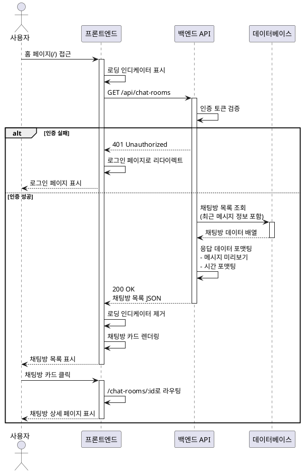

# 유스케이스: UC-005 채팅방 목록 조회

## 1. 개요

### 1.1 목적
사용자가 접근 가능한 모든 채팅방을 목록 형태로 조회하여 원하는 채팅방에 빠르게 입장할 수 있도록 한다.

### 1.2 범위
- 모든 채팅방의 기본 정보(이름, 최근 메시지, 시간) 표시
- 최근 메시지 시간 기준 정렬
- 채팅방 추가 버튼 제공
- 채팅방 클릭 시 상세 페이지로 이동

**제외 사항**:
- 채팅방 검색 기능
- 채팅방 필터링/정렬 옵션
- 채팅방 삭제/수정 기능
- 읽지 않은 메시지 표시

### 1.3 액터
- **주요 액터**: 로그인된 사용자
- **부 액터**: 없음 (모든 채팅방이 공개이며 참여 개념이 없음)

---

## 2. 선행 조건

- 사용자가 로그인된 상태여야 함
- 사용자가 홈 페이지(`/`)에 접근

---

## 3. 참여 컴포넌트

- **프론트엔드 (홈 페이지)**: 채팅방 목록 UI 렌더링, 사용자 인터랙션 처리
- **API 엔드포인트 (`GET /api/chat-rooms`)**: 채팅방 목록 조회 요청 처리
- **채팅방 서비스**: 데이터베이스 조회 및 비즈니스 로직 처리
- **데이터베이스**: `chat_rooms`, `messages`, `user_profiles` 테이블 조회

---

## 4. 기본 플로우 (Basic Flow)

### 4.1 단계별 흐름

1. **사용자**: 홈 페이지(`/`)에 접근
   - 입력: URL 접근 또는 로그인 후 자동 리다이렉트
   - 처리: 페이지 로딩

2. **프론트엔드**: 채팅방 목록 API 요청
   - 입력: 인증 토큰 (쿠키 또는 헤더)
   - 처리: `GET /api/chat-rooms` 요청 전송
   - 출력: 로딩 인디케이터 표시

3. **백엔드**: 인증 검증
   - 입력: 요청 헤더의 인증 토큰
   - 처리: Supabase Auth 세션 검증
   - 출력: 인증 성공/실패

4. **백엔드**: 채팅방 목록 조회
   - 입력: 없음 (모든 채팅방 조회)
   - 처리:
     - `chat_rooms` 테이블에서 모든 채팅방 조회
     - 각 채팅방의 최근 메시지 정보 조인 (LATERAL JOIN)
     - 최근 메시지 시간 기준 내림차순 정렬
     - 최대 100개 제한
   - 출력: 채팅방 목록 데이터

5. **데이터베이스**: 쿼리 실행
   - 입력: SQL 쿼리
   - 처리:
     ```sql
     SELECT
       cr.id,
       cr.name,
       cr.created_at,
       m.content AS last_message_content,
       m.message_type AS last_message_type,
       m.emoticon_id AS last_message_emoticon_id,
       m.created_at AS last_message_time,
       up.nickname AS last_message_sender
     FROM chat_rooms cr
     LEFT JOIN LATERAL (
       SELECT * FROM messages
       WHERE chat_room_id = cr.id
       ORDER BY created_at DESC
       LIMIT 1
     ) m ON true
     LEFT JOIN user_profiles up ON m.sender_id = up.id
     ORDER BY COALESCE(m.created_at, cr.created_at) DESC
     LIMIT 100;
     ```
   - 출력: 채팅방 데이터 배열

6. **백엔드**: 응답 데이터 포맷팅
   - 입력: 데이터베이스 조회 결과
   - 처리:
     - 각 채팅방의 최근 메시지 내용 포맷팅
       - 텍스트 메시지: 내용 미리보기 (최대 50자)
       - 이모티콘 메시지: "[이모티콘]" 표시
       - 메시지 없음: "메시지가 없습니다" 기본 문구
     - 시간 포맷팅 (상대 시간 또는 절대 시간)
   - 출력: JSON 응답

7. **프론트엔드**: 채팅방 목록 렌더링
   - 입력: API 응답 데이터
   - 처리:
     - 로딩 인디케이터 제거
     - 채팅방 카드 컴포넌트 렌더링
     - 각 카드에 채팅방 이름, 최근 메시지 미리보기, 시간 표시
   - 출력: 채팅방 목록 UI

8. **사용자**: 채팅방 카드 클릭
   - 입력: 마우스 클릭 또는 터치
   - 처리: 채팅방 상세 페이지(`/chat-rooms/:id`)로 라우팅
   - 출력: 페이지 전환

### 4.2 시퀀스 다이어그램



---

## 5. 대안 플로우 (Alternative Flows)

### 5.1 대안 플로우 1: 채팅방이 하나도 없는 경우

**시작 조건**: 4.1의 단계 4 (백엔드 채팅방 목록 조회) 이후

**단계**:
1. 데이터베이스 조회 결과가 빈 배열
2. 백엔드가 빈 배열을 응답으로 반환
3. 프론트엔드가 빈 상태 UI 표시
   - "아직 채팅방이 없습니다" 메시지
   - "채팅방 추가" 버튼 강조

**결과**: 사용자에게 채팅방 생성 유도

### 5.2 대안 플로우 2: 최근 메시지가 없는 채팅방

**시작 조건**: 4.1의 단계 4 (백엔드 채팅방 목록 조회) 이후

**단계**:
1. 일부 채팅방의 `last_message_*` 필드가 NULL
2. 백엔드가 해당 채팅방에 기본 문구 설정
   - 미리보기: "메시지가 없습니다"
   - 시간: 채팅방 생성 시간 사용
3. 프론트엔드가 기본 문구로 렌더링

**결과**: 채팅방 목록에 메시지 없는 채팅방도 표시됨

---

## 6. 예외 플로우 (Exception Flows)

### 6.1 예외 상황 1: 인증 실패

**발생 조건**:
- 세션 만료
- 유효하지 않은 인증 토큰
- 로그인하지 않은 상태

**처리 방법**:
1. 백엔드가 `401 Unauthorized` 응답
2. 프론트엔드가 인증 상태 초기화
3. 로그인 페이지(`/login`)로 리다이렉트
4. `redirectedFrom` 파라미터에 `/` 저장

**에러 코드**: `401 Unauthorized`

**사용자 메시지**: "로그인이 필요합니다. 로그인 페이지로 이동합니다."

---

### 6.2 예외 상황 2: 네트워크 오류

**발생 조건**:
- 클라이언트 네트워크 연결 끊김
- API 서버 응답 없음
- 타임아웃

**처리 방법**:
1. 프론트엔드가 요청 실패 감지
2. 로딩 인디케이터 제거
3. 에러 메시지 표시
4. 재시도 버튼 제공

**에러 코드**: `Network Error` (클라이언트 측)

**사용자 메시지**: "채팅방 목록을 불러올 수 없습니다. 네트워크 연결을 확인해주세요."

---

### 6.3 예외 상황 3: 서버 오류

**발생 조건**:
- 데이터베이스 연결 실패
- 쿼리 실행 오류
- 예상치 못한 서버 에러

**처리 방법**:
1. 백엔드가 에러 로깅
2. `500 Internal Server Error` 응답
3. 프론트엔드가 일반 에러 메시지 표시
4. 재시도 버튼 또는 홈 새로고침 안내

**에러 코드**: `500 Internal Server Error`

**사용자 메시지**: "일시적인 오류가 발생했습니다. 잠시 후 다시 시도해주세요."

---

### 6.4 예외 상황 4: 탈퇴한 사용자가 보낸 최근 메시지

**발생 조건**:
- 채팅방의 최근 메시지 발신자가 탈퇴한 경우
- `messages.sender_id`가 NULL

**처리 방법**:
1. 데이터베이스 조회 시 `up.nickname`이 NULL
2. 백엔드가 발신자 닉네임을 "알 수 없음"으로 설정
3. 프론트엔드가 일반 메시지로 표시

**에러 코드**: 없음 (정상 처리)

**사용자 메시지**: 최근 메시지 발신자가 "알 수 없음"으로 표시

---

## 7. 후행 조건 (Post-conditions)

### 7.1 성공 시

- **데이터베이스 변경**: 없음 (읽기 전용 작업)
- **시스템 상태**:
  - 프론트엔드에 채팅방 목록 캐싱 (React Query)
  - 사용자가 채팅방 목록을 확인할 수 있는 상태
- **외부 시스템**: 없음

### 7.2 실패 시

- **데이터 롤백**: 없음 (읽기 전용 작업)
- **시스템 상태**:
  - 인증 실패: 로그인 페이지로 이동
  - 네트워크/서버 오류: 에러 메시지 표시 및 재시도 대기

---

## 8. 비즈니스 규칙

### 8.1 데이터 규칙
- 모든 채팅방은 공개이며 누구나 조회 가능
- 채팅방 참여 개념이 없음 (별도 권한 확인 불필요)
- 최대 100개 채팅방만 표시 (성능 고려)

### 8.2 정렬 규칙
- 최근 메시지가 있는 채팅방이 상위에 표시
- 메시지가 없는 채팅방은 생성 시간 기준 정렬
- 정렬 기준: `COALESCE(last_message_time, created_at) DESC`

### 8.3 표시 규칙
- 텍스트 메시지: 최대 50자까지 미리보기, 초과 시 "..." 표시
- 이모티콘 메시지: "[이모티콘]" 고정 문구
- 메시지 없음: "메시지가 없습니다" 기본 문구
- 탈퇴 사용자: "알 수 없음"으로 표시

---

## 9. 비기능 요구사항

### 9.1 성능
- API 응답 시간: 평균 500ms 이하
- 초기 로딩 시간: 1.5초 이하 (First Contentful Paint)
- 페이지네이션 미적용 (최대 100개 제한으로 충분)

### 9.2 보안
- Supabase Auth 세션 기반 인증 필수
- RLS 비활성화 (백엔드 서비스 레이어에서 권한 검증)
- XSS 방지: 메시지 내용 sanitization

### 9.3 가용성
- 네트워크 오류 시 재시도 로직
- 에러 발생 시 사용자에게 명확한 피드백 제공

---

## 10. UI/UX 요구사항

### 10.1 화면 구성

**헤더**:
- 서비스 로고
- 사용자 정보 (닉네임 또는 아이콘)
- 마이페이지 링크

**메인 영역**:
- 채팅방 목록 (카드 그리드 또는 리스트)
- 각 채팅방 카드:
  - 채팅방 이름 (굵은 글씨)
  - 최근 메시지 미리보기 (작은 글씨, 회색)
  - 최근 메시지 시간 (상대 시간 또는 절대 시간)
  - 호버 시 배경색 변경

**플로팅 버튼**:
- '채팅방 추가' 버튼 (우측 하단 고정)

**빈 상태 UI** (채팅방 없을 경우):
- 안내 메시지: "아직 채팅방이 없습니다"
- 채팅방 추가 버튼 강조

**로딩 상태**:
- 스켈레톤 UI 또는 로딩 인디케이터

### 10.2 사용자 경험

- **반응형 디자인**: 모바일, 태블릿, 데스크톱 대응
- **직관적 내비게이션**: 채팅방 카드 전체가 클릭 가능 영역
- **시각적 피드백**:
  - 카드 호버 시 배경색 변경
  - 클릭 시 부드러운 페이지 전환
- **성능 최적화**:
  - React Query를 통한 데이터 캐싱
  - 이미지 레이지 로딩 (향후 프로필 이미지 추가 시)

---

## 11. API 명세

### 11.1 요청

**엔드포인트**: `GET /api/chat-rooms`

**헤더**:
```
Authorization: Bearer {supabase_auth_token}
```

**쿼리 파라미터**: 없음

### 11.2 응답

**성공 (200 OK)**:
```json
{
  "success": true,
  "data": [
    {
      "id": "uuid-1",
      "name": "일반 채팅",
      "createdAt": "2025-10-20T10:00:00Z",
      "lastMessage": {
        "content": "안녕하세요!",
        "type": "text",
        "emoticonId": null,
        "senderNickname": "사용자1",
        "time": "2025-10-20T12:30:00Z"
      }
    },
    {
      "id": "uuid-2",
      "name": "개발자 채팅",
      "createdAt": "2025-10-19T15:00:00Z",
      "lastMessage": {
        "content": null,
        "type": "emoticon",
        "emoticonId": "heart",
        "senderNickname": "사용자2",
        "time": "2025-10-20T11:00:00Z"
      }
    },
    {
      "id": "uuid-3",
      "name": "빈 채팅방",
      "createdAt": "2025-10-18T09:00:00Z",
      "lastMessage": null
    }
  ]
}
```

**실패 (401 Unauthorized)**:
```json
{
  "success": false,
  "error": {
    "code": "UNAUTHORIZED",
    "message": "로그인이 필요합니다."
  }
}
```

**실패 (500 Internal Server Error)**:
```json
{
  "success": false,
  "error": {
    "code": "INTERNAL_SERVER_ERROR",
    "message": "일시적인 오류가 발생했습니다."
  }
}
```

---

## 12. 테스트 시나리오

### 12.1 성공 케이스

| 테스트 케이스 ID | 전제 조건 | 입력값 | 기대 결과 |
|----------------|----------|--------|----------|
| TC-005-01 | 로그인된 사용자, 채팅방 10개 존재 | GET /api/chat-rooms | 200 OK, 10개 채팅방 목록 반환 |
| TC-005-02 | 로그인된 사용자, 최근 메시지 있는 채팅방 | GET /api/chat-rooms | 채팅방 카드에 메시지 미리보기 표시 |
| TC-005-03 | 로그인된 사용자, 이모티콘 메시지가 최근인 채팅방 | GET /api/chat-rooms | "[이모티콘]" 문구 표시 |

### 12.2 실패 케이스

| 테스트 케이스 ID | 전제 조건 | 입력값 | 기대 결과 |
|----------------|----------|--------|----------|
| TC-005-04 | 비로그인 사용자 | GET /api/chat-rooms (인증 토큰 없음) | 401 Unauthorized, 로그인 페이지로 리다이렉트 |
| TC-005-05 | 로그인된 사용자, 네트워크 끊김 | GET /api/chat-rooms (타임아웃) | 네트워크 에러 메시지 표시, 재시도 버튼 |
| TC-005-06 | 로그인된 사용자, DB 연결 실패 | GET /api/chat-rooms | 500 Internal Server Error, 에러 메시지 표시 |

### 12.3 엣지 케이스

| 테스트 케이스 ID | 전제 조건 | 입력값 | 기대 결과 |
|----------------|----------|--------|----------|
| TC-005-07 | 로그인된 사용자, 채팅방 0개 | GET /api/chat-rooms | 빈 상태 UI 표시, "채팅방 추가" 버튼 강조 |
| TC-005-08 | 로그인된 사용자, 메시지 없는 채팅방 | GET /api/chat-rooms | "메시지가 없습니다" 기본 문구 표시 |
| TC-005-09 | 로그인된 사용자, 탈퇴 사용자가 보낸 최근 메시지 | GET /api/chat-rooms | 발신자 "알 수 없음"으로 표시 |
| TC-005-10 | 로그인된 사용자, 채팅방 150개 존재 | GET /api/chat-rooms | 최대 100개만 반환 |

---

## 13. 관련 유스케이스

- **선행 유스케이스**:
  - UC-002: 로그인
- **후행 유스케이스**:
  - UC-006: 채팅방 생성 (채팅방 추가 버튼 클릭)
  - UC-007: 채팅방 상세 조회 (채팅방 카드 클릭)
- **연관 유스케이스**:
  - UC-004: 마이페이지 조회 (헤더에서 마이페이지 링크 클릭)

---

## 14. 변경 이력

| 버전 | 날짜 | 작성자 | 변경 내용 |
|------|------|--------|-----------|
| 1.0  | 2025-10-20 | Claude Code | 초기 작성 |

---

## 부록

### A. 용어 정의

- **채팅방**: 사용자들이 메시지를 주고받을 수 있는 공개 공간
- **최근 메시지**: 채팅방에 전송된 가장 마지막 메시지
- **미리보기**: 메시지 내용의 일부를 목록에서 표시하는 것
- **상대 시간**: "5분 전", "2시간 전" 등 현재 시간 기준 경과 시간

### B. 참고 자료

- PRD: `/docs/prd.md`
- Userflow: `/docs/userflow.md` (2.1 채팅방 목록 조회)
- Database 설계: `/docs/database.md` (3.2 채팅방, 3.3 메시지)
- API 엔드포인트: `/src/features/chat-rooms/backend/route.ts` (예정)
