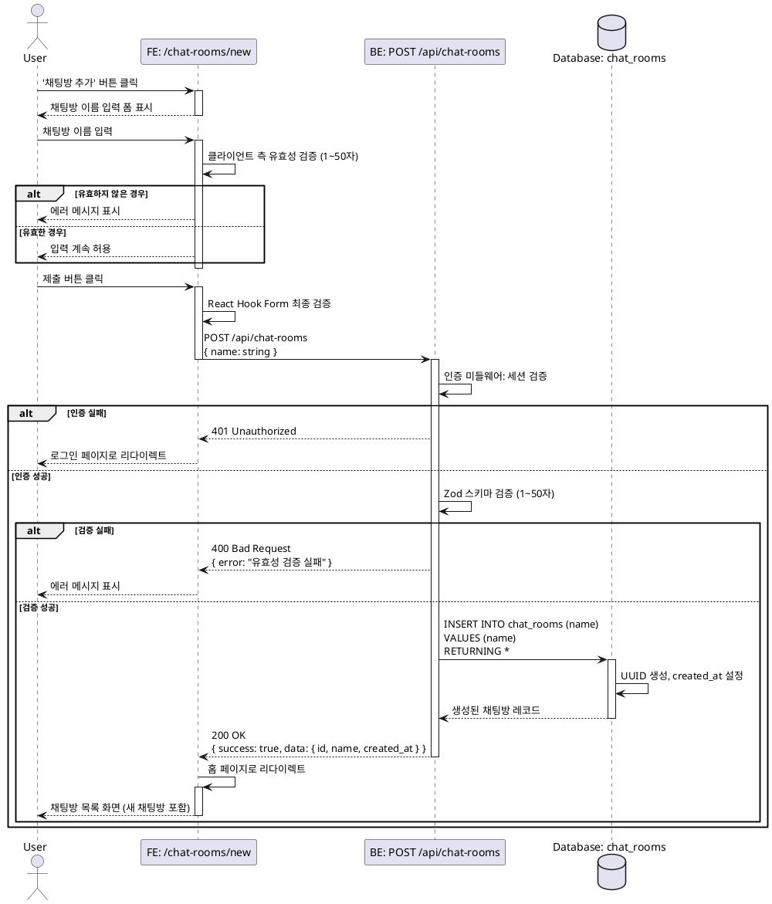

# 유스케이스 ID: UC-006

## 제목
채팅방 생성

---

## 1. 개요

### 1.1 목적
사용자가 새로운 주제의 채팅방을 생성하여 다른 사용자들과 대화할 수 있는 공간을 만든다.

### 1.2 범위
- 채팅방 이름 입력 및 검증
- 채팅방 데이터베이스 생성
- 생성 후 홈 페이지로 리다이렉션

**제외 사항**:
- 채팅방 수정/삭제 기능
- 채팅방 접근 권한 설정 (모든 채팅방은 오픈형)
- 채팅방 설명, 이미지 등의 추가 정보

### 1.3 액터
- **주요 액터**: 로그인된 사용자
- **부 액터**: 없음

---

## 2. 선행 조건

- 사용자가 Supabase Auth를 통해 로그인된 상태여야 함
- 유효한 세션 토큰이 존재해야 함
- 사용자가 홈 페이지에서 '채팅방 추가' 버튼을 클릭하여 채팅방 생성 페이지(/chat-rooms/new)에 접근

---

## 3. 참여 컴포넌트

- **프론트엔드 페이지**: `/chat-rooms/new` - 채팅방 이름 입력 폼 제공
- **React Hook Form + Zod**: 클라이언트 측 입력값 유효성 검증
- **React Query**: 서버 상태 관리 및 API 요청 처리
- **Hono 라우터**: `POST /api/chat-rooms` - 채팅방 생성 요청 처리
- **Supabase 클라이언트**: service-role 키로 데이터베이스 접근
- **PostgreSQL (chat_rooms 테이블)**: 채팅방 데이터 저장

---

## 4. 기본 플로우 (Basic Flow)

### 4.1 단계별 흐름

1. **사용자**: 홈 페이지에서 '채팅방 추가' 버튼 클릭
   - 처리: Next.js 클라이언트 라우팅으로 `/chat-rooms/new` 페이지 이동
   - 출력: 채팅방 이름 입력 폼 화면 표시

2. **사용자**: 채팅방 이름 입력 필드에 값 입력
   - 입력: 채팅방 이름 (1~50자)
   - 처리: 실시간 클라이언트 측 유효성 검증 (React Hook Form)
   - 출력: 유효하지 않은 경우 필드 아래 에러 메시지 표시

3. **사용자**: 제출 버튼 클릭
   - 처리: React Hook Form의 최종 검증 실행
   - 검증 실패 시: 에러 메시지 표시, 요청 차단
   - 검증 성공 시: 다음 단계로 진행

4. **프론트엔드**: API 요청 전송
   - 요청: `POST /api/chat-rooms`
   - 요청 본문: `{ name: string }`
   - 처리: React Query를 통한 HTTP 요청, 로딩 상태 표시

5. **백엔드 (Hono 라우터)**: 요청 수신 및 검증
   - 처리: Supabase Auth 세션 검증 (인증 미들웨어)
   - 처리: 요청 본문 zod 스키마 검증 (1~50자)
   - 검증 실패 시: 400 Bad Request 응답 반환
   - 검증 성공 시: 다음 단계로 진행

6. **백엔드 (Service Layer)**: 채팅방 생성
   - 처리: Supabase 클라이언트를 통해 chat_rooms 테이블에 INSERT
   - SQL: `INSERT INTO chat_rooms (name) VALUES ($1) RETURNING *`
   - 데이터베이스 변경: 신규 채팅방 레코드 생성 (id는 UUID 자동 생성, created_at은 NOW() 자동 설정)

7. **백엔드 (Hono 라우터)**: 성공 응답 반환
   - 응답: `200 OK`
   - 응답 본문: `{ success: true, data: { id, name, created_at } }`

8. **프론트엔드**: 응답 수신 및 처리
   - 처리: React Query의 성공 콜백 실행
   - 처리: 홈 페이지(`/`)로 리다이렉트
   - 출력: 채팅방 목록에 새로 생성된 채팅방 표시

### 4.2 시퀀스 다이어그램

---

## 5. 대안 플로우 (Alternative Flows)

### 5.1 대안 플로우 1: 취소 버튼 클릭

**시작 조건**: 사용자가 채팅방 이름 입력 중

**단계**:
1. 사용자가 '취소' 버튼 클릭
2. 프론트엔드는 입력 내용을 버리고 홈 페이지(`/`)로 리다이렉트
3. 채팅방 목록 화면 표시

**결과**: 채팅방 생성 취소, 데이터베이스 변경 없음

### 5.2 대안 플로우 2: 브라우저 뒤로가기

**시작 조건**: 사용자가 채팅방 생성 페이지에 있음

**단계**:
1. 사용자가 브라우저 뒤로가기 버튼 클릭
2. 이전 페이지(홈)로 이동
3. 입력 내용 유실

**결과**: 채팅방 생성 취소, 데이터베이스 변경 없음

---

## 6. 예외 플로우 (Exception Flows)

### 6.1 예외 상황 1: 빈 채팅방 이름 입력

**발생 조건**: 사용자가 채팅방 이름을 입력하지 않고 제출 버튼 클릭

**처리 방법**:
1. 클라이언트 측 React Hook Form 검증에서 차단
2. 입력 필드 아래 "채팅방 이름을 입력해주세요" 에러 메시지 표시
3. 제출 버튼 비활성화 또는 요청 차단

**에러 코드**: 클라이언트 측 검증 (API 요청 전송 안 됨)

**사용자 메시지**: "채팅방 이름을 입력해주세요"

---

### 6.2 예외 상황 2: 채팅방 이름 길이 초과

**발생 조건**: 사용자가 50자를 초과하는 채팅방 이름 입력

**처리 방법**:
1. 클라이언트 측 React Hook Form 검증에서 차단
2. 입력 필드 아래 "채팅방 이름은 50자 이하로 입력해주세요" 에러 메시지 표시
3. 추가 입력 차단 (maxLength 속성)

**에러 코드**: 클라이언트 측 검증 (API 요청 전송 안 됨)

**사용자 메시지**: "채팅방 이름은 50자 이하로 입력해주세요"

---

### 6.3 예외 상황 3: 세션 만료

**발생 조건**: API 요청 시점에 세션이 만료됨

**처리 방법**:
1. 백엔드 인증 미들웨어에서 401 Unauthorized 응답 반환
2. 프론트엔드는 인증 상태 초기화
3. 로그인 페이지로 리다이렉트 (`redirectedFrom=/chat-rooms/new` 파라미터 포함)
4. "세션이 만료되었습니다. 다시 로그인해주세요" 메시지 표시

**에러 코드**: `401 Unauthorized`

**사용자 메시지**: "세션이 만료되었습니다. 다시 로그인해주세요"

---

### 6.4 예외 상황 4: 네트워크 연결 끊김

**발생 조건**: API 요청 중 네트워크 오류 발생

**처리 방법**:
1. React Query에서 요청 실패 감지
2. "네트워크 오류가 발생했습니다. 다시 시도해주세요" 에러 메시지 표시
3. 재시도 버튼 또는 자동 재시도 로직 실행

**에러 코드**: Network Error (HTTP 요청 실패)

**사용자 메시지**: "네트워크 오류가 발생했습니다. 다시 시도해주세요"

---

### 6.5 예외 상황 5: 서버 내부 오류 (5xx)

**발생 조건**: 데이터베이스 연결 실패, 예상치 못한 서버 오류

**처리 방법**:
1. 백엔드의 errorBoundary 미들웨어에서 에러 로깅
2. 500 Internal Server Error 응답 반환
3. 프론트엔드는 일반적인 에러 메시지 표시
4. 재시도 버튼 제공

**에러 코드**: `500 Internal Server Error`

**사용자 메시지**: "일시적인 오류가 발생했습니다. 잠시 후 다시 시도해주세요"

---

### 6.6 예외 상황 6: 중복된 채팅방 이름

**발생 조건**: 동일한 이름의 채팅방이 이미 존재

**처리 방법**:
- 현재 요구사항: **허용** (중복 채팅방 이름 제약 조건 없음)
- 채팅방은 UUID로 구분되므로 동일 이름 허용
- 향후 필요 시 UNIQUE 제약 조건 추가 가능

**에러 코드**: 없음 (정상 처리)

**사용자 메시지**: 없음

---

## 7. 후행 조건 (Post-conditions)

### 7.1 성공 시

**데이터베이스 변경**:
- `chat_rooms` 테이블에 신규 레코드 1개 삽입
  - `id`: UUID 자동 생성
  - `name`: 사용자가 입력한 채팅방 이름
  - `created_at`: 현재 시간 (timestamptz)

**시스템 상태**:
- 새로운 채팅방이 전체 채팅방 목록에 포함됨
- 모든 사용자가 해당 채팅방에 접근 가능 (오픈형)

**화면 상태**:
- 홈 페이지(`/`)로 이동
- 채팅방 목록이 새로고침되어 새 채팅방이 목록에 표시됨

### 7.2 실패 시

**데이터 롤백**:
- 데이터베이스 변경 없음
- 트랜잭션 롤백 (PostgreSQL 기본 동작)

**시스템 상태**:
- 채팅방 목록은 변경되지 않음
- 사용자는 여전히 채팅방 생성 페이지에 머무름 (에러 메시지 표시)

---

## 8. 비즈니스 규칙 (Business Rules)

### BR-001: 채팅방 이름 길이
- 채팅방 이름은 최소 1자, 최대 50자로 제한됨
- 공백만으로 구성된 이름은 허용하지 않음

### BR-002: 채팅방 접근 권한
- 모든 채팅방은 오픈형이며, 누구나 접근 가능
- 채팅방 참여 개념 없음

### BR-003: 채팅방 이름 중복
- 동일한 이름의 채팅방 생성 허용
- 채팅방은 UUID로 고유하게 식별

### BR-004: 채팅방 생성 권한
- 로그인한 모든 사용자가 채팅방 생성 가능
- 생성자 정보는 저장하지 않음 (요구사항 없음)

### BR-005: 채팅방 삭제
- 현재 버전에서는 채팅방 삭제 기능 없음
- 향후 확장 가능

---

## 9. 비기능 요구사항

### 9.1 성능
- API 응답 시간: 평균 500ms 이하
- 채팅방 생성 후 홈 페이지 리다이렉트 시간: 1초 이내
- 데이터베이스 INSERT 쿼리 실행 시간: 100ms 이내

### 9.2 보안
- 인증: Supabase Auth 세션 검증 필수 (백엔드 미들웨어)
- 입력값 검증: 클라이언트 + 서버 이중 검증
- XSS 방지: 채팅방 이름 HTML 이스케이프 처리
- SQL Injection 방지: Supabase 클라이언트의 파라미터화된 쿼리 사용

### 9.3 가용성
- 데이터베이스 연결 실패 시 재시도 로직 (Supabase 자동 처리)
- 서버 오류 시 사용자에게 명확한 에러 메시지 제공

---

## 10. UI/UX 요구사항

### 10.1 화면 구성

**채팅방 생성 페이지 (`/chat-rooms/new`)**:
- 헤더: 페이지 제목 ("채팅방 만들기")
- 입력 폼:
  - 채팅방 이름 입력 필드 (텍스트 인풋)
  - 글자 수 카운터 표시 (N/50자)
  - 에러 메시지 표시 영역 (입력 필드 아래)
- 하단 버튼:
  - 취소 버튼 (왼쪽, 아웃라인)
  - 생성 버튼 (오른쪽, 프라이머리)

### 10.2 사용자 경험

**입력 중**:
- 실시간 글자 수 카운터 업데이트
- 50자 초과 시 추가 입력 차단
- 유효하지 않은 입력 시 즉시 에러 메시지 표시

**제출 시**:
- 로딩 인디케이터 표시 (버튼 내부 스피너)
- 제출 버튼 비활성화 (중복 요청 방지)
- 키보드 Enter 키로도 제출 가능

**성공 시**:
- 홈 페이지로 부드러운 전환 (Next.js 클라이언트 라우팅)
- 채팅방 목록에 새 채팅방이 즉시 표시

**실패 시**:
- 명확한 에러 메시지 표시
- 입력 내용 유지 (재입력 방지)
- 재시도 가능 상태 유지

---

## 11. 테스트 시나리오

### 11.1 성공 케이스

| 테스트 케이스 ID | 입력값 | 기대 결과 |
|-----------------|--------|----------|
| TC-006-01 | 채팅방 이름: "일상 잡담" | 채팅방 생성 성공, 홈 페이지로 리다이렉트, 목록에 표시 |
| TC-006-02 | 채팅방 이름: "가" (1자) | 최소 길이 허용, 생성 성공 |
| TC-006-03 | 채팅방 이름: "A".repeat(50) (50자) | 최대 길이 허용, 생성 성공 |
| TC-006-04 | 채팅방 이름: "자유 주제 💬" (이모지 포함) | 이모지 허용, 생성 성공 |
| TC-006-05 | 동일 이름 채팅방 2개 생성 | 중복 허용, 모두 생성 성공 |

### 11.2 실패 케이스

| 테스트 케이스 ID | 입력값 | 기대 결과 |
|-----------------|--------|----------|
| TC-006-06 | 채팅방 이름: "" (빈 문자열) | 클라이언트 검증 실패, "채팅방 이름을 입력해주세요" 에러 |
| TC-006-07 | 채팅방 이름: "   " (공백만) | 클라이언트 검증 실패, "채팅방 이름을 입력해주세요" 에러 |
| TC-006-08 | 채팅방 이름: "A".repeat(51) (51자) | 클라이언트에서 입력 차단 또는 검증 실패 |
| TC-006-09 | 세션 만료 상태에서 제출 | 401 응답, 로그인 페이지로 리다이렉트 |
| TC-006-10 | 네트워크 끊긴 상태에서 제출 | 네트워크 에러 메시지, 재시도 가능 |

### 11.3 엣지 케이스

| 테스트 케이스 ID | 시나리오 | 기대 결과 |
|-----------------|---------|----------|
| TC-006-11 | 제출 중 취소 버튼 클릭 | 요청 완료 대기 또는 백그라운드 처리 |
| TC-006-12 | 빠른 연속 제출 (더블 클릭) | 중복 요청 방지, 1개만 생성 |
| TC-006-13 | XSS 시도 (``) | HTML 이스케이프, 텍스트로 저장 |
| TC-006-14 | SQL Injection 시도 (`'; DROP TABLE chat_rooms; --`) | 파라미터화된 쿼리로 안전하게 처리 |
| TC-006-15 | 비인증 상태에서 페이지 접근 | 로그인 페이지로 리다이렉트 |

---

## 12. 관련 유스케이스

### 선행 유스케이스
- **UC-002: 로그인** - 채팅방 생성 전 인증 필요
- **UC-005: 채팅방 목록 조회** - 채팅방 추가 버튼 제공

### 후행 유스케이스
- **UC-005: 채팅방 목록 조회** - 생성 후 목록에 표시
- **UC-007: 채팅방 상세 조회** - 생성된 채팅방 클릭 시
- **UC-008: 메시지 전송** - 생성된 채팅방에서 대화 시작

### 연관 유스케이스
- 없음 (독립적인 유스케이스)

---

## 13. 변경 이력

| 버전 | 날짜 | 작성자 | 변경 내용 |
|------|------|--------|-----------|
| 1.0  | 2025-10-20 | Claude Code | 초기 작성 |

---

## 부록

### A. 용어 정의

- **채팅방**: 사용자들이 메시지를 주고받을 수 있는 가상 공간
- **오픈형 채팅방**: 모든 사용자가 접근 가능한 채팅방 (참여 제한 없음)
- **Supabase Auth**: 인증 및 세션 관리 서비스
- **React Hook Form**: React 기반 폼 상태 관리 라이브러리
- **Zod**: TypeScript 스키마 검증 라이브러리

### B. 참고 자료

- PRD 문서: `/docs/prd.md` - 섹션 6.2 채팅방 관리
- Userflow 문서: `/docs/userflow.md` - 섹션 2.2 채팅방 생성
- 데이터베이스 설계: `/docs/database.md` - 섹션 3.2 chat_rooms 테이블
- API 명세: PRD 섹션 8.3 - `POST /api/chat-rooms`

---

**문서 종료**
