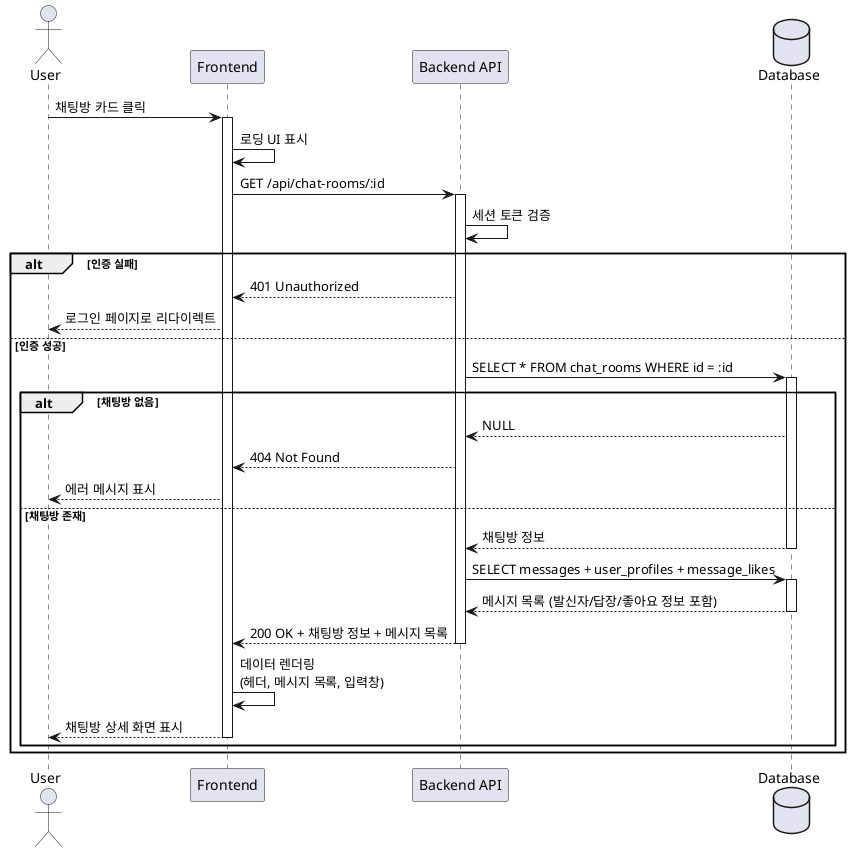

# 유스케이스: UC-007

## 제목
채팅방 상세 조회

---

## 1. 개요

### 1.1 목적
사용자가 특정 채팅방의 상세 정보를 조회하여 메시지를 읽고 대화에 참여할 수 있는 환경을 제공합니다.

### 1.2 범위
- 채팅방 기본 정보(이름) 표시
- 채팅방 메시지 목록 조회 및 표시
- 메시지 입력 UI 제공
- 채팅방이 존재하지 않거나 오류 발생 시 처리

**제외 사항**:
- 메시지 전송 기능 (별도 유스케이스)
- 메시지 상호작용 기능 (답장, 좋아요, 삭제 등 - 별도 유스케이스)
- 실시간 메시지 업데이트 (향후 확장)

### 1.3 액터
- **주요 액터**: 로그인된 사용자
- **부 액터**: 없음

---

## 2. 선행 조건

- 사용자가 인증(로그인)된 상태여야 함
- 유효한 채팅방 ID가 제공되어야 함

---

## 3. 참여 컴포넌트

- **프론트엔드 (FE)**: 채팅방 상세 페이지 (`/chat-rooms/:id`)
- **백엔드 API (BE)**: 채팅방 정보 및 메시지 조회 API (`GET /api/chat-rooms/:id`)
- **데이터베이스 (DB)**:
  - `chat_rooms` 테이블: 채팅방 정보 조회
  - `messages` 테이블: 메시지 목록 조회
  - `user_profiles` 테이블: 발신자 닉네임 조회
  - `message_likes` 테이블: 좋아요 정보 조회

---

## 4. 기본 플로우 (Basic Flow)

### 4.1 단계별 흐름

1. **사용자**: 홈 페이지 채팅방 목록에서 채팅방 카드를 클릭
   - 입력: 채팅방 ID
   - 처리: 채팅방 상세 페이지로 라우팅
   - 출력: 페이지 이동 (`/chat-rooms/:id`)

2. **프론트엔드**: 채팅방 상세 페이지 로딩
   - 입력: URL 파라미터로 채팅방 ID 추출
   - 처리: 로딩 UI 표시 (스켈레톤 또는 로딩 인디케이터)
   - 출력: API 요청 준비

3. **프론트엔드**: 채팅방 정보 조회 요청
   - 입력: 채팅방 ID
   - 처리: `GET /api/chat-rooms/:id` API 호출
   - 출력: HTTP 요청

4. **백엔드**: 인증 확인
   - 입력: 요청 헤더의 세션 토큰
   - 처리: Supabase Auth를 통한 인증 상태 검증
   - 출력: 인증된 사용자 정보 (사용자 ID)

5. **백엔드**: 채팅방 존재 여부 확인
   - 입력: 채팅방 ID
   - 처리: `chat_rooms` 테이블 조회
   - 출력: 채팅방 정보 (id, name, created_at)

6. **백엔드**: 메시지 목록 조회 (선택 사항: 별도 API로 분리 가능)
   - 입력: 채팅방 ID, 현재 사용자 ID
   - 처리: `messages` 테이블 조회, 발신자 정보/답장 정보/좋아요 정보 JOIN
   - 출력: 메시지 목록 (발신자 닉네임, 내용, 답장 정보, 좋아요 개수/상태 포함)

7. **백엔드**: 응답 반환
   - 입력: 채팅방 정보, 메시지 목록
   - 처리: JSON 형식으로 데이터 직렬화
   - 출력: HTTP 200 OK, 응답 본문

8. **프론트엔드**: 데이터 렌더링
   - 입력: API 응답 데이터
   - 처리:
     - 헤더에 채팅방 이름 표시
     - 메시지 목록을 시간 순으로 렌더링
     - 각 메시지에 발신자, 내용, 답장 정보, 좋아요 표시
     - 하단 입력 영역 표시
   - 출력: 완성된 채팅방 상세 UI

9. **사용자**: 채팅방 상세 화면 확인
   - 입력: 렌더링된 UI
   - 처리: 메시지 읽기, 스크롤
   - 출력: 사용자 인터랙션 준비 상태

### 4.2 시퀀스 다이어그램



---

## 5. 대안 플로우 (Alternative Flows)

### 5.1 대안 플로우 1: 메시지가 없는 채팅방

**시작 조건**: 6단계 메시지 목록 조회 시 결과가 빈 배열

**단계**:
1. 백엔드가 빈 배열 반환
2. 프론트엔드가 빈 상태 UI 렌더링
   - "첫 메시지를 보내보세요!" 같은 안내 메시지 표시
   - 입력창은 정상적으로 표시

**결과**: 사용자가 첫 메시지를 작성할 수 있는 상태

### 5.2 대안 플로우 2: 메시지 페이지네이션

**시작 조건**: 메시지 개수가 50개를 초과하는 경우

**단계**:
1. 백엔드가 초기 50개만 반환 (LIMIT 50, OFFSET 0)
2. 프론트엔드가 스크롤 이벤트 감지
3. 사용자가 상단으로 스크롤 시 추가 메시지 요청
4. 백엔드가 다음 50개 반환 (OFFSET 50)
5. 프론트엔드가 기존 목록 상단에 추가 렌더링

**결과**: 무한 스크롤 또는 페이지네이션 동작

---

## 6. 예외 플로우 (Exception Flows)

### 6.1 예외 상황 1: 인증되지 않은 접근

**발생 조건**: 로그인하지 않은 사용자가 채팅방 상세 페이지 접근 시도

**처리 방법**:
1. 백엔드 미들웨어에서 세션 토큰 검증 실패
2. HTTP 401 Unauthorized 응답
3. 프론트엔드가 로그인 페이지로 리다이렉트
4. `redirectedFrom` 파라미터에 원래 URL 저장

**에러 코드**: `401` (Unauthorized)

**사용자 메시지**: "로그인이 필요합니다."

### 6.2 예외 상황 2: 존재하지 않는 채팅방

**발생 조건**: 유효하지 않은 채팅방 ID로 접근 시도

**처리 방법**:
1. 데이터베이스 조회 결과 NULL
2. HTTP 404 Not Found 응답
3. 프론트엔드가 에러 메시지 표시
4. 홈 페이지로 이동 버튼 제공

**에러 코드**: `404` (Not Found)

**사용자 메시지**: "채팅방을 찾을 수 없습니다."

### 6.3 예외 상황 3: 네트워크 오류

**발생 조건**: API 요청 중 네트워크 연결 끊김 또는 타임아웃

**처리 방법**:
1. 프론트엔드에서 요청 실패 감지
2. 에러 메시지 표시
3. 재시도 버튼 제공
4. 사용자 클릭 시 API 재요청

**에러 코드**: `네트워크 오류` (클라이언트 측)

**사용자 메시지**: "네트워크 오류가 발생했습니다. 다시 시도해주세요."

### 6.4 예외 상황 4: 서버 오류 (5xx)

**발생 조건**: 서버에서 예상치 못한 오류 발생

**처리 방법**:
1. 백엔드에서 에러 로깅 (logger.error)
2. HTTP 500 Internal Server Error 응답
3. 프론트엔드가 일반적인 에러 메시지 표시
4. 홈으로 이동 또는 재시도 옵션 제공

**에러 코드**: `500` (Internal Server Error)

**사용자 메시지**: "일시적인 오류가 발생했습니다. 잠시 후 다시 시도해주세요."

### 6.5 예외 상황 5: 삭제된 채팅방 (향후)

**발생 조건**: 채팅방이 삭제된 경우 (현재는 삭제 기능 없음)

**처리 방법**:
1. 데이터베이스 조회 시 삭제 플래그 확인 (또는 레코드 없음)
2. HTTP 410 Gone 응답
3. "채팅방이 삭제되었습니다" 메시지 표시
4. 홈 페이지로 리다이렉트

**에러 코드**: `410` (Gone)

**사용자 메시지**: "채팅방이 삭제되었습니다."

---

## 7. 후행 조건 (Post-conditions)

### 7.1 성공 시

- **데이터베이스 변경**: 없음 (조회만 수행)
- **시스템 상태**:
  - 사용자가 채팅방 상세 화면에 진입한 상태
  - 메시지 목록이 로드되어 표시됨
  - 메시지 입력 준비 상태
- **외부 시스템**: 없음

### 7.2 실패 시

- **데이터 롤백**: 해당 없음 (조회 작업)
- **시스템 상태**:
  - 에러 발생 시: 에러 메시지 표시, 이전 페이지 유지 또는 홈으로 이동
  - 인증 실패 시: 로그인 페이지로 리다이렉트

---

## 8. 비기능 요구사항

### 8.1 성능
- **응답 시간**: 평균 500ms 이하
- **페이지 로딩 시간**: First Contentful Paint < 1.5초
- **메시지 조회**: 초기 50개 메시지 로드, 필요 시 페이지네이션
- **로딩 인디케이터**: 200ms 이상 소요 시 스켈레톤 UI 표시

### 8.2 보안
- **인증**: 모든 요청에 Supabase Auth 세션 토큰 필수
- **권한**: 로그인된 모든 사용자는 모든 채팅방 접근 가능 (오픈 채팅방)
- **XSS 방지**: 메시지 내용 HTML 이스케이프 처리
- **SQL Injection 방지**: 파라미터화된 쿼리 사용

### 8.3 가용성
- **에러 복구**: 네트워크 오류 시 재시도 옵션 제공
- **오프라인 대응**: 네트워크 끊김 감지 및 안내 메시지
- **로딩 상태**: 로딩 중 사용자에게 명확한 피드백

---

## 9. UI/UX 요구사항

### 9.1 화면 구성

**헤더**:
- 뒤로가기 버튼 (← 아이콘): 클릭 시 홈 페이지로 이동
- 채팅방 이름: 중앙 정렬

**메시지 목록 영역**:
- 스크롤 가능한 영역
- 시간 순으로 메시지 표시 (오래된 메시지가 위, 최신 메시지가 아래)
- 각 메시지 표시 요소:
  - 발신자 닉네임 (내 메시지는 우측 정렬, 남의 메시지는 좌측 정렬)
  - 메시지 내용 (텍스트 또는 이모티콘)
  - 답장 대상 정보 (있는 경우): 작은 글씨로 발신자+내용 미리보기
  - 좋아요 표시: 하트 아이콘 + 개수 (있는 경우)
  - 메시지 시간: 작은 글씨로 표시
  - 메시지 메뉴 버튼: 우측 점 3개 아이콘 (호버/터치 시 표시)

**하단 입력 영역**:
- 텍스트 입력창 (플레이스홀더: "메시지를 입력하세요")
- 이모티콘 버튼: 입력창 좌측 아이콘
- 전송 버튼: 입력창 우측 아이콘 (입력값 있을 때만 활성화)

**빈 상태 UI** (메시지 없는 경우):
- 중앙에 안내 메시지: "첫 메시지를 보내보세요!"
- 입력창은 정상 표시

**로딩 상태**:
- 스켈레톤 UI 또는 스피너 표시
- 메시지 목록 영역에 로딩 인디케이터

**에러 상태**:
- 중앙에 에러 메시지 표시
- 재시도 버튼 또는 홈으로 이동 버튼

### 9.2 사용자 경험

- **카카오톡 스타일**: 메시지 레이아웃, 색상, 버블 디자인 참고
- **자동 스크롤**: 페이지 로딩 시 가장 최신 메시지로 자동 스크롤
- **반응형 디자인**: 모바일 화면에 최적화
- **직관적인 네비게이션**: 뒤로가기 버튼 명확히 표시
- **로딩 피드백**: 데이터 로딩 중 명확한 인디케이터
- **에러 안내**: 사용자가 이해하기 쉬운 에러 메시지

---

## 10. 비즈니스 규칙 (Business Rules)

### BR-001: 채팅방 접근 권한
- 모든 로그인된 사용자는 모든 채팅방에 접근 가능
- 채팅방 참여 개념 없음 (오픈 채팅방)

### BR-002: 메시지 표시 순서
- 메시지는 생성 시간(`created_at`) 기준 오름차순 정렬
- 가장 오래된 메시지가 상단, 최신 메시지가 하단

### BR-003: 탈퇴 사용자 메시지
- 발신자가 탈퇴한 경우 `sender_id`는 NULL
- UI에서 "알 수 없음" 또는 "탈퇴한 사용자"로 표시

### BR-004: 답장 대상 메시지 삭제 처리
- 답장 대상 메시지가 삭제된 경우 `reply_to_message_id`는 NULL
- UI에서 "삭제된 메시지" 또는 답장 정보 생략

### BR-005: 메시지 페이지네이션
- 초기 로드 시 최대 50개 메시지 조회
- 추가 메시지는 사용자 스크롤 시 로드 (무한 스크롤)

---

## 11. 테스트 시나리오

### 11.1 성공 케이스

| 테스트 케이스 ID | 입력값 | 기대 결과 |
|----------------|--------|----------|
| TC-007-01 | 로그인 + 유효한 채팅방 ID | 채팅방 상세 화면 표시, 메시지 목록 렌더링 |
| TC-007-02 | 로그인 + 메시지 없는 채팅방 | 빈 상태 UI 표시 ("첫 메시지를 보내보세요!") |
| TC-007-03 | 로그인 + 메시지 50개 이상 채팅방 | 초기 50개 메시지 표시, 스크롤 시 추가 로드 |
| TC-007-04 | 로그인 + 답장/좋아요 포함 메시지 | 답장 정보 및 좋아요 개수 정상 표시 |

### 11.2 실패 케이스

| 테스트 케이스 ID | 입력값 | 기대 결과 |
|----------------|--------|----------|
| TC-007-05 | 비로그인 상태 + 채팅방 ID | 로그인 페이지로 리다이렉트 (401) |
| TC-007-06 | 로그인 + 존재하지 않는 채팅방 ID | "채팅방을 찾을 수 없습니다" 에러 메시지 (404) |
| TC-007-07 | 로그인 + 잘못된 형식의 ID | "잘못된 요청입니다" 에러 메시지 (400) |
| TC-007-08 | 네트워크 끊김 상태 | "네트워크 오류" 메시지 + 재시도 버튼 |
| TC-007-09 | 서버 오류 (500) | "일시적인 오류" 메시지 + 홈 이동 버튼 |

### 11.3 Edge Cases

| 테스트 케이스 ID | 입력값 | 기대 결과 |
|----------------|--------|----------|
| TC-007-10 | 탈퇴한 사용자의 메시지 포함 | "알 수 없음" 또는 "탈퇴한 사용자"로 표시 |
| TC-007-11 | 삭제된 답장 대상 메시지 | "삭제된 메시지" 표시 또는 답장 정보 생략 |
| TC-007-12 | 매우 긴 텍스트 메시지 | 텍스트 줄바꿈 또는 최대 높이 제한 |
| TC-007-13 | 동시에 여러 사용자가 접근 | 각자 독립적으로 정상 조회 |
| TC-007-14 | 채팅방 이름이 매우 긴 경우 | 헤더에서 말줄임(...) 처리 |

---

## 12. 관련 유스케이스

- **선행 유스케이스**:
  - UC-002: 로그인 (인증 필수)
  - UC-005: 채팅방 목록 조회 (채팅방 선택 전)
- **후행 유스케이스**:
  - UC-008: 텍스트 메시지 전송
  - UC-009: 이모티콘 메시지 전송
  - UC-010: 메시지 답장
  - UC-011: 메시지 좋아요
  - UC-012: 메시지 삭제
- **연관 유스케이스**:
  - UC-006: 채팅방 생성

---

## 13. 변경 이력

| 버전 | 날짜 | 작성자 | 변경 내용 |
|------|------|--------|-----------|
| 1.0  | 2025-10-20 | Claude Code | 초기 작성 |

---

## 부록

### A. 용어 정의

- **채팅방**: 사용자들이 메시지를 주고받을 수 있는 공간
- **메시지**: 텍스트 또는 이모티콘 형태의 대화 내용
- **답장 대상 메시지**: 특정 메시지에 대한 응답으로 전송된 메시지가 참조하는 원본 메시지
- **좋아요**: 메시지에 대한 긍정적인 반응 표시
- **스켈레톤 UI**: 콘텐츠 로딩 중 표시되는 회색 플레이스홀더

### B. 참고 자료

- [PRD 문서](/docs/prd.md)
- [Userflow 문서](/docs/userflow.md) - 2.3 채팅방 상세 조회
- [Database 설계 문서](/docs/database.md)
- [카카오톡 UI/UX 레퍼런스](https://www.kakaocorp.com/)

### C. API 명세

#### GET /api/chat-rooms/:id

**요청**:
- Method: GET
- Path: `/api/chat-rooms/:id`
- Headers:
  - `Authorization`: Supabase Auth 세션 토큰

**응답 (성공)**:
```json
{
  "success": true,
  "data": {
    "chatRoom": {
      "id": "uuid",
      "name": "채팅방 이름",
      "createdAt": "2025-10-20T10:00:00Z"
    },
    "messages": [
      {
        "id": "uuid",
        "messageType": "text",
        "content": "안녕하세요",
        "emoticonId": null,
        "createdAt": "2025-10-20T10:05:00Z",
        "senderId": "uuid",
        "senderNickname": "사용자1",
        "replyTo": {
          "id": "uuid",
          "content": "반갑습니다",
          "messageType": "text",
          "senderNickname": "사용자2"
        },
        "likeCount": 3,
        "isLikedByMe": true
      }
    ]
  }
}
```

**응답 (실패 - 404)**:
```json
{
  "success": false,
  "error": {
    "code": "CHAT_ROOM_NOT_FOUND",
    "message": "채팅방을 찾을 수 없습니다."
  }
}
```

**응답 (실패 - 401)**:
```json
{
  "success": false,
  "error": {
    "code": "UNAUTHORIZED",
    "message": "로그인이 필요합니다."
  }
}
```

---

**문서 종료**
