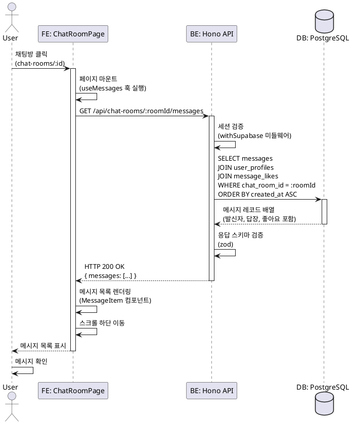

# 유스케이스: 메시지 목록 조회

## 유스케이스 ID: UC-008

### 제목
채팅방 메시지 목록 조회 및 실시간 표시

---

## 1. 개요

### 1.1 목적
사용자가 특정 채팅방에 입장했을 때 해당 채팅방의 모든 메시지를 시간 순으로 조회하여 표시하고, 각 메시지의 발신자, 내용, 답장 정보, 좋아요 정보를 함께 보여줌으로써 원활한 채팅 경험을 제공합니다.

### 1.2 범위
- 채팅방 상세 페이지 접근 시 자동 메시지 목록 조회
- 메시지 타입(텍스트/이모티콘)에 따른 적절한 렌더링
- 답장 대상 메시지 정보 표시
- 좋아요 개수 및 사용자의 좋아요 여부 표시
- 메시지 시간 표시

**제외 사항**:
- 메시지 전송 기능 (UC-009, UC-010에서 처리)
- 메시지 삭제 기능 (UC-012, UC-013에서 처리)
- 메시지 답장/좋아요 액션 (UC-011, UC-012에서 처리)
- 실시간 업데이트 (선택 사항, 향후 확장)

### 1.3 액터
- **주요 액터**: 로그인한 사용자
- **부 액터**: 없음 (시스템 자동 실행)

---

## 2. 선행 조건

- 사용자가 로그인되어 있어야 함
- 사용자가 채팅방 상세 페이지(`/chat-rooms/:id`)에 접근해야 함
- 접근하려는 채팅방이 존재해야 함

---

## 3. 참여 컴포넌트

### 3.1 Frontend
- **페이지**: `/chat-rooms/:id` - 채팅방 상세 페이지
- **컴포넌트**:
  - `MessageList` - 메시지 목록 표시 컴포넌트
  - `MessageItem` - 개별 메시지 표시 컴포넌트
- **Hooks**:
  - `useMessages` - 메시지 목록 조회 React Query 훅

### 3.2 Backend
- **API 엔드포인트**: `GET /api/chat-rooms/:roomId/messages`
- **서비스**: `src/features/messages/backend/service.ts` - 메시지 조회 로직
- **스키마**: `src/features/messages/backend/schema.ts` - 응답 스키마 정의

### 3.3 Database
- **주요 테이블**: `messages`, `user_profiles`, `message_likes`
- **조인**: 발신자 닉네임, 답장 대상 메시지, 좋아요 정보

---

## 4. 기본 플로우 (Basic Flow)

### 4.1 단계별 흐름

1. **사용자**: 채팅방 목록에서 특정 채팅방 클릭
   - 입력: 채팅방 ID (URL 파라미터)
   - 처리: Next.js 라우팅으로 `/chat-rooms/:id` 페이지 이동
   - 출력: 채팅방 상세 페이지 렌더링 시작

2. **Frontend**: 페이지 마운트 시 메시지 목록 조회 요청
   - 입력: 채팅방 ID
   - 처리: React Query를 통해 `GET /api/chat-rooms/:roomId/messages` 호출
   - 출력: 로딩 상태 표시 (스켈레톤 UI)

3. **Backend**: 메시지 목록 조회 요청 수신
   - 입력: 채팅방 ID, 현재 사용자 ID (세션)
   - 처리:
     - Supabase Auth 세션 검증
     - 채팅방 존재 여부 확인
     - 메시지 목록 쿼리 실행 (페이지네이션 포함)
   - 출력: HTTP 200 + 메시지 목록 JSON 응답

4. **Database**: 메시지 조회 쿼리 실행
   - 입력: 채팅방 ID, 현재 사용자 ID
   - 처리:
     - `messages` 테이블에서 `chat_room_id`로 필터링
     - `user_profiles`와 조인하여 발신자 닉네임 조회
     - `messages`와 자기 참조 조인하여 답장 대상 메시지 조회
     - `message_likes`와 조인하여 좋아요 개수 및 사용자 좋아요 여부 조회
     - `created_at` 기준 오름차순 정렬
     - LIMIT/OFFSET으로 페이지네이션
   - 출력: 메시지 레코드 배열

5. **Frontend**: 메시지 목록 렌더링
   - 입력: 메시지 목록 JSON
   - 처리:
     - 각 메시지를 `MessageItem` 컴포넌트로 렌더링
     - 메시지 타입에 따라 텍스트 또는 이모티콘 표시
     - 답장 대상 메시지가 있으면 미리보기 표시
     - 좋아요 개수 및 하트 아이콘 표시
     - 자동 스크롤 하단으로 이동
   - 출력: 메시지 목록 UI 표시

6. **사용자**: 메시지 목록 확인
   - 입력: 화면에 표시된 메시지 목록
   - 처리: 메시지 읽기, 스크롤 이동
   - 출력: 후속 액션 (메시지 전송, 답장, 좋아요 등)

### 4.2 시퀀스 다이어그램



---

## 5. 대안 플로우 (Alternative Flows)

### 5.1 대안 플로우 1: 빈 메시지 목록

**시작 조건**: 채팅방에 메시지가 하나도 없는 경우

**단계**:
1. Database가 빈 배열 반환
2. Backend가 HTTP 200 + 빈 배열 응답
3. Frontend가 빈 상태 UI 표시
   - "아직 메시지가 없습니다. 첫 메시지를 보내보세요!" 안내 문구
   - 입력창 강조 표시

**결과**: 사용자가 첫 메시지를 전송하도록 유도

### 5.2 대안 플로우 2: 페이지네이션 (무한 스크롤)

**시작 조건**: 메시지가 50개 이상 존재하는 경우

**단계**:
1. 첫 요청 시 최신 50개 메시지만 조회 (LIMIT 50)
2. 사용자가 스크롤을 위로 올림 (과거 메시지 조회)
3. Frontend가 다음 페이지 요청 (`offset=50`)
4. Backend가 추가 메시지 50개 반환
5. Frontend가 기존 목록 상단에 추가 렌더링

**결과**: 성능 최적화 및 원활한 스크롤 경험

### 5.3 대안 플로우 3: 답장 대상 메시지가 삭제된 경우

**시작 조건**: 메시지가 답장 메시지인데 답장 대상이 삭제됨 (`reply_to_message_id`는 존재하지만 조인 결과 NULL)

**단계**:
1. Database 조인 쿼리에서 `reply_msg`가 NULL로 반환
2. Backend가 답장 대상 필드를 NULL로 응답
3. Frontend가 "삭제된 메시지" 또는 답장 정보 생략 처리

**결과**: 답장 메시지는 유지되지만 답장 대상 정보는 표시 안 함

---

## 6. 예외 플로우 (Exception Flows)

### 6.1 예외 상황 1: 인증되지 않은 사용자

**발생 조건**: 로그인하지 않은 상태에서 채팅방 상세 페이지 접근

**처리 방법**:
1. Backend 미들웨어에서 세션 검증 실패
2. HTTP 401 Unauthorized 응답
3. Frontend가 로그인 페이지로 리다이렉트
4. `redirectedFrom` 파라미터에 현재 페이지 URL 저장

**에러 코드**: `AUTH_REQUIRED` (HTTP 401)

**사용자 메시지**: "로그인이 필요합니다."

### 6.2 예외 상황 2: 존재하지 않는 채팅방

**발생 조건**: 잘못된 채팅방 ID로 접근 또는 채팅방이 삭제됨

**처리 방법**:
1. Backend에서 채팅방 존재 여부 확인 실패
2. HTTP 404 Not Found 응답
3. Frontend가 404 에러 페이지 또는 에러 메시지 표시
4. 홈 페이지로 이동 버튼 제공

**에러 코드**: `CHAT_ROOM_NOT_FOUND` (HTTP 404)

**사용자 메시지**: "채팅방을 찾을 수 없습니다."

### 6.3 예외 상황 3: 네트워크 오류

**발생 조건**: API 요청 실패 (서버 다운, 네트워크 연결 끊김 등)

**처리 방법**:
1. Frontend에서 API 요청 타임아웃 또는 네트워크 에러 감지
2. React Query의 자동 재시도 로직 실행 (최대 3회)
3. 재시도 실패 시 에러 상태 표시
4. "재시도" 버튼 제공

**에러 코드**: `NETWORK_ERROR` (클라이언트)

**사용자 메시지**: "네트워크 오류가 발생했습니다. 다시 시도해주세요."

### 6.4 예외 상황 4: 서버 오류 (5xx)

**발생 조건**: 데이터베이스 에러, 서버 내부 오류 등

**처리 방법**:
1. Backend에서 예외 발생
2. 에러 미들웨어에서 로깅 및 정규화
3. HTTP 500 Internal Server Error 응답
4. Frontend가 일반 에러 메시지 표시
5. 홈 페이지로 이동 버튼 제공

**에러 코드**: `INTERNAL_SERVER_ERROR` (HTTP 500)

**사용자 메시지**: "서버 오류가 발생했습니다. 잠시 후 다시 시도해주세요."

---

## 7. 후행 조건 (Post-conditions)

### 7.1 성공 시

- **데이터베이스 변경**: 없음 (읽기 전용)
- **시스템 상태**:
  - Frontend에 메시지 목록 캐시 (React Query)
  - 사용자가 메시지를 확인할 수 있는 상태
- **외부 시스템**: 없음

### 7.2 실패 시

- **데이터 롤백**: 없음 (읽기 전용)
- **시스템 상태**:
  - 에러 상태 표시
  - 재시도 또는 페이지 이동 대기

---

## 8. 비기능 요구사항

### 8.1 성능
- **응답 시간**: 평균 500ms 이하
- **페이지네이션**: 50개 단위로 메시지 조회 (무한 스크롤)
- **쿼리 최적화**:
  - 복합 인덱스 활용 (`chat_room_id, created_at`)
  - 조인 최소화 (LATERAL JOIN 고려)
- **캐싱**: React Query를 통한 클라이언트 캐싱 (5분)

### 8.2 보안
- **인증**: Supabase Auth 세션 검증 필수
- **권한**: 모든 로그인 사용자가 모든 채팅방 메시지 조회 가능 (오픈형)
- **XSS 방지**: 메시지 내용 sanitization (텍스트 렌더링 시)
- **SQL Injection 방지**: Supabase 파라미터화 쿼리 사용

### 8.3 가용성
- **재시도 로직**: API 요청 실패 시 자동 재시도 (React Query)
- **에러 핸들링**: 명확한 에러 메시지 및 복구 방법 제시
- **오프라인 지원**: 없음 (향후 확장 가능)

---

## 9. UI/UX 요구사항

### 9.1 화면 구성

#### 레이아웃
- **헤더**:
  - 뒤로가기 버튼 (홈으로 이동)
  - 채팅방 이름
- **메시지 목록 영역**:
  - 스크롤 가능한 메시지 목록
  - 카카오톡 스타일 말풍선
- **하단 입력 영역**:
  - 텍스트 입력창
  - 이모티콘 버튼
  - 전송 버튼

#### 메시지 아이템 구성
- **내 메시지**: 우측 정렬, 파란색 말풍선
- **남의 메시지**: 좌측 정렬, 회색 말풍선
  - 발신자 닉네임 (상단)
  - 메시지 내용 (텍스트 또는 이모티콘)
  - 답장 대상 메시지 미리보기 (있는 경우)
  - 좋아요 하트 아이콘 + 개수 (있는 경우)
  - 메시지 시간 (우측 하단)
  - 메시지 메뉴 버튼 (우측 상단)

### 9.2 사용자 경험

#### 로딩 상태
- **첫 로딩**: 스켈레톤 UI (메시지 말풍선 모양)
- **페이지네이션 로딩**: 상단에 작은 로딩 인디케이터

#### 스크롤 동작
- **첫 진입 시**: 자동으로 최하단 스크롤 (최신 메시지)
- **과거 메시지 조회**: 위로 스크롤 시 자동 로드 (무한 스크롤)
- **새 메시지 수신 시** (향후 Realtime 적용):
  - 하단에 있으면 자동 스크롤
  - 상단에 있으면 "새 메시지" 알림 배지

#### 빈 상태
- **메시지 없음**:
  - 중앙 정렬 안내 문구
  - "첫 메시지를 보내보세요!" 문구

#### 에러 상태
- **네트워크 에러**:
  - 에러 메시지 표시
  - 재시도 버튼
- **채팅방 없음**:
  - 404 안내 문구
  - 홈으로 이동 버튼

---

## 10. 테스트 시나리오

### 10.1 성공 케이스

| 테스트 케이스 ID | 입력값 | 기대 결과 |
|----------------|--------|----------|
| TC-008-01 | 로그인 후 존재하는 채팅방 ID로 접근 | 메시지 목록이 시간 순으로 표시됨 |
| TC-008-02 | 텍스트 메시지만 있는 채팅방 | 모든 텍스트 메시지가 올바르게 표시됨 |
| TC-008-03 | 이모티콘 메시지만 있는 채팅방 | 모든 이모티콘이 이미지로 표시됨 |
| TC-008-04 | 답장 메시지가 포함된 채팅방 | 답장 대상 메시지 미리보기가 표시됨 |
| TC-008-05 | 좋아요가 있는 메시지 | 하트 아이콘과 좋아요 개수가 표시됨 |
| TC-008-06 | 내가 좋아요한 메시지 | 하트 아이콘이 핑크색으로 표시됨 |
| TC-008-07 | 메시지가 없는 채팅방 | 빈 상태 UI 및 안내 문구 표시 |
| TC-008-08 | 메시지 50개 이상인 채팅방 | 첫 50개만 로드, 스크롤 시 추가 로드 |

### 10.2 실패 케이스

| 테스트 케이스 ID | 입력값 | 기대 결과 |
|----------------|--------|----------|
| TC-008-09 | 비로그인 상태에서 접근 | 로그인 페이지로 리다이렉트 (401) |
| TC-008-10 | 존재하지 않는 채팅방 ID | 404 에러 페이지 표시 |
| TC-008-11 | 삭제된 채팅방 ID | 404 에러 페이지 표시 |
| TC-008-12 | 네트워크 연결 끊김 | 에러 메시지 + 재시도 버튼 표시 |
| TC-008-13 | 서버 오류 (500) | 일반 에러 메시지 + 홈 이동 버튼 |
| TC-008-14 | 답장 대상 메시지가 삭제된 경우 | 답장 정보 생략 또는 "삭제된 메시지" 표시 |
| TC-008-15 | 발신자가 탈퇴한 메시지 | "알 수 없음" 등으로 표시 |

---

## 11. 비즈니스 룰

### 11.1 메시지 조회 권한
- 모든 로그인 사용자가 모든 채팅방의 메시지를 조회할 수 있음
- 채팅방 참여 개념 없음 (오픈형 채팅)

### 11.2 메시지 정렬
- 메시지는 항상 `created_at` 기준 오름차순 (과거 → 현재)

### 11.3 페이지네이션
- 최신 메시지부터 50개 단위로 조회
- 무한 스크롤 방식 (위로 스크롤 시 과거 메시지 로드)

### 11.4 답장 메시지 처리
- 답장 대상 메시지가 삭제된 경우 답장 정보는 NULL이지만 메시지는 유지
- UI에서 삭제된 메시지는 "삭제된 메시지" 또는 정보 생략으로 표시

### 11.5 좋아요 표시
- 좋아요 개수가 0개인 경우 하트 아이콘 미표시
- 내가 좋아요한 메시지는 핑크색 하트, 그 외는 회색 하트

### 11.6 발신자 표시
- 발신자가 탈퇴한 경우 (`sender_id`가 NULL) "알 수 없음" 등으로 표시
- 내 메시지와 남의 메시지는 좌우 정렬로 구분

---

## 12. 관련 유스케이스

- **선행 유스케이스**:
  - UC-002: 로그인
  - UC-005: 채팅방 목록 조회
  - UC-007: 채팅방 상세 조회

- **후행 유스케이스**:
  - UC-009: 텍스트 메시지 전송
  - UC-010: 이모티콘 메시지 전송
  - UC-011: 메시지 답장
  - UC-012: 메시지 좋아요
  - UC-013: 메시지 삭제

- **연관 유스케이스**:
  - UC-014: 실시간 메시지 업데이트 (선택 사항)

---

## 13. 변경 이력

| 버전 | 날짜 | 작성자 | 변경 내용 |
|------|------|--------|-----------|
| 1.0 | 2025-10-20 | Claude Code | 초기 작성 |

---

## 부록

### A. 용어 정의

- **메시지 목록**: 특정 채팅방에 속한 모든 메시지의 집합
- **페이지네이션**: 대량의 데이터를 일정 단위로 나누어 조회하는 방식
- **무한 스크롤**: 스크롤 이동 시 자동으로 다음 페이지를 로드하는 UI 패턴
- **스켈레톤 UI**: 로딩 중 콘텐츠의 형태를 미리 보여주는 플레이스홀더
- **답장 메시지**: 특정 메시지에 대한 응답으로 전송된 메시지
- **좋아요**: 메시지에 대한 긍정적인 반응 표시

### B. 참고 자료

#### API 명세
- `GET /api/chat-rooms/:roomId/messages`
  - Query Parameters:
    - `limit`: 조회할 메시지 개수 (기본값: 50)
    - `offset`: 건너뛸 메시지 개수 (기본값: 0)
  - Response:
    ```json
    {
      "messages": [
        {
          "id": "uuid",
          "chatRoomId": "uuid",
          "senderId": "uuid",
          "senderNickname": "string",
          "messageType": "text" | "emoticon",
          "content": "string | null",
          "emoticonId": "string | null",
          "replyTo": {
            "id": "uuid",
            "senderNickname": "string",
            "content": "string",
            "messageType": "text" | "emoticon",
            "emoticonId": "string | null"
          } | null,
          "likeCount": 0,
          "isLikedByMe": false,
          "createdAt": "ISO 8601"
        }
      ],
      "hasMore": true
    }
    ```

#### Database Schema
- **messages** 테이블 참조 (`/docs/database.md`)
- **user_profiles** 테이블 참조
- **message_likes** 테이블 참조

#### UI/UX 참고
- 카카오톡 메시지 레이아웃
- Material Design 스켈레톤 패턴

---

**문서 종료**
