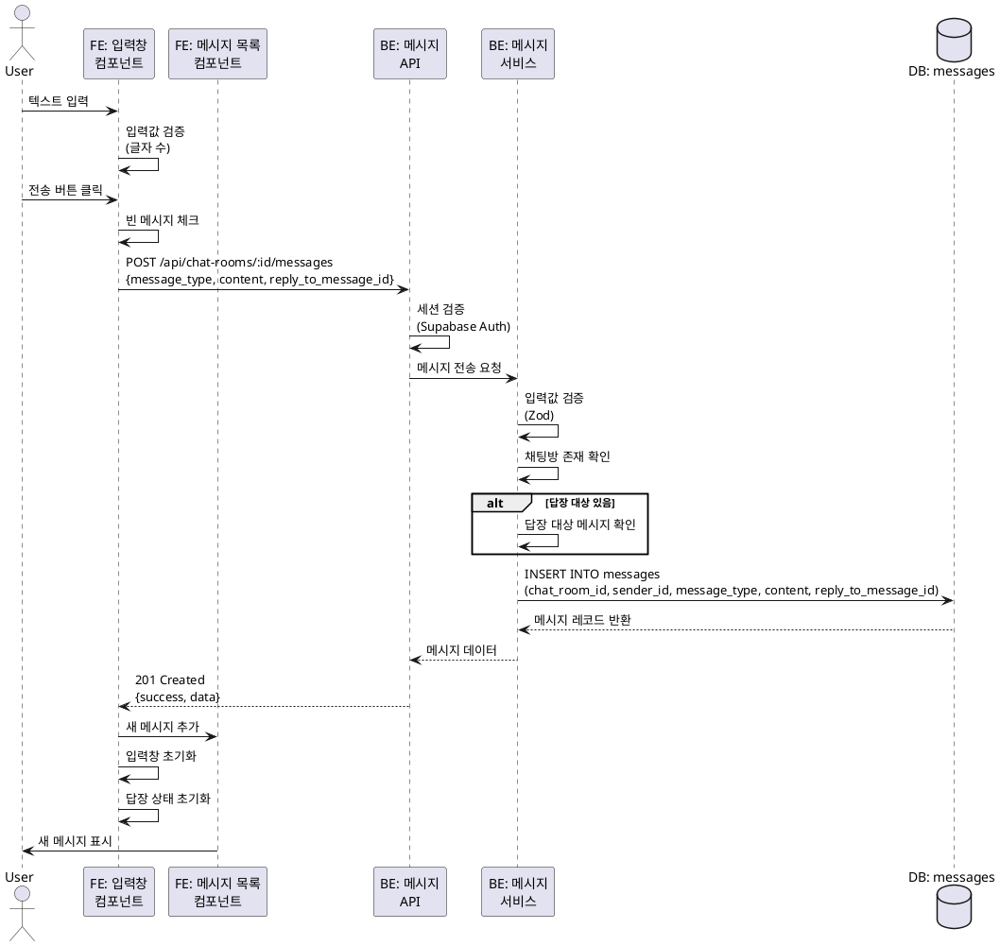

# 유스케이스: UC-009 텍스트 메시지 전송

## 제목
채팅방에서 텍스트 메시지 전송하기

---

## 1. 개요

### 1.1 목적
사용자가 채팅방에서 텍스트 메시지를 작성하고 전송하여 다른 사용자들과 실시간으로 소통할 수 있도록 한다.

### 1.2 범위
- 텍스트 메시지 입력 및 전송
- 일반 메시지 전송 (답장 없음)
- 답장 메시지 전송 (답장 대상 메시지 포함)
- 메시지 전송 후 목록 업데이트

**제외 사항**:
- 이모티콘 메시지 전송 (UC-010)
- 메시지 삭제 (UC-012, UC-013)
- 메시지 좋아요 (UC-011)

### 1.3 액터
- **주요 액터**: 로그인한 사용자
- **부 액터**: 채팅방에 접속한 다른 사용자들 (실시간 업데이트 시)

---

## 2. 선행 조건

- 사용자가 로그인 상태여야 함
- 사용자가 채팅방 상세 페이지(`/chat-rooms/:id`)에 접근한 상태
- 채팅방이 존재해야 함

---

## 3. 참여 컴포넌트

### 3.1 프론트엔드
- **입력창 컴포넌트**: 텍스트 입력 및 전송 버튼
- **답장 미리보기 컴포넌트**: 답장 대상 메시지 표시 (조건부)
- **메시지 목록 컴포넌트**: 전송된 메시지 표시

### 3.2 백엔드
- **메시지 전송 API**: `POST /api/chat-rooms/:roomId/messages`
- **메시지 서비스**: 메시지 검증 및 데이터베이스 저장

### 3.3 데이터베이스
- **messages 테이블**: 메시지 저장

---

## 4. 기본 플로우 (Basic Flow)

### 4.1 단계별 흐름

#### 1. 사용자: 텍스트 입력
- **입력**: 채팅방 하단 입력창에 텍스트 입력 (1~1000자)
- **처리**:
  - 입력값 실시간 검증 (글자 수 카운팅)
  - 빈 메시지인 경우 전송 버튼 비활성화
- **출력**: 입력창에 텍스트 표시

#### 2. 사용자: 전송 버튼 클릭 또는 Enter 키 입력
- **입력**: 전송 버튼 클릭 또는 키보드 Enter
- **처리**: 전송 이벤트 발생
- **출력**: -

#### 3. 프론트엔드: 입력값 검증
- **입력**: 입력창의 텍스트 값
- **처리**:
  - 빈 메시지 체크 (공백만 있는 경우 포함)
  - 길이 검증 (1~1000자)
  - 답장 대상 메시지 ID 확인 (있는 경우)
- **출력**:
  - 성공: 다음 단계 진행
  - 실패: 에러 메시지 표시, 전송 차단

#### 4. 프론트엔드: 메시지 전송 요청
- **입력**:
  - `chat_room_id`: 현재 채팅방 ID
  - `message_type`: "text"
  - `content`: 입력한 텍스트
  - `reply_to_message_id`: 답장 대상 메시지 ID (선택)
- **처리**: `POST /api/chat-rooms/:roomId/messages` API 호출
- **출력**: 로딩 상태 표시

#### 5. 백엔드: 인증 검증
- **입력**: HTTP 요청의 세션 토큰
- **처리**: Supabase Auth 세션 검증
- **출력**:
  - 성공: 사용자 ID 추출
  - 실패: 401 Unauthorized 응답

#### 6. 백엔드: 입력값 검증
- **입력**: 요청 본문 (`message_type`, `content`, `reply_to_message_id`)
- **처리**:
  - Zod 스키마 검증
  - `message_type`이 "text"인지 확인
  - `content` 존재 여부 및 길이 확인 (1~1000자)
  - `emoticon_id`가 null인지 확인
  - `reply_to_message_id`가 유효한 UUID인지 확인 (있는 경우)
- **출력**:
  - 성공: 다음 단계 진행
  - 실패: 400 Bad Request 응답

#### 7. 백엔드: 채팅방 존재 확인
- **입력**: `chat_room_id`
- **처리**: `chat_rooms` 테이블 조회
- **출력**:
  - 성공: 다음 단계 진행
  - 실패: 404 Not Found 응답

#### 8. 백엔드: 답장 대상 메시지 확인 (선택)
- **입력**: `reply_to_message_id` (있는 경우)
- **처리**: `messages` 테이블 조회
- **출력**:
  - 성공 또는 null: 다음 단계 진행
  - 실패: 답장 대상 무시하고 일반 메시지로 처리 (또는 400 에러)

#### 9. 백엔드: 메시지 저장
- **입력**:
  - `chat_room_id`
  - `sender_id`: 현재 사용자 ID
  - `message_type`: "text"
  - `content`: 입력 텍스트
  - `reply_to_message_id`: 답장 대상 ID (선택)
- **처리**: `messages` 테이블에 INSERT
- **출력**:
  - 성공: 생성된 메시지 레코드 반환
  - 실패: 500 Internal Server Error

#### 10. 백엔드: 응답 반환
- **입력**: 생성된 메시지 데이터
- **처리**: JSON 응답 생성
- **출력**:
  - HTTP 201 Created
  - 응답 본문:
    ```json
    {
      "success": true,
      "data": {
        "id": "uuid",
        "chat_room_id": "uuid",
        "sender_id": "uuid",
        "message_type": "text",
        "content": "메시지 내용",
        "reply_to_message_id": "uuid | null",
        "created_at": "2025-10-20T12:00:00Z"
      }
    }
    ```

#### 11. 프론트엔드: UI 업데이트
- **입력**: 서버 응답 데이터
- **처리**:
  - 메시지 목록에 새 메시지 추가
  - 입력창 초기화 (텍스트 삭제)
  - 답장 대상 상태 초기화 (있는 경우)
  - 스크롤을 하단으로 이동 (자동 스크롤)
- **출력**:
  - 새 메시지가 목록에 표시
  - 입력창이 비어있음
  - 답장 미리보기 영역 숨김 (있었던 경우)

### 4.2 시퀀스 다이어그램



---

## 5. 대안 플로우 (Alternative Flows)

### 5.1 대안 플로우 1: 답장 메시지 전송

**시작 조건**: 사용자가 답장 대상 메시지를 설정한 상태

**단계**:
1. 사용자가 다른 사용자의 메시지에서 "답장" 버튼 클릭 (UC-010 참조)
2. 입력창 상단에 답장 대상 메시지 미리보기 표시
   - 발신자 닉네임 + 메시지 내용
   - X 버튼 (취소)
3. 사용자가 텍스트 입력 후 전송
4. 기본 플로우 실행 (답장 대상 ID 포함)
5. 전송 성공 시 답장 미리보기 영역 숨김
6. 메시지 목록에서 새 메시지에 답장 정보 표시

**결과**: 답장 메시지가 전송되고, 목록에서 답장 대상이 함께 표시됨

### 5.2 대안 플로우 2: Enter 키로 전송

**시작 조건**: 사용자가 텍스트를 입력한 상태

**단계**:
1. 사용자가 입력창에서 Enter 키 입력
2. Shift+Enter는 줄바꿈, Enter만 누르면 전송
3. 기본 플로우 실행

**결과**: 키보드만으로 빠르게 메시지 전송

### 5.3 대안 플로우 3: 답장 취소

**시작 조건**: 답장 대상이 설정된 상태

**단계**:
1. 사용자가 답장 미리보기 영역의 X 버튼 클릭
2. 답장 대상 상태 초기화
3. 답장 미리보기 영역 숨김
4. 사용자가 텍스트 입력 후 전송 시 일반 메시지로 전송

**결과**: 답장 대상이 제거되고 일반 메시지로 전환됨

---

## 6. 예외 플로우 (Exception Flows)

### 6.1 예외 상황 1: 빈 메시지 전송 시도

**발생 조건**: 사용자가 빈 입력창 또는 공백만 입력한 상태에서 전송 시도

**처리 방법**:
1. 프론트엔드에서 전송 버튼 비활성화 (UX 개선)
2. 만약 전송 요청이 발생한 경우, 백엔드에서 400 에러 반환
3. 사용자에게 "메시지를 입력해주세요" 에러 메시지 표시

**에러 코드**: `INVALID_MESSAGE_CONTENT` (HTTP 400)

**사용자 메시지**: "메시지를 입력해주세요."

### 6.2 예외 상황 2: 메시지 길이 초과

**발생 조건**: 사용자가 1000자를 초과하는 메시지 입력

**처리 방법**:
1. 입력창에 글자 수 카운터 표시 (예: 1024/1000)
2. 1000자 초과 시 전송 버튼 비활성화
3. 만약 전송 요청이 발생한 경우, 백엔드에서 400 에러 반환
4. 사용자에게 "메시지는 최대 1000자까지 입력할 수 있습니다" 에러 메시지 표시

**에러 코드**: `MESSAGE_TOO_LONG` (HTTP 400)

**사용자 메시지**: "메시지는 최대 1000자까지 입력할 수 있습니다."

### 6.3 예외 상황 3: 인증되지 않은 사용자

**발생 조건**: 세션이 만료되었거나 로그아웃된 상태에서 메시지 전송 시도

**처리 방법**:
1. 백엔드에서 401 Unauthorized 응답
2. 프론트엔드에서 인증 상태 초기화
3. 로그인 페이지로 리다이렉트
4. "세션이 만료되었습니다. 다시 로그인해주세요." 메시지 표시

**에러 코드**: `UNAUTHORIZED` (HTTP 401)

**사용자 메시지**: "세션이 만료되었습니다. 다시 로그인해주세요."

### 6.4 예외 상황 4: 채팅방이 존재하지 않음

**발생 조건**: 채팅방이 삭제되었거나 존재하지 않는 ID로 전송 시도

**처리 방법**:
1. 백엔드에서 404 Not Found 응답
2. "채팅방을 찾을 수 없습니다" 에러 메시지 표시
3. 홈 페이지로 리다이렉트 안내

**에러 코드**: `CHAT_ROOM_NOT_FOUND` (HTTP 404)

**사용자 메시지**: "채팅방을 찾을 수 없습니다."

### 6.5 예외 상황 5: 네트워크 연결 끊김

**발생 조건**: 메시지 전송 중 네트워크 오류 발생

**처리 방법**:
1. 네트워크 에러 감지
2. "네트워크 연결을 확인해주세요" 에러 메시지 표시
3. 재시도 버튼 제공
4. 입력창의 메시지는 유지 (사용자가 다시 입력하지 않도록)

**에러 코드**: `NETWORK_ERROR`

**사용자 메시지**: "네트워크 연결을 확인해주세요."

### 6.6 예외 상황 6: 서버 오류 (5xx)

**발생 조건**: 서버에서 예상치 못한 오류 발생

**처리 방법**:
1. 백엔드에서 500 Internal Server Error 응답
2. 에러 로깅 (서버 측)
3. "일시적인 오류가 발생했습니다. 잠시 후 다시 시도해주세요" 에러 메시지 표시
4. 입력창의 메시지는 유지

**에러 코드**: `INTERNAL_SERVER_ERROR` (HTTP 500)

**사용자 메시지**: "일시적인 오류가 발생했습니다. 잠시 후 다시 시도해주세요."

### 6.7 예외 상황 7: 답장 대상 메시지가 삭제됨

**발생 조건**: 답장 대상으로 설정한 메시지가 전송 전에 삭제됨

**처리 방법**:
1. 백엔드에서 답장 대상 메시지 조회 시 null 반환
2. 답장 대상 정보 무시하고 일반 메시지로 처리
3. 전송 성공 처리
4. (선택) 프론트엔드에서 "답장 대상 메시지가 삭제되어 일반 메시지로 전송되었습니다" 알림 표시

**에러 코드**: (에러 아님, 정상 처리)

**사용자 메시지**: (선택) "답장 대상 메시지가 삭제되어 일반 메시지로 전송되었습니다."

---

## 7. 후행 조건 (Post-conditions)

### 7.1 성공 시

**데이터베이스 변경**:
- `messages` 테이블에 새 레코드 삽입
  - `id`: 자동 생성된 UUID
  - `chat_room_id`: 현재 채팅방 ID
  - `sender_id`: 현재 사용자 ID
  - `message_type`: "text"
  - `content`: 입력한 텍스트
  - `emoticon_id`: null
  - `reply_to_message_id`: 답장 대상 ID 또는 null
  - `created_at`: 현재 시간

**시스템 상태**:
- 채팅방의 최근 메시지 시간 업데이트 (채팅방 목록 정렬에 영향)
- 메시지 목록에 새 메시지 추가
- 입력창 초기화
- 답장 상태 초기화 (있었던 경우)

**외부 시스템**:
- (실시간 업데이트 활성화 시) Supabase Realtime을 통해 다른 사용자에게 새 메시지 이벤트 전송

### 7.2 실패 시

**데이터 롤백**:
- 데이터베이스 변경 없음 (INSERT 실패 또는 미실행)

**시스템 상태**:
- 입력창의 메시지 유지 (사용자가 다시 입력하지 않도록)
- 답장 상태 유지 (있는 경우)
- 에러 메시지 표시

---

## 8. 비즈니스 규칙 (Business Rules)

### BR-1: 메시지 길이 제한
- 텍스트 메시지는 최소 1자, 최대 1000자까지 입력 가능
- 공백만 있는 메시지는 전송 불가

### BR-2: 인증 필수
- 모든 메시지 전송은 로그인된 사용자만 가능
- 세션 만료 시 자동으로 로그인 페이지로 리다이렉트

### BR-3: 채팅방 참여 제한 없음
- 모든 사용자가 모든 채팅방에 메시지 전송 가능
- 별도의 채팅방 참여 또는 권한 체크 없음

### BR-4: 메시지 수정 불가
- 한 번 전송된 메시지는 수정할 수 없음
- 삭제만 가능 (UC-012, UC-013 참조)

### BR-5: 답장 대상 유연성
- 답장 대상 메시지가 삭제된 경우에도 메시지 전송 가능
- 답장 정보는 선택 사항 (null 허용)

### BR-6: XSS 방지
- 사용자 입력값은 HTML 태그 이스케이프 처리
- 스크립트 실행 방지

---

## 9. 비기능 요구사항

### 9.1 성능
- **응답 시간**: 메시지 전송 API 평균 응답 시간 < 500ms
- **처리량**: 동시에 100명의 사용자가 메시지 전송 가능
- **스크롤 성능**: 새 메시지 추가 시 UI 렌더링 < 100ms

### 9.2 보안
- **인증**: Supabase Auth 세션 검증 (모든 요청)
- **권한**: 로그인된 사용자만 메시지 전송 가능
- **입력값 검증**: 클라이언트 및 서버 양측 검증
- **XSS 방지**: HTML 이스케이프 처리
- **SQL Injection 방지**: Prepared Statement 사용

### 9.3 가용성
- **시스템 가동 시간**: 99.9% 이상
- **에러 핸들링**: 모든 예외 상황에 대한 사용자 친화적 에러 메시지
- **재시도 로직**: 네트워크 오류 시 수동 재시도 가능

### 9.4 사용성
- **직관적 UI**: 전송 버튼 명확히 표시
- **피드백**: 전송 중 로딩 인디케이터 표시
- **자동 스크롤**: 메시지 전송 후 목록 하단으로 자동 스크롤
- **글자 수 표시**: 입력 중 현재 글자 수 표시 (선택)

---

## 10. UI/UX 요구사항

### 10.1 화면 구성

#### 입력 영역 (하단 고정)
- **텍스트 입력창**:
  - 여러 줄 입력 가능 (텍스트 영역)
  - Placeholder: "메시지를 입력하세요"
  - 최소 높이: 1줄, 최대 높이: 5줄 (자동 확장)
- **전송 버튼**:
  - 위치: 입력창 우측
  - 아이콘: 종이비행기 또는 화살표
  - 비활성화 상태: 회색 (빈 메시지 시)
  - 활성화 상태: 파란색
- **답장 미리보기 영역** (조건부):
  - 위치: 입력창 상단
  - 내용: 발신자 닉네임 + 메시지 내용 (최대 1줄, 말줄임표)
  - X 버튼: 우측 상단 (답장 취소)

#### 메시지 목록
- **새 메시지**:
  - 내 메시지: 우측 정렬, 파란색 말풍선
  - 남의 메시지: 좌측 정렬, 회색 말풍선
  - 발신자 닉네임 표시 (남의 메시지)
  - 메시지 시간 표시 (HH:MM)
  - 답장 정보 표시 (있는 경우): 메시지 위에 작은 회색 박스

### 10.2 사용자 경험

- **즉각적 피드백**: 전송 버튼 클릭 시 로딩 인디케이터 표시
- **낙관적 업데이트**: 서버 응답 전에 메시지를 목록에 추가 (선택)
- **에러 복구**: 전송 실패 시 입력 내용 유지, 재시도 가능
- **키보드 단축키**: Enter로 전송, Shift+Enter로 줄바꿈
- **자동 스크롤**: 메시지 전송 후 목록 하단으로 자동 스크롤 (사용자가 과거 메시지를 읽는 중이 아닌 경우)

---

## 11. 테스트 시나리오

### 11.1 성공 케이스

| 테스트 케이스 ID | 입력값 | 기대 결과 |
|----------------|--------|----------|
| TC-009-01 | 일반 텍스트 메시지 (10자) | 메시지 전송 성공, 목록에 표시 |
| TC-009-02 | 최소 길이 메시지 (1자) | 메시지 전송 성공 |
| TC-009-03 | 최대 길이 메시지 (1000자) | 메시지 전송 성공 |
| TC-009-04 | 답장 메시지 (답장 대상 포함) | 답장 정보가 포함된 메시지 전송 성공 |
| TC-009-05 | Enter 키로 전송 | 메시지 전송 성공 |
| TC-009-06 | Shift+Enter로 줄바꿈 후 전송 | 여러 줄 메시지 전송 성공 |

### 11.2 실패 케이스

| 테스트 케이스 ID | 입력값 | 기대 결과 |
|----------------|--------|----------|
| TC-009-07 | 빈 메시지 | 전송 버튼 비활성화, "메시지를 입력해주세요" 에러 |
| TC-009-08 | 공백만 있는 메시지 | 전송 버튼 비활성화, 에러 메시지 |
| TC-009-09 | 1001자 메시지 | 전송 버튼 비활성화, "최대 1000자" 에러 |
| TC-009-10 | 로그아웃 상태에서 전송 | 401 에러, 로그인 페이지로 리다이렉트 |
| TC-009-11 | 존재하지 않는 채팅방 | 404 에러, "채팅방을 찾을 수 없습니다" |
| TC-009-12 | 네트워크 끊김 상태 | 네트워크 에러, 재시도 버튼 표시 |
| TC-009-13 | 답장 대상 삭제됨 | 일반 메시지로 전송 성공 |

---

## 12. 관련 유스케이스

### 선행 유스케이스
- **UC-001**: 로그인
- **UC-007**: 채팅방 상세 조회
- **UC-008**: 메시지 목록 조회

### 후행 유스케이스
- **UC-008**: 메시지 목록 조회 (전송 후 새로고침)
- **UC-011**: 메시지 좋아요 (전송된 메시지에 좋아요)
- **UC-012**: 메시지 삭제 (전송된 메시지 삭제)

### 연관 유스케이스
- **UC-010**: 이모티콘 메시지 전송 (메시지 전송의 다른 유형)
- **UC-011**: 메시지 답장 (답장 대상 설정)

---

## 13. 변경 이력

| 버전 | 날짜 | 작성자 | 변경 내용 |
|------|------|--------|-----------|
| 1.0 | 2025-10-20 | Claude Code | 초기 작성 |

---

## 부록

### A. 용어 정의

- **텍스트 메시지**: 사용자가 입력한 텍스트로 구성된 메시지 (이모티콘 제외)
- **답장 메시지**: 특정 메시지에 대한 응답으로 전송되는 메시지
- **답장 대상**: 답장 메시지가 참조하는 원본 메시지
- **낙관적 업데이트**: 서버 응답을 기다리지 않고 UI를 먼저 업데이트하는 방식

### B. 참고 자료

- PRD 문서: `/docs/prd.md`
- Userflow 문서: `/docs/userflow.md` - 3.2 텍스트 메시지 전송
- Database 문서: `/docs/database.md` - messages 테이블
- API 명세: `POST /api/chat-rooms/:roomId/messages`

### C. API 명세 상세

#### 요청

```http
POST /api/chat-rooms/:roomId/messages
Content-Type: application/json
Authorization: Bearer <session_token>

{
  "message_type": "text",
  "content": "안녕하세요!",
  "reply_to_message_id": "uuid-string" // 선택
}
```

#### 응답 (성공)

```http
HTTP/1.1 201 Created
Content-Type: application/json

{
  "success": true,
  "data": {
    "id": "550e8400-e29b-41d4-a716-446655440000",
    "chat_room_id": "550e8400-e29b-41d4-a716-446655440001",
    "sender_id": "550e8400-e29b-41d4-a716-446655440002",
    "message_type": "text",
    "content": "안녕하세요!",
    "emoticon_id": null,
    "reply_to_message_id": "550e8400-e29b-41d4-a716-446655440003",
    "created_at": "2025-10-20T12:34:56.789Z"
  }
}
```

#### 응답 (실패 - 유효성 검증)

```http
HTTP/1.1 400 Bad Request
Content-Type: application/json

{
  "success": false,
  "error": {
    "code": "INVALID_MESSAGE_CONTENT",
    "message": "메시지를 입력해주세요."
  }
}
```

---

**문서 종료**
