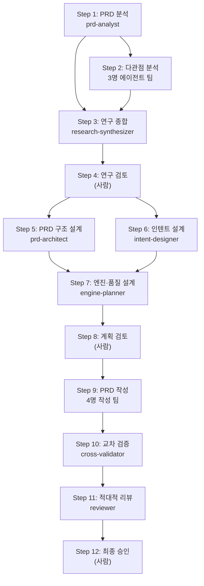

# SaaS Auto-Builder

**AI 에이전트가 SaaS 서비스를 자동으로 설계·구현하는 워크플로우 자동화 시스템.**

이 프로젝트는 [AgenticWorkflow](https://github.com/idoforgod/AgenticWorkflow) 프레임워크(만능줄기세포)에서 분화된 **자식 시스템**입니다. 부모의 전체 게놈(절대 기준, 품질 보장, 안전장치, 기억 체계)을 구조적으로 내장하면서, **SaaS 서비스 자동 제작**이라는 도메인에 특화되었습니다.

## 무엇을 하는 시스템인가?

```
Phase 1: PRD 생성       →  12단계 워크플로우로 PRD 문서 자동 생성
Phase 2: 풀스택 개발    →  16단계 워크플로우로 실제 코드 자동 구현
```

사용자가 **"시작"**이라고 입력하면, AI 에이전트 16개가 협업하여 연구 → 계획 → 구현의 3단계로 SaaS 서비스를 자동으로 만들어냅니다.

## 빠른 시작

```bash
# 1. 프로젝트 클론
git clone https://github.com/idoforgod/SaaS-AgenticWorkflow.git
cd SaaS-AgenticWorkflow

# 2. 의존성 설치
pip install pyyaml

# 3. Claude Code에서 실행
claude

# 4. 시작 명령어 입력
> 시작
```

`시작`을 입력하면 스마트 라우터가 프로젝트 상태를 감지하고, 실행 모드 선택 화면을 표시합니다.

## 프로젝트 구조

```
SaaS-AgenticWorkflow/
│
├── 자식 시스템 문서 (이 프로젝트 고유)
│   ├── README.md                              ← 이 파일
│   ├── SAAS-AUTOBUILDER-ARCHITECTURE.md       ← 아키텍처 및 워크플로우 설계
│   └── SAAS-AUTOBUILDER-USER-MANUAL.md        ← 사용자 메뉴얼
│
├── 부모 프레임워크 문서 (AgenticWorkflow 게놈)
│   ├── AGENTS.md                              ← 모든 에이전트 공통 방법론
│   ├── soul.md                                ← DNA 유전 철학
│   ├── AGENTICWORKFLOW-ARCHITECTURE-AND-PHILOSOPHY.md
│   ├── AGENTICWORKFLOW-USER-MANUAL.md
│   └── DECISION-LOG.md                        ← 설계 결정 로그 (50+ ADR)
│
├── .claude/
│   ├── commands/                ← 슬래시 커맨드 (8개)
│   │   ├── start.md             ← /start — 스마트 라우터 진입점
│   │   ├── run-workflow.md      ← /run-workflow — Phase 1 실행
│   │   └── review-*.md          ← 사람 검토 단계 (3개)
│   ├── agents/                  ← AI 에이전트 정의 (16개)
│   ├── hooks/scripts/           ← Hook + 검증 스크립트 (40+ 파일)
│   │   ├── smart_router.py      ← 상태 감지 + 모드 선택
│   │   ├── _workflow_dag.py     ← Phase 1 DAG (12단계)
│   │   ├── _workflow_dag_phase2.py  ← Phase 2 DAG (16단계)
│   │   ├── sot_manager.py       ← SOT 단일 쓰기 경로
│   │   └── quality_gate_runner.py   ← 4계층 품질 게이트
│   ├── skills/                  ← 스킬 정의
│   │   ├── workflow-generator/  ← 워크플로우 설계 스킬
│   │   └── doctoral-writing/    ← 학술 글쓰기 스킬
│   └── state.yaml               ← SOT (Single Source of Truth)
│
├── docs/protocols/              ← 상세 프로토콜 (5개)
├── prompt/                      ← 연구 자료 + 워크플로우 정의 (90+ 파일)
├── coding-resource/             ← 참조 PRD + 이론 기반
│   └── PRD.md                   ← 입력 PRD (2,667줄, 161KB)
└── translations/
    └── glossary.yaml            ← 번역 용어 사전 (EN-KO)
```

## 워크플로우 구조

### Phase 1: PRD 생성 (12단계)



### Phase 2: 풀스택 개발 (16단계)

Phase 1에서 생성된 PRD를 입력으로, 실제 동작하는 SaaS 코드를 자동 구현합니다.

## 핵심 개념

| 개념 | 설명 |
|------|------|
| **스마트 라우터** | `시작` 명령 → 상태 감지 → 모드 선택 |
| **SOT** | `.claude/state.yaml` — 모든 공유 상태의 단일 진실 원천 |
| **4계층 품질 보장** | L0(파일 존재) → L1(구조 검증) → L1.5(pACS 자기 평가) → L2(적대적 리뷰) |
| **pACS** | Predicted Agent Confidence Score — F(사실), C(완전성), L(논리) 3차원 채점 |
| **Autopilot** | 사람 검토 단계를 자동 승인하는 모드 (품질 게이트는 유지) |
| **ULW** | Ultrawork 모드 — 철저함 강화 오버레이 |
| **DNA 유전** | 부모(AgenticWorkflow)의 전체 게놈을 자식이 구조적으로 내장 |

## 문서 읽기 순서

| 순서 | 문서 | 목적 |
|------|------|------|
| 1 | **README.md** (이 파일) | 프로젝트 개요 |
| 2 | [`SAAS-AUTOBUILDER-USER-MANUAL.md`](SAAS-AUTOBUILDER-USER-MANUAL.md) | 사용 방법 |
| 3 | [`SAAS-AUTOBUILDER-ARCHITECTURE.md`](SAAS-AUTOBUILDER-ARCHITECTURE.md) | 기술 아키텍처 |
| 4 | [`soul.md`](soul.md) | DNA 유전 철학 (부모 게놈) |
| 5 | [`AGENTICWORKFLOW-ARCHITECTURE-AND-PHILOSOPHY.md`](AGENTICWORKFLOW-ARCHITECTURE-AND-PHILOSOPHY.md) | 부모 프레임워크 설계 |

> **부모-자식 문서 분리**: `AGENTICWORKFLOW-*.md`는 부모 프레임워크(방법론)를, `SAAS-AUTOBUILDER-*.md`는 이 프로젝트 고유의 도메인 아키텍처를 기술합니다.

## 부모 시스템

이 프로젝트는 [AgenticWorkflow](https://github.com/idoforgod/AgenticWorkflow)에서 분화되었습니다.
부모 프레임워크의 절대 기준, 품질 보장, 안전장치, 기억 체계가 이 시스템에 유전되어 있습니다.
