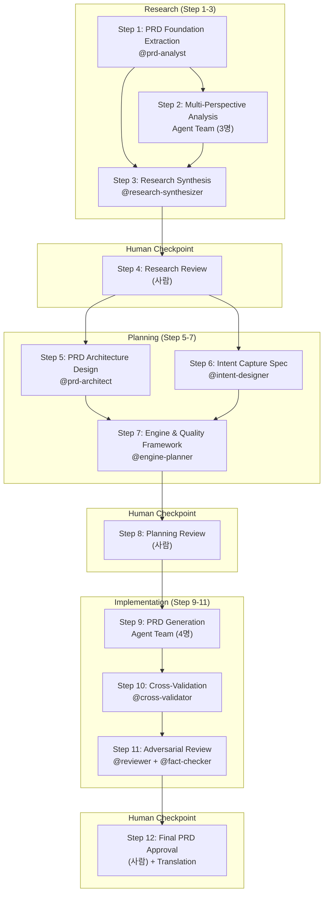
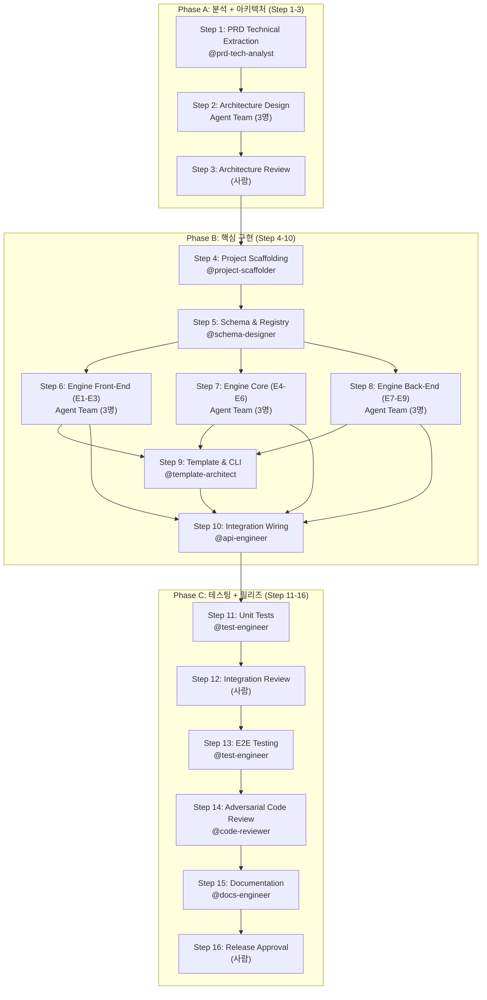

# SaaS Auto-Builder: Architecture

이 문서는 SaaS Auto-Builder 시스템의 **도메인 아키텍처**를 기술한다.
부모 프레임워크(AgenticWorkflow)의 설계 철학과 방법론은 `AGENTICWORKFLOW-ARCHITECTURE-AND-PHILOSOPHY.md`에, 이 문서는 **SaaS 서비스 자동 제작**이라는 도메인에 특화된 아키텍처를 다룬다.

---

## 1. 시스템 개요

### 1.1 목적

SaaS Auto-Builder는 **사용자가 "시작"이라고 입력하면, AI 에이전트 16개가 협업하여 SaaS 서비스를 자동으로 설계·구현하는 시스템**이다.

```
사용자 입력 "시작"
    │
    ▼
┌─────────────────────────────────────────────────────┐
│  Phase 1: PRD 생성 (12단계)                          │
│  Research → Planning → Implementation               │
│  입력: coding-resource/PRD.md (참조 PRD)              │
│  출력: prompt/PRD-SaaS-AutoBuilder.md (EN + KO)      │
└──────────────────────┬──────────────────────────────┘
                       │
                       ▼
┌─────────────────────────────────────────────────────┐
│  Phase 2: 풀스택 개발 (16단계)                        │
│  Analysis → Implementation → Testing → Release      │
│  입력: Phase 1 PRD                                   │
│  출력: 실제 동작하는 SaaS 코드                         │
└─────────────────────────────────────────────────────┘
```

### 1.2 진입 흐름

```
자연어 ("시작", "start", "시작하자", ...)
    │
    ▼
CLAUDE.md 자연어 라우팅 규칙
    │
    ▼
/start 슬래시 커맨드 (start.md)
    │
    ▼
smart_router.py → 프로젝트 상태 감지 (JSON)
    │
    ▼
모드 선택 UI 표시
    │
    ▼
사용자 선택 (예: "1AU")
    │
    ├─ sot_manager.py --init (SOT 초기화)
    ├─ sot_manager.py --set-autopilot (A 옵션)
    └─ /run-workflow 또는 /run-workflow-phase2 (워크플로우 실행)
```

---

## 2. 이중 워크플로우 구조

### 2.1 Phase 1: PRD 생성 (12단계)



**Phase 1 상세 단계:**

| Step | 이름 | 유형 | 에이전트 | 의존성 | 산출물 | 번역 |
|------|------|------|---------|--------|--------|------|
| 1 | PRD Foundation Extraction | sub-agent | @prd-analyst | — | research/prd-foundation-analysis.md | O |
| 2 | Multi-Perspective Deep Analysis | agent-team | 3명 팀 | [1] | research/step-2-manifest.md | O |
| 3 | Research Synthesis & Gap Analysis | sub-agent | @research-synthesizer | [1,2] | research/synthesis-and-gaps.md | O |
| 4 | Research Findings Review | human | 사용자 | [3] | approved-by-user | — |
| 5 | PRD Document Architecture Design | sub-agent | @prd-architect | [4] | planning/prd-architecture.md | O |
| 6 | Intent Capture & Question Flow Spec | sub-agent | @intent-designer | [4] | planning/intent-capture-spec.md | O |
| 7 | Engine Pipeline & Quality Framework | sub-agent | @engine-planner | [5,6] | planning/engine-quality-specs.md | O |
| 8 | Planning Review & Approval | human | 사용자 | [7] | approved-by-user | — |
| 9 | PRD Document Generation | agent-team | 4명 팀 | [8] | implementation/step-9-manifest.md | O |
| 10 | Cross-Validation & Integration | sub-agent | @cross-validator | [9] | implementation/prd-validated.md | — |
| 11 | Adversarial Review | sub-agent | @reviewer | [10] | review/prd-adversarial-review.md | O |
| 12 | Final PRD Review & Approval | human (hybrid) | 사용자 | [11] | PRD-SaaS-AutoBuilder.md | O |

**Agent Team 구성:**

| 팀 | Step | 팀원 | 역할 |
|----|------|------|------|
| prd-analysis-team | 2 | @arch-engine-specialist | 아키텍처 & 엔진 파이프라인 분석 |
| | | @feature-ux-specialist | 기능 & 인텐트 캡처 분석 |
| | | @biz-quality-specialist | 비즈니스 모델 & 품질 프레임워크 분석 |
| prd-generation-team | 9 | @prd-writer-core | Sections 1-5 (Foundation & Users) |
| | | @prd-writer-tech | Sections 6-8 (Technical Core) |
| | | @prd-writer-integration | Sections 9-12 (Systems & Quality) |
| | | @prd-writer-business | Sections 13-16 (Business & Appendix) |

### 2.2 Phase 2: 풀스택 개발 (16단계)



**Phase 2 특수 사항:**
- **Gate Profile**: `code` (tsc + eslint) vs `document` (D1-D5 구조 검증)
- **L3 Integration Gate**: Step 13에서 `npm build + npm test + npm run test:e2e` 전체 통과 필수
- **pACS 4차원**: F(Factuality), C(Completeness), L(Logic), **T(Testability)** — Phase 1은 3차원(F,C,L)

---

## 3. 스마트 라우터

### 3.1 상태 감지 흐름

```
smart_router.py --project-dir .
    │
    ├─ Prerequisites Check (Python 3.9+, PyYAML)
    ├─ SOT 탐색 (sot_paths() from _context_lib.py)
    ├─ SOT 없음 → project_state: "fresh"
    └─ SOT 있음 → YAML 파싱
         ├─ status 매핑 (running/completed/error/paused)
         ├─ Phase 감지 (_detect_phase: name + total_steps 기반)
         ├─ Resume 정보 (current_step, pACS 평균, 완료 수)
         └─ 사용 가능 모드 결정 (_determine_modes)
```

### 3.2 모드 결정 매트릭스

| 프로젝트 상태 | 활성 Phase | 사용 가능 모드 |
|-------------|-----------|--------------|
| fresh | — | Phase 1 Fresh, (Phase 2 Fresh if PRD exists) |
| running/paused/error | phase1 | Phase 1 Resume, Phase 1 Restart |
| running/paused/error | phase2 | Phase 2 Resume |
| completed | phase1 | Phase 2 Fresh, Phase 1 Restart |
| completed | phase2 | Phase 1 Restart |

### 3.3 가용성 가드 (Availability Guard)

각 모드의 슬래시 커맨드 파일 존재 여부를 검증한다:

```python
_apply_availability_guards(modes, project_dir)
# /run-workflow-phase2 파일이 없으면 → enabled=false, unavailable_reason 설정
```

Phase 2 커맨드가 아직 구현되지 않은 경우, 모드는 표시되되 선택 불가로 처리된다.

---

## 4. SOT (Single Source of Truth) 관리

### 4.1 단일 쓰기 경로 원칙

```
                    읽기 전용
 ┌──────────┐      ┌──────────┐      ┌──────────┐
 │ Agent A  │─────>│          │<─────│ Agent B  │
 └──────────┘      │  state   │      └──────────┘
                   │  .yaml   │
 ┌──────────┐      │          │
 │sot_      │─────>│          │   ← 유일한 쓰기 경로
 │manager.py│ 쓰기 └──────────┘
 └──────────┘
```

`state.yaml`에 대한 모든 쓰기는 **반드시 `sot_manager.py`를 통해서만** 수행된다. 직접 파일 수정은 `validate_sot_write.py` Hook이 차단한다 (exit 2).

### 4.2 SOT 스키마

```yaml
workflow:
  name: "SaaS Auto-Builder PRD Generation"
  current_step: 0          # 마지막 완료된 단계
  status: running          # running | completed | error | paused
  total_steps: 12          # Phase 1: 12, Phase 2: 16
  autopilot:
    enabled: false
    activated_at: ""
    auto_approved_steps: []
  outputs:                 # 단계별 산출물 경로
    step-1: "prompt/research/prd-foundation-analysis.md"
    step-1-ko: "prompt/research/prd-foundation-analysis.ko.md"
    # ...
  pacs:
    dimensions: {F: 0, C: 0, L: 0}  # Phase 2: + T: 0
    current_step_score: 0
    weak_dimension: ""
    history:
      step-1: {score: 85, weak: "C"}
      # ...
  active_team: null        # Agent Team 실행 중일 때 채워짐
  parent_genome:
    source: "AgenticWorkflow"
    version: "2026-03-13"
```

### 4.3 SOT Manager 명령어

| 명령 | 용도 |
|------|------|
| `--init --workflow phase1` | Phase 1 SOT 초기화 |
| `--reset --workflow phase1` | 기존 SOT 백업(.bak) → 새로 초기화 |
| `--update-step N --output PATH` | Step 완료 기록, current_step 전진 |
| `--set-status STATUS` | 워크플로우 상태 변경 |
| `--update-pacs N --pacs-score S --weak-dim D` | pACS 점수 기록 |
| `--set-autopilot true/false` | Autopilot 모드 전환 |
| `--set-team NAME --team-status STATUS` | Agent Team 상태 설정 |
| `--add-team-result AGENT --output PATH` | 팀원 결과 기록 |
| `--finalize-team` | 활성 팀 완료 처리 |
| `--add-translation N --ko-path PATH` | 한국어 번역 경로 기록 |

---

## 5. 에이전트 시스템

### 5.1 에이전트 목록 (16개)

```
.claude/agents/
├── Phase 1 전용 (12개)
│   ├── prd-analyst.md              Step 1: PRD 기반 추출
│   ├── arch-engine-specialist.md   Step 2: 아키텍처 & 엔진 분석
│   ├── feature-ux-specialist.md    Step 2: 기능 & UX 분석
│   ├── biz-quality-specialist.md   Step 2: 비즈니스 & 품질 분석
│   ├── research-synthesizer.md     Step 3: 연구 종합
│   ├── prd-architect.md            Step 5: PRD 구조 설계
│   ├── intent-designer.md          Step 6: 인텐트 캡처 설계
│   ├── engine-planner.md           Step 7: 엔진 & 품질 프레임워크
│   ├── prd-writer-core.md          Step 9: Sections 1-5 작성
│   ├── prd-writer-tech.md          Step 9: Sections 6-8 작성
│   ├── prd-writer-integration.md   Step 9: Sections 9-12 작성
│   └── prd-writer-business.md      Step 9: Sections 13-16 작성
│
├── 범용 (3개 — Phase 1 + Phase 2)
│   ├── reviewer.md                 적대적 리뷰어 (L2 품질 게이트)
│   ├── fact-checker.md             사실 검증 (claim-by-claim)
│   └── translator.md              영→한 번역 (glossary 기반)
│
└── Phase 1 범용 (1개)
    └── cross-validator.md          Step 10: 교차 검증
```

### 5.2 에이전트 공통 속성

| 속성 | 값 |
|------|-----|
| 모델 | Claude Opus (cross-validator만 Sonnet) |
| 도구 | Read, Glob, Grep, Write (+ WebSearch/WebFetch for fact-checker) |
| 최대 턴 | 20~80 (역할에 따라 차등) |
| 입력 | 명시적 하드코딩 (STEP_INPUTS 맵, DAG 추론 아님) |
| 출력 | pACS 자기 평가 섹션 필수 포함 |

### 5.3 에이전트 실행 패턴

```
Orchestrator (run-workflow.md)
    │
    ├─ orchestrator_actions.py --action step-config --step N
    │   → JSON: agent, output, type, inputs, pre_script, review, translate
    │
    ├─ orchestrator_actions.py --action agent-prompt --step N
    │   → JSON: prompt (모든 경로가 치환된 완전한 프롬프트)
    │
    ├─ Agent() 생성 (sub-agent 또는 병렬 Agent Team)
    │
    ├─ quality_gate_runner.py --step N (L0 → L1 → L1.5)
    │
    ├─ orchestrator_actions.py --action extract-pacs (pACS 추출)
    │
    ├─ orchestrator_actions.py --action pacs-decision (GREEN/YELLOW/RED)
    │
    ├─ (optional) L2 Adversarial Review (@reviewer / @fact-checker)
    │
    ├─ (optional) @translator → bilingual_validator.py
    │
    └─ sot_manager.py --update-step N --output PATH
```

---

## 6. 4계층 품질 보장 시스템

### 6.1 게이트 실행 순서

```
산출물 생성
    │
    ▼
┌─────────────────────────────────────┐
│ L0: Anti-Skip Guard                 │
│ 파일 존재 + ≥100 bytes + 비어있지 않음  │
│ 실패 → 파이프라인 중단               │
└──────────────┬──────────────────────┘
               │
               ▼
┌─────────────────────────────────────┐
│ L1: Verification Gate               │
│ Document: D1-D5 (구조 검증)          │
│ Code: tsc + eslint (타입/린트 검증)   │
│ 실패 → 재작업                        │
└──────────────┬──────────────────────┘
               │
               ▼
┌─────────────────────────────────────┐
│ L1.5: pACS Self-Rating              │
│ F(사실성), C(완전성), L(논리)         │
│ + T(테스트 가능성) — Phase 2 only     │
│ 교차 검증: 구조적 메트릭과 대조        │
│ ≥70 GREEN / 50-69 YELLOW / <50 RED  │
└──────────────┬──────────────────────┘
               │
               ▼
┌─────────────────────────────────────┐
│ L2: Adversarial Review (선택적)      │
│ @reviewer 또는 @fact-checker         │
│ 독립적 pACS 채점, 할루시네이션 탐지    │
│ Critical FAIL → 재작업               │
└──────────────┬──────────────────────┘
               │
               ▼ (Phase 2 Step 13만)
┌─────────────────────────────────────┐
│ L3: Integration Gate                │
│ npm build + npm test + test:e2e     │
│ 전체 통과 필수                       │
└──────────────┬──────────────────────┘
               │
               ▼
┌─────────────────────────────────────┐
│ Translation Gate (번역 대상 단계만)   │
│ KO 파일 존재 + 구조 일치 + pACS 포함  │
└─────────────────────────────────────┘
```

### 6.2 pACS 결정 매트릭스

| 점수 범위 | 등급 | 조치 |
|----------|------|------|
| ≥70 | GREEN | 다음 단계로 진행 |
| 50-69 | YELLOW | 경고 로그 + 다음 단계 진행 (약한 차원 피드백) |
| <50 | RED | 재작업 필수 (약한 차원 기반 타겟 피드백, 최대 1회) |

pACS 추출은 `orchestrator_actions.py --action extract-pacs`로 결정론적으로 수행된다 (LLM 해석 아님).

---

## 7. Orchestrator Actions — 할루시네이션 봉쇄

Orchestrator가 워크플로우를 실행할 때, **모든 구성 정보·경로 추론·점수 해석·의사결정은 Python 헬퍼(`orchestrator_actions.py`)가 수행**한다. LLM이 산문(prose)에서 이를 추론하는 것을 금지한다.

### 7.1 봉쇄 대상 (H-1 ~ H-12)

| ID | 할루시네이션 유형 | 봉쇄 수단 |
|----|----------------|----------|
| H-1 | pACS 점수를 LLM이 해석 | `--action extract-pacs` (정규식 기반 추출) |
| H-2 | 단계 설정을 산문에서 추론 | `--action step-config` (DAG JSON 조회) |
| H-3 | 파일 경로를 LLM이 생성 | `--action derive-paths` / `--action agent-prompt` |
| H-4 | 팀 구성을 기억에서 재구성 | `--action team-files` (DAG TEAMS 조회) |
| H-5 | KO 경로를 LLM이 추론 | `--action derive-paths` (.md → .ko.md 변환 로직) |
| H-7 | pACS 등급을 LLM이 판단 | `--action pacs-decision` (결정론적 GREEN/YELLOW/RED) |
| H-11 | Step 12 하이브리드를 LLM이 조합 | `--action finalize-step12` (5개 명령 시퀀스) |
| H-12 | 의존성을 기억에서 확인 | `--action verify-deps` (파일 존재 검증) |

### 7.2 입력 명시성 (C-1)

에이전트 입력 파일은 **DAG 의존성에서 추론하지 않고**, `STEP_INPUTS` 맵에 **하드코딩**되어 있다:

```python
# _workflow_dag.py 예시
STEP_INPUTS = {
    1: ["coding-resource/PRD.md"],
    3: ["prompt/research/prd-foundation-analysis.md",
        "prompt/research/step-2-manifest.md"],
    # ...
}
```

---

## 8. Hook 인프라

### 8.1 4계층 보안 방어 체계

```
┌─────────────────────────────────────────────┐
│ Layer 1: PreToolUse — 사전 차단              │
│ block_destructive_commands.py (exit 2)       │
│ block_test_file_edit.py (TDD Guard, exit 2)  │
│ validate_sot_write.py (SOT 보호, exit 2)     │
│ predictive_debug_guard.py (위험 경고)         │
└─────────────────────────────────────────────┘
                    │
                    ▼
┌─────────────────────────────────────────────┐
│ Layer 2: PostToolUse — 사후 감시             │
│ output_secret_filter.py (시크릿 탐지)        │
│ security_sensitive_file_guard.py (민감 파일)  │
│ validate_task_completion.py (Task 검증)       │
│ update_work_log.py (작업 로그 누적)           │
└─────────────────────────────────────────────┘
                    │
                    ▼
┌─────────────────────────────────────────────┐
│ Layer 3: Context — 세션 보존                 │
│ restore_context.py (SessionStart 복원)       │
│ generate_context_summary.py (Stop 스냅샷)    │
│ save_context.py (PreCompact/SessionEnd 저장) │
└─────────────────────────────────────────────┘
                    │
                    ▼
┌─────────────────────────────────────────────┐
│ Layer 4: Setup — 인프라 검증                 │
│ setup_init.py (초기화 건강 검증)              │
│ setup_maintenance.py (주기적 검진)            │
└─────────────────────────────────────────────┘
```

### 8.2 Hook 이벤트 매핑

| Hook 이벤트 | 스크립트 | 타임아웃 | exit 2 |
|------------|---------|---------|--------|
| PreToolUse (Bash) | block_destructive_commands.py | 10s | O |
| PreToolUse (Edit/Write) | block_test_file_edit.py | 10s | O |
| PreToolUse (Edit/Write) | predictive_debug_guard.py | 10s | — |
| PreToolUse (Write) | validate_sot_write.py | 10s | O |
| PostToolUse (9개 도구) | update_work_log.py | 15s | — |
| PostToolUse (Bash/Read) | output_secret_filter.py | 15s | — |
| PostToolUse (Edit/Write) | security_sensitive_file_guard.py | 15s | — |
| PostToolUse (TaskUpdate) | validate_task_completion.py | 15s | — |
| Stop | generate_context_summary.py | 30s | — |
| PreCompact | save_context.py | 30s | — |
| SessionStart | restore_context.py | 15s | — |
| SessionEnd | save_context.py | 30s | — |
| Setup (init) | setup_init.py | 30s | — |
| Setup (maintenance) | setup_maintenance.py | 30s | — |

### 8.3 통합 디스패처 패턴

```
settings.json → context_guard.py --mode={stop|post-tool|pre-compact|restore}
                    │
                    ├─ stop → generate_context_summary.py
                    ├─ post-tool → update_work_log.py
                    ├─ pre-compact → save_context.py --trigger precompact
                    └─ restore → restore_context.py
```

`context_guard.py`는 stdin을 읽어 대상 스크립트에 subprocess로 전달하는 **얇은 디스패처**다. 이 패턴으로 `settings.json`의 Hook 등록 수를 줄이면서도 각 스크립트의 독립성을 유지한다.

---

## 9. 워크플로우 레지스트리

### 9.1 다형적 접근 패턴

```python
from _workflow_registry import get_workflow

wf = get_workflow("phase1")  # 또는 "phase2"
wf.DAG           # 단계 정의 딕셔너리
wf.TEAMS         # 팀 구성 정의
wf.TOTAL_STEPS   # 12 또는 16
wf.HUMAN_STEPS   # {4, 8, 12} 또는 {3, 12, 16}
wf.TRANSLATION_STEPS  # 번역 대상 단계 집합
wf.STEP_INPUTS   # 단계별 입력 파일 맵
```

### 9.2 Phase 감지

두 곳에서 Phase를 감지하며, D-7(의도적 중복) 패턴으로 일관성을 유지한다:

| 위치 | 함수 | 동작 |
|------|------|------|
| `smart_router.py` | `_detect_phase(wf_data)` | 이미 파싱된 dict에서 감지 |
| `_workflow_registry.py` | `detect_phase_from_sot(project_dir)` | 파일을 직접 읽어 감지 |

감지 로직: `total_steps == 12` → phase1, `total_steps == 16` → phase2. 이름에 "prd"/"fullstack" 포함 여부도 보조 신호로 사용.

---

## 10. Context Preservation System

### 10.1 세션 수명주기

```
┌─────────────────────────────────────────────────────┐
│ SessionStart                                         │
│ restore_context.py                                   │
│ → RLM 포인터 복원                                     │
│ → 과거 세션 인덱스 (knowledge-index.jsonl)             │
│ → Predictive Debugging 캐시                          │
│ → [CONTEXT RECOVERY] 메시지 출력                      │
└──────────────────────┬──────────────────────────────┘
                       │
                       ▼
┌─────────────────────────────────────────────────────┐
│ 작업 중                                              │
│ PostToolUse → update_work_log.py (도구 사용 추적)      │
│ PostToolUse → output_secret_filter.py (시크릿 감시)    │
│ Stop → generate_context_summary.py (증분 스냅샷)       │
└──────────────────────┬──────────────────────────────┘
                       │
           ┌───────────┴───────────┐
           ▼                       ▼
┌──────────────────┐    ┌──────────────────┐
│ PreCompact        │    │ SessionEnd        │
│ save_context.py   │    │ save_context.py   │
│ (압축 전 저장)     │    │ (/clear 시 저장)   │
└──────────────────┘    └──────────────────┘
```

### 10.2 Knowledge Archive

```
.claude/context-snapshots/
├── latest.md              ← 가장 최근 스냅샷 (RLM 포인터)
├── knowledge-index.jsonl  ← 과거 세션 인덱스 (최대 200 엔트리)
├── sessions/              ← 세션별 아카이브 (최대 20개)
└── *.md                   ← 증분 스냅샷들
```

**토큰 관리:**
- `CHARS_PER_TOKEN = 2.5` (한국어/영어 혼합)
- `EFFECTIVE_CAPACITY = 185K` 토큰 (200K - 15K 시스템 오버헤드)
- 75% 임계값(138.75K) 초과 시 압축 트리거

---

## 11. 검증 스크립트 체계

### 11.1 P1 결정론적 검증 (14개 스크립트)

모든 검증은 **Python 결정론적 코드**로 수행된다 (LLM 판단 아님).

| 스크립트 | 검증 항목 | 검증 코드 |
|---------|----------|----------|
| validate_pacs.py | PA1-PA7 | pACS 구조, 산술, 차원 |
| validate_review.py | R1-R5 | 리뷰 출력 구조, 판정 |
| validate_translation.py | T1-T9 | 번역 쌍 존재, 구조 일치 |
| validate_traceability.py | CT1-CT5 | [trace:step-N] 추적 마커 |
| validate_verification.py | V1a-V1c | 검증 로그 완전성 |
| validate_workflow.py | W1-W8 | DNA 유전 검증 |
| validate_domain_knowledge.py | DK1-DK7 | 도메인 지식 일관성 |
| validate_retry_budget.py | RB1-RB3 | 재시도 예산 모니터링 |
| validate_diagnosis.py | AD1-AD10 | Abductive Diagnosis 검증 |
| validate_l1_document.py | D1-D5 | 문서 구조 검증 |
| validate_step_progression.py | SP1-SP6 | 단계 진행 Guard |
| validate_sot_write.py | — | SOT 직접 쓰기 차단 |
| validate_task_completion.py | — | Task 완료 프로토콜 |
| bilingual_validator.py | — | EN+KO 문서 쌍 검증 |

### 11.2 테스트 커버리지

| 테스트 파일 | 대상 | 테스트 수 |
|-----------|------|----------|
| _test_secret_filter.py | output_secret_filter.py | 44 |
| _test_sensitive_file_guard.py | security_sensitive_file_guard.py | 44 |
| _test_block_destructive.py | block_destructive_commands.py | 43 |

---

## 12. 실행 모드

### 12.1 Autopilot Mode

`(human)` 단계를 자동 승인하되, **4계층 품질 게이트(L0-L2)는 그대로 유지**한다.

```
일반 모드:    Step 4 → 사용자 검토 → 승인/거부
Autopilot:   Step 4 → 자동 승인 → 품질 게이트 결과 로깅
```

- SOT `autopilot.enabled: true`로 기록
- 결정 로그: `autopilot-logs/`에 자동 기록
- pACS RED(<50) 발생 시에도 자동 재작업 수행

### 12.2 ULW (Ultrawork) Mode

**철저함 강화 오버레이** — Autopilot과 직교(독립적으로 작동).

| 강화 규칙 | 이름 | 동작 |
|----------|------|------|
| I-1 | Sisyphus Persistence | 실패 시 최대 3회 재시도 (각각 다른 접근법) |
| I-2 | Mandatory Task Decomposition | 모든 작업을 Task로 분해·추적 |
| I-3 | Bounded Retry Escalation | 동일 대상 3회 초과 시 사용자 에스컬레이션 |

### 12.3 모드 조합

| 입력 | Autopilot | ULW | 동작 |
|------|-----------|-----|------|
| `1` | OFF | OFF | 기본 Phase 1 |
| `1A` | ON | OFF | Phase 1 + 자동 승인 |
| `1U` | OFF | ON | Phase 1 + 철저함 강화 |
| `1AU` | ON | ON | Phase 1 + 자동 승인 + 철저함 강화 |

---

## 13. 슬래시 커맨드 체계

```
.claude/commands/
├── start.md               /start — 스마트 라우터 진입점
├── run-workflow.md         /run-workflow — Phase 1 Orchestrator
├── workflow-status.md      /workflow-status — 진행 상황 대시보드
├── review-research.md      /review-research — Step 4 검토
├── review-planning.md      /review-planning — Step 8 검토
├── review-final-prd.md     /review-final-prd — Step 12 검토
├── install.md              /install — 인프라 건강 검증
└── maintenance.md          /maintenance — 시스템 건강 검진
```

**명령 흐름:**

```
/start → smart_router.py → 모드 선택
    ├─ /run-workflow (Phase 1 선택 시)
    │   ├─ /review-research (Step 4 도달 시 자동 호출)
    │   ├─ /review-planning (Step 8 도달 시 자동 호출)
    │   └─ /review-final-prd (Step 12 도달 시 자동 호출)
    └─ /run-workflow-phase2 (Phase 2 선택 시 — 미구현)

/workflow-status → query_workflow.py (언제든 독립 호출 가능)
/install → setup_init.py (문제 진단)
/maintenance → setup_maintenance.py (정기 검진)
```

---

## 14. 번역 파이프라인

### 14.1 흐름

```
영어 산출물 (step-N.md)
    │
    ▼
@translator 서브에이전트
    ├─ glossary.yaml 참조 (용어 일관성)
    ├─ Mermaid 다이어그램 보존
    └─ 코드 블록 번역 제외
    │
    ▼
한국어 산출물 (step-N.ko.md)
    │
    ▼
bilingual_validator.py
    ├─ KO 파일 존재 확인
    ├─ 구조 일치 검증
    └─ pACS 섹션 포함 확인
    │
    ▼
sot_manager.py --add-translation N --ko-path PATH
```

### 14.2 번역 대상

- **번역 O**: 텍스트 산출물 (.md, .txt) — Research, Planning, Implementation 단계
- **번역 X**: 코드, 데이터, 설정 파일, `(human)` 단계
- **용어 사전**: `translations/glossary.yaml` — EN↔KO 매핑 자동 유지

---

## 15. DNA 유전 구조

### 15.1 부모-자식 관계

```
AgenticWorkflow (부모 — 만능줄기세포)
    │
    ├─ 전체 게놈 유전
    │   ├─ 절대 기준 3개 (품질, SOT, CCP)
    │   ├─ 4계층 품질 게이트 (L0-L2)
    │   ├─ P1 봉쇄 (결정론적 검증)
    │   ├─ Safety Hook (PreToolUse 차단)
    │   ├─ Context Preservation System
    │   ├─ Adversarial Review 패턴
    │   └─ Decision Log 패턴
    │
    ▼
SaaS Auto-Builder (자식 — 분화된 시스템)
    │
    ├─ 도메인 발현
    │   ├─ Phase 1: PRD 생성 (12단계 DAG)
    │   ├─ Phase 2: 풀스택 개발 (16단계 DAG)
    │   ├─ 16개 전문 에이전트
    │   ├─ 스마트 라우터 + 모드 선택
    │   ├─ Orchestrator Actions (H-1~H-12 할루시네이션 봉쇄)
    │   └─ 이중 pACS (3D Phase 1 / 4D Phase 2)
    │
    └─ SOT parent_genome 메타데이터
        source: "AgenticWorkflow"
        version: "2026-03-13"
```

### 15.2 문서 분리 패턴

| 문서 | 범위 | 내용 |
|------|------|------|
| `AGENTICWORKFLOW-ARCHITECTURE-AND-PHILOSOPHY.md` | 부모 프레임워크 | 설계 철학, 이론적 기반, 범용 아키텍처 |
| `AGENTICWORKFLOW-USER-MANUAL.md` | 부모 프레임워크 | 범용 사용법, 스킬 개발 가이드 |
| **`SAAS-AUTOBUILDER-ARCHITECTURE.md`** (이 파일) | **자식 시스템** | **SaaS 도메인 아키텍처** |
| **`SAAS-AUTOBUILDER-USER-MANUAL.md`** | **자식 시스템** | **SaaS 자동 제작 사용법** |
| `CLAUDE.md` | 프로젝트 루트 | 경량 TOC + Hook 설정 + 진입점 |
| `AGENTS.md` | 방법론 | 에이전트 공통 방법론 (Hub) |
| `soul.md` | DNA | 유전 철학 정의 |

---

## 16. 워크플로우 관측성

`query_workflow.py`가 4가지 관측 뷰를 제공한다:

| 명령 | 뷰 |
|------|-----|
| `--action dashboard` | 전체 진행 상황, 현재 단계, pACS 히스토리 |
| `--action weakest` | 가장 약한 pACS 차원 + 단계 |
| `--action retry` | 재시도 예산 현황 (I-3) |
| `--action blocked` | 의존성 미충족 단계 목록 |

`/workflow-status` 슬래시 커맨드가 이 스크립트를 호출하여 사용자에게 대시보드를 표시한다.
