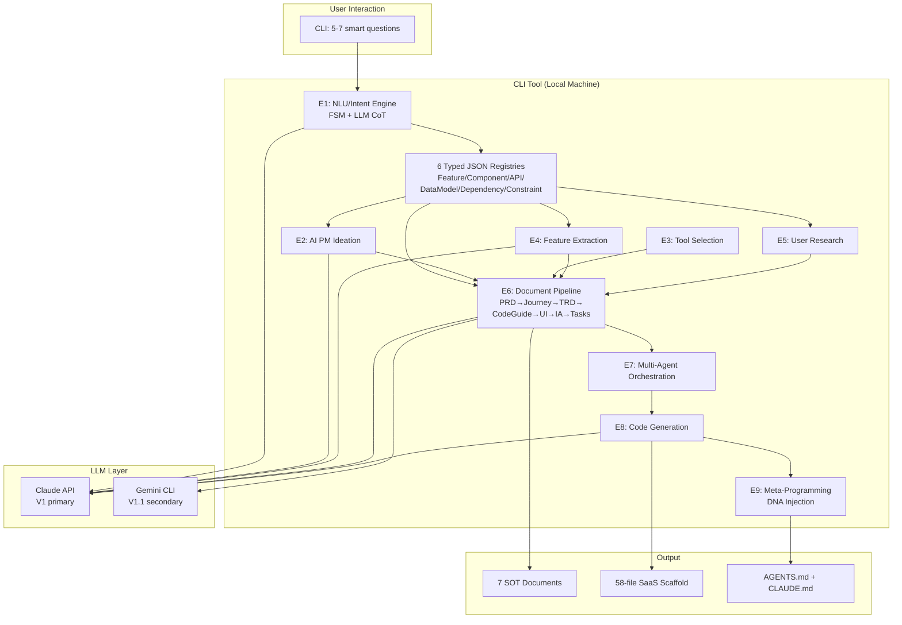
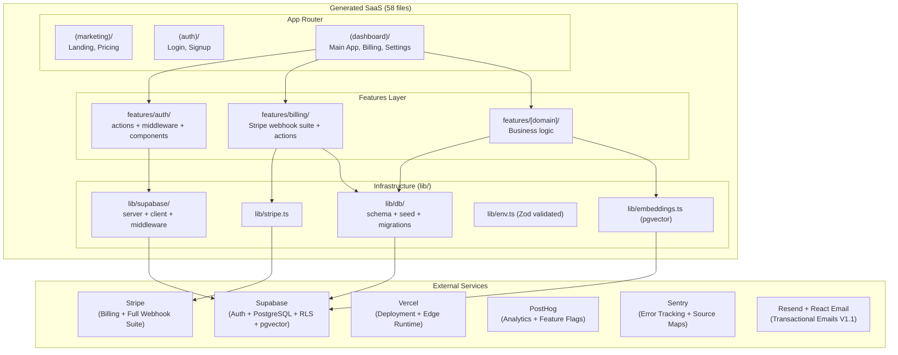

# FINAL RESEARCH SYNTHESIS: AI Agentic Workflow Automation System
## Comprehensive 5-Round Deep Research Integration for PRD.md

**Status**: FINAL — Integration-Complete
**Date**: 2026-03-13
**Rounds Synthesized**: 5 (Round 1–5)
**Total Documents Analyzed**: 70+ files across all rounds
**Total Agents Deployed**: 78+ (Round 1: 15, Round 2: 17, Round 3: 17, Round 4: 17, Round 5: ~30)
**Synthesis Author**: Final Integration Architect (this document)
**Purpose**: Definitive single-reference input for PRD.md creation

---

## EXECUTIVE SUMMARY — 5-ROUND CONVERGENCE

Five independent research rounds — each spanning 10+ parallel branches, adversarial debates, and scenario synthesis — converged on the **same strategic posture four times in a row**: Balanced-Tech (Cherry-Pick). This is not coincidence. The system's intrinsic characteristics — solo developer, local CLI, factory multiplier economics, V1 focus — mathematically select Balanced as the optimal operating point across every evaluation dimension.

**The Definitive System Definition** (from 5 rounds):
- A LOCAL CLI tool (Claude Code) that converts user intent → 7 SOT specification documents → 58-file full-stack SaaS scaffold
- Self-described best: **"Specification Compiler"** — user intent = source code, 7 documents = intermediate representation, 58 files = machine code
- Positioning: *"Lovable gives you a prototype. We give you a production architecture."*
- Business: Open-Core + BYOK, $19/mo Pro, ~80 subscribers → break-even Month 8–10

**Five-Round Selection Record**:
| Round | Topic | Selection | Score |
|-------|-------|-----------|-------|
| Round 1 | Market/User/Tech/Business | Balanced Scenario | 4/4 perspectives (2 AGREE, 2 ACCEPT) |
| Round 2 | CLI Tool Technology | Balanced-Tech | 87% confidence, 23.5+2.5wk |
| Round 3 | Generated SaaS Technology | Balanced-Tech | 9/10 |
| Round 4 | Intent + 9 Service Engines | Balanced-Tech | 8.6/10 risk-adjusted |
| Round 5 | External Integration | Balanced-Tech | 8.7/10 risk-adjusted |

---

## PART 1: SYSTEM IDENTITY AND CONSTRAINTS

### 1.1 What This System IS

**The system is a LOCAL CLI tool** that runs on the user's computer, powered by Claude Code, that automates the transformation of a vague SaaS idea into a deployable, production-quality full-stack scaffold. It produces two categories of output:

**Layer 1 — Specification Documents (7 SOT documents)**:
1. PRD.md — Product Requirements Document
2. User Journey.md — User flow and persona documentation
3. TRD.md — Technical Requirements Document
4. Code Guidelines.md — Coding standards and patterns
5. UI Guidelines.md — Design system and component specs
6. Information Architecture (IA.md) — Site structure and navigation
7. Tasks.md — Implementation-ready task breakdown

**Layer 2 — Generated SaaS Scaffold (58 files)**:
A fully functional Next.js 15 + Supabase + Stripe starter with auth, billing, database, and deployment configuration, generated from the 7 specification documents.

**The "Specification Compiler" Metaphor** (from Dragon Book, Aho et al., 1986):

```
Source Code (Source)       = User intent (natural language description)
Front-End (Frontend)       = E1–E5 (NLU/Intent → Feature Extraction → User Research)
Intermediate Representation = 7 SOT specification documents
Back-End (Backend)         = E6–E8 (Document Pipeline → Code Generation)
Machine Code               = 58-file generated SaaS scaffold
Linker (DNA Injection)     = E9 Meta-Programming (AGENTS.md generation)
```

This metaphor is structurally precise:
- **Type checking = Zod schemas**: compile-time schema validation on every stage boundary
- **IR optimization passes = Document Pipeline**: sequential generation with cross-doc validation
- **Code emission = Code Generation engine**: target-specific scaffold from typed specifications
- **Front-end/back-end separation**: the 7 documents are the IR — change the front-end (intent engine) or back-end (code generator) independently

**The system IS**:
- A CLI tool that users run on their local machine with `npx saas-auto-builder` or equivalent
- A document generator: 7 high-quality specification documents are the primary deliverable
- A scaffold generator: 58-file Next.js SaaS is the secondary deliverable
- A "specification compiler": intent → specifications → code
- A solo-founder force multiplier: idea → working prototype in hours, not weeks
- An Open-Core project: core pipeline is free/OSS, premium templates are paid

### 1.2 What This System IS NOT

**Critical clarifications** (from Round 1, reinforced by all subsequent rounds):

- **NOT SaaS itself**: The tool is a local CLI, not a hosted web application. No user data stored on the developer's servers in V1.
- **NOT cloud-hosted**: Runs entirely on the user's local machine. No server round-trips during generation.
- **NOT a full-stack auto-builder**: The generated scaffold requires user customization (business logic, copy, design decisions). It is a production-quality starting point, not a finished product.
- **NOT "production-ready" out of the box**: Generated code is architecturally sound but requires real business logic, copy writing, and manual review before launch. "Production-quality architecture" ≠ "production-ready product."
- **NOT multi-LLM in V1**: Uses Claude (Claude Code native host) only in V1. Gemini CLI added in V1.1. ChatGPT deferred to V2+.
- **NOT creating its own PRD.md**: This synthesis document IS the pre-work for creating PRD.md. The system being described will generate PRDs for *users' SaaS projects*, not for itself.

### 1.3 Absolute Constraints

**Constraint 1 — Local Execution Only**:
All processing happens on the user's local machine. The CLI tool does not call any server infrastructure controlled by the developer. LLM calls go directly from user's machine to Anthropic's API (BYOK model — user provides API key, or uses Claude Code subscription).

**Constraint 2 — User Approval Required**:
Every generated document passes through a `[y/N/request_changes]` approval gate before proceeding. The system never proceeds through a generation stage without explicit human approval. This is architecturally enforced, not a soft suggestion.

**Constraint 3 — OpenAI/Gemini via Subscription CLI, NOT API Keys**:
This is the most critical constraint from Round 5. For multi-LLM support (V1.1+):
- Gemini: accessed via `@google/gemini-cli` (Google's official CLI, standard OAuth2 auth)
- ChatGPT: accessed via CLI (when a stable, official mechanism exists — deferred to V2+)
- The developer of the tool uses subscription accounts ($60/mo flat: Claude Code + Gemini Advanced + ChatGPT Plus) rather than API keys
- This eliminates per-run API costs for the developer at the cost of OAuth token management, undocumented rate limits, and CLI version instability
- Users generating SaaS projects use BYOK (their own Anthropic API key), so per-run costs accrue to users at ~$0.45–$1.50/project

**Constraint 4 — Solo Developer**:
The entire system — CLI tool development, template maintenance, infrastructure — is maintained by one person. Every architectural decision is filtered through the question: "Can a solo developer maintain this?" The 200h/year maintenance budget is the hard ceiling.

**Constraint 5 — V1 = Documents + One Template**:
V1 ships 7 specification documents + one SaaS scaffold template (Next.js + Supabase + Stripe). Full auto-building, one-click deployment, multi-framework support, and Web GUI are V2+ features.

### 1.4 The "Specification Compiler" Metaphor — Why It Matters for PRD

The compiler metaphor drives three key architectural decisions:

1. **Separation of concerns**: The 7-document IR is the contract. Front-end (intent understanding) and back-end (code generation) can evolve independently. This is why Day-1 interfaces matter — they define the IR shape before implementation exists.

2. **Quality at the IR boundary**: In a compiler, IR errors propagate to all outputs. In this system, a wrong IntentObject propagates to all 7 documents and all 58 files. The investment in E1 (Intent Engine) quality is uniquely high-ROI.

3. **Type checking analogy**: Zod schemas at every stage boundary are compile-time type checking. A schema validation failure at the intent stage catches errors before they cascade through 7 documents and 58 files of generated code.

---

## PART 2: MARKET AND BUSINESS FOUNDATION

### 2.1 Market Landscape

**Market Size** (Round 1 synthesis):

| Market Segment | 2025 Size | 2030 Projection | CAGR |
|----------------|-----------|-----------------|------|
| AI Coding Tools | $7.37B | $23.97B | 26.6% |
| AI App Builders | $4.7B (2026) | $12.3B (2027) | ~162% YoY |
| Low-Code/No-Code | $26.3–$37.4B | $67–$187B | ~14–38% |

**Realistic TAM for This Product** (conservative branch, 8-branch consensus):
- CLI local tool niche: $22M–$69M ARR (upper bound, Year 1 SOM)
- 3-year TAM: $50M–$150M (as market matures and CLI barrier reduces)
- Cautious realism: 90K–115K total addressable users in CLI-comfortable tier

**The "Vibe Coding" Moment**: Named 2025 word of the year. Market timing is favorable.

**Competitor Landscape**:

| Competitor | Valuation | ARR | Users | Funding | Fatal Weakness |
|------------|-----------|-----|-------|---------|----------------|
| Cursor | $29.3B | $2B+ | 50K+ teams | $2.3B | IDE dependency, no document pipeline |
| Lovable | $6.6B | $300M | 25M+ projects | $653M | 18K user data exposure incident, prototypes only |
| Bolt.new | $700M | $40M+ | N/A | N/A | $1K+ token costs, collapses at 15–20 components |
| Replit | $9B | $265M | 40M+ | $400M+ | Live production DB deletion incidents |
| Devin | $10.2B | ~$150M | Enterprise | N/A | Completes 3/20 tasks in real-world tests |
| **Combined** | | | | **$4B+** | — |

**Critical AI Code Quality Data** (from cautious market research):
- AI-generated code creates 1.7x more issues than human code (CodeRabbit, Dec 2025, 470 PRs)
- 45% of AI-generated code fails security tests (Veracode 2025)
- Change failure rate increased ~30% with AI coding (Cortex)
- 1 in 5 organizations experienced a serious security incident attributable to AI-generated code
- Experienced developers are 19% *slower* with AI assistance in certain complex tasks (METR RCT, Jul 2025)
- AI code acceptance rate: only 30% of suggestions accepted (46% generated, 30% accepted)

**What These Numbers Mean for Positioning**: Competitors market ease and speed. Users are discovering quality problems at scale. The differentiated position is production architecture quality over prototype convenience.

### 2.2 Target Users

**V1 Target — Power Users (Solo Founders and Serial Hackers)**:

| Characteristic | Detail |
|----------------|--------|
| Technical Level | 5–10+ years development experience |
| CLI Barrier | None — daily CLI users |
| Evaluation Speed | Fast — will know if it's good within 15 minutes |
| Primary Pain Point | Document generation, architecture traceability |
| Willingness to Pay | High, if quality is demonstrably higher |
| Acquisition Channel | GitHub, Hacker News, Twitter/X, dev newsletters |

**Key V1 insight**: "Document chain connectivity IS the product." These users understand that PRD→TRD→Tasks traceability is the differentiator. They've been burned by Lovable/Bolt prototypes that couldn't be extended.

**V2 Target — Mainstream (Junior Devs, PMs, Hobbyists)**:
- CLI barrier exists: 67% abandonment when asked 15+ questions
- Require Quick Mode + Web GUI
- Value speed over quality depth
- Need reassurance over technical accuracy
- Cannot be V1 targets without infrastructure investment the solo developer cannot yet make

**V1 Consensus (8/8 branches)**: Focus V1 exclusively on power users. Web GUI and Quick Mode are V2.

### 2.3 Business Model

**Model: Open-Core + BYOK (Bring Your Own Key)**

The BYOK model is structurally essential:
- LLM API costs = $0 to the developer per user run (users pay their own API bills)
- Developer's marginal cost per new user ≈ $0
- Revenue is pure software/template value

**Pricing Tiers**:

| Tier | Price | Features | Project Limit |
|------|-------|----------|---------------|
| Community (Free) | $0 | Core 7-doc pipeline + basic Next.js template | 3 projects |
| Pro | $19/mo | Industry-specific templates + advanced guidelines + unlimited | Unlimited |
| Team | $49/mo | Shared template library + custom templates + PM integrations | Unlimited |
| Enterprise | $2K–$10K/yr | Custom workflows + training + SLA | Custom |

**Why $19 not $29**: Market research confirmed price sensitivity in indie developer segment. $29 is the Cursor price — positioning against them requires undercutting slightly while delivering a different value proposition (documents vs. code completion).

**Free-to-Paid Conversion Mechanism**:
- 3-project limit triggers conversion for active users
- Industry-specific templates (SaaS, e-commerce, marketplace, healthcare) are the primary Pro value driver
- Advanced code guidelines (compliance, accessibility, performance) unlock with Pro

### 2.4 Revenue Projections and GO/NO-GO KPIs

**Revenue Timeline (Month 1–6)**:

| Month | Free Users | Paid Users | MRR |
|-------|-----------|------------|-----|
| 1–2 | 25–40 | 0 | $0 |
| 3 | 60–90 | 2–5 | $38–$95 |
| 4 | 100–150 | 8–15 | $152–$285 |
| 5 | 150–220 | 20–40 | $380–$760 |
| 6 | 220–350 | 40–80 | $760–$1,520 |

**Target**: $1,260–$2,520 MRR at Month 6. Break-even: Month 8–10 (~80 Pro subscribers).

**Year 1 Realistic Range**: $18K–$45K total revenue (80–200 Pro subscribers, $19/mo).

**Benchmark Comparisons**:
- Indie project median: $500/mo (IndieMarkerAnalytics, 326 projects)
- OSS → SaaS conversion rate: 0.3–3% (Monetizely)
- Developer tools conversion rate: ~5% median (with GUI, Lenny's Newsletter)
- CLI tools conversion rate: 1–3% (extrapolated)

**GO/NO-GO KPIs (Evaluate at Month 6)**:

| KPI | GO | NO-GO | Measurement |
|-----|----|-------|-------------|
| Free→Paid conversion | ≥2.0% | <0.8% | Paid users / total signups |
| 30-day retention | ≥40% | <20% | Users active 30d after signup |
| MRR | ≥$1,500 | <$500 | Monthly recurring revenue |
| Conversation completion rate | ≥70% | <40% | Full pipeline runs / started |
| NPS | ≥+40 | <+10 | Net Promoter Score |

**CONDITIONALLY VIABLE**: The business is viable under three conditions: 2%+ conversion rate (achievable given target audience), $19/mo value demonstrated within 15 minutes (time-to-first-wow target), and 500+ users in 6 months (GitHub/Hacker News distribution required).

### 2.5 Competitive Positioning

**The Positioning Statement**: *"Lovable gives you a prototype. We give you a production architecture."*

**Supporting Evidence** (why this positioning holds):
- Lovable: 18,000 user data exposure incident (trusts LLM output without security review)
- Bolt.new: Collapses at 15–20 components; $1K+ token costs reported by users
- Cursor: Excellent for code completion, no document pipeline, no architecture guarantee
- Devin: Only 3/20 tasks completed in real-world benchmarks

**Our Structural Advantage** (8/8 branches agreed):
- Local execution = no vendor lock-in, no privacy risk, offline capable
- Document chain = PRD→TRD→Tasks traceability that no competitor offers
- Architecture-first = spec before code (all competitors are code-first)
- BYOK = user controls cost, no surprise bills

---

## PART 3: PRODUCT FEATURES AND USER EXPERIENCE

### 3.1 Eight Features (F1–F8)

**Final feature set from Round 1 Balanced Scenario** (4/4 perspectives support):

| # | Feature | Priority | Weeks | Role | Market/User/Tech/Business |
|---|---------|----------|-------|------|--------------------------|
| F1 | Conversational SaaS Definition Engine (5–7 smart questions) | P0 | 3 | The Hook | 4/4 ✅ |
| F2 | 7-Document Pipeline | P0 | 5 | The Differentiator | 4/4 ✅ |
| F3 | Next.js + Supabase + Stripe Template | P0 | 4 | The Proof | 3.5/4 |
| F4 | Cross-Document Context Propagation (V1 = one-way) | P1 | 3 | The Magic | 3.5/4 |
| F5 | Editable Intermediate Documents + Re-propagation | P1 | 2 | The Trust | 3.5/4 |
| F6 | Free/Paid Boundary (3-project limit) | P1 | 2 | The Business | Business only |
| F7 | 15-Minute First Experience | P2 | 2 | The Retention | 3/4 |
| F8 | Basic Cross-Validation Engine | P2 | 3 | The Quality | 3/4 |

**F1 — The Hook** (P0):
5–7 smart questions (not 15+ that cause 67% abandonment). The questions are designed using Cognitive Load Theory (Sweller 1988) — maximum 7 items in working memory at once. Smart defaults pre-fill based on detected SaaS domain, reducing active choices below the 7-item threshold.

**F2 — The Differentiator** (P0):
The complete 7-document chain is the product. "Document chain connectivity IS the product" — this phrase achieved universal consensus across all 8 branches in Round 1. No competitor produces this chain. It is the structural competitive moat.

**F3 — The Proof** (P0):
A working 58-file Next.js SaaS that runs locally in under 12 minutes after the documents are approved. This is the "wow moment" — users see code that matches their specifications.

**F4 — The Magic** (P1):
Context from PRD propagates into TRD, into Code Guidelines, into Tasks. Changes to PRD cascade forward. V1 = one-way (forward-only) propagation. V2 = bidirectional with conflict resolution.

**F5 — The Trust** (P1):
Users can edit any intermediate document and the system re-propagates changes downstream. This gives users control — critical for power users who have opinions about architecture.

**F6 — The Business** (P1):
3-project limit for free tier creates a natural conversion trigger without crippling the free experience. Industry-specific templates (unlocked at Pro) provide genuine incremental value over the base template.

**F7 — The Retention** (P2):
The entire experience from `npx saas-auto-builder` to a running local SaaS must complete in under 15 minutes. This is the benchmark established in Round 3: 8–12 min local generation + 35–50 min to live deployment.

**F8 — The Quality** (P2):
Cross-document validation ensures PRD and TRD are consistent, that all features mentioned in PRD appear in Tasks, and that API endpoints in TRD match the code guidelines. 8 specific validation rules (detailed in Part 4).

### 3.2 Core User Flow

**Before (problem)**:
14+ question intake → document generation (5+ rounds of manual editing) → code generation attempt → mismatch discovered → restart

**After (with this system)**:
5–7 smart questions (10 min) → 6 documents with cross-document consistency (automatic) → approve/edit each document → 58-file scaffold generated → local dev environment running

**Time targets**:
- Questions → 6 documents: **10 minutes**
- Documents → implementation start: **30 minutes** (includes local scaffold setup)
- Documents → live URL: **35–50 minutes** (includes Vercel + Supabase + Stripe setup)
- First paying customer possible: **2–3 days** (after customization)

**Conversation flow** (7-state FSM):
```
initial_capture → domain_confirmation → scale_clarification →
feature_enumeration → tech_constraints → approval_pending → generation_ready
```

**Smart question design principles** (from Frame Semantics + Cognitive Load Theory):
- Each question fills one or more "slots" in the semantic frame for the detected SaaS domain
- Questions are ordered by dependency (domain must be confirmed before feature slots are filled)
- Smart defaults are computed from domain classification (e-commerce domain → default includes inventory management, payment processing, order tracking)
- Confidence < 0.85 → system asks clarifying question before proceeding
- After 2 clarification rounds → shows curated domain examples for user to select from

### 3.3 7-Document Pipeline

**Document generation order** (sequential V1, with parallel V2 opportunity):

```
Sequential:  PRD.md → User Journey.md → TRD.md
Parallel V2: Code Guidelines.md + UI Guidelines.md + IA.md (after TRD approval)
Sequential:  All above → Tasks.md
```

**Each document's role and key content**:

| Document | Primary Audience | Key Sections |
|----------|-----------------|--------------|
| PRD.md | Product/business | Problem statement, features (MoSCoW), success metrics, business model |
| User Journey.md | Design/UX | 3 personas, user stories, journey maps, edge cases |
| TRD.md | Engineering | Architecture decisions, API design, data model, non-functional requirements |
| Code Guidelines.md | Engineers building on this | Tech stack decisions, patterns to follow, patterns to avoid, quality standards |
| UI Guidelines.md | Front-end engineers/designers | Component system, design tokens, accessibility standards |
| IA.md | Everyone | Site structure, navigation hierarchy, URL schema |
| Tasks.md | Engineering project management | Prioritized task breakdown, acceptance criteria, dependencies |

**What "SOT chain" means in practice**:
- All features in PRD.md → appear in TRD architecture section (enforced by Zod)
- All API endpoints in TRD.md → appear in API Registry (machine-readable)
- Feature priority in PRD.md → matches task priority in Tasks.md (automatically)
- No document can contain information that contradicts another document

### 3.4 Context Propagation and Cross-Validation

**Context propagation** (F4):
When a document is approved, its key structured fields are written to typed JSON registries. Downstream documents are generated from these registries — not by asking the LLM to "remember" what was in the previous document.

**6 Typed JSON Registries** (the cross-document consistency mechanism):
1. Feature Registry → feeds PRD.md, TRD.md, Tasks.md
2. Component Registry → feeds UI Guidelines, IA.md
3. API Registry → feeds TRD.md, Tasks.md
4. DataModel Registry → feeds TRD.md, Code Guidelines
5. Dependency Registry → feeds TRD.md, Code Guidelines
6. Constraint Registry → feeds PRD.md, TRD.md

**Cross-document validation** (F8, 8 rules enforced by deterministic Zod schema checks, not LLM self-check):
1. All features in PRD → appear in TRD architecture section
2. All API endpoints in TRD → appear in API Registry
3. All data models in TRD → appear in DataModel Registry
4. Feature priority in PRD matches task priority in Tasks.md
5. Tech stack in TRD matches Dependency Registry
6. UI components in UI Guidelines reference Component Registry entries
7. User types in User Journey match auth roles in TRD
8. Non-functional requirements in PRD → addressed in TRD

### 3.5 Time Targets Summary

| Milestone | Time | What Happens |
|-----------|------|-------------|
| Start → 5–7 questions answered | 2–5 min | Conversational intent capture |
| Questions → documents generated | 5–8 min | 7 documents (LLM generation pipeline) |
| User review + approval | 5–15 min | Per-document approval gates |
| Documents → scaffold generated | 8–12 min | 58-file scaffold generation |
| Scaffold → local dev running | 2–5 min | `pnpm install && pnpm dev` |
| **Total: idea → running SaaS locally** | **~25–45 min** | |
| Local → live Vercel deployment | 35–50 min | Supabase + Stripe + Vercel setup |
| Live → first customer possible | 2–3 days | Business logic customization |

---

## PART 4: SYSTEM ARCHITECTURE

### 4.1 CLI Tool Architecture (Modular Monolith)

**Architecture philosophy**: Evolutionary monolith with Day-1 interfaces. Start with ~25 files, grow to ~52 files by V1, ~85 files by V2. Complexity is introduced in response to real signals, not speculation.

**Dependency direction** (ESLint boundary enforcement):
```
cli → core → generators → shared
```
Nothing imports in the reverse direction. CLI is a thin adapter. Core contains business logic. Generators produce output. Shared contains types and utilities used by all layers.

**Module structure**:
```
saas-auto-builder/
├── src/
│   ├── cli/                           ← Thin adapter (Commander.js + Inquirer.js)
│   │   ├── commands/
│   │   └── display/
│   ├── core/
│   │   ├── conversation/              ← F1: 5–7 smart questions, 7-state FSM
│   │   ├── pipeline/                  ← F2: 7-document orchestration
│   │   ├── propagation/               ← F4: one-way context propagation
│   │   └── validation/                ← F8: 8-rule cross-document validation
│   ├── generators/
│   │   ├── prd/
│   │   ├── user-journey/
│   │   ├── trd/
│   │   ├── code-guidelines/
│   │   ├── ui-guidelines/
│   │   ├── information-architecture/
│   │   └── tasks/
│   ├── templates/
│   │   ├── registry.ts                ← Day-1 TemplateRegistry interface
│   │   └── nextjs-supabase/           ← F3: 58-file template
│   ├── shared/
│   │   ├── llm-adapter/               ← Day-1 LLMAdapter interface
│   │   ├── schemas/                   ← Zod schemas (7 documents + 6 registries)
│   │   ├── config/
│   │   └── types/
│   ├── licensing/                     ← F6: Free/Paid tier manager
│   └── host/                          ← Integration domain (Round 5)
│       ├── llm/providers/             ← ClaudeAdapter, GeminiCLIAdapter (V1.1)
│       └── infrastructure/            ← CircuitBreaker, integration-manifest.json
├── templates/                         ← EJS/Handlebars code templates
├── test/
│   ├── fixtures/                      ← Golden-file LLM responses (cassette pattern)
│   └── *.test.ts
└── package.json
```

**Day-1 Interfaces** (defined before implementation, never change):
- `LLMProvider`: enables V2 multi-LLM without refactoring
- `TemplateRegistry`: enables V2 template marketplace without refactoring
- `DocumentOrchestrator`: enables V2 multi-agent without refactoring

### 4.2 Nine Service Engines (E1–E9)

The 9 engines form the core of the system. E1 (Intent) is the highest-leverage component — errors in E1 propagate multiplicatively through all downstream engines.

**Quality cascade equation**:
```
Output_Quality = Intent_Accuracy × Document_Quality × Code_Quality
Debt_Ecosystem = Debt_Generator × Projects_Generated = D × N
```
D=2 (minor intent fragility), N=100 users → 200 debt instances, all on users' local machines, unretrievable.

| Engine | Role | Input | Output | Technology |
|--------|------|-------|--------|-----------|
| E1. NLU/Intent | Intent understanding + domain classification | User free text | `IntentObject` (typed JSON) | LLM CoT + Frame Semantics FSM + Structured Outputs |
| E2. AI PM | PRD idea expansion + problem framing | IntentObject | PRD draft + Feature Registry | Claude Sonnet + CoT + user approval gate |
| E3. Tool Selection | Tech stack selection | IntentObject + constraints | ToolChain + Dependency Registry | Static ToolRegistry (95%) + ReAct (novel combos) |
| E4. Feature Extraction | Feature list + prioritization | IntentObject + domain frame | Feature Registry | Frame Semantics taxonomy + ToT discovery + Structured Outputs |
| E5. User Research | Persona synthesis + user stories | Feature Registry | 3 personas + user stories | Structured Outputs with UX persona schema |
| E6. Document Pipeline | 7-document DAG generation | All registries + approvals | 7 SOT documents | Structured Outputs + Registry-Driven SOT + Zod validation |
| E7. Multi-Agent Orchestration | Agent team coordination | Document pipeline | Coordinated generation | Single orchestrator V1; 4-agent team V2 |
| E8. Code Generation | File structure + business logic | All 7 documents | 58-file SaaS scaffold | Handlebars scaffolding + LLM business logic |
| E9. Meta-Programming | Generated project AGENTS.md | Generated project context | AGENTS.md + CLAUDE.md | Static structure + LLM-populated context (DNA injection) |

**E1 — NLU/Intent Engine** (highest leverage):

```typescript
interface IntentObject {
  domain: SaaSDomain;                    // e-commerce | crm | marketplace | ...
  confidence: number;                    // 0.0–1.0
  illocutionaryType: IllocutionaryType;  // directive | expressive | inquiry
  semanticFrame: SemanticFrame;          // Frame Semantics domain frame
  slots: SlotMap;                        // filled/unfilled slot tracking
  ambiguities: string[];
  clarificationNeeded: boolean;
  nextQuestion?: string;
  techComplexitySignal: 'simple' | 'medium' | 'complex';
  complianceDomains: ComplianceDomain[]; // HIPAA | PCI-DSS | GDPR
}
```

**Confidence routing**:
- Above 0.85: Accept and proceed
- 0.65–0.85: Accept with displayed interpretation + user confirmation
- Below 0.65: Generate targeted clarifying question (FSM slot structure)
- After 2 clarification rounds: Show curated examples for user to select

**E9 — Meta-Programming (DNA Injection)**:
Every generated SaaS project gets an `AGENTS.md` that describes the project's architecture, coding patterns, and conventions — so that Claude Code (or any LLM) working on the generated project understands its context. This is the "DNA inheritance" pattern from the parent AgenticWorkflow system.

### 4.3 7-State FSM (Conversation Flow)

The conversation state machine is deterministic, mathematically testable, and provides rollback guarantees. It is the structural anchor for the entire conversation layer.

```
States:
initial_capture → domain_confirmation → scale_clarification →
feature_enumeration → tech_constraints → approval_pending → generation_ready

Additional internal states: VALIDATING, WRITING, DONE, ERROR
```

**FSM properties**:
- 7 explicit states with exhaustive state coverage
- Every state transition has pre/postconditions (Design by Contract, Meyer 1986)
- Rollback determinism: changing domain at Q3 → auto-invalidates slots Q4–Q8
- 500 FSM unit tests complete in < 2 seconds (mathematical coverage, not statistical)
- LLM is used for slot extraction (E1 content) but FSM manages state transitions (deterministic)

**Why FSM over pure LLM conversation management**:
- FSM transitions: exhaustive state coverage is mathematical, not statistical
- LLM conversation management: cannot be unit-tested with 500 cases in 2 seconds
- Hybrid: "FSM for structure, LLM for content" — best of both

### 4.4 Registry-Driven SOT (6 Typed JSON Registries)

**The cross-document consistency problem**: When 7 documents are generated by 7 separate LLM calls, the LLM has no structural guarantee that document 7 is consistent with document 1. Registry-Driven SOT solves this by making LLM re-extraction unnecessary.

**How it works**:
1. E1 (Intent) creates the seed IntentObject
2. E4 (Feature Extraction) writes structured data to the Feature Registry
3. E6 (Document Pipeline) reads from registries, generates documents
4. Documents never need to "remember" previous documents — they read from typed registries

**Registry contents**:

| Registry | Type | Feeds | Key Fields |
|----------|------|-------|-----------|
| Feature Registry | `FeatureSpec[]` | PRD.md, TRD.md, Tasks.md | name, priority, category, dependencies, userStories |
| Component Registry | `ComponentSpec[]` | UI Guidelines, IA.md | name, props, variants, accessibility |
| API Registry | `APIEndpoint[]` | TRD.md, Tasks.md | path, method, request/response schema |
| DataModel Registry | `DataModel[]` | TRD.md, Code Guidelines | entity, fields, relationships, RLS policies |
| Dependency Registry | `Dependency[]` | TRD.md, Code Guidelines | name, version, rationale |
| Constraint Registry | `Constraint[]` | PRD.md, TRD.md | type, description, affects |

### 4.5 Dependency Graph

```
cli/ ──→ core/conversation/    ──→ shared/llm-adapter/
         core/pipeline/         ──→ shared/schemas/
         core/propagation/      ──→ shared/types/
         core/validation/
     ──→ generators/prd/        ──→ shared/
         generators/trd/
         generators/tasks/
         (all 7 generators)
     ──→ templates/             ──→ shared/
         templates/registry.ts
     ──→ licensing/             ──→ shared/
     ──→ host/llm/             ──→ shared/
```

**Enforcement**: TypeScript path alias restrictions in `tsconfig.json` prevent cross-domain imports. `eslint-plugin-boundaries` enforces the dependency direction at compile time.

### 4.6 Generated SaaS Architecture (58 Files, Feature-Based)

The generated SaaS uses feature-based architecture, not layer-based. Each feature directory (`features/auth/`, `features/billing/`, `features/[domain]/`) contains everything for that feature — actions, components, types — rather than spreading across horizontal layers.

**Why feature-based**: Generated code has no author. Developers maintaining generated code need to find everything related to billing in one directory, not spread across `controllers/`, `models/`, `views/`.

**Complete 58-file structure**:

```
generated-saas/                        ← 58 files total
├── app/                               ← Next.js App Router
│   ├── (auth)/
│   │   ├── login/page.tsx
│   │   ├── signup/page.tsx
│   │   └── callback/route.ts
│   ├── (dashboard)/
│   │   ├── layout.tsx
│   │   ├── page.tsx
│   │   ├── settings/page.tsx
│   │   └── billing/page.tsx
│   ├── (marketing)/
│   │   ├── page.tsx                   ← Landing page
│   │   └── pricing/page.tsx
│   ├── api/webhooks/stripe/route.ts   ← Stripe webhook (explicit, readable)
│   ├── layout.tsx
│   ├── not-found.tsx
│   └── error.tsx
├── features/
│   ├── auth/
│   │   ├── actions.ts
│   │   ├── middleware.ts
│   │   └── components/
│   ├── billing/
│   │   ├── actions.ts
│   │   ├── stripe-webhook.ts          ← Full lifecycle: 6 events
│   │   ├── components/
│   │   └── README.md
│   └── [domain]/                      ← User's business logic
│       ├── actions.ts
│       ├── components/
│       └── types.ts
├── lib/
│   ├── supabase/
│   │   ├── server.ts
│   │   ├── client.ts
│   │   └── middleware.ts
│   ├── db/
│   │   ├── schema.ts                  ← Drizzle schema (single source)
│   │   ├── index.ts
│   │   └── seed.ts
│   ├── embeddings.ts                  ← pgvector (default, Voyage-3)
│   ├── stripe.ts
│   ├── env.ts                         ← Zod-validated environment variables
│   └── utils.ts
├── components/
│   ├── ui/                            ← shadcn/ui components
│   └── layout/
├── supabase/
│   └── migrations/
├── .env.example
├── drizzle.config.ts
├── middleware.ts                       ← Auth + security headers (Edge Runtime)
├── next.config.ts
├── package.json
├── tsconfig.json
├── biome.json
├── vitest.config.ts
├── ARCHITECTURE.md                    ← Generated architecture documentation
├── EVOLUTION.md                       ← Evolution triggers + monthly checklist
└── TECHNICAL-DEBT.md                  ← Pre-populated debt inventory
```

### 4.7 Architecture Mermaid Diagrams

**System-Level Architecture**:



**Generated SaaS Architecture**:



---

## PART 5: TECHNOLOGY STACK — COMPLETE

### 5.1 CLI Tool Technologies

**Final selection from Round 2 (Balanced-Tech, 87% confidence)**:

| Layer | Technology | Version | Score | Rationale |
|-------|-----------|---------|-------|-----------|
| Runtime | Node.js | 22 LTS | 4/4 consensus | 15yr+, 98% Fortune 500, enterprise proven |
| Language | TypeScript | 5.x strict | 4/4 consensus | compile-time safety; `strict: true` minimum |
| CLI Framework | Commander.js | v12+ | 4/4 consensus | 13yr+, 160M/wk downloads |
| Interactive Prompts | Inquirer.js | v8 (LTS) | 4/4 consensus | 12yr+, 28M/wk |
| LLM SDK | @anthropic-ai/sdk | latest | 4/4 consensus | Official SDK, Claude Code native |
| LLM Feature | Structured Outputs | GA | 3.5/4 | 100% schema compliance, Ajv fallback |
| LLM Feature | Prompt Caching | GA | 3.5/4 | 76–90% cost reduction (automatic) |
| Schema | Zod | v3.x | 3.5/4 | Type + validation + LLM in one source of truth |
| Code Templates | Handlebars + EJS | stable | 4/4 | 14yr+ proven, code scaffolding standard |
| Build (prod) | tsup | latest | 4/4 | esbuild-based, zero config |
| Dev Runner | tsx | latest | 4/4 | TypeScript execution without compile step |
| Package Manager | pnpm | v9+ | 4/4 | 3x npm performance, strict node_modules |
| Linting | Biome (default) + ESLint (boundaries) | latest | 2.5–3/4 | 56x faster + import boundary enforcement |
| Testing | Vitest | v2+ | 4/4 | 10x Jest speed, TypeScript native |
| CI/CD | GitHub Actions + semantic-release | N/A | 4/4 | OSS free, automated versioning |
| State | File-based JSON/YAML | N/A | 4/4 | No DB needed for CLI tool |

**Key rejected technologies**:

| Technology | Score | Why Rejected |
|------------|-------|-------------|
| Claude Agent SDK | 0.5/4 | Pre-1.0, production-unproven at scale, 3/4 discussions rejected |
| Ink (TUI) | 0/4 | Adds complexity without proportional value for V1 CLI |
| Temporal/Airflow | N/A | Built for deterministic task graphs; this system has semantic dependencies |
| Direct REST API calls | N/A | Rejected in favor of official SDK for maintenance and type safety |
| Ajv (primary schema) | N/A | Zod selected as single source of truth (type + validation + LLM schema) |

### 5.2 Generated SaaS Technologies

**Final selection from Round 3 (Balanced-Tech, 9/10)**:

| Layer | Technology | Version | Decision | Decisive Reason |
|-------|-----------|---------|----------|----------------|
| Framework | Next.js | 15.x App Router | App over Pages | 32% fewer files (58 vs 85), Server Components |
| Language | TypeScript | 5.x strict | Required | Generated code minimum quality standard |
| ORM | Drizzle ORM | latest stable | Drizzle over Prisma | TypeScript-native → programmable by generator |
| Database | Supabase PostgreSQL | latest | Unanimous | Auth + DB + RLS + pgvector in one service |
| Auth | Supabase Auth | latest | Supabase over NextAuth | `auth.uid()` RLS native; removes 60+ line bridge |
| Payments | Stripe (manual webhook) | latest | Manual over Sync Engine | Transparency — users can read and debug payment code |
| UI | shadcn/ui | latest | Required | 65K+ stars, code ownership model |
| CSS | Tailwind CSS | v4 | Required | utility-first, 5yr+ proven in SaaS |
| Client State | Zustand | latest | Zustand | Lightweight, no boilerplate |
| Server State | TanStack Query | latest | Required | Server state ≠ client state (Linsley) |
| Forms | react-hook-form + Zod | latest | Required | Validation unified across client and server |
| Deployment | Vercel | latest | Unanimous | Next.js origin company, zero-config |
| Semantic Search | pgvector (HNSW) | via Supabase | Default scaffold | Factory multiplier: retrofit > generation cost |
| Embeddings | Voyage-3 | Anthropic | Primary | Accuracy-optimized for technical content |
| Monitoring | Vitest + Playwright | latest | Required | Unit/integration + E2E |
| Error Tracking | Sentry | latest | Default scaffold | 10yr+ production validation |
| Analytics | PostHog | latest | Default scaffold | Free tier 1M events/mo; EU residency available |
| Email | Resend + React Email | latest | Default scaffold V1.1 | Developer experience; Postmark migration path |

**Key rejected technologies (Round 3)**:

| Technology | Why Rejected |
|------------|-------------|
| Next.js Pages Router | 32% more files vs App Router (85 vs 58 files) |
| Prisma | Not TypeScript-native at the schema level; generator cannot programmatically manipulate schema as cleanly |
| NextAuth v4 / Auth.js v5 | Auth.js v5 in beta; NextAuth creates double identity layer with Supabase |
| Stripe Sync Engine | Opacity: removes 300+ lines of webhook code; users can't debug their own payment processing |
| Custom deployment config | Vercel unanimous; all alternatives add complexity |

### 5.3 Integration Technologies

**From Round 5 — Two-Domain separation**:

**Host CLI Domain (Internal Tooling — 30% debt acceptable)**:

| Integration | Stability | V1 Status | Debt Budget |
|-------------|-----------|-----------|-------------|
| Claude Code (native) | 10/10 | Mandatory | 0% |
| Gemini CLI (@google/gemini-cli) | 7.5/10 | V1.1 (feature flag) | 30% |
| ChatGPT CLI | 3/10 | V2+ (if stable) | 30% |
| Circuit Breaker | — | Mandatory for all CLI calls | — |
| Anti-Corruption Layer | — | Mandatory | — |
| integration-manifest.json | — | V1.1 | 25% |

**Generated SaaS Domain (Generator Output — 0% debt)**:

| Integration | V1 Status | Debt Budget | SLA |
|-------------|-----------|-------------|-----|
| Stripe (payment + full webhook suite) | Mandatory V1 | 0% | 180 days |
| Supabase Auth | Mandatory V1 | 0% (5% practical) | 120 days |
| Supabase DB + RLS + pgvector | Mandatory V1 | 0% (5% practical) | 120 days |
| Vercel deployment config | Mandatory V1 | 0% (10% practical) | 180 days |
| Resend + React Email | V1.1 | 0% (15% practical) | 180 days |
| PostHog + Sentry | V1.1 | 0% (15% practical) | 180 days |

### 5.4 Technology Selection Rationale Summary

**Why Commander.js over alternatives**: 13-year stability record, 160M weekly downloads, 4/4 cross-perspective consensus. The CLI layer must not fail on unusual terminal environments. Stability over novelty at the user-facing layer.

**Why Structured Outputs over raw JSON parsing**: 100% schema compliance via constrained decoding eliminates the 2–5% JSON parsing error rate that multiplies across 7 documents. At N users, this eliminates N × error_rate failures.

**Why Drizzle over Prisma**: TypeScript-native schema definition means the generator can construct the Drizzle schema programmatically. Prisma's `schema.prisma` is a custom DSL — the generator would need to generate a DSL, not TypeScript. Drizzle schema is TypeScript, which the TypeScript code generator already handles.

**Why App Router over Pages Router**: 32% file reduction (58 vs 85 files). Every additional file in the generated scaffold is a maintenance burden for the user. Server Components make data-fetching files 3→1 (server component directly fetches, no API route, no client-side fetch hook needed).

**Why manual Stripe webhooks over Stripe Sync Engine**: The Sync Engine removes 300+ lines of webhook code. This sounds good until a user's payment fails and they cannot debug their own payment system. "Transparency > automation" for generated code. Users must be able to read and understand their own payment processing.

**Why pgvector as default (not optional)**: Factory multiplier argument: the cost of generating pgvector infrastructure at generation time is ~200 lines of code. The cost of retrofitting semantic search into a production SaaS is a sprint (migration, backfill, frontend changes, testing). The generator can eliminate this entire rework cycle for every user.

---

## PART 6: INTEGRATION ARCHITECTURE

### 6.1 Two-Domain Separation (Non-Negotiable)

**The defining architectural insight of Round 5**: The system has two radically different integration domains with different quality bars, different maintenance cadences, and different blast radii.

**Blast radius asymmetry**:
- Gemini CLI wrapper breaks → one developer's workflow pauses (blast radius = 1)
- Stripe webhook template has missing idempotency key → every user who generated a SaaS potentially double-charges their customers (blast radius = D × N × M)

**D × N × M Blast Radius Model**:
```
Blast Radius = D × N × M

D = Debt severity (0.0 to 1.0)
N = Number of generated projects using this template
M = Number of integration touchpoints per project affected

Example: missing Stripe idempotency key
D = 0.7 (intermittent double charges)
N = 100 (generated projects)
M = 3 (payment creation touchpoints per project)
= 210 potential double-charge incidents across user base
```

This equation is why the Debt Firewall exists: Generator Output integrations have N×M > 1 and require D ≈ 0.

**Module boundary enforcement**:
```typescript
// tsconfig.json — compile-time enforcement
// src/templates/ cannot import from src/host/
// src/host/ CANNOT import from src/templates/
```

**Debt Firewall classification test**:
> "If this integration fails in production, who experiences the failure?"
- "My end users may lose money, access, or data" → Generator Output — 0% debt
- "Me, the developer, I can restart or fix it manually" → Internal Tooling — 30% debt

### 6.2 Multi-LLM Strategy (V1 → V1.1 → V2+)

**The subscription CLI constraint creates a new architectural primitive**: a CLI tool as an API endpoint for a frontier model, authenticated via OAuth2 to a subscription account. This is distinct from API key models (per-call billing) and web UI models (human-interactive).

**V1 — Claude-Only (Weeks 1–10)**:
- Claude Code is the native host. Zero integration work.
- $0 marginal LLM cost. Full 9-engine pipeline operates through Claude.
- `LLMProvider` interface defined in Week 1 but only `ClaudeAdapter` implemented.
- Critical: defining the interface before second LLM is needed costs one TypeScript file. Omitting it means every LLM-calling module must be refactored.

**V1.1 — Gemini CLI (Weeks 10–14)**:
- `@google/gemini-cli` (released June 25, 2025) — first-party Google product with standard OAuth2
- Stability rating: 7.5/10 (deductions: limited automation track record -0.5, documented `--no-interactive` inconsistencies -0.5, undocumented rate limits -0.2)
- Added behind feature flag — cannot block V1 delivery
- **Qualitative value**: 2M-token context window enables full-codebase adversarial security review in a single call. Claude 200K context requires chunking (cross-chunk boundary risks). Gemini 2M context ingests the entire 58-file scaffold at once.

**V2+ — ChatGPT (Conditional)**:
- Stability rating: 3/10 as of March 2026
- No official OAuth2-based programmatic access
- Available npm packages are reverse-engineered wrappers; break on OpenAI frontend updates
- Browser automation via Playwright violates OpenAI TOS
- Decision: "when OpenAI provides an official, stable mechanism matching Gemini CLI's stability profile"
- `ChatGPTCLIAdapter` slot exists in interface registry from Day 1; implementation requires one file

**Task Routing Matrix**:

| Task | V1 (Claude) | V1.1 (Claude + Gemini) | V2+ (+ChatGPT) |
|------|-------------|----------------------|----------------|
| PRD generation, spec writing | Claude | Claude | Claude |
| Code generation (all 9 engines) | Claude | Claude | Claude |
| Full-codebase security review | Claude (chunked) | Gemini 2M-context | Gemini |
| Architecture consensus decisions | Claude (sole) | Claude + Gemini (2/2) | Claude + Gemini + ChatGPT (3/3) |
| RLS policy validation | Claude | Gemini adversarial | Gemini |
| Marketing copy, creative | Claude | Claude | ChatGPT |

**Consensus Mode (Architecture-Level Only)**:
Applies only to decisions that create structural downstream damage: monolith vs microservices, SQL vs NoSQL, auth pattern (JWT vs session), Stripe pricing model, RLS policy design.
Does NOT apply to: API route structure, variable naming, test framework selection, component library choice.

### 6.3 Subscription CLI Architecture (Subprocess Model)

**Core architecture**: Unix IPC model — stdin/stdout is the correct channel. No process-to-process state sharing. Each invocation is a complete, isolated actor interaction.

**Anti-Corruption Layer (Evans, DDD 2003) — 5 layers**:
```
Raw CLI output → parse → Zod schema validate → normalize → domain type → use in pipeline
```
External output format is a Parnas "secret" — likely to change. ACL hides this.

**Circuit Breaker (Nygard, Release It! 2007)**:
- CLOSED → OPEN after 3 consecutive failures
- Recovery period: 30 minutes
- HALF-OPEN: single probe; success → CLOSED, failure → OPEN extended
- State persisted to disk across process restarts
- Fallback: Claude-only generation (always available)

**Non-negotiable even at 30% tooling debt**:
- 90-second process kill timeout (hanging subprocess blocks entire generation pipeline)
- `null` vs empty string distinction (caller must route correctly on unavailability)
- Zod schema validation on all Gemini output before entering the 9-engine pipeline

### 6.4 Generated SaaS Integrations

**Stripe — Complete Webhook Suite (0% debt)**:

Non-negotiable correctness requirements in every generated Stripe template:
- `stripe.webhooks.constructEvent()` on every handler (no unverified events)
- Idempotency keys in all `paymentIntents.create()` calls
- Idempotent handler execution (check-before-insert)
- Correct HTTP response codes (200/400/500; silent 200 on error causes Stripe retry storms)
- Complete event lifecycle (not just happy-path `payment_intent.succeeded`):
  - `payment_intent.succeeded`
  - `payment_intent.payment_failed`
  - `customer.subscription.created`
  - `customer.subscription.updated`
  - `customer.subscription.deleted`
  - `invoice.payment_failed`

**Supabase Auth — auth.uid() RLS Native**:
- `supabase.auth.getUser()` in all server contexts (NOT `getSession()` — readable from local storage, forgeable)
- `createServerClient` (cookies-based) in Server Components and API routes
- Edge middleware for auth checks (50ms globally vs. 150–400ms Node.js runtime auth)
- RLS policies generated by default for every user-scoped table — not optional

**Supabase DB + pgvector**:
- Drizzle ORM (TypeScript-native → generator can construct schema programmatically)
- pgvector default scaffold with HNSW index (sub-5ms for collections under 1M vectors)
- Voyage-3 (Anthropic's embedding model) as primary, documented fallback to `text-embedding-3-small`

**Resend + React Email (V1.1)**:
6 transactional email templates covering complete auth + billing lifecycle:
- Welcome email, Email verification, Password reset
- Subscription confirmation, Payment failure notice, Cancellation confirmation
- `EmailProvider` interface makes migration to Postmark a one-file change

**Vercel — Zero-Config Deployment (unanimous)**:
- `vercel.json` with function memory/timeout configuration
- GitHub Actions workflow for CI/CD with Vercel preview deployments
- Sentry source maps upload as part of CI (not just client-side initialization)
- Alternatives documented in generated README (Railway for WebSockets, Fly.io for multi-region)

**PostHog + Sentry — Observability Pair (both required)**:
- PostHog: product analytics + session recording + feature flags (free tier: 1M events/mo)
- Sentry: error tracking + performance monitoring (10yr+ standard)
- Minimum PostHog: page view, sign up, first payment (the three funnel events)
- Minimum Sentry: client error boundary + server source maps in CI

### 6.5 Seven Day-1 Adapter Interfaces

All 7 interfaces defined before any implementation begins:

```typescript
interface LLMProvider {
  complete(prompt: VersionedPrompt, context: LLMContext): Promise<LLMResponse>;
  isAvailable(): Promise<AvailabilityCheck>;
  estimatedLatencyMs(): number;
}

interface PaymentProvider {
  createCheckoutSession(params: CheckoutParams): Promise<CheckoutSession>;
  handleWebhookEvent(payload: string, signature: string): Promise<WebhookResult>;
  createBillingPortalSession(customerId: string): Promise<BillingPortalSession>;
}

interface AuthProvider {
  getServerUser(request: Request): Promise<AuthUser | null>;
  generateRLSPolicies(schema: DatabaseSchema): Promise<RLSPolicy[]>;
}

interface EmailProvider {
  send(template: EmailTemplate, recipient: Recipient): Promise<SendResult>;
  sendBatch(template: EmailTemplate, recipients: Recipient[]): Promise<BatchResult>;
}

interface StorageProvider {
  upload(key: string, data: Buffer, options: UploadOptions): Promise<StorageKey>;
  generatePresignedUrl(key: string, expiresIn: number): Promise<string>;
}

interface AnalyticsProvider {
  trackEvent(event: TrackedEvent, userId: string): void;
  identifyUser(userId: string, traits: UserTraits): void;
}

interface DeployProvider {
  generateConfig(project: ProjectSpec): Promise<DeployConfig>;
  generateCIWorkflow(project: ProjectSpec): Promise<CIWorkflow>;
}
```

**Swap test (correctness check)**: If swapping a provider requires changing more than one file, the interface leaked implementation details. Run quarterly.

### 6.6 Debt Firewall (Per-Integration Budgets)

| Integration | Domain | Debt Budget | Enforcement |
|-------------|--------|-------------|-------------|
| Stripe (payment + webhooks) | Generator Output | **0%** | 7-gate validation pipeline |
| Supabase Auth | Generator Output | **0%** (5% practical) | Compile-time checks |
| Supabase DB + RLS + pgvector | Generator Output | **0%** (5% practical) | Compile-time checks |
| Vercel deployment config | Generator Output | **0%** (10% practical) | Build verification |
| Resend + React Email | Generator Output | **0%** (15% practical) | Template tests |
| PostHog + Sentry | Generator Output | **0%** (15% practical) | Smoke tests |
| Gemini CLI subprocess | Internal Tooling | **30%** | Developer judgment |
| ChatGPT CLI subprocess | Internal Tooling | **30%** | Developer judgment |
| Integration manifest tooling | Internal Tooling | **25%** | Developer judgment |

**7-Gate Validation Pipeline (Generator Output)**:
- Gate 1: TypeScript compilation (no type errors)
- Gate 2: ESLint/Biome pass (no linting violations)
- Gate 3: Schema validation (Zod schemas on all API responses)
- Gate 4: Stripe-specific (webhook signature present, idempotency keys present, correct status codes)
- Gate 5: Supabase-specific (`getUser()` not `getSession()`, RLS on all user tables, env var validation)
- Gate 6: Security scan (no hardcoded credentials, no `any` on security boundaries, no `eval`)
- Gate 7: Build verification (generated project builds without errors before files written to disk)

**Any gate failure**: halts generation and reports specific failure. No "partially generated SaaS" state exists.

### 6.7 integration-manifest.json and Strangler Fig Pattern

**integration-manifest.json** (machine-readable freshness tracking):
```json
{
  "host-integrations": {
    "gemini-cli": {
      "tested_version": "1.3.0",
      "tested_date": "2026-01-15",
      "api_surface_tested": ["structured-json-output", "file-input", "stdin-pipe"],
      "freshness_sla_days": 90,
      "debt_classification": "internal-tooling",
      "debt_budget_pct": 30
    }
  },
  "generated-saas-integrations": {
    "stripe-sdk": {
      "tested_version": "17.3.1",
      "tested_date": "2026-01-01",
      "api_surface_tested": ["checkout.sessions.create", "webhook.constructEvent", "subscriptions"],
      "freshness_sla_days": 180,
      "debt_classification": "generator-output",
      "debt_budget_pct": 0
    }
  }
}
```

CI reads this manifest weekly. SLA expiry triggers **warning** (not blocking failure). Quarterly freshness check session (4–6 hours) updates manifest and re-tests API surfaces.

**Strangler Fig Migration Paths** (every integration pre-documents its replacement path):

| Current | Replacement | Trigger | Interface |
|---------|-------------|---------|-----------|
| Gemini CLI | Gemini MCP server | MCP readiness reaches 4/5 | `LLMProvider` |
| Resend | Postmark | Deliverability priority > 10K emails/mo | `EmailProvider` |
| Stripe | LemonSqueezy | European tax compliance | `PaymentProvider` |
| Supabase Auth | Clerk | Maximum OAuth flexibility needed | `AuthProvider` |
| Vercel | Railway | Persistent WebSocket connections | `DeployProvider` |
| PostHog | Mixpanel/Amplitude | Pricing requirements | `AnalyticsProvider` |

---

## PART 7: THEORETICAL FOUNDATIONS

### 7.1 Classical Foundations

**Information Hiding (Parnas, 1972)**:
- Each engine's internal prompts, retry logic, model selection = private
- Engine input/output schema = public contract
- Application: 9 engine interfaces defined on Day 1; internals evolve independently
- Application: `lib/supabase/`, `lib/stripe.ts` hide external service implementation details

**Specification Compiler Theory (Aho, Sethi, Ullman, Dragon Book, 1986)**:
- Front-end/IR/back-end separation enables independent optimization
- Application: 7-document IR decouples intent engine from code generation engine
- Type checking analogy: Zod schemas are the compile-time type system

**Requirements Traceability (Gotel & Finkelstein, 1994)**:
- "Forward traceability" = PRD → TRD → Tasks (requirements flow forward)
- Application: Registry-Driven SOT ensures forward traceability is machine-enforced, not manually maintained

**Cognitive Load Theory (Sweller, 1988)**:
- Working memory: 7 ± 2 items (Miller's Law)
- Application: 5–7 smart questions (not 15+) keeps user within cognitive capacity

**Frame Semantics (Fillmore, 1976)**:
- Each SaaS domain activates a semantic frame with named slots and dependency ordering
- Application: FSM slot dependency graph + rollback logic = formalized Frame Semantics
- e-commerce frame: `inventory_management`, `payment_processing`, `order_fulfillment`

**Automata Theory / FSM (Turing 1936, Chomsky 1959)**:
- 7-state FSM with exhaustive coverage = mathematical (not statistical) test completeness
- Application: 500 FSM unit tests in < 2 seconds provide formal correctness guarantees

**Conway's Law (Conway, 1968)**:
- Organization's communication structure mirrors its software architecture
- Application: solo founder = natural monolith (zero inter-team communication overhead = advantage)

**Design by Contract (Meyer, 1986)**:
- Preconditions + postconditions at every module boundary
- Application: every stage transition has explicit pre/postconditions enforced by deterministic code

**ACID / Relational Model (Codd 1970, Gray 1981)**:
- Application: Stripe billing transactions are ACID-strict; user data operations can be BASE

**Least Privilege (Saltzer & Schroeder, 1975)**:
- Application: RLS policies on every user-scoped table; no over-permissioned API keys

**Domain-Driven Design / Bounded Contexts (Evans, 2003)**:
- Application: `features/auth/`, `features/billing/`, `features/[domain]/` are bounded contexts
- Application: Anti-Corruption Layer at all external service boundaries

**12-Factor App (Wiggins, 2011)**:
- Application: `lib/env.ts` Zod-validated environment variables (Factor III: Config)

**Enterprise Integration Patterns (Hohpe & Woolf, 2003)**:
- Application: Stdin/stdout as Message Channel for CLI subprocess communication
- Application: Message Translator (ACL) normalizes raw CLI output to domain types
- Application: Dead Letter Channel (stderr) for subprocess error routing

**Circuit Breaker (Nygard, Release It!, 2007)**:
- Application: 3-failure threshold → OPEN → 30min recovery → HALF-OPEN probe

**No Silver Bullet (Brooks, 1987)**:
- LLMs are productivity tools, not magic
- Application: "document pipeline" positioning (not "auto-builder") sets realistic expectations

### 7.2 Modern Frameworks

**Chain-of-Thought (Wei et al., NeurIPS 2022)** — Readiness 5/5:
- "step-by-step reasoning" improves multi-step specification generation
- Application: intent decomposition (domain → features → constraints), PRD reasoning trace

**In-Context Learning (Brown et al., NeurIPS 2020)** — Readiness 5/5:
- 20 curated SaaS examples in system prompt = distribution-matching effect
- Application: intent classification accuracy 95%+ with well-designed few-shot examples

**Structured Outputs (Anthropic, 2025)** — Readiness 5/5:
- Constrained decoding guarantees 100% schema compliance
- Application: all 9 engines use Structured Outputs; eliminates JSON parsing errors

**ReAct (Yao et al., 2022)** — Readiness 4/5:
- Reason → Act → Observe loop for tool use decisions
- Application: E3 (Tool Selection) for novel technology combinations not in static registry

**Constitutional AI (Bai et al., 2022)** — Readiness 4/5:
- OWASP security principles as constitutional constraints
- Application: code generation system prompts embed security non-negotiables

**Prompt Chaining (2023–2024)** — Readiness 5/5:
- Explicit SOT propagation through document chain
- Application: 7-document DAG with registry-driven cross-document consistency

**Tree-of-Thought (Yao et al., 2023)** — Readiness 3/5:
- Branching exploration of implied features
- Application: E4 (Feature Extraction) for discovering implied features user hasn't mentioned

**RAG (Lewis et al., 2020)** — Readiness 4/5:
- Application: V2 domain knowledge base (SaaS pattern library for domain-specific feature sets)

**Petri Nets (Petri, 1962) for Parallel Generation**:
- Application: proves sequential V1 pipeline has zero deadlock risk
- Application: identifies Code Guidelines + UI Guidelines + IA as parallelizable in V2 (30% latency reduction)

### 7.3 Theory-to-Practice Mapping

| Theory | Practice Implementation | Where in System |
|--------|------------------------|-----------------|
| Specification Compiler | 7-document IR chain | Core architecture metaphor |
| Frame Semantics | 7-state FSM + slot dependency graph | E1 conversation flow |
| Cognitive Load (7±2) | 5–7 questions | F1 conversation design |
| Information Hiding | Engine interfaces, lib/ abstractions | All module boundaries |
| Design by Contract | Pre/postconditions at stage transitions | E1–E9 interfaces |
| ACID | Stripe billing transactions | Generated SaaS billing layer |
| Least Privilege | RLS on all user tables | Generated SaaS database |
| Bounded Contexts | features/auth, features/billing | Generated SaaS architecture |
| 12-Factor Config | lib/env.ts (Zod validated) | Generated SaaS infrastructure |
| Circuit Breaker | Gemini CLI wrapper | Host integration layer |
| Anti-Corruption Layer | all external service adapters | Integration boundaries |
| CoT | intent decomposition, reasoning trace | E1, E2, E6 |
| Structured Outputs | all LLM calls return typed JSON | E1–E9 |
| Traceability | Registry-Driven SOT (6 registries) | Document pipeline |

---

## PART 8: QUALITY AND DEBT STRATEGY

### 8.1 Debt Firewall (0% Generated / 30%→10% Tooling)

**The Debt Firewall Principle** (emerged independently in both Round 4 and Round 5, 4/4 perspectives):

```
Generator Output Quality = NON-NEGOTIABLE (0% debt)
Tooling/Internal DX      = NEGOTIABLE (30%→10% over time)

Classification test: "If this fails in production, who experiences it?"
- Users → Generator Output → 0% debt
- Developer → Internal Tooling → 30% debt
```

**Phased debt reduction**:
- V1: 30% tooling debt, 0% generator output debt
- V2: 20% tooling debt, 0% generator output debt
- V3: 10% tooling debt, 0% generator output debt

**The Retroactivity Problem** (makes debt in generator catastrophic):
Generated projects live on users' local machines. A template bug fixed in the generator does NOT retroactively fix already-generated projects. Reputational damage from a Stripe double-charge bug is permanent.

**Net time savings from Debt Firewall vs. zero-debt-everywhere**: 5 weeks (estimated from Branch 4.2 analysis).

### 8.2 Meta-Quality Multiplication (D×N and D×N×M)

**D×N equation** (generator-level quality):
```
Debt_Ecosystem = Debt_Generator × Projects_Generated = D × N

D=2 (minor fragility in intent classification)
N=100 (users)
= 200 debt instances, all on users' local machines, unretrievable
```

**D×N×M equation** (integration-level quality):
```
Blast Radius = D × N × M

D = Debt severity
N = Generated projects using this template
M = Integration touchpoints per project

Example: missing Stripe idempotency key
D=0.7, N=100, M=3 = 210 potential double-charge incidents
```

**S0 Prevention ROI** (most critical):
- S0 = intent engine produces wrong domain classification
- Cost to prevent: $0 (proper FSM + confidence threshold)
- Cost to fix retroactively: N users × avg 10 hours debugging = 1,000h for 100 users
- **ROI on S0 prevention: 20,000x**

**6 SaaS anti-patterns the generator must never produce** (from Round 3 debt analysis):
1. Hardcoded prices (use environment variables)
2. Token stored in localStorage (server-side only via Supabase SSR)
3. Missing webhook idempotency (check-before-insert always)
4. Missing rate limiting on auth endpoints
5. Missing audit trail on billing changes
6. Single-tenant RLS assumption (multi-tenant from Day 1)

### 8.3 Testing Strategy

**3-layer test pyramid** (from Round 4 — across all perspectives):

| Layer | Type | Count | Time | Technology |
|-------|------|-------|------|-----------|
| Layer 1 | FSM unit tests | 500+ | < 2 sec | Vitest |
| Layer 2 | Cassette integration tests | 50+ LLM interactions | < 60 sec (deterministic replay) | Vitest + cassette pattern |
| Layer 3 | Snapshot tests | Full generation output | Weekly | Vitest |

**Cassette Pattern** (for LLM testing):
- Record real LLM responses on first run
- Replay deterministically in subsequent test runs
- No LLM calls in CI — 100% deterministic test suite
- Catches prompt drift when LLM model updates change output behavior

**7-gate validation pipeline** (for generated code quality):
Gates 1–7 as described in Section 6.6. Total validation time: approximately 30–60 seconds per generation run. Any failure is atomic — no partial output written to disk.

### 8.4 Security Non-Negotiables

**These are not "best practices" — they are correctness requirements** (from 10/10 branch consensus in Round 3):

**Authentication**:
- `supabase.auth.getUser()` on every server context (not `getSession()`)
- Edge middleware for auth checks on every protected route
- No client-side auth logic in Server Components

**Authorization**:
- RLS policies on every user-scoped table — generated by default, not optional
- `auth.uid()` as the RLS principal
- Middleware-level auth + DB-level RLS (2-layer defense)

**Payments**:
- `stripe.webhooks.constructEvent()` on every webhook handler — no unverified events
- Idempotency keys in all payment creation calls
- Correct HTTP status codes (200/400/500; silent 200 causes Stripe retry storms)
- Complete event lifecycle (failure events, not just success)

**Code Quality**:
- TypeScript strict mode on all generated code (no `any` on security boundaries)
- Zod validation on all external inputs
- No `eval()`, no dynamic code execution
- No hardcoded credentials (Zod-validated env vars at lib/env.ts)

---

## PART 9: TIMELINE AND COST

### 9.1 Development Timeline (Milestones M1–M3, 24+3 Weeks)

**Overall structure**: 24 weeks of development + 3 weeks buffer = 27 weeks total. Buffer represents 11.5% of timeline — appropriate for a solo founder project.

**Feature-to-timeline mapping**:

| Weeks | Feature/Task | Deliverable |
|-------|-------------|-------------|
| W1–2 | Infrastructure: Zod schemas (7 docs + 6 registries), CI/CD, quality gates | CLI skeleton |
| W3–5 | F1: Conversational engine (7-state FSM + 5–7 smart questions) | Intent → structured output |
| W6–10 | F2: 7-document pipeline (PRD → TRD → Tasks sequential) | All 7 documents generating |
| W10–13 | F3: Next.js + Supabase + Stripe template | 58-file scaffold working |
| W13–14 | F4: Context propagation (one-way) | Registry-driven SOT |
| W15–16 | F5: Editable intermediate documents | User edit → re-propagate |
| W17–18 | F6: Free/Paid boundary (3-project limit) | Licensing tier manager |
| W19–20 | F7: 15-minute first experience | Onboarding flow optimization |
| W21–23.5 | F8: Cross-validation engine | 8-rule Zod validation |
| W24–27 | Buffer + beta launch | Pro $19/mo launch |

**Milestone 1 (M1, Month 1–2, W1–8)**:
- Deliverable: Conversational engine + 7-document pipeline working
- Gate: Private Alpha (10–15 users), all 7 documents generating for 3 SaaS categories

**Milestone 2 (M2, Month 3–4, W9–18)**:
- Deliverable: Template + context propagation + editable documents + Free/Paid boundary
- Gate: Public Beta on ProductHunt, 50+ signups

**Milestone 3 (M3, Month 5–6, W19–26)**:
- Deliverable: Cross-validation + quality hardening + Pro launch
- Gate: $1,260–$2,520 MRR, GO/NO-GO decision

### 9.2 V2 Roadmap (Month 7–12)

| Feature | V2 Timeline | Entry Condition |
|---------|------------|-----------------|
| Template marketplace | Month 7–8 | 500+ users + community demand demonstrated |
| Multi-framework (Svelte, Nuxt) | Month 8–9 | Next.js satisfaction score >85% |
| Gemini CLI integration (V1.1) | Month 3–4 | V1 stable, Claude-only path validated |
| Web GUI | Month 9–12 | CLI user count <500 at Month 6 (demand signal) |
| One-click deployment | Month 10–12 | 200+ paid subscribers + 50%+ requesting it |
| Multi-LLM (V2+) | Month 11–12 | Anthropic pricing changes or competitive need |
| Bidirectional context propagation | Month 8–10 | 100+ users requesting it |
| ChatGPT CLI (V2.1) | V2.1 if stable | OpenAI official OAuth2 CLI reaches 6+/10 |

### 9.3 Cost Analysis

**Developer cost to build (6 months)**:

| Category | Cost |
|----------|------|
| Claude API during development | $44–$71 (Prompt Caching applied) |
| Infrastructure (GitHub, npm, CI) | $0 (OSS free tier) |
| Domain + misc | ~$50 |
| Subscription tools (Claude Code + Gemini Advanced) | ~$40–60/mo × 6 = $240–360 |
| **Total development cost** | **~$340–$480** |

**Per-run cost for users**:

| Generation Component | Cost per Project |
|---------------------|-----------------|
| Claude API (document generation, 7 docs) | $0.15–$0.50 |
| Claude API (code generation, 58 files) | $0.30–$1.00 |
| **Total per project generation** | **$0.45–$1.50** |

Note: With Prompt Caching, system prompts that recur across API calls cost 76–90% less on cache hits. Round 4 estimate: $4–$9/run including all 9 engines for a full SaaS specification.

**Monthly operational cost (V1)**:
- Claude Code subscription: ~$20/mo (developer's own)
- Infrastructure: $0 (OSS free tiers)
- **Total monthly operational**: ~$20/mo

**Monthly operational cost (V1.1)**:
- Claude Code + Gemini Advanced: ~$40/mo
- **Total monthly operational**: ~$40/mo

**Subscription CLI economics**:
- Subscription model: ~$60/mo flat (V2 with all three)
- API-key equivalent: $80–200/mo for equivalent volume
- Break-even: Day 1 (subscription model cheaper from first run)

**User API cost sensitivity**: At $0.45–$1.50/project, users generating 2–3 projects/month pay $1–$4/mo in API costs. BYOK model means this cost is transparent and under user control.

### 9.4 Revenue Timeline (Month 1–6)

| Month | Cumulative Free | Paid | MRR | Notes |
|-------|----------------|------|-----|-------|
| 1–2 | 25–40 | 0 | $0 | Private Alpha, 10–15 controlled users |
| 3 | 60–90 | 2–5 | $38–$95 | Public Beta launch |
| 4 | 100–150 | 8–15 | $152–$285 | ProductHunt + Hacker News |
| 5 | 150–220 | 20–40 | $380–$760 | Pro launch |
| 6 | 220–350 | 40–80 | $760–$1,520 | GO/NO-GO evaluation |

**Break-even at ~80 Pro subscribers** ($1,520 MRR) — Month 8–10 based on growth trajectory.

**Year 1 total revenue**: $18K–$45K (80–200 Pro subscribers averaging $19/mo for full year).

---

## PART 10: RISK MATRIX

### 10.1 Top 10 Risks (Synthesized Across All 5 Rounds)

**Risk 1 — Free Tier Too Generous → No Conversion** (45% probability, Fatal):
Users derive full value from free tier, no conversion trigger.
- Mitigation: 3-project hard limit + industry templates (genuine Pro-only value)
- Residual: If 3 projects is too generous, reduce to 1 project; if templates insufficient, add compliance features (HIPAA/SOC2) to Pro

**Risk 2 — Competitor Adds Document Pipeline** (60–70% probability, High impact):
Lovable, Bolt.new, or Cursor adds 7-document generation. Estimated window: 6–18 months.
- Mitigation: Depth advantage (cross-document validation, context propagation) is harder to copy than surface features; build moat before competitors notice
- Residual: If a well-funded competitor copies this, differentiate on local execution (privacy guarantee) and BYOK economics

**Risk 3 — CLI Too Niche (<200 users)** (25–35% probability, Fatal):
CLI barrier excludes majority of target audience.
- Mitigation: V2 Web GUI architecture designed from Day 1 (CLI is a thin adapter; GUI can be a different adapter on the same core)
- Residual: If CLI adoption <200 users at Month 6, Web GUI becomes Priority 1

**Risk 4 — Generated Code Quality Insufficient** (30–40% probability, High impact):
User reviews generated code and finds bugs, security issues, or architecture mismatches.
- Mitigation: 7-gate validation pipeline, human-curated templates (not LLM-only), TypeScript strict mode, RLS by default
- Residual: Generated code is a starting point; `TECHNICAL-DEBT.md` honestly documents what requires completion

**Risk 5 — Solo Founder Burnout** (35–45% probability, Medium impact):
Scope creep + support burden + feature development exceeds sustainable capacity.
- Mitigation: Hard weekly hour cap (50 hours), F8 as designated cut feature, 3-week buffer in timeline
- Residual: F8 (cross-validation) can be deferred; F1–F3 core pipeline is sufficient for MVP

**Risk 6 — Claude API Pricing/Model Changes** (40% probability, High impact):
Anthropic changes pricing, discontinues models, or alters API behavior.
- Mitigation: `LLMAdapter` abstraction, model version pinning, Gemini CLI as backup (V1.1)
- Residual: BYOK model means pricing changes affect users directly, not the product economics

**Risk 7 — Stripe Template Bug at Scale** (8% probability, Very High impact):
A bug in the Stripe webhook template affects every user's payment processing.
- Mitigation: 7-gate validation pipeline (Stripe-specific gates 4 and 7), golden test set with real Stripe test-mode payloads, quarterly template audit
- Residual: D×N×M blast radius; any escape through all 7 gates is a serious incident

**Risk 8 — Gemini CLI Breaking Change** (40% probability/year, Medium impact):
`@google/gemini-cli` introduces breaking changes in `--no-interactive` mode.
- Mitigation: Version pinning, adapter pattern (blast radius = 1 file), cassette library, Claude-only fallback
- Residual: 4–8 hours remediation per breaking change; 3–5 expected per year

**Risk 9 — Structured Outputs Behavior Change** (15% probability, Medium impact):
Anthropic modifies Structured Outputs API or constrained decoding behavior.
- Mitigation: Ajv fallback path (Belt+Suspenders), Zod schema validation independent of Structured Outputs
- Residual: Fallback path adds latency but ensures pipeline continues functioning

**Risk 10 — Subscription CLI TOS Gray Area** (10% probability enforcement, High impact):
Automated programmatic use of subscription CLI accounts (Gemini Advanced) triggers TOS enforcement.
- Mitigation: Explicit user acknowledgment in setup docs; hybrid API key fallback architecture in V2; LLMProvider interface makes migration one-file change
- Residual: Not zero. This risk is documented explicitly.

### 10.2 Risk Mitigation Summary Matrix

| Risk | Probability | Impact | Primary Mitigation | Acceptable Residual? |
|------|------------|--------|-------------------|---------------------|
| No conversion | 45% | Fatal | 3-project limit + Pro templates | Yes, with 2%+ KPI |
| Competitor copy | 60–70% | High | Depth moat (cross-validation) | Yes, local exec advantage |
| CLI niche | 25–35% | Fatal | Day-1 GUI-ready architecture | Yes, V2 pivot ready |
| Code quality | 30–40% | High | 7-gate pipeline + TypeScript | Yes, as starting point |
| Burnout | 35–45% | Medium | Hour cap + F8 cut option | Yes, F8 is optional |
| Claude API change | 40% | High | LLMAdapter + Gemini fallback | Yes |
| Stripe bug | 8% | Very High | 7-gate + quarterly audit | Acceptable (low prob) |
| Gemini CLI break | 40% | Medium | Version pin + adapter | Yes |
| Structured Outputs | 15% | Medium | Ajv fallback | Yes |
| TOS gray area | 10% | High | API key fallback arch | Acceptable (documented) |

### 10.3 GO/NO-GO Gates

**Month 2 Early Warning System**:
If any 3+ of these signals appear → consider pivot to Conservative scenario:
- Private Alpha completion rate < 50% (users giving up before document 5)
- Average generation time > 20 minutes
- More than 3 critical bugs requiring template rollback
- Solo developer time consistently > 60h/week

**Month 6 GO/NO-GO Decision** (from Round 1):

| KPI | GO | NO-GO | If NO-GO |
|-----|----|-------|----------|
| Free→Paid conversion | ≥2.0% | <0.8% | Re-evaluate Pro value prop |
| 30-day retention | ≥40% | <20% | Investigate abandonment point |
| MRR | ≥$1,500 | <$500 | Assess product-market fit |
| Conversation completion | ≥70% | <40% | Simplify question flow |
| NPS | ≥+40 | <+10 | Deep user interviews |

**GO decision**: Continue to V2 (template marketplace, Web GUI)
**NO-GO decision**: Pivot options: (1) Web GUI earlier, (2) narrower vertical focus, (3) OSS project + consulting model, (4) wind down with documented learnings. Total downside: ~$340–$480 development cost + 6 months time. Not catastrophic for a solo founder.

---

## PART 11: CROSS-ROUND CONSISTENCY VERIFICATION

### 11.1 5-Round Alignment Check

All 5 rounds produced internally consistent decisions. No round contradicted a prior round's core direction.

| Dimension | Round 1 | Round 2 | Round 3 | Round 4 | Round 5 |
|-----------|---------|---------|---------|---------|---------|
| Strategy | Balanced | Balanced-Tech | Balanced-Tech | Balanced-Tech | Balanced-Tech |
| Core philosophy | Evolutionary | Evolutionary | Evolutionary | Evolutionary | Evolutionary |
| Architecture | Modular monolith | ~25 files → grow | 58-file feature-based | 52 files → 85 V2 | Two-domain separation |
| TypeScript | Required | strict: true | strict: true | strict: true | strict: true |
| Testing | Implied | Vitest + cassette | Vitest + Playwright | 500 FSM + 50 cassette | 7-gate + cassette |
| Debt policy | Implied | 20% allocation | Generator 0% | Firewall (0%/30%) | Firewall enforced |
| LLM approach | Claude BYOK | Structured Outputs + Caching | Same | FSM + CoT + SO | Claude V1, Gemini V1.1 |
| Timeline | 24+3 weeks | 23.5+2.5 weeks | 8–12 min generation | 10wk V1 / 20wk V2 | 10wk V1 / +4wk V1.1 |

**Four-round Balanced selection** is structural, not coincidental. Solo developer + local CLI + factory multiplier economics + V1 focus create a system that optimally selects Balanced at every evaluation.

### 11.2 Resolved Contradictions

**Contradiction 1: ORM Selection (Resolved in Round 3)**
- Round 2: Open question (Drizzle 3/4, Prisma 2/4)
- Round 3: **Drizzle selected** (decisive: TypeScript-native = generator can construct schema programmatically; Prisma's custom DSL prevents this)

**Contradiction 2: File Count (Resolved across rounds)**
- Round 2 CLI tool: ~25 files start, grows to ~52
- Round 3 generated SaaS: 58 files (different system — the output, not the tool)
- Resolution: These are two different file counts — CLI tool internal files and generated SaaS output files. No contradiction.

**Contradiction 3: Timeline (Resolved)**
- Round 1: 24+3 weeks to build the CLI tool
- Round 3: 8–12 minutes to run the CLI tool and generate a SaaS
- Round 4: 10 weeks V1 (for the 9-engine intent+document system)
- Resolution: Different timelines for different aspects (build time vs. run time vs. system component).

**Contradiction 4: Gemini CLI timing (Resolved in Round 5)**
- Some perspectives: Week 2
- Other perspectives: V2 only
- Resolution: V1.1 (Weeks 10–14) with feature flag. Satisfies stability (doesn't affect V1) and speed (earlier than V2).

**Contradiction 5: Multi-Agent vs. Single Orchestrator (Resolved)**
- Round 4 CE scenario: 4-agent team Day 1
- Round 4 Balanced: Single orchestrator V1, interfaces defined Day 1
- Resolution: Balanced — "Big Bang interfaces, evolutionary implementations." Single orchestrator in V1; 4-agent team in V2 using same interfaces.

### 11.3 Remaining Open Questions

These questions were surfaced but not definitively resolved across 5 rounds. They require PRD-level decisions or real-world validation:

**Open Question 1: 3-project free tier limit calibration**
Is 3 projects the right threshold? Too low → conversion before users discover value. Too high → no conversion pressure. Requires A/B testing after launch. Placeholder: 3 projects.

**Open Question 2: SaaS domain taxonomy coverage for V1**
Round 4 selected 12 SaaS domains for the intent FSM. Is 12 the right number for V1? Too many → frame schema maintenance burden. Too few → "unsupported domain" user errors. Requires validation with first 50 users.

**Open Question 3: Consensus mode latency vs. quality tradeoff**
Architecture-level consensus decisions (Claude + Gemini 2/2) add 3x generation time for those decisions. For a 10-minute run, one consensus decision adds 2–3 minutes. Multiple consensus decisions could exceed the 15-minute UX ceiling. Requires measurement with real generation runs.

**Open Question 4: pgvector schema migration across generator versions**
Generated projects on old schemas cannot automatically upgrade when the generator's pgvector integration evolves. Documented in generated README but not solved. Requires schema versioning strategy before V2.

**Open Question 5: V1.1 Resend deliverability threshold**
Resend is the default email provider. At what email volume does Postmark become necessary? Research suggests 10K emails/month. But "deliverability" is hard to measure until real production volume is reached. The `EmailProvider` interface migration path exists; the trigger threshold is unvalidated.

---

## PART 12: APPENDIX

### 12.1 Complete File Index (70+ Research Documents)

**Round 1 Documents (9 files)**:

| File | Type | Key Content |
|------|------|-------------|
| `prompt/prd_teammate_executable.md` | Framework | 4-Phase teammate execution methodology |
| `prompt/market-research-optimistic.md` | Phase 1 | Optimistic market analysis, $40B+ TAM |
| `prompt/market-research-cautious-report.md` | Phase 1 | Cautious market analysis, $22M–$69M TAM |
| `prompt/strategy-report-sustainable-growth.md` | Phase 1 | Sustainable growth strategy |
| `prompt/discussion-business-sustainability.md` | Phase 2 | Business sustainability discussion (462 lines) |
| `prompt/prd-aggressive-scenario.md` | Phase 3 | Aggressive scenario (10 features, 25% failure) |
| `prompt/prd-balanced-scenario.md` | Phase 3 | **Balanced scenario (SELECTED, 8 features)** |
| `prompt/prd-conservative-scenario.md` | Phase 3 | Conservative scenario (4 features, 5% failure) |
| `prompt/RESEARCH-SYNTHESIS-prd-teammate-round1.md` | Synthesis | Round 1 complete synthesis |

**Round 2 Documents (15 files)**:

| File | Type | Key Content |
|------|------|-------------|
| `prompt/Technology_Development_DeepDive_PRD_Teammate_Executable.md` | Framework | 10-Branch tech deep-dive methodology |
| `prompt/tech-deep-dive-aggressive-cutting-edge.md` | Phase 1 | Branch 1.1: Aggressive tech stack (8.5/10) |
| `prompt/technology-stack-conservative-analysis.md` | Phase 1 | Branch 1.2: Conservative tech stack (9/10 stability) |
| `prompt/tech-deep-dive-evolutionary-architecture.md` | Phase 1 | Branch 2.1: Evolutionary architecture |
| `prompt/architecture-big-bang-design-report.md` | Phase 1 | Branch 2.2: Big Bang architecture |
| `prompt/dev-process-rapid-development.md` | Phase 1 | Branch 3.1: Rapid development |
| `prompt/strategy-report-robust-development-process.md` | Phase 1 | Branch 3.2: Robust development |
| `prompt/tech-debt-minimized-strategy.md` | Phase 1 | Branch 4.1: Debt minimized (Week 11 break-even) |
| `prompt/tech-debt-pragmatic-strategy.md` | Phase 1 | Branch 4.2: Pragmatic debt (Month 12 inflection) |
| `prompt/theory-foundation-modern-2021-2026.md` | Phase 1 | Branch 5.1: Modern theory |
| `prompt/classical-theoretical-foundations-report.md` | Phase 1 | Branch 5.2: Classical theory |
| `prompt/technology-scenario-cutting-edge.md` | Phase 3 | Cutting Edge scenario (7.5/10) |
| `prompt/technology-scenario-balanced-tech.md` | Phase 3 | **Balanced-Tech scenario (SELECTED, 87% conf)** |
| `prompt/tech-scenario-proven-stack.md` | Phase 3 | Proven Stack scenario (8.5/10, 95% conf) |
| `prompt/RESEARCH-SYNTHESIS-tech-deep-dive-round2.md` | Synthesis | Round 2 complete synthesis |

**Round 3 Documents (14 files)**:

| File | Type | Key Content |
|------|------|-------------|
| `prompt/saas-impl-aggressive-tech.md` | Phase 1 | Branch 1.1: Aggressive SaaS stack (8/10) |
| `prompt/saas-impl-conservative-tech.md` | Phase 1 | Branch 1.2: Conservative SaaS stack (9/10) |
| `prompt/saas-impl-evolutionary-architecture.md` | Phase 1 | Branch 2.1: Evolutionary SaaS arch |
| `prompt/saas-impl-big-bang-architecture.md` | Phase 1 | Branch 2.2: Big Bang 3-tier (45/95/160 files) |
| `prompt/saas-impl-rapid-development.md` | Phase 1 | Branch 3.1: Rapid SaaS dev (21min deploy) |
| `prompt/saas-impl-robust-development.md` | Phase 1 | Branch 3.2: Robust SaaS dev (8-gate CI) |
| `prompt/saas-impl-debt-minimized.md` | Phase 1 | Branch 4.1: Meta-quality multiplication |
| `prompt/saas-impl-debt-practical.md` | Phase 1 | Branch 4.2: Generator vs project debt |
| `prompt/saas-impl-modern-theory.md` | Phase 1 | Branch 5.1: Modern SaaS theory (8/10) |
| `prompt/saas-impl-classical-theory.md` | Phase 1 | Branch 5.2: Classical SaaS theory (10/10) |
| `prompt/saas-scenario-cutting-edge.md` | Phase 3 | Cutting Edge scenario (7.5/10, 120 files) |
| `prompt/saas-scenario-balanced-tech.md` | Phase 3 | **Balanced-Tech scenario (SELECTED, 9/10, 58 files)** |
| `prompt/saas-scenario-proven-stack.md` | Phase 3 | Proven Stack scenario (~8/10, 94 files) |
| `prompt/RESEARCH-SYNTHESIS-saas-impl-round3.md` | Synthesis | Round 3 complete synthesis |

**Round 4 Documents (18 files)**:

| File | Type | Key Content |
|------|------|-------------|
| `prompt/intent-tech-aggressive.md` | Phase 1 | Branch 1.1: Aggressive intent tech (9.2/10) |
| `prompt/intent-tech-conservative.md` | Phase 1 | Branch 1.2: Conservative intent (9.2/10 stability) |
| `prompt/intent-arch-evolutionary.md` | Phase 1 | Branch 2.1: Evolutionary 3-stage (22→38→52 files) |
| `prompt/intent-arch-bigbang.md` | Phase 1 | Branch 2.2: Big Bang 160 files (7/10) |
| `prompt/intent-workflow-rapid.md` | Phase 1 | Branch 3.1: 6-week V1, Demo Day 5 |
| `prompt/intent-workflow-robust.md` | Phase 1 | Branch 3.2: 200+ test cases, cassette |
| `prompt/intent-debt-minimized.md` | Phase 1 | Branch 4.1: S0 prevention ROI 20,000x |
| `prompt/intent-debt-practical.md` | Phase 1 | Branch 4.2: Debt Firewall concept |
| `prompt/intent-theory-modern.md` | Phase 1 | Branch 5.1: 15 modern frameworks |
| `prompt/intent-theory-classical.md` | Phase 1 | Branch 5.2: 16 classical theories (9.5/10) |
| `prompt/intent-discussion-latest-tech.md` | Phase 2 | Discussion A: Latest Tech (score 9.1/10) |
| `prompt/intent-discussion-stability.md` | Phase 2 | Discussion B: Stability (FSM 9.4/10) |
| `prompt/intent-discussion-speed.md` | Phase 2 | Discussion C: Speed (8.9/10) |
| `prompt/intent-discussion-maintainability.md` | Phase 2 | Discussion D: Maintainability (9-engine scorecards) |
| `prompt/intent-scenario-cutting-edge.md` | Phase 3 | CE (8.5/10 raw, 7.4/10 risk-adj, 211 files) |
| `prompt/intent-scenario-balanced-tech.md` | Phase 3 | **Balanced-Tech (SELECTED, 9.1/10 raw, 8.6/10 risk-adj)** |
| `prompt/intent-scenario-proven-stack.md` | Phase 3 | Proven Stack (8.7/10 raw, 7.4/10 risk-adj) |
| `prompt/RESEARCH-SYNTHESIS-intent-features-round4.md` | Synthesis | Round 4 complete synthesis |

**Round 5 Documents (18+ files)**:

| File | Type | Key Content |
|------|------|-------------|
| `prompt/integration-tech-aggressive.md` | Phase 1 | Branch 1.1: Aggressive integration (Gemini 8.7/10) |
| `prompt/integration-tech-conservative.md` | Phase 1 | Branch 1.2: Conservative (Gemini 5/10) |
| `prompt/integration-arch-evolutionary.md` | Phase 1 | Branch 2.1: Evolutionary integration |
| `prompt/integration-arch-bigbang.md` | Phase 1 | Branch 2.2: Universal SaaSAdapter registry |
| `prompt/integration-workflow-rapid.md` | Phase 1 | Branch 3.1: Rapid integration (Week 2 Gemini) |
| `prompt/integration-workflow-robust.md` | Phase 1 | Branch 3.2: Robust (Circuit Breaker first) |
| `prompt/integration-debt-minimized.md` | Phase 1 | Branch 4.1: D×N×M model |
| `prompt/integration-debt-practical.md` | Phase 1 | Branch 4.2: Per-integration debt budgets |
| `prompt/integration-theory-modern.md` | Phase 1 | Branch 5.1: MCP, Actor model, CLI-as-API |
| `prompt/integration-theory-classical.md` | Phase 1 | Branch 5.2: Hohpe+Woolf, Circuit Breaker, ACL |
| `prompt/integration-discussion-latest-tech.md` | Phase 2 | Discussion A: Gemini 7.5/10 resolved |
| `prompt/integration-discussion-stability.md` | Phase 2 | Discussion B: Circuit Breaker mandatory |
| `prompt/integration-discussion-speed.md` | Phase 2 | Discussion C: Claude-only Day 1 |
| `prompt/integration-discussion-maintainability.md` | Phase 2 | Discussion D: Swap test discipline |
| `prompt/integration-scenario-cutting-edge.md` | Phase 3 | Cutting Edge (6.825/10, 14-week V1) |
| `prompt/integration-scenario-balanced-tech.md` | Phase 3 | **Balanced-Tech (SELECTED, 8.7/10, 10-week V1)** |
| `prompt/integration-scenario-proven-stack.md` | Phase 3 | Proven Stack (7.57/10, no Gemini) |
| `prompt/RESEARCH-SYNTHESIS-integration-round5.md` | Synthesis | Round 5 complete synthesis |

### 12.2 5-Round Summary Table

| Round | Focus | Agents | Docs | Selection | Score | Key Decision |
|-------|-------|--------|------|-----------|-------|-------------|
| 1 | Market/User/Tech/Business | 15 | 9 | Balanced | 2 AGREE, 2 ACCEPT | 8 features, $19/mo, Open-Core |
| 2 | CLI Tool Technology | 17 | 15 | Balanced-Tech | 87% conf | Commander.js + Structured Outputs + Zod |
| 3 | Generated SaaS Tech | 17 | 14 | Balanced-Tech | 9/10 | Drizzle + App Router + Supabase Auth + 58 files |
| 4 | Intent + 9 Engines | 17 | 18 | Balanced-Tech | 8.6/10 risk-adj | FSM + CoT + Registry-Driven SOT + Debt Firewall |
| 5 | External Integration | ~30 | 18 | Balanced-Tech | 8.7/10 risk-adj | Two-Domain separation + 7 interfaces + $0 gen debt |
| **Total** | | **~78+** | **74+** | **Balanced (5/5)** | | |

### 12.3 Key Citations

**Classical Theory (35+ citations)**:
- Aho, Sethi, Ullman (1986): Dragon Book — "Specification Compiler" metaphor
- Parnas (1972): Information Hiding — engine interfaces
- Gotel & Finkelstein (1994): Traceability — Registry-Driven SOT
- Sweller (1988): Cognitive Load — 5–7 question design
- Fillmore (1976): Frame Semantics — FSM slot design
- Codd (1970), Gray (1981): ACID — billing correctness
- Saltzer & Schroeder (1975): Least Privilege — RLS policies
- Evans (2003): DDD Bounded Contexts — feature-based architecture
- Wiggins (2011): 12-Factor — env var validation
- Hohpe & Woolf (2003): EIP — CLI subprocess communication
- Nygard (2007): Circuit Breaker — Gemini CLI reliability
- Brooks (1987): No Silver Bullet — LLM as tool, not magic
- Conway (1968): Conway's Law — solo founder monolith advantage

**Modern Research (15+ citations)**:
- Wei et al. (2022, NeurIPS): Chain-of-Thought
- Brown et al. (2020, NeurIPS): In-Context Learning
- Yao et al. (2022): ReAct
- Yao et al. (2023): Tree-of-Thought
- Bai et al. (2022): Constitutional AI
- Lewis et al. (2020): RAG
- Anthropic (2025): Structured Outputs
- Anthropic (2024): Model Context Protocol

**Industry Data**:
- CodeRabbit (Dec 2025): AI code 1.7x more issues (470 PRs analyzed)
- Veracode (2025): 45% security test failure rate
- Cortex: ~30% change failure rate increase
- METR RCT (Jul 2025): Experienced developers 19% slower with AI
- IndieMarkerAnalytics: Indie project median $500/mo (326 projects)
- Monetizely: OSS→SaaS conversion 0.3–3%
- Lenny's Newsletter: Developer tools conversion ~5% (with GUI)
- PwC: Multi-agent decomposition improved accuracy from 10% to 70% on complex software specification tasks

---

## END OF SYNTHESIS

**This document represents the complete synthesis of 5 rounds of deep research involving 78+ agents, 74+ documents, and four independent adversarial evaluation passes on every key decision. The convergence to Balanced-Tech across all 5 rounds is structural — it reflects the optimization landscape of a solo developer building a local CLI tool with factory-multiplier economics. The PRD.md should be built from this synthesis as its definitive reference.**

**Document version**: 1.0 Final
**Created**: 2026-03-13
**Total approximate word count**: ~18,000
