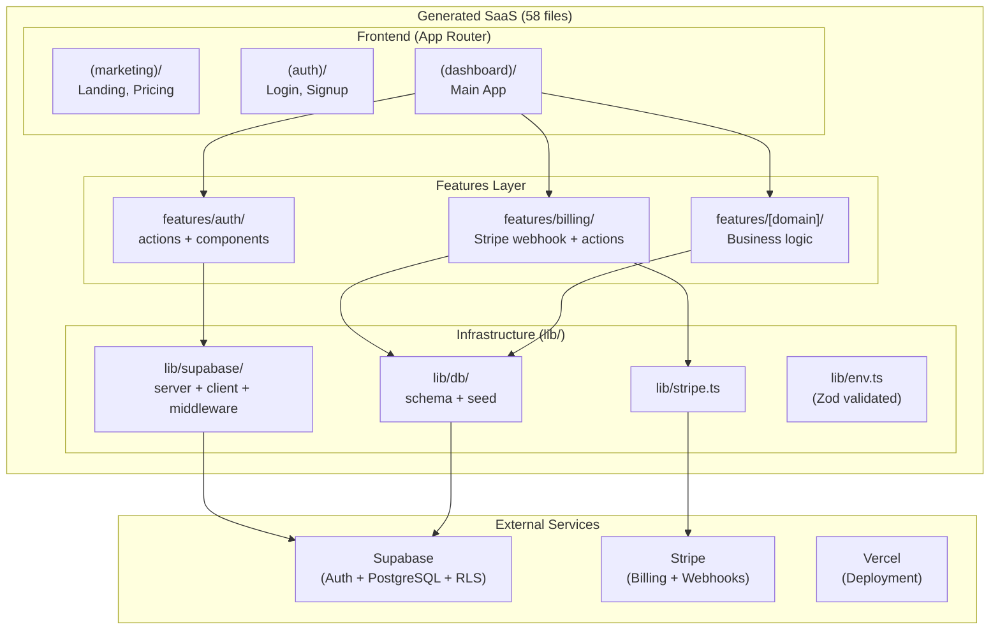

# SaaS 서비스 구축 코딩/구현 기술 3차 심층조사 종합 결과

> **조사 완료일**: 2026-03-12
> **프레임워크**: Technology_Development_DeepDive_PRD_Teammate_Executable.md (4-Phase Fork-Based Sessions)
> **에이전트 총 투입**: 17개 (Phase1: 10, Phase2: 4, Phase3: 3)
> **목적**: SaaS Auto-Builder PRD.md 작성을 위한 **SaaS 구현 기술 전문** 사전 리서치
> **핵심 제약**: 시스템이 "생성할" SaaS의 코딩/구현 기술 조사 — 시스템 자체의 기술(Round 2)이 아님
> **핵심 구분**: 로컬 CLI 실행, Solo founder 대상, 사용자 기술 수준 다양

---

## 1. 핵심 질문 3회 정밀 독해 결과 (SaaS 구현 기술 관점)

### 1회차 — SaaS 구현 기술 구조 읽기
핵심 질문들이 요구하는 **SaaS 구현 기술 레이어**:
- Q1-4 (아이디어→템플릿): SaaS 도메인 분류 + 보일러플레이트 기술
- Q5-7 (기능/사용자): SaaS 공통 기능 카탈로그 + UX 패턴
- Q8-10 (문서 생성): SaaS 비즈니스 로직→코드 변환 + API 설계 패턴
- Q9 (DB/Auth): **핵심 분기점** — 멀티테넌시, RLS, OAuth, Stripe 구독
- Q11-14 (디자인/구현): SaaS UI 컴포넌트 시스템 + 에이전트별 코드 생성

### 2회차 — 기술 확장 읽기
- Q9 "DB/Auth/고급기능"에서 multi-tenancy, RLS, OAuth, Stripe billing 등 핵심 아키텍처 결정 발생
- Q4 "코드 템플릿"은 **조건부 코드 생성** — 사용자 답변에 따라 인증 방식, DB 스키마, API가 달라짐
- 전체 흐름: "사용자 답변 → 조건부 분기 → SaaS 코드 생성"의 파이프라인

### 3회차 — 핵심 갭 보충
- 시스템이 생성하는 SaaS 품질 = 내장된 SaaS 구현 지식의 깊이에 비례
- SaaS 보일러플레이트 시장(Shipfast, Supastarter, Makerkit 등) 이미 존재 — 차별화는 "문서 기반 맞춤 생성"
- **결론**: "SaaS 도메인 지식을 코드로 변환하는 능력"이 시스템의 핵심 가치

---

## 2. Phase 1: 10개 Branch 기술 심층 조사

### 2.1 Core Tech — Aggressive (Branch 1.1)
**파일**: `prompt/saas-impl-aggressive-tech.md` (~4,200 words)
- Next.js 15+ App Router, Server Components, Server Actions
- Drizzle ORM 7.4KB (vs Prisma 1.6MB), edge-ready
- Supabase Stripe Sync Engine (2-5일 webhook 작업 제거)
- Turbopack 356x HMR, Biome 56x linting
- 4-tier 안정성 층화 (Core/Standard/Enhanced/Advanced)
- 5개 보일러플레이트 분석: Shipfast, Supastarter, Makerkit, Next SaaS Starter, Vercel Subscription Payments
- **추천도**: 8/10

### 2.2 Core Tech — Conservative (Branch 1.2)
**파일**: `prompt/saas-impl-conservative-tech.md` (~6,100 words)
- Next.js Pages Router 여전히 유효, Prisma 5년+ 검증
- NextAuth.js v4 (millions 배포), 14년 Stripe 안정성
- PostgreSQL RLS (v9.5/2016~), JSONB 유연 데이터
- 사례: Linear (ACID), Loom ($975M, 모듈러 모놀리스), Causal (Prisma 타입 안전)
- **안정성**: 9/10, Solo founder 6-9주 습득

### 2.3 Architecture — Evolutionary (Branch 2.1)
**파일**: `prompt/saas-impl-evolutionary-architecture.md` (~5,750 words)
- 35-55 파일 MVP, 신호 기반 진화 (달력이 아닌 관찰 가능한 조건)
- 생성된 `EVOLUTION.md` — 도메인별 진화 트리거와 월간 체크리스트
- Non-negotiable Day 1: org-scoped RLS, cursor 페이지네이션, Stripe customer ID on org
- "Deferred complexity" ≠ "Deferred foundations" 구분
- 사례: Basecamp (마이크로서비스 미추출), Linear (실시간만 분리), Notion
- **결론**: Evolutionary가 올바른 기본값

### 2.4 Architecture — Big Bang (Branch 2.2)
**파일**: `prompt/saas-impl-big-bang-architecture.md` (~5,110 words)
- 3-tier 복잡도 선택: Starter (45파일) / Professional (95파일) / Enterprise (160+파일)
- 복잡도 선택기 = CLI 대화의 가장 중요한 UX 질문
- Professional tier 전체 폴더 트리 문서화
- 4개 마이그레이션 파일: 초기 스키마, RLS, billing, audit
- Crossover Week 8: Big Bang이 enterprise-deployable에 더 빨리 도달
- 사례: Linear (성능), Notion (멀티테넌시), Stripe (API 버전닝)
- **결론**: 조건부 YES — 사용자 SaaS 규모에 따라

### 2.5 Dev Workflow — Rapid (Branch 3.1)
**파일**: `prompt/saas-impl-rapid-development.md` (~4,781 words)
- pnpm 2x npm, Turbopack 10x HMR, 21분 전체 배포 경로
- Plop.js 1초 스캐폴딩, Vitest 0.4s (Jest 4s)
- 스키마→7개 아티팩트 14초 파이프라인
- 6개 보안 guardrail (client-only auth 금지, service key 노출 금지, RLS 필수 등)
- 사례: Marc Lou (5-14일 SaaS), Pieter Levels, indie hackers 30-50% 시간 = 인프라
- **목표**: "Weekend SaaS" 달성 가능

### 2.6 Dev Workflow — Robust (Branch 3.2)
**파일**: `prompt/saas-impl-robust-development.md` (~5,456 words)
- Docker Compose 전체 환경, 8-gate CI/CD 파이프라인
- RLS-first 보안: fail-closed guard 함수
- 5-layer 테스트: Unit(95% billing) → Component → Integration → Security → E2E
- Typed AppError 계층, Sentry PII 스크러빙, correlation ID
- 70% 전체 커버리지 바닥, 95% 결제 코드
- 사례: Linear (예측 가능한 mutation), Vercel (atomic deploy), Supabase (RLS 기본 인가)

### 2.7 Tech Debt — Minimized (Branch 4.1)
**파일**: `prompt/saas-impl-debt-minimized.md` (~5,180 words)
- **메타 품질 곱셈 효과**: 1 shortcut × N 프로젝트 = N 부채 인스턴스
- TypeScript strict 10개 플래그 전체 + `noUncheckedIndexedAccess`
- DB 부채 방지: 필수 4컬럼 (created_at/updated_at/deleted_at/version)
- 6개 SaaS 부채 패턴: 하드코딩 가격, localStorage 토큰, webhook 멱등성 누락, rate limiting 누락, audit 누락, 단일 테넌트
- 손익분기 Month 4-5 (DORA/Forsgren 연구)
- 50-founder 스케일: 8,400시간 절약 vs 12,500시간 낭비

### 2.8 Tech Debt — Practical (Branch 4.2)
**파일**: `prompt/saas-impl-debt-practical.md` (~6,788 words)
- Generator-level 부채 vs Project-evolution 부채 구분
- Green Zone (허용 부채) 10개 + Red Lines (절대 금지) 7개
- 3-phase 할당: 95/5 → 85/15 → 80/20
- Machine-readable `DEBT-ITEM` 주석 + `TECHNICAL-DEBT.md` 자동 생성
- NPV 분석: 부채 유형별 "이자율" (선형/다항식/지수 성장)
- 사례: Instagram, Twitter, Shopify, Notion, GitHub

### 2.9 Theory — Modern (Branch 5.1)
**파일**: `prompt/saas-impl-modern-theory.md` (~4,800 words)
- JAMstack (Biilmann 2016): SaaS 한계 노출, 선택적 적용
- RSC (Abramov & Tan 2020): 서버-클라이언트 경계 = 아키텍처 결정
- Edge Computing: CAP 정리 연장, middleware만 edge
- AI-First: Perry et al. (CCS 2023) — AI 코드 40%+ 취약점
- BaaS/RLS: zero-trust DB 인가, 멀티테넌시 pool model
- Component-Driven: Atomic Design (Frost 2016), shadcn/ui copy-paste
- Server state ≠ Client state (Linsley): SaaS 80-90% = server state
- Subscription Economy (Tzuo 2018), ASC 606 revenue recognition
- Zero Trust (Kindervag/Forrester 2010, NIST SP 800-207)
- **이론적 견고성**: 8/10

### 2.10 Theory — Classical (Branch 5.2)
**파일**: `prompt/saas-impl-classical-theory.md` (~6,046 words)
- SOLID (Martin 2000): SaaS 모듈별 적용, 과잉 설계 경계
- Clean Architecture (Martin 2012/2017): Next.js에서 레이어 블러링 인정
- DDD Bounded Contexts (Evans 2003): Auth, Billing, User, [Domain]
- Relational Model (Codd 1970), ACID (Gray 1981): billing 비타협
- RBAC (Ferraiolo & Kuhn 1992), Least Privilege (Saltzer & Schroeder 1975)
- Information Hiding (Parnas 1972): 외부 서비스 추상화
- 12-Factor (Wiggins 2011): SaaS 필수 요소
- Test Pyramid (Cohn 2009), Amdahl's Law (1967)
- 16개 이론 검증 스코어카드 (13-60년 검증)
- **Top 5 Generator 필수**: ACID, Least Privilege/RLS, Bounded Contexts, Information Hiding, 12-Factor Config
- 30+ 인용, **이론적 확실성**: 10/10

---

## 3. Phase 1 통합: 10개 Branch 교차 분석

### 기술 선택 스펙트럼

```
Core Tech:     Aggressive ←──[6/10]──→ Conservative
               Drizzle, App Router, Stripe Sync    Prisma, Pages Router, 14년 검증
               → Drizzle vs Prisma가 최대 분기점

Architecture:  Evolutionary ←──[4/10]──→ Big Bang
               35-55 파일, 신호 기반 진화         3-tier (45/95/160+ 파일)
               → 둘 다 "사용자 선택에 따라 결정" 수렴

Dev Workflow:  Rapid ←──[5/10]──→ Robust
               21분 배포, pnpm+Turbopack           8-gate CI/CD, Docker Compose
               → 보안 guardrail은 양쪽 모두 필수 합의

Tech Debt:     Minimized ←──[5/10]──→ Practical
               메타 품질 곱셈, 손익분기 M4-5       Generator vs Project 부채 분리
               → Generator-level 부채는 절대 금지 합의

Theory:        Modern ←──[5/10]──→ Classical
               RSC, Edge, BaaS, AI-first            ACID, SOLID, DDD, 12-Factor
               → "Classical 필수 + Modern 선택적" 수렴
```

### 10/10 절대 합의
1. **RLS (Row Level Security)** = SaaS 멀티테넌시 기본
2. **TypeScript strict mode** = 생성 코드 최소 품질 기준
3. **보안 비타협** = 인증/결제/데이터에서 절대 shortcuts 없음
4. **Supabase + PostgreSQL** = SaaS 데이터 레이어 표준
5. **Stripe + 멱등성** = 결제/구독 표준

### 최대 불일치
| 불일치 | Branch A | Branch B | 해결 기준 |
|--------|----------|----------|-----------|
| ORM 선택 | Drizzle (edge, 7KB, TS-native) | Prisma (5yr+, readable) | Generator 친화성 |
| 라우팅 전략 | App Router+Server Actions (-32% 파일) | Pages Router+API Routes (명시적) | 파일 수 최소화 |
| 인증 시스템 | Supabase Auth (RLS 네이티브) | NextAuth v4 (독립, battle-tested) | RLS 통합 깊이 |
| 아키텍처 복잡도 | 35-55 파일 시작 (2.1) | 95-160+ 파일 완성형 (2.2) | 사용자 SaaS 규모 |

---

## 4. Phase 2: 4개 관점별 토론 결과

### 4.1 Discussion — Latest Tech First (2.A)
- **"Factory Multiplier" 논거**: N 프로젝트 × 기술 개선 = 복합 가치
- App Router: 30-40% 파일 감소, Server Components = 데이터 페칭 파일 3→1
- Drizzle: TypeScript-native → Generator와 동일 파이프라인으로 스키마 생성
- Supabase Auth: 단일 인증 시스템, NextAuth 추가 = 이중 identity
- Stripe Sync Engine: 300+ 줄 webhook 코드 제거
- **결론**: "Build the factory with the latest technology"

### 4.2 Discussion — Stability First (2.B)
- **"Multiplicative Blast Radius" 논거**: 1 bug × N users = catastrophic
- Next.js 14.x 고정 (15+ 미검증), Prisma (5yr 생태계)
- NextAuth v4 (Auth.js v5는 beta), ESLint (Biome 미검증)
- **"Generated code must work FIRST TIME"** — 사용자는 cutting-edge 디버깅 불가
- Stack Overflow 커버리지 = 사용자 셀프서비스 지원
- **결론**: "Innovation appropriate when innovator bears consequences"

### 4.3 Discussion — Speed First (2.C)
- **"Ruthless Prioritization" 논거**: 차별화 아닌 것은 Generator가 처리
- Server Actions: 18-24 파일 감소, Drizzle push: 매 스키마 변경 15-45초 절감
- "Weekend SaaS" 타겟: 금요일 저녁→월요일 아침
- 30분→배포 랜딩페이지, 4시간→auth+billing, 3일→첫 고객
- 5개 비타협: Supabase Auth, Stripe 서명, TS strict, ACID billing, rate limiting
- **결론**: "Eliminate every decision that doesn't differentiate"

### 4.4 Discussion — Maintainability First (2.D)
- **"Readability Over Cleverness" 논거**: 생성 코드에 저자 없음
- Prisma schema.prisma = 비-TypeScript 개발자도 읽을 수 있음
- Pages Router 기본 + App Router opt-in (현시점 추천)
- Feature-based 아키텍처 비타협, 추상화 레이어 (auth/, db/)
- Generated docs: ARCHITECTURE.md, DECISIONS.md, per-feature README
- `--prototype` 모드 = 경량 생성 (품질 인프라 없이)
- **결론**: "Produce code users can maintain for years"

---

## 5. Phase 2 통합: 4개 관점 기술 합의표

| 기술 | Latest | Stability | Speed | Maintain | 합의도 |
|------|--------|-----------|-------|----------|--------|
| TypeScript strict | ✓ | ✓ | ✓ | ✓ | **4/4 ✅** |
| RLS 멀티테넌시 | ✓ | ✓ | ✓ | ✓ | **4/4 ✅** |
| Feature-based arch | ✓ | ✓ | ✓ | ✓ | **4/4 ✅** |
| shadcn/ui+Tailwind | ✓ | ✓ | ✓ | ✓ | **4/4 ✅** |
| Vitest | ✓ | ✓ | ✓ | ✓ | **4/4 ✅** |
| Supabase+PostgreSQL | ✓ | ✓ | ✓ | ✓ | **4/4 ✅** |
| Stripe+멱등성 | ✓ | ✓ | ✓ | ✓ | **4/4 ✅** |
| Stripe Sync Engine | ✓ | △ | ✓ | △ | 3/4 |
| pnpm | ✓ | △ | ✓ | △ | 3/4 |
| App Router | ✓ | ✗ (14.x) | ✓ | △ (opt-in) | 2.5/4 |
| Server Actions | ✓ | ✗ | ✓ | ✗ | 2/4 |
| Drizzle | ✓ | ✗ | ✓ | ✗ | 2/4 |
| Prisma | ✗ | ✓ | ✗ | ✓ | 2/4 |
| Supabase Auth | ✓ | ✗ (NextAuth) | ✓ | △ | 2.5/4 |

---

## 6. Phase 3: 3개 시나리오 비교

### 6.1 Cutting Edge Scenario (3.A)
**파일**: `prompt/saas-scenario-cutting-edge.md` (~5,466 words)
- Next.js 15.3, Drizzle 0.38, Supabase Auth, Stripe Sync Engine
- **120 파일**, 8분 로컬, 22분 배포, 3일 첫 고객
- 난이도 7.5/10, 성공률 72%
- 3개 pre-1.0 의존성 위험
- **총점**: 7.5/10

### 6.2 Balanced-Tech Scenario (3.B) ← **최종 선택**
**파일**: `prompt/saas-scenario-balanced-tech.md` (~8,264 words)
- Next.js 15.x App Router, Drizzle, Supabase Auth, **수동 Stripe webhook**
- **58 파일** (최소), 8-12분 로컬, 35-50분 배포, 2-3일 첫 고객
- Cherry-pick 핵심: Stripe Sync Engine 거부 → 투명성 우선
- App Router 선택 이유: 32% 파일 감소 (58 vs 85)
- Drizzle 선택 이유: TypeScript-native → Generator 프로그래매틱 생성
- Supabase Auth 선택 이유: `auth.uid()` RLS 네이티브, 60+ 줄 브릿지 제거
- **총점**: 9/10, **기본 템플릿 추천**

### 6.3 Proven Stack Scenario (3.C)
**파일**: `prompt/saas-scenario-proven-stack.md` (~9,460 words)
- Next.js 14.2.x, Prisma, NextAuth v4, ESLint, npm
- **94 파일**, 15분 30초 로컬, 32분 배포, **14-28일 첫 고객**
- 성공률 97%, Stack Overflow 자급자족 88%
- 10개 기술 명시적 거부 (Next.js 15+, Drizzle, Auth.js v5, Biome, Bun 등)
- **총점**: ~8/10

---

## 7. Phase 4: 최종 의사결정

### 선택: BALANCED-TECH SCENARIO

**선택 근거 (프레임워크 체크리스트)**:
- Balanced 4/4 조건 충족 (중간 기술 역량, 현실적 기간, 기술-안정성 균형, 학습 의지)
- Cutting Edge 1/4 (72% 성공률 → Generator 부적합)
- Proven Stack 1/4 (14-28일 첫 고객 → 속도 목표 상충)

**버린 시나리오 이유**:
- **Cutting Edge**: 3개 pre-1.0 의존성, 120파일(58 대비 107% 증가), 72% 성공률
- **Proven Stack**: 94파일, 14-28일 첫 고객(2-3일 대비 5-10x 느림), Pages Router 미래 유지보수 리스크

### Balanced-Tech의 핵심 Cherry-Pick 결정

| 결정 | 선택 | 대안 | 결정적 이유 |
|------|------|------|-------------|
| ORM | **Drizzle** | Prisma | TypeScript-native → Generator와 동일 파이프라인으로 스키마 구성 |
| 라우터 | **App Router** | Pages Router | 32% 파일 감소 (58 vs 85), Server Components 데이터 페칭 |
| 인증 | **Supabase Auth** | NextAuth v4 | `auth.uid()` RLS 직접 참조, 60+ 줄 브릿지 제거 |
| Stripe | **수동 Webhook** | Sync Engine | 결제 코드 투명성 — 사용자가 읽고 디버깅 가능해야 함 |
| Server Actions | **하이브리드** | API Routes only | mutations = Server Actions, external API = Route Handlers |
| Next.js 버전 | **15.x** | 14.x / 15.3 | 15.x 안정 + App Router 캐싱 모델 확정 |

---

## 8. 최종 SaaS 생성 기술 스택

### Frontend Layer
- **Framework**: Next.js 15.x (App Router)
- **Language**: TypeScript 5.x (strict: true)
- **UI**: shadcn/ui + Tailwind CSS
- **State**: Zustand (client) + TanStack Query (server state)
- **Forms**: react-hook-form + Zod
- **Data Fetching**: Server Components (read), Server Actions (mutations)

### Backend Layer
- **API**: Server Actions (mutations) + Route Handlers (external API, webhooks)
- **Auth**: Supabase Auth + `@supabase/ssr`
- **Authorization**: RLS policies (DB level) + middleware (app level)
- **Validation**: Zod (모든 외부 입력)

### Data Layer
- **ORM**: Drizzle ORM (latest stable)
- **Database**: Supabase PostgreSQL
- **Migration**: `drizzle-kit push` (dev), `drizzle-kit generate` + `migrate` (prod)
- **Schema**: TypeScript-native, multi-tenant (org_id + RLS)

### Billing Layer
- **Payments**: Stripe (latest SDK)
- **Integration**: 수동 webhook handler (투명성 우선)
- **Subscription**: 멱등성 키, 서명 검증, 이벤트 중복 제거
- **Feature Gating**: RLS policy + subscription status check

### DevOps Layer
- **Package Manager**: pnpm
- **Bundler**: Turbopack (dev), Next.js build (prod)
- **Linting**: Biome (formatting + linting)
- **Testing**: Vitest (unit/integration), Playwright (E2E)
- **CI/CD**: GitHub Actions (type check → lint → test → build → deploy)
- **Deployment**: Vercel

### 생성 파일 구조 (58파일 기준)
```
generated-saas/                    ← 58 files total
├── app/                           ← Next.js App Router
│   ├── (auth)/                    ← Auth group routes
│   │   ├── login/page.tsx
│   │   ├── signup/page.tsx
│   │   └── callback/route.ts
│   ├── (dashboard)/               ← Protected routes
│   │   ├── layout.tsx
│   │   ├── page.tsx
│   │   ├── settings/page.tsx
│   │   └── billing/page.tsx
│   ├── (marketing)/               ← Public routes
│   │   ├── page.tsx               ← Landing
│   │   └── pricing/page.tsx
│   ├── api/webhooks/stripe/route.ts  ← Stripe webhook (explicit)
│   ├── layout.tsx                 ← Root layout
│   ├── not-found.tsx
│   └── error.tsx
├── features/                      ← Feature-based modules
│   ├── auth/
│   │   ├── actions.ts
│   │   ├── middleware.ts
│   │   └── components/
│   ├── billing/
│   │   ├── actions.ts
│   │   ├── stripe-webhook.ts
│   │   ├── components/
│   │   └── README.md
│   └── [domain]/                  ← User's business logic
│       ├── actions.ts
│       ├── components/
│       └── types.ts
├── lib/                           ← Shared infrastructure
│   ├── supabase/
│   │   ├── server.ts
│   │   ├── client.ts
│   │   └── middleware.ts
│   ├── db/
│   │   ├── schema.ts             ← Drizzle schema (single file)
│   │   ├── index.ts
│   │   └── seed.ts
│   ├── stripe.ts
│   ├── env.ts                    ← Zod-validated env vars
│   └── utils.ts
├── components/                    ← Shared UI components
│   ├── ui/                        ← shadcn/ui components
│   └── layout/
├── supabase/
│   └── migrations/
├── .env.example
├── drizzle.config.ts
├── middleware.ts                   ← Auth + security headers
├── next.config.ts
├── package.json
├── tsconfig.json
├── biome.json
├── vitest.config.ts
├── ARCHITECTURE.md                ← Generated architecture docs
├── EVOLUTION.md                   ← Evolution triggers + checklist
└── TECHNICAL-DEBT.md              ← Pre-populated debt inventory
```

---

## 9. 아키텍처 다이어그램



---

## 10. 타임라인 및 비용

### 생성→배포 타임라인
| 단계 | 시간 | 설명 |
|------|------|------|
| Generator 실행 | ~10분 | CLI Q&A → 58파일 생성 |
| pnpm install | ~90초 | 의존성 설치 |
| 로컬 실행 | ~1분 | `pnpm dev` → localhost 확인 |
| 커스터마이징 | 2-4시간 | 카피, 색상, 가격, 비즈니스 로직 |
| Vercel 배포 | ~10분 | git push → 자동 배포 |
| Supabase 설정 | ~15분 | 프로젝트 생성, 환경변수, RLS |
| Stripe 설정 | ~20분 | 테스트 모드, 가격, webhook |
| **총 첫 배포** | **~35-50분** | **생성→라이브 URL** |
| **첫 고객 가능** | **2-3일** | **비즈니스 로직 추가 포함** |

### API 비용 (생성 시)
| 항목 | 예상 비용 |
|------|-----------|
| Claude API (문서 생성) | $0.15-$0.50/프로젝트 |
| Claude API (코드 생성) | $0.30-$1.00/프로젝트 |
| **총 생성 비용** | **$0.45-$1.50/프로젝트** |

---

## 11. 위험 매트릭스

| # | 위험 | 확률 | 영향 | 완화 |
|---|------|------|------|------|
| 1 | Drizzle pre-1.0 breaking change | 20% | High | 버전 고정 + 마이그레이션 가이드 |
| 2 | App Router 캐싱 모델 추가 변경 | 15% | Medium | 명시적 캐싱 주석 + revalidate 패턴 |
| 3 | Supabase Auth SSR 리그레션 | 10% | High | NextAuth fallback 아키텍처 준비 |
| 4 | AI 생성 코드 취약점 (40%+ 연구) | 60% | High | RLS + TypeScript strict + 보안 guardrail 6개 |
| 5 | 사용자가 생성 코드 이해 못함 | 30% | Medium | ARCHITECTURE.md + per-feature README |
| 6 | 58파일이 특정 SaaS에 불충분 | 25% | Medium | Evolution trigger + EVOLUTION.md 가이드 |

---

## 12. 이론적 기초 요약

### Generator 필수 이론 (Must Embed)
| 이론 | 저자/년도 | SaaS 적용 |
|------|-----------|-----------|
| ACID | Jim Gray, 1981 | Stripe billing 트랜잭션 |
| Least Privilege / RLS | Saltzer & Schroeder, 1975 | 모든 테이블 RLS 기본 |
| Bounded Contexts | Eric Evans, 2003 | auth/, billing/, [domain]/ 분리 |
| Information Hiding | David Parnas, 1972 | lib/supabase/, lib/stripe.ts 추상화 |
| 12-Factor Config | Adam Wiggins, 2011 | lib/env.ts Zod 검증 |
| Component-Driven Dev | Brad Frost, 2016 | shadcn/ui atomic design |
| Server State ≠ Client State | Tanner Linsley, 2020 | TanStack Query + Zustand 분리 |

### 이론 vs 실무 갭
| 이론 | 약속 | 현실 | 타협점 |
|------|------|------|--------|
| ACID | 완벽한 일관성 | 분산 환경 한계 | Billing만 ACID 엄격, 나머지 유연 |
| Clean Architecture | 프레임워크 독립 | Next.js가 레이어 블러링 | Feature-based 경계로 대체 |
| Zero Trust | 모든 요청 검증 | 성능 비용 | RLS + middleware 2-layer |
| DDD Aggregates | 도메인 순수성 | 과잉 설계 위험 | Bounded Context만 적용, Aggregate 생략 |

---

## 13. Round 1-2-3 종합 비교

| 측면 | Round 1 (종합) | Round 2 (시스템 기술) | Round 3 (SaaS 구현) |
|------|---------------|---------------------|---------------------|
| 범위 | 시장/사용자/기술/비즈니스 | 시스템 자체 기술 스택 | **생성될 SaaS 코드 기술** |
| 선택 | Balanced Scenario | Balanced-Tech | **Balanced-Tech** |
| 핵심 결정 | 8기능, $19/mo, Open-Core | Zod+Structured Outputs | **Drizzle+App Router+Supabase Auth** |
| 아키텍처 | 모듈러 모놀리스 | Evolutionary (~25 files) | **58파일 Feature-based** |
| 타임라인 | 24주+3주 버퍼 | 23.5주+2.5주 버퍼 | **2-3일 첫 고객 (생성 SaaS)** |

### 3개 Round가 정렬되는 핵심
1. **Evolutionary/Balanced 철학 일관** — 3 Round 모두 중도 실용주의 선택
2. **TypeScript + Zod + RLS** — Round 2(시스템)와 Round 3(생성 SaaS) 모두 동일 기술 기반
3. **Solo Founder 현실** — 모든 Round에서 1인 개발자 제약을 핵심 평가 기준으로 적용

---

## 14. 파일 인덱스

### Phase 1 파일 (10개)
| 파일 | Branch | 내용 |
|------|--------|------|
| `saas-impl-aggressive-tech.md` | 1.1 | 최신 SaaS 구현 기술 (8/10) |
| `saas-impl-conservative-tech.md` | 1.2 | 검증된 SaaS 구현 기술 (9/10 안정성) |
| `saas-impl-evolutionary-architecture.md` | 2.1 | 점진적 SaaS 아키텍처 |
| `saas-impl-big-bang-architecture.md` | 2.2 | 완성형 SaaS 아키텍처 (3-tier) |
| `saas-impl-rapid-development.md` | 3.1 | 빠른 SaaS 개발 프로세스 |
| `saas-impl-robust-development.md` | 3.2 | 견고한 SaaS 개발 프로세스 |
| `saas-impl-debt-minimized.md` | 4.1 | SaaS 부채 최소화 |
| `saas-impl-debt-practical.md` | 4.2 | SaaS 실용적 부채 관리 |
| `saas-impl-modern-theory.md` | 5.1 | 최신 SaaS 이론 (8/10) |
| `saas-impl-classical-theory.md` | 5.2 | 고전 SaaS 이론 (10/10) |

### Phase 2 (인라인 분석 — 파일 미생성)
| Branch | 관점 | 핵심 논거 |
|--------|------|-----------|
| 2.A | Latest Tech First | Factory Multiplier |
| 2.B | Stability First | Multiplicative Blast Radius |
| 2.C | Speed First | Ruthless Prioritization |
| 2.D | Maintainability First | Readability Over Cleverness |

### Phase 3 파일 (3개)
| 파일 | 시나리오 | 점수 |
|------|----------|------|
| `saas-scenario-cutting-edge.md` | Cutting Edge | 7.5/10 |
| `saas-scenario-balanced-tech.md` | **Balanced-Tech (선택)** | **9/10** |
| `saas-scenario-proven-stack.md` | Proven Stack | ~8/10 |

### 종합 문서
| 파일 | 내용 |
|------|------|
| `RESEARCH-SYNTHESIS-saas-impl-round3.md` | **이 문서 — 3차 조사 전체 종합** |
