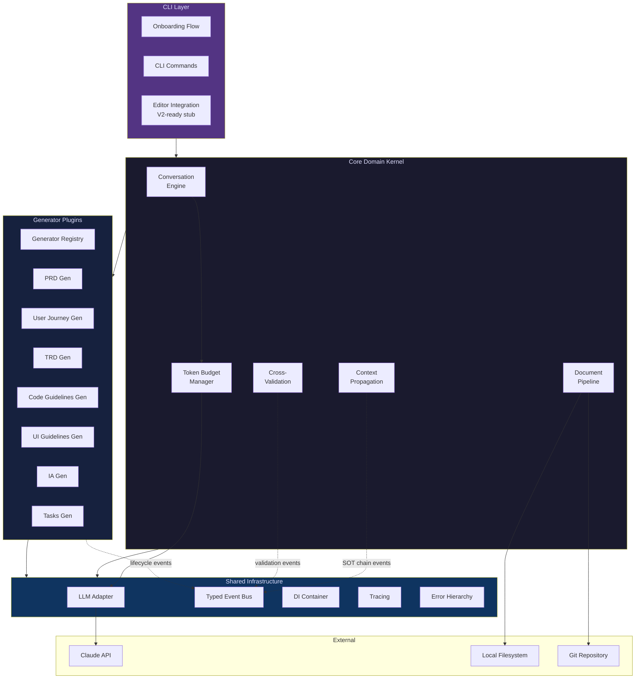
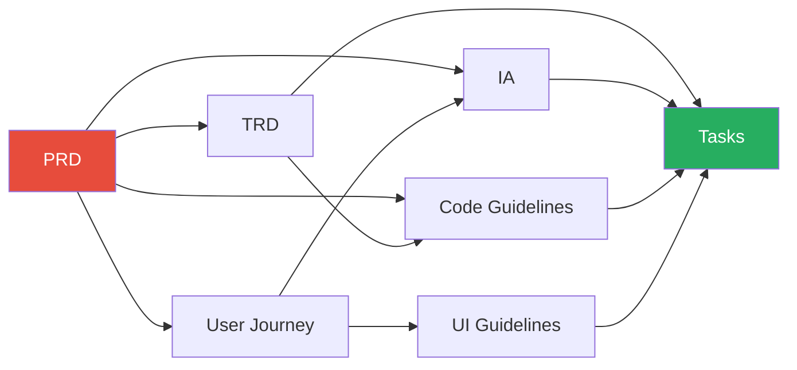
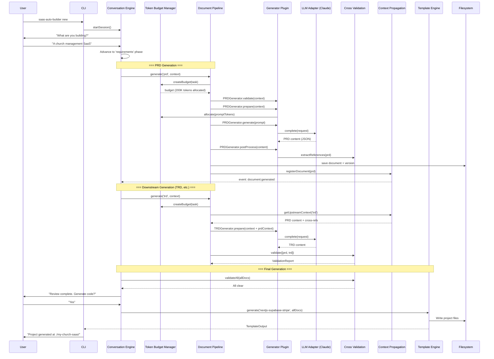

# SaaS Auto-Builder: Big Bang Architecture Design Report

**Perspective**: Architect Who Believes in Getting the Design Right from the Start
**Core Assumption**: "Do it right the first time, and you won't suffer later."
**Date**: 2026-03-12

---

## Executive Summary

This report presents a comprehensive, front-loaded architecture for SaaS Auto-Builder -- a local CLI tool built on Claude Code that conversationally generates 7 interconnected SaaS documents (PRD, User Journey, TRD, Code Guidelines, UI Guidelines, Information Architecture, Tasks). The architecture is designed as a **Modular Monolith** with strict interface contracts, event-driven inter-module communication, a plugin system for document generators, and a context window budget manager that treats LLM token limits as a first-class architectural constraint.

The full architecture is specified here -- every module boundary, every interface, every data flow -- so that 6 months of implementation proceeds with minimal ambiguity. V2 features (Web GUI, template marketplace, multi-framework) require zero structural changes; they plug into extension points that exist from Day 1.

The honest cost: **16-18 weeks of solo development** before a usable V1, with a real risk of over-engineering. But the payoff: a system that does not need to be rewritten when it succeeds.

---

## 1. System Architecture Overview

### 1.1 High-Level Module Diagram

```
saas-auto-builder/
├── src/
│   ├── core/                          ← Domain kernel (no external deps)
│   │   ├── conversation-engine/       ← Multi-phase dialog state machine
│   │   ├── document-pipeline/         ← Orchestrates generation across 7 docs
│   │   ├── context-propagation/       ← SOT chain: forward + backward refs
│   │   ├── cross-validation/          ← Inter-document consistency engine
│   │   └── token-budget/              ← Context window budget manager
│   │
│   ├── generators/                    ← Plugin-based document generators
│   │   ├── generator-registry.ts      ← Plugin discovery + lifecycle
│   │   ├── base-generator.ts          ← Abstract base with lifecycle hooks
│   │   ├── prd/                       ← PRD generator plugin
│   │   ├── user-journey/              ← User Journey generator plugin
│   │   ├── trd/                       ← TRD generator plugin
│   │   ├── code-guidelines/           ← Code Guidelines generator plugin
│   │   ├── ui-guidelines/             ← UI Guidelines generator plugin
│   │   ├── ia/                        ← Information Architecture plugin
│   │   └── tasks/                     ← Task Breakdown generator plugin
│   │
│   ├── templates/                     ← Output scaffolding
│   │   ├── template-engine/           ← Handlebars/EJS-based rendering
│   │   └── nextjs-supabase-stripe/    ← Default template pack
│   │
│   ├── licensing/                     ← Tier-gated feature access
│   │   └── tier-manager/              ← Feature flags per tier
│   │
│   ├── cli/                           ← User-facing interface layer
│   │   ├── onboarding/                ← First-run experience
│   │   ├── commands/                  ← CLI command definitions
│   │   └── editor-integration/        ← VS Code / cursor support (V2-ready)
│   │
│   ├── shared/                        ← Cross-cutting concerns
│   │   ├── llm-adapter/              ← Abstract LLM provider
│   │   ├── event-bus/                ← Typed event system
│   │   ├── di-container/             ← Dependency injection
│   │   ├── config/                   ← Configuration management
│   │   ├── types/                    ← Shared type definitions
│   │   ├── errors/                   ← Structured error hierarchy
│   │   └── tracing/                  ← Distributed tracing (local)
│   │
│   └── api/                          ← V2-ready: HTTP API layer (stub)
│       └── routes/                   ← Express/Hono routes (not activated V1)
│
├── schemas/                          ← JSON Schema definitions for all 7 docs
│   ├── prd.schema.json
│   ├── user-journey.schema.json
│   ├── trd.schema.json
│   ├── code-guidelines.schema.json
│   ├── ui-guidelines.schema.json
│   ├── ia.schema.json
│   ├── tasks.schema.json
│   └── cross-references.schema.json  ← Reference graph schema
│
├── prompts/                          ← LLM prompt templates (versioned)
│   ├── registry.ts                   ← Version-aware prompt loader
│   ├── v1/
│   │   ├── prd-generation.md
│   │   ├── trd-generation.md
│   │   └── ...
│   └── v2/                           ← Future prompt versions
│
└── tests/
    ├── unit/
    ├── integration/
    └── regression/                   ← Generated document regression tests
```

### 1.2 Architecture Diagram (Mermaid)



---

## 2. Module System: Strict Interface Contracts

### 2.1 Dependency Rules (Enforced at Build Time)

The dependency graph flows inward, following Clean Architecture:

```
CLI → Core → Shared ← Generators
              ↑
              └── Templates
```

**Hard rules enforced via ESLint + tsconfig project references:**
1. `core/` NEVER imports from `cli/`, `generators/`, or `templates/`
2. `generators/` imports from `shared/` and `core/` interfaces only (never concrete classes)
3. `cli/` orchestrates but never contains business logic
4. `shared/` has ZERO imports from any other module (pure infrastructure)

### 2.2 Core Interface Contracts

```typescript
// ====================================================================
// src/shared/types/document.ts — The Document Universe
// ====================================================================

/** Every generated document conforms to this base */
export interface GeneratedDocument<T extends DocumentType = DocumentType> {
  readonly id: DocumentId;
  readonly type: T;
  readonly version: SemanticVersion;
  readonly content: DocumentContentMap[T];
  readonly metadata: DocumentMetadata;
  readonly references: CrossReference[];
  readonly generatedAt: ISO8601Timestamp;
  readonly checksum: SHA256Hash;
}

export type DocumentType =
  | 'prd'
  | 'user-journey'
  | 'trd'
  | 'code-guidelines'
  | 'ui-guidelines'
  | 'ia'
  | 'tasks';

/** Type-safe content map — each document type has its own shape */
export interface DocumentContentMap {
  'prd': PRDContent;
  'user-journey': UserJourneyContent;
  'trd': TRDContent;
  'code-guidelines': CodeGuidelinesContent;
  'ui-guidelines': UIGuidelinesContent;
  'ia': IAContent;
  'tasks': TasksContent;
}

/** Cross-reference between documents */
export interface CrossReference {
  readonly sourceDoc: DocumentId;
  readonly sourceSection: SectionPath;
  readonly targetDoc: DocumentId;
  readonly targetSection: SectionPath;
  readonly referenceType: 'derives-from' | 'implements' | 'constrains' | 'validates';
  readonly confidence: number; // 0-1, set by cross-validation engine
}

// ====================================================================
// src/core/document-pipeline/interfaces.ts — Pipeline Contracts
// ====================================================================

/** The pipeline orchestrates the full generation lifecycle */
export interface IDocumentPipeline {
  /**
   * Generate a single document with all cross-references resolved.
   * The pipeline handles: prompt assembly, LLM call, schema validation,
   * cross-reference extraction, and SOT chain update.
   */
  generate(
    type: DocumentType,
    context: GenerationContext,
    options?: GenerationOptions
  ): Promise<Result<GeneratedDocument, GenerationError>>;

  /**
   * Regenerate a document after upstream changes.
   * Forward-propagation: PRD change → cascade to TRD, Tasks, etc.
   */
  propagateChange(
    changedDoc: DocumentId,
    changeset: DocumentChangeset
  ): Promise<PropagationResult>;

  /**
   * Validate cross-document consistency.
   * Returns all inconsistencies with severity and suggested fixes.
   */
  validate(docs: DocumentId[]): Promise<ValidationReport>;
}

/** Result type — no exceptions for expected failures */
export type Result<T, E> =
  | { success: true; value: T }
  | { success: false; error: E };

// ====================================================================
// src/core/conversation-engine/interfaces.ts — Conversation Contracts
// ====================================================================

/** Multi-phase conversation state machine */
export interface IConversationEngine {
  /** Start a new conversation session */
  startSession(config: SessionConfig): Promise<ConversationSession>;

  /** Process user input and advance state */
  processInput(
    session: ConversationSession,
    input: UserInput
  ): Promise<ConversationResponse>;

  /** Get current phase and progress */
  getState(session: ConversationSession): ConversationState;

  /** Serialize session for persistence */
  serialize(session: ConversationSession): SerializedSession;

  /** Resume from serialized state */
  deserialize(data: SerializedSession): ConversationSession;
}

export interface ConversationState {
  readonly phase: ConversationPhase;
  readonly completedDocuments: DocumentType[];
  readonly pendingDocuments: DocumentType[];
  readonly currentDocument: DocumentType | null;
  readonly decisions: Decision[];
  readonly tokenBudget: TokenBudgetSnapshot;
}

export type ConversationPhase =
  | 'onboarding'         // Initial project definition
  | 'requirements'       // PRD generation phase
  | 'design'            // UJ + IA + UI Guidelines
  | 'technical'         // TRD + Code Guidelines
  | 'planning'          // Task breakdown
  | 'review'            // Cross-validation + human review
  | 'generation';       // Template output

// ====================================================================
// src/generators/base-generator.ts — Plugin Interface
// ====================================================================

/**
 * Every document generator implements this interface.
 * The plugin system calls these methods in order:
 * 1. validate() — check preconditions
 * 2. prepare() — assemble context + prompt
 * 3. generate() — LLM call + parse
 * 4. postProcess() — cross-refs, schema validation
 */
export abstract class BaseGenerator<T extends DocumentType> {
  abstract readonly type: T;
  abstract readonly version: SemanticVersion;
  abstract readonly dependencies: DocumentType[];

  /** Check if all upstream documents are available and valid */
  abstract validate(context: GenerationContext): Promise<Result<void, ValidationError>>;

  /** Build the prompt with context window budget awareness */
  abstract prepare(context: GenerationContext): Promise<PreparedPrompt>;

  /** Execute LLM call and parse response */
  abstract generate(prompt: PreparedPrompt): Promise<Result<DocumentContentMap[T], GenerationError>>;

  /** Extract cross-references, validate schema, compute checksum */
  abstract postProcess(
    content: DocumentContentMap[T],
    context: GenerationContext
  ): Promise<GeneratedDocument<T>>;
}
```

### 2.3 Dependency Injection Container

Using **tsyringe** (lightweight, Microsoft-backed, decorator-driven) over InversifyJS -- appropriate for a solo-founder project that does not need InversifyJS's enterprise-scale features.

```typescript
// src/shared/di-container/container.ts

import { container } from 'tsyringe';

// Interface tokens (avoid string magic)
export const TOKENS = {
  LLMAdapter: Symbol('ILLMAdapter'),
  EventBus: Symbol('IEventBus'),
  DocumentPipeline: Symbol('IDocumentPipeline'),
  ConversationEngine: Symbol('IConversationEngine'),
  ContextPropagation: Symbol('IContextPropagation'),
  CrossValidation: Symbol('ICrossValidation'),
  TokenBudgetManager: Symbol('ITokenBudgetManager'),
  GeneratorRegistry: Symbol('IGeneratorRegistry'),
  TemplateEngine: Symbol('ITemplateEngine'),
  TierManager: Symbol('ITierManager'),
  Tracer: Symbol('ITracer'),
  Config: Symbol('IConfig'),
} as const;

// Registration happens at bootstrap — one place, explicit wiring
export function bootstrapContainer(config: AppConfig): void {
  // Shared infrastructure
  container.register(TOKENS.Config, { useValue: config });
  container.register(TOKENS.EventBus, { useClass: TypedEventBus });
  container.register(TOKENS.Tracer, { useClass: LocalTracer });

  // LLM layer
  container.register(TOKENS.LLMAdapter, {
    useFactory: () => createLLMAdapter(config.llm)
  });
  container.register(TOKENS.TokenBudgetManager, {
    useClass: TokenBudgetManager
  });

  // Core domain
  container.register(TOKENS.DocumentPipeline, { useClass: DocumentPipeline });
  container.register(TOKENS.ConversationEngine, { useClass: ConversationEngine });
  container.register(TOKENS.ContextPropagation, { useClass: ContextPropagationEngine });
  container.register(TOKENS.CrossValidation, { useClass: CrossValidationEngine });

  // Generators (plugin registration)
  container.register(TOKENS.GeneratorRegistry, { useClass: GeneratorRegistry });

  // Templates
  container.register(TOKENS.TemplateEngine, { useClass: HandlebarsTemplateEngine });

  // Licensing
  container.register(TOKENS.TierManager, { useClass: TierManager });
}
```

### 2.4 Typed Event Bus for Inter-Module Communication

Modules communicate through a typed event bus. No module calls another module directly except through defined interfaces. This is critical for the SOT chain propagation system.

```typescript
// src/shared/event-bus/interfaces.ts

/** All events in the system are typed */
export type SystemEvent =
  | DocumentGeneratedEvent
  | DocumentChangedEvent
  | CrossReferenceAddedEvent
  | ValidationFailedEvent
  | PropagationStartedEvent
  | PropagationCompletedEvent
  | TokenBudgetWarningEvent
  | ConversationPhaseChangedEvent;

export interface DocumentGeneratedEvent {
  type: 'document:generated';
  payload: {
    documentId: DocumentId;
    documentType: DocumentType;
    version: SemanticVersion;
    crossReferences: CrossReference[];
  };
}

export interface DocumentChangedEvent {
  type: 'document:changed';
  payload: {
    documentId: DocumentId;
    changeset: DocumentChangeset;
    affectedReferences: CrossReference[];
  };
}

export interface TokenBudgetWarningEvent {
  type: 'token-budget:warning';
  payload: {
    currentUsage: number;
    budgetLimit: number;
    recommendation: 'compress' | 'split' | 'summarize';
  };
}

/** Type-safe event bus */
export interface IEventBus {
  emit<E extends SystemEvent>(event: E): void;
  on<E extends SystemEvent>(
    eventType: E['type'],
    handler: (event: E) => void | Promise<void>
  ): Unsubscribe;
  once<E extends SystemEvent>(
    eventType: E['type'],
    handler: (event: E) => void | Promise<void>
  ): Unsubscribe;
}

type Unsubscribe = () => void;
```

---

## 3. Data Architecture

### 3.1 Document Schema Definitions

All 7 document types are defined as JSON Schema (Draft 2020-12), validated at runtime with **Ajv** (fastest JSON Schema validator). Zod is used for internal TypeScript validation; JSON Schema is the interchange format.

```typescript
// schemas/ directory contains .schema.json files
// Runtime validation example:

import Ajv from 'ajv';
import prdSchema from '../schemas/prd.schema.json';

const ajv = new Ajv({ allErrors: true, strict: true });
const validatePRD = ajv.compile(prdSchema);

function validateDocument(doc: unknown, type: DocumentType): ValidationResult {
  const validator = schemaValidators.get(type);
  if (!validator) throw new InvariantError(`No schema for ${type}`);

  const valid = validator(doc);
  if (!valid) {
    return {
      valid: false,
      errors: validator.errors!.map(toStructuredError),
    };
  }
  return { valid: true, errors: [] };
}
```

**PRD Schema (abbreviated)**:

```json
{
  "$schema": "https://json-schema.org/draft/2020-12/schema",
  "$id": "https://saas-auto-builder.local/schemas/prd.schema.json",
  "title": "Product Requirements Document",
  "type": "object",
  "required": ["projectName", "vision", "targetUsers", "features", "constraints"],
  "properties": {
    "projectName": { "type": "string", "minLength": 1 },
    "vision": {
      "type": "object",
      "required": ["problem", "solution", "uniqueValue"],
      "properties": {
        "problem": { "type": "string", "minLength": 50 },
        "solution": { "type": "string", "minLength": 50 },
        "uniqueValue": { "type": "string", "minLength": 30 }
      }
    },
    "targetUsers": {
      "type": "array",
      "minItems": 1,
      "items": {
        "$ref": "#/$defs/UserPersona"
      }
    },
    "features": {
      "type": "array",
      "minItems": 1,
      "items": {
        "$ref": "#/$defs/Feature",
        "properties": {
          "id": { "type": "string", "pattern": "^F-[0-9]{3}$" },
          "crossRefs": {
            "type": "array",
            "items": { "$ref": "cross-references.schema.json#/$defs/Reference" }
          }
        }
      }
    }
  }
}
```

### 3.2 State Management: Conversation Flow

The conversation engine uses a **finite state machine** with serializable state. This is essential for two reasons: (1) sessions can be suspended and resumed across CLI invocations, and (2) the AgenticWorkflow context preservation pattern (from the parent DNA) demands it.

```typescript
// src/core/conversation-engine/state-machine.ts

export interface ConversationSessionState {
  readonly sessionId: string;
  readonly phase: ConversationPhase;
  readonly phaseHistory: PhaseTransition[];
  readonly collectedData: Partial<ProjectDefinition>;
  readonly generatedDocuments: Map<DocumentType, DocumentId>;
  readonly pendingQuestions: Question[];
  readonly decisions: Decision[];
  readonly tokenUsage: TokenUsageLog;
}

/**
 * State machine transitions.
 * Each phase has explicit entry conditions and exit conditions.
 * No phase can be skipped (mirrors AgenticWorkflow's R→P→I constraint).
 */
export const PHASE_TRANSITIONS: Record<ConversationPhase, PhaseConfig> = {
  onboarding: {
    entryCondition: () => true, // always valid as start
    exitCondition: (state) => state.collectedData.projectName !== undefined
      && state.collectedData.vision !== undefined,
    nextPhases: ['requirements'],
  },
  requirements: {
    entryCondition: (state) => state.phase === 'onboarding',
    exitCondition: (state) => state.generatedDocuments.has('prd'),
    nextPhases: ['design'],
  },
  design: {
    entryCondition: (state) => state.generatedDocuments.has('prd'),
    exitCondition: (state) =>
      state.generatedDocuments.has('user-journey') &&
      state.generatedDocuments.has('ia') &&
      state.generatedDocuments.has('ui-guidelines'),
    nextPhases: ['technical'],
  },
  technical: {
    entryCondition: (state) => state.generatedDocuments.has('user-journey'),
    exitCondition: (state) =>
      state.generatedDocuments.has('trd') &&
      state.generatedDocuments.has('code-guidelines'),
    nextPhases: ['planning'],
  },
  planning: {
    entryCondition: (state) => state.generatedDocuments.has('trd'),
    exitCondition: (state) => state.generatedDocuments.has('tasks'),
    nextPhases: ['review'],
  },
  review: {
    entryCondition: (state) => state.generatedDocuments.size === 7,
    exitCondition: (state) => state.decisions.some(d => d.type === 'review-approved'),
    nextPhases: ['generation'],
  },
  generation: {
    entryCondition: (state) => state.decisions.some(d => d.type === 'review-approved'),
    exitCondition: (state) => state.templateGenerated === true,
    nextPhases: [], // terminal
  },
};
```

### 3.3 Cross-Reference Tracking System (SOT Chain)

This is the most architecturally critical subsystem. 7 documents are not independent -- they form a **directed acyclic graph (DAG)** of dependencies:



**Dependency matrix (which document needs which):**

| Document | Depends On |
|----------|-----------|
| PRD | (root -- no dependencies) |
| User Journey | PRD |
| IA | PRD, User Journey |
| UI Guidelines | User Journey |
| TRD | PRD |
| Code Guidelines | PRD, TRD |
| Tasks | TRD, IA, Code Guidelines, UI Guidelines |

**Forward propagation** (V1): When PRD changes, all downstream documents are marked stale and regenerated in topological order.

**Bidirectional propagation** (V2-ready interface, not activated V1): When a downstream document reveals a contradiction, it can emit a `PropagationRequest` event upstream. The architecture supports this from Day 1 through the event bus, but V1 only processes forward propagation.

```typescript
// src/core/context-propagation/interfaces.ts

export interface IContextPropagation {
  /** Build the reference DAG from all generated documents */
  buildGraph(documents: GeneratedDocument[]): DocumentDAG;

  /** Get topologically sorted generation order */
  getGenerationOrder(): DocumentType[];

  /** Forward propagation: mark stale + regenerate downstream */
  propagateForward(
    changedDoc: DocumentId,
    changeset: DocumentChangeset
  ): Promise<PropagationResult>;

  /** V2: Backward propagation (interface exists, not activated) */
  propagateBackward?(
    sourceDoc: DocumentId,
    contradiction: Contradiction
  ): Promise<PropagationResult>;
}

export interface DocumentDAG {
  readonly nodes: Map<DocumentType, DAGNode>;
  readonly edges: DAGEdge[];

  /** Get all documents downstream of a given document */
  getDownstream(type: DocumentType): DocumentType[];

  /** Get all documents upstream of a given document */
  getUpstream(type: DocumentType): DocumentType[];

  /** Topological sort for generation order */
  topologicalSort(): DocumentType[];
}
```

### 3.4 Document Version Control (Git-Like Diffing)

Every generated document is versioned. Diffs are computed between versions to enable:
- Change impact analysis (what changed in PRD? what does that affect downstream?)
- Rollback capability
- Human review of changes

```typescript
// src/core/document-pipeline/versioning.ts

export interface IDocumentVersioning {
  /** Save a new version of a document */
  commit(doc: GeneratedDocument): Promise<DocumentVersion>;

  /** Get diff between two versions */
  diff(from: DocumentVersion, to: DocumentVersion): DocumentDiff;

  /** Get all versions of a document */
  history(docId: DocumentId): Promise<DocumentVersion[]>;

  /** Rollback to a previous version */
  rollback(docId: DocumentId, toVersion: SemanticVersion): Promise<GeneratedDocument>;
}

export interface DocumentDiff {
  readonly additions: DiffHunk[];
  readonly deletions: DiffHunk[];
  readonly modifications: DiffHunk[];
  readonly affectedCrossReferences: CrossReference[];
}
```

Implementation uses the filesystem (`.saas-auto-builder/versions/`) with JSON snapshots. Not git itself -- a lightweight custom versioning system that stores structured diffs. V2 can add actual git integration.

---

## 4. LLM Integration Architecture

### 4.1 Abstract LLM Adapter

The adapter supports Claude today, with a clean interface for future multi-LLM support (GPT, Gemini, local models).

```typescript
// src/shared/llm-adapter/interfaces.ts

export interface ILLMAdapter {
  /** Single completion (non-streaming) */
  complete(request: CompletionRequest): Promise<Result<CompletionResponse, LLMError>>;

  /** Streaming completion */
  stream(request: CompletionRequest): AsyncIterable<StreamChunk>;

  /** Token counting (pre-send budget check) */
  countTokens(text: string): number;

  /** Get model capabilities */
  getCapabilities(): ModelCapabilities;
}

export interface CompletionRequest {
  readonly model: ModelId;
  readonly systemPrompt: string;
  readonly messages: Message[];
  readonly maxTokens: number;
  readonly temperature: number;
  readonly responseFormat?: 'json' | 'text';
  readonly traceId?: string; // distributed tracing
}

export interface ModelCapabilities {
  readonly maxContextTokens: number;
  readonly maxOutputTokens: number;
  readonly supportsStreaming: boolean;
  readonly supportsJsonMode: boolean;
  readonly supportsImages: boolean;
  readonly costPerInputToken: number;
  readonly costPerOutputToken: number;
}

// Provider implementations
export class ClaudeAdapter implements ILLMAdapter { /* ... */ }
export class OpenAIAdapter implements ILLMAdapter { /* ... */ }  // V2
export class LocalModelAdapter implements ILLMAdapter { /* ... */ }  // V2
```

### 4.2 Prompt Template Registry with Versioning

Prompts are versioned assets, not inline strings. This enables A/B testing of prompt strategies and regression testing of generated output.

```typescript
// src/prompts/registry.ts

export interface IPromptRegistry {
  /** Get a prompt template by name and version */
  getTemplate(name: PromptName, version?: string): PromptTemplate;

  /** Register a new prompt template */
  register(template: PromptTemplate): void;

  /** List all available prompts with versions */
  list(): PromptInfo[];
}

export interface PromptTemplate {
  readonly name: PromptName;
  readonly version: SemanticVersion;
  readonly template: string; // Handlebars-style with {{variables}}
  readonly requiredContext: string[]; // Variable names that must be provided
  readonly maxOutputTokens: number; // Expected output size
  readonly inputBudget: number; // Max tokens for context injection
}
```

### 4.3 Context Window Budget Manager

This is the subsystem that distinguishes SaaS Auto-Builder from naive LLM wrappers. The budget manager treats the context window as a finite resource to be allocated, not a bin to be stuffed.

```typescript
// src/core/token-budget/interfaces.ts

export interface ITokenBudgetManager {
  /** Create a budget for a generation task */
  createBudget(task: GenerationTask): TokenBudget;

  /** Allocate tokens to a specific purpose */
  allocate(budget: TokenBudget, allocation: TokenAllocation): Result<void, BudgetError>;

  /** Check if adding content would exceed budget */
  canFit(budget: TokenBudget, content: string): boolean;

  /** Compress content to fit budget */
  compress(content: string, targetTokens: number): Promise<string>;

  /** Get budget utilization report */
  report(budget: TokenBudget): BudgetReport;
}

export interface TokenBudget {
  readonly totalTokens: number;        // Model's context window
  readonly systemPromptTokens: number; // Fixed overhead
  readonly outputReserve: number;      // Reserved for response
  readonly allocations: Map<BudgetCategory, number>;
  readonly remaining: number;          // Available for content
}

export type BudgetCategory =
  | 'system-prompt'
  | 'document-context'      // Upstream documents fed as context
  | 'cross-references'      // Reference graph
  | 'user-conversation'     // Conversation history
  | 'prompt-template'       // The generation prompt itself
  | 'output-reserve';       // Reserved for LLM response

/**
 * Budget allocation strategy for a TRD generation:
 *
 * Total context: 200,000 tokens (Claude)
 * ┌─────────────────────────────────────────┐
 * │ System prompt:           3,000  (1.5%)  │
 * │ PRD (full, upstream):   15,000  (7.5%)  │
 * │ UJ (summary):            5,000  (2.5%)  │
 * │ Cross-refs graph:        2,000  (1.0%)  │
 * │ Conversation history:   10,000  (5.0%)  │
 * │ TRD prompt template:     8,000  (4.0%)  │
 * │ Output reserve:         30,000 (15.0%)  │
 * │ Safety buffer:          10,000  (5.0%)  │
 * │ ─────────────────────────────────────── │
 * │ Available for extra:   117,000 (58.5%)  │
 * └─────────────────────────────────────────┘
 *
 * The "available for extra" space handles:
 * - Additional upstream context if needed
 * - Few-shot examples
 * - Error recovery retries with extra context
 */
```

**Compression strategies** (applied in order when budget is tight):
1. **Selective inclusion**: Include only relevant sections of upstream docs, not full docs
2. **Summary injection**: Replace full documents with pre-generated summaries
3. **Reference-only mode**: Include only cross-reference IDs, not content
4. **Progressive degradation**: Warn user that context is limited, offer to split generation

### 4.4 Response Caching and Deduplication

Identical prompts should not result in redundant LLM calls (especially during development and testing).

```typescript
// src/shared/llm-adapter/cache.ts

export interface IResponseCache {
  /** Check cache before LLM call */
  get(key: CacheKey): CachedResponse | null;

  /** Store response after LLM call */
  set(key: CacheKey, response: CompletionResponse, ttl?: number): void;

  /** Invalidate cache entries affected by document changes */
  invalidate(pattern: CacheInvalidationPattern): number;
}

/**
 * Cache key is a hash of: model + systemPrompt + messages + temperature.
 * Temperature > 0 uses a shorter TTL (non-deterministic responses).
 * Cache is stored in .saas-auto-builder/cache/ (filesystem, not memory).
 */
```

### 4.5 Streaming Support from Day 1

Streaming is not a "nice to have" -- it is essential for CLI UX. Users should see generation progress in real-time, not wait 30+ seconds for a blank screen to populate.

```typescript
// Streaming is built into the ILLMAdapter interface (section 4.1).
// The CLI layer consumes AsyncIterable<StreamChunk>:

async function* renderStream(chunks: AsyncIterable<StreamChunk>): AsyncIterable<string> {
  for await (const chunk of chunks) {
    yield chunk.text;
    // Update progress indicator
    // Accumulate for post-processing
  }
}
```

---

## 5. Quality Infrastructure

### 5.1 Cross-Validation Engine Architecture

The cross-validation engine checks consistency across all 7 documents. This is the P1 principle incarnate: deterministic code validates what the LLM generated.

```typescript
// src/core/cross-validation/interfaces.ts

export interface ICrossValidation {
  /** Run all validation rules across documents */
  validateAll(docs: GeneratedDocument[]): Promise<ValidationReport>;

  /** Run specific validation rules */
  validate(
    docs: GeneratedDocument[],
    rules: ValidationRuleName[]
  ): Promise<ValidationReport>;

  /** Register custom validation rule */
  registerRule(rule: ValidationRule): void;
}

export interface ValidationRule {
  readonly name: string;
  readonly description: string;
  readonly severity: 'error' | 'warning' | 'info';
  readonly appliesTo: DocumentType[];

  /** The actual validation logic */
  check(docs: GeneratedDocument[]): Promise<ValidationIssue[]>;
}

export interface ValidationIssue {
  readonly rule: string;
  readonly severity: 'error' | 'warning' | 'info';
  readonly message: string;
  readonly sourceDoc: DocumentId;
  readonly sourceSection: SectionPath;
  readonly relatedDoc?: DocumentId;
  readonly relatedSection?: SectionPath;
  readonly suggestedFix?: string;
}
```

**Built-in validation rules (V1):**

| Rule | Description |
|------|-------------|
| `feature-coverage` | Every PRD feature appears in at least one User Journey |
| `tech-stack-consistency` | TRD tech stack matches Code Guidelines stack |
| `route-coverage` | Every IA route has a corresponding User Journey flow |
| `task-traceability` | Every Task traces back to a TRD requirement |
| `ui-ia-alignment` | UI Guidelines components map to IA pages |
| `naming-consistency` | Entity names are consistent across all documents |
| `api-endpoint-coverage` | TRD API endpoints cover all PRD features |

### 5.2 Document Consistency Checker

Beyond cross-validation (inter-document), the consistency checker validates each document internally against its schema and quality heuristics.

```typescript
// Deterministic checks (code, not LLM):
// - JSON Schema validation (Ajv)
// - Required field completeness
// - Cross-reference integrity (no dangling references)
// - ID uniqueness across all documents
// - Semantic version consistency

// LLM-assisted checks (quality scoring):
// - Coherence between sections within a document
// - Completeness relative to conversation context
// - Technical feasibility assessment
```

### 5.3 Template Output Quality Scorer

After template generation, a quality scorer runs against the generated codebase:

```typescript
export interface IQualityScorer {
  /** Score generated template output */
  score(templateOutput: TemplateOutput): Promise<QualityScore>;
}

export interface QualityScore {
  readonly overall: number; // 0-100
  readonly dimensions: {
    readonly completeness: number;     // All features have code
    readonly typesSafety: number;       // TypeScript strict compliance
    readonly testCoverage: number;      // Test file existence
    readonly documentAlignment: number; // Matches TRD/Code Guidelines
    readonly securityBasics: number;    // Auth, input validation, etc.
  };
  readonly issues: QualityIssue[];
}
```

### 5.4 Automated Regression Testing for Generated Documents

Generated documents are tested as artifacts. When prompts change, regression tests catch quality degradation.

```
tests/regression/
├── fixtures/
│   ├── input-project-ecommerce.json     ← Known project definition
│   ├── expected-prd-ecommerce.json      ← Expected PRD structure
│   └── expected-trd-ecommerce.json      ← Expected TRD structure
├── document-regression.test.ts
└── cross-reference-regression.test.ts
```

Tests verify:
- Schema compliance of generated documents
- Cross-reference integrity
- Feature coverage (no features lost between prompt versions)
- Structural stability (section order, naming conventions)

---

## 6. Extension Points (V2-Ready)

### 6.1 Template Marketplace Architecture

The template system is designed as a plugin from Day 1:

```typescript
// src/templates/template-engine/interfaces.ts

export interface ITemplateEngine {
  /** List available templates */
  list(filter?: TemplateFilter): TemplatePack[];

  /** Generate from a template */
  generate(
    templateId: string,
    documents: GeneratedDocument[],
    options: TemplateOptions
  ): Promise<TemplateOutput>;

  /** Register a new template pack (marketplace) */
  register(pack: TemplatePack): void;
}

export interface TemplatePack {
  readonly id: string;
  readonly name: string;
  readonly version: SemanticVersion;
  readonly framework: 'nextjs' | 'svelte' | 'nuxt' | string; // V2: extensible
  readonly tier: 'free' | 'pro' | 'team'; // licensing gate
  readonly files: TemplateFile[];
  readonly metadata: TemplateMetadata;
}
```

V2 marketplace: Templates are distributed as npm packages or git repositories. The `register()` method is the extension point. No core changes needed.

### 6.2 Web GUI API Layer

The `src/api/` directory exists from Day 1 as a stub. V1 CLI commands go through the same core interfaces that the API layer would use:

```
CLI Command → Core Interfaces → Generators/Pipeline
HTTP Route  → Core Interfaces → Generators/Pipeline  (V2: same path)
```

Because all business logic lives in `core/` behind interfaces, adding an HTTP layer is purely additive -- no refactoring of existing code.

### 6.3 Multi-Framework Support

The generator plugins and template packs are independent. Adding Svelte or Nuxt support means:
1. Register new template pack(s)
2. (Optional) Add framework-specific Code Guidelines generator variant
3. Zero changes to core, pipeline, or conversation engine

### 6.4 Custom Workflow Support

The conversation engine's phase configuration is data-driven (see `PHASE_TRANSITIONS` in Section 3.2). Custom workflows are achievable by providing alternative phase configurations:

```typescript
// V2: Custom workflow configuration
const customWorkflow: PhaseConfig[] = [
  // Skip UI Guidelines, add API Documentation phase
  { phase: 'requirements', nextPhases: ['technical'] },
  { phase: 'technical', nextPhases: ['api-docs', 'planning'] },
  // ...
];
```

---

## 7. Distributed Tracing for Multi-Step Document Generation

Even though SaaS Auto-Builder runs locally, document generation involves 10-30+ LLM calls across a single session. Tracing is essential for debugging, performance profiling, and understanding token spend.

```typescript
// src/shared/tracing/interfaces.ts

export interface ITracer {
  /** Start a new trace (one per generation session) */
  startTrace(name: string): Trace;

  /** Start a span within a trace (one per LLM call or pipeline step) */
  startSpan(trace: Trace, name: string, parent?: Span): Span;

  /** End a span with metadata */
  endSpan(span: Span, metadata: SpanMetadata): void;

  /** Export trace for visualization */
  export(trace: Trace): TraceExport;
}

export interface SpanMetadata {
  readonly durationMs: number;
  readonly tokensInput: number;
  readonly tokensOutput: number;
  readonly cost: number; // USD
  readonly documentType?: DocumentType;
  readonly status: 'success' | 'error' | 'cached';
  readonly error?: string;
}
```

Traces are stored in `.saas-auto-builder/traces/` as JSON files. V1 provides a CLI command to view traces:

```bash
saas-auto-builder trace show --session latest
# Shows: timeline, token usage per step, total cost, bottlenecks
```

---

## 8. Complete Data Flow: From Conversation to Code



---

## 9. Reuse from AgenticWorkflow (Parent DNA)

The SaaS Auto-Builder is a **child system** of AgenticWorkflow. Per soul.md, it inherits the full genome. Here is how specific infrastructure maps:

### 9.1 Direct Reuse

| AgenticWorkflow Component | SaaS Auto-Builder Mapping |
|--------------------------|--------------------------|
| Context Preservation System (`_context_lib.py`, hooks) | **Token Budget Manager** + session serialization. The snapshot/restore pattern is reborn as conversation state persistence. |
| SOT pattern (single writer, many readers) | **Document Pipeline** is the single writer for all documents. Generators produce output; Pipeline commits to SOT. |
| 4-layer quality gates (L0-L2) | **Cross-Validation Engine** implements equivalent layers: L0 (schema validation), L1 (cross-reference check), L1.5 (quality scoring), L2 (adversarial review). |
| Hook system (PreToolUse, PostToolUse, Stop) | **Event Bus** events mirror hook lifecycle. `document:generated` = PostToolUse equivalent. `token-budget:warning` = threshold trigger equivalent. |
| `block_destructive_commands.py` | **Tier Manager** + input validation in CLI layer. Same principle: deterministic code prevents dangerous operations. |
| `validate_*.py` scripts | **ValidationRule** implementations in Cross-Validation engine. Same pattern: deterministic validation, not LLM judgment. |
| Decision Log (ADR) | **Document Versioning** + trace export. Every generation decision is traceable. |
| `@reviewer` / `@fact-checker` agents | V2: Adversarial review agents for generated documents. Interface exists (`ICrossValidation.validate()`). |

### 9.2 Architectural DNA Inheritance

| Parent DNA | Child Expression |
|-----------|-----------------|
| Research -> Planning -> Implementation | Conversation phases: onboarding -> requirements/design -> technical/planning -> review -> generation |
| P1: Deterministic validation | JSON Schema (Ajv) validates every document. Code, not LLM. |
| P2: Expert delegation | Each generator is a specialized "expert" for its document type |
| Single-file SOT | `.saas-auto-builder/state.json` is the single session SOT |
| Sisyphus Persistence | Retry logic in LLM adapter with exponential backoff + alternative prompts |

### 9.3 What Cannot Be Reused

- **Python hooks** -- SaaS Auto-Builder is TypeScript-native. The *patterns* transfer; the code does not.
- **YAML-based state** -- JSON is more natural for TypeScript tooling. Same SOT principle, different format.
- **Claude Code-specific patterns** (sub-agents, /fork) -- SaaS Auto-Builder IS a Claude Code-based tool, but its internal architecture uses its own agent orchestration, not Claude Code's built-in patterns.

---

## 10. Architecture Design Costs: Honest Accounting

### 10.1 Development Timeline (Solo Founder)

| Phase | Duration | Deliverable |
|-------|----------|-------------|
| **Foundation** (DI, Event Bus, Types, Config) | 2 weeks | Bootable skeleton, all interfaces defined |
| **LLM Adapter + Token Budget** | 2 weeks | Claude integration, streaming, caching, budget allocation |
| **Conversation Engine** | 2 weeks | State machine, session persistence, CLI onboarding |
| **Document Pipeline + Schemas** | 2 weeks | Pipeline orchestration, JSON Schema for all 7 docs, versioning |
| **Generator Plugins (7 documents)** | 4 weeks | All 7 generators with prompts, 1 week per 2 generators |
| **Cross-Validation Engine** | 1.5 weeks | 7 built-in rules, validation report |
| **Context Propagation (SOT Chain)** | 1.5 weeks | DAG construction, forward propagation |
| **Template Engine + Default Template** | 2 weeks | Next.js + Supabase + Stripe template |
| **Testing + Integration** | 2 weeks | Unit, integration, regression tests |
| **CLI Polish + Documentation** | 1 week | Help text, error messages, README |
| **Total** | **~18 weeks** | Full V1 |

### 10.2 Cost Comparison: Big Bang vs. Evolutionary (12 months)

| Metric | Big Bang | Evolutionary |
|--------|----------|-------------|
| Time to first usable output | Week 18 | Week 6-8 |
| Time to V1 feature-complete | Week 18 | Week 16-20 |
| Refactoring episodes (12 mo) | 1-2 minor | 4-6 major |
| Lines rewritten (12 mo) | ~5% | ~25-35% |
| V2 prep cost | ~0 (built-in) | 3-4 weeks |
| Total engineering weeks (12 mo) | 22-24 | 24-30 |
| Risk of structural debt | Low | Medium-High |
| Risk of over-engineering | **Medium-High** | Low |
| Risk of shipping too late | **High** | Low |

### 10.3 What Over-Engineering Looks Like (Self-Criticism)

Honest assessment of where this architecture risks YAGNI violations:

1. **Bidirectional propagation interface** -- V1 only uses forward propagation. The backward interface is defined but not implemented. Cost: ~100 lines of interface code. Risk: Low (interface only).

2. **Multi-LLM adapter** -- V1 only uses Claude. OpenAI and local model adapters are interface-only. Cost: ~50 lines. Risk: Low (ensures we do not hardcode Claude assumptions).

3. **Template marketplace `register()` method** -- V1 has exactly one template. The plugin infrastructure supports N templates. Cost: ~200 lines of registry code. Risk: Medium (marketplace may never materialize).

4. **Distributed tracing** -- For a local CLI tool, full span-based tracing may be overkill. Cost: ~300 lines. Risk: Medium (simpler logging might suffice).

5. **Document versioning with diffing** -- V1 users may never need to roll back documents. Cost: ~400 lines. Risk: Medium (could start with simple file overwrite).

**Total over-engineering risk**: ~1,050 lines of potentially unnecessary code. Roughly 3-4 days of development time. This is the premium paid for V2-readiness.

---

## 11. Specific Design Decisions

### 11.1 Plugin System for Document Generators

**Decision**: Abstract base class (`BaseGenerator<T>`) with 4 lifecycle methods + Generator Registry with runtime discovery.

**Why not a simpler approach (just functions)?**
- Functions cannot carry metadata (version, dependencies, type info)
- Functions cannot enforce lifecycle ordering
- Adding a new document type should require implementing one class, not modifying orchestration code

**Why not a full plugin framework (like Eclipse/VS Code extensions)?**
- Over-engineered for 7 fixed document types
- Runtime plugin loading adds complexity without clear benefit in V1
- TypeScript's type system provides compile-time safety that dynamic plugins lose

**The sweet spot**: Statically registered classes that conform to an abstract interface. New generator = new class + one line in bootstrap. No config files, no dynamic loading, no plugin discovery.

### 11.2 SOT Chain with Bidirectional Propagation Support

**Decision**: DAG-based forward propagation with event bus hooks for future backward propagation.

**V1 behavior**: When PRD changes, the system walks the DAG downstream (topological sort) and marks stale documents. Stale documents are regenerated with fresh upstream context.

**V2 hook**: The event bus allows any generator to emit a `contradiction-detected` event. The propagation engine listens but does not act in V1. When V2 activates backward propagation, the handler is added without modifying generators.

**Why this design?**: Forward-only is sufficient for V1 (user edits PRD, downstream regenerates). Backward propagation is needed when, e.g., TRD generation reveals that a PRD feature is technically impossible. Rather than coupling generators to upstream documents (violating dependency rules), the event bus mediates.

### 11.3 LLM Adapter for Future Multi-LLM

**Decision**: Interface-based adapter pattern with capability negotiation.

**Key insight**: Different LLMs have different context windows, output limits, and JSON mode support. The `ModelCapabilities` interface (Section 4.1) lets the Token Budget Manager adapt allocation strategies per model.

**What is NOT over-engineered**: The adapter does not have model-specific prompt optimization, model routing, or fallback chains. These are V2+ concerns. V1 has exactly one implementation (ClaudeAdapter).

### 11.4 TypeScript Interfaces for Maximum Type Safety

**Decision**: Branded types + discriminated unions + Result type.

```typescript
// Branded types prevent mixing IDs
type DocumentId = string & { readonly __brand: 'DocumentId' };
type SessionId = string & { readonly __brand: 'SessionId' };

// Cannot accidentally pass a SessionId where DocumentId is expected
function getDocument(id: DocumentId): GeneratedDocument { /* ... */ }
getDocument(sessionId); // ← TypeScript error!

// Result type instead of exceptions for expected failures
type Result<T, E> =
  | { success: true; value: T }
  | { success: false; error: E };

// Forces callers to handle both cases
const result = await pipeline.generate('prd', context);
if (!result.success) {
  // Must handle error -- cannot accidentally ignore
  handleError(result.error);
  return;
}
// result.value is typed as GeneratedDocument here
```

### 11.5 Distributed Tracing for Local Multi-Step Generation

**Decision**: OpenTelemetry-compatible span model, stored as local JSON files.

**Why tracing, not just logging?**: Generating 7 documents involves 20-30+ LLM calls. A flat log file makes it impossible to answer "which generation step took the longest?" or "how much of my token budget was spent on TRD vs. Tasks?". Hierarchical spans answer these questions trivially.

**Implementation**: Lightweight (no OpenTelemetry SDK dependency in V1). Custom `ITracer` implementation that writes span trees to JSON. V2 can add OTLP export for visualization tools.

---

## 12. Conclusion

### 12.1 Is Big Bang Approach Right for a Solo Founder?

**Answer: Conditionally YES, with two critical caveats.**

**Why YES:**
1. **The problem is well-understood.** SaaS Auto-Builder generates 7 specific documents in a defined dependency graph. This is not an exploratory project where requirements are unknown. The document types, their relationships, and the generation flow are clear today.

2. **The cost of getting module boundaries wrong is very high.** If the SOT chain or cross-reference system is bolted on after V1, it requires rewriting every generator. The cautious market research report identifies "production quality gap" as the key differentiator. A poorly structured system cannot deliver production quality.

3. **The parent DNA demands it.** AgenticWorkflow's soul.md explicitly states: "quality without compromise." The 4-layer quality gate system, cross-validation engine, and deterministic validation cannot be retrofitted. They must be architectural primitives.

4. **Solo founder advantage.** A solo founder has zero communication overhead. The Big Bang approach's main failure mode in teams -- where one person's interface changes break another's implementation -- does not apply. One person holds the entire architecture in their head.

**Caveat 1: Do NOT build everything before shipping.**

The 18-week timeline is the full V1. But the architecture supports **incremental delivery within the upfront design**:
- Week 8: PRD generator works end-to-end (CLI -> conversation -> LLM -> validated PRD)
- Week 12: 3 documents generate with cross-references
- Week 18: All 7 documents + template generation

Ship the PRD-only version at Week 8 for feedback. The architecture does not change; features accumulate.

**Caveat 2: Accept 10-15% over-engineering as insurance.**

The ~1,050 lines of "potentially unnecessary" V2-ready code (Section 10.3) is 3-4 days of work. This is cheap insurance against 3-4 weeks of refactoring if V2 features are needed. A solo founder can afford to waste 4 days; they cannot afford to waste 4 weeks.

### 12.2 First 6 Months Development Time

**18 weeks** (4.5 months) for feature-complete V1, leaving 6 weeks of buffer for:
- User feedback integration
- Prompt tuning (the single highest-ROI activity post-launch)
- Bug fixes and edge cases
- Community building (the remaining 50% of the work)

### 12.3 Expected Tech Debt

| Debt Item | Severity | When to Address |
|-----------|----------|----------------|
| V2 interfaces that may never be used | Low | Never (cost already paid, no maintenance burden) |
| Prompt templates that need tuning | Medium | Ongoing (this is product work, not debt) |
| Single-template support | Medium | Month 7-8 (add templates based on user demand) |
| No Web GUI | Planned | Month 9+ (if demand materializes) |
| No automated end-to-end tests | Medium | Month 5 (before V1 launch, add E2E suite) |

### 12.4 Critical Risk: What If Requirements Change After Building?

This is the strongest argument against Big Bang. The answer depends on **what changes**:

| Change Type | Impact on This Architecture | Cost |
|-------------|---------------------------|------|
| Add new document type (e.g., API Docs) | Add one generator plugin. Zero core changes. | 1 week |
| Change document schema | Update JSON Schema + regeneration prompt. | 2-3 days |
| Switch from Claude to GPT | Implement `OpenAIAdapter`. Zero core changes. | 3-5 days |
| Add Web GUI | Implement HTTP routes against existing core interfaces. | 3-4 weeks |
| Change SOT chain direction | Already designed for bidirectional. Activate. | 1-2 weeks |
| Fundamentally different product (not document generation) | **Total rewrite.** | Months |
| Change from Modular Monolith to Microservices | Major rework. Module boundaries help, but deployment model changes. | 4-6 weeks |

The architecture handles the **first 5 scenarios** gracefully. The last 2 would invalidate it -- but they would invalidate any architecture. If the product pivots away from document generation entirely, no amount of upfront design saves you. That is a business risk, not an architecture risk.

### 12.5 Final Verdict

Build the architecture. Build it right. Build it once. But do not wait 18 weeks to get feedback. Ship at Week 8, iterate on prompts, and let the architecture quietly prove its worth when V2 features plug in without a rewrite.

The cost of over-engineering is 4 days. The cost of under-engineering is 4 weeks of refactoring at the worst possible time -- when users are waiting.

*Do it right the first time, and you won't suffer later.*

---

## Sources

Research informing this architecture:

- [Building Evolutionary Architectures (O'Reilly)](https://www.oreilly.com/library/view/building-evolutionary-architectures/9781491986356/)
- [Evolutionary Architecture by Example (GitHub)](https://github.com/evolutionary-architecture/evolutionary-architecture-by-example)
- [Notes on Building Evolutionary Architectures (Lethain)](https://lethain.com/building-evolutionary-architectures/)
- [Structuring Modular Monoliths (DEV)](https://dev.to/xoubaman/modular-monolith-3fg1)
- [Modular Monolith Architecture (ABP.IO)](https://abp.io/architecture/modular-monolith)
- [Modular Monolith with DDD (GitHub)](https://github.com/kgrzybek/modular-monolith-with-ddd)
- [DI Benchmark: tsyringe, inversify, nest.js](https://blog.vady.dev/di-benchmark-vanilla-registrycomposer-typed-inject-tsyringe-inversify-nestjs)
- [Dependency Injection Beyond NestJS (Leapcell)](https://leapcell.io/blog/dependency-injection-beyond-nestjs-a-deep-dive-into-tsyringe-and-inversifyjs)
- [TSyringe (GitHub, Microsoft)](https://github.com/microsoft/tsyringe)
- [Context Window Management for LLM Apps (Redis)](https://redis.io/blog/context-window-management-llm-apps-developer-guide/)
- [The Context Window Problem: Scaling Agents (Factory.ai)](https://factory.ai/news/context-window-problem)
- [LLM Context Management Guide (16x Engineer)](https://eval.16x.engineer/blog/llm-context-management-guide)
- [Top Techniques to Manage Context Length in LLMs (Agenta)](https://agenta.ai/blog/top-6-techniques-to-manage-context-length-in-llms)
- [YAGNI Principle in Software Development (GeeksforGeeks)](https://www.geeksforgeeks.org/software-engineering/what-is-yagni-principle-you-arent-gonna-need-it/)
- [Reflecting on YAGNI (Medium)](https://protikacharjay.medium.com/reflecting-on-yagni-a-principle-for-developers-not-clients-89c3cb6e02dc)
- [Using Ajv with TypeScript](https://ajv.js.org/guide/typescript.html)
- [Zod Documentation](https://zod.dev/)
- [Standard JSON Schema (standardschema.dev)](https://standardschema.dev/json-schema)
- [Event-Driven Architecture in TypeScript (Medium)](https://medium.com/@elijahbanjo/implementing-event-driven-architecture-in-typescript-with-node-js-and-express-eefecadaf95f)
- [Solo Dev SaaS Stack (DEV)](https://dev.to/dev_tips/the-solo-dev-saas-stack-powering-10kmonth-micro-saas-tools-in-2025-pl7)
- [Solo Founder SaaS Success Stories 2025 (Startuups)](https://startuups.com/blog/top-10-solo-founder-saas-success-stories-lessons-2025)
