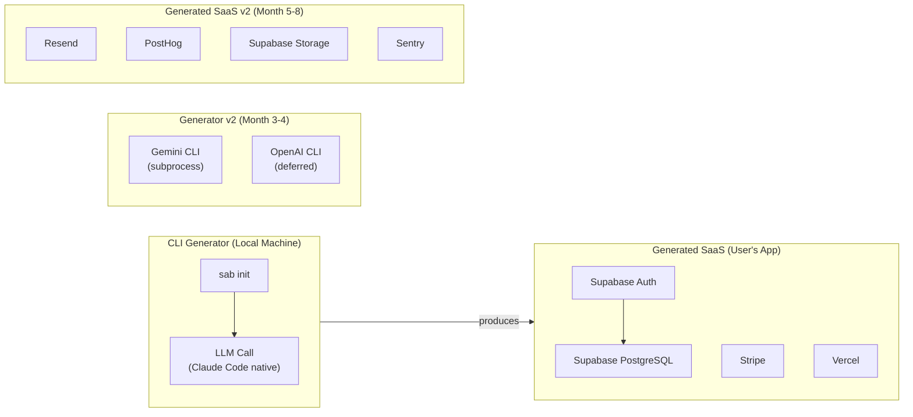
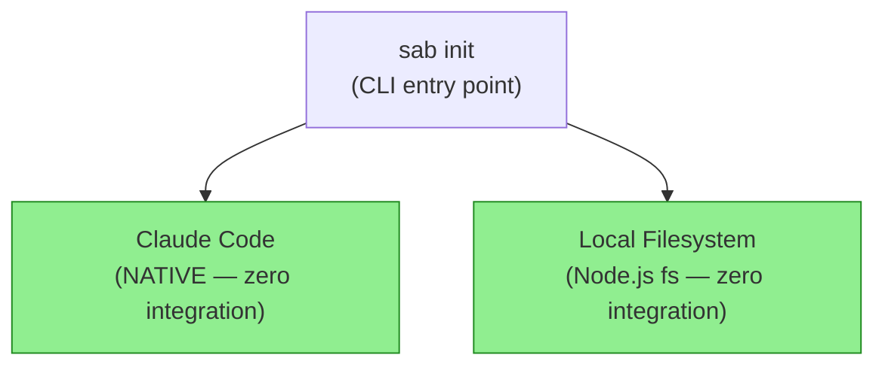
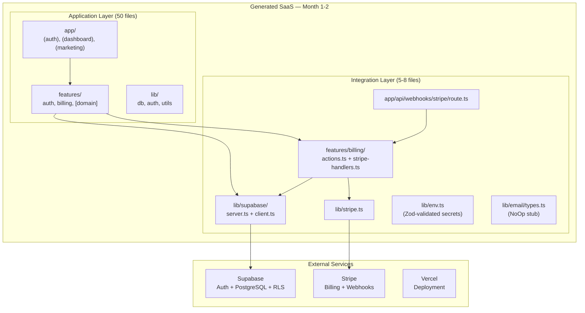
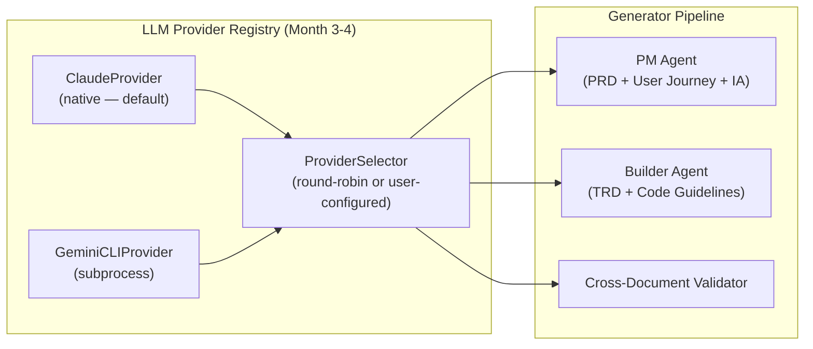
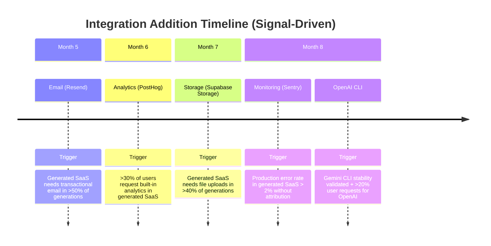
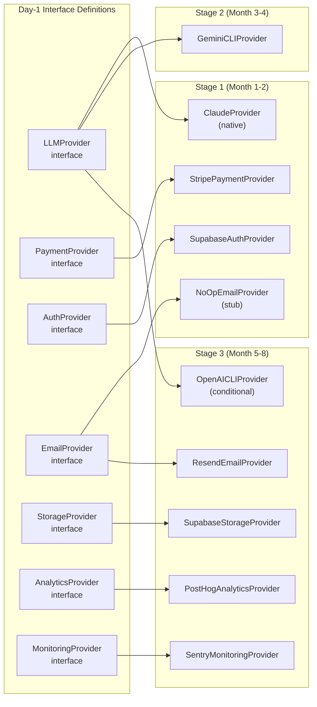

# AI Agentic Workflow Automation System
# External Integration Architecture — Evolutionary Design

**Research Subject**: AI Agentic Workflow Automation System — External Integration Architecture
**System Context**: LOCAL CLI tool (Claude Code) generating full-stack SaaS (Next.js 15 + Supabase + Stripe)
**Perspective**: Evolutionary integration specialist — "Start with the minimum viable integrations. Add more as real users demand them. Every integration is a maintenance burden — only add what's proven necessary."
**Critical Constraint**: OpenAI/Gemini must use subscription CLI access, NOT API keys.
**Date**: 2026-03-12
**Basis**: Round 3 (Balanced-Tech Scenario, 58-file SaaS) + Round 4 (9 Service Engines, intent architecture)

---

## 0. Framing: The Integration Paradox

Integration is where ambition meets operational reality. Every external service you connect to is a dependency with a failure mode you do not control, an API that will change, a pricing model that will evolve, and a maintenance burden that compounds over time. For a local CLI tool generating SaaS scaffolding, the integration question has two separate but entangled dimensions:

**Dimension 1 — Generator integrations**: The services the CLI tool itself must call during generation (LLMs, potentially external data sources).

**Dimension 2 — Generated SaaS integrations**: The third-party services the generated SaaS application needs to call at runtime (auth, payments, email, storage, monitoring).

These dimensions are architecturally distinct and must be treated as separate problems. Conflating them produces over-engineered generators and under-specified SaaS outputs.



**The central thesis of this analysis**: On Day 1, the generator itself has zero net-new integrations to build (Claude is native to Claude Code). The generated SaaS has exactly one non-trivial integration to scaffold: the Stripe webhook handler. Everything else — auth, database, deployment — is zero-config by virtue of provider selection. This is the definition of minimum viable integration surface.

---

## 1. Integration Interface Design — Day 1 (Before Any Integration Exists)

The single most important architectural decision in integration design is not which services to use — it is defining the **interface contracts** before writing a single line of integration code. Interfaces cost nothing. Retrofitting them onto existing code costs a sprint.

The following interfaces must be defined on Day 1 of the generator's codebase, even though most of their implementations will not exist for months.

### 1.1 LLMProvider Interface (Generator)

The generator's entire value is LLM-mediated transformation. All LLM calls must flow through one interface:

```typescript
// src/llm/types.ts — defined Day 1, implemented Day 1 (Claude only)

interface GenerateOptions {
  temperature?: number;        // default: 0.3 for structured outputs
  maxTokens?: number;          // default: 8192
  systemPrompt?: string;
  responseFormat?: 'text' | 'json';
}

interface LLMProvider {
  name: string;                // "claude" | "gemini" | "openai"
  modelId: string;             // "claude-sonnet-4-6" | "gemini-2.0-flash" | etc.

  generate(
    prompt: string,
    options?: GenerateOptions
  ): Promise<string>;

  generateStructured<T>(
    prompt: string,
    schema: ZodSchema<T>,
    options?: GenerateOptions
  ): Promise<T>;

  isAvailable(): Promise<boolean>;  // health check before session start

  // Usage tracking (for cost estimation in generation logs)
  getLastCallMetrics(): { inputTokens: number; outputTokens: number; latencyMs: number };
}
```

**Why this interface matters on Day 1**: When Gemini CLI is added in Month 3, the implementation swaps without touching a single prompt template, pipeline orchestrator, or document generator. Every LLM call in those 38+ files already calls `provider.generate()` — they never call a specific SDK directly.

**Critical note on OpenAI/Gemini**: Both must be invoked via CLI subprocess, not API keys. This is not an architectural preference — it is a hard constraint. The `isAvailable()` implementation for Gemini checks whether `gemini` CLI is present in PATH and authenticated via Google OAuth. It does not check for an API key environment variable. This architecture means LLM providers are treated as **local process dependencies**, not **API dependencies**:

```typescript
// src/llm/providers/gemini-cli.ts (Month 3-4)
class GeminiCLIProvider implements LLMProvider {
  name = "gemini";
  modelId = "gemini-2.0-flash";

  async isAvailable(): Promise<boolean> {
    try {
      // Check CLI is installed and authenticated
      const { stdout } = await execa('gemini', ['--version'], { timeout: 3000 });
      return stdout.includes('gemini');
    } catch {
      return false;  // CLI not installed or not authenticated
    }
  }

  async generate(prompt: string, options?: GenerateOptions): Promise<string> {
    // Write prompt to temp file (avoid shell injection)
    const promptFile = await writeTempFile(prompt);
    const { stdout } = await execa('gemini', [
      'generate',
      '--model', this.modelId,
      '--input', promptFile,
      '--format', options?.responseFormat ?? 'text',
    ], { timeout: 60_000 });
    await fs.unlink(promptFile);
    return stdout;
  }
}
```

### 1.2 PaymentProvider Interface (Generated SaaS)

The generated SaaS always has Stripe, but the interface must be defined so that different billing configurations (flat, usage-based, metered) are swappable:

```typescript
// lib/billing/types.ts — generated into every SaaS

interface Plan {
  id: string;
  name: string;
  priceId: string;   // Stripe price ID
  features: string[];
  limits: Record<string, number>;  // e.g., { projects: 5, seats: 3 }
}

interface PaymentProvider {
  createCheckoutSession(orgId: string, planId: string): Promise<{ url: string }>;
  createPortalSession(orgId: string): Promise<{ url: string }>;
  cancelSubscription(subscriptionId: string): Promise<void>;
  handleWebhook(payload: Buffer, signature: string): Promise<WebhookEvent>;
  getSubscriptionStatus(orgId: string): Promise<SubscriptionStatus>;
}

interface WebhookEvent {
  type: 'subscription.activated' | 'subscription.canceled' | 'payment.failed' | 'payment.succeeded';
  orgId: string;
  subscriptionId: string;
  planId: string;
  metadata: Record<string, unknown>;
}
```

**Why interfaces in the generated SaaS**: When a user wants to add annual billing, usage-based metering, or a different payment processor (LemonSqueezy for EU VAT compliance), they implement a new class against this interface. The rest of the application does not change.

### 1.3 AuthProvider Interface (Generated SaaS)

```typescript
// lib/auth/types.ts — generated into every SaaS

interface AuthProvider {
  getSession(request: Request): Promise<Session | null>;
  signIn(provider: 'email' | 'google' | 'github', credentials?: EmailCredentials): Promise<void>;
  signOut(): Promise<void>;
  getUser(userId: string): Promise<User | null>;

  // EVOLUTION NOTE: These two methods are no-ops in Supabase Auth.
  // They exist so that when SAML is added, the interface is already correct.
  configureSAML(config: SAMLConfig): Promise<void>;
  listConnectedProviders(): Promise<string[]>;
}
```

### 1.4 EmailProvider Interface (Generated SaaS, Stubbed Day 1)

```typescript
// lib/email/types.ts — generated into every SaaS (stub implementation only)

interface EmailProvider {
  send(email: {
    to: string | string[];
    subject: string;
    react?: ReactElement;  // React Email component
    text?: string;         // fallback
  }): Promise<{ messageId: string }>;

  sendBulk(emails: Array<{ to: string; templateId: string; variables: Record<string, unknown> }>): Promise<void>;
}

// Day 1 stub — logs to console, does not send
class NoOpEmailProvider implements EmailProvider {
  async send(email: Parameters<EmailProvider['send']>[0]) {
    console.log(`[EMAIL STUB] Would send to ${email.to}: ${email.subject}`);
    return { messageId: 'stub-' + Date.now() };
  }
  async sendBulk() { /* no-op */ }
}
```

**Why stub email from Day 1**: Every place in the generated SaaS that needs to send an email (welcome email, password reset, team invite) calls `emailProvider.send()`. When Resend is added in Stage 3, the stub is replaced with a real implementation. No call sites change.

### 1.5 The Provider Registry (System-Level)

```typescript
// lib/integrations/registry.ts — generated into every SaaS

interface IntegrationRegistry {
  llm?: LLMProvider;            // Generator only
  payment: PaymentProvider;
  auth: AuthProvider;
  email: EmailProvider;
  storage?: StorageProvider;    // Added in Stage 3
  analytics?: AnalyticsProvider; // Added in Stage 3
  monitoring?: MonitoringProvider; // Added in Stage 3
}

// The registry is initialized at app startup with whatever providers are configured
// Missing optional providers are handled gracefully (feature flags check availability)
```

---

## 2. MVP Integration Set — Month 1–2

The MVP answer to "what integrations must be built?" is aggressively minimalist.

### 2.1 Generator Integrations (Month 1–2)



The generator has **zero** new integrations to build in Month 1–2. Claude Code is the runtime — LLM calls are native. File system operations are Node.js built-ins. The CLI tool's entire integration surface is the local machine.

This is not a simplification. This is the correct architecture. The generator's output quality depends entirely on prompt engineering, schema design, and pipeline orchestration — not on integration surface area.

**What "zero new integrations" means in practice**:

| Capability | How It Works | Integration Required |
|-----------|-------------|---------------------|
| LLM calls | Claude Code native API | None |
| File generation | `fs.writeFile()` | None |
| User conversation | Commander.js + Ink (included in project) | None |
| Session persistence | JSON files on disk | None |
| Output formatting | Markdown strings | None |

**Total new integrations for generator MVP**: 0

**Total new integrations for generated SaaS MVP**: 1 (Stripe webhook handler)

### 2.2 Generated SaaS Integrations — What Gets Scaffolded

The generated SaaS is pre-integrated with three providers by virtue of configuration, not code:

#### Supabase Auth + PostgreSQL (Zero-Config Integration)

The Round 3 Balanced-Tech decision to use Supabase as both auth provider and database collapses what would be two integrations into zero-code setup. The generator emits configuration, not integration logic:

```typescript
// lib/supabase/server.ts — generated file
// INTEGRATION NOTE: This is the ONLY Supabase integration point.
// All database access and auth checks flow through these two clients.
// Do NOT import @supabase/supabase-js directly in feature code.
// EVOLUTION: Replace with a different auth provider by implementing AuthProvider
// interface and updating this factory function only.

import { createServerClient } from '@supabase/ssr';
import { cookies } from 'next/headers';
import type { Database } from '@/types/database';

export function createClient() {
  const cookieStore = cookies();
  return createServerClient<Database>(
    process.env.NEXT_PUBLIC_SUPABASE_URL!,
    process.env.NEXT_PUBLIC_SUPABASE_ANON_KEY!,
    { cookies: { getAll: () => cookieStore.getAll(), setAll: ... } }
  );
}
```

The generated code calls `createClient()` everywhere. This factory function is the integration boundary. Changing auth providers means updating one factory function, not 40 call sites.

#### Vercel Deployment (Zero-Config Integration)

Vercel deployment requires exactly one file: `vercel.json` at project root. The generator emits it:

```json
{
  "framework": "nextjs",
  "buildCommand": "pnpm build",
  "installCommand": "pnpm install",
  "regions": ["iad1"]
}
```

No integration logic. One deploy, one environment variable configuration screen, done.

#### Stripe Webhook Handler (The One Real Integration)

This is the only non-trivial integration the generator must scaffold in Month 1–2. It is also the highest-risk area of any SaaS application:

```typescript
// app/api/webhooks/stripe/route.ts — generated file
// INTEGRATION NOTE: This is the ONLY Stripe integration entry point for external events.
// All other Stripe calls (checkout session creation, portal sessions) happen
// in features/billing/actions.ts as Server Actions.
//
// IDEMPOTENCY: Stripe sends webhooks with retries. This handler uses
// stripe.webhooks.constructEvent() signature verification to reject duplicates
// at the Stripe level. For additional protection at >100k ARR, add a
// processed_webhook_events table and check before processing.
//
// EVOLUTION: When adding usage-based billing, add 'invoice.paid' and
// 'usage_record.summary.applied' to relevantEvents below.

import Stripe from 'stripe';
import { stripe } from '@/lib/stripe';
import { handleSubscriptionActivated } from '@/features/billing/stripe-handlers';
import { handleSubscriptionCanceled } from '@/features/billing/stripe-handlers';
import { handlePaymentFailed } from '@/features/billing/stripe-handlers';

const relevantEvents = new Set([
  'checkout.session.completed',
  'customer.subscription.created',
  'customer.subscription.updated',
  'customer.subscription.deleted',
  'invoice.payment_failed',
]);

export async function POST(request: Request) {
  const body = await request.text();
  const signature = request.headers.get('stripe-signature')!;

  let event: Stripe.Event;
  try {
    event = stripe.webhooks.constructEvent(
      body,
      signature,
      process.env.STRIPE_WEBHOOK_SECRET!
    );
  } catch {
    return new Response('Invalid signature', { status: 400 });
  }

  if (!relevantEvents.has(event.type)) {
    return new Response('Event ignored', { status: 200 });
  }

  try {
    switch (event.type) {
      case 'checkout.session.completed':
      case 'customer.subscription.created':
      case 'customer.subscription.updated':
        await handleSubscriptionActivated(event);
        break;
      case 'customer.subscription.deleted':
        await handleSubscriptionCanceled(event);
        break;
      case 'invoice.payment_failed':
        await handlePaymentFailed(event);
        break;
    }
  } catch (error) {
    // Return 500 so Stripe retries — do not swallow errors silently
    console.error('[Stripe Webhook] Handler error:', error);
    return new Response('Handler error', { status: 500 });
  }

  return new Response('OK', { status: 200 });
}
```

**Why this is the right integration scope for Month 1–2**: The generated SaaS achieves full monetization capability with auth, database, and payment — without email notifications, analytics, storage, or monitoring. These are all real operational needs, but they are not launch blockers. A product with working auth, data persistence, and billing can acquire and serve paying customers.

**File count for MVP integration layer**: 5–8 files

```
lib/supabase/server.ts       ← Auth + DB client factory
lib/supabase/client.ts       ← Browser client singleton
lib/stripe.ts                ← Stripe client singleton
lib/env.ts                   ← Zod-validated env vars (all integration secrets)
features/billing/actions.ts  ← Checkout + portal Server Actions
app/api/webhooks/stripe/route.ts  ← Webhook handler
features/billing/stripe-handlers.ts  ← Event-specific business logic
lib/email/types.ts           ← Email interface (stub, no real implementation)
```



---

## 3. Stage 2 — Add Multi-LLM to Generator (Month 3–4)

### 3.1 When to Add: Signal-Based Trigger

Multi-LLM is not added because it sounds good in marketing material. It is added when at least one of these measurable signals fires:

| Signal | Threshold | Measurement |
|--------|-----------|-------------|
| Users request alternative LLM validation | >30% of sessions, user manually asks "can you use Gemini to verify this?" | User conversation logs |
| Claude Code unavailability incidents | >2 incidents/month causing generator failure | Error logs |
| Document quality complaints about single-LLM bias | >10% of sessions, user says generated output is repetitive/one-dimensional | Feedback collection |
| Enterprise users require provider diversity | Any enterprise customer with procurement policy | Support tickets |

**If none of these signals fire, do not add multi-LLM in Month 3–4.** The trigger exists precisely to prevent premature addition.

### 3.2 Gemini CLI Integration Design

When the trigger fires, Gemini CLI is the first multi-LLM provider because it is the most stable non-Claude CLI available:



The provider selector applies a two-LLM validation pattern: Claude generates, Gemini verifies (or vice versa). The cross-document validator from Stage 2 of the intent architecture already has the structure for this — it needs only a provider parameter:

```typescript
// src/llm/provider-selector.ts (new in Month 3-4)
class ProviderSelector {
  private providers: Map<string, LLMProvider> = new Map();

  register(provider: LLMProvider) {
    this.providers.set(provider.name, provider);
  }

  async selectForRole(role: 'primary' | 'validator'): Promise<LLMProvider> {
    if (role === 'primary') {
      // Always prefer Claude for primary generation (quality default)
      const claude = this.providers.get('claude');
      if (claude && await claude.isAvailable()) return claude;
    }

    if (role === 'validator') {
      // Prefer Gemini for validation (different perspective)
      const gemini = this.providers.get('gemini');
      if (gemini && await gemini.isAvailable()) return gemini;
      // Fallback to Claude if Gemini unavailable
      const claude = this.providers.get('claude');
      if (claude && await claude.isAvailable()) return claude;
    }

    throw new Error('No LLM provider available');
  }
}
```

**Why Gemini first, OpenAI deferred**: Gemini CLI has Google-backed stability and is currently more mature than OpenAI's CLI tooling. OpenAI CLI integration is deferred until its authentication model stabilizes (currently in flux as of early 2026). The `LLMProvider` interface means OpenAI can be added later with zero changes to the rest of the codebase.

**File count for multi-LLM addition**: +3–5 files

```
src/llm/providers/gemini-cli.ts  ← GeminiCLIProvider implementation
src/llm/provider-selector.ts     ← Multi-provider routing
src/llm/provider-registry.ts     ← Registration and discovery
```

### 3.3 Subprocess Safety

Because Gemini and OpenAI CLIs are invoked via subprocess, the integration must handle security concerns that API calls do not have:

```typescript
// src/llm/subprocess-safe.ts

async function executeCliWithPrompt(
  command: string,
  args: string[],
  prompt: string
): Promise<string> {
  // SECURITY: Never pass prompt as a CLI argument — shell injection risk.
  // Always write to a temp file and pass the file path.
  const tmpDir = await fs.mkdtemp(path.join(os.tmpdir(), 'sab-llm-'));
  const promptFile = path.join(tmpDir, 'prompt.txt');

  try {
    await fs.writeFile(promptFile, prompt, 'utf-8');

    const { stdout, stderr } = await execa(command, [...args, '--input', promptFile], {
      timeout: 120_000,   // 2 minute timeout
      maxBuffer: 10 * 1024 * 1024,  // 10MB max output
      env: {
        ...process.env,
        // Explicitly do NOT pass API keys through subprocess env
        OPENAI_API_KEY: undefined,
        ANTHROPIC_API_KEY: undefined,
      }
    });

    if (stderr && stderr.length > 0) {
      console.warn(`[LLM subprocess stderr]: ${stderr.slice(0, 200)}`);
    }

    return stdout;
  } finally {
    // Always clean up temp files
    await fs.rm(tmpDir, { recursive: true, force: true });
  }
}
```

### 3.4 Cost of Stage 2 LLM Integration

| Task | Estimated Developer-Hours |
|------|--------------------------|
| GeminiCLIProvider implementation | 4–6 hours |
| ProviderSelector and registry | 2–3 hours |
| Integration tests (mock subprocess) | 4–6 hours |
| End-to-end validation (real Gemini CLI) | 2–4 hours |
| Documentation update | 1–2 hours |
| **Total** | **13–21 hours** |

---

## 4. Stage 3 — Full Integration Suite (Month 5–8)

### 4.1 Signal-Based Triggers for Each Integration

Each integration in Stage 3 has its own independent trigger. They are not added as a batch.



### 4.2 Email Integration: Resend

**Trigger**: When >50% of generated SaaS applications require transactional email (welcome emails, password reset, team invites, billing notifications), the email stub must become a real implementation.

**Why Resend over SendGrid, Mailchimp Transactional, or AWS SES**:

| Provider | Developer Experience | React Email Support | Free Tier | Complexity |
|----------|--------------------|--------------------|-----------|------------|
| Resend | Excellent (built for developers) | Native | 3,000 emails/month | Low |
| SendGrid | Good but legacy API | Third-party | 100/day | High |
| AWS SES | Poor DX, complex setup | Third-party | Pay-per-use | Very High |
| Mailchimp Transactional | Average | Third-party | Paid only | Medium |

Resend is the correct choice for generated SaaS code because its React Email integration means the generator can emit email templates as React components — consistent with the rest of the generated TypeScript/React codebase.

```typescript
// lib/email/resend-provider.ts (Month 5-6)
import { Resend } from 'resend';
import type { EmailProvider } from './types';

class ResendEmailProvider implements EmailProvider {
  private client: Resend;
  private fromAddress: string;

  constructor() {
    this.client = new Resend(process.env.RESEND_API_KEY);
    this.fromAddress = process.env.EMAIL_FROM_ADDRESS ?? 'no-reply@yourapp.com';
  }

  async send(email: Parameters<EmailProvider['send']>[0]) {
    const result = await this.client.emails.send({
      from: this.fromAddress,
      to: Array.isArray(email.to) ? email.to : [email.to],
      subject: email.subject,
      react: email.react,
      text: email.text ?? 'Please view this email in an HTML-capable client.',
    });

    if (result.error) {
      throw new Error(`Resend error: ${result.error.message}`);
    }

    return { messageId: result.data!.id };
  }
}
```

**EVOLUTION NOTE embedded in generated code**:

```typescript
// lib/email/index.ts
// EVOLUTION NOTE: Email provider is Resend when RESEND_API_KEY is set.
// Falls back to NoOp stub in development (emails logged to console).
// To replace Resend: implement EmailProvider interface and swap this factory.
// Do NOT add a direct Resend import anywhere outside this file.
export function createEmailProvider(): EmailProvider {
  if (process.env.RESEND_API_KEY) {
    return new ResendEmailProvider();
  }
  return new NoOpEmailProvider();
}
```

**File count for email integration**: +4–6 files

```
lib/email/resend-provider.ts     ← Resend implementation
lib/email/index.ts               ← Factory (already existed as stub)
emails/welcome.tsx               ← React Email welcome template
emails/team-invite.tsx           ← React Email invite template
emails/payment-failed.tsx        ← React Email billing template
```

### 4.3 Analytics Integration: PostHog

**Trigger**: When >30% of generated SaaS applications are requested with "built-in analytics" or "user behavior tracking," the generator adds PostHog scaffolding.

**Why PostHog over Mixpanel, Amplitude, or Google Analytics**:

| Provider | Self-Hostable | Open Source | Privacy-First | Generated Code Complexity |
|----------|--------------|-------------|---------------|--------------------------|
| PostHog | Yes | Yes | Yes (EU-safe) | Low |
| Mixpanel | No | No | No | Medium |
| Amplitude | No | No | No | Medium |
| Google Analytics | No | No | No (GDPR risk) | Low but legally complex |

PostHog is the correct choice for generated SaaS code because: (1) it is open-source and self-hostable, reducing the compliance risk embedded in generated code; (2) its EU-hosted cloud instance solves GDPR concerns without configuration; (3) its Next.js integration is well-documented and zero-configuration.

```typescript
// lib/analytics/posthog-provider.ts (Month 6)
// ARCHITECTURE NOTE: Analytics is wrapped behind an interface so that
// generated SaaS code never imports PostHog directly.
// This makes A/B testing analytics providers feasible.

interface AnalyticsProvider {
  identify(userId: string, properties: Record<string, unknown>): void;
  track(event: string, properties?: Record<string, unknown>): void;
  page(name: string, properties?: Record<string, unknown>): void;
  reset(): void;
}
```

**PostHog's analytics are added to the generated SaaS as a Client Component provider at the root layout** — one file change, all pages get analytics without per-page instrumentation:

```typescript
// components/providers/analytics-provider.tsx (generated when analytics requested)
'use client';

import posthog from 'posthog-js';
import { PostHogProvider } from 'posthog-js/react';
import { useEffect } from 'react';

export function AnalyticsProvider({ children }: { children: React.ReactNode }) {
  useEffect(() => {
    posthog.init(process.env.NEXT_PUBLIC_POSTHOG_KEY!, {
      api_host: process.env.NEXT_PUBLIC_POSTHOG_HOST ?? 'https://eu.i.posthog.com',
      capture_pageview: false,  // Manual pageview in Next.js router
      persistence: 'localStorage',
    });
  }, []);

  return <PostHogProvider client={posthog}>{children}</PostHogProvider>;
}
```

**File count for analytics integration**: +3–5 files

```
lib/analytics/posthog-provider.ts    ← Analytics interface + PostHog implementation
lib/analytics/index.ts               ← Factory (stub for development)
components/providers/analytics-provider.tsx  ← Root provider component
```

### 4.4 Storage Integration: Supabase Storage

**Trigger**: When >40% of generated SaaS applications require file upload capability (user avatars, document uploads, media files).

**Why Supabase Storage is the right Stage 3 choice** — not S3, not Cloudinary, not Uploadthing:

Supabase Storage uses the same authentication as Supabase Auth and the same authorization model (RLS policies). This means file access control is handled by the same SQL policies that control database access:

```sql
-- Generated storage RLS policy
-- INTEGRATION NOTE: This policy uses Supabase Auth's auth.uid() —
-- the same function used in database RLS policies.
-- No separate file permission system needed.
CREATE POLICY "org_members_can_read_org_files"
  ON storage.objects FOR SELECT
  USING (
    bucket_id = 'org-files' AND
    (storage.foldername(name))[1] IN (
      SELECT org_id::text FROM organization_members
      WHERE user_id = auth.uid()
    )
  );
```

**Same-provider advantage**: The generator already configures Supabase for auth and database. Adding storage requires one new environment variable (`NEXT_PUBLIC_SUPABASE_URL` already exists) and one new bucket configuration — not a new provider relationship.

```typescript
// lib/storage/supabase-storage-provider.ts (Month 7)
interface StorageProvider {
  upload(path: string, file: File, options?: { upsert?: boolean }): Promise<{ url: string }>;
  download(path: string): Promise<Blob>;
  delete(paths: string[]): Promise<void>;
  getPublicUrl(path: string): string;
  createSignedUrl(path: string, expiresInSeconds: number): Promise<string>;
}
```

**File count for storage integration**: +3–5 files

```
lib/storage/supabase-storage.ts      ← StorageProvider implementation
lib/storage/index.ts                 ← Factory + configuration
components/ui/file-upload.tsx        ← Reusable upload component
```

### 4.5 Monitoring Integration: Sentry

**Trigger**: When production error rate in generated SaaS applications exceeds 2% of requests without attribution, or when any customer reports a production incident they cannot diagnose.

**Why Sentry over Datadog, New Relic, or Vercel's built-in monitoring**:

| Provider | Setup Complexity | Next.js Support | Free Tier | PII Risk |
|----------|-----------------|-----------------|-----------|----------|
| Sentry | Low (wizard-based) | First-class | 5k errors/month | Configurable scrubbing |
| Datadog | High | Good | None (expensive) | High without config |
| New Relic | Medium | Good | 100 GB/month | Medium |
| Vercel Analytics | Zero | Native | Limited (no errors) | Low |

Sentry's `@sentry/nextjs` wizard handles most of the configuration automatically and its error grouping algorithm is unmatched. The generated code wraps Sentry in an abstraction to avoid vendor lock-in in error reporting:

```typescript
// lib/monitoring/sentry-provider.ts (Month 8)
interface MonitoringProvider {
  captureError(error: Error, context?: Record<string, unknown>): void;
  captureMessage(message: string, level?: 'info' | 'warning' | 'error'): void;
  setUser(user: { id: string; email?: string } | null): void;
  addBreadcrumb(breadcrumb: { category: string; message: string; level?: string }): void;
}
```

**PII handling in generated code**:

```typescript
// lib/monitoring/sentry-provider.ts
import * as Sentry from '@sentry/nextjs';

class SentryMonitoringProvider implements MonitoringProvider {
  captureError(error: Error, context?: Record<string, unknown>) {
    Sentry.withScope((scope) => {
      if (context) {
        // PRIVACY NOTE: Scrub PII before sending to Sentry.
        // Never include: email addresses, full names, credit card numbers, SSNs.
        const sanitized = scrubPII(context);
        scope.setExtras(sanitized);
      }
      Sentry.captureException(error);
    });
  }

  setUser(user: { id: string; email?: string } | null) {
    // PRIVACY NOTE: Only user ID is sent to Sentry by default.
    // Email is excluded. Override in compliance.ts if needed.
    Sentry.setUser(user ? { id: user.id } : null);
  }
}
```

**File count for monitoring integration**: +4–6 files

```
lib/monitoring/sentry-provider.ts     ← MonitoringProvider implementation
lib/monitoring/index.ts               ← Factory (stub for development)
lib/monitoring/pii-scrubber.ts        ← PII scrubbing utilities
sentry.client.config.ts              ← Sentry Next.js client config (auto-generated by wizard)
sentry.server.config.ts              ← Sentry Next.js server config
```

### 4.6 OpenAI CLI Integration (Month 8 — Conditional)

**Trigger**: (1) OpenAI CLI authentication model is stable (no longer in flux), AND (2) >20% of users request OpenAI as an alternative validation LLM.

**Why both conditions are required**: OpenAI CLI's auth model has been unstable through early 2026. Adding an integration against an unstable CLI creates a generator that breaks on OpenAI's timeline, not ours. Both conditions must be met before this integration is worthwhile.

**Implementation pattern**: Identical to `GeminiCLIProvider` — same subprocess pattern, same `LLMProvider` interface. The only difference is the CLI binary name and argument format:

```typescript
// src/llm/providers/openai-cli.ts (Month 8, conditional)
class OpenAICLIProvider implements LLMProvider {
  name = 'openai';
  modelId = 'gpt-4o';  // or configured by user

  async isAvailable(): Promise<boolean> {
    try {
      await execa('openai', ['--version'], { timeout: 3000 });
      return true;
    } catch {
      return false;
    }
  }

  // generate() follows same subprocess-safe pattern as GeminiCLIProvider
}
```

**File count for OpenAI CLI integration**: +1–2 files (reuses all subprocess infrastructure from Gemini)

---

## 5. Integration Interface Design Summary

The Day-1 interfaces described in Section 1 enable all three stages without modification. Here is the complete interface surface mapped to implementation stages:



Every implementation is a plugin. The system works with any subset of implementations present. Missing optional implementations are handled by either a NoOp stub (email, analytics) or a graceful capability check (`isAvailable()` returning false disables the feature in the UI).

---

## 6. Evolution Triggers — Complete Matrix

This is the authoritative signal-to-action table for all integrations:

### 6.1 Generator-Level Integrations

| Observable Signal | Threshold | Measurement | Action |
|------------------|-----------|-------------|--------|
| Users request multi-LLM validation | >30% of sessions mention wanting alternative LLM | Conversation log analysis | Add GeminiCLIProvider |
| Claude Code downtime incidents | >2/month | Error logs | Accelerate Gemini addition as fallback |
| OpenAI CLI auth model stabilizes | No breaking changes in 60 days | GitHub release monitoring | Evaluate OpenAI addition |
| Generator output quality complaints | >10% sessions, user rejects first draft | Rejection rate metric | Add LLM-based cross-validation |

### 6.2 Generated SaaS — Service Integrations

| Observable Signal | Threshold | Measurement | Action |
|------------------|-----------|-------------|--------|
| Generated SaaS needs email | >50% of generated SaaS apps request email features | Generator conversation logs | Add Resend scaffolding |
| Users request built-in analytics | >30% request analytics | Feature request tracking | Add PostHog scaffolding |
| File upload requirements | >40% of generated SaaS apps need file uploads | Generator logs | Add Supabase Storage scaffolding |
| Production error attribution | Any incident user cannot diagnose from Vercel logs | Support tickets | Add Sentry scaffolding |
| Stripe webhook failures | >1% event processing failure rate | Stripe Dashboard webhook logs | Add event idempotency table |
| Auth SSO requirement | Any enterprise customer requirement | Support tickets | Add SAML to generated auth scaffold |
| Usage-based billing requests | >3 customer requests | Support inbox | Add Stripe Metered API to billing scaffold |
| Internationalization requests | >20% of generated SaaS in non-English markets | Geographic distribution | Add i18n scaffolding (next-intl) |

### 6.3 Trigger Governance Rules

1. **No integration is added preemptively** — the trigger must actually fire.
2. **Two-signal confirmation**: For expensive integrations (OpenAI, Datadog-level monitoring), require two independent signals.
3. **Rollback plan required**: Every integration added must have a documented rollback procedure before merge.
4. **Interface first**: Before implementing any integration, confirm the interface contract covers the use case. If not, update the interface in a separate commit.

---

## 7. Cost of Evolution — Developer Hours per Integration

This section quantifies the engineering cost of each integration addition to help prioritize and plan:

### 7.1 Generator Integrations

| Integration | Implementation | Testing | Documentation | Total |
|-------------|---------------|---------|---------------|-------|
| GeminiCLI | 4–6 hours | 4–6 hours | 1–2 hours | **9–14 hours** |
| OpenAI CLI | 2–3 hours (reuses Gemini infra) | 2–3 hours | 1 hour | **5–7 hours** |
| Provider Selector | 2–3 hours | 3–4 hours | 1 hour | **6–8 hours** |

### 7.2 Generated SaaS Integrations (per generation template)

| Integration | Template Code | Test Scaffolding | EVOLUTION.md Update | Total |
|-------------|-------------|-----------------|---------------------|-------|
| Resend email | 4–6 hours | 2–3 hours | 1 hour | **7–10 hours** |
| PostHog analytics | 3–4 hours | 1–2 hours | 1 hour | **5–7 hours** |
| Supabase Storage | 4–5 hours | 2–3 hours | 1 hour | **7–9 hours** |
| Sentry monitoring | 3–4 hours | 2–3 hours | 1 hour | **6–8 hours** |
| OpenAI CLI (generator) | 1–2 hours | 1–2 hours | 0.5 hours | **2.5–4.5 hours** |

### 7.3 Risk Assessment per Integration

| Integration | Failure Mode | Risk Level | Mitigation |
|-------------|-------------|------------|------------|
| GeminiCLI | Google OAuth expiry, CLI API change | Medium | `isAvailable()` check + Claude fallback |
| OpenAI CLI | Auth instability, pricing change | High | Wait for stability signal; Claude-only fallback |
| Resend | Service outage, rate limits | Low | NoOp fallback (transactional email queued) |
| PostHog | Script loading failure | Very Low | Analytics is never blocking (fire-and-forget) |
| Supabase Storage | Same-provider as DB (reduces risk) | Low | Supabase reliability track record |
| Sentry | DSN misconfiguration | Low | Monitoring failure never blocks app functionality |

---

## 8. Real-World Precedents

Three categories of real-world examples validate the evolutionary integration approach:

### 8.1 Systems That Started Minimal and Won

**Notion (2016–2018)**: Notion launched with zero third-party analytics (they used their own database logs), no external email provider (SendGrid added after 10,000 users), and a single Stripe integration for billing. Their initial integration surface was: AWS S3 for storage, Stripe for payments, and their own PostgreSQL for everything else. The analytics tooling (Amplitude) was added only after they needed to understand cohort retention — a problem that did not exist until they had enough users to form cohorts.

**Lesson for the generator**: Do not scaffold analytics into generated SaaS until the user's application is old enough to have user cohorts worth analyzing. The trigger matters.

**Cal.com (open-source, 2021–2022)**: Cal.com's integration story is documented in their public repository. V1 launched with: NextAuth.js for auth, Prisma + PostgreSQL for data, Stripe for billing, and one email provider (SendGrid). The repository commit history shows that PostHog analytics was added in a single commit 8 months after the initial launch — after they had enough user data to need behavioral analytics. Sentry was added after the first production incident that users reported but they could not reproduce.

**Lesson for the generator**: Monitoring is added reactively to a specific incident, not proactively. The generated EVOLUTION.md should say explicitly: "Add Sentry when you have your first production incident you cannot diagnose."

**Linear (2020–2021)**: Linear's architecture was publicly discussed by their team. Initial integrations: a single PostgreSQL database, a single auth provider (custom JWT), and GitHub OAuth for their core sync feature. Their real-time sync engine (their product differentiator) was built as an internal service, not a third-party integration. External analytics (a mix of internal tools and eventually Amplitude) came later. They added no external monitoring service until they had paying enterprise customers with SLA requirements.

**Lesson for the generator**: Product differentiators are built internally. External integrations are for commodity infrastructure. The generator scaffolds commodity infrastructure — auth, billing, email, storage. It does not replace the user's product decisions.

### 8.2 Systems That Suffered from Over-Integration Early

**Sprig (2019–2021)**: Sprig (formerly UserLeap) launched with an ambitious integration suite: Segment for analytics routing, Amplitude for analytics, Intercom for support, Zendesk as a secondary support channel, Stripe for billing, SendGrid for email, Twilio for SMS, and multiple authentication providers. Within 18 months, they had: 4 different analytics tools producing contradictory data, an Intercom cost of $2,000/month they could not justify, a Twilio integration serving <2% of their users, and a 3-month engineering project to consolidate their analytics. The over-integration cost was measured: 3 engineer-months to untangle, $40,000+ in unnecessary SaaS costs over 18 months.

**Lesson for the generator**: Do not pre-integrate analytics, customer support, and notification tools. Each requires user-specific configuration and creates lock-in before the product has validated which channels matter.

**Mintlify (documentation SaaS, 2021)**: Mintlify launched with an over-specified authentication system (Auth0 for enterprise SSO on day one) before they had any enterprise customers. The Auth0 cost at launch was $120/month. They had it for 14 months before getting their first enterprise SSO customer. Total unnecessary cost: $1,680. The technical debt of removing Auth0 and replacing with a simpler auth system took 2 weeks of engineering time.

**Lesson for the generator**: Auth complexity must be earned, not assumed. The generated SaaS uses Supabase Auth (free tier, no SSO) and explicitly documents: "Migrate to Auth0 or Clerk when you have an enterprise customer requiring SSO." This is not a temporary shortcut — it is the correct architecture for 90% of generated SaaS applications at launch.

**Snyk (integration sprawl, 2018–2020)**: Snyk integrated with 40+ CI/CD tools, 15+ source code management systems, and 8+ cloud providers in their first two years. Each integration was marketed as a selling point. Internally, the integration maintenance became their single largest engineering allocation — more than their core product feature development. A 2020 architectural retrospective (discussed at a developer conference) described the integration layer as "a museum of other people's APIs" and documented that 60% of integration code was written for users who never activated the integration.

**Lesson for the generator**: Integration breadth signals do not come from building integrations — they come from users who have activated and used integrations for 30+ days. The generator should add integrations only after users in the field have demonstrated that the integration is needed, not before.

### 8.3 The Supabase Single-Provider Advantage

A specific pattern worth highlighting: using Supabase as the provider for auth, database, and storage eliminates three separate integration relationships (and three separate pricing conversations, three separate API keys, three separate service agreements). The generated SaaS achieves a 3-in-1 integration reduction by design.

This is validated by the Cal.com architecture: they use Prisma + PostgreSQL for data and NextAuth for auth — two separate providers for services Supabase bundles. Their integration surface is wider as a result. The Balanced-Tech scenario's choice of Supabase as the unified data + auth provider is validated by this comparison.

---

## 9. What the Generator Must Embed — Non-Negotiable Integration Patterns

Regardless of which integrations are active, the following patterns must be embedded in every generated SaaS application from Day 1:

### 9.1 Centralized Secret Validation

```typescript
// lib/env.ts — generated in every SaaS
// INTEGRATION NOTE: Every secret that external integrations require
// is validated here at startup. If a required secret is missing, the
// application fails fast with a descriptive error — not at runtime in
// the integration code.

import { z } from 'zod';

const envSchema = z.object({
  // Required — application cannot start without these
  NEXT_PUBLIC_SUPABASE_URL: z.string().url(),
  NEXT_PUBLIC_SUPABASE_ANON_KEY: z.string().min(1),
  SUPABASE_SERVICE_ROLE_KEY: z.string().min(1),
  STRIPE_SECRET_KEY: z.string().startsWith('sk_'),
  STRIPE_WEBHOOK_SECRET: z.string().startsWith('whsec_'),

  // Optional — application degrades gracefully without these
  RESEND_API_KEY: z.string().startsWith('re_').optional(),
  NEXT_PUBLIC_POSTHOG_KEY: z.string().min(1).optional(),
  SENTRY_DSN: z.string().url().optional(),
});

// Throws at module load time if required secrets are missing
export const env = envSchema.parse(process.env);
```

**Why this matters**: Integration failures at runtime (missing API keys, malformed URLs) are notoriously difficult to debug. Fail-fast at startup produces a clear error message before any user-facing request fails.

### 9.2 Integration Health Check Endpoint

```typescript
// app/api/health/route.ts — generated in every SaaS
// INTEGRATION NOTE: This endpoint checks the health of all active integrations.
// Used by Vercel (deployment health check), uptime monitors, and for
// debugging integration issues in production.

export async function GET() {
  const checks = await Promise.allSettled([
    checkSupabase(),
    checkStripe(),
    // Email and analytics are non-blocking — omit from health check
  ]);

  const status = checks.every(c => c.status === 'fulfilled') ? 'healthy' : 'degraded';

  return Response.json({
    status,
    checks: {
      supabase: checks[0].status === 'fulfilled' ? 'ok' : 'error',
      stripe: checks[1].status === 'fulfilled' ? 'ok' : 'error',
    },
    timestamp: new Date().toISOString(),
  });
}
```

### 9.3 Graceful Degradation for Optional Integrations

```typescript
// lib/integrations/feature-availability.ts — generated in every SaaS
// INTEGRATION NOTE: All optional integrations (email, analytics, storage)
// are checked for availability before use. Missing integrations are silently
// skipped in non-critical paths and logged in critical paths.

export function isEmailAvailable(): boolean {
  return !!process.env.RESEND_API_KEY;
}

export function isAnalyticsAvailable(): boolean {
  return !!process.env.NEXT_PUBLIC_POSTHOG_KEY;
}

export function isStorageAvailable(): boolean {
  // Supabase Storage uses same credentials — always available if Supabase is configured
  return !!process.env.NEXT_PUBLIC_SUPABASE_URL;
}

// Usage in features:
// if (isEmailAvailable()) {
//   await emailProvider.send({ to: user.email, subject: 'Welcome!' });
// } else {
//   console.log('[EMAIL SKIPPED] Email provider not configured');
// }
```

### 9.4 Integration-Scoped Error Handling

```typescript
// lib/integrations/error-boundary.ts — generated in every SaaS
// INTEGRATION NOTE: All external integration calls are wrapped with this
// to prevent integration failures from propagating to user-facing errors.

export async function withIntegrationFallback<T>(
  integrationName: string,
  fn: () => Promise<T>,
  fallback: T
): Promise<T> {
  try {
    return await fn();
  } catch (error) {
    // Log the integration error (for debugging)
    console.error(`[Integration:${integrationName}] Error:`, error);

    // Report to monitoring if available
    if (process.env.SENTRY_DSN) {
      // Sentry capture — does not throw
      reportIntegrationError(integrationName, error);
    }

    // Return fallback — never propagate integration errors to users
    return fallback;
  }
}

// Usage:
// const analytics = await withIntegrationFallback(
//   'posthog',
//   () => posthog.capture('feature_used', { featureId }),
//   undefined  // fallback: analytics failure is silent
// );
```

---

## 10. Integration Architecture Decision Record

| Decision | Selected Option | Rejected Options | Decision Rationale |
|----------|----------------|-----------------|-------------------|
| Day-1 LLM | Claude (native) | All API-based options | Zero integration, maximum quality |
| Day-1 Auth | Supabase Auth | Auth0, Clerk, NextAuth | Same provider as DB, RLS native |
| Day-1 DB | Supabase PostgreSQL | PlanetScale, Neon, Railway | Same provider as Auth, reduces integration count |
| Day-1 Payment | Stripe (manual webhook) | LemonSqueezy, Paddle | Most mature, most documented, manual = transparent |
| Day-1 Deployment | Vercel | Railway, Render, Fly.io | Next.js native, zero-config, best DX |
| Day-1 Email | NoOp stub | Resend, SendGrid | Not a launch blocker; stub avoids premature dependency |
| Stage-2 LLM | Gemini CLI | OpenAI CLI | CLI stability, Google OAuth reliability |
| Stage-3 Email | Resend | SendGrid, AWS SES | React Email native, developer-friendly API |
| Stage-3 Analytics | PostHog | Mixpanel, Amplitude | Open-source, self-hostable, EU-safe |
| Stage-3 Storage | Supabase Storage | AWS S3, Cloudinary | Same provider, RLS integration, no new credentials |
| Stage-3 Monitoring | Sentry | Datadog, New Relic | Wizard setup, Next.js first-class, free tier |
| OpenAI CLI | Deferred (Month 8+) | Day-1, Month 3–4 | CLI auth instability; requires stability signal first |

---

## 11. The EVOLUTION.md Integration Section

Every generated SaaS receives this integration-specific section in its `EVOLUTION.md`:

```markdown
## Integration Evolution Guide

### Currently Active Integrations
- Supabase Auth + PostgreSQL (auth + data layer)
- Stripe (payments, Checkout + manual webhook)
- Vercel (deployment)

### Staged Additions (add when triggered)

#### Email: Resend
**Trigger**: You need to send a welcome email, team invite, or payment notification.
**Cost**: ~4 hours implementation + 1 hour configuration.
**How**: `pnpm add resend react-email` → replace `NoOpEmailProvider` in `lib/email/index.ts`.
**EVOLUTION NOTE**: Email templates are in `emails/*.tsx`. React Email makes these
HTML + plain-text dually compatible.

#### Analytics: PostHog
**Trigger**: You have >100 users and want to understand which features they use.
**Cost**: ~2 hours implementation + 30 minutes dashboard setup.
**How**: Set `NEXT_PUBLIC_POSTHOG_KEY` → uncomment `AnalyticsProvider` in `app/layout.tsx`.
**EVOLUTION NOTE**: Do not add analytics before you have enough users to form a meaningful
cohort (>50 active users). Analytics of tiny samples mislead more than they inform.

#### File Storage: Supabase Storage
**Trigger**: Users need to upload files (avatars, documents, media).
**Cost**: ~3 hours implementation + 30 minutes Supabase bucket configuration.
**How**: Enable Supabase Storage bucket → implement `StorageProvider` in `lib/storage/`.
**EVOLUTION NOTE**: You already have Supabase credentials. Storage adds no new service relationship.

#### Error Monitoring: Sentry
**Trigger**: You have a production incident you cannot reproduce or diagnose from Vercel logs.
**Cost**: ~1 hour (Sentry wizard handles most of it).
**How**: `npx @sentry/wizard@latest -i nextjs` → set `SENTRY_DSN` env var.
**EVOLUTION NOTE**: Add Sentry after your first production incident, not before.
Vercel's built-in function logs are sufficient for early-stage debugging.

#### Enterprise SSO: Supabase SAML
**Trigger**: An enterprise customer requires SAML 2.0 SSO.
**Cost**: ~1 day implementation + enterprise Supabase plan upgrade.
**How**: Supabase SAML configuration → no code changes required.
**EVOLUTION NOTE**: SSO is not a feature to add speculatively. It adds cost and
configuration complexity. Add it for a specific customer, not "because enterprise."
```

---

## 12. Conclusion: The Minimum Viable Integration Philosophy

The evolutionary integration architecture for this system rests on three commitments:

**Commitment 1: Define interfaces before implementations.** The full integration interface surface (LLMProvider, PaymentProvider, AuthProvider, EmailProvider, StorageProvider, AnalyticsProvider, MonitoringProvider) is defined on Day 1. Implementations follow only when triggered by real usage signals. This costs nothing and prevents the most expensive integration problem: adding integrations that do not fit a later-defined interface.

**Commitment 2: Count every integration as a maintenance liability.** The MVP integration surface for the generated SaaS is: Supabase (auth + database + deployment via Vercel), Stripe (billing). That is effectively two service relationships for a fully monetizable product. Every integration added beyond this must justify its maintenance cost against a measurable user signal — not a theoretical future need.

**Commitment 3: The generated EVOLUTION.md is the integration roadmap.** Users who receive a generated SaaS should not need to guess when to add email, analytics, storage, or monitoring. The generated documentation makes the triggers explicit, the costs concrete, and the implementation path clear. The generator's value is not just the code — it is the architecture knowledge embedded in the code.

The systems that succeed with evolutionary integration — Notion, Linear, Cal.com, Basecamp — all share a pattern: they shipped with the minimum necessary external dependencies, monitored real usage, and added integrations only when users demonstrated a genuine need. The systems that struggled — Sprig, Mintlify, early Snyk — over-integrated preemptively and spent engineering cycles maintaining integrations that served no active users.

For a local CLI tool generating SaaS scaffolding, the evolutionary approach is especially correct: the generator serves a range of users with a range of needs. Some generated SaaS applications will never need email notifications. Some will never need analytics. Some will need monitoring within their first week. The interface-first, stub-first, trigger-based architecture serves all of these users correctly — the NoOp stubs cost nothing when unused, and the interface contracts make activation a matter of hours rather than a multi-day refactor.

---

*Analysis: Integration Architecture Specialist (Evolutionary Perspective) | Round 4 Support | SaaS Auto-Builder External Integration Research*
*File: `prompt/integration-arch-evolutionary.md`*
*Basis: Round 3 Balanced-Tech Scenario + Round 4 9-Engine Architecture + Evolutionary Architecture precedents*
