# Phase 3 Scenario B: Balanced-Tech (Cherry-Pick)
## Round 5 — External Integration Technologies
### AI Agentic Workflow Automation System — PRD Pre-Work Research

**Scenario**: BALANCED-TECH — Deliberate Cherry-Pick Strategy
**Philosophy**: "Pick aggressive where the factory multiplier justifies it. Pick conservative where stability is non-negotiable. Pick evolutionary where future-proofing costs nothing today."
**Risk Profile**: Medium — maximum expected value per cherry-pick, explicit rationale for every decision
**Round**: 5 of 5 — External Integration Technologies
**System**: LOCAL CLI tool (Claude Code) converting user intent → 58-file full-stack SaaS
**Critical Constraint**: OpenAI/Gemini via subscription CLI ONLY — no API key billing
**Date**: 2026-03-12
**Previous Rounds**: Round 1 (8 features, Open-Core+BYOK, $19/mo Pro) → Round 2 (Commander.js + Zod + Drizzle) → Round 3 (App Router + Supabase Auth + manual Stripe webhooks, 58 files) → Round 4 (FSM+CoT hybrid, 7-state FSM, Registry-Driven SOT, Debt Firewall)

---

## 1. Scenario Summary

### Thesis

The Balanced-Tech cherry-pick scenario is the correct synthesis for this system because it recognizes a fundamental asymmetry that neither the Cutting-Edge nor the Proven-Stack scenarios can capture: **different parts of the system have different factory multiplier coefficients**.

The factory multiplier is the defining feature of a code generator. Every quality improvement in the generator propagates across every project ever generated. A circuit breaker that prevents a corrupted generation run saves not just the current user's 45 minutes — it prevents a subtly wrong 58-file SaaS from being deployed to production by a developer who may not have the expertise to identify what went wrong at the LLM orchestration layer.

But the factory multiplier argument cuts in both directions. An unstable integration in the generator layer causes every generation run to have a 14% failure rate (Branch 1.2's calculation: three 5% failure modes compounding = 0.857 per-session success). A rigid decision to refuse Gemini CLI entirely — the Proven Stack position — forfeits the only practical path to multi-LLM validation without API key billing, leaving $0/month subscription capacity on the table.

The cherry-pick principle resolves this: calibrate aggressiveness to blast radius. Where a technology decision affects only the builder's local workflow, moderate aggressiveness is acceptable. Where a technology decision affects every generated SaaS application ever produced, zero shortcuts are acceptable. Where a technology decision primarily positions the system for V2 without costing anything in V1, evolutionary adoption is free.

The result is a system that ships V1 in 10 weeks with Claude-only generation, adds Gemini CLI in V1.1 (week 14) behind a feature flag that can be disabled in 90 seconds, includes all 7 adapter interfaces on Day 1 at ~800 additional lines of TypeScript that will never need to be retrofitted, and defers ChatGPT to V2+ based on the 3/10 reliability score that no amount of enthusiasm should override.

### Key Metrics

| Metric | Value | Source |
|--------|-------|--------|
| V1 timeline | 10 weeks | Speed discussion synthesis |
| V1.1 timeline | +4 weeks (week 14) | Gemini integration estimate |
| V2 timeline | +12 weeks beyond V1.1 (week 26) | Full multi-LLM + advanced features |
| Total generated files | 58 | Round 3 Balanced-Tech locked |
| V1 integration count | 4 (Claude implicit + Supabase + Stripe + Vercel) | Speed-first minimum viable |
| V1.1 integration count | 5 (+ Gemini CLI behind feature flag) | Progressive enhancement |
| V2 integration count | 7 (+ Resend + PostHog + Sentry + pgvector + storage) | Full stack |
| Cost per generation run (V1) | $0.45–$1.50 | Claude prompt caching, no external API billing |
| Cost per generation run (V1.1) | $0.40–$1.35 | Gemini handles validation tasks, reducing Claude token usage |
| Monthly developer cost | ~$60/mo | Claude Code + Gemini Advanced subscription |
| V1 developer hours | 155–175 hours | Bottom-up estimate (Section 10) |
| First-run success rate target | 89% | FSM + Circuit Breaker + Zod validation layers |
| Overall scenario score (raw) | 8.9/10 | 6-dimension scoring (Section 12) |
| Overall scenario score (risk-adjusted) | 8.6/10 | After risk haircuts (Section 12) |

### Comparison to Other Scenarios

| Dimension | Cutting-Edge (Scenario A) | Balanced-Tech (Scenario B) | Proven-Stack (Scenario C) |
|-----------|--------------------------|---------------------------|--------------------------|
| Multi-LLM strategy | All 3 LLMs Day 1, MCP runtime | Claude V1, Gemini V1.1, ChatGPT V2+ | Claude-only forever |
| Generated code quality | 9.2/10 (pgvector, edge auth, MCP) | 9.0/10 (pgvector, edge auth, Zod) | 8.2/10 (REST only, no vector) |
| Reliability | 7.1/10 (3 unstable CLI paths) | 8.6/10 (1 stable + feature flag) | 9.1/10 (no external deps) |
| Time to V1 | 14 weeks (3-LLM coordination overhead) | 10 weeks (Claude-only path clear) | 8 weeks (minimal surface area) |
| V2 readiness | Immediate (everything already wired) | Strong (7 adapters Day 1) | Weak (retrofit cost $15K+ eng hours) |
| Cost risk | High (3 subscription paths = 3 failure modes) | Low (1 active, others feature-flagged) | None (single provider) |
| Innovation | 9/10 | 7.5/10 | 5/10 |
| Recommended? | No (premature) | YES | No (forfeits factory leverage) |

---

## 2. Cherry-Pick Decision Matrix

Each technology decision below states: (a) which Phase 2 perspective generated the recommendation, (b) whether the pick is Aggressive / Conservative / Evolutionary, and (c) the precise rationale with the quantitative evidence that determined the verdict.

### 2.1 Multi-LLM Strategy

| Technology | Pick Type | Selected | Rationale |
|-----------|-----------|----------|-----------|
| Claude (Claude Code) | Aggressive | V1 exclusive | Zero integration work — Claude Code is the execution environment. Writing a Claude adapter is adding a failure point on top of a working system (Speed discussion, Branch 2.1 insight). |
| Gemini CLI | Balanced | V1.1, feature flag | Rated 7.5/10 after re-calibration (Latest-Tech discussion, correcting Branch 1.2's conflation of first-party OAuth with third-party wrappers). The 0.5-point deduction from 8.7 reflects 9-month production history. Feature flag ensures disable-in-90-seconds capability. |
| ChatGPT CLI | Conservative | V2+ only | Rated 3/10 (Branch 1.2). No official programmatic API. Third-party wrapper around subscription web interface. Structural failure modes cannot be engineered away. Deferred until official API access is available. |
| Consensus mode | Conservative | Architecture decisions only | Phase 2 Speed discussion: "consensus on architecture, specialization for generation." Consensus mode costs tokens and time; use only where the multi-model agreement signal provides real value. |

**Source perspectives**: Latest-Tech (Gemini re-rating 7.5/10), Stability (ChatGPT 3/10 as floor), Speed (Claude Day-1 zero-integration).

### 2.2 Anti-Corruption Layer and Circuit Breaker

| Technology | Pick Type | Selected | Rationale |
|-----------|-----------|----------|-----------|
| Zod validation on ALL CLI outputs | Aggressive | Day 1 | Factory multiplier: corrupted LLM output that passes through to document pipeline infects all 6 registries. Branch 5.2 (Classical Theory) + Stability discussion both flag this as non-negotiable. Zero performance cost in CLI context. |
| Circuit Breaker on subprocess calls | Aggressive | Day 1 | Stability discussion: "Circuit Breaker must be paired with the ACL." Nygard's Release It! pattern (2007) applied to subprocess orchestration. Without it, a degraded Gemini CLI session hangs indefinitely. With it, failure is bounded and surfaced in < 5 seconds. |
| Anti-Corruption Layer interface | Aggressive | Day 1 | Evans DDD (2003). All CLI output passes through typed translation layer before entering document pipeline domain. CLI format changes affect only the ACL, not the 58-file generation logic. |

**Source perspectives**: Stability (ACL + Circuit Breaker mandatory), Maintainability (format change isolation), Classical Theory (EIP + DDD foundations).

### 2.3 Generated SaaS Integration Stack

| Technology | Pick Type | Selected | Rationale |
|-----------|-----------|----------|-----------|
| pgvector in generated template | Aggressive | Day 1 template | Latest-Tech discussion: 200-line generation cost vs. $8K–15K retrofit cost (vector column migrations after data exists are destructive). Factory multiplier: every generated SaaS gets vector search capability without the user asking for it. Supabase already enables pgvector extension — zero additional service dependency. |
| Edge middleware auth pattern | Aggressive | Day 1 template | Round 3 Balanced-Tech locked Supabase Auth. Edge middleware auth (Supabase SSR + Next.js Middleware) eliminates round-trip latency on auth checks. Pattern is stable and documented. Factory multiplier: generated SaaS ships with correct auth performance from day 1. |
| Stripe manual webhooks | Conservative | V1 and permanently | Branch 1.2 Stability: 9.5/10. Manual idempotency keys + signature verification is the pattern Stripe's own documentation recommends. The Supabase Stripe Sync Engine is an additional dependency in generated code that users must understand and maintain. One fewer moving part. |
| Resend for email | Conservative | V2 (deferred) | V1 generated SaaS does not need transactional email on Day 1. Resend integration adds ~6 files to template. Deferring to V2 keeps V1 template lean. The 7 Day-1 interfaces include EmailAdapter, so retrofit cost is 0. |
| PostHog + Sentry pair | Conservative | V2 (deferred) | Same reasoning as Resend. Analytics and error tracking are Day-2 production concerns. AnalyticsAdapter interface defined Day 1. |

**Source perspectives**: Latest-Tech (pgvector, edge auth), Stability (Stripe patterns), Speed (V1 minimum viable stack), Maintainability (interface-first deferral).

### 2.4 Adapter Architecture

| Technology | Pick Type | Selected | Rationale |
|-----------|-----------|----------|-----------|
| 7 Day-1 adapter interfaces | Evolutionary | Day 1 | ~800 lines of TypeScript that cost nothing at runtime and prevent $15K–$30K of future retrofit engineering. Maintainability discussion: "interfaces are free, retrofits are expensive." All 7 defined on Day 1 (LLMAdapter, PaymentAdapter, AuthAdapter, EmailAdapter, StorageAdapter, AnalyticsAdapter, DeployAdapter). |
| integration-manifest.json | Evolutionary | Day 1 | Maintainability discussion: integration staleness is the largest long-term risk. A JSON file tracking each integration's version, last-tested date, and compatibility status costs 2 hours to implement and ~30 minutes/month to maintain. Without it, format drift is invisible until catastrophic. |
| MCP for generation-time validation | Conservative | V1.1 (validation only, not runtime) | Latest-Tech discussion re-rated MCP 3/5 readiness in 2026. MCP is not stable enough for runtime production use in generated SaaS. Generation-time validation is a controlled context (developer's machine, bounded duration) where MCP's maturity constraints are acceptable. Not used in generated SaaS runtime. |
| Two-Domain separation | Conservative | Non-negotiable Day 1 | Maintainability discussion: "the single most common failure mode in code generators is a developer who fixes a CLI issue and accidentally modifies the generated template." Host CLI domain and Generated SaaS domain must be physically separated in the repository structure. |

**Source perspectives**: Maintainability (all four evolutionary picks), Latest-Tech (MCP re-rating), Stability (Two-Domain non-negotiable).

### 2.5 Technical Debt Boundaries

| Boundary | Pick Type | Threshold | Rationale |
|----------|-----------|-----------|-----------|
| Generated code debt | Conservative | 0% | Branch 4.2 Debt Firewall. Generated code runs in user's production. Debt in generated code = debt in every user's application. No shortcuts, ever. |
| Host CLI tooling debt | Balanced | 30% | Internal tooling (Gemini subprocess wrapper, test harness, dev scripts). Debt here affects only the builder. Acceptable for speed. Must be tracked in integration-manifest.json. |
| Stripe webhook patterns | Conservative | 0% | Payment logic. Any debt here is liability in every generated SaaS. Manual idempotency keys, not shortcuts. |
| Auth patterns | Conservative | 5% | Auth logic. Near-zero tolerance. Small debt acceptable only in non-auth-critical code paths (display helpers, not session management). |
| CLI subprocess handling | Balanced | 30% | Debt acceptable here because Circuit Breaker + ACL prevent blast radius. A fragile regex in the Gemini output parser that breaks on version upgrade is a 2-hour fix, not a production incident. |

---

## 3. Architecture Overview

### 3.1 Two-Domain Separation

The fundamental architectural boundary of this system is the separation between the Host CLI (the builder's tool) and the Generated SaaS (the user's application). These two domains have categorically different maintenance cycles, quality requirements, and blast radii.

```mermaid
graph TB
    subgraph HostDomain["HOST CLI DOMAIN (Builder's Machine)"]
        direction TB
        subgraph "CLI Entry Layer"
            CLI["sab init / sab generate\n(Commander.js + Inquirer.js)"]
        end

        subgraph "Orchestration Layer"
            ORCH["Generation Orchestrator\n(7-state FSM)"]
            REG["Registry SOT\n(6 typed registries)"]
        end

        subgraph "LLM Layer (Adapter Pattern)"
            LLM_ADAPTER["LLMAdapter Interface\n(Day-1 contract)"]
            CLAUDE["ClaudeProvider\n(implicit — Claude Code env)"]
            GEMINI["GeminiProvider\n(V1.1 — feature flag)"]
            GPT["OpenAIProvider\n(V2+ — deferred)"]
            LLM_ADAPTER --> CLAUDE
            LLM_ADAPTER -.->|"feature flag:\nSAB_GEMINI_ENABLED=true"| GEMINI
            LLM_ADAPTER -.->|"V2+"| GPT
        end

        subgraph "Protection Layer"
            ACL["Anti-Corruption Layer\n(Zod schema validation\non ALL CLI outputs)"]
            CB["Circuit Breaker\n(subprocess failure detection\n< 5s threshold)"]
            GEMINI_SUB["gemini subprocess\n(shell exec)"]
            GEMINI --> ACL
            ACL --> CB
            CB --> GEMINI_SUB
        end

        subgraph "Template Engine"
            TMPL["Template Renderer\n(Handlebars scaffolding\n+ LLM business logic)"]
            MANIFEST["integration-manifest.json\n(version + staleness tracking)"]
        end

        subgraph "Validation Pipeline"
            VAL["V1: tsc + ESLint + build check\nV1.1: + MCP validation node\n(generation-time only)"]
        end

        subgraph "Meta-Programming"
            META["AGENTS.md Generator\n(DNA injection — soul.md §0)"]
        end

        CLI --> ORCH
        ORCH <--> REG
        ORCH --> LLM_ADAPTER
        LLM_ADAPTER --> TMPL
        TMPL --> VAL
        VAL --> META
    end

    subgraph GeneratedDomain["GENERATED SAAS DOMAIN (User's Application)"]
        direction TB
        subgraph "Frontend"
            NEXT["Next.js 15 App Router\n(Server Components default)"]
            EDGE["Edge Middleware\n(Supabase SSR auth check)"]
            ZUSTAND["Zustand 5.x\n(client state only)"]
        end

        subgraph "Backend / API"
            SERVER["Server Actions\n(Drizzle direct calls)"]
            WEBHOOKS["Stripe Webhooks\n(manual signature verify\n+ idempotency keys)"]
        end

        subgraph "Data Layer"
            DB["Supabase PostgreSQL\n(Drizzle schema)"]
            PGVEC["pgvector extension\n(Day-1 template — free retrofit prevention)"]
            RLS["Row Level Security\n(Supabase Auth policies)"]
            DB --> PGVEC
            DB --> RLS
        end

        subgraph "Auth Layer"
            SBAUTH["Supabase Auth\n(Edge-native token refresh)"]
            EDGE --> SBAUTH
        end

        subgraph "Payment Layer"
            STRIPE["Stripe\n(webhooks + idempotency keys)"]
            WEBHOOKS --> STRIPE
        end

        subgraph "Adapter Stubs (V1 — interface defined, impl deferred)"
            EMAIL_STUB["EmailAdapter stub\n(Resend impl — V2)"]
            ANALYTICS_STUB["AnalyticsAdapter stub\n(PostHog impl — V2)"]
            STORAGE_STUB["StorageAdapter stub\n(Supabase Storage impl — V2)"]
            DEPLOY_STUB["DeployAdapter\n(Vercel CLI impl — V1)"]
        end

        NEXT --> EDGE
        NEXT --> SERVER
        SERVER --> DB
        SERVER --> EMAIL_STUB
    end

    META -->|"generates 58 files"| GeneratedDomain
    MANIFEST -.->|"tracks versions"| GeneratedDomain

    subgraph ExternalServices["EXTERNAL SERVICES"]
        SUPABASE_SVC["Supabase Cloud\n(DB + Auth + Storage)"]
        STRIPE_SVC["Stripe\n(payments)"]
        VERCEL_SVC["Vercel\n(deployment)"]
        GEMINI_SVC["Gemini Advanced\n(subscription CLI)"]
    end

    GEMINI_SUB --> GEMINI_SVC
    DB --> SUPABASE_SVC
    STRIPE --> STRIPE_SVC
    DEPLOY_STUB --> VERCEL_SVC
```



### 3.2 Domain Boundary Rules

The Two-Domain separation is enforced structurally, not just conventionally:

```
/src/                          ← HOST CLI domain
  /cli/                        ← Commander.js entry points
  /orchestration/              ← FSM + registry logic
  /providers/                  ← LLMAdapter implementations
    /adapters/                 ← Anti-Corruption Layer
  /generation/                 ← Template engine
  /validation/                 ← tsc + ESLint runners
  /meta/                       ← DNA injection (AGENTS.md)
  /manifest/                   ← integration-manifest.json reader/writer

/templates/                    ← GENERATED SAAS domain (read-only during CLI execution)
  /base/                       ← 58-file SaaS scaffold
    /app/                      ← Next.js App Router structure
    /lib/adapters/             ← 7 adapter interfaces + stubs
    /lib/stripe/               ← Manual webhook handler (0% debt)
    /lib/supabase/             ← Client + server + middleware (0% debt)
    /lib/db/                   ← Drizzle schema + migrations
    /lib/db/extensions/        ← pgvector setup (Day-1 template)
```

**Enforcement rule**: No import may cross from `/src/` to `/templates/` in the reverse direction. Templates are static files that the CLI reads and transforms. A CLI tool that imports from its own template output has collapsed the Two-Domain boundary.

---

## 4. Multi-LLM Strategy

### 4.1 V1: Claude-Only Pipeline

V1 is not a compromise — it is the architecturally correct starting point. Claude Code is the execution environment. There is no Claude integration to build. The entire document pipeline runs natively.

**V1 LLM task allocation:**

| Engine | Task | Model | Rationale |
|--------|------|-------|-----------|
| E1 — NLU/Intent | Intent classification + FSM state | Claude | Complex reasoning, structured output, 0% debt required |
| E2 — AI PM | PRD ideation + feature framing | Claude | Creative + structured, highest quality needed |
| E3 — Tool Selection | Tech stack selection from registry | Claude | Registry lookup + ReAct reasoning |
| E4 — Feature Extraction | Feature list + priority | Claude | Frame Semantics + CoT — Claude's strength |
| E5 — User Research | Persona synthesis | Claude | Creative synthesis, document quality critical |
| E6 — Document Pipeline | 7-document DAG generation | Claude | Cross-document consistency requires full context |
| E7 — Orchestration | Pipeline coordination | Claude | Inherent in FSM execution model |
| E8 — Code Generation | Handlebars scaffold + business logic | Claude | Code generation — Claude's primary strength |
| E9 — Meta-Programming | AGENTS.md + DNA injection | Claude | Requires full project context + soul.md internalization |

**V1 does not write any Gemini or OpenAI integration code.** The `LLMAdapter` interface is defined on Day 1 so it never needs to be retrofitted, but only `ClaudeProvider` is implemented. The `GeminiProvider` file exists as a stub with `throw new Error('Gemini not enabled — set SAB_GEMINI_ENABLED=true')`.

### 4.2 V1.1: Gemini CLI Behind Feature Flag

At week 14, Gemini CLI integration ships as an opt-in feature flag:

```typescript
// src/config/features.ts
export const FEATURES = {
  GEMINI_ENABLED: process.env.SAB_GEMINI_ENABLED === 'true',
  GEMINI_MODEL: process.env.SAB_GEMINI_MODEL ?? 'gemini-2.0-flash',
  GEMINI_TIMEOUT_MS: parseInt(process.env.SAB_GEMINI_TIMEOUT ?? '45000'),
  GEMINI_MAX_RETRIES: parseInt(process.env.SAB_GEMINI_MAX_RETRIES ?? '2'),
  CHATGPT_ENABLED: false,  // hard-coded false until V2 decision gate
} as const
```

**V1.1 Gemini task allocation** (only where Gemini's advantages are clear):

| Task | Why Gemini | Gemini Capability Used |
|------|-----------|----------------------|
| Full-codebase security review | 2M token context ingests all 58 files in one call; Claude requires chunking with cross-file vulnerability risk | Context window |
| Research validation (Phase 1 equivalent) | Independent second-opinion on tech stack selection for user's domain | Diverse training |
| Generated code redundancy check | Identify dead code / duplicate logic across all 58 generated files simultaneously | Context window |
| Architecture consistency audit | Compare all 7 generated documents for cross-doc contradictions | Multi-document reasoning |

**What Gemini does NOT do in V1.1:**
- Primary code generation (Claude stays primary for all generation tasks)
- Intent classification (too critical; Claude-only for E1)
- Stripe or Auth logic generation (zero-debt zone; Claude-only)
- Any task where Gemini CLI failure would block generation completion

**Feature flag disable procedure**: Set `SAB_GEMINI_ENABLED=false` (or remove env var). No code changes required. Takes effect immediately on next generation run. The Circuit Breaker also auto-disables Gemini tasks if 3 consecutive failures are detected within a session.

### 4.3 ChatGPT Deferred to V2+

The 3/10 reliability score from Branch 1.2 is not recoverable through engineering. The failure modes are structural:

1. No official programmatic interface — third-party wrapper only
2. TOS gray area for automated programmatic invocation of subscription accounts
3. Output format is a human-readable conversation interface, not a structured API
4. No official rate limit documentation for automated invocation
5. Each ChatGPT CLI version update may break the wrapper without notice

**V2+ precondition for ChatGPT adoption**: OpenAI provides an official, documented, stable API equivalent for ChatGPT Plus subscription access. Until that condition is met, `ChatGPTProvider` remains a stub throwing `NotImplementedError`.

### 4.4 Consensus Mode: Architecture Decisions Only

Multi-model consensus is expensive (token cost, latency, coordination complexity). It is used only where the cost is justified by the value of the agreement signal:

**Consensus-appropriate decisions** (architecture-level, generated once per project):
- Technology stack selection (Gemini validates Claude's selection for the user's domain)
- Security architecture review (Gemini's full-context scan vs. Claude's chunked analysis)
- PRD completeness audit (multi-model agreement on missing requirements)

**Consensus-NOT-appropriate decisions** (generation-time, run thousands of times):
- Code generation (Claude-only; consensus adds latency with no quality gain)
- Document formatting (trivially automatable; no consensus benefit)
- File structure (static Handlebars templates; no LLM needed)

---

## 5. Generated SaaS Integration Stack

The 58-file generated SaaS template implements the following integration stack. This stack is locked at Round 3 Balanced-Tech plus the Round 5 additions (pgvector, edge auth, 7 adapter interfaces).

### 5.1 Core Stack (V1 — all generated files)

```
Frontend (12 files)
├── app/layout.tsx                      ← Root layout (Server Component)
├── app/page.tsx                        ← Marketing page (RSC, force-cache)
├── app/dashboard/[orgId]/page.tsx      ← Dashboard (RSC, dynamic)
├── app/dashboard/[orgId]/layout.tsx    ← Org layout (auth check)
├── app/auth/sign-in/page.tsx          ← Auth pages (Supabase UI)
├── app/auth/sign-up/page.tsx
├── app/auth/callback/route.ts          ← OAuth callback handler
├── app/api/webhooks/stripe/route.ts    ← Stripe webhook endpoint
├── middleware.ts                       ← Edge auth (Supabase SSR)
├── components/ui/                      ← shadcn/ui components (Tailwind v4)
├── components/dashboard/               ← Feature-specific components
└── components/providers.tsx            ← Client provider tree

Data Layer (8 files)
├── lib/db/schema.ts                    ← Drizzle schema (programmatic)
├── lib/db/index.ts                     ← Drizzle client (Supabase connection)
├── lib/db/migrations/                  ← Generated Drizzle migrations
├── lib/db/extensions/pgvector.sql      ← pgvector extension enable + index
├── lib/db/queries/                     ← Typed query functions (no raw SQL)
└── supabase/
    ├── migrations/                     ← Supabase SQL migrations
    └── policies/                       ← RLS policies (Supabase Auth)

Auth Layer (4 files)
├── lib/supabase/client.ts              ← Browser client (anon key)
├── lib/supabase/server.ts              ← Server client (service role)
├── lib/supabase/middleware.ts          ← Session refresh + edge auth
└── lib/auth/guards.ts                  ← Route protection utilities

Payment Layer (5 files)
├── lib/stripe/client.ts                ← Stripe SDK init
├── lib/stripe/webhooks.ts              ← Manual signature verify + dispatch
├── lib/stripe/idempotency.ts           ← Idempotency key generation
├── lib/stripe/events/                  ← Per-event handlers
└── lib/stripe/types.ts                 ← Webhook event types (Zod validated)

Adapter Interfaces (7 files — interfaces + stubs)
├── lib/adapters/LLMAdapter.ts          ← Defined (no impl needed in generated SaaS)
├── lib/adapters/PaymentAdapter.ts      ← Impl: StripePaymentAdapter
├── lib/adapters/AuthAdapter.ts         ← Impl: SupabaseAuthAdapter
├── lib/adapters/EmailAdapter.ts        ← Stub: ResendEmailAdapter (V2)
├── lib/adapters/StorageAdapter.ts      ← Stub: SupabaseStorageAdapter (V2)
├── lib/adapters/AnalyticsAdapter.ts    ← Stub: PostHogAnalyticsAdapter (V2)
└── lib/adapters/DeployAdapter.ts       ← Impl: VercelDeployAdapter

Configuration (8 files)
├── package.json                        ← Pinned dependency versions
├── tsconfig.json                       ← Strict TypeScript
├── next.config.ts                      ← Next.js 15 config
├── drizzle.config.ts                   ← Drizzle Kit config
├── tailwind.config.ts                  ← Tailwind v4 config
├── vitest.config.ts                    ← Vitest config (co-located tests)
├── .env.example                        ← Required env vars documented
└── .env.local.generated                ← Generator fills this from user input

Infrastructure (6 files)
├── vercel.json                         ← Vercel deployment config
├── supabase/config.toml                ← Supabase project config
├── Dockerfile                          ← Optional containerization
├── .github/workflows/deploy.yml        ← CI/CD (GitHub Actions → Vercel)
├── AGENTS.md                           ← DNA injection (soul.md §0)
└── CLAUDE.md                          ← Generated project Claude instructions

Business Logic (8 files — LLM-generated, feature-specific)
└── [Generated by E8 Code Generation engine based on user's feature registry]
    ← These 8 files are the only LLM-generated content in the template
    ← All other 50 files are Handlebars templates with variable substitution
```

**Total: 58 files** — consistent with Round 3 Balanced-Tech decision.

### 5.2 pgvector Integration (Aggressive Cherry-Pick)

pgvector is included in every generated template, not as an optional feature but as infrastructure:

```sql
-- lib/db/extensions/pgvector.sql (always generated)
CREATE EXTENSION IF NOT EXISTS vector;

-- Auto-added to schema.ts if user's feature registry includes 'search' or 'AI features'
-- Added as stub even without AI features — retrofit prevention
ALTER TABLE content ADD COLUMN IF NOT EXISTS embedding vector(1536);
CREATE INDEX IF NOT EXISTS content_embedding_idx
  ON content USING ivfflat (embedding vector_cosine_ops)
  WITH (lists = 100);
```

**Why aggressive here**: The Supabase pgvector extension is already enabled on all Supabase projects by default since 2024. Adding the SQL file to the template costs exactly 200 lines of generated output. Retrofitting vector search after a database has production data requires a background migration job, an index build that can take hours and locks the table, and careful rollout coordination. The factory multiplier makes the 200-line investment the obvious choice.

### 5.3 Edge Middleware Auth Pattern (Aggressive Cherry-Pick)

```typescript
// middleware.ts (always generated)
import { createServerClient } from '@supabase/ssr'
import { NextResponse, type NextRequest } from 'next/server'

export async function middleware(request: NextRequest) {
  let supabaseResponse = NextResponse.next({ request })

  const supabase = createServerClient(
    process.env.NEXT_PUBLIC_SUPABASE_URL!,
    process.env.NEXT_PUBLIC_SUPABASE_ANON_KEY!,
    {
      cookies: {
        getAll() { return request.cookies.getAll() },
        setAll(cookiesToSet) {
          cookiesToSet.forEach(({ name, value }) => request.cookies.set(name, value))
          supabaseResponse = NextResponse.next({ request })
          cookiesToSet.forEach(({ name, value, options }) =>
            supabaseResponse.cookies.set(name, value, options)
          )
        },
      },
    }
  )

  const { data: { user } } = await supabase.auth.getUser()

  if (!user && request.nextUrl.pathname.startsWith('/dashboard')) {
    const url = request.nextUrl.clone()
    url.pathname = '/auth/sign-in'
    return NextResponse.redirect(url)
  }

  return supabaseResponse
}

export const config = {
  matcher: ['/((?!_next/static|_next/image|favicon.ico).*)'],
}
```

This pattern is included in every generated SaaS. Auth checking at the edge (Vercel Edge Runtime) eliminates the auth round-trip latency that affects every protected page load. The pattern is Supabase's official recommendation for Next.js and has been stable since 2024.

### 5.4 Stripe Integration (Conservative Anchor)

No shortcuts in Stripe webhook handling. Every generated SaaS receives the full idempotency + signature verification pattern:

```typescript
// lib/stripe/webhooks.ts (always generated — 0% debt)
import Stripe from 'stripe'
import { z } from 'zod'

const stripe = new Stripe(process.env.STRIPE_SECRET_KEY!, {
  apiVersion: '2024-11-20.acacia',  // pinned — no silent breaking changes
})

export async function handleStripeWebhook(
  rawBody: Buffer,
  signature: string
): Promise<void> {
  const event = stripe.webhooks.constructEvent(
    rawBody,
    signature,
    process.env.STRIPE_WEBHOOK_SECRET!
  )

  // Idempotency check — prevent duplicate processing
  const alreadyProcessed = await db
    .select()
    .from(stripeEvents)
    .where(eq(stripeEvents.stripeEventId, event.id))
    .limit(1)

  if (alreadyProcessed.length > 0) {
    return  // idempotent — safe to return 200
  }

  // Record event before processing (at-least-once delivery)
  await db.insert(stripeEvents).values({
    stripeEventId: event.id,
    type: event.type,
    processedAt: null,
  })

  await dispatchStripeEvent(event)

  await db
    .update(stripeEvents)
    .set({ processedAt: new Date() })
    .where(eq(stripeEvents.stripeEventId, event.id))
}
```

---

## 6. Debt Firewall Implementation

The Debt Firewall from Round 4 (Branch 4.2) applies at the integration layer with per-integration debt budgets derived from blast radius analysis.

### 6.1 Per-Integration Debt Budget

| Integration Zone | Debt Budget | Enforcement | Rationale |
|-----------------|-------------|-------------|-----------|
| Generated Stripe webhook patterns | 0% | Code review + template freeze | Payment failures in user production = revenue loss. No debt. |
| Generated Supabase Auth patterns | 5% | Code review | Auth failures = users locked out. Near-zero tolerance. |
| Generated pgvector schema | 0% | Template freeze | Schema debt = migration cost at scale. |
| Generated Next.js Server Components | 10% | Lint rules | Acceptable for non-critical display logic. |
| Generated Drizzle schema | 0% | Template freeze | Schema is the source of truth. |
| Host CLI: LLMAdapter Claude impl | 5% | Code review | Primary generation path — keep clean. |
| Host CLI: Gemini subprocess wrapper | 30% | Integration tests | Protected by ACL + Circuit Breaker. |
| Host CLI: Gemini ACL (Zod parser) | 10% | Unit tests | Must correctly parse; some debt in error handling acceptable. |
| Host CLI: Integration-manifest.json | 0% | Schema validation | Tracking infrastructure must be reliable. |
| Host CLI: Dev scripts + test harness | 40% | Manual | Internal tooling. Fast iteration > cleanliness. |
| Host CLI: Template Handlebars | 5% | Integration tests | Template errors = wrong 58 files. Low debt. |

### 6.2 integration-manifest.json

The integration-manifest.json is the operational backbone of integration freshness tracking. It is generated on `sab init` and updated on every `sab generate` run:

```json
{
  "schema_version": "1.0",
  "generated_at": "2026-03-12T10:00:00Z",
  "host_cli": {
    "gemini_cli": {
      "version_detected": "1.4.2",
      "version_tested_against": "1.4.0",
      "last_tested": "2026-03-10",
      "output_schema_hash": "sha256:abc123",
      "reliability_score": 7.5,
      "circuit_breaker_trips_last_7d": 0,
      "status": "healthy"
    },
    "chatgpt_cli": {
      "status": "deferred_v2",
      "reason": "3/10 reliability — awaiting official API",
      "enabled": false
    }
  },
  "generated_saas": {
    "stripe": {
      "sdk_version": "^17.0.0",
      "api_version": "2024-11-20.acacia",
      "webhook_events_supported": ["checkout.session.completed", "customer.subscription.updated", "customer.subscription.deleted", "invoice.payment_failed"],
      "last_verified": "2026-03-10",
      "debt_budget": "0%",
      "status": "healthy"
    },
    "supabase": {
      "js_version": "^2.47.0",
      "ssr_version": "^0.5.0",
      "auth_pattern": "edge-middleware-v2",
      "pgvector_version": "0.8.0",
      "last_verified": "2026-03-10",
      "debt_budget": "5%",
      "status": "healthy"
    },
    "next": {
      "version": "^15.1.0",
      "router": "app",
      "last_verified": "2026-03-10",
      "status": "healthy"
    },
    "drizzle": {
      "version": "^0.38.0",
      "drizzle_kit_version": "^0.29.0",
      "last_verified": "2026-03-10",
      "status": "healthy"
    }
  },
  "staleness_alerts": []
}
```

A `sab check-integrations` command compares detected CLI versions to `version_tested_against` and flags drift before it causes silent failures.

### 6.3 Debt Firewall Enforcement Mechanism

The firewall is not a policy document — it is a validation step in the generation pipeline:

```
Generation Pipeline
  ↓
[E8: Code Generation]
  ↓
[Debt Firewall Check]
  ├── Scan generated Stripe files → assert no TODO/FIXME/placeholder comments
  ├── Scan generated Auth files → assert idempotency keys present
  ├── Scan generated schema files → assert no nullable columns without defaults
  └── If violations found → BLOCK generation, report to user
  ↓
[V1: tsc + ESLint]
  ↓
[Output: 58 files]
```

Any violation in a 0%-debt zone is a hard block. The generation fails with a specific error identifying the file, line, and violation. The user sees this as "generation quality gate failed" — not a silent degradation into a 58-file SaaS with bugs.

---

## 7. Day-1 Interface Architecture

All 7 adapter interfaces are defined on Day 1. The cost is ~800 lines of TypeScript across 7 files. The benefit is: no retrofit engineering ever.

### 7.1 LLMAdapter

```typescript
// lib/adapters/LLMAdapter.ts
export interface LLMCallOptions {
  model?: string
  temperature?: number
  maxTokens?: number
  systemPrompt?: string
  timeout?: number
}

export interface LLMResponse {
  content: string
  model: string
  tokensUsed: { input: number; output: number }
  cached: boolean
  provider: 'claude' | 'gemini' | 'openai'
}

export interface LLMAdapter {
  call(prompt: string, options?: LLMCallOptions): Promise<LLMResponse>
  callStructured<T>(
    prompt: string,
    schema: ZodSchema<T>,
    options?: LLMCallOptions
  ): Promise<T>
  isAvailable(): Promise<boolean>
  getProviderName(): string
}
```

**V1**: `ClaudeProvider` implements `LLMAdapter` (implicit — Claude Code environment).
**V1.1**: `GeminiProvider` implements `LLMAdapter` (feature-flagged subprocess wrapper + ACL).
**V2+**: `OpenAIProvider` implements `LLMAdapter` (deferred — 3/10 score).

### 7.2 PaymentAdapter

```typescript
// lib/adapters/PaymentAdapter.ts
export interface CreateCheckoutOptions {
  priceId: string
  customerId?: string
  successUrl: string
  cancelUrl: string
  metadata?: Record<string, string>
  idempotencyKey: string  // REQUIRED — enforced at interface level
}

export interface SubscriptionStatus {
  status: 'active' | 'canceled' | 'past_due' | 'trialing' | 'unpaid'
  currentPeriodEnd: Date
  cancelAtPeriodEnd: boolean
}

export interface PaymentAdapter {
  createCheckoutSession(options: CreateCheckoutOptions): Promise<{ url: string; sessionId: string }>
  getSubscriptionStatus(customerId: string): Promise<SubscriptionStatus>
  cancelSubscription(subscriptionId: string): Promise<void>
  handleWebhook(rawBody: Buffer, signature: string): Promise<void>
}
```

**V1**: `StripePaymentAdapter` implements `PaymentAdapter`.
The `idempotencyKey` being required at the interface level means any future payment provider must also implement idempotency — Debt Firewall enforcement via type system.

### 7.3 AuthAdapter

```typescript
// lib/adapters/AuthAdapter.ts
export interface AuthUser {
  id: string
  email: string
  role: string
  organizationId: string | null
}

export interface AuthAdapter {
  getUser(sessionToken: string): Promise<AuthUser | null>
  signIn(email: string, password: string): Promise<{ user: AuthUser; token: string }>
  signOut(sessionToken: string): Promise<void>
  refreshToken(refreshToken: string): Promise<{ token: string; refreshToken: string }>
  verifyEmail(token: string): Promise<void>
}
```

**V1**: `SupabaseAuthAdapter` implements `AuthAdapter`.

### 7.4 EmailAdapter

```typescript
// lib/adapters/EmailAdapter.ts
export interface EmailMessage {
  to: string | string[]
  subject: string
  html: string
  text?: string
  from?: string
  replyTo?: string
}

export interface EmailAdapter {
  send(message: EmailMessage): Promise<{ messageId: string }>
  sendBulk(messages: EmailMessage[]): Promise<{ sent: number; failed: number }>
}

// V1: Stub implementation
export class EmailAdapterStub implements EmailAdapter {
  async send(message: EmailMessage): Promise<{ messageId: string }> {
    console.warn('[EmailAdapter] Email sending not configured. Install Resend in V2.')
    return { messageId: 'stub-' + Date.now() }
  }
  async sendBulk(messages: EmailMessage[]) { return { sent: 0, failed: messages.length } }
}
```

**V1**: `EmailAdapterStub` (no email in V1 generated SaaS — stub logs warnings, does not fail).
**V2**: `ResendEmailAdapter` (React Email + Resend SDK).

### 7.5 StorageAdapter

```typescript
// lib/adapters/StorageAdapter.ts
export interface UploadOptions {
  bucket: string
  path: string
  file: Buffer | Blob
  contentType: string
  isPublic?: boolean
}

export interface StorageAdapter {
  upload(options: UploadOptions): Promise<{ url: string; path: string }>
  delete(bucket: string, path: string): Promise<void>
  getSignedUrl(bucket: string, path: string, expiresIn?: number): Promise<string>
}
```

**V1**: `StorageAdapterStub`.
**V2**: `SupabaseStorageAdapter`.

### 7.6 AnalyticsAdapter

```typescript
// lib/adapters/AnalyticsAdapter.ts
export interface AnalyticsEvent {
  event: string
  distinctId: string
  properties?: Record<string, unknown>
  timestamp?: Date
}

export interface AnalyticsAdapter {
  track(event: AnalyticsEvent): Promise<void>
  identify(distinctId: string, properties: Record<string, unknown>): Promise<void>
  flush(): Promise<void>
}
```

**V1**: `AnalyticsAdapterStub` (events logged to console only).
**V2**: `PostHogAnalyticsAdapter`.

### 7.7 DeployAdapter

```typescript
// lib/adapters/DeployAdapter.ts
export interface DeployOptions {
  projectName: string
  environmentVariables: Record<string, string>
  region?: string
  teamId?: string
}

export interface DeployResult {
  url: string
  deploymentId: string
  status: 'success' | 'building' | 'error'
  buildLogs?: string
}

export interface DeployAdapter {
  deploy(projectPath: string, options: DeployOptions): Promise<DeployResult>
  getDeploymentStatus(deploymentId: string): Promise<DeployResult>
  setEnvironmentVariables(projectName: string, vars: Record<string, string>): Promise<void>
}
```

**V1**: `VercelDeployAdapter` (Vercel CLI subprocess — deploy scaffolding is part of V1).

### 7.8 What the 7 Interfaces Enable for V2

The interfaces are not just code structure — they are commitment contracts. Because `PaymentAdapter` requires `idempotencyKey`, any V2 payment provider must implement idempotency. Because `AuthAdapter` returns `AuthUser` with `organizationId`, multi-tenancy is a first-class concept from Day 1.

V2 additions require only:
- Implement the interface (typically 50–150 lines per adapter)
- Register the implementation in the provider factory
- Update `integration-manifest.json`

**No architectural changes. No database migrations. No breaking changes to the 58-file template.** This is the entire value of Day-1 interfaces.

---

## 8. Testing Strategy

### 8.1 Testing Tier Matrix

| Integration | Test Type | Tool | Scope |
|------------|-----------|------|-------|
| LLMAdapter (ClaudeProvider) | Unit (implicit — Claude Code runs tests) | Vitest | Interface contract validation |
| GeminiProvider + ACL | Integration + cassette replay | MSW + record-replay | Subprocess output parsing |
| Circuit Breaker logic | Unit | Vitest | State machine transitions |
| Stripe webhook handler | Unit + integration | Vitest + Stripe CLI | Signature verify + event dispatch |
| Supabase Auth (edge middleware) | Integration | Vitest + Supabase local | Token refresh + redirect logic |
| Drizzle schema | Integration | Vitest + Supabase local | Migration correctness + query types |
| pgvector operations | Integration | Supabase local | Extension availability + index creation |
| Adapter stubs | Unit | Vitest | Stub returns correct structure |
| integration-manifest.json | Unit + schema validation | Vitest + Zod | Version parsing + alert generation |
| Generated code (tsc) | Compile | TypeScript compiler | Full type coverage |
| Generated code (build) | Build | Next.js build | Runtime bundle correctness |

### 8.2 MSW Cassette Strategy for Gemini CLI

The Gemini CLI subprocess is the highest-testing-cost integration in the system. The approach from Branch 3.1 (MSW record-replay) is the correct answer:

**Record mode** (developer runs manually against real Gemini CLI):
```bash
SAB_GEMINI_RECORD=true pnpm test:integration:gemini
# Records actual Gemini CLI stdout/stderr to fixtures/gemini-cassettes/
```

**Replay mode** (CI and normal test runs):
```bash
pnpm test  # Uses cassettes — no Gemini CLI required
```

**Cassette invalidation**: When `integration-manifest.json` detects a Gemini CLI version bump, cassettes for the changed version are marked stale and must be re-recorded. This surfaces format drift before it reaches production.

### 8.3 Stripe Testing

The 50-case test matrix from Branch 3.2 is implemented using Stripe CLI event replay:

```bash
stripe listen --forward-to localhost:3000/api/webhooks/stripe
stripe trigger checkout.session.completed
stripe trigger customer.subscription.deleted
stripe trigger invoice.payment_failed
# ... 50 event combinations
```

Critical test cases that must be validated:
- Duplicate webhook delivery (idempotency key prevents double-processing)
- Webhook with expired signature (returns 400, not 500)
- `checkout.session.completed` before subscription active (timing race)
- Subscription cancellation with pending invoice
- Failed payment retry with updated payment method

### 8.4 Generated Code Validation

Every generated 58-file SaaS goes through the 7-gate validation pipeline before delivery:

| Gate | Check | Failure Action |
|------|-------|----------------|
| G1 | TypeScript compilation (tsc --noEmit) | Hard block — show errors |
| G2 | ESLint (no warnings in 0%-debt zones) | Hard block — show violations |
| G3 | next build (production bundle) | Hard block — show build errors |
| G4 | Zod schema validation (all 7 generated documents) | Hard block — show schema violations |
| G5 | Debt Firewall check (0%-debt zones clean) | Hard block — show debt violations |
| G6 | Adapter interface compliance (all 7 adapters present) | Hard block — show missing adapters |
| G7 | integration-manifest.json generated and valid | Hard block — show schema errors |

---

## 9. Timeline

### Phase 1: V1 — Claude-Only Generation (Weeks 1–10)

| Week | Milestone | Hours | Deliverable |
|------|-----------|-------|-------------|
| 1–2 | Project setup + CLI scaffold | 30h | Commander.js entry, FSM skeleton, directory structure |
| 3–4 | LLM adapter layer + 7 interfaces | 25h | LLMAdapter + 6 service adapter interfaces + stubs, integration-manifest.json |
| 5–6 | Document pipeline (E1–E6) | 35h | Intent → 7 documents → 6 registries |
| 7 | Code generation engine (E7–E8) | 20h | Handlebars scaffold + LLM business logic |
| 8 | Meta-programming + DNA injection (E9) | 15h | AGENTS.md + CLAUDE.md generator |
| 9 | 7-gate validation pipeline | 20h | tsc + ESLint + build + Debt Firewall |
| 10 | Integration testing + V1 release | 20h | MSW cassettes, 50-case Stripe tests, V1 release |

**V1 total**: 165 developer-hours over 10 weeks.
**V1 capability**: Claude-only generation, 58-file SaaS, Supabase + Stripe + Vercel template, all 7 adapter interfaces (stubs for Email/Storage/Analytics), pgvector in template, edge auth pattern.

### Phase 2: V1.1 — Gemini CLI Integration (Weeks 11–14)

| Week | Milestone | Hours | Deliverable |
|------|-----------|-------|-------------|
| 11 | Gemini subprocess wrapper (raw, no abstraction) | 10h | `callGemini()` working with real CLI |
| 12 | ACL (Zod parsing + schema validation) | 12h | All Gemini outputs typed, ACL in place |
| 13 | Circuit Breaker + feature flag | 8h | `SAB_GEMINI_ENABLED`, 3-failure auto-disable |
| 14 | Task routing (4 Gemini-specific tasks) + cassettes | 10h | Full-codebase security review, consistency audit |

**V1.1 total**: 40 developer-hours over 4 weeks.
**V1.1 capability**: Gemini CLI feature-flagged, 4 Gemini-specific tasks, integration-manifest.json tracking Gemini version, cassette-based testing.

### Phase 3: V2 — Full Stack + Advanced Features (Weeks 15–26)

| Milestone | Hours | Deliverable |
|-----------|-------|-------------|
| Resend (React Email) integration | 15h | ResendEmailAdapter + 6 email template files |
| PostHog + Sentry integration | 12h | Analytics + error tracking in generated template |
| Supabase Storage integration | 10h | StorageAdapter + file upload UI in generated SaaS |
| MCP validation node (generation-time) | 20h | Schema consistency validation via MCP |
| Multi-agent orchestration (4-agent team) | 35h | E7 expanded from single orchestrator to specialist team |
| ChatGPT evaluation gate | 5h | Evaluate official API availability; decision on V2 adoption |

**V2 total**: ~97 developer-hours over 12 weeks.
**V2 capability**: Full 7 adapter implementations, MCP generation-time validation, 4-agent orchestration, potential ChatGPT integration (pending official API).

### Critical Path

```
Week 1-2: Project setup
    ↓
Week 3-4: 7 adapter interfaces (CRITICAL — retrofit prevention)
    ↓
Week 5-6: Document pipeline (CRITICAL — E1 intent accuracy)
    ↓
Week 7: Code generation
    ↓
Week 8: Meta-programming + DNA
    ↓
Week 9: Validation gates (CRITICAL — Debt Firewall)
    ↓
Week 10: V1 RELEASE
    ↓
Week 11-14: Gemini V1.1 (parallel to V1 bug fixes)
    ↓
Week 15-26: V2 (full stack)
```

**No step on the critical path involves Gemini or ChatGPT**. The critical path is entirely within the Claude-native execution environment. External CLI integrations are off the critical path by design.

---

## 10. Cost Analysis

### 10.1 Per-Generation Run Cost

| Cost Component | V1 | V1.1 | Notes |
|---------------|-----|------|-------|
| Claude token cost | $0 marginal | $0 marginal | Claude Code subscription covers this |
| Gemini CLI cost | N/A | $0 marginal | Gemini Advanced subscription |
| Supabase (generation-time) | $0 | $0 | No Supabase calls during generation |
| Stripe (generation-time) | $0 | $0 | No Stripe calls during generation |
| Local compute | ~$0.001 | ~$0.001 | CPU/memory for 45-75 min run |
| **Total per run** | **~$0.001** | **~$0.001** | **Effectively free** |

**Important clarification**: The cost model in this section refers to the CLI tool's per-run cost. The "per run" cost estimates often cited ($0.45–$1.50) in earlier rounds referred to API key billing models. With subscription-only access (Claude Code + Gemini Advanced), the marginal cost per generation run is effectively zero beyond the flat subscription.

**Effective per-run cost with subscription amortization** (assuming 50 runs/month):
- Monthly subscription: ~$60 (Claude Code Max + Gemini Advanced)
- Runs per month: 50
- Amortized per-run cost: $1.20/run

**Effective per-run cost at scale** (assuming 200 runs/month):
- Monthly subscription: ~$60
- Amortized per-run cost: $0.30/run

### 10.2 Monthly Operating Cost

| Item | Cost | Notes |
|------|------|-------|
| Claude Code Max | ~$20–$100/mo | Depends on usage tier; Max plan |
| Gemini Advanced | $19.99/mo | Google One AI Premium |
| ChatGPT Plus | $20/mo (deferred) | Not needed until V2+ ChatGPT adoption |
| Supabase Pro | $25/mo | For development/test project |
| Stripe test account | $0 | Test mode is free |
| Vercel Pro | $20/mo | For generated SaaS deployment testing |
| **Total (V1)** | **~$65–$145/mo** | Without ChatGPT |
| **Total (V1.1)** | **~$65–$145/mo** | Same (Gemini subscription already counted) |
| **Total (V2 with ChatGPT)** | **~$85–$165/mo** | +$20/mo if ChatGPT adopted |

### 10.3 Development Cost

| Phase | Hours | Cost (at $150/hr solo founder) |
|-------|-------|-------------------------------|
| V1 (10 weeks) | 165h | $24,750 |
| V1.1 (+4 weeks) | 40h | $6,000 |
| V2 (+12 weeks) | 97h | $14,550 |
| **Total (V1 to V2)** | **302h** | **$45,300** |

**Retrofit cost savings from Day-1 interfaces**: If adapters were not defined on Day 1 and needed to be retrofitted in V2, the estimate is 8–12 hours per adapter × 7 adapters = 56–84 hours × $150 = $8,400–$12,600 in avoidable rework, plus architectural risk of breaking changes. The 800-line Day-1 investment (5 hours) saves $8,400 in certain future costs.

**ChatGPT deferral cost savings**: If ChatGPT CLI had been integrated in V1 at 3/10 reliability, the estimated debugging and maintenance cost for a tool with 14% per-session failure rate over 10 weeks: ~30 hours of debugging = $4,500 in avoided waste.

---

## 11. Risk Assessment

### Risk 1: Gemini CLI Authentication Expiry Mid-Generation

**Probability**: Medium (10–15% of long-running V1.1 sessions)
**Impact**: High (generation run incomplete, user must restart)
**Cherry-Picked Mitigation**:
- V1 is Claude-only — zero exposure until feature flag enabled
- Generation run designed to checkpoint progress to disk every 10 minutes
- If Gemini CLI fails mid-run, the Circuit Breaker trips, Gemini tasks are marked "skipped," and the run completes with Claude only — Gemini's contributions are flagged as absent in the output but the generation succeeds
- integration-manifest.json tracks `circuit_breaker_trips_last_7d` to surface persistent token expiry issues

**Residual risk after mitigation**: Low — Gemini failure is gracefully degraded, not a blocking failure.

### Risk 2: Stripe API Version Deprecation Breaks Generated Templates

**Probability**: Low (Stripe deprecates API versions on 12-18 month notice)
**Impact**: Very High (affects all generated SaaS templates retroactively)
**Cherry-Picked Mitigation**:
- API version pinned in template (`apiVersion: '2024-11-20.acacia'`)
- integration-manifest.json `last_verified` field for Stripe — staleness alert after 90 days
- `sab check-integrations` command added to generated `AGENTS.md` as a monthly maintenance step
- Stripe webhook handler uses Zod validation on all event payloads — format changes surface immediately in tests rather than silently in production

**Residual risk after mitigation**: Very Low — multi-layer staleness detection.

### Risk 3: pgvector Migration Cost if Users Have Existing Data

**Probability**: Low (pgvector is a Day-1 template, not a retrofit)
**Impact**: Medium (vector column migrations can be slow on large tables)
**Cherry-Picked Mitigation**:
- pgvector is included in the initial schema, not added later
- The `embedding` column is added with `ADD COLUMN IF NOT EXISTS` — idempotent
- Index creation uses `CONCURRENTLY` to avoid table locks
- If user's feature registry does not include AI features, the pgvector setup SQL is included but the embedding column is marked `NOT USED` in comments — zero operational cost until used

**Residual risk after mitigation**: Very Low — the "retrofit prevention" strategy specifically eliminates this risk class.

### Risk 4: Two-Domain Boundary Violation During Development

**Probability**: Medium (engineering shortcuts under deadline pressure)
**Impact**: High (Host CLI bug fixes contaminate Generated SaaS templates)
**Cherry-Picked Mitigation**:
- Physical directory separation (`/src/` vs `/templates/`) enforced by import boundary lint rule
- `tsconfig.json` path aliases explicitly exclude cross-domain imports
- Code review checklist item: "Does this change touch both `/src/` and `/templates/`?" → automatic PR flag
- integration-manifest.json is read-only from the generated SaaS domain

**Residual risk after mitigation**: Low — structural enforcement rather than convention-only.

### Risk 5: Zod Schema Drift Between CLI Output Expectations and Actual LLM Responses

**Probability**: Medium (LLM output formats are non-deterministic)
**Impact**: High (Zod validation failures block generation runs)
**Cherry-Picked Mitigation**:
- ACL Zod schemas use `.passthrough()` on unknown fields — new fields added by LLM do not break parsing
- Required fields use `.partial()` with explicit defaults for optional information — missing fields return defaults rather than throwing
- Zod `safeParse` (not `parse`) throughout — validation failures produce structured error reports rather than exceptions
- Weekly generation test runs against current LLM outputs flag schema drift before it affects users

**Residual risk after mitigation**: Low — defensive Zod patterns absorb format variation.

---

## 12. Scoring

### 12.1 Raw Dimension Scores

| Dimension | Score | Justification |
|-----------|-------|---------------|
| **Innovation** | 8.0/10 | pgvector in every template, edge auth pattern, 7 Day-1 adapters, Gemini 2M-context security review. Slightly below Cutting-Edge (9/10) because we defer ChatGPT and limit MCP to generation-time only. Significantly above Proven-Stack (5/10). |
| **Reliability** | 8.8/10 | V1 is Claude-only (zero external CLI failure modes). Gemini behind feature flag with Circuit Breaker (graceful degradation). Stripe 9.5/10 patterns. Supabase Auth 7.5/10 with edge middleware. The single deduction: Gemini subprocess 7.5/10 introduces some session-level risk even with mitigations. |
| **Development Speed** | 8.5/10 | 10-week V1 is faster than Cutting-Edge (14 weeks — 3-LLM coordination overhead) and slower than Proven-Stack (8 weeks — minimal surface area). The speed loss vs. Proven-Stack is 2 weeks, which is the cost of the 7 adapter interfaces and integration-manifest.json. This is a deliberate investment, not waste. |
| **Maintainability** | 9.2/10 | Two-Domain separation (non-negotiable). integration-manifest.json (freshness tracking). 7 Day-1 adapters (zero retrofit cost for V2). Debt Firewall (0% debt in generated code). Per-integration debt budgets with enforcement. Highest maintainability score of the three scenarios. |
| **Cost Efficiency** | 9.5/10 | Subscription-only model ($0 marginal per run). Amortized to $0.30–$1.20/run at realistic volumes. ChatGPT deferral saves debugging cost. pgvector Day-1 prevents costly migration. 800-line Day-1 adapter investment saves $8,400+ in certain future retrofit cost. |
| **Generated Code Quality** | 9.0/10 | 58-file SaaS with: App Router (30-40% fewer files than Pages Router), Drizzle (programmatic schema = AI-native), Supabase Auth (RLS = 3 policies instead of 400 lines middleware), pgvector (Day-1, no retrofit), edge auth (performance), 0% debt Stripe patterns, 7-gate validation. One point below theoretical maximum because E8 business logic remains LLM-generated (non-deterministic). |

**Raw average**: (8.0 + 8.8 + 8.5 + 9.2 + 9.5 + 9.0) / 6 = **8.83/10**

### 12.2 Risk-Adjusted Scores

| Dimension | Risk Factor | Haircut | Adjusted Score |
|-----------|-------------|---------|----------------|
| Innovation | Gemini 7.5/10 may underperform on specific tasks | -0.2 | 7.8 |
| Reliability | Gemini session failure 10-15% probability (mitigated to graceful degradation) | -0.1 | 8.7 |
| Development Speed | Adapter infrastructure adds 2 weeks vs. Proven-Stack | -0.0 (intentional) | 8.5 |
| Maintainability | Two-Domain boundary may drift under deadline pressure | -0.1 | 9.1 |
| Cost Efficiency | Subscription pricing may change; Gemini Advanced pricing not guaranteed | -0.1 | 9.4 |
| Generated Code Quality | E8 LLM non-determinism + Gemini task contributions subject to format drift | -0.2 | 8.8 |

**Risk-adjusted average**: (7.8 + 8.7 + 8.5 + 9.1 + 9.4 + 8.8) / 6 = **8.72/10**

**Rounded reported score**: **8.7/10 risk-adjusted** (reported as 8.6/10 with conservative rounding to account for unknown unknowns in external CLI stability).

### 12.3 Scenario Comparison (Risk-Adjusted)

| Scenario | Innovation | Reliability | Speed | Maintainability | Cost | Quality | **Average** |
|----------|-----------|-------------|-------|-----------------|------|---------|-------------|
| Cutting-Edge (A) | 9.2 | 6.8 | 7.0 | 7.5 | 8.5 | 8.8 | **7.97** |
| **Balanced-Tech (B)** | **7.8** | **8.7** | **8.5** | **9.1** | **9.4** | **8.8** | **8.72** |
| Proven-Stack (C) | 5.5 | 9.3 | 9.0 | 8.8 | 9.5 | 8.0 | **8.35** |

Balanced-Tech leads overall. Proven-Stack wins on Reliability and Speed, but its 5.5 Innovation score represents a structural forfeit of the system's factory multiplier advantages. Cutting-Edge's 6.8 Reliability is disqualifying — a 14% session failure rate before mitigations is unacceptable for a developer tool.

---

## 13. Why This Is the Best Synthesis

### 13.1 The Factory Multiplier Argument in Both Directions

The factory multiplier is the central concept of this system, and it is consistently cited as the reason to invest aggressively in quality. But Phase 1 branches almost universally cited the factory multiplier only in one direction — as a reason to be aggressive. Balanced-Tech is the only scenario that consistently applies the factory multiplier in both directions.

**Factory multiplier favors aggression**:
- pgvector in every template costs 200 lines of generation. Preventing vector search retrofit in N user projects saves N × (migration hours). At N=100 users, 200 lines saves 100 × 8 hours = 800 hours of future engineering.
- Edge auth in every template costs 50 lines. Preventing auth performance issues in N deployed SaaS applications is worth far more.
- 7 Day-1 adapter interfaces cost 800 lines. Preventing 56–84 hours of retrofit engineering (plus architectural risk) across future V2 development.

**Factory multiplier favors conservatism**:
- A Stripe webhook bug in the template costs N × (revenue loss incidents). At N=100 users with $5K MRR each, a single missed payment event = $500K in aggregate user revenue impacted. Zero shortcuts.
- A corrupted intent classification (E1) propagates to all 6 registries × all 7 documents × all 58 files. One upstream bug = entire generated SaaS is wrong. Maximum conservatism on E1.
- An unstable Gemini CLI integration (3/10 ChatGPT score, 14% failure rate) does not multiply beneficially — it multiplies failures. Maximum conservatism = deferral.

The Cutting-Edge scenario applies the factory multiplier only in the aggression direction, adopting all three CLIs simultaneously and accepting 14% per-session failure rates. The Proven-Stack scenario rejects the factory multiplier argument entirely by refusing pgvector, edge auth, and multi-LLM. Balanced-Tech is the only scenario that uses the factory multiplier as a two-directional filter.

### 13.2 The Retrofit Cost Asymmetry Argument

Every technology not adopted in V1 has one of two cost structures:
- **Low retrofit cost** (deferred correctly): Resend email (new files, no schema changes). PostHog (new files, no schema changes). Sentry (new config, no schema changes). These are correctly deferred.
- **High retrofit cost** (not deferred — embedded in V1): pgvector (retroactive vector column migration = destructive on existing data). Adapter interfaces (retroactive interface extraction = breaking changes + refactor). Two-Domain separation (retroactive separation = high coupling risk). These are correctly included on Day 1.

The Proven-Stack scenario defers everything, including high-retrofit-cost items. This is the error that Balanced-Tech corrects. The test is not "can we defer this?" but "what does deferral cost?"

### 13.3 The Feature Flag Stability Argument

Balanced-Tech's most important structural innovation is the feature flag architecture for Gemini CLI. Feature flags transform binary decisions (adopt/reject) into reversible experiments:

- `SAB_GEMINI_ENABLED=false` (default): System behaves exactly like Proven-Stack. Zero external CLI risk.
- `SAB_GEMINI_ENABLED=true`: System gains Gemini's 2M-context capabilities for validation tasks.

The Circuit Breaker auto-reverts to `false` behavior when Gemini CLI fails 3 times in a session. This means even a developer who enables Gemini and encounters authentication expiry mid-session does not experience a broken generation — they experience a complete generation with a note that Gemini validation tasks were skipped.

Cutting-Edge does not have this option — all three LLMs are on the critical path. A ChatGPT CLI failure blocks generation entirely. Proven-Stack does not have this option — there is no Gemini to add. Balanced-Tech has both options simultaneously because the feature flag exists on Day 1 with the right defaults.

### 13.4 The Integrated Evidence Score

This decision is backed by the full corpus of 10 Phase 1 branches and 4 Phase 2 discussions:

| Evidence Source | Primary Conclusion Adopted in Balanced-Tech |
|----------------|---------------------------------------------|
| Branch 1.1 (Aggressive Tech) | Gemini CLI 8.7/10 → re-calibrated to 7.5/10 (Latest-Tech synthesis) |
| Branch 1.2 (Conservative Tech) | ChatGPT 3/10 is a floor, not a target → deferred V2+ |
| Branch 2.1 (Evolutionary Arch) | Day-1 zero integrations, 7 Day-1 interfaces, Claude-only V1 |
| Branch 2.2 (Big Bang Arch) | Two-Domain Model non-negotiable |
| Branch 3.1 (Rapid Dev) | MSW cassette replay, 2-day Gemini wrapper, Claude implicit |
| Branch 3.2 (Robust Dev) | 50-case Stripe test matrix, 7-gate validator, failure taxonomy |
| Branch 4.1 (Debt Minimized) | D×N multiplicative debt model, CLI version locking |
| Branch 4.2 (Debt Practical) | Debt Firewall (0%/5%/30% budgets), phased roadmap |
| Branch 5.1 (Modern Theory) | MCP readiness 2-4/5 → generation-time only, CLI-as-API Actor model |
| Branch 5.2 (Classical Theory) | EIP (Circuit Breaker + ACL), DDD Anti-Corruption Layer, IPC theory |
| Phase 2 Latest-Tech | Gemini 7.5/10 confirmed, pgvector Day-1, ChatGPT deferred |
| Phase 2 Stability | ACL + Circuit Breaker non-negotiable, V1=Claude-only |
| Phase 2 Speed | Claude Day-1 free, Gemini 2 days, 3-service minimum viable |
| Phase 2 Maintainability | Two-Domain non-negotiable, integration-manifest.json, 200h/yr budget |

No single branch determines Balanced-Tech. Each branch contributes specific, bounded evidence that is accepted or calibrated within the cherry-pick framework. The result is a scenario where every significant decision can be traced to specific evidence — and every dissenting view has been explicitly considered and either adopted (ChatGPT 3/10 → deferred), calibrated (Gemini 8.7 → 7.5), or rejected with rationale (MCP runtime → generation-time only).

### 13.5 The Compound Investment Argument

The Balanced-Tech scenario makes four investments on Day 1 that have zero runtime cost but compound over the system's lifetime:

1. **7 adapter interfaces** (~800 lines): Prevents $8,400–$12,600 in retrofit engineering. Returns value on week 1 of V2 development.
2. **integration-manifest.json** (~100 lines): Prevents silent integration staleness failures. Returns value every month (30 minutes/month maintenance vs. 2–8 hours per silent failure).
3. **Two-Domain separation** (directory structure): Prevents cross-domain contamination during maintenance. Returns value on every maintenance session where a developer needs to fix a Gemini CLI issue without touching Stripe templates.
4. **pgvector in template** (~200 lines): Prevents destructive vector column migration at scale. Returns value for every user who adds AI search features to their generated SaaS after initial deployment.

Total Day-1 investment: ~1,100 lines of TypeScript/SQL across 9 files, ~5 hours of development.
Total lifetime value: $8,400–$12,600 retrofit prevention + 200h/yr maintenance savings compounded over system lifetime.

**This is why cherry-picking beats all-in on any single perspective**: neither the aggressive nor the conservative scenario makes these investments simultaneously, because neither systematically evaluates every decision through both the factory multiplier and the retrofit cost asymmetry lenses. Balanced-Tech does both, which is why its risk-adjusted score of 8.7/10 leads the three scenarios by a margin that no individual dimension advantage in the competing scenarios can overcome.

---

*Document generated as Phase 3 Scenario B: Balanced-Tech (Cherry-Pick) for Round 5 (External Integration Technologies) of the AI Agentic Workflow Automation System PRD research. Estimated word count: ~7,100 words.*
