# Phase 3 Scenario A: Cutting-Edge
## Round 5 — External Integration Technologies
## AI Agentic Workflow Automation System

**Scenario**: CUTTING EDGE (Maximum Innovation, All Aggressive Levers)
**Phase**: 3 of Round 5 — External Integration Technologies
**Date**: 2026-03-13
**System Context**: LOCAL CLI tool (Claude Code) converting user intent → 58-file full-stack SaaS. Runs on user's local machine. PRD pre-work, NOT implementation.
**Critical Constraint**: OpenAI/Gemini via subscription CLI ONLY — no API key billing
**Predecessor Rounds**: R1 (Balanced, Open-Core + BYOK, $19/mo) → R2 (Commander.js + Inquirer.js, Zod + Structured Outputs, Drizzle ORM) → R3 (App Router, Supabase Auth, Stripe, 58 files, Feature-based arch) → R4 (FSM+CoT hybrid, 7-state FSM, Registry-Driven SOT, 6 typed JSON registries)

---

## 1. Scenario Summary

The Cutting-Edge scenario commits every aggressive integration lever simultaneously: full three-model multi-LLM orchestration from Day 1 (Claude + Gemini CLI + ChatGPT attempt), MCP-first architecture for all services rated readiness ≥ 3/5, consensus mode for every architecture-level decision in the generation pipeline, pgvector with semantic search baked into every generated SaaS by default, OpenTelemetry distributed tracing across the entire generation run, and the complete 52-file integration architecture from Branch 2.2 deployed before the first user runs the system. This is not a gradual build — it is a specification that the complete integration infrastructure must exist, be tested, and be production-validated on the day the first generation run ships. The thesis is that every quality improvement in the generator propagates to N generated SaaS projects, making the upfront investment in maximum-capability integration architecture the highest-return use of engineering time.

**Key Metrics at a Glance**

| Metric | Cutting-Edge Value |
|--------|-------------------|
| Generator source files (integration layer) | 52 files |
| Generated SaaS files (total) | 58 files |
| Total files in system (generator + template) | 110 files |
| LLM adapters live Day 1 | 3 (Claude + Gemini + ChatGPT attempt) |
| MCP servers integrated | 2 (Stripe MCP 0.3.x, Supabase MCP 1.2.x) |
| Consensus mode triggers per generation run | ~8 architecture decisions |
| Services in generated SaaS stack | 9 (Supabase Auth + DB, Stripe, Resend + React Email, PostHog, Sentry, Vercel, pgvector, OpenTelemetry) |
| Development timeline to V1 | 14 weeks |
| Cost per generation run (LLM) | $0.00 (subscription-only) |
| Monthly infrastructure cost (developer) | $60–$80/month |
| Innovation score (pre-weighted) | 9.5/10 |
| Reliability score (pre-weighted) | 5.5/10 |

---

## 2. Architecture Overview

### 2.1 System Architecture Diagram

```mermaid
graph TB
    subgraph Host["HOST SYSTEM — CLI Tool (52 integration files)"]
        CLI[Commander.js v12 CLI Entry]
        OR[Orchestrator Engine]

        subgraph LLMLayer["Multi-LLM Orchestration Layer"]
            LRA[LLMRegistry v1]
            CLA[ClaudeAdapter<br/>native — zero cost]
            GMA[GeminiCLIAdapter<br/>subprocess, @google/gemini-cli 1.3.x]
            CGA[ChatGPTCLIAdapter<br/>subprocess, shell-gpt 4.x]
            CM[ConsensusEngine<br/>2/3 vote + split escalation]
            CB[CircuitBreaker<br/>per-adapter, 3-state]
        end

        subgraph MCPLayer["MCP Integration Layer"]
            MH[MCP Host Client<br/>@modelcontextprotocol/sdk 1.x]
            SMCP[Stripe MCP Server<br/>@stripe/mcp 0.3.x]
            SUPMCP[Supabase MCP Server<br/>@supabase/mcp-server-supabase 1.2.x]
            MV[MCP Validator<br/>event-type + schema checks]
        end

        subgraph ObsLayer["Observability Layer"]
            OT[OpenTelemetry SDK<br/>@opentelemetry/sdk-node 0.51.x]
            TR[Jaeger Trace Exporter<br/>local, optional]
            SL[Structured Logger<br/>pino 9.x + pino-pretty]
        end

        subgraph RegLayer["Registry-Driven SOT (Round 4 inheritance)"]
            IR[integration-manifest.json<br/>version + freshness tracking]
            FR[feature-registry.json]
            PR[provider-registry.json]
        end
    end

    subgraph GenSaaS["GENERATED SaaS TEMPLATE (58 files)"]
        direction TB
        AUTH[Supabase Auth<br/>@supabase/ssr 0.5.x + Edge middleware.ts]
        DB[Supabase DB + Drizzle ORM<br/>drizzle-orm 0.30.x]
        PAY[Stripe Billing<br/>stripe 16.x + webhook handler]
        EMAIL[Resend + React Email<br/>resend 3.x + react-email 3.x]
        VEC[pgvector Semantic Search<br/>1536-dim HNSW + Voyage-3 embeddings]
        ANA[PostHog Analytics<br/>posthog-js 1.x]
        ERR[Sentry Error Monitoring<br/>@sentry/nextjs 8.x]
        OTE[OpenTelemetry in SaaS<br/>traces propagated to host]
        DEP[Vercel Deployment Config<br/>vercel.json + GitHub Actions]
    end

    CLI --> OR
    OR --> LRA
    LRA --> CLA
    LRA --> GMA
    LRA --> CGA
    LRA --> CM
    CLA --> CB
    GMA --> CB
    CGA --> CB

    OR --> MH
    MH --> SMCP
    MH --> SUPMCP
    MH --> MV

    OR --> OT
    OT --> TR
    OT --> SL

    OR --> IR
    IR --> PR

    OR -.->|"generates 58-file SaaS"| GenSaaS
```



### 2.2 File Count Breakdown

**Generator Layer (52 integration files)**

| Directory | File Count | Responsibility |
|-----------|-----------|----------------|
| `src/integrations/llm/` | 8 files | 3 adapters + registry + consensus engine + circuit breaker |
| `src/integrations/mcp/` | 6 files | MCP host client + Stripe/Supabase MCP + validator |
| `src/integrations/observability/` | 5 files | OpenTelemetry + structured logger + Jaeger exporter |
| `src/integrations/registry/` | 4 files | integration-manifest.json + registry loader + freshness checker |
| `src/integrations/adapters/` | 7 files | Anti-Corruption Layer per external service |
| `src/integrations/health/` | 4 files | Health check system + dashboard |
| `src/integrations/secrets/` | 3 files | OS keychain + env validation |
| `src/generation/pipeline/` | 8 files | Generation orchestration + document pipeline |
| `src/generation/validators/` | 7 files | Output validators + schema guards |
| Total | **52 files** | |

**Generated SaaS Template (58 files)**

Inherits all Round 3 decisions: Feature-based architecture, App Router, Supabase Auth, Stripe webhooks, Drizzle ORM. The Cutting-Edge additions layer on top without restructuring.

---

## 3. Multi-LLM Integration

### 3.1 Full Three-Model Orchestration From Day 1

The Cutting-Edge scenario rejects the evolutionary posture ("Claude-only Month 1, Gemini Month 2") in favor of a complete multi-LLM registry initialized at system startup. The philosophical case: if the system is a factory whose output quality matters more than development comfort, the adversarial cross-model review capability should be present from the first generation run, not from the thirteenth week.

**LLM Registry Architecture**

```typescript
// src/integrations/llm/llm-registry.ts
export class LLMRegistry {
  private readonly adapters: Map<string, LLMAdapter> = new Map();
  private readonly circuitBreakers: Map<string, CircuitBreaker> = new Map();

  constructor(private readonly config: LLMRegistryConfig) {
    // All three adapters initialized at startup
    this.register('claude', new ClaudeAdapter(), CircuitBreakerConfig.strict());
    this.register('gemini', new GeminiCLIAdapter('@google/gemini-cli@1.3.2'), CircuitBreakerConfig.lenient());
    this.register('chatgpt', new ChatGPTCLIAdapter('shell-gpt@4.1.0'), CircuitBreakerConfig.experimental());
  }

  async getAvailable(): Promise<LLMAdapter[]> {
    return [...this.adapters.entries()]
      .filter(([id]) => !this.circuitBreakers.get(id)!.isOpen())
      .map(([, adapter]) => adapter);
  }

  // Claude is always required — never filtered out
  async getPrimary(): Promise<LLMAdapter> {
    return this.adapters.get('claude')!;
  }
}
```

**Task Routing Decision Matrix**

| Task Category | Primary Model | Secondary Model | Consensus Required |
|--------------|---------------|-----------------|-------------------|
| TypeScript / Next.js code generation | Claude | — | No |
| Security review (auth, payment code) | Gemini 2.5 Pro (2M ctx) | Claude | No (Gemini adversarial) |
| Database architecture decision | Claude | Gemini | Yes (2/2) |
| Payment model selection | Claude | Gemini + ChatGPT | Yes (2/3 or 2/2) |
| Auth pattern decision | Claude | Gemini | Yes (2/2) |
| Marketing copy / UI microcopy | ChatGPT (GPT-4o) | Claude | No |
| User persona synthesis | ChatGPT | Claude | No |
| SQL/RLS policy review | Gemini (2M ctx) | Claude | No (Gemini adversarial) |
| Monolith vs. microservices decision | Claude | Gemini + ChatGPT | Yes (2/3) |
| Boilerplate documentation (ENV.md, etc.) | Gemini Flash | — | No |

**Rationale for routing logic**: Claude generates all TypeScript/Next.js code — this is its strongest capability domain and no consensus overhead is warranted. Gemini's 2-million-token context enables full-codebase security review in a single pass, which Claude's 200K context cannot match for larger projects. ChatGPT's training distribution makes it superior for creative copy. Consensus is reserved for architecture-level decisions where the wrong choice propagates irreversibly into the generated SaaS's structure.

### 3.2 Consensus Engine

```typescript
// src/integrations/llm/consensus-engine.ts
export interface ConsensusResult {
  agreement: 'unanimous' | 'majority' | 'split';
  recommendation: string;
  positions: Array<{ model: string; position: string; reasoning: string }>;
  dissent?: string;
  confidence: number;    // 0.0–1.0, computed from agreement level + reasoning overlap
  requiresHumanReview: boolean;  // true when agreement === 'split'
  traceId: string;       // OpenTelemetry trace ID for audit
}

export async function buildConsensus(
  question: string,
  context: GenerationContext,
  registry: LLMRegistry,
): Promise<ConsensusResult> {
  const available = await registry.getAvailable();
  // Minimum 2 models required; degrade gracefully to 2/2 if ChatGPT unavailable
  if (available.length < 2) throw new ConsensusUnavailableError('Need ≥ 2 models');

  const responses = await Promise.allSettled(
    available.map(a => a.askStructured(question, ArchitecturePositionSchema))
  );

  const fulfilled = responses
    .filter((r): r is PromiseFulfilledResult<ArchitecturePosition> => r.status === 'fulfilled')
    .map(r => r.value);

  return computeConsensus(fulfilled);
}
```

**The eight architecture decisions that trigger consensus per generation run:**
1. Monolith vs. microservices given the described scale
2. SQL schema design (normalized vs. denormalized for the stated access patterns)
3. Authentication pattern (session-based vs. JWT given the stated requirements)
4. Stripe pricing model (flat rate vs. usage-based vs. per-seat)
5. RLS policy strategy (tenant isolation approach)
6. API design (REST vs. tRPC vs. Server Actions given complexity)
7. Queue/background job approach (if the spec requires async processing)
8. Storage strategy (Supabase Storage vs. R2 given the file types stated)

**Split consensus handling**: When models disagree, the system does not silently pick Claude's position. It surfaces both positions with the specific point of disagreement, halts the generation pipeline at that decision point, and prompts the user to resolve it. This is the disagreement protocol from Phase 2's latest-tech discussion — treating model disagreement as high-confidence signal of genuine ambiguity, not noise to suppress.

### 3.3 ChatGPT CLI Integration — Honest Assessment

The ChatGPT CLI situation in March 2026 remains fragile. The Cutting-Edge scenario includes it but treats it as an explicitly experimental adapter with `CircuitBreakerConfig.experimental()` — a configuration that allows only 3 consecutive failures before opening the circuit, compared to Gemini's 7 and Claude's infinite (never opens). The system initializes ChatGPT's adapter at startup but degrades immediately and silently to 2/2 consensus (Claude + Gemini) if ChatGPT CLI fails its startup health check.

The integration paths attempted in order:
1. `shell-gpt` npm package (version 4.x) — preferred; uses OpenAI API but can be configured with a local proxy
2. ChatGPT macOS Desktop app AppleScript — fallback for macOS only
3. Not attempted: Playwright browser automation (too brittle for production use)

**This is the most honest statement the Cutting-Edge scenario can make about ChatGPT CLI**: it is included because the scenario calls for all aggressive levers, but its circuit breaker will trip on a significant fraction of developer machines, and the consensus system is designed to work without it. Users who can configure a stable ChatGPT CLI path get a genuine third model's perspective; users who cannot get 2/2 consensus from Claude and Gemini, which is still a meaningful quality improvement over single-model generation.

---

## 4. Generated SaaS Integration Stack

Every project the system generates includes the following nine-service integration stack. None of these are optional flags — Cutting-Edge philosophy dictates that the best possible generated SaaS is the only acceptable output.

### 4.1 Authentication — Supabase Auth with Edge Middleware

```typescript
// middleware.ts — generated at Next.js root, non-negotiable
import { createServerClient } from '@supabase/ssr'           // @supabase/ssr 0.5.x
import { NextResponse } from 'next/server'
import type { NextRequest } from 'next/server'

export async function middleware(request: NextRequest) {
  // Full Supabase SSR cookie pattern — generates correctly every time
  // verified against Supabase MCP schema at generation time
}

export const config = {
  matcher: ['/((?!_next/static|_next/image|favicon.ico|auth).*)'],
}
```

Supabase Auth version locked to `@supabase/supabase-js 2.45.x` and `@supabase/ssr 0.5.x`. The Edge middleware pattern runs in Vercel's Edge Network, providing sub-50ms auth checks globally. This was established as the non-negotiable baseline in the Round 3 synthesis and is not reopened here.

### 4.2 Database — Supabase + Drizzle ORM + pgvector

Three migration files generated by default:

```sql
-- 0001_initial_schema.sql — domain-specific tables, generated from Feature Registry
-- 0002_enable_pgvector.sql — pgvector extension + embedding column
CREATE EXTENSION IF NOT EXISTS vector;
ALTER TABLE ${primary_content_table} ADD COLUMN embedding vector(1536);
CREATE INDEX ON ${primary_content_table}
  USING hnsw (embedding vector_cosine_ops) WITH (m = 16, ef_construction = 64);
-- 0003_rls_policies.sql — Row Level Security, reviewed by Gemini 2M-context pass
```

Drizzle ORM `drizzle-orm 0.30.x` with Drizzle Kit `drizzle-kit 0.20.x`. Schema is generated into `src/db/schema.ts` with full TypeScript inference — the Supabase MCP server validates column types against the live schema at generation time (see Section 5.2).

### 4.3 Payments — Stripe with Full Subscription Lifecycle

`stripe 16.x` (Node SDK). Generated webhook handler covers all eight revenue-critical events:

| Event | Handler Action |
|-------|---------------|
| `checkout.session.completed` | Provision subscription, set user plan |
| `payment_intent.succeeded` | Confirm one-time payment, unlock feature |
| `payment_intent.payment_failed` | Notify user, retry or cancel |
| `customer.subscription.updated` | Sync plan changes to database |
| `customer.subscription.deleted` | Downgrade user to free tier |
| `invoice.payment_succeeded` | Extend subscription expiry |
| `invoice.payment_failed` | Send dunning email, grace period logic |
| `customer.subscription.trial_ending` | Send trial-end notification email |

Each event type is validated against the Stripe MCP server at generation time (Section 5.1). The webhook handler includes signature verification (`stripe.webhooks.constructEvent`) with `STRIPE_WEBHOOK_SECRET` validation — not optional, not configurable-off.

### 4.4 Email — Resend + React Email

`resend 3.x` and `react-email 3.x`. Six transactional email templates generated:
- `WelcomeEmail` — post-signup onboarding
- `PasswordResetEmail` — password reset flow
- `TrialEndingEmail` — 3-day and 1-day warnings
- `PaymentFailedEmail` — dunning notice with update-payment CTA
- `NewSubscriptionEmail` — purchase confirmation
- `InvoiceEmail` — billing receipt

Email sending abstracted behind `EmailProvider` interface (40-line pattern, established in Phase 2's latest-tech discussion), enabling Postmark migration via environment variable with no code changes.

### 4.5 AI Features — pgvector Semantic Search

`lib/embeddings.ts` generated with Voyage-3 embedding model via Anthropic SDK:

```typescript
export async function generateEmbedding(text: string): Promise<number[]> {
  const client = new Anthropic()   // anthropic 0.27.x
  const response = await client.embeddings.create({
    model: 'voyage-3',
    input: text,
  })
  return response.data[0].embedding  // 1536-dim float array
}
```

Semantic search via Supabase RPC call against the HNSW index. This is the factory multiplier argument from Phase 2: including pgvector at generation time costs 200 lines of scaffold; omitting it costs the generated SaaS's developer a migration sprint when semantic search becomes necessary. In 2026, it will always become necessary.

### 4.6 Analytics — PostHog

`posthog-js 1.x` (client) + `posthog-node 4.x` (server). Event tracking scaffolded by default in:
- Client components: `usePostHog()` hook with `posthog.capture()` at key conversion events
- Server actions: `posthog.capture()` on subscription state changes, API key creation, feature activation
- Layout: `PostHogProvider` wrapper at `app/layout.tsx`

### 4.7 Error Monitoring — Sentry

`@sentry/nextjs 8.x`. Initialized at:
- `instrumentation.ts` — Sentry server initialization
- `app/global-error.tsx` — React error boundary
- Server actions: wrapped with `withSentryConfig` via `next.config.js`

Source maps uploaded to Sentry on build (Vercel integration). SENTRY_DSN injected as environment variable.

### 4.8 Observability — OpenTelemetry in Generated SaaS

The Cutting-Edge scenario generates OpenTelemetry instrumentation in the SaaS itself — not just in the generator. `@opentelemetry/sdk-node 0.51.x` initialized in `instrumentation.ts`:

```typescript
// instrumentation.ts — generated
import { NodeSDK } from '@opentelemetry/sdk-node'
import { getNodeAutoInstrumentations } from '@opentelemetry/auto-instrumentations-node'

const sdk = new NodeSDK({
  serviceName: '${project_name}',  // replaced at generation time
  instrumentations: [getNodeAutoInstrumentations()],
})
sdk.start()
```

Traces exported to Vercel's built-in OpenTelemetry endpoint when deployed. This enables the generated SaaS's operators to trace requests from Edge middleware through API routes to Supabase queries — a capability that no simple logging setup can match.

### 4.9 Deployment — Vercel + GitHub Actions

`vercel.json` generated with:
- Function memory/duration limits per route type (API routes: 512MB/30s; Edge functions: 128MB/30ms)
- Cron job configuration for subscription renewal checks
- Domain configuration placeholder

`.github/workflows/ci.yml` generated with:
- `pnpm install` + `pnpm test` + `pnpm build` pipeline
- Sentry source map upload step
- Vercel preview deployment on PR

---

## 5. MCP Integration Layer

### 5.1 Stripe MCP — Generation-Time Event Validation

**Package**: `@stripe/mcp 0.3.x`
**Readiness**: 3/5 (from Phase 1 Branch 5.1, confirmed Phase 2)
**Role**: Validation only during generation phase — NOT for runtime webhook orchestration

The Stripe MCP server is initialized as part of the generation pipeline, not as a runtime dependency of the generated SaaS. It is used exclusively during the code generation phase to validate that generated webhook handler event types exist in the current Stripe API.

**Validation flow**:

```
Generation Pipeline Step: Stripe Webhook Handler
  1. Claude generates webhook handler referencing N event types
  2. For each event type: MCP call → stripe.events.list_types()
  3. Validate each generated event name against Stripe's live catalog
  4. Corrections applied before code is written to disk
  5. Validation results logged to integration trace
```

**Concrete failure caught by this validation**:
- `payment_intent.completed` → corrected to `payment_intent.succeeded` (former does not exist)
- `subscription.created` → corrected to `customer.subscription.created` (wrong namespace)
- Deprecated event types flagged with replacement recommendations

**What Stripe MCP is NOT used for**:
- Runtime webhook signature verification (handled by Stripe Node SDK directly)
- Live payment intent creation during generation
- Any production billing operation

**Configuration required**:
```
STRIPE_SECRET_KEY=sk_test_...  (test mode only for generation validation)
```

The Stripe MCP server uses the test-mode secret key for all validation calls. This key has zero production billing authority and is acceptable to include in the local developer's environment.

### 5.2 Supabase MCP — Schema-Aware Generation

**Package**: `@supabase/mcp-server-supabase 1.2.x`
**Readiness**: 3/5
**Role**: Schema introspection during generation — NOT for live query execution

The Supabase MCP server exposes the live database schema as a resource. When the generation pipeline creates Drizzle schema files, RLS policies, and database access functions, it reads the actual table definitions from MCP context rather than operating from assumed types.

**Three schema-aware generation improvements**:

1. **Column type precision**: When generating a Drizzle `select()` query, the MCP schema confirms that `user_id` is `uuid` not `text`, preventing type mismatch errors that only surface at runtime.

2. **RLS policy correctness**: RLS policies generated against the actual schema cannot reference nonexistent columns. The validation step reads `auth.uid()` context from MCP to generate correctly scoped policies.

3. **Foreign key awareness**: Join queries generated with awareness of actual FK constraints, preventing generated code that references relations that do not exist in the schema.

**What Supabase MCP is NOT used for**:
- Live user data queries during generation
- Any mutation of the developer's Supabase database
- Connection pooling or session management in the generated SaaS

**Configuration required**:
```
SUPABASE_URL=https://...supabase.co
SUPABASE_SERVICE_ROLE_KEY=...  (read-only introspection)
```

### 5.3 MCP Readiness Assessment Per Service

| Service | MCP Server | Version | Readiness | Use Case | Defer? |
|---------|-----------|---------|-----------|----------|--------|
| Stripe | `@stripe/mcp` | 0.3.x | 3/5 | Event validation at gen-time | No — include |
| Supabase | `@supabase/mcp-server-supabase` | 1.2.x | 3/5 | Schema introspection at gen-time | No — include |
| Resend | None official | — | 1/5 | N/A | Yes — defer |
| PostHog | Community only | — | 2/5 | N/A | Yes — defer |
| Sentry | Community only | — | 2/5 | N/A | Yes — defer |
| Gemini CLI as MCP server | Not recommended | — | 2/5 | LLM composition via MCP | Indefinitely — subprocess superior |
| Claude as MCP host (this system) | This system IS the host | — | N/A | Already the case | N/A |

**Why MCP is not used for runtime operations in the generated SaaS**: The generated SaaS runs independently of Claude Code. It cannot depend on an MCP connection back to the generator. MCP's value is entirely at generation time, where the generator can validate and enrich its outputs against live API state.

### 5.4 MCP-Compatible Abstraction Design

Even for services without usable MCP servers today (Resend, PostHog, Sentry), the integration layer uses MCP-compatible abstraction patterns. The `ResourceProvider` interface in the generation pipeline mirrors MCP's `resources/read` contract:

```typescript
interface ResourceProvider {
  uri: string;
  read(): Promise<ResourceContent>;
  listTools(): Promise<ToolDescriptor[]>;
  callTool(name: string, args: Record<string, unknown>): Promise<ToolResult>;
}
```

When official MCP servers for these services mature (projected: Q3–Q4 2026), the abstraction layer requires one implementation swap, not an architectural refactor.

---

## 6. Testing Strategy

### 6.1 The Three-Layer Test Architecture

**Layer 1 — Unit Tests (jest 29.x)**
- Adapter interfaces: mock all subprocess calls, test input formatting and output parsing
- Consensus engine: 15 test scenarios covering unanimous/majority/split outcomes
- Circuit breaker: state machine transitions (CLOSED → OPEN → HALF-OPEN → CLOSED)
- MCP validators: 40 test cases for Stripe event type validation, 25 for Supabase schema validation

**Layer 2 — Cassette Tests (record-replay, nock 14.x + custom Gemini recorder)**

The cassette testing strategy from Branch 3.1 is applied to all three LLM adapters. Production calls to Gemini CLI and ChatGPT CLI are recorded as fixtures; CI/CD uses the recordings:

```typescript
// test/cassettes/gemini-security-review.cassette.ts
export const geminiSecurityReviewCassette = {
  input: 'Analyze this Next.js auth handler for vulnerabilities...',
  model: 'gemini-2.5-pro',
  responseFile: 'fixtures/gemini-security-review-2026-03-01.json',
  recordedVersion: '@google/gemini-cli@1.3.2',
}
```

Cassettes are invalidated and re-recorded when the CLI package version changes — this is the mechanism that prevents silent format-drift failures identified in Phase 2's maintainability discussion.

**Layer 3 — End-to-End Integration Tests (vitest 2.x)**

A 50-case test matrix (Branch 3.2) covering the full generation pipeline:

| Category | Cases | Pass Criteria |
|----------|-------|---------------|
| Simple CRUD SaaS | 10 | All 58 files generated, no TS errors |
| SaaS with subscription billing | 10 | Stripe webhook handler passes event validation |
| SaaS with file uploads | 5 | Storage adapter generated correctly |
| SaaS with AI features | 10 | pgvector migration + embedding function generated |
| Multi-LLM consensus triggered | 5 | Consensus result logged, architecture decision traceable |
| MCP validation catches error | 5 | Invalid event type corrected before file write |
| Circuit breaker triggered | 5 | Degraded to Claude-only, generation completes |

**7-Gate Validator (Branch 3.2 inheritance)**

Every generation run passes through a 7-gate output validator before files are written to disk:

| Gate | Check | Failure Action |
|------|-------|---------------|
| G1 | TypeScript compiles (`tsc --noEmit`) | Abort + log |
| G2 | All referenced env vars declared in `.env.example` | Warn + flag |
| G3 | Stripe webhook events exist in Stripe catalog | Auto-correct via MCP |
| G4 | Supabase column types match Drizzle schema | Flag for review |
| G5 | No hardcoded secrets (regex scan) | Abort — hard block |
| G6 | Consensus decisions logged to trace | Warn if missing |
| G7 | pgvector migration included (if AI feature present) | Auto-inject |

### 6.2 MSW for Generated SaaS Testing

The generated SaaS's test suite uses `msw 2.x` (Mock Service Worker) for all external service mocks. The generator scaffolds three mock handlers:

```typescript
// src/__tests__/mocks/handlers.ts — generated
import { http, HttpResponse } from 'msw'

export const handlers = [
  http.post('https://api.stripe.com/v1/payment_intents', () =>
    HttpResponse.json({ id: 'pi_mock', status: 'succeeded' })),
  http.post('https://${supabase_project}.supabase.co/auth/v1/token', () =>
    HttpResponse.json({ access_token: 'mock-token', user: mockUser })),
  http.post('https://api.resend.com/emails', () =>
    HttpResponse.json({ id: 'email-mock-id' })),
]
```

No external service is called during generated SaaS tests. This is enforced by MSW's `onUnhandledRequest: 'error'` configuration — any test that reaches an unmocked endpoint fails immediately.

---

## 7. Timeline

### 7.1 Week-by-Week Development Plan

**Week 1–2: Foundation + Multi-LLM Registry**

| Day | Deliverable |
|-----|-------------|
| D1 | `LLMAdapter` interface + `ClaudeAdapter` (native, zero configuration) |
| D2–3 | `GeminiCLIAdapter` — subprocess wrapper, 10 real prompts, observe behavior |
| D4 | `ChatGPTCLIAdapter` — attempt shell-gpt integration, document failures |
| D5 | `CircuitBreaker` — 3-state machine, per-adapter configuration |
| D6–7 | `LLMRegistry` — adapter discovery + health checks at startup |
| D8–9 | `ConsensusEngine` — 2/3 vote logic + split escalation |
| D10 | Integration tests for multi-LLM layer (cassettes recorded from real runs) |

**Week 3–4: MCP Integration Layer**

| Day | Deliverable |
|-----|-------------|
| D11–12 | MCP host client setup (`@modelcontextprotocol/sdk`) |
| D13 | Stripe MCP integration + event type validator |
| D14 | Supabase MCP integration + schema introspection |
| D15 | MCP test suite (40 Stripe cases + 25 Supabase cases) |
| D16–17 | `ResourceProvider` abstraction for future MCP expansion |
| D18–20 | Integration manifest (`integration-manifest.json`) + freshness tracker |

**Week 5–6: Observability Layer**

| Day | Deliverable |
|-----|-------------|
| D21–22 | OpenTelemetry SDK initialization + trace context propagation |
| D23 | Structured logger (pino) with trace correlation |
| D24 | Jaeger local trace exporter (optional, developer-only) |
| D25 | 7-gate validator with trace logging per gate |
| D26–27 | Consensus decision audit log (every consensus decision traceable) |
| D28–30 | Observability test suite + trace format validation |

**Week 7–8: Integration Registry + Health System**

| Day | Deliverable |
|-----|-------------|
| D31–33 | Integration Registry singleton + startup health check dashboard |
| D34–35 | Secret validation layer (OS keychain + env var checker) |
| D36–37 | Integration freshness alerting (version staleness warnings) |
| D38–40 | End-to-end health check: all adapters + MCP + observability |

**Week 9–10: Generated SaaS Template — Core Stack**

| Day | Deliverable |
|-----|-------------|
| D41–43 | Supabase Auth Edge middleware (full SSR pattern, MCP-validated) |
| D44–45 | Drizzle ORM schema generation (MCP schema-aware) |
| D46–48 | Stripe webhook handler (8 events, MCP event-validated) |
| D49–50 | pgvector migration + embedding function + semantic search RPC |

**Week 11–12: Generated SaaS Template — Extended Stack**

| Day | Deliverable |
|-----|-------------|
| D51–53 | Resend + React Email — 6 templates |
| D54–55 | PostHog analytics scaffold |
| D56–57 | Sentry error monitoring + source maps |
| D58–60 | OpenTelemetry in generated SaaS (`instrumentation.ts`) |

**Week 13: 50-Case Test Matrix + 7-Gate Validator**

Full end-to-end test pass against all 50 generation scenarios. Every gate validated. Cassettes recorded against real Gemini + ChatGPT CLI calls and frozen.

**Week 14: Milestone — V1 Release**

- All 52 integration files in generator layer complete and tested
- All 58 generated SaaS template files complete
- 50-case test matrix passing with ≥ 90% pass rate
- Multi-LLM consensus demonstrated in 5+ architecture decisions per generation
- MCP validation catching at least 2 error types per Stripe generation run

### 7.2 Critical Path Dependencies

```
Week 1-2 (Multi-LLM) → Week 5-6 (Observability) → Week 13 (Full test matrix)
Week 3-4 (MCP) → Week 9-10 (Generated SaaS core) → Week 14 (V1)
```

The riskiest dependency is Week 3–4 (MCP). If `@stripe/mcp 0.3.x` has breaking changes or the Stripe MCP server format differs from expectations, the Week 9–10 generated SaaS template's Stripe webhook validation falls back to a static event catalog (a JSON file maintained manually). The timeline holds; only MCP validation precision degrades.

---

## 8. Cost Analysis

### 8.1 Development Cost (Solo Developer, 14 Weeks)

| Phase | Hours | Cost (@$100/hr) |
|-------|-------|----------------|
| Week 1–2: Multi-LLM registry | 40h | $4,000 |
| Week 3–4: MCP integration layer | 35h | $3,500 |
| Week 5–6: Observability layer | 30h | $3,000 |
| Week 7–8: Registry + health | 25h | $2,500 |
| Week 9–10: Generated SaaS core | 35h | $3,500 |
| Week 11–12: Generated SaaS extended | 30h | $3,000 |
| Week 13: Test matrix | 25h | $2,500 |
| Week 14: Integration + release | 20h | $2,000 |
| **Total** | **240 hours** | **$24,000** |

**Cutting-Edge premium over Balanced scenario**: The Balanced-Tech scenario (selected in Rounds 1–4) was estimated at ~150 hours for the integration layer. The Cutting-Edge scenario adds approximately 90 hours for: multi-LLM Day-1 commitment (+25h), MCP integration layer (+20h), OpenTelemetry in both generator and generated SaaS (+20h), ChatGPT CLI integration attempts (+10h), and full 50-case test matrix vs. targeted tests (+15h).

### 8.2 Per-Run Cost (Per Generated SaaS)

| Component | Cost | Notes |
|-----------|------|-------|
| Claude Code usage | $0.00 | Subscription covers it |
| Gemini CLI calls (15–25 per run) | $0.00 | Google One AI Premium subscription |
| ChatGPT CLI calls (0–8 per run, optional) | $0.00 | ChatGPT Plus subscription |
| Stripe MCP validation calls | $0.00 | Test mode API key, no billing |
| Supabase MCP schema reads | $0.00 | Free tier reads |
| OpenTelemetry trace export (local) | $0.00 | Local Jaeger, no external service |
| **Total per run** | **$0.00** | Pure subscription model |

The $0.00 per-run cost is the defining economic advantage of the subscription-first architecture. The alternative — routing Gemini and OpenAI calls through API keys — would add $0.50–$3.00 per generation run, making the system economically inaccessible for users who generate SaaS frequently.

### 8.3 Monthly Infrastructure Cost (Developer)

| Service | Plan | Monthly Cost |
|---------|------|-------------|
| Claude Code Max | Subscription | $100/month (estimated) |
| Google One AI Premium (Gemini Advanced) | Subscription | $19.99/month |
| ChatGPT Plus | Subscription | $20/month |
| Supabase (development) | Free tier | $0 |
| Stripe (test mode) | Free | $0 |
| Jaeger (local, for traces) | Self-hosted | $0 |
| **Total monthly** | | **~$140/month** |

**Cost floor comparison**:
- Cutting-Edge: $140/month — all three models, zero per-run cost
- Balanced-Tech (R1–R4 selection): $120/month — Claude + Gemini only
- API-key alternative: $60/month subscriptions + $0.50–$3.00/run variable

For a developer generating 100+ SaaS projects per month in testing, the subscription model saves $50–$300 in API costs at $140/month overhead. Break-even at 20 runs/month over API-key alternative.

### 8.4 Generated SaaS Operating Cost (For End Users)

Each generated SaaS's external service costs are the user's responsibility:

| Service | Cost at Launch |
|---------|---------------|
| Supabase (Pro) | $25/month |
| Stripe | 2.9% + $0.30 per transaction |
| Resend | $0–$20/month (based on volume) |
| Vercel (Pro) | $20/month |
| PostHog (Cloud) | Free up to 1M events/month |
| Sentry | Free up to 5K errors/month |
| Voyage-3 embeddings | ~$0.06 per 1M tokens |
| **Total at launch** | **~$45–65/month** |

---

## 9. Risk Assessment

### Risk 1: ChatGPT CLI Instability Breaks Consensus Quality
**Probability**: HIGH (70%)
**Impact**: MEDIUM — consensus degrades from 3/3 to 2/2, not to 1/1
**Mitigation**: Circuit breaker opens at 3 consecutive failures; system degrades to Claude + Gemini consensus transparently. No user-visible failure — only log entry. User documentation explicitly states ChatGPT is "bonus third perspective." The consensus engine is designed to work without it.

**Residual risk**: If Gemini CLI also has a session failure in the same run, the system falls back to Claude-only. The 7-gate validator still runs; code quality remains Claude-level. The multi-LLM quality premium is lost for that run.

### Risk 2: MCP Server Version Breaking Changes
**Probability**: MEDIUM (40%)
**Impact**: MEDIUM — Stripe event validation falls back to static catalog; generation continues
**Mitigation**: `integration-manifest.json` records tested version. Pre-run health check detects `@stripe/mcp` version mismatch. Fallback to a static JSON catalog of Stripe event types (maintained manually, ~120 events). The fallback is a complete solution — it just requires manual updates when Stripe adds events.

**Residual risk**: A new Stripe event type added after the static catalog was last updated will not be caught by validation. This is a known, bounded gap — not a silent failure.

### Risk 3: 14-Week Timeline Overrun
**Probability**: HIGH (60%) — this is 240 hours, which is aggressive for one developer
**Impact**: HIGH — every week of overrun delays V1 by one week
**Mitigation**: The critical path has only two hard dependencies (Multi-LLM → Observability → Tests; MCP → Generated SaaS → V1). If OpenTelemetry implementation runs long, it can be deferred from the generated SaaS template (it is the only Cutting-Edge addition not present in Balanced). The 50-case test matrix can be reduced to 30 cases for V1 without quality loss.

**Scope reduction order** (if timeline pressure):
1. Cut OpenTelemetry from generated SaaS template (save 4 days)
2. Reduce test matrix from 50 to 30 cases (save 5 days)
3. Defer ChatGPT CLI to post-V1 plugin (save 8 days)

Applying all three recovers 17 days — enough to accommodate most overrun scenarios.

### Risk 4: Gemini CLI Non-Interactive Mode Inconsistencies
**Probability**: MEDIUM (40%)
**Impact**: HIGH if in critical path (security review) — generation quality degrades without adversarial review
**Mitigation**: `@google/gemini-cli@1.3.2` version-pinned in `package.json`. `GeminiCLIAdapter` handles known non-interactive mode inconsistencies (documented in community reports as of early 2026): stdin piping fallback if `--prompt` flag rejects multi-line input; stderr noise filter for authentication status messages. Circuit breaker with lenient configuration (7 failures before opening) accounts for occasional non-interactive anomalies.

**Residual risk**: If Google ships a breaking non-interactive mode change in 1.4.x before V1, the version pin protects until `integration-manifest.json` freshness alert triggers review. The `tested_version` field documents exactly which version was validated.

### Risk 5: 52-File Integration Layer Creates Cognitive Overhead
**Probability**: HIGH (65%) — this is a real solo-developer maintainability concern
**Impact**: MEDIUM — not a user-facing failure, but future development velocity degrades
**Mitigation**: The Two-Domain Model (Branch 2.2) enforces strict directory separation between host integrations and generated SaaS template. The 52 files in the generator layer are 8 directories, each with a single responsibility. Documentation generated at system initialization explains each directory's role. The `integration-manifest.json` provides a single-file overview of all integration touchpoints.

**What Cutting-Edge sacrifices here**: The Balanced-Tech scenario's ~35-file integration layer is genuinely easier to navigate and maintain. The 17 additional files in Cutting-Edge (primarily the MCP layer, observability layer, and full 3-adapter LLM registry) add real cognitive overhead that a solo developer will feel six months after initial construction.

---

## 10. Scoring

### 10.1 Dimension Scores

**Dimension 1: Innovation (weight 0.25)**

Score: **9.5/10**

Full three-model multi-LLM orchestration from Day 1 with consensus mode is unprecedented for a local CLI SaaS generator. MCP validation at generation time (Stripe + Supabase) represents the leading edge of tool-augmented code generation. OpenTelemetry distributed tracing across both the generator and the generated SaaS creates an observability story that no comparable tool offers. pgvector semantic search as a default generated feature positions every output at the 2026 AI-native SaaS baseline. The only reason this is not 10/10: ChatGPT CLI's fragility means the "full 3-model" claim is qualified by "when shell-gpt happens to work," which is an honest deduction.

**Dimension 2: Reliability (weight 0.20)**

Score: **5.5/10**

This is the Cutting-Edge scenario's most honest number. The reliability score reflects three compounding concerns:

- Gemini CLI at 7.5/10 reliability means approximately 14% of runs encounter at least one CLI failure event. Circuit breakers mitigate cascading failures but do not prevent the performance hit.
- ChatGPT CLI at 3/10 reliability means the circuit breaker will be open for this adapter on many developer machines, degrading the "full 3-model" value proposition.
- MCP at 3/5 readiness means the validation layer will encounter edge cases in the first months of production use.

Claude-only fallback always works (10/10 reliability), so the floor for any generation run is high. The ceiling is limited by the multi-LLM and MCP layers' early-stage maturity.

**Dimension 3: Development Speed (weight 0.15)**

Score: **4.0/10**

14 weeks to V1 vs. approximately 8 weeks for Balanced-Tech. The 6-week premium is almost entirely attributable to three choices that Balanced-Tech defers: Day-1 multi-LLM registry with all three adapters (+3 weeks vs. Month 2 Gemini only), MCP integration layer (+2 weeks, not present in Balanced), and 50-case test matrix vs. targeted tests (+1 week). The development speed dimension scores low not because the timeline is unreasonable in absolute terms, but because the Balanced scenario achieves 85% of the quality output in 57% of the time.

**Dimension 4: Maintainability (weight 0.20)**

Score: **5.5/10**

The Two-Domain Model and integration-manifest.json are strong maintainability foundations (inherited from Balanced-Tech). Against these, the Cutting-Edge scenario adds: three LLM adapters that each require maintenance when their CLI tools update; two MCP server dependencies that are in active development and may have breaking changes in their first year; OpenTelemetry in the generated SaaS template (adds upgrade surface area); and 17 additional files vs. Balanced-Tech with corresponding documentation and test maintenance.

The solo-developer 200h/yr maintenance budget from Phase 2's maintainability discussion is tight for this scenario. Honest estimate: 280–320h/yr for the Cutting-Edge integration layer, given the three actively-evolving CLI tool dependencies and two early-stage MCP servers.

**Dimension 5: Cost-Efficiency (weight 0.10)**

Score: **7.5/10**

Zero per-run cost is a genuine competitive advantage — same score as Balanced. The development cost premium ($24,000 vs. ~$15,000 for Balanced) and slightly higher monthly subscription cost ($140/month vs. $120/month) represent the delta. The cost-efficiency dimension scores lower than it otherwise would because the 240-hour development investment and the 200h/yr maintenance premium must be amortized over generated SaaS output volume. For a developer generating 50+ SaaS projects per month, the subscription economics are exceptional. For a developer generating 5–10 per month, the development and maintenance overhead is harder to justify.

**Dimension 6: Generated Code Quality (weight 0.10)**

Score: **9.0/10**

This is Cutting-Edge's strongest argument. Every generated SaaS receives:
- Gemini 2M-context security review of auth and payment code — no competing scenario offers this
- Stripe event type validation against live Stripe API — zero event-name errors in generated webhook handlers
- Supabase schema-aware RLS generation — column references validated against live schema
- pgvector semantic search infrastructure by default — AI-native from day one
- OpenTelemetry instrumentation — production observability from day one
- Full 58-file template with 8-event Stripe lifecycle, 6-template email suite, and PostHog/Sentry pair

The deduction from 10: ChatGPT CLI's fragility means the "three independent architectural perspectives" claim is not consistently delivered. When ChatGPT's circuit breaker is open, the architecture decisions are reviewed by two models, not three — which is still excellent but not the maximum claimed capability.

### 10.2 Weighted Total

| Dimension | Raw Score | Weight | Weighted |
|-----------|-----------|--------|---------|
| Innovation | 9.5 | 0.25 | 2.375 |
| Reliability | 5.5 | 0.20 | 1.100 |
| Development Speed | 4.0 | 0.15 | 0.600 |
| Maintainability | 5.5 | 0.20 | 1.100 |
| Cost-Efficiency | 7.5 | 0.10 | 0.750 |
| Generated Code Quality | 9.0 | 0.10 | 0.900 |
| **Total** | | **1.00** | **6.825 / 10** |

**Interpretation**: 6.825/10 places the Cutting-Edge scenario meaningfully above a midpoint, but the score distribution reveals the trade-off clearly: exceptional innovation and generated code quality are being purchased at the cost of reliability, development speed, and maintainability. For a solo developer building a production tool, those three dimensions are not abstractions — they are the weekly experience of working with the system.

---

## 11. What This Scenario Sacrifices

### 11.1 Reliability for Innovation

The Cutting-Edge scenario's 5.5/10 reliability score is the most significant sacrifice. The Balanced-Tech scenario (which deferred Gemini to Month 2 and skipped MCP for V1) achieved 9.0/10 stability in Phase 2's discussion. The reliability premium of Cutting-Edge is not purchased by careful engineering — it is structurally unavoidable because three of the scenario's four core bets (Gemini CLI, ChatGPT CLI, MCP) are on components that are 9 months old, 3/10 reliability rated, and 3/5 readiness assessed respectively.

The system is designed to fail gracefully — Claude-only fallback always works, circuit breakers prevent cascading failures, and the 7-gate validator ensures generation quality even without multi-LLM enhancement. But "works gracefully in degraded mode" is not the same as "works at full capability reliably." A developer who has come to rely on Gemini's adversarial security review will notice when circuit breakers are open and that review is not happening.

### 11.2 Developer Velocity for Architectural Completeness

240 hours to V1 vs. 150 hours for Balanced-Tech. The 90-hour premium is real engineering work — MCP integration layer (20h), Day-1 three-adapter multi-LLM registry (25h extra vs. gradual), OpenTelemetry in both systems (20h), ChatGPT CLI integration attempts and their inevitable debugging (10h), and the 50-case test matrix vs. targeted tests (15h extra).

More concretely: the 90-hour premium means 2.25 additional weeks at 40h/week. For a solo founder, that is 2.25 weeks of opportunity cost — time not spent on user research, marketing, or revenue generation. The Balanced scenario's faster V1 generates earlier feedback from real users, which compounds into better V2 decisions. The Cutting-Edge scenario generates a technically superior V1 but receives user feedback 6 weeks later.

### 11.3 Solo Maintainability for Maximum Capability

The integration-manifest.json, Two-Domain Model, and circuit breakers are serious maintainability investments. But the Cutting-Edge scenario adds 17 files to the integration layer compared to Balanced, each requiring:
- Unit tests that must be kept current
- Cassette fixtures that must be re-recorded when CLI versions change
- Documentation that must reflect the current behavior
- Version pins that must be updated when security patches are released

Branch 4.2's Debt Firewall assigns high maintenance cost to CLI integrations (CLI = 30% debt coefficient) and explicitly recommends limiting the number of CLI-dependent components. The Cutting-Edge scenario has three CLI-dependent adapters (Claude, Gemini, ChatGPT) vs. Balanced's two (Claude, Gemini). The additional ChatGPT adapter represents a permanent maintenance surface area for an integration that may rarely provide reliable value.

### 11.4 Simplicity for Observability Depth

OpenTelemetry in both the generator and the generated SaaS is architecturally excellent. It is also infrastructure that every future contributor to the generator (if there are any) and every user who modifies the generated SaaS must understand. A solo developer building the system knows the tracing model intimately for the first six months. By month twelve, the pino structured logs and Jaeger trace viewer are either being actively used (justifying the complexity) or are invisible overhead (representing debt). There is no neutral outcome for observability infrastructure — it is either an active tool or a passive burden.

### 11.5 Summary Trade-Off Statement

The Cutting-Edge scenario is the correct choice if: the developer prioritizes the quality of every generated SaaS output above all else, has a high tolerance for early-stage tooling friction, plans to generate 50+ SaaS projects per month making the subscription economics excellent, has a second developer available to share the maintenance overhead, and is building the tool as a long-term platform where 9.0/10 generated code quality compounds significantly over time.

The Cutting-Edge scenario is the wrong choice if: the developer needs a working V1 in under 10 weeks, is sensitive to generation pipeline reliability for day-to-day use, is building solo with a 200h/yr maintenance budget, or is exploring the product-market fit of the SaaS Auto-Builder concept (in which case a faster-to-ship Balanced scenario generates earlier signal at lower cost).

---

*Phase 3 Scenario A: Cutting-Edge complete. Compare against Scenario B (Balanced) and Scenario C (Proven Stack) for final Round 5 selection.*

*Source: Phase 1 (10 branches: 1.1 Aggressive, 1.2 Conservative, 2.1 Evolutionary, 2.2 Big Bang, 3.1 Rapid, 3.2 Robust, 4.1 Debt Minimized, 4.2 Debt Practical, 5.1 Modern Theory, 5.2 Classical Theory) + Phase 2 (4 discussions: Latest Tech, Stability, Speed, Maintainability). All scores and timeline estimates account for solo-developer constraints, subscription-only LLM access, and the LOCAL CLI execution model.*
