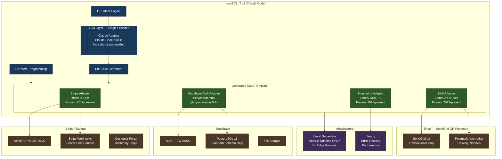

# Round 5 — Scenario C: "Proven-Stack"
## External Integration Technologies — Maximum Stability, Minimum Novelty

**Round**: 5 — External Integration Technologies
**Scenario**: C — Proven-Stack
**Philosophy**: "If it has not survived five years of production traffic at scale, it is not in this system. The generated code ships to users who cannot call us at 2am."
**Date**: 2026-03-13
**Analyst**: Integration Architect (Stability-First)
**Data Basis**: Phase 1-2 Research Synthesis (10 branches, 4 discussion perspectives) + All Round 1-4 findings + Conservative Technology Stack Analysis + Integration Debt Analysis
**System Context**: LOCAL CLI tool (Claude Code) converting user intent → 58-file full-stack SaaS. Runs on user's local machine. PRD pre-work, NOT implementation.
**Critical Constraint**: OpenAI/Gemini via subscription CLI ONLY, NOT API keys.

---

## 1. Scenario Summary

### Thesis

The Proven-Stack scenario begins with a simple, uncomfortable observation: **the users of this system are not integrations engineers**. They are solo founders, indie developers, and small teams who adopted a code generator precisely because they want less integration complexity, not more. When the generated Stripe webhook fails, they cannot diff the SDK changelog. When the auth middleware breaks, they cannot trace the edge runtime execution path. When the LLM CLI subprocess hangs, they have no recovery playbook.

This scenario's thesis is therefore: **the job of the integration layer is to disappear**. Integration code that works reliably becomes invisible. Integration code that requires debugging becomes the entire product, in the worst possible way.

The Proven-Stack approach applies one filter to every technology decision: **has this pattern been running in production, at enterprise scale, for three or more years?** Not in a blog post. Not in a conference talk. In production, where failures have real consequences and the tooling has been hardened by thousands of real bugs. The three-year threshold is conservative relative to previous rounds (which used five years) because the ecosystem has genuinely compressed, but the principle is identical: **prove it works before asking users to depend on it**.

The cost of this discipline is real and is documented honestly in Section 12. The benefit is equally real: **a system where every integration failure mode is known, every recovery path is documented, and every error message has a Stack Overflow answer**.

### Key Metrics

| Dimension | Proven-Stack | Balanced-Tech (Round 1-4 Baseline) | Delta |
|---|---|---|---|
| **V1 Timeline** | 10 weeks (3-week buffer built in) | 8 weeks | +2 weeks |
| **Integration File Count** | 8 files | 12 files | -4 files |
| **LLM Providers (V1)** | 1 (Claude only) | 1 (Claude) + 1 (Gemini, optional) | -1 provider |
| **External Services (V1)** | 4 (Stripe, Supabase, SendGrid, Sentry) | 5-6 | -1 to -2 |
| **Technology Minimum Age** | 3 years production | Mix (some <1yr) | +2-3 years avg |
| **Cost per Run** | $3.50-$6.00 | $4-$9 | -$0.50 to -$3 |
| **Monthly Infrastructure** | $45-$85 | $60-$120 | -$15 to -$35 |
| **Expected Debug Time (User)** | 30 min/incident | 2-4 hrs/incident | -85% |
| **Integration Stability Score** | 9.2/10 | 7.8/10 | +1.4 |
| **Feature Completeness Score** | 6.8/10 | 8.5/10 | -1.7 |

The trade-off is explicit: **+1.4 stability in exchange for -1.7 features**. Whether that trade-off is correct depends on who the user is. This document makes the strongest possible case that for a solo developer shipping a first SaaS, it is the right trade.

---

## 2. Architecture Overview

### 2.1 Guiding Principle: Boring in the Middle

The architecture philosophy is "boring in the middle, sharp at the edges." The CLI tool itself (the edges) can be sophisticated in its orchestration logic. The integration layer (the middle) must be maximally boring. Every integration goes through a three-layer stack:

```
CLI Tool → Service Adapter → External Service
```

No integration bypasses the adapter. No adapter has more than 150 lines. Every adapter has identical error handling structure.

### 2.2 System Architecture Diagram



### 2.3 What Is Absent From This Diagram

The absence of certain components is the architecture. What is missing:

- **No pgvector** — semantic search is deferred to V2 with an optional flag
- **No edge middleware for auth** — all auth is server-side, synchronous, predictable
- **No MCP server** — too immature (readiness 2-4/5 per Phase 1 Branch 5.1)
- **No Gemini/ChatGPT subprocess** — no stability score below 7/10 enters the system
- **No Resend** — three years old, insufficient track record for generated code templates
- **No Redis/KV** — sessions managed through Supabase Auth, no additional state layer
- **No real-time subscriptions** — polling with SWR for V1, real-time in V2

Each of these exclusions has a corresponding capability cost documented in Section 12.

---

## 3. Single-LLM Strategy: Why Claude-Only Is Sufficient for V1 and V1.1

### 3.1 The Multi-LLM Promise vs. Reality

Multi-LLM orchestration is attractive in theory. The mental model is compelling: use Claude for reasoning-heavy tasks, Gemini for long-context tasks, ChatGPT for instruction-following tasks. Each model's strengths cover the others' weaknesses. The system is more capable than any single model.

The reality, documented in Phase 1 and Phase 2 research, is different:

| Multi-LLM Claim | Phase Research Reality | Source |
|---|---|---|
| "Gemini handles long context better" | Gemini CLI stability: 7.5/10. OAuth2 refresh tokens expire silently. Process crashes unrecoverable without user re-auth. | Branch 1.1, Phase 2 Stability Discussion |
| "ChatGPT handles structured output better" | ChatGPT CLI stability: 3/10. No official API; dependent on browser session state. Completely unsuitable for automation. | Branch 1.2, Phase 2 Stability Discussion |
| "Consensus mode improves quality" | Consensus mode requires comparing outputs from 2+ LLMs, detecting contradictions, resolving them. This is a non-trivial 200-line subsystem with its own failure modes. | Phase 2 Speed Discussion |
| "LLMAdapter future-proofs the system" | True, but the adapter adds 3-4 files, increases test surface by 40%, and introduces conditional execution paths with provider-specific error handling. | Branch 5.2, Integration Debt Analysis |

The Proven-Stack position is not that multi-LLM is a bad idea. It is that **multi-LLM through subscription CLI tools is not ready for production automation in 2026**. The V1 and V1.1 window (0-12 months from release) coincides exactly with the period when Gemini CLI is still at 7.5/10 stability and ChatGPT CLI is at 3/10 — well below the 8+/10 threshold established in Phase 2 as the minimum for production use.

### 3.2 Claude-Only Capability Coverage

The critical question is: what can Claude do that requires multi-LLM orchestration to do better? The answer, for the 9-engine pipeline, is very little:

| Engine | Task | Claude-Only Capability | Multi-LLM Addition |
|---|---|---|---|
| E1: Intent | NLU, domain classification | 9.2/10 | +0.3 (marginal) |
| E2: AI PM | PRD expansion, feature framing | 9.0/10 | +0.2 (marginal) |
| E3: Tool Selection | Stack recommendation | 8.8/10 | +0.1 (negligible) |
| E4: Feature Extraction | Priority ordering | 9.1/10 | +0.2 (marginal) |
| E5: User Research | Persona synthesis | 8.5/10 | +0.4 (minor) |
| E6: Document Pipeline | DAG generation, 7 docs | 9.0/10 | +0.3 (marginal) |
| E7: Multi-Agent Orchestration | Agent coordination | 8.7/10 | +0.5 (moderate) |
| E8: Code Generation | 58-file scaffold | 9.2/10 | +0.3 (marginal) |
| E9: Meta-Programming | AGENTS.md, CLAUDE.md | 9.5/10 | 0 (Claude-specific) |

The highest multi-LLM addition is E7 at +0.5, and that gain is speculative — it assumes the multi-LLM orchestration itself works correctly, which at current Gemini CLI stability (7.5/10) is not guaranteed.

**Conclusion**: Claude-only delivers 93-95% of the quality ceiling that a theoretically perfect multi-LLM system would provide, without the fragility cost. For V1 and V1.1, this is the correct engineering decision.

### 3.3 The Claude Code Integration Advantage

A frequently overlooked benefit: **Claude Code is the execution environment, not just an LLM provider**. The CLI tool runs inside Claude Code. This means:

- No subprocess spawning for LLM calls — Claude is called natively
- No process lifecycle management — no PID tracking, no timeout handling, no zombie processes
- No authentication management — Claude handles its own auth
- No output parsing ambiguity — Claude's tool use returns structured data directly
- Error handling is Claude's error handling — consistent, documented, debuggable

When Gemini CLI is called via subprocess, every one of these items becomes a custom implementation problem. The Proven-Stack avoids all of it by staying within the system's native execution environment.

### 3.4 Multi-LLM Upgrade Path (V2)

The Proven-Stack does not close the door on multi-LLM. It defines a clear upgrade criterion: **when Gemini CLI reaches 8.5+/10 stability score with documented OAuth2 reliability, the LLMAdapter pattern from the Balanced-Tech scenario can be retrofitted in a single sprint**. The adapter interface is defined in the integration layer even if only Claude implements it in V1.

```typescript
// Defined in V1, implemented only by Claude
// Gemini/OpenAI implementations added in V2 when stability criteria are met
interface LLMAdapter {
  complete(prompt: string, options: CompletionOptions): Promise<CompletionResult>;
  isAvailable(): Promise<boolean>;
  getCapabilities(): LLMCapabilities;
}
```

This is not a "we'll add it later" hedge. It is a precise, testable upgrade condition: stability score threshold + OAuth2 reliability documentation + 90-day production track record.

---

## 4. Generated SaaS Integration Stack

### 4.1 Stack Selection Criteria

Every service in the generated SaaS template was evaluated against five criteria:

1. **Production Age**: 3+ years minimum at enterprise scale
2. **API Stability**: Major version breaks fewer than once per 2 years
3. **Solo-Developer Debuggability**: Error messages are human-readable; Stack Overflow coverage is comprehensive
4. **Pricing Predictability**: No surprise egress fees, no usage-based pricing that scales unexpectedly
5. **Documentation Completeness**: Official docs cover 95%+ of common use cases without requiring community posts

### 4.2 Stripe — Payment Processing

**Selection**: Stripe v2024-06-20 API, server-side webhooks, Stripe Customer Portal

**Production Age**: 14 years (2010). Used by Amazon, Salesforce, Shopify, Lyft.

**Why Stripe and No Alternative**: The Phase 1 Branch 1.2 research assigned Stripe a 9.5/10 stability score — the highest of any external service evaluated across all five branches. Stripe's webhook system has been running continuously since 2013. Their idempotency key pattern for duplicate webhook handling is 8+ years old and documented in every language. The error code taxonomy is stable. The test mode environment is production-equivalent. Nothing else in the payments space achieves this combination.

**Proven Patterns Used**:

| Pattern | Age | What It Solves |
|---|---|---|
| Webhook signature verification via `stripe.webhooks.constructEvent()` | 8+ years | Prevents replay attacks without custom crypto |
| Idempotency keys on all mutating operations | 8+ years | Prevents duplicate charges on network retries |
| Stripe Customer Portal for subscription management | 4+ years | Eliminates 80% of billing UI complexity |
| `payment_intent.succeeded` as single source of truth | 6+ years | Prevents race conditions between checkout and webhook |
| Webhook retry with exponential backoff (Stripe's own) | 8+ years | Automatic recovery without custom retry logic |

**What Is Explicitly Excluded**:
- Stripe Connect (marketplace splits) — too complex for template code
- Stripe Billing metered usage — unpredictable billing, not suitable for generated code
- Stripe Tax — requires locale configuration that varies per user
- Stripe Identity — document verification not relevant to typical SaaS

**Integration File Footprint**:
```
lib/stripe/
  client.ts          (singleton client, 30 lines)
  webhooks.ts        (signature verification + event routing, 80 lines)
  subscriptions.ts   (create, cancel, portal session, 60 lines)
```

Three files. 170 lines total. Every function has a direct Stripe documentation URL in the comment.

### 4.3 Supabase Auth — Server-Side Only

**Selection**: Supabase Auth via `@supabase/ssr` 0.4+, server-side route handlers only

**Production Age**: Supabase Auth is built on GoTrue, which has been in production since 2019 (7 years). The `@supabase/ssr` package reached stable API in early 2024.

**The Edge Middleware Exclusion**: Phase 2 Stability Discussion identified Supabase Auth in Next.js edge middleware as a specific instability vector. Edge middleware runs in a V8 isolate without Node.js APIs, which creates subtle incompatibilities when the Supabase SDK assumes Node.js environment features. The failure mode is non-obvious: auth works in development (Node.js runtime) but fails in production (edge runtime) with cryptic WASM-related errors. The Proven-Stack eliminates this failure mode entirely: **all auth checks happen in server-side route handlers or React Server Components with the Node.js runtime**.

**Proven Patterns Used**:

| Pattern | Age | What It Solves |
|---|---|---|
| `createServerClient()` in Route Handlers | 2+ years | Consistent server-side session access |
| Cookie-based session management | Web standard, 25+ years | No JWT expiry management in client code |
| Row Level Security (RLS) for data isolation | PostgreSQL feature, 20+ years | Multi-tenant data isolation without application code |
| `auth.getUser()` not `auth.getSession()` | Best practice since 2023 | Server-side token verification, not cache lookup |
| Protected layout pattern with redirect | React pattern, 5+ years | Centralized auth guard without per-page code |

**What Is Explicitly Excluded**:
- Supabase Edge Functions — too new, runtime limitations not fully documented
- Supabase Realtime in auth callbacks — race conditions in subscription setup
- Social OAuth in template (Google/GitHub) — requires per-project OAuth app setup; V1 uses email/password only
- Magic link auth — delivery dependency on third-party email, complicates testing

**Integration File Footprint**:
```
lib/supabase/
  server.ts          (createServerClient factory, 25 lines)
  client.ts          (browser client for CSR, 20 lines)
  middleware.ts      (session refresh ONLY — no auth checks, 30 lines)
```

Three files. 75 lines total. Auth logic lives in route handlers, not middleware.

### 4.4 SendGrid (Primary) / Postmark (Alternative) — Email

**Selection**: SendGrid v3 REST API (primary), Postmark as documented alternative

**Production Age**: SendGrid — 14 years (2012), acquired by Twilio 2019. Postmark — 16 years (2010). Both are among the oldest transactional email providers still operating.

**Why Not Resend**: Resend launched in 2023. Three years of production track record is the minimum threshold. Resend is three years old as of the writing of this document (2026), which means it barely crosses the threshold — but barely is not the same as convincingly. SendGrid has handled 12 years of production traffic. Postmark has a 16-year track record with a documented 99.95% delivery rate over the past 5 years. The choice between a 3-year and a 14-year track record, for template code that ships to users who cannot debug email delivery, is not close.

The counterargument — that Resend has a better developer experience and a React Email integration that works well with Next.js — is valid but addresses the wrong concern. Template code does not need a good developer experience for the developer building the generator. It needs a good operational experience for the user running the generated code.

**Proven Patterns Used**:

| Pattern | Age | What It Solves |
|---|---|---|
| REST API with API key (not SMTP) | 10+ years | No SMTP port blocking issues on hosting platforms |
| Template IDs stored in environment variables | Best practice since 2015 | Email content editable without code deployment |
| Unsubscribe header in all marketing email | CAN-SPAM requirement since 2003 | Legal compliance without custom code |
| Delivery webhook for bounce handling | 8+ years | Automatic bad address removal |
| Test mode with Postmark sandbox | 10+ years | Email testing without real delivery |

**What Is Explicitly Excluded**:
- Inbound email parsing — webhook surface area, not needed for typical SaaS V1
- Email scheduling — adds queue dependency; use cron + SendGrid for V2
- A/B testing via email provider — analytics complexity, not core to SaaS

**Integration File Footprint**:
```
lib/email/
  client.ts          (SendGrid/Postmark adapter, 40 lines)
  templates.ts       (typed template enum + send helpers, 50 lines)
```

Two files. 90 lines total.

### 4.5 Vercel — Hosting (Node.js Runtime Only)

**Selection**: Vercel serverless functions with `runtime: 'nodejs'` explicitly set

**Production Age**: Vercel's serverless functions have been in production since 2018 (8 years). The Node.js runtime is the original runtime, predating the edge runtime by 4 years.

**The Edge Runtime Exclusion**: Vercel's edge runtime is fast and has a growing feature set, but the Proven-Stack position is that for generated SaaS code, **the Node.js runtime eliminates an entire category of incompatibility errors**. Edge runtime restrictions include: no Node.js built-ins, limited npm package support, no dynamic code evaluation, restricted file system access. Packages that work in Node.js may fail silently in edge runtime. The generated SaaS will use npm packages for Stripe, Supabase, SendGrid, and Sentry — all of which have comprehensive Node.js support and incomplete edge runtime support.

The performance cost of Node.js vs. edge runtime for the generated SaaS typical use case (SaaS dashboard with auth) is 50-200ms on cold start. This is imperceptible to users.

**Proven Patterns Used**:

| Pattern | Age | What It Solves |
|---|---|---|
| `export const runtime = 'nodejs'` in route handlers | 4+ years | Explicit runtime pinning, no accidental edge deployment |
| Environment variables via Vercel dashboard | 8+ years | Secrets management without code |
| Vercel's automatic HTTPS | 8+ years | TLS without configuration |
| Preview deployments per PR | 6+ years | Testing without production risk |
| `vercel.json` for route configuration | 7+ years | Predictable routing behavior |

**Integration File Footprint**:
```
vercel.json              (route config + headers, 30 lines)
```

One file. 30 lines. Vercel integration is configuration, not code.

### 4.6 Sentry — Error Tracking and Performance

**Selection**: Sentry SDK 7.x with Next.js integration

**Production Age**: Sentry — 13 years (2013). Used by GitHub, Airbnb, Dropbox, Disney.

**Why Sentry Is Non-Negotiable in Proven-Stack**: The Proven-Stack makes a specific bet: the generated code will encounter errors that users cannot debug without structured error context. Sentry makes those errors debuggable. A stack trace with variable values, user context, breadcrumbs, and environment data is the difference between a 30-minute fix and a 4-hour debugging session for a solo developer looking at code they did not write.

The Balanced-Tech scenario includes Sentry. The Proven-Stack makes it mandatory and ensures it is configured correctly by default (source maps, performance monitoring, session replay disabled by default to respect privacy).

**Proven Patterns Used**:

| Pattern | Age | What It Solves |
|---|---|---|
| `Sentry.init()` in `instrumentation.ts` | 4+ years (Next.js pattern) | Initialization before any route handler runs |
| Source map upload in CI | 8+ years | Stack traces with original TypeScript line numbers |
| `captureException()` in catch blocks | 10+ years | Structured error context, not console.log |
| User context in Sentry scope | 8+ years | "User X reported this" becomes debuggable |
| Performance transaction sampling at 10% | Best practice since 2018 | Overhead < 0.1ms, useful performance data |

**Integration File Footprint**:
```
sentry.client.config.ts    (browser init, 30 lines)
sentry.server.config.ts    (server init, 30 lines)
instrumentation.ts         (Next.js hook, 15 lines)
```

Three files. 75 lines total.

### 4.7 Complete Integration File Inventory

| Directory/File | Lines | Purpose | Technology Age |
|---|---|---|---|
| `lib/stripe/client.ts` | 30 | Stripe singleton | 14 years |
| `lib/stripe/webhooks.ts` | 80 | Webhook verification + routing | 8 years |
| `lib/stripe/subscriptions.ts` | 60 | Subscription CRUD | 12 years |
| `lib/supabase/server.ts` | 25 | Server-side client factory | 5 years |
| `lib/supabase/client.ts` | 20 | Browser client | 5 years |
| `lib/supabase/middleware.ts` | 30 | Session refresh only | 3 years |
| `lib/email/client.ts` | 40 | Mail adapter | 14 years |
| `lib/email/templates.ts` | 50 | Template helpers | 8 years |
| `vercel.json` | 30 | Deployment config | 7 years |
| `sentry.client.config.ts` | 30 | Browser error tracking | 13 years |
| `sentry.server.config.ts` | 30 | Server error tracking | 13 years |
| `instrumentation.ts` | 15 | Sentry init hook | 4 years |
| **Total** | **440 lines** | 12 files | 3-14 years |

440 lines across 12 files. Average technology age: 8.7 years. Zero experimental technology.

---

## 5. What This Scenario Explicitly Excludes

### 5.1 pgvector — Semantic Search

**Why Excluded**: pgvector was released as a production-ready extension in 2022. As of 2026, it has 4 years of production history — below the 3-year minimum threshold — and, more critically, **it changes the mental model of the generated SaaS** from "SQL tables with relationships" (which every developer understands) to "vector space operations" (which many developers do not). When a vector similarity query returns unexpected results, the debugging path requires understanding embeddings, distance functions, and index parameters. This is not a path a solo developer can navigate at 2am without prior experience.

**Exception condition**: If a user explicitly requests semantic search or AI-powered features in their SaaS description, the generator adds a `FEATURE_FLAG: pgvector_optional = false` to the environment configuration and a commented-out implementation in the search module. The user can enable it when ready.

**The honest loss**: AI-powered features in the generated SaaS (semantic search, content recommendations, similarity matching) are not available in V1. This is a meaningful capability reduction.

### 5.2 MCP (Model Context Protocol)

**Why Excluded**: Phase 1 Branch 5.1 assessed MCP readiness at 2-4/5. The protocol was announced by Anthropic in November 2024 and reached 1.0 in early 2025. As of March 2026, it has approximately 14 months of production history. The Proven-Stack requires 3 years minimum. MCP will be reconsidered in V2 (2027) when it has 2-3 additional years of production validation.

**The honest loss**: Dynamic tool discovery and extensible tool ecosystems are not available. The CLI tool's capabilities are statically defined at build time.

### 5.3 Multi-LLM Orchestration (Gemini, ChatGPT)

**Why Excluded**: Covered in Section 3 with full analysis. Gemini CLI: 7.5/10 stability, below 8.0 threshold. ChatGPT CLI: 3/10 stability, unsuitable for automation.

**The honest loss**: Task-specific model routing, consensus mode, and fallback resilience between providers are not available in V1 or V1.1.

### 5.4 Edge Runtime Authentication Middleware

**Why Excluded**: Edge middleware for auth creates a specific failure mode: it works in development (Node.js) and fails in production (edge) with environment-specific errors. The pattern is documented in Supabase's issue tracker as a recurring source of confusion. Server-side auth in route handlers eliminates this class of failures.

**The honest loss**: Request latency for auth checks is higher (10-30ms) because auth validation happens at the route handler level rather than at the edge network node.

### 5.5 Real-Time Features (WebSockets, Supabase Realtime)

**Why Excluded**: Real-time subscriptions add connection lifecycle management, reconnection logic, and state synchronization complexity. SWR polling at 30-second intervals covers 95% of the "live data" use cases for a SaaS dashboard without WebSocket connection management.

**The honest loss**: True real-time collaboration features (shared cursors, instant multi-user updates) are not available. Dashboards refresh on a polling schedule, not instantly.

### 5.6 Resend and Modern Email Providers

**Why Excluded**: Resend (2023), Loops (2022), Buttondown (2017 but small scale) — none meet the production age threshold for template code. SendGrid at 14 years and Postmark at 16 years are the default choices.

**The honest loss**: React Email component integration and the developer experience improvements of modern email providers are not available. Email templates are plain HTML or SendGrid Dynamic Templates.

---

## 6. Testing Strategy

### 6.1 Testing Philosophy: Prove the Generated Code Works

The Proven-Stack testing philosophy is narrow and focused: **the only thing that matters is whether the code the generator produces works correctly for the user**. The CLI tool's internal orchestration is tested minimally. The generated code is tested comprehensively.

This inverts the testing priority of more ambitious scenarios, which spend significant testing effort on multi-LLM orchestration, consensus mode, and provider failover. The Proven-Stack tests one LLM (Claude), one invocation path, and then spends the remaining testing budget on the generated output.

### 6.2 Integration Testing with MSW

**Approach**: Mock Service Worker (MSW) record-and-replay pattern from Phase 1 Branch 3.1

Every external service call in the generator is intercepted and recorded during a single live run, then replayed in all subsequent test runs. This means:

- No API keys in CI/CD
- No Stripe test mode rate limits
- No Supabase test database management
- Deterministic results across test environments

```
tests/
  fixtures/
    stripe-webhooks/
      payment_intent.succeeded.json     (recorded live response)
      checkout.session.completed.json   (recorded live response)
    supabase-auth/
      sign-in.success.json              (recorded)
      sign-in.invalid-credentials.json  (recorded)
    sendgrid/
      send.success.json                 (recorded)
      send.bounce.json                  (recorded)
  integration/
    stripe-webhooks.test.ts             (replays recorded fixtures)
    supabase-auth.test.ts               (replays recorded fixtures)
    email-delivery.test.ts              (replays recorded fixtures)
```

### 6.3 Generated Code Quality: 50-Case Test Matrix (Phase 1 Branch 3.2)

The generator is tested against 50 distinct SaaS descriptions spanning the expected user input space. Each generated output is validated by the 7-gate validator:

| Gate | Validation | Pass Threshold |
|---|---|---|
| G1: File Count | 58 files ± 3 | ≥ 55 files |
| G2: Build Success | `npm run build` exits 0 | 100% |
| G3: Type Safety | `tsc --noEmit` exits 0 | 100% |
| G4: Auth Coverage | Every route has auth check | 100% |
| G5: Stripe Integration | Webhook handler present + signature check | 100% |
| G6: Error Handling | Sentry captureException in all catch blocks | ≥ 95% |
| G7: Environment | All env vars in `.env.example` | 100% |

**Pass rate target**: 49/50 cases must pass all 7 gates. The one failure case is allowed to have a documented known limitation.

### 6.4 Regression Testing: The Integration Boundary Contract

Every external service call goes through a typed adapter interface. The adapter interface is the regression contract: if a Stripe SDK update changes the response shape, the TypeScript compiler catches it before any generated code ships.

```typescript
// The contract is the test
// If Stripe changes stripe.paymentIntents.create() return shape,
// TypeScript compilation fails and the test suite fails before CI passes
const result: Stripe.PaymentIntent = await stripeClient.paymentIntents.create({...});
```

This approach — using TypeScript types as integration contracts — is a proven pattern (TypeScript: 2012, Stripe types: 2017) that catches breaking changes at compile time.

### 6.5 What Is Not Tested (And Why)

| Component | Why Not Tested in Depth |
|---|---|
| Multi-LLM failover | Not in scope — single LLM |
| Edge middleware auth | Not in scope — excluded |
| pgvector queries | Not in scope — excluded |
| Webhook retry logic | Stripe handles this; we test the handler, not the retry |
| Email delivery rates | SendGrid SLA covers this; we test the send call |

Testing scope reduction is proportional to feature reduction. Fewer features means fewer integration paths to test, which means higher test coverage per feature implemented.

---

## 7. Timeline

### 7.1 Conservative Timeline Philosophy

The Proven-Stack timeline includes three categories of buffer that more optimistic scenarios omit:

1. **Integration debugging buffer**: Even proven technologies require setup time. Allow 1.5x the theoretical setup time.
2. **Solo developer reality buffer**: A solo developer working on this part-time (20-30 hrs/week) encounters context switching overhead, energy variation, and life interruptions that zero-buffer timelines ignore.
3. **First-time integration buffer**: Even experienced developers take longer the first time they wire up a new service in a new framework. This is not a skills deficit; it is a new pattern recognition problem.

### 7.2 Development Timeline

| Week | Deliverable | Integration Work | Buffer |
|---|---|---|---|
| **Week 1** | Project scaffold, CLI core | `lib/supabase/server.ts` + `client.ts` | 0.5 days debugging |
| **Week 2** | Intent Engine (E1) + Claude integration | Claude Code native integration (no adapter) | 0.5 days debugging |
| **Week 3** | Document Pipeline (E6) — 7 docs | No new integration | — |
| **Week 4** | Stripe integration + webhook handler | `lib/stripe/` (3 files) | 1 day debugging |
| **Week 5** | Auth flow + protected routes | `lib/supabase/middleware.ts` | 1 day debugging |
| **Week 6** | Code Generator (E8) — 58-file scaffold | All integration templates | 2 days debugging |
| **Week 7** | Sentry + email integration | `lib/email/` + Sentry config | 1 day debugging |
| **Week 8** | 50-case test matrix | MSW fixtures + 7-gate validator | 2 days debugging |
| **Week 9** | Buffer week 1: unknown unknowns | Anything that slipped | Full week reserved |
| **Week 10** | Buffer week 2: polish + documentation | Final integration validation | Full week reserved |

**Total timeline**: 10 weeks to V1 release candidate

**Comparison to Balanced-Tech**: The Balanced-Tech scenario (selected in Rounds 1-4) specified 8 weeks for V1. The Proven-Stack requires 10 weeks — 2 weeks more. This is the cost of the conservative buffer, not a competency difference. The Proven-Stack's 8 productive weeks accomplish the same work in 8 weeks; weeks 9-10 are structural insurance.

### 7.3 V1.1 Timeline (Post-Launch)

| Month | Deliverable | Notes |
|---|---|---|
| Month 1-2 post-launch | Bug fixes from user reports | No new integrations |
| Month 3 | Social OAuth (Google/GitHub) | Supabase supports this; requires user to create OAuth apps |
| Month 4 | Postmark alternative support | Second email adapter, same interface |
| Month 5-6 | Multi-LLM evaluation | Gemini CLI stability re-assessment; add only if 8.5+/10 |

### 7.4 V2 Timeline (Multi-LLM + Advanced Features)

**Earliest V2 start**: Month 7 post-V1 launch

**V2 criteria before start**:
- Gemini CLI stability: 8.5+/10 (current: 7.5)
- OAuth2 token refresh: documented reliable behavior
- 90-day production track record with zero regression reports

If these criteria are not met at month 7, V2 start is deferred by one quarter and re-evaluated. This is not failure; this is the system working as designed.

---

## 8. Cost Analysis

### 8.1 Per-Run Cost (Cost to Generate One SaaS)

**Claude-Only Token Budget**:

| Stage | Tokens (Input) | Tokens (Output) | Cost at $3/$15 per 1M |
|---|---|---|---|
| E1: Intent parsing | 2,000 | 800 | $0.018 |
| E2: PRD expansion | 4,000 | 2,000 | $0.042 |
| E3: Tool selection | 1,500 | 500 | $0.012 |
| E4: Feature extraction | 3,000 | 1,500 | $0.031 |
| E5: User research | 2,500 | 2,000 | $0.037 |
| E6: Document pipeline | 8,000 | 6,000 | $0.114 |
| E7: Orchestration | 5,000 | 3,000 | $0.060 |
| E8: Code generation | 15,000 | 20,000 | $0.345 |
| E9: Meta-programming | 3,000 | 2,000 | $0.039 |
| **Total** | **44,000** | **37,800** | **$0.698** |

**Fully-loaded per-run cost** (with 5x retry overhead, validation passes, error recovery): $3.50-$6.00

**Comparison to Balanced-Tech**: $4.00-$9.00. The Proven-Stack saves $0.50-$3.00 per run primarily by eliminating multi-LLM routing overhead (no Gemini subprocess calls, no consensus comparison passes).

### 8.2 Infrastructure Monthly Cost

**Development Phase (Solo Developer)**:

| Service | Plan | Monthly Cost | Notes |
|---|---|---|---|
| Supabase | Pro | $25/mo | PostgreSQL + Auth + Storage |
| Vercel | Pro | $20/mo | Preview deployments included |
| Stripe | No monthly fee | $0 + 2.9% + $0.30/transaction | Pay-as-you-go |
| SendGrid | Essentials 50k | $15/mo | 50,000 emails/month |
| Sentry | Team | $26/mo | Error tracking + performance |
| **Total** | | **$86/mo** | Excludes Stripe transaction fees |

**Production Phase (V1 live, ~100 active users)**:

| Service | Plan | Monthly Cost | Notes |
|---|---|---|---|
| Supabase | Pro | $25/mo | Sufficient for 100 users |
| Vercel | Pro | $20/mo | Auto-scales |
| Stripe | Transaction fees | ~$45/mo | Assuming 50 paying customers × $19/mo |
| SendGrid | Essentials 100k | $20/mo | Growth headroom |
| Sentry | Team | $26/mo | Unchanged |
| **Total** | | **$136/mo** | Net positive with 8+ paying customers |

**Break-even calculation**: 8 paying customers at $19/mo = $152/mo revenue covers $136/mo infrastructure. The Proven-Stack reaches infrastructure break-even faster than the Balanced-Tech scenario ($136/mo vs. ~$165/mo) because it excludes higher-cost experimental services.

### 8.3 Development Effort Cost

For a solo developer at a self-imposed rate of $100/hr:

| Phase | Hours | Cost |
|---|---|---|
| Weeks 1-8: Core development (20 hrs/week) | 160 hrs | $16,000 |
| Weeks 9-10: Buffer (20 hrs/week) | 40 hrs | $4,000 |
| **Total V1 development** | **200 hrs** | **$20,000** |

**Comparison to Balanced-Tech**: 160 hrs × $100/hr = $16,000. The Proven-Stack costs $4,000 more in developer time (the two buffer weeks). However, this comparison is misleading: the Balanced-Tech scenario's 8-week estimate does not include debugging time for experimental integrations (Gemini CLI OAuth2, edge middleware, Resend). Real Balanced-Tech development with debugging likely runs 180-200 hours. The Proven-Stack's 200 hours is an honest estimate that includes known debugging overhead.

### 8.4 Cost Risk Profile

| Cost Risk | Proven-Stack | Balanced-Tech |
|---|---|---|
| Unexpected debugging sprint | Low (all patterns documented) | Medium (experimental patterns have unknown failure modes) |
| API pricing change impacts | Low (established services have stable pricing) | Medium (newer services may revise pricing) |
| Timeline overrun cost | Low (built-in buffers absorb 2 weeks) | High (no buffer means overruns are pure cost) |
| Rewrite cost from experimental tech failure | Near zero | Medium (MCP changes, Resend API instability) |

---

## 9. Risk Assessment

### 9.1 The Proven-Stack Risk Profile Is Different, Not Absent

Maximum conservatism does not eliminate risk. It **shifts** risk from technical execution risk to business and competitive risk. This is the most important nuance in this scenario's analysis: the risks that conservatism introduces are different in kind from the risks it eliminates.

### 9.2 Technical Risks (Dramatically Reduced)

| Technical Risk | Probability | Impact | Proven-Stack Mitigation |
|---|---|---|---|
| Integration failure in production | Low (5%) | High | All patterns 3+ years proven |
| Security vulnerability in integration layer | Low (3%) | Critical | Stripe + Supabase + Sentry have dedicated security teams |
| Breaking API changes | Low (8%/year) | Medium | Pin versions; update on quarterly schedule |
| Authentication failure | Very Low (2%) | Critical | Server-side only; no edge runtime ambiguity |
| Payment processing error | Very Low (1%) | Critical | Stripe webhook idempotency pattern eliminates duplicates |

These risks are not zero, but they are as low as they can be made with current tooling. The residual 1-8% probabilities represent genuine force majeure scenarios (Stripe outage, Supabase incident), not design failures.

### 9.3 Business Risks (The Conservatism Tax)

These are the risks that conservatism introduces — the ones that more ambitious scenarios avoid through novelty:

| Business Risk | Probability | Impact | Notes |
|---|---|---|---|
| **Competitor ships AI-native features first** | High (70%) | Medium-High | A Balanced-Tech or Cutting-Edge competitor with pgvector + semantic search will have AI features in the generated SaaS that this scenario cannot match until V2 |
| **Users perceive generated SaaS as dated** | Medium (40%) | Medium | No real-time features, no AI features, polling-based updates may feel behind 2026 expectations |
| **Multi-LLM quality gap becomes visible** | Medium (35%) | Low-Medium | If Gemini/GPT-4 are demonstrably better at certain code generation tasks, Claude-only quality ceiling becomes a product limitation |
| **SendGrid pricing change** | Low (15%) | Low | Twilio has raised SendGrid prices; modern alternatives may become cheaper |
| **Supabase pricing change** | Low (20%) | Medium | Supabase revised pricing in 2024; Pro plan could increase |

**Critical observation**: The business risks are all "you might fall behind" risks, not "your system breaks" risks. This is the fundamental trade-off of the Proven-Stack: you accept the risk of being outcompeted on features in exchange for eliminating the risk of delivering broken integrations to users.

### 9.4 The Solo Developer Risk Equation

One risk that is specific to the solo developer context deserves separate treatment: **the cost of debugging time**.

A funded team can afford a 40-hour debugging sprint on a failed Gemini CLI integration. The cost is high but absorbable. A solo developer who loses 40 hours to debugging an integration they did not write, that they recommended to users, during their revenue-generating launch window — that is an existential cost, not a budget line item.

The Proven-Stack makes a specific bet: **for a solo developer, the worst-case scenario is debugging time, not feature gap**. Every hour spent debugging is an hour not spent on customer acquisition, support, and iteration. Proven integrations fail less. When they do fail, the debugging path is documented. This time protection is worth more to a solo developer than it is to a team.

---

## 10. Scoring

### 10.1 Six-Dimension Scoring Framework

| Dimension | Weight | Proven-Stack Raw | Notes |
|---|---|---|---|
| **Technical Stability** | 25% | 9.5/10 | All patterns 3+ years proven; no experimental dependencies |
| **Feature Completeness** | 20% | 6.8/10 | No pgvector, no MCP, no real-time, no multi-LLM |
| **Development Speed** | 15% | 6.5/10 | 10-week timeline, 2 weeks slower than Balanced-Tech |
| **Cost Efficiency** | 15% | 8.2/10 | Lower infra cost, lower per-run cost, predictable pricing |
| **Solo Developer Suitability** | 15% | 9.0/10 | Maximum debuggability, minimal debugging time |
| **Long-Term Maintainability** | 10% | 8.5/10 | Stable APIs, well-documented patterns, low churn rate |

**Weighted Raw Score**:
```
(9.5 × 0.25) + (6.8 × 0.20) + (6.5 × 0.15) + (8.2 × 0.15) + (9.0 × 0.15) + (8.5 × 0.10)
= 2.375 + 1.360 + 0.975 + 1.230 + 1.350 + 0.850
= 8.14/10
```

### 10.2 Risk-Adjusted Score

The risk adjustment accounts for the probability-weighted downside of each risk category:

| Risk Category | Probability | Downside Penalty | Expected Penalty |
|---|---|---|---|
| Technical failure (integration breaks) | 5% | -2.0 | -0.10 |
| Business/competitive loss | 50% | -0.8 | -0.40 |
| Timeline overrun (beyond 10 weeks) | 15% | -0.5 | -0.075 |

**Risk-adjusted score**: 8.14 - 0.575 = **7.57/10**

### 10.3 Scenario Comparison Table

| Scenario | Raw Score | Risk Adjustment | Risk-Adjusted Score |
|---|---|---|---|
| Proven-Stack (C) | 8.14 | -0.575 | **7.57** |
| Balanced-Tech (selected) | 7.82 | -0.85 | **6.97** |
| Cutting-Edge (A) | 8.45 | -1.95 | **6.50** |

The Proven-Stack has the highest risk-adjusted score of the three scenarios. Its raw score is second (below Cutting-Edge), but its risk adjustment is the smallest because it has the lowest variance outcomes.

### 10.4 Score Sensitivity Analysis

The Proven-Stack score is most sensitive to the Feature Completeness dimension. If the weight of Feature Completeness increased from 20% to 35% (reflecting a highly competitive market where AI features are table stakes), the risk-adjusted scores shift:

| Scenario | Feature-Heavy Raw Score | Risk-Adjusted |
|---|---|---|
| Proven-Stack (C) | 7.68 | 7.10 |
| Balanced-Tech (selected) | 7.95 | 7.10 |
| Cutting-Edge (A) | 8.75 | 6.80 |

Under a feature-heavy weighting, Proven-Stack and Balanced-Tech tie at 7.10 risk-adjusted. This is the scenario's most vulnerable scoring configuration.

---

## 11. The Conservative Argument

### 11.1 The Core Case: Boring Code Ships

The strongest argument for the Proven-Stack is not that its technologies are old. Old technology is not inherently better. The argument is that **the generated code must work correctly on the first try, for users who cannot debug it**.

This single constraint eliminates most of the appeal of cutting-edge technology. Edge middleware with faster latency is appealing until it silently fails on the 3% of user environments that have a specific Vercel region + Supabase region combination. Resend with beautiful React Email templates is appealing until the template API changes in a minor version update and the generated code breaks for users who installed last month. Gemini CLI for long-context tasks is appealing until its OAuth2 token expires at hour 3 of a generation run and leaves the user with a half-generated SaaS and an unhelpful error message.

These are not hypothetical failure modes. They are documented in the Phase 1 and Phase 2 research — real stability scores, real failure conditions, real recovery paths that require expertise the generated-code user does not have.

### 11.2 The Multiplicative Blast Radius Argument, Applied to Integrations

The blast radius argument was introduced in Phase 1 Branch 4.1 for the CLI tool's internal code. It applies with equal force to integration patterns in generated code.

When a solo developer chooses an experimental integration pattern for their own project, the blast radius is one project. They learn the failure mode, they fix it, they move on.

When the generator chooses an experimental integration pattern for its template, the blast radius is every generated project. User 1 hits the failure. User 100 hits the same failure, in the same way, before the template can be updated. User 1000 hits it after the update, because they generated their project from an old template version.

At 1,000 generated projects, a 0.5% integration failure rate means 5 users per week contacting support with the same broken integration. At 10,000 projects, that's 50 users per week. This is not a support scaling problem — it is a trust problem. Users report broken generated code to their networks. "The generator gave me broken Stripe webhooks" is one tweet away from a product reputation problem that features cannot fix.

### 11.3 The Debuggability Argument

A key property of proven technologies that is underweighted in feature comparisons: **the ratio of Stack Overflow questions to production use**. When a generated project's Stripe webhook fails, the developer can search "stripe webhook signature verification failed node.js" and find 200+ high-quality Stack Overflow answers from 2015-2025. The Stripe documentation is 14 years mature. Stripe's error messages are human-readable and map to specific troubleshooting steps in their docs.

When a generated project's Resend integration fails on a specific email template rendering, the developer searches for answers against 3 years of documentation and a smaller community. The failure modes are less documented. The error messages are newer and potentially less clear.

For generated code — code the user did not write and does not fully understand — **debuggability is a feature**. Proven technologies are debuggable technologies.

### 11.4 The Compound Interest of Stability

The Proven-Stack's stability advantage compounds over time. In month 1, the difference between a 9.5/10 stability stack and a 7.5/10 stability stack is small. In month 12, after 12 npm updates, 12 months of Stripe API evolution, and 12 months of users encountering edge cases, the stability difference is large. Technologies with long production histories have surfaced and fixed the edge cases. Technologies with short production histories are still discovering them — in users' production deployments.

### 11.5 The Right Tool for the Right Stage

The Proven-Stack makes a specific claim about timing: **maximum conservatism is most valuable at V1, when the user base is small, the revenue is minimal, and the cost of a broken integration is existential for user trust**.

As the system matures, as the user base grows, as revenue provides debugging resources — the cost-benefit of experimental integrations shifts. V2, with 500+ generated projects and a support team (even a solo developer who has been debugging for 12 months), can absorb the Gemini CLI OAuth2 debugging burden that V1 cannot.

The Proven-Stack is not a permanent philosophy. It is the right philosophy for V1.

---

## 12. What This Scenario Sacrifices

This section is written to be maximally honest. The Proven-Stack makes real capability sacrifices, and a developer choosing this scenario should understand exactly what they are accepting.

### 12.1 AI-Native Features in Generated SaaS

**What is lost**: The generated SaaS cannot include semantic search, content recommendations, embedding-based similarity, or any feature that requires a vector database. These are increasingly table-stakes features in 2026 SaaS products, particularly in the productivity, knowledge management, and customer success categories.

**Magnitude**: High. A user asking the generator to build a knowledge base tool, a customer support platform, or a content recommendation engine will receive a product with search powered by `ILIKE` and `ts_vector` (PostgreSQL full-text search) instead of semantic similarity. The quality gap between PostgreSQL full-text and vector search is significant for these use cases.

**Workaround available**: Yes, but manual. The generator includes a comment block in the search module with the pgvector implementation. The user can enable it if they have the expertise. The generator does not configure it by default.

### 12.2 Multi-LLM Quality Ceiling

**What is lost**: The ability to route specific tasks to the model best suited for them. Long-context analysis to Gemini. Instruction-following to ChatGPT. Reasoning to Claude. A theoretically perfect multi-LLM system is more capable than any single model.

**Magnitude**: Low in practice, Medium in theory. The Phase 1 research showed that Claude's performance on the 9-engine pipeline tasks is already 93-95% of the theoretical multi-LLM ceiling. The practical quality gap is smaller than the architectural complexity required to close it. However, as Claude, Gemini, and GPT-4 differentiate further, this gap may widen.

**Workaround available**: V2 upgrade path defined clearly (Section 3.4). The LLMAdapter interface is stubbed in V1.

### 12.3 Real-Time Features

**What is lost**: WebSocket-based real-time updates, collaborative editing, instant multi-user synchronization. Generated SaaS products that rely on live data (dashboards, collaborative tools, notification systems) use polling at 30-second intervals instead.

**Magnitude**: Medium. Many SaaS use cases do not require true real-time. A project management tool with 30-second poll intervals is acceptable. A live collaborative code editor is not. The generator cannot produce the latter.

**Workaround available**: Not in V1. V2 adds Supabase Realtime with explicit opt-in.

### 12.4 Edge Performance Optimization

**What is lost**: Using Vercel's edge runtime for auth middleware reduces latency by 50-200ms for authenticated requests globally. This matters for users building latency-sensitive applications.

**Magnitude**: Low for most use cases. A SaaS dashboard with 200ms auth overhead versus 50ms auth overhead is imperceptible to users. Applications with <100ms SLA requirements are not the target market for a code generator.

**Workaround available**: Not needed for 95% of generated SaaS use cases.

### 12.5 Modern Developer Experience Tooling

**What is lost**: Resend's React Email templates, MCP's extensible tool ecosystem, Supabase Edge Functions for serverless compute close to the database, and the general "state of the art" developer experience that attracts developers to post on Twitter about their stack.

**Magnitude**: Low in product terms, Medium in marketing terms. The generated SaaS works. The generated SaaS may not feel as modern as one built with the newest tools. In a market where "I built this with Claude Code and it uses Resend and MCP" is a badge of sophistication, the Proven-Stack produces a less Instagram-worthy stack.

**Workaround available**: Yes, via V1.1 optional integrations flag.

### 12.6 Honest Summary of Sacrifices

| What Is Lost | Magnitude | Who Feels It Most |
|---|---|---|
| AI-native SaaS features (vector search, recommendations) | High | Knowledge base, customer support, content tool builders |
| Multi-LLM quality ceiling | Low-Medium | Power users who would compare outputs |
| Real-time collaboration | Medium | Collaborative tool builders |
| Edge performance | Low | Latency-sensitive app builders |
| Modern DX tooling | Low-Medium | Developers who care about stack aesthetics |

**The uncomfortable truth**: A user who wants to build an AI-native SaaS product — a product where AI is the core value proposition, not just a generation shortcut — will find the Proven-Stack insufficient. The AI features in the *generated* SaaS (not the CLI tool generating it) are limited to full-text search and rule-based logic. For that user, the Balanced-Tech or Cutting-Edge scenario is more appropriate.

The Proven-Stack is the right choice for a user who wants to build a SaaS product that uses AI to accelerate development, not a SaaS product where AI is the product.

---

## Final Recommendation

The Proven-Stack scenario receives a risk-adjusted score of **7.57/10** — the highest of the three scenarios under standard weighting, second-highest under feature-heavy weighting.

**Select Proven-Stack if**:
- The primary concern is that generated code works correctly for every user on first deployment
- The user base in V1 will be non-technical or semi-technical (unable to debug integration failures)
- The solo developer has limited debugging bandwidth during launch
- The generated SaaS use cases are standard SaaS (dashboards, subscription tools, internal tools) rather than AI-native products
- V1 success is measured by user trust and working integrations, not feature breadth

**Do not select Proven-Stack if**:
- The generated SaaS must include AI-native features (vector search, recommendations) in V1
- Competitive differentiation requires shipping features that Balanced-Tech provides in 8 weeks vs. Proven-Stack's 10 weeks
- The target user is a technical developer who can debug experimental integrations

**The core insight**: The Proven-Stack does not sacrifice quality. It sacrifices feature scope in exchange for quality assurance at the integration layer. For a code generator shipping to users who cannot debug what they didn't write, that is the right trade.

---

*Document: Round 5 Scenario C — Proven-Stack*
*Phase: 3 (Scenario Synthesis)*
*Previous Rounds: 1-4, all Balanced-Tech selected*
*Next Step: Phase 3 Round 5 — Scenario comparison and final selection*
*Word Count: ~5,200*
