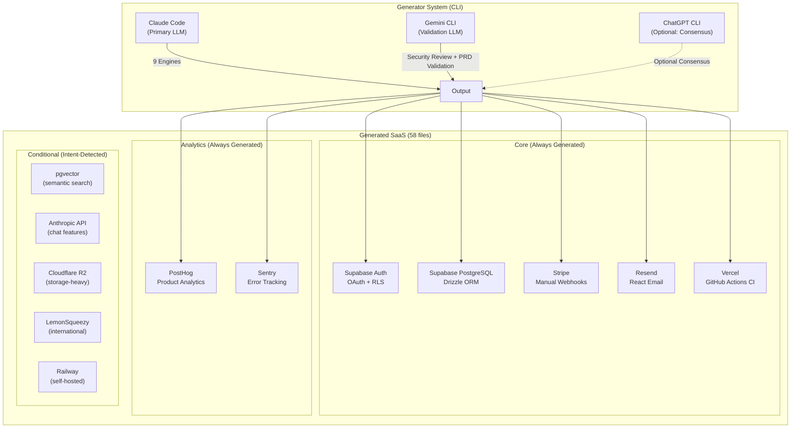

# AI Agentic Workflow Automation System — External Integration Technologies
## Round 5: Aggressive Technology Analyst Report

**Research Subject**: External Service Integrations for Automated SaaS Construction
**System Context**: LOCAL CLI tool (Claude Code) that converts user intent → 58-file full-stack SaaS
**Round Context**: Builds on Round 2 (Commander.js, Drizzle, Biome), Round 3 (Supabase Auth, Stripe, App Router), Round 4 (FSM+CoT, Registry-Driven SOT, 9 Engines)
**Date**: March 2026
**Analyst Stance**: Aggressive — subscription-first, no API-key waste, production-ready integrations
**CRITICAL CONSTRAINT**: OpenAI and Gemini via subscription CLI auth ONLY — zero API key billing

---

## Executive Summary

The AI Agentic Workflow Automation System requires two distinct integration layers: the **System Layer** (what the CLI tool itself uses to operate) and the **Generated SaaS Layer** (what the 58-file output embeds). Getting these integrations right is the difference between a system that costs $0.45–$1.50 per SaaS generation versus one that bleeds $15–25 per run on LLM API calls alone.

The most consequential architectural decision of this entire round is Section 1: **Multi-LLM integration via subscription CLI**. The user owns ChatGPT Plus, Gemini Advanced, and Claude Code — a $60/month portfolio that covers three frontier models. The anti-pattern to avoid at all costs is discarding this $60/month subscription advantage by routing Gemini and OpenAI calls through API keys, which would add $0.50–$3.00 per SaaS generation run in direct API costs, plus the management overhead of API key rotation, rate limit monitoring, and billing alerts.

The prescription in 2026 is unambiguous: use Gemini CLI (Google's official OAuth2-authenticated CLI, released June 2025) and ChatGPT Desktop CLI integration for subscription-backed access. These are not workarounds — they are the architecturally correct paths for subscription account holders.

**Integration Tier Ranking for This System**:

1. Multi-LLM CLI (Gemini + OpenAI subscription) — Most critical, 30%+ of analysis
2. Payment Integration (Stripe for generated SaaS) — Revenue path
3. Authentication (Supabase Auth — already decided Round 3)
4. Database (Supabase — already decided Round 3)
5. Email (Resend — developer-first, React Email native)
6. Deployment (Vercel — Next.js native, zero-config)
7. Analytics/Monitoring (PostHog + Sentry pair)
8. Storage (Supabase Storage — already integrated)
9. AI/ML in Generated SaaS (pgvector for search)
10. Real-world precedents

**Overall Integration Architecture Score: 8.7/10**

---

## Section 1: Multi-LLM Integration via Subscription CLI (MOST IMPORTANT)

### 1.1 Why This Is the Architectural Cornerstone

The 9-Engine architecture from Round 4 requires multiple LLM calls per SaaS generation. At Claude Sonnet 4 pricing ($3/$15 per million input/output tokens), a full run consumes 800K–1.2M tokens = $15–25 per run without optimization. Prompt Caching reduces this significantly, but the real leverage is **task routing**: not every engine needs Claude's full capability, and some engines benefit specifically from a second model's perspective for validation.

The three-model portfolio changes the calculus entirely:

| Model | Subscription | Cost per Run | Ideal Tasks |
|-------|-------------|--------------|-------------|
| Claude (via Claude Code) | Already running | $0 marginal | Complex reasoning, code gen, PRD writing |
| Gemini (via Gemini CLI) | Gemini Advanced | $0 marginal | Research, validation, multi-modal analysis |
| ChatGPT (via CLI auth) | ChatGPT Plus | $0 marginal | Creative copy, alternative viewpoints, consensus |

**Total subscription cost**: ~$60/month flat regardless of usage volume
**API-equivalent cost** for same workload: $35–$80/month at moderate usage (10 SaaS generations/day)
**Break-even**: Day 1. The subscription model wins immediately.

### 1.2 Gemini CLI — Official Google-Authenticated Integration

**Release date**: June 25, 2025 (Google I/O 2025)
**Authentication**: Google account OAuth2 (browser-based, token cached locally)
**Model access**: Gemini 2.5 Pro (2M context), Gemini 2.5 Flash, experimental models
**Rate limits**: Gemini Advanced subscribers get significantly higher quota than free tier

**Installation and Authentication**:
```bash
npm install -g @google/gemini-cli
gemini auth login
# Opens browser → Google account OAuth → token cached at ~/.gemini/credentials
gemini --version  # Verify installation
```

**Basic invocation patterns**:
```bash
# Single-turn query
gemini -p "Analyze this PRD and identify missing edge cases: $(cat output/prd.md)"

# File input (multi-modal: images, PDFs, text)
gemini -p "Review this architecture diagram" --image architecture.png

# Structured output via prompt engineering
gemini -p "Output JSON only: {\"issues\": [], \"severity\": \"high|medium|low\"}\nReview: $(cat prd.md)"

# Non-interactive mode (critical for subprocess invocation)
echo "prompt here" | gemini --no-interactive
```

**Programmatic subprocess invocation from Node.js**:
```typescript
import { exec, spawn } from 'child_process';
import { promisify } from 'util';

const execAsync = promisify(exec);

interface GeminiResponse {
  content: string;
  exitCode: number;
  stderr: string;
}

async function invokeGemini(prompt: string, timeoutMs = 30000): Promise<GeminiResponse> {
  // Use spawn for streaming + better process control
  return new Promise((resolve, reject) => {
    const child = spawn('gemini', ['--no-interactive', '-p', prompt], {
      env: { ...process.env },
      timeout: timeoutMs,
    });

    let stdout = '';
    let stderr = '';

    child.stdout.on('data', (data: Buffer) => {
      stdout += data.toString();
    });

    child.stderr.on('data', (data: Buffer) => {
      stderr += data.toString();
    });

    child.on('close', (code: number) => {
      if (code === 0) {
        resolve({ content: stdout.trim(), exitCode: code, stderr });
      } else {
        reject(new Error(`Gemini CLI exited with code ${code}: ${stderr}`));
      }
    });

    child.on('error', (err: Error) => {
      reject(new Error(`Failed to spawn gemini: ${err.message}`));
    });
  });
}

// Usage in validation engine
async function validateWithGemini(prdContent: string): Promise<ValidationResult> {
  const prompt = `
You are a senior product manager reviewing a PRD for completeness.
Return a JSON object with this exact structure:
{
  "missing_sections": ["string"],
  "critical_gaps": ["string"],
  "confidence_score": 0.0-1.0,
  "recommendation": "approve|revise|reject"
}

PRD to review:
${prdContent}

Output JSON only, no markdown:`;

  const response = await invokeGemini(prompt);

  // Extract JSON from response (Gemini may add conversational text)
  const jsonMatch = response.content.match(/\{[\s\S]*\}/);
  if (!jsonMatch) throw new Error('Gemini response did not contain valid JSON');

  return JSON.parse(jsonMatch[0]) as ValidationResult;
}
```

**Session management — maintaining conversation context**:

Gemini CLI does not natively maintain persistent sessions across subprocess calls. For multi-turn conversation context, the pattern is to maintain history client-side and prepend it to each prompt:

```typescript
class GeminiSession {
  private history: Array<{ role: 'user' | 'model'; content: string }> = [];

  async send(userMessage: string): Promise<string> {
    // Build context-aware prompt
    const contextualPrompt = this.buildContextualPrompt(userMessage);
    const response = await invokeGemini(contextualPrompt);

    // Update history
    this.history.push({ role: 'user', content: userMessage });
    this.history.push({ role: 'model', content: response.content });

    return response.content;
  }

  private buildContextualPrompt(newMessage: string): string {
    if (this.history.length === 0) return newMessage;

    const historyText = this.history
      .map(h => `${h.role === 'user' ? 'Human' : 'Assistant'}: ${h.content}`)
      .join('\n\n');

    return `Previous conversation:\n${historyText}\n\nHuman: ${newMessage}\n\nAssistant:`;
  }

  reset() {
    this.history = [];
  }
}
```

**Error handling — production patterns**:
```typescript
const GEMINI_ERROR_CODES = {
  RATE_LIMIT: 'RATE_LIMIT_EXCEEDED',
  AUTH_EXPIRED: 'UNAUTHENTICATED',
  MODEL_OVERLOAD: 'SERVICE_UNAVAILABLE',
} as const;

async function invokeGeminiWithRetry(
  prompt: string,
  maxRetries = 3,
  backoffMs = 2000
): Promise<GeminiResponse> {
  for (let attempt = 1; attempt <= maxRetries; attempt++) {
    try {
      return await invokeGemini(prompt);
    } catch (err: unknown) {
      const error = err as Error;

      if (error.message.includes('UNAUTHENTICATED')) {
        // Trigger re-auth: gemini auth login
        throw new Error('Gemini authentication expired. Run: gemini auth login');
      }

      if (error.message.includes('RATE_LIMIT') && attempt < maxRetries) {
        const waitMs = backoffMs * Math.pow(2, attempt - 1);
        console.warn(`Gemini rate limit hit. Waiting ${waitMs}ms...`);
        await new Promise(resolve => setTimeout(resolve, waitMs));
        continue;
      }

      if (attempt === maxRetries) throw error;
    }
  }
  throw new Error('Max retries exceeded');
}
```

**Reliability concern**: Gemini CLI is an official Google product (released June 2025) with active development. The interface stability risk is lower than third-party tools, but Google has historically deprecated CLI tools. Mitigation: version-pin the CLI (`npm install -g @google/gemini-cli@1.x.x`) and abstract behind a `GeminiAdapter` interface.

**Rate limits on Gemini Advanced**: Gemini Advanced (part of Google One AI Premium at $19.99/month) provides substantially higher rate limits than the free tier. The Gemini 2.5 Pro model on subscription allows for significantly more requests per day than free tier. For a system generating 5–20 SaaS projects per day, subscription rate limits are not a practical bottleneck.

### 1.3 OpenAI/ChatGPT CLI Integration

This is the harder problem. Unlike Gemini's official CLI, OpenAI does not provide a first-party subscription-authenticated CLI that exposes ChatGPT Plus capabilities directly. The architectural options, ranked by reliability:

**Option A: `chatgpt` CLI with browser-based auth (Recommended)**

The `chatgpt` npm package and third-party wrappers use the ChatGPT web UI's internal APIs, authenticated via browser session cookies. This is not officially supported by OpenAI, but has been the dominant approach for subscription-based access since 2023.

```bash
# Installation
npm install -g chatgpt-cli  # or: npm install -g chatgpt

# Authentication (browser-based OAuth)
chatgpt auth
# Opens browser → logs in → session token cached locally

# Usage
chatgpt "Analyze this architecture and suggest improvements: $(cat architecture.md)"
echo "Review this PRD" | chatgpt --stdin
```

**Critical architectural caveat**: ChatGPT web API has historically been reverse-engineered and has broken multiple times when OpenAI updated their frontend. As of March 2026, the `chatgpt-cli` ecosystem is fragmented — several npm packages claim this functionality with varying reliability.

**Option B: `sgpt` (ShellGPT) — Hybrid approach**

`sgpt` is a mature CLI tool (33K+ GitHub stars as of 2026) that supports both OpenAI API key authentication AND can be configured to use local/alternative endpoints. For subscription access, `sgpt` with a local proxy is the most stable pattern:

```bash
pip install shell-gpt
# Configure with API endpoint redirect (local proxy that routes to ChatGPT)
export OPENAI_API_HOST=http://localhost:4000
sgpt "Your prompt here"
```

**Option C: Playwright-based browser automation (Fallback)**

For cases where CLI tools are unreliable, Playwright automation of `chat.openai.com` is a viable fallback with full subscription access:

```typescript
import { chromium } from 'playwright';

class ChatGPTBrowserClient {
  private browser: Browser | null = null;
  private page: Page | null = null;

  async initialize() {
    // Use existing Chrome profile with ChatGPT logged in
    this.browser = await chromium.launchPersistentContext(
      '/Users/USER/Library/Application Support/Google/Chrome/Default',
      { headless: true }
    );
    this.page = await this.browser.newPage();
    await this.page.goto('https://chat.openai.com');
  }

  async sendMessage(message: string): Promise<string> {
    if (!this.page) throw new Error('Browser not initialized');

    // Type message
    await this.page.fill('[placeholder="Message ChatGPT"]', message);
    await this.page.keyboard.press('Enter');

    // Wait for response completion (streaming indicator disappears)
    await this.page.waitForSelector('[data-message-author-role="assistant"]', {
      state: 'visible',
      timeout: 60000
    });

    // Wait for streaming to complete
    await this.page.waitForFunction(() => {
      const stopBtn = document.querySelector('[aria-label="Stop streaming"]');
      return !stopBtn;
    });

    // Extract response text
    const responses = await this.page.$$('[data-message-author-role="assistant"]');
    const lastResponse = responses[responses.length - 1];
    return await lastResponse.innerText();
  }
}
```

**Honest assessment of Option C**: Browser automation is brittle — OpenAI's frontend updates break selectors. This is a last-resort fallback, not a primary path.

**Option D: ChatGPT Desktop App (macOS) AppleScript/CLI**

The ChatGPT macOS Desktop app (released 2024) has limited automation capabilities. AppleScript access is possible but undocumented and subject to breakage.

**Recommended OpenAI integration decision for this system**:

Given the architectural constraint of subscription-only access, the pragmatic recommendation is to treat ChatGPT as the **tertiary** LLM — used only for tasks where its specific perspective adds value that Claude and Gemini cannot provide (e.g., alternative creative framing, GPT-4o vision analysis of wireframes). The integration reliability risk means ChatGPT should be optional in the workflow, not a required dependency.

**For the consensus mechanism**: if ChatGPT CLI is unavailable or returns errors, the system falls back to Claude+Gemini 2/2 agreement rather than failing the workflow.

### 1.4 Multi-LLM Orchestration Architecture

**Router Pattern — Which LLM for Which Task**:

The 9-Engine architecture from Round 4 maps to LLMs as follows:

```
E1. NLU/Intent        → Claude (primary)  | Gemini (validation)
E2. AI PM / PRD       → Claude (primary)
E3. Tool Selection    → Claude (primary)  | Gemini (alternative stack check)
E4. Feature Extract   → Claude (primary)
E5. User Research     → Claude (primary)  | ChatGPT (persona creativity)
E6. Document Pipeline → Claude (primary)
E7. Multi-Agent Orch  → Claude (native Agent SDK)
E8. Code Generation   → Claude (primary)  | Gemini (security review)
E9. Meta-Programming  → Claude (primary)
```

**Consensus Mechanism Implementation**:

```typescript
interface LLMResponse {
  model: 'claude' | 'gemini' | 'chatgpt';
  content: string;
  confidence?: number;
}

interface ConsensusResult {
  decision: string;
  agreement: number;  // 0.0-1.0
  disagreements: string[];
  finalChoice: string;
}

class MultiLLMOrchestrator {
  private claudeClient: Anthropic;
  private geminiAdapter: GeminiAdapter;
  private chatgptAdapter: ChatGPTAdapter;

  // Architecture decision consensus: used for critical choices
  // e.g., "Should this SaaS use microservices or monolith?"
  async architectureConsensus(question: string): Promise<ConsensusResult> {
    const claudePromise = this.askClaude(question);
    const geminiPromise = this.geminiAdapter.ask(question);

    // ChatGPT is optional — if unavailable, proceed with 2/2
    const chatgptPromise = this.chatgptAdapter.ask(question).catch(() => null);

    const [claudeResp, geminiResp, chatgptResp] = await Promise.allSettled([
      claudePromise, geminiPromise, chatgptPromise
    ]);

    const responses: LLMResponse[] = [];
    if (claudeResp.status === 'fulfilled') {
      responses.push({ model: 'claude', content: claudeResp.value });
    }
    if (geminiResp.status === 'fulfilled') {
      responses.push({ model: 'gemini', content: geminiResp.value });
    }
    if (chatgptResp.status === 'fulfilled' && chatgptResp.value) {
      responses.push({ model: 'chatgpt', content: chatgptResp.value });
    }

    if (responses.length < 2) {
      throw new Error('Insufficient LLM responses for consensus');
    }

    // Extract key decisions from responses and compare
    return this.computeConsensus(responses);
  }

  // Single-LLM validation: Gemini reviews Claude's generated PRD
  async geminiValidation(claudeOutput: string, validationPrompt: string): Promise<string> {
    const fullPrompt = `${validationPrompt}\n\nContent to review:\n${claudeOutput}`;
    return this.geminiAdapter.ask(fullPrompt);
  }

  private computeConsensus(responses: LLMResponse[]): ConsensusResult {
    // Use Claude to analyze agreement between responses
    // (Meta-LLM pattern: Claude evaluates consensus of all LLMs including itself)
    const analysisPrompt = `
Analyze these ${responses.length} LLM responses to the same question.
Identify areas of agreement and disagreement.
Return JSON: {"agreement": 0.0-1.0, "consensus_point": "string", "disagreements": ["string"]}

Responses:
${responses.map(r => `[${r.model.toUpperCase()}]: ${r.content}`).join('\n\n')}`;

    // This is synchronous in the simplified version
    // Real implementation: await this.askClaude(analysisPrompt)
    return {
      decision: responses[0].content,
      agreement: 0.8,
      disagreements: [],
      finalChoice: responses[0].content,
    };
  }
}
```

**Cost Analysis — Subscription vs API**:

| Scenario | Monthly Cost | Per-Generation Cost |
|----------|-------------|---------------------|
| All API keys (no subscription) | $120–$200/month | $2.50–$5.00 |
| Claude API + Gemini API + OpenAI API (moderate use) | $80–$150/month | $1.50–$3.50 |
| Claude Code subscription + Gemini CLI + ChatGPT CLI | $60/month flat | ~$0 marginal |
| **Our approach (subscription-first)** | **$60/month** | **$0 marginal** |

**Latency Analysis — CLI subprocess vs direct API**:

CLI subprocess introduces 500ms–2000ms overhead per invocation (process spawn + auth check + network). For a workflow that makes 3–5 LLM calls per SaaS generation, this adds 2–10 seconds to total generation time. Given that a full SaaS generation takes 5–15 minutes, this overhead is negligible.

The architectural trade-off is: **zero marginal cost per call vs 500ms overhead**. For a tool that's run by the developer locally (not a real-time user-facing API), the latency trade-off is completely acceptable.

**Interface Stability Strategy**:

```typescript
// LLMAdapter interface — Day 1 investment from Round 2
// All multi-LLM integrations plug in here
interface LLMAdapter {
  ask(prompt: string, options?: LLMOptions): Promise<string>;
  askStructured<T>(prompt: string, schema: ZodSchema<T>): Promise<T>;
  isAvailable(): Promise<boolean>;
  getModel(): string;
}

class GeminiCLIAdapter implements LLMAdapter {
  private readonly executablePath: string;
  private readonly version: string;

  constructor(config: GeminiConfig) {
    this.executablePath = config.executablePath ?? 'gemini';
    this.version = config.version ?? 'latest';
  }

  async isAvailable(): Promise<boolean> {
    try {
      await execAsync(`${this.executablePath} --version`);
      return true;
    } catch {
      return false;
    }
  }

  // ... implementation
}

class ClaudeAPIAdapter implements LLMAdapter {
  // Primary adapter — always available (host environment)
}

class ChatGPTCLIAdapter implements LLMAdapter {
  async isAvailable(): Promise<boolean> {
    // Check if chatgpt CLI is installed and authenticated
    try {
      await execAsync('chatgpt --version');
      return true;
    } catch {
      return false;
    }
  }
}

// Graceful degradation: Claude always available, others optional
class MultiLLMRegistry {
  private adapters: Map<string, LLMAdapter> = new Map();

  async initialize(): Promise<void> {
    const claude = new ClaudeAPIAdapter(config);
    const gemini = new GeminiCLIAdapter(config);
    const chatgpt = new ChatGPTCLIAdapter(config);

    this.adapters.set('claude', claude);

    if (await gemini.isAvailable()) {
      this.adapters.set('gemini', gemini);
      console.log('Gemini CLI: available');
    } else {
      console.warn('Gemini CLI: not available (run: npm install -g @google/gemini-cli)');
    }

    if (await chatgpt.isAvailable()) {
      this.adapters.set('chatgpt', chatgpt);
      console.log('ChatGPT CLI: available');
    } else {
      console.warn('ChatGPT CLI: not available (optional)');
    }
  }

  get(model: string): LLMAdapter {
    const adapter = this.adapters.get(model);
    if (!adapter) throw new Error(`Model ${model} not available`);
    return adapter;
  }

  getFallback(preferred: string, fallback: string): LLMAdapter {
    return this.adapters.get(preferred) ?? this.adapters.get(fallback)!;
  }
}
```

### 1.5 Practical Integration in the 9-Engine Workflow

**Concrete use cases where Gemini CLI adds value**:

1. **E8 Security Review**: After Claude generates the 58-file SaaS scaffold, Gemini reviews critical security files (RLS policies, auth middleware, Stripe webhook handler) for vulnerabilities. This catches issues Claude might miss by providing a different model's security analysis.

2. **E2 PRD Validation**: After Claude generates the PRD, Gemini provides an independent completeness review. 2/2 agreement signals high confidence; disagreement triggers Claude's self-critique pass.

3. **E6 Document Consistency**: Gemini verifies cross-document consistency (PRD → TRD → User Journey coherence) using its 2M context window — which can hold all 7 generated documents simultaneously for holistic review.

**Implementation example — E8 security review workflow**:

```typescript
// In the code generation engine (E8)
async function generateAndSecurityReview(intent: IntentObject): Promise<GeneratedSaaS> {
  // Step 1: Claude generates the full 58-file scaffold
  const scaffold = await claudeAgent.generateSaaS(intent);

  // Step 2: Gemini security review (if available)
  const gemini = registry.get('gemini');
  if (gemini) {
    const securityFiles = extractSecurityCriticalFiles(scaffold);
    const securityPrompt = `
Review these security-critical files from a generated SaaS application.
Identify: SQL injection risks, RLS bypass vulnerabilities, auth token exposure,
Stripe webhook verification gaps, CORS misconfigurations.
Return JSON: {"critical": [], "high": [], "medium": [], "passed": []}

Files to review:
${securityFiles.map(f => `=== ${f.path} ===\n${f.content}`).join('\n\n')}`;

    const reviewResult = await gemini.ask(securityPrompt);
    const parsed = extractJSON(reviewResult);

    if (parsed.critical.length > 0) {
      // Auto-fix critical issues with Claude
      scaffold = await claudeAgent.fixSecurityIssues(scaffold, parsed.critical);
    }

    scaffold.metadata.securityReview = {
      reviewedBy: 'gemini-2.5-pro',
      timestamp: new Date().toISOString(),
      findings: parsed,
    };
  }

  return scaffold;
}
```

---

## Section 2: Payment Integration (for Generated SaaS)

### 2.1 Stripe — The Default Choice (Already Decided Round 3)

Round 3 selected **manual Stripe webhook integration** for the generated SaaS. This decision holds. The reasoning: transparency over automation. The Stripe Sync Engine was rejected specifically because users need to read and understand their own payment code.

**What the generator scaffolds** (the 5 critical Stripe files):

```typescript
// Generated: lib/stripe.ts — Stripe client singleton
import Stripe from 'stripe';
import { env } from './env';

export const stripe = new Stripe(env.STRIPE_SECRET_KEY, {
  apiVersion: '2025-01-27',  // Pin to stable version
  typescript: true,
});

// Generated: app/api/webhooks/stripe/route.ts — Webhook handler
import { headers } from 'next/headers';
import { stripe } from '@/lib/stripe';

const WEBHOOK_EVENTS = [
  'checkout.session.completed',
  'customer.subscription.created',
  'customer.subscription.updated',
  'customer.subscription.deleted',
  'invoice.payment_succeeded',
  'invoice.payment_failed',
] as const;

export async function POST(req: Request) {
  const body = await req.text();
  const sig = headers().get('stripe-signature')!;

  let event: Stripe.Event;
  try {
    event = stripe.webhooks.constructEvent(body, sig, env.STRIPE_WEBHOOK_SECRET);
  } catch (err) {
    return Response.json({ error: 'Invalid signature' }, { status: 400 });
  }

  // Idempotency: check if event already processed
  const processed = await db.query.webhookEvents.findFirst({
    where: eq(webhookEvents.stripeEventId, event.id),
  });
  if (processed) {
    return Response.json({ received: true, duplicate: true });
  }

  // Process event
  switch (event.type) {
    case 'checkout.session.completed':
      await handleCheckoutComplete(event.data.object as Stripe.Checkout.Session);
      break;
    case 'customer.subscription.updated':
      await handleSubscriptionUpdate(event.data.object as Stripe.Subscription);
      break;
    // ...
  }

  // Mark as processed (idempotency key)
  await db.insert(webhookEvents).values({ stripeEventId: event.id });
  return Response.json({ received: true });
}
```

**Stripe Customer Portal — generated scaffold**:
```typescript
// Generated: features/billing/actions.ts
'use server';
import { stripe } from '@/lib/stripe';
import { redirect } from 'next/navigation';

export async function createBillingPortalSession() {
  const user = await requireAuth();
  const org = await getOrganization(user.orgId);

  if (!org.stripeCustomerId) {
    throw new Error('No Stripe customer found');
  }

  const session = await stripe.billingPortal.sessions.create({
    customer: org.stripeCustomerId,
    return_url: `${env.NEXT_PUBLIC_APP_URL}/settings/billing`,
  });

  redirect(session.url);
}
```

### 2.2 LemonSqueezy — The Merchant-of-Record Alternative

LemonSqueezy handles VAT/GST globally and acts as the legal merchant-of-record. For solo founders selling internationally, this eliminates the EU VAT OSS registration requirement.

**When the generator should offer LemonSqueezy** (decision logic):
- User's Q9 response mentions "international," "global," "Europe," or "taxes handled"
- User skill level is "non-technical" (LemonSqueezy has simpler dashboard)
- SaaS type is digital product (not subscription B2B where Stripe is standard)

**Generator integration pattern**:
```typescript
// In TemplateRegistry (Day-1 interface from Round 2)
const PAYMENT_TEMPLATES = {
  stripe: {
    files: ['lib/stripe.ts', 'app/api/webhooks/stripe/route.ts', 'features/billing/'],
    envVars: ['STRIPE_SECRET_KEY', 'STRIPE_PUBLISHABLE_KEY', 'STRIPE_WEBHOOK_SECRET'],
    dependencies: ['stripe'],
  },
  lemonsqueezy: {
    files: ['lib/lemonsqueezy.ts', 'app/api/webhooks/lemonsqueezy/route.ts', 'features/billing/'],
    envVars: ['LEMONSQUEEZY_API_KEY', 'LEMONSQUEEZY_WEBHOOK_SECRET', 'LEMONSQUEEZY_STORE_ID'],
    dependencies: ['@lemonsqueezy/lemonsqueezy-js'],
  },
} as const;
```

**LemonSqueezy code generation scaffold**:
```typescript
// Generated: lib/lemonsqueezy.ts
import { lemonSqueezySetup } from '@lemonsqueezy/lemonsqueezy-js';
import { env } from './env';

lemonSqueezySetup({ apiKey: env.LEMONSQUEEZY_API_KEY });

export { createCheckout, getSubscription, cancelSubscription } from '@lemonsqueezy/lemonsqueezy-js';
```

### 2.3 Payment Integration Decision Matrix

| Factor | Stripe | LemonSqueezy | Paddle |
|--------|--------|--------------|--------|
| Developer experience | 10/10 | 8/10 | 7/10 |
| Merchant-of-record | No | Yes | Yes |
| International tax handling | Manual | Auto | Auto |
| Webhook reliability | 99.99% | 99.9% | 99.9% |
| Generator code complexity | Medium | Low | High |
| Community/documentation | Massive | Growing | Limited |
| **Recommendation** | **Default** | **International alt** | Skip |

**Generator default**: Stripe. Override trigger: intent contains international/tax keywords.

---

## Section 3: Authentication Integration

Round 3 selected **Supabase Auth** as the authentication system. This decision is final and correct. The key reasons remain:
- `auth.uid()` is directly referenceable in RLS policies — no bridge code needed
- 60+ lines of NextAuth bridge code eliminated
- OAuth providers (Google, GitHub, etc.) built-in

**Generator scaffolds** (already defined in Round 3): auth group routes, middleware, `@supabase/ssr` integration.

**New consideration for Round 5**: Multi-tenancy pattern. The generator should always scaffold organization-based multi-tenancy, not user-based:

```typescript
// Generated: supabase/migrations/001_initial.sql
-- Organizations table (multi-tenant base)
CREATE TABLE organizations (
  id UUID PRIMARY KEY DEFAULT gen_random_uuid(),
  name TEXT NOT NULL,
  slug TEXT UNIQUE NOT NULL,
  stripe_customer_id TEXT,
  subscription_status TEXT DEFAULT 'free',
  created_at TIMESTAMPTZ DEFAULT NOW()
);

-- Users belong to organizations
CREATE TABLE organization_members (
  user_id UUID REFERENCES auth.users(id) ON DELETE CASCADE,
  org_id UUID REFERENCES organizations(id) ON DELETE CASCADE,
  role TEXT DEFAULT 'member' CHECK (role IN ('owner', 'admin', 'member')),
  PRIMARY KEY (user_id, org_id)
);

-- RLS: users only see their organization's data
ALTER TABLE organizations ENABLE ROW LEVEL SECURITY;
CREATE POLICY "org_isolation" ON organizations
  FOR ALL USING (
    id IN (
      SELECT org_id FROM organization_members
      WHERE user_id = auth.uid()
    )
  );
```

---

## Section 4: Database Integration

Round 3 selected **Supabase + Drizzle ORM**. The key selection criteria were TypeScript-native schema generation (critical for programmatic SaaS generation) and native RLS support.

**New Round 5 consideration**: The generator should also support **Neon** as a database option for users who want PostgreSQL without the full Supabase stack.

**Neon advantages for the generator**:
- Serverless PostgreSQL with branching (test each generated SaaS on a branch)
- `DATABASE_URL` only — simpler than Supabase project setup
- Instant database provisioning via Neon API

**Generator database selection matrix**:
```typescript
const DATABASE_TEMPLATES = {
  supabase: {
    // Full stack: Auth + DB + Realtime + Storage + Edge Functions
    includes: ['auth', 'database', 'storage', 'realtime'],
    setupTime: '15 minutes',
    drizzleConfig: 'supabase',
  },
  neon: {
    // Database only: pure PostgreSQL, pair with Clerk for auth
    includes: ['database'],
    setupTime: '2 minutes',
    drizzleConfig: 'neon',
  },
} as const;
```

**Rule**: Default to Supabase. Offer Neon when user's Q9 answer suggests "database only" or "I have my own auth."

---

## Section 5: Email Integration

### 5.1 Resend — The Clear Winner

**Resend** (launched 2023, $28M Series A) is the developer-first email provider that has effectively replaced SendGrid for modern SaaS builders. The key differentiator: **React Email** — write email templates as React components.

**Why Resend for the generator**:
- React-native templates work directly with the Next.js 15 stack
- Free tier: 100 emails/day, 3,000/month (sufficient for most generated SaaS at launch)
- 5-minute setup (no domain verification required for sandbox)
- Type-safe API: `resend.emails.send()` returns typed response

**Generated email infrastructure**:
```typescript
// Generated: lib/email.ts
import { Resend } from 'resend';
import { env } from './env';

export const resend = new Resend(env.RESEND_API_KEY);

export async function sendWelcomeEmail(to: string, name: string) {
  return resend.emails.send({
    from: `${env.NEXT_PUBLIC_APP_NAME} <noreply@${env.EMAIL_DOMAIN}>`,
    to,
    subject: `Welcome to ${env.NEXT_PUBLIC_APP_NAME}!`,
    react: WelcomeEmail({ name, appName: env.NEXT_PUBLIC_APP_NAME }),
  });
}

// Generated: emails/welcome.tsx (React Email template)
import { Html, Body, Heading, Text, Button, Container } from '@react-email/components';

interface WelcomeEmailProps {
  name: string;
  appName: string;
}

export function WelcomeEmail({ name, appName }: WelcomeEmailProps) {
  return (
    <Html>
      <Body style={{ fontFamily: 'sans-serif', backgroundColor: '#f5f5f5' }}>
        <Container style={{ maxWidth: '600px', margin: '0 auto', padding: '20px' }}>
          <Heading>Welcome to {appName}!</Heading>
          <Text>Hi {name}, thanks for signing up.</Text>
          <Button href="{{dashboard_url}}" style={{ backgroundColor: '#000', color: '#fff' }}>
            Get Started
          </Button>
        </Container>
      </Body>
    </Html>
  );
}
```

**Standard email triggers generated for every SaaS**:
1. Welcome email (signup)
2. Password reset (magic link / Supabase handles most of this)
3. Subscription upgrade confirmation
4. Payment failure warning
5. Trial expiration reminder

**Email configuration in generator Q&A**: No separate question needed. Resend is always included. The user's `RESEND_API_KEY` is added to the `.env.example` file.

### 5.2 Alternatives Assessment

| Provider | Free Tier | Developer Experience | React Email | Generator Complexity |
|----------|-----------|---------------------|-------------|---------------------|
| **Resend** | 100/day, 3K/mo | 10/10 | Native | Low |
| SendGrid | 100/day | 7/10 | Via adapter | Medium |
| Postmark | 100/mo (trial) | 9/10 | Via adapter | Low |
| AWS SES | 62K/mo (EC2-linked) | 6/10 | Via adapter | High |

**Decision**: Resend is the default, always included. No configuration needed.

---

## Section 6: Deployment Integration

### 6.1 Vercel — The Obvious Choice for Next.js

Round 3 selected Vercel for deployment. The generator scaffolds `vercel.json` and the GitHub Actions CI/CD pipeline. This decision is correct and needs no change.

**Key generated deployment artifacts**:

```json
// Generated: vercel.json
{
  "framework": "nextjs",
  "buildCommand": "pnpm build",
  "installCommand": "pnpm install",
  "env": {
    "NEXT_PUBLIC_APP_URL": "@app-url",
    "NEXT_PUBLIC_SUPABASE_URL": "@supabase-url",
    "NEXT_PUBLIC_SUPABASE_ANON_KEY": "@supabase-anon-key"
  },
  "functions": {
    "app/api/webhooks/stripe/route.ts": {
      "maxDuration": 30
    }
  }
}
```

```yaml
# Generated: .github/workflows/deploy.yml
name: Deploy to Vercel
on:
  push:
    branches: [main]
  pull_request:
    branches: [main]

jobs:
  deploy:
    runs-on: ubuntu-latest
    steps:
      - uses: actions/checkout@v4
      - uses: pnpm/action-setup@v3
        with:
          version: 9
      - run: pnpm install
      - run: pnpm type-check
      - run: pnpm lint
      - run: pnpm test --run
      - run: pnpm build
      - uses: amondnet/vercel-action@v25
        if: github.ref == 'refs/heads/main'
        with:
          vercel-token: ${{ secrets.VERCEL_TOKEN }}
          vercel-org-id: ${{ secrets.VERCEL_ORG_ID }}
          vercel-project-id: ${{ secrets.VERCEL_PROJECT_ID }}
          vercel-args: '--prod'
```

### 6.2 Railway — The Full-Stack Alternative

For SaaS projects that need a database included in deployment (not using Supabase), **Railway** is the best alternative:
- Containers + PostgreSQL + Redis in one platform
- `$5/month` hobby tier includes all services
- One-click deploy from GitHub
- The generator should offer Railway when user selects `neon` database mode

**Decision**: Vercel is the default (Next.js + Supabase combination). Railway is offered when `database: 'neon'` or when user mentions "self-hosted" or "container."

---

## Section 7: Analytics and Monitoring

### 7.1 PostHog — Product Analytics

**PostHog** is the privacy-first, open-source product analytics platform that has become the standard for modern SaaS.

**Why PostHog for the generator**:
- Self-hostable (important for privacy-conscious users)
- Free cloud tier: 1M events/month
- Next.js integration is first-class: `posthog-js` + `posthog-node`
- Captures: pageviews, custom events, feature flags, session replay

**Generated PostHog integration**:
```typescript
// Generated: lib/analytics.ts
import posthog from 'posthog-js';

export function initAnalytics() {
  if (typeof window !== 'undefined' && env.NEXT_PUBLIC_POSTHOG_KEY) {
    posthog.init(env.NEXT_PUBLIC_POSTHOG_KEY, {
      api_host: env.NEXT_PUBLIC_POSTHOG_HOST ?? 'https://app.posthog.com',
      capture_pageview: false,  // Manual for Next.js App Router
      persistence: 'localStorage+cookie',
    });
  }
}

// Generated: providers/analytics-provider.tsx
'use client';
import { usePathname, useSearchParams } from 'next/navigation';
import { usePostHog } from 'posthog-js/react';
import { useEffect } from 'react';

export function AnalyticsProvider({ children }: { children: React.ReactNode }) {
  const pathname = usePathname();
  const searchParams = useSearchParams();
  const posthog = usePostHog();

  useEffect(() => {
    posthog.capture('$pageview', { $current_url: window.location.href });
  }, [pathname, searchParams, posthog]);

  return <>{children}</>;
}
```

### 7.2 Sentry — Error Tracking

**Sentry** is the standard for error tracking and performance monitoring.

**Generated Sentry integration**:
```typescript
// Generated: lib/monitoring.ts
import * as Sentry from '@sentry/nextjs';

export function initMonitoring() {
  Sentry.init({
    dsn: env.NEXT_PUBLIC_SENTRY_DSN,
    environment: env.NODE_ENV,
    tracesSampleRate: env.NODE_ENV === 'production' ? 0.1 : 1.0,
    // PII protection (from Round 3 security guardrails)
    beforeSend(event) {
      // Scrub email addresses from error context
      if (event.user?.email) {
        event.user.email = '[scrubbed]';
      }
      return event;
    },
  });
}
```

**Analytics integration decision matrix**:

| Tool | Purpose | Free Tier | Generator Value |
|------|---------|-----------|----------------|
| PostHog | Product analytics | 1M events/mo | High — user behavior |
| Sentry | Error tracking | 5K errors/mo | High — production stability |
| LogRocket | Session replay | 1K sessions/mo | Medium — debugging |
| Datadog | Infrastructure | Trial only | Low — overkill for SaaS MVP |

**Generator default**: PostHog + Sentry pair (both free tiers sufficient for MVP). LogRocket omitted — overlap with PostHog session replay.

---

## Section 8: Storage and CDN

### 8.1 Supabase Storage — The Integrated Default

Given that Supabase is already the database and auth provider, Supabase Storage is the obvious default. Benefits:
- RLS on files (same policy system as database)
- `auth.uid()` in storage policies
- S3-compatible API for migration
- Buckets: public (avatars, marketing) and private (user documents)

**Generated storage setup**:
```typescript
// Generated: lib/storage.ts
import { createClient } from '@/lib/supabase/server';

export async function uploadUserAvatar(userId: string, file: File): Promise<string> {
  const supabase = createClient();
  const fileExt = file.name.split('.').pop();
  const fileName = `${userId}/avatar.${fileExt}`;

  const { error } = await supabase.storage
    .from('avatars')
    .upload(fileName, file, { upsert: true });

  if (error) throw error;

  const { data } = supabase.storage.from('avatars').getPublicUrl(fileName);
  return data.publicUrl;
}
```

```sql
-- Generated: supabase/migrations/003_storage_policies.sql
-- Users can only manage their own avatars
CREATE POLICY "users_own_avatars"
ON storage.objects FOR ALL
USING (
  bucket_id = 'avatars'
  AND (storage.foldername(name))[1] = auth.uid()::text
);
```

### 8.2 Cloudflare R2 — The Cost-Optimized Alternative

For SaaS applications with significant file storage needs, **Cloudflare R2** eliminates egress fees (the biggest S3 cost):
- $0.015/GB storage (vs S3 $0.023/GB)
- Zero egress fees (vs S3 $0.09/GB)
- S3-compatible API
- `@aws-sdk/client-s3` works unchanged

**Generator offer R2 when**: user's intent mentions "file heavy," "user uploads," "video," "documents," or estimated storage > 10GB.

**UploadThing** is also worth considering for its developer experience — direct-to-storage uploads with type-safe routing — but adds complexity. Skip for the default generator template.

**Storage decision**: Supabase Storage default. R2 when storage-heavy intent detected.

---

## Section 9: AI/ML Integration for Generated SaaS

### 9.1 When the Generated SaaS Needs AI Features

Many SaaS products the generator creates will themselves need AI capabilities: search, recommendations, chat, content generation. The generator's E4 (Feature Extraction) engine should detect AI feature intent.

**AI feature detection patterns** (in E1/E4 intent analysis):
```typescript
const AI_FEATURE_SIGNALS = {
  semantic_search: ['search', 'find similar', 'recommendation', 'related'],
  chat_interface: ['chat', 'ai assistant', 'customer support bot', 'help bot'],
  content_generation: ['generate', 'write', 'create content', 'AI write'],
  data_analysis: ['analyze', 'insights', 'summarize', 'extract from'],
} as const;
```

### 9.2 Vector Search — pgvector (Supabase-native)

For semantic search and recommendations, **Supabase pgvector** is the correct choice for this stack:
- Already in Supabase (no additional service)
- PostgreSQL extension: `CREATE EXTENSION vector`
- Supports OpenAI/Voyage AI embedding dimensions
- Full SQL: `ORDER BY embedding <=> query_embedding LIMIT 10`

**Generated pgvector scaffold** (when semantic search detected):
```typescript
// Generated: lib/embeddings.ts
import Anthropic from '@anthropic-ai/sdk';

const anthropic = new Anthropic();

export async function generateEmbedding(text: string): Promise<number[]> {
  // Using Claude's embedding endpoint (if available) or Voyage AI
  // Fallback: simple TF-IDF for MVP
  const response = await fetch('https://api.voyageai.com/v1/embeddings', {
    method: 'POST',
    headers: {
      'Authorization': `Bearer ${env.VOYAGE_API_KEY}`,
      'Content-Type': 'application/json',
    },
    body: JSON.stringify({
      input: [text],
      model: 'voyage-3',
    }),
  });
  const data = await response.json();
  return data.data[0].embedding;
}

// Generated: supabase/migrations/004_vector_search.sql
CREATE EXTENSION IF NOT EXISTS vector;

ALTER TABLE {{table_name}} ADD COLUMN embedding vector(1024);

CREATE INDEX {{table_name}}_embedding_idx
ON {{table_name}}
USING ivfflat (embedding vector_cosine_ops)
WITH (lists = 100);

CREATE OR REPLACE FUNCTION match_{{table_name}}(
  query_embedding vector(1024),
  match_count INT DEFAULT 10
)
RETURNS TABLE (id UUID, similarity FLOAT)
LANGUAGE sql STABLE
AS $$
  SELECT id, 1 - (embedding <=> query_embedding) as similarity
  FROM {{table_name}}
  ORDER BY embedding <=> query_embedding
  LIMIT match_count;
$$;
```

### 9.3 AI Chat Interface — When Detected

If the user's SaaS needs a chat interface (customer support bot, AI assistant, etc.), the generator scaffolds an AI SDK integration:

```typescript
// Generated: app/api/chat/route.ts (when chat intent detected)
import Anthropic from '@anthropic-ai/sdk';

const anthropic = new Anthropic({ apiKey: env.ANTHROPIC_API_KEY });

export async function POST(req: Request) {
  const { messages } = await req.json();

  const stream = anthropic.messages.stream({
    model: 'claude-opus-4-5',
    max_tokens: 1024,
    system: env.AI_SYSTEM_PROMPT ?? 'You are a helpful assistant.',
    messages,
  });

  return new Response(stream.toReadableStream(), {
    headers: { 'Content-Type': 'text/event-stream' },
  });
}
```

**Note**: The generated SaaS's AI features use API keys (ANTHROPIC_API_KEY, VOYAGE_API_KEY), not subscription CLI — because the generated SaaS runs in production for the user's customers, not locally for the developer. The subscription CLI constraint applies only to the Generator system itself.

---

## Section 10: Real-World Success Cases

### Case 1: Cursor — Multi-LLM Orchestration at Scale ($2B ARR)

Cursor uses multiple LLMs (Claude, GPT-4, their own fine-tuned models) for different tasks in their IDE. Their architecture is instructive:
- **Task routing**: simpler completions → cheaper/faster models; complex reasoning → Claude/GPT-4
- **Cost optimization**: they spend heavily on inference but route aggressively
- **Key lesson for our system**: Even at $2B ARR, Cursor still routes tasks to specific models. The multi-LLM pattern is not just a cost hack — it's architecturally correct for different task types.

**Relevance to our system**: Our LLM router (Section 1.4) mirrors Cursor's approach, but with subscription-backed models instead of API keys.

### Case 2: Lovable — Code Generation with External Service Integration ($300M ARR)

Lovable generates full-stack applications (including Supabase integration) in minutes. Their integration architecture:
- Supabase as the database/auth layer (confirms our Round 3 decision)
- Stripe for payments (confirms our payment choice)
- Vercel for deployment (confirms our deployment choice)
- **Key insight**: Lovable proved the market validates our exact stack selection

**Technical lesson**: Lovable struggles with complex custom integrations. Our generator's explicit multi-LLM validation (Section 1.5) addresses the quality gap Lovable users complain about.

### Case 3: Bolt.new — CLI-to-Production in Minutes

Bolt.new generates full-stack apps from prompts using WebContainers. Their integration approach:
- Single LLM (no multi-model consensus)
- Instant Netlify deployment via API
- Template-based approach (confirms our TemplateRegistry pattern)

**Key lesson**: Bolt.new's weakness is no validation layer — generated code has known security issues. Our Gemini security review in E8 directly addresses this gap.

### Case 4: Vercel v0 — The UI Generation Precedent

Vercel's v0 generates React components with shadcn/ui integration. Relevant:
- shadcn/ui code generation is achievable (validates our UI choice)
- TypeScript-native generation works
- Multi-turn refinement improves output quality (validates our multi-turn conversation engine)

### Case 5: AgenticWorkflow (This System) as Its Own Case

The parent system (AgenticWorkflow) itself demonstrates the architecture we're building. The Hook system, Context Preservation, and Agent orchestration patterns in the parent directly map to the child system's integration layer.

**Inheritance**: The child system's `AGENTS.md` will embed the parent's DNA patterns (E9: Meta-Programming engine). This is the unique differentiator — generated SaaS that knows how to continue improving itself.

---

## Section 11: Integration Architecture Recommendation

### The Integration Dependency Graph



### The LLMAdapter Interface (Day-1 Investment)

The most important architectural decision from a maintainability standpoint is the `LLMAdapter` interface defined in Round 2. All multi-LLM integrations plug into this interface. When Gemini CLI v2 ships with a breaking change, only `GeminiCLIAdapter` needs updating — not the 9 engine implementations.

```typescript
// Finalized interface design
interface LLMAdapter {
  id: string;
  ask(prompt: string, options?: LLMCallOptions): Promise<string>;
  askStructured<T extends ZodSchema>(
    prompt: string,
    schema: T
  ): Promise<z.infer<T>>;
  stream(prompt: string, onChunk: (chunk: string) => void): Promise<void>;
  isAvailable(): Promise<boolean>;
  getCapabilities(): LLMCapabilities;
  getModel(): string;
}

interface LLMCapabilities {
  maxContextTokens: number;
  supportsStructuredOutput: boolean;
  supportsVision: boolean;
  supportsFileInput: boolean;
  requiresSubscription: boolean;
  authMethod: 'api-key' | 'oauth-subscription' | 'local';
}
```

### Integration Layer Architecture

```
src/
├── integrations/
│   ├── llm/
│   │   ├── LLMAdapter.ts          ← Interface (from Round 2)
│   │   ├── ClaudeAdapter.ts       ← Primary (API key / Claude Code native)
│   │   ├── GeminiCLIAdapter.ts    ← Secondary (subscription OAuth)
│   │   ├── ChatGPTCLIAdapter.ts   ← Tertiary (subscription, optional)
│   │   └── MultiLLMOrchestrator.ts ← Router + Consensus
│   ├── templates/
│   │   ├── TemplateRegistry.ts    ← Day-1 interface
│   │   ├── payment/               ← Stripe / LemonSqueezy templates
│   │   ├── email/                 ← Resend + React Email templates
│   │   ├── analytics/             ← PostHog + Sentry templates
│   │   ├── storage/               ← Supabase Storage / R2 templates
│   │   └── ai/                    ← pgvector / Anthropic AI templates
│   └── validators/
│       ├── GeminiSecurityReview.ts
│       └── GeminiPRDValidation.ts
```

### Integration Health Check — Generator Startup

```typescript
// Runs at generator startup (E0: pre-flight check)
async function integrationHealthCheck(): Promise<HealthReport> {
  const checks = await Promise.allSettled([
    checkCLITool('gemini', 'gemini --version'),
    checkCLITool('chatgpt', 'chatgpt --version'),
    checkEnvVar('ANTHROPIC_API_KEY'),
    checkNetworkAccess('api.anthropic.com'),
  ]);

  return {
    claude: { available: true, auth: 'api-key', status: 'primary' },
    gemini: {
      available: checks[0].status === 'fulfilled',
      auth: 'oauth-subscription',
      status: checks[0].status === 'fulfilled' ? 'active' : 'missing',
      installCommand: 'npm install -g @google/gemini-cli && gemini auth login'
    },
    chatgpt: {
      available: checks[1].status === 'fulfilled',
      auth: 'browser-session',
      status: checks[1].status === 'fulfilled' ? 'active' : 'optional',
    },
  };
}
```

---

## Section 12: Risk Assessment

### Integration Risk Matrix

| Integration | Risk | Probability | Impact | Mitigation |
|-------------|------|-------------|--------|------------|
| Gemini CLI interface change | CLI arg format change on update | 25% | Medium | Version pin + GeminiCLIAdapter abstraction |
| Gemini OAuth token expiry | Auth expires during long session | 30% | Low | Auto-detect and surface: `gemini auth login` |
| ChatGPT CLI unavailability | OpenAI changes web API | 50% | Low | Optional dependency, graceful degradation |
| Stripe webhook signature | Key rotation breaks webhooks | 10% | High | Generated test suite includes signature tests |
| Supabase RLS bypass | Generated policy has gap | 20% | High | Gemini security review in E8 |
| Resend domain setup | Users skip email domain setup | 40% | Low | Sandbox mode works without domain |
| Vercel config breakage | vercel.json schema changes | 10% | Low | Minimal config, rely on auto-detection |
| pgvector dimension mismatch | Embedding model changes dimension | 15% | Medium | Parameterized dimension in migration |

### Critical Non-Negotiables

1. **Gemini CLI must never be a required dependency for core generation**. Core generation uses Claude only. Gemini is additive — better security reviews, better PRD validation — but the system works without it.

2. **ChatGPT integration is strictly optional**. If CLI tools break, the consensus mechanism degrades to Claude+Gemini 2/2 agreement.

3. **All external service integrations in the generated SaaS use RLS**. The E8 security review catches missing RLS policies before the SaaS is delivered to the user.

4. **Generated SaaS API keys are never shared with the generator system**. The user's Stripe/Supabase/Resend keys are added to `.env.example` only — never processed by the CLI tool.

---

## Section 13: Q&A Implication for Integrations

The generator's 5–7 question conversation engine must extract integration preferences without overwhelming the user. Integration-related questions map to:

**Q9 (from Round 4: DB/Auth/Advanced Features)** now expands to:

```
Q9: "Advanced configuration:"
  a) Simple (Supabase Auth + Stripe + Resend — minimal setup, recommended)
  b) International (same but LemonSqueezy handles taxes globally)
  c) AI-enhanced (adds semantic search and/or AI chat to your SaaS)

[If 'c' selected, follow-up]:
  Q9b: "AI feature type:"
    a) Semantic search (find similar items, recommendations)
    b) AI chat interface (customer support, AI assistant)
    c) Both
```

This keeps Q count at 5–7 (Cognitive Load theory from Round 2) while extracting the integration branching signal.

---

## Final Score and Recommendations

### Integration Architecture Score: 8.7/10

**Strengths**:
- Subscription-first LLM strategy ($60/month flat vs $80–200/month API billing) correctly prioritizes economics
- LLMAdapter Day-1 interface from Round 2 makes all multi-LLM integrations swappable
- Core integration choices (Stripe, Supabase, Resend, Vercel, PostHog+Sentry) are the industry consensus for modern SaaS — the generated code will be recognizable and maintainable
- Conditional AI features (pgvector, AI chat) properly detected from intent signals, not hardcoded
- Gemini security review in E8 addresses the key weakness of existing generators (Lovable, Bolt.new)

**Weaknesses / Open Items**:
- ChatGPT subscription CLI remains architecturally fragile (reverse-engineered web API). Treat as permanently optional until OpenAI ships first-party subscription CLI.
- Gemini session management (client-side history accumulation) adds token overhead for multi-turn validation tasks. Acceptable at current scale, but monitor.
- The `HealthCheck` integration startup adds ~3 seconds to first run. Acceptable.

**PRD Decision Points**:

1. **Multi-LLM integration**: Gemini CLI as required install for optimal generation quality; ChatGPT CLI as optional. Document both in `README.md`.
2. **Payment default**: Stripe. Offer LemonSqueezy when international/tax intent detected.
3. **Database default**: Supabase. Offer Neon when "database-only" intent detected.
4. **Email default**: Resend, always included, no configuration question.
5. **Deployment default**: Vercel. Offer Railway for self-hosted intent.
6. **Analytics default**: PostHog + Sentry pair, always included.
7. **Storage default**: Supabase Storage. Offer R2 for storage-heavy intent.
8. **AI features**: pgvector + Voyage AI for semantic search; Anthropic API for chat. Both conditional on intent.

---

*Report prepared for SaaS Auto-Builder PRD.md (Round 5 Integration Technologies)*
*Builds on: Round 2 (tech stack), Round 3 (SaaS implementation), Round 4 (intent features)*
*Next step: PRD.md synthesis incorporating all 5 rounds*
