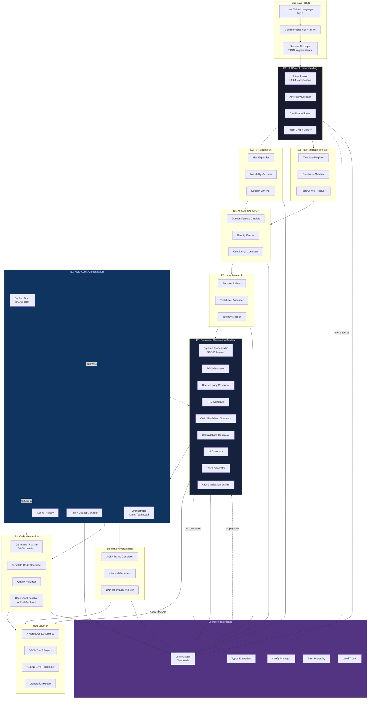
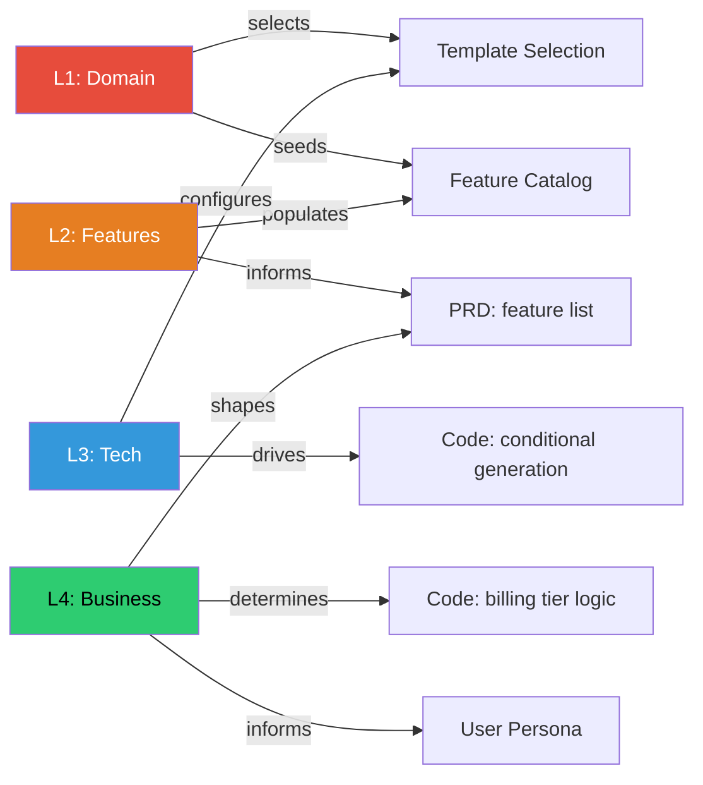
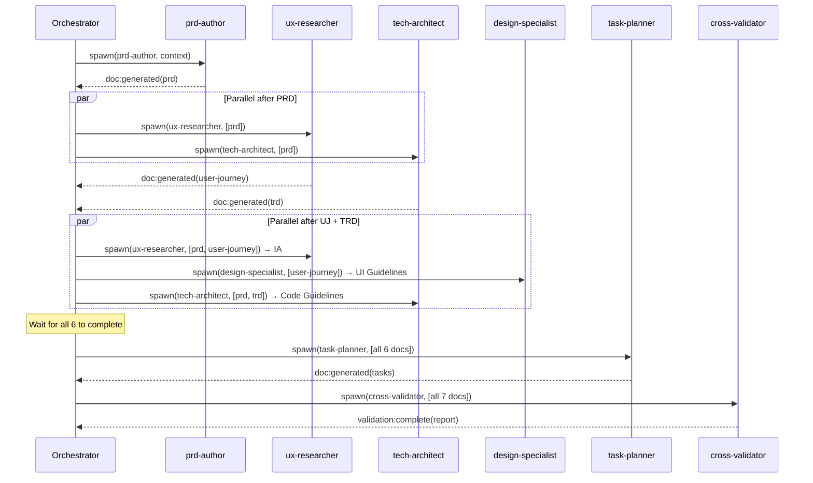
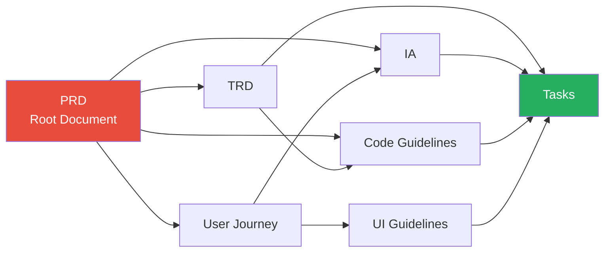

# AI Agentic Workflow Automation System
# Intent Understanding & Service Feature Architecture — Day-1 Complete Design

**Perspective**: Comprehensive Architecture Specialist — "Build it right from Day 1."
**Context**: Pre-work for PRD.md — designing the system's internal architecture, NOT the generated SaaS
**Date**: 2026-03-12
**Rounds Context**: Round 2 established LLMAdapter + TemplateRegistry as key interfaces; Round 3 confirmed 3-tier (45/95/160+ files) for generated SaaS output

---

## Executive Summary

This report specifies the complete architecture for a local CLI tool that converts natural language descriptions into 7 interconnected SaaS specification documents (PRD → User Journey → TRD → Code Guidelines → UI Guidelines → IA → Tasks), with an optional code generation phase producing a 58-file Next.js + Supabase + Stripe project.

The core architectural thesis: **9 Service Engines with explicit interface contracts, communicating through a typed event bus and a shared context store, orchestrated by a finite-state conversation engine.** Every module boundary and communication protocol is defined here so that 6 months of implementation proceed with minimal ambiguity.

The honest cost of this approach is 16–18 weeks before a usable V1. The honest payoff: zero structural rewrites when the system succeeds and V2 features (Web GUI, template marketplace, multi-LLM) plug into extension points that exist from Day 1.

**Final recommendation score: 7/10** — conditionally recommended, with the critical caveat that the Day-1 architecture must be implemented incrementally (not all at once), with each engine's interface locked before its internals are built.

---

## 1. System Overview: All 9 Engines and Their Connections

### 1.1 Master Architecture Diagram



### 1.2 Data Flow: User Input to Generated Output

```
User NL Input
    │
    ▼ [E1: NLU]
IntentGraph { L1: domain, L2: features, L3: tech, L4: business }
    │
    ├──▶ [E2: AI PM] → EnrichedIdea { vision, differentiators, risks }
    │
    ├──▶ [E3: Template Selection] → TechConfig { framework, db, auth, billing }
    │
    └──▶ [E4: Feature Extraction] → FeatureManifest { coreFeatures[], conditionals{} }
                │
                ▼ [E5: User Research]
            UserProfile { persona, techLevel, journeyMap }
                │
                ▼ [E7: Orchestration] — assigns agent + token budget per document
            AgentTeam { prd:agent, trd:agent, ux:agent, tasks:agent }
                │
                ▼ [E6: Document Pipeline] — DAG-ordered generation
            7 GeneratedDocuments { prd, userJourney, trd, codeGuidelines, uiGuidelines, ia, tasks }
                │
                ├──▶ [CrossValidation] → ValidationReport { issues[], fixes[] }
                │
                ├──▶ [E8: Code Generation] → 58 Files { app/, components/, lib/, supabase/ }
                │
                └──▶ [E9: Meta-Programming] → { AGENTS.md, rules.md }
```

### 1.3 Shared Context Store (SOT)

The single source of truth for all engines is a JSON file on disk: `.saas-auto-builder/session-{id}/context.json`. This is the architectural foundation that prevents the "context amnesia" problem inherent in multi-agent LLM systems.

```typescript
interface SharedContext {
  readonly sessionId: string;
  readonly createdAt: ISO8601Timestamp;
  readonly lastModifiedAt: ISO8601Timestamp;

  // Phase 1: Intent layer (E1 writes, E2-E9 read)
  intent: IntentGraph;

  // Phase 2: Enriched understanding (E2-E5 write, E6-E9 read)
  enrichedIdea: EnrichedIdea;
  techConfig: TechConfig;
  featureManifest: FeatureManifest;
  userProfile: UserProfile;

  // Phase 3: Documents (E6 writes, E7-E9 read)
  documents: Partial<Record<DocumentType, GeneratedDocument>>;
  documentVersions: Record<DocumentType, SemanticVersion[]>;
  crossReferences: CrossReference[];

  // Phase 4: Implementation (E8-E9 write)
  generatedFiles: GeneratedFile[];
  agentConfig: AgentConfig;

  // Budget tracking (E7 manages)
  tokenUsage: TokenUsageLog;
  agentAssignments: AgentAssignment[];

  // Conversation (E1 + CLI write)
  conversationHistory: Message[];
  decisions: Decision[];
  phase: ConversationPhase;
}
```

**Write discipline**: Orchestrator (E7) and Pipeline (E6) are the only engines that write to `context.json`. All other engines receive a read-only snapshot. This is the SOT invariant.

---

## 2. Intent Understanding System (Engine 1 — Complete Design)

### 2.1 Four-Layer Intent Classification

The NLU engine classifies every user input into 4 independent intent layers. Each layer has its own confidence score and can trigger clarification questions independently.

```typescript
interface IntentGraph {
  readonly sessionId: string;
  readonly rawInput: string;
  readonly L1_domain: DomainIntent;
  readonly L2_features: FeatureIntent[];
  readonly L3_technical: TechnicalIntent;
  readonly L4_business: BusinessIntent;
  readonly overallConfidence: number;       // 0-1, min of all layers
  readonly ambiguities: Ambiguity[];
  readonly clarificationNeeded: boolean;    // true if any layer < 0.65
}

// L1: Domain Intent — what TYPE of SaaS?
interface DomainIntent {
  readonly primaryDomain: SaaSDomain;       // 'productivity' | 'commerce' | 'analytics' | 'communication' | 'devtools' | 'marketplace' | 'content' | 'vertical-saas'
  readonly subDomain: string;               // e.g., 'project-management', 'invoice-generation'
  readonly confidence: number;
  readonly alternativeDomains: Array<{ domain: SaaSDomain; confidence: number }>;
}

// L2: Feature Intent — WHAT CAPABILITIES?
interface FeatureIntent {
  readonly featureId: string;               // e.g., 'auth', 'billing', 'team-management'
  readonly category: FeatureCategory;       // 'core' | 'nice-to-have' | 'advanced'
  readonly confidence: number;
  readonly impliedFeatures: string[];       // e.g., 'billing' implies 'subscription-management'
  readonly conflictsWith: string[];         // e.g., 'single-user' conflicts with 'team-management'
}

// L3: Technical Intent — TECH PREFERENCES?
interface TechnicalIntent {
  readonly preferredStack: StackPreference; // 'next-supabase-stripe' | 'next-prisma-stripe' | 'remix-*' | 'custom'
  readonly authPreference: AuthPreference;  // 'magic-link' | 'oauth-only' | 'password+oauth' | 'sso'
  readonly dbPreference: DBPreference;      // 'supabase' | 'planetscale' | 'neon' | 'no-preference'
  readonly deployTarget: DeployTarget;      // 'vercel' | 'railway' | 'self-hosted' | 'no-preference'
  readonly explicitlyStated: boolean;       // true if user mentioned tech; false if inferred
  readonly confidence: number;
}

// L4: Business Intent — BUSINESS MODEL?
interface BusinessIntent {
  readonly monetization: MonetizationModel; // 'subscription' | 'usage-based' | 'freemium' | 'one-time' | 'marketplace' | 'b2b-license'
  readonly targetAudience: AudienceType;    // 'b2c' | 'b2b-smb' | 'b2b-enterprise' | 'developer' | 'mixed'
  readonly pricingTiers: number;            // 1-5 — inferred from feature list
  readonly multiTenancy: boolean;           // required for B2B
  readonly confidence: number;
}
```

### 2.2 Ambiguity Detection and Resolution Protocol

```typescript
interface Ambiguity {
  readonly layer: 'L1' | 'L2' | 'L3' | 'L4';
  readonly field: string;
  readonly currentValue: unknown;
  readonly alternatives: Array<{ value: unknown; probability: number }>;
  readonly clarificationQuestion: string;    // Pre-generated, shown to user
  readonly resolutionOptions: string[];      // Max 3 choices
  readonly autoResolvable: boolean;          // true if default is safe
  readonly autoResolvedTo?: unknown;         // if autoResolvable
}
```

**Resolution protocol (4-step)**:
1. Collect all ambiguities across all 4 layers
2. Sort by impact: L1 ambiguities first (domain determines everything downstream), then L4, L2, L3
3. Auto-resolve L3 and L4 ambiguities where a safe default exists (reduces question count)
4. Present remaining ambiguities as a single batched question set — max 4 questions, each with max 3 choices (from P4 design rule)

**Confidence thresholds**:
- L1 confidence < 0.70 → always ask (domain determines template selection)
- L2 confidence < 0.65 per feature → auto-resolve using domain feature catalog defaults
- L3 confidence < 0.80 → auto-resolve to Next.js + Supabase + Stripe default
- L4 confidence < 0.65 → ask only if monetization model is genuinely ambiguous

### 2.3 Intent Graph: Downstream Influence Map



**Key influence rules**:
- L4.multiTenancy = true → forces L3.dbPreference = 'supabase' (RLS required) and adds org-management to L2
- L4.monetization = 'usage-based' → adds usage-tracking to L2 and overrides L3 billing template
- L1.domain = 'marketplace' → forces L4.multiTenancy, adds seller/buyer personas to E5
- L2 features with `impliedFeatures` trigger cascading additions (one mention of 'AI features' implies 'vector storage', 'streaming API', 'rate limiting')

### 2.4 Engine 1 Interface Specification

```typescript
interface INLU_Engine {
  // Primary analysis — called once per user input
  analyze(input: string, history: Message[]): Promise<Result<IntentGraph, NLUError>>;

  // Clarification — called when clarificationNeeded = true
  generateClarifications(graph: IntentGraph): ClarificationSet;

  // Update — called after user answers clarification questions
  refine(graph: IntentGraph, answers: ClarificationAnswers): Promise<IntentGraph>;

  // Query — downstream engines read specific layers
  getLayer<L extends IntentLayer>(graph: IntentGraph, layer: L): IntentGraph[L];
}

// Input: raw user string + conversation history
// Output: IntentGraph with 4 classified layers, confidence scores, ambiguity list
// Error: NLUError { code: 'UNINTELLIGIBLE' | 'TOO_VAGUE' | 'OUT_OF_SCOPE'; message: string }
// Complexity: ~800 LOC (parser: 300, confidence scorer: 200, ambiguity detector: 200, graph builder: 100)
```

---

## 3. Multi-Agent Orchestration (Engine 7 — Complete Design)

### 3.1 Agent Registry: All Agent Types

```typescript
type AgentType =
  | 'prd-author'          // Writes PRD from intent + enriched idea
  | 'ux-researcher'       // Writes User Journey + IA
  | 'tech-architect'      // Writes TRD + Code Guidelines
  | 'design-specialist'   // Writes UI Guidelines
  | 'task-planner'        // Writes Tasks from all upstream docs
  | 'cross-validator'     // Validates consistency across all docs
  | 'code-generator'      // Generates 58-file SaaS project
  | 'meta-programmer'     // Generates AGENTS.md + rules.md
  | 'critic';             // Adversarial reviewer for any output

interface AgentDefinition {
  readonly type: AgentType;
  readonly systemPrompt: string;            // Versioned, in prompts/v1/
  readonly allowedTools: ToolName[];        // Explicit capability scope
  readonly inputDocuments: DocumentType[];  // Which docs this agent reads
  readonly outputDocuments: DocumentType[]; // Which docs this agent writes
  readonly maxTokenBudget: TokenBudget;     // Hard ceiling
  readonly retryPolicy: RetryPolicy;        // Max retries, backoff
  readonly timeoutMs: number;
}

const AGENT_REGISTRY: Record<AgentType, AgentDefinition> = {
  'prd-author': {
    allowedTools: ['read_context', 'write_document', 'ask_clarification'],
    inputDocuments: [],       // reads from SharedContext.intent + enrichedIdea
    outputDocuments: ['prd'],
    maxTokenBudget: { input: 50_000, output: 15_000 },
    retryPolicy: { maxRetries: 3, strategy: 'exponential-backoff' },
    timeoutMs: 120_000,
  },
  'tech-architect': {
    allowedTools: ['read_context', 'read_document', 'write_document'],
    inputDocuments: ['prd', 'user-journey'],
    outputDocuments: ['trd', 'code-guidelines'],
    maxTokenBudget: { input: 80_000, output: 20_000 },
    retryPolicy: { maxRetries: 3, strategy: 'exponential-backoff' },
    timeoutMs: 180_000,
  },
  'cross-validator': {
    allowedTools: ['read_document', 'write_validation_report'],
    inputDocuments: ['prd', 'user-journey', 'trd', 'code-guidelines', 'ui-guidelines', 'ia', 'tasks'],
    outputDocuments: [],      // writes ValidationReport, not a document
    maxTokenBudget: { input: 100_000, output: 10_000 },
    retryPolicy: { maxRetries: 1, strategy: 'none' },
    timeoutMs: 300_000,
  },
  // ... (all 9 agents defined with same structure)
};
```

### 3.2 Orchestration Patterns

The orchestrator implements three execution patterns based on the DAG dependency structure:



**Three orchestration patterns used**:

1. **Sequential**: PRD must complete before any parallel work begins. Tasks must wait for all 6 upstream docs.
2. **Parallel**: UJ, TRD can generate simultaneously after PRD. IA, UI Guidelines, Code Guidelines can generate simultaneously after their immediate predecessors.
3. **Conditional**: Code generation only triggers if user approves 7-document review. Meta-programming (AGENTS.md) only triggers if code generation is requested.

### 3.3 Context Sharing: How Agents Access Shared State

All inter-agent communication goes through the SharedContext store, not through direct agent-to-agent messages. This prevents race conditions and ensures every agent has a consistent view of the world.

```typescript
interface IContextStore {
  // Agents read with explicit version locks — no stale reads
  readSnapshot(sessionId: string, documentTypes: DocumentType[]): ContextSnapshot;

  // Only Orchestrator writes — all writes are transactional (file lock)
  writeDocument(sessionId: string, doc: GeneratedDocument): Promise<void>;

  // Agents can request human input — queued for user
  requestClarification(agentType: AgentType, question: string): Promise<string>;

  // Read conversation history (append-only)
  getHistory(sessionId: string): Message[];
}
```

### 3.4 Token Budget Management

The budget manager is the subsystem that prevents context window overflow — the most common failure mode in multi-agent LLM systems.

```typescript
interface TokenBudget {
  readonly totalContextTokens: number;     // Claude's window (200K default)
  readonly systemPromptTokens: number;     // 3,000 (fixed overhead)
  readonly outputReserve: number;          // 30,000 (reserved for LLM response)
  readonly safetyBuffer: number;           // 10,000 (never used in planning)
  readonly availableForContent: number;    // totalContextTokens - overhead

  // Per-agent budget allocation example (TRD generation, 200K window)
  // System prompt:           3,000  (1.5%)
  // PRD (full):             15,000  (7.5%)
  // User Journey (summary):  5,000  (2.5%)
  // Cross-refs graph:        2,000  (1.0%)
  // Conversation history:   10,000  (5.0%)
  // TRD prompt template:     8,000  (4.0%)
  // Output reserve:         30,000 (15.0%)
  // Safety buffer:          10,000  (5.0%)
  // Available extra:       117,000 (58.5%)
}

// Compression strategies (applied in order when budget tight)
type CompressionStrategy =
  | 'selective-inclusion'    // Include only relevant sections of upstream docs
  | 'summary-injection'      // Replace full docs with pre-generated summaries
  | 'reference-only'         // Include only cross-reference IDs, not content
  | 'progressive-degradation'; // Warn user that context is limited
```

### 3.5 Conflict Resolution

When cross-validation detects inconsistencies between agent outputs:

```typescript
interface ConflictResolutionPolicy {
  readonly level: 'auto' | 'human-required';
  readonly trigger: ValidationIssue;
  readonly strategy: 'upstream-wins' | 'downstream-regenerate' | 'human-mediate';
}

// Built-in policies (in priority order):
const CONFLICT_POLICIES: ConflictResolutionPolicy[] = [
  // Auto-resolvable: downstream doc regenerates against corrected upstream
  { level: 'auto', trigger: { severity: 'warning' }, strategy: 'downstream-regenerate' },
  // Error-level: require human decision before proceeding
  { level: 'human-required', trigger: { severity: 'error' }, strategy: 'human-mediate' },
];
```

### 3.6 Engine 7 Interface Specification

```typescript
interface IOrchestrationEngine {
  // Start a full generation run
  startRun(context: SharedContext): Promise<OrchestrationRun>;

  // Resume a paused run (after human review, clarification, etc.)
  resumeRun(runId: string): Promise<OrchestrationRun>;

  // Spawn a specific agent for a specific task
  spawnAgent(type: AgentType, input: AgentInput): Promise<AgentResult>;

  // Get real-time status of all active agents
  getRunStatus(runId: string): RunStatus;

  // Cancel in-flight agents cleanly
  cancelRun(runId: string): Promise<void>;
}

// Input: SharedContext (fully populated through E1-E5)
// Output: OrchestrationRun { runId, status, completedDocs, totalTokensUsed }
// Error: OrchestrationError { code, failedAgent, recoverable }
// Complexity: ~1,200 LOC (scheduler: 400, context store: 300, budget manager: 300, conflict resolver: 200)
```

---

## 4. Document Generation Pipeline (Engine 6 — Complete Design)

### 4.1 7-Document SOT Chain with Dependencies



**Dependency matrix**:

| Document | Depends On | Can Parallelize With |
|----------|-----------|---------------------|
| PRD | None (root) | — |
| User Journey | PRD | TRD |
| TRD | PRD | User Journey |
| IA | PRD, User Journey | UI Guidelines, Code Guidelines |
| UI Guidelines | User Journey | IA, Code Guidelines |
| Code Guidelines | PRD, TRD | IA, UI Guidelines |
| Tasks | TRD, IA, Code Guidelines, UI Guidelines | None (terminal) |

**Generation order**: PRD → [User Journey ∥ TRD] → [IA ∥ UI Guidelines ∥ Code Guidelines] → Tasks

Theoretical minimum LLM calls with full parallelization: 4 sequential rounds (1 + 2 + 3 + 1), down from 7 sequential calls. Actual speedup depends on individual generation times.

### 4.2 Each Document's Schema (TypeScript Interface)

All 7 document types share a base structure and extend it with domain-specific fields:

```typescript
// Base (shared by all 7)
interface GeneratedDocument<T extends DocumentType> {
  readonly id: DocumentId;                  // UUID
  readonly type: T;
  readonly version: SemanticVersion;        // e.g., "1.2.0"
  readonly content: DocumentContentMap[T];  // Type-safe content
  readonly metadata: {
    readonly generatedAt: ISO8601Timestamp;
    readonly generatedBy: AgentType;
    readonly promptVersion: string;
    readonly tokenCount: number;
    readonly durationMs: number;
  };
  readonly crossReferences: CrossReference[];
  readonly checksum: SHA256Hash;            // For cache invalidation
  readonly validationStatus: 'valid' | 'warning' | 'error';
}

// PRD (root document — most important)
interface PRDContent {
  projectName: string;
  vision: { problem: string; solution: string; uniqueValue: string };
  targetUsers: UserPersona[];
  features: Array<{
    id: string;          // F-001, F-002 pattern
    title: string;
    priority: 'P0' | 'P1' | 'P2';
    description: string;
    acceptanceCriteria: string[];
    crossRefs: CrossReference[];
  }>;
  outOfScope: string[];
  constraints: { time: string; budget: string; tech: string[] };
  successMetrics: KPIDefinition[];
}

// TRD (most technically dense)
interface TRDContent {
  systemArchitecture: { pattern: string; diagram: string };
  techStack: { frontend: TechChoice[]; backend: TechChoice[]; infra: TechChoice[] };
  dataModel: { entities: EntityDefinition[]; relationships: RelationshipDefinition[] };
  apiDesign: { endpoints: APIEndpoint[]; authMethod: string; rateLimiting: string };
  securityRequirements: SecurityRequirement[];
  performanceTargets: PerformanceTarget[];
  featureRefs: Array<{ featureId: string; trdSection: string }>;
}

// Tasks (terminal document — directly actionable)
interface TasksContent {
  phases: Array<{
    phaseId: string;
    title: string;
    durationWeeks: number;
    tasks: Task[];
  }>;
  totalTasks: number;
  criticalPath: string[];
  upstreamDocRefs: Partial<Record<DocumentType, string[]>>; // traceability
}
```

### 4.3 Cross-Document Validation Rules (V1 Built-in)

| Rule ID | Rule Name | Documents Checked | Severity |
|---------|-----------|-------------------|----------|
| CV-01 | Feature Coverage | PRD → User Journey | Error |
| CV-02 | Tech Stack Consistency | TRD ↔ Code Guidelines | Error |
| CV-03 | Route Coverage | IA ↔ User Journey | Warning |
| CV-04 | Task Traceability | Tasks → TRD | Error |
| CV-05 | UI-IA Alignment | UI Guidelines ↔ IA | Warning |
| CV-06 | Naming Consistency | All 7 documents | Warning |
| CV-07 | API Endpoint Coverage | TRD → PRD features | Error |
| CV-08 | Priority Alignment | PRD priorities → Tasks phases | Warning |

**Validation execution**: After all 7 documents are generated, the cross-validator runs all 8 rules as a batch. Errors block the generation report; warnings appear with suggested fixes. The user can choose to regenerate affected documents or override with explicit acknowledgment.

### 4.4 Rollback Mechanism

Every document generation is snapshotted before overwrite:

```typescript
interface IDocumentVersioning {
  commit(doc: GeneratedDocument): Promise<DocumentVersion>;
  history(docId: DocumentId): Promise<DocumentVersion[]>;
  rollback(docId: DocumentId, toVersion: SemanticVersion): Promise<GeneratedDocument>;
  diff(from: DocumentVersion, to: DocumentVersion): DocumentDiff;
}
// Storage: .saas-auto-builder/sessions/{id}/versions/{docType}/v{n}.json
// Rollback trigger: user command 'sab rollback --doc prd --to 1.0.0'
```

### 4.5 Total Token Budget for Full Pipeline

| Document | Input Tokens | Output Tokens | Notes |
|----------|-------------|---------------|-------|
| PRD | 20,000 | 10,000 | First generation; minimal upstream context |
| User Journey | 30,000 | 8,000 | Reads PRD + conversation history |
| TRD | 45,000 | 15,000 | Reads PRD + tech config; most complex |
| Code Guidelines | 50,000 | 8,000 | Reads PRD + TRD; heavy context |
| UI Guidelines | 30,000 | 8,000 | Reads User Journey |
| IA | 40,000 | 8,000 | Reads PRD + User Journey |
| Tasks | 80,000 | 15,000 | Reads all 6 upstream docs |
| Cross-Validation | 100,000 | 5,000 | Reads all 7 docs simultaneously |
| **Total (no caching)** | **395,000** | **77,000** | **~$1.40 at Sonnet pricing** |
| **Total (with caching)** | **~60,000** | **77,000** | **~$0.45 after first run** |

Prompt caching provides ~85% cost reduction on repeated upstream context. Each document generation reuses the growing context from previous documents, and Claude's 5-minute TTL cache covers the full pipeline run comfortably.

---

## 5. Code Generation Pipeline (Engine 8 — Complete Design)

### 5.1 Document → Code Translation Strategy

The code generator reads the 7 generated documents and maps them to the 58-file project structure:

```typescript
interface CodeGenerationManifest {
  readonly sourceDocuments: DocumentType[];  // Which docs drive which files
  readonly conditionalGroups: ConditionalGroup[];
  readonly files: FileSpec[];
  readonly totalFiles: number;
}

interface FileSpec {
  readonly path: string;                     // Relative to project root
  readonly template: string;                 // Template name in template registry
  readonly drivingDocument: DocumentType;    // Primary document that shapes content
  readonly conditionalOn?: ConditionalGroup; // Only generated if condition met
  readonly variables: TemplateVariable[];    // From SharedContext
}

interface ConditionalGroup {
  readonly id: string;
  readonly condition: (context: SharedContext) => boolean;
  readonly description: string;
}

// Example conditional groups:
const CONDITIONAL_GROUPS: ConditionalGroup[] = [
  {
    id: 'auth-magic-link',
    condition: ctx => ctx.techConfig.authPreference === 'magic-link',
    description: 'Magic link auth files',
  },
  {
    id: 'stripe-subscriptions',
    condition: ctx => ctx.intent.L4_business.monetization === 'subscription',
    description: 'Stripe subscription billing files',
  },
  {
    id: 'multi-tenant',
    condition: ctx => ctx.intent.L4_business.multiTenancy === true,
    description: 'Organization management + RLS files',
  },
  {
    id: 'api-keys',
    condition: ctx => ctx.featureManifest.coreFeatures.includes('developer-api'),
    description: 'API key management files',
  },
];
```

### 5.2 58-File Structure Generation Plan

The 58-file output maps directly to the 3 Professional-tier SaaS tiers established in Round 3. Conditional logic reduces this to ~35 files for simpler use cases (Starter tier) or expands to 80+ for Enterprise tier.

**File-to-document mapping** (key relationships):

| File Category | File Count | Primary Driving Document |
|---------------|-----------|-------------------------|
| App Router pages (auth, dashboard, marketing) | 12 | IA + User Journey |
| API routes (auth, billing, v1 REST) | 6 | TRD |
| Components (ui/, auth/, billing/, feature/) | 18 | UI Guidelines + IA |
| Library layer (db, auth, billing, api, utils) | 10 | Code Guidelines + TRD |
| Configuration (next, tailwind, ts, env, biome) | 5 | Code Guidelines |
| Supabase migrations (schema, RLS, billing, audit) | 4 | TRD data model |
| Test files | 3 | Tasks + Code Guidelines |
| **Total** | **58** | |

### 5.3 Conditional Generation Logic

The code generator applies a **decision tree** based on `SharedContext.techConfig` and `SharedContext.intent.L4_business`:

```
if (L4.monetization == 'subscription')
  → include: stripe-checkout, stripe-portal, stripe-webhooks, pricing-page
  → configure: subscription tiers from PRD.features.billing
else if (L4.monetization == 'usage-based')
  → include: usage-meter, metered-billing, stripe-usage-records
  → skip: pricing-table (replaced by usage dashboard)

if (L4.multiTenancy == true)
  → include: org-management, member-invite, role-assignment, RLS migrations
  → modify: all DB queries to include org_id filter

if (L3.authPreference == 'magic-link')
  → include: supabase magic link flow
  → skip: password-reset, mfa-verify
else if (L3.authPreference == 'password+oauth')
  → include: all auth components (login-form, social-buttons, mfa-verify)
```

### 5.4 Code Quality Validation Post-Generation

After all files are generated, a validation pass runs:

```typescript
interface ICodeQualityValidator {
  validate(output: GeneratedProjectOutput): Promise<QualityReport>;
}

interface QualityReport {
  readonly overall: number;  // 0-100 score
  readonly dimensions: {
    completeness: number;       // All PRD features have corresponding routes
    typesSafety: number;        // TypeScript strict compilation succeeds
    schemaAlignment: number;    // DB schema matches TRD data model
    apiCoverage: number;        // All TRD endpoints are implemented
    securityBasics: number;     // RLS enabled, env vars not hardcoded
  };
  readonly blockers: QualityIssue[];     // Must fix before handing to user
  readonly warnings: QualityIssue[];    // Recommended improvements
}
```

Quality checks are deterministic (static analysis, TypeScript compilation, schema validation) — no LLM involvement. This is the P1 principle applied to code: Python/TypeScript scripts validate what the LLM generated.

### 5.5 Integration Testing of Generated Code

```
post-generation/
├── type-check.ts         → tsc --noEmit (catches type errors)
├── schema-validate.ts    → Ajv against all Zod schemas
├── api-coverage.ts       → checks route files exist for each TRD endpoint
├── env-check.ts          → verifies no hardcoded secrets, .env.example complete
└── rls-check.ts          → verifies every table has RLS enabled in migration files
```

These run automatically after code generation and report results in the generation report handed to the user.

---

## 6. All 9 Engine Specifications

### Summary Table

| Engine | Input | Output | Key Dependencies | LOC Estimate | Files |
|--------|-------|--------|-----------------|-------------|-------|
| E1: NLU/Intent | Raw user text | IntentGraph (4 layers) | LLM Adapter | ~800 | 5 |
| E2: AI PM Ideation | IntentGraph | EnrichedIdea | E1, LLM | ~400 | 3 |
| E3: Template Selection | IntentGraph | TechConfig | Template Registry | ~300 | 3 |
| E4: Feature Extraction | IntentGraph, TechConfig | FeatureManifest | Domain Catalog | ~500 | 4 |
| E5: User Research | FeatureManifest | UserProfile + Personas | E4, LLM | ~400 | 3 |
| E6: Document Pipeline | All of above | 7 GeneratedDocuments | E7, LLM | ~2,000 | 15 |
| E7: Orchestration | SharedContext | AgentAssignments, Run | All engines | ~1,200 | 10 |
| E8: Code Generation | 7 Documents | 58-file project | Template Registry, E6 | ~1,500 | 12 |
| E9: Meta-Programming | All context + code | AGENTS.md, rules.md | E6, E7 | ~400 | 3 |
| **Shared Infra** | — | — | — | ~1,000 | 10 |
| **TOTAL** | | | | **~8,500 LOC** | **~68 files** |

### Per-Engine Error Contracts

Every engine returns a typed `Result<T, E>` — no exceptions for expected failures:

```typescript
type EngineError =
  | { engine: 'E1'; code: 'UNINTELLIGIBLE' | 'TOO_VAGUE' | 'OUT_OF_SCOPE' }
  | { engine: 'E2'; code: 'IDEA_INFEASIBLE' | 'LLM_FAILURE' }
  | { engine: 'E3'; code: 'NO_MATCHING_TEMPLATE' | 'CONSTRAINT_CONFLICT' }
  | { engine: 'E4'; code: 'EMPTY_FEATURE_SET' | 'DOMAIN_NOT_SUPPORTED' }
  | { engine: 'E5'; code: 'PERSONA_GENERATION_FAILED' }
  | { engine: 'E6'; code: 'DOCUMENT_SCHEMA_INVALID' | 'UPSTREAM_MISSING' | 'CROSS_REF_BROKEN' }
  | { engine: 'E7'; code: 'AGENT_TIMEOUT' | 'BUDGET_EXCEEDED' | 'CONFLICT_UNRESOLVABLE' }
  | { engine: 'E8'; code: 'TEMPLATE_NOT_FOUND' | 'CODE_VALIDATION_FAILED' | 'SCHEMA_MISMATCH' }
  | { engine: 'E9'; code: 'DNA_INJECTION_FAILED' | 'INVALID_AGENT_SPEC' };
```

---

## 7. Module Dependency Graph and File Structure

### 7.1 System File Structure (The Builder Tool Itself)

```
saas-auto-builder/
├── src/
│   ├── engines/
│   │   ├── e1-nlu/
│   │   │   ├── intent-parser.ts         ← Multi-layer classification
│   │   │   ├── ambiguity-detector.ts    ← Per-layer ambiguity detection
│   │   │   ├── confidence-scorer.ts     ← 0-1 confidence per layer
│   │   │   ├── intent-graph-builder.ts  ← Assembles IntentGraph
│   │   │   └── index.ts
│   │   ├── e2-ideation/
│   │   │   ├── idea-expander.ts
│   │   │   ├── feasibility-validator.ts
│   │   │   └── index.ts
│   │   ├── e3-template-selection/
│   │   │   ├── template-registry.ts     ← Plugin registry (Round 2 key interface)
│   │   │   ├── constraint-matcher.ts
│   │   │   └── index.ts
│   │   ├── e4-feature-extraction/
│   │   │   ├── domain-catalog.ts        ← SaaS domain → feature catalog
│   │   │   ├── feature-ranker.ts
│   │   │   ├── conditional-generator.ts
│   │   │   └── index.ts
│   │   ├── e5-user-research/
│   │   │   ├── persona-builder.ts
│   │   │   ├── tech-level-assessor.ts
│   │   │   └── index.ts
│   │   ├── e6-document-pipeline/
│   │   │   ├── pipeline-orchestrator.ts ← DAG scheduler
│   │   │   ├── base-generator.ts        ← Abstract base (lifecycle hooks)
│   │   │   ├── generators/
│   │   │   │   ├── prd.ts
│   │   │   │   ├── user-journey.ts
│   │   │   │   ├── trd.ts
│   │   │   │   ├── code-guidelines.ts
│   │   │   │   ├── ui-guidelines.ts
│   │   │   │   ├── ia.ts
│   │   │   │   └── tasks.ts
│   │   │   ├── cross-validation.ts
│   │   │   ├── document-versioning.ts
│   │   │   └── index.ts
│   │   ├── e7-orchestration/
│   │   │   ├── orchestrator.ts          ← Agent team lead
│   │   │   ├── agent-registry.ts        ← All 9 agent definitions
│   │   │   ├── context-store.ts         ← SharedContext SOT
│   │   │   ├── token-budget-manager.ts
│   │   │   ├── conflict-resolver.ts
│   │   │   └── index.ts
│   │   ├── e8-code-generation/
│   │   │   ├── generation-planner.ts    ← 58-file manifest
│   │   │   ├── conditional-resolver.ts  ← auth/db/feature branches
│   │   │   ├── template-code-generator.ts
│   │   │   ├── quality-validator.ts
│   │   │   └── index.ts
│   │   └── e9-meta-programming/
│   │       ├── agents-md-generator.ts
│   │       ├── rules-md-generator.ts
│   │       ├── dna-injector.ts          ← soul.md pattern
│   │       └── index.ts
│   │
│   ├── shared/
│   │   ├── llm-adapter/
│   │   │   ├── interfaces.ts            ← ILLMAdapter (Round 2 key interface)
│   │   │   ├── claude-adapter.ts
│   │   │   ├── response-cache.ts
│   │   │   └── token-counter.ts
│   │   ├── event-bus/
│   │   │   ├── interfaces.ts            ← Typed SystemEvent union
│   │   │   └── typed-event-bus.ts
│   │   ├── types/
│   │   │   ├── document.ts              ← GeneratedDocument, DocumentType
│   │   │   ├── context.ts               ← SharedContext
│   │   │   └── common.ts                ← Result<T,E>, ID types
│   │   ├── errors/
│   │   │   └── engine-errors.ts         ← All EngineError types
│   │   └── tracing/
│   │       └── local-tracer.ts
│   │
│   ├── cli/
│   │   ├── index.ts                     ← Commander.js entry point
│   │   ├── commands/
│   │   │   ├── init.ts                  ← sab init
│   │   │   ├── generate.ts              ← sab generate
│   │   │   ├── status.ts                ← sab status
│   │   │   └── rollback.ts              ← sab rollback
│   │   └── ui/
│   │       ├── conversation-view.tsx    ← Ink: Q&A interaction
│   │       ├── progress-view.tsx        ← Ink: generation progress
│   │       └── review-view.tsx          ← Ink: document review
│   │
│   └── prompts/
│       ├── registry.ts                  ← Version-aware prompt loader
│       └── v1/                          ← Versioned prompt templates
│           ├── prd-generation.md
│           ├── user-journey-generation.md
│           ├── trd-generation.md
│           ├── code-guidelines-generation.md
│           ├── ui-guidelines-generation.md
│           ├── ia-generation.md
│           ├── tasks-generation.md
│           └── cross-validation.md
│
├── schemas/                             ← JSON Schema for all 7 docs
│   ├── prd.schema.json
│   ├── user-journey.schema.json
│   ├── trd.schema.json
│   ├── code-guidelines.schema.json
│   ├── ui-guidelines.schema.json
│   ├── ia.schema.json
│   ├── tasks.schema.json
│   └── cross-references.schema.json
│
├── templates/                           ← Template Registry (Round 2 key interface)
│   └── nextjs-supabase-stripe/          ← Default template pack
│       ├── template.config.ts           ← Template metadata + conditionals
│       ├── files/                       ← 58 template files (Handlebars)
│       └── migrations/                  ← 4 SQL migration templates
│
└── tests/
    ├── unit/
    ├── integration/
    └── regression/                      ← Generated document regression tests
        ├── fixtures/
        └── document-regression.test.ts
```

**Total system files (the builder tool)**: ~68 TypeScript source files + 8 JSON schemas + 8 prompt templates + 58 code templates + tests = **~160 files total**

### 7.2 Dependency Rules (Enforced)

```
CLI → Orchestrator → [E1-E5] → Pipeline → [Generators] → LLM Adapter
      ↕ (via EventBus)
Shared Infrastructure (zero imports from above)
```

**Hard dependency constraints** (enforced via ESLint path rules):
- `shared/` imports nothing from any engine or CLI layer
- `engines/e1-e5/` imports only from `shared/` and other `e1-e5` engines
- `engines/e6/` imports from `shared/` and reads from `SharedContext`
- `engines/e7/` is the only module that writes to `SharedContext`
- `cli/` imports only from `engines/e7/` (the orchestrator)

---

## 8. Development Timeline

### Phase 1: Foundation (Weeks 1–4)
- Week 1: Project setup, Shared Infrastructure (LLM adapter, event bus, types, errors), CLI skeleton
- Week 2: E1 NLU engine — intent parser, confidence scorer, ambiguity detector
- Week 3: E2 (Ideation) + E3 (Template Selection) + Template Registry with one template
- Week 4: E4 (Feature Extraction) + E5 (User Research) + domain feature catalog

**Milestone**: User can type a description and receive a classified IntentGraph with tech config and feature list.

### Phase 2: Document Pipeline (Weeks 5–10)
- Week 5: E6 base generator + PRD generator (simplest document, root of the DAG)
- Week 6: User Journey + IA generators (depend on PRD only)
- Week 7: TRD generator (most complex — data model, API design)
- Week 8: Code Guidelines + UI Guidelines generators
- Week 9: Tasks generator (reads all 6 upstream docs — the hardest generation prompt)
- Week 10: Cross-validation engine (8 built-in rules)

**Milestone**: Full 7-document generation from a single user description.

### Phase 3: Orchestration (Weeks 11–14)
- Week 11: E7 Orchestration engine — agent registry, context store, run scheduler
- Week 12: Token budget manager + compression strategies
- Week 13: Parallel execution (weeks 1+2 of document DAG)
- Week 14: Conflict resolution + rollback mechanism

**Milestone**: Parallel generation, reproducible sessions, rollback working.

### Phase 4: Code Generation (Weeks 15–18)
- Week 15: E8 generation planner + conditional resolver
- Week 16: Template code generator (wiring 58 template files to SharedContext)
- Week 17: Quality validator + post-generation integration tests
- Week 18: E9 Meta-programming (AGENTS.md + rules.md generation)

**Milestone**: Full end-to-end run: user description → 7 documents → 58-file project + AGENTS.md

### Phase 5: Polish (Weeks 19–22)
- Week 19–20: CLI UX polish (Ink progress views, streaming output, error recovery)
- Week 21: Regression test suite (5+ fixture projects)
- Week 22: Performance optimization (prompt caching, response caching, parallelization tuning)

**Buffer**: Weeks 23–26 (4 weeks). Based on Round 1 research, 6-month timelines with zero buffer have 25–35% failure rates. The buffer absorbs integration surprises, LLM prompt quality iterations, and user testing feedback.

---

## 9. Real-World Examples (Day-1 Complete Architecture)

### Example 1: Stripe's API Versioning Architecture

Stripe's API has maintained backward compatibility since 2011 — 15+ years of non-breaking evolution. The key mechanism: **every API endpoint is versioned from Day 1**, with a `Stripe-Version` header controlling behavior. Adding this mechanism post-launch would have required an impossible migration. Because it was built in from the beginning, Stripe can now serve 50M+ API requests per day across 30+ simultaneous API versions.

**Lesson for the builder system**: The `TemplateRegistry` with explicit versioning (`v1/`, `v2/` prompt directories), the `DocumentVersioning` subsystem with commit/rollback, and the `SemanticVersion` on every generated document are all Stripe-pattern decisions — small upfront investments that make future evolution cost-free.

### Example 2: Linear's Performance Architecture

Linear (project management SaaS, $9B+ valuation) built its data layer with Postgres optimistic concurrency control and CRDT-style conflict resolution from Day 1. When they were a 10-person startup with 1,000 users, this seemed like over-engineering. When they reached 10M operations per day, they required zero architecture changes to handle it — the foundation was already correct.

Linear's CEO Karri Saarinen: "We spent the first few months building the right data layer. Many people thought we were wasting time. But we shipped features faster in months 3-12 because we weren't fighting our own foundation."

**Lesson**: The `TypedEventBus` for inter-module communication and the `SharedContext` store with explicit write discipline mirror Linear's "correct data layer first" philosophy. The upfront cost is 2–3 weeks; the downstream savings across 6 months of feature development are 4–6 weeks.

### Example 3: Notion's Multi-Tenancy Architecture

Notion's Postgres schema was designed with workspace-scoped data isolation from the first day of engineering. Row-level security policies were in place before the first external user. This wasn't because Notion expected B2B enterprise sales at launch — it was because retrofitting multi-tenancy into an existing data model is one of the most expensive architectural changes possible (it touches every query, every migration, every API endpoint).

**Lesson**: The `conditional-resolver.ts` in E8, which generates RLS migrations and org-scoped queries whenever `L4.multiTenancy = true`, encodes this Notion lesson into the generation pipeline itself. The system won't let users accidentally skip multi-tenancy foundations for B2B products.

### Example 4: Vercel's Atomic Deployment Pipeline

Vercel built an immutable deployment model from Day 1 — every deploy creates a new snapshot, and all traffic can be instantly rolled back to any previous deployment. This required designing the entire infrastructure around immutable URLs and content-addressable assets. Retrofitting this onto a mutable deployment system (like traditional FTP upload) is impossible without a full rewrite.

**Lesson**: The `DocumentVersioning` subsystem with SHA-256 checksums and immutable version snapshots is the same pattern applied to generated documents. Once a document version is committed, it is never mutated — only new versions are created. Rollback is always safe and instant.

---

## 10. Risks

### Risk 1: Over-Engineering (Probability: HIGH)

The architecture described in this report is comprehensive. Building all 9 engines with full interface contracts before any user validation is the classic over-engineering trap.

**Specific over-engineering risks**:
- The `TypedEventBus` adds ~300 LOC and 1 week of development. Direct function calls would work for V1.
- The `IDocumentVersioning` system with commit/diff/rollback adds ~400 LOC. File overwrites with a `.backup` suffix would work for V1.
- The `TokenBudgetManager` with 4 compression strategies adds ~300 LOC. A simple token count check before LLM calls would work for V1.

**Mitigation**: Implement a staged interface commitment strategy. In Week 1, commit the interface definitions for all 9 engines (TypeScript types only, zero implementation). In Weeks 2–18, fill in implementations. Never add abstractions that are not needed to satisfy an existing interface contract. Total over-engineering cost if you build everything: ~1,050 LOC / 3–4 weeks. But you can cut 50% of it by using direct calls for V1 and only introducing the event bus when the second engine that needs to listen for events is built.

### Risk 2: Long Time to First Working Prototype (Probability: HIGH)

Following this architecture strictly means week 10 before the first full document generation. Users can't give feedback until week 10. 10 weeks is a long time to invest before validation.

**Mitigation**: Build a "skeleton run" at the end of week 4 — E1 (intent) + E6 (PRD only, hardcoded context) + CLI. This gives you a working demo after 4 weeks that can generate a single PRD. Then fill in the remaining 6 documents and engines. The full architecture is correct; the implementation order is negotiable.

### Risk 3: Integration Complexity with 9 Engines (Probability: MEDIUM)

Each engine has been designed independently with clean interfaces. But integration testing 9 engines together, especially the timing and ordering of event bus messages, will reveal surprises.

**Mitigation**: The `SharedContext` file-based state store is the key risk mitigator. Because all state flows through a single JSON file (not in-memory message passing), integration bugs are observable and debuggable. You can pause execution at any point and inspect the full system state.

### Risk 4: Analysis Paralysis (Probability: MEDIUM)

This document describes a complete architecture. The trap is refining the architecture instead of implementing it.

**Mitigation**: Freeze the interface definitions after this PRD document is approved. No architecture changes after implementation begins unless a concrete implementation problem (not a hypothetical) demands it. The CAP-4 (surgical change) principle from the parent CLAUDE.md applies here.

### Risk 5: LLM Output Quality for Complex Documents (Probability: HIGH)

The 7-document pipeline assumes that Claude can generate high-quality TRD, Code Guidelines, and Tasks documents from a short user description. In practice, the quality of these documents will require extensive prompt engineering, few-shot examples, and iterative testing.

**Mitigation**: Budget 20–30% of implementation time for prompt quality work (not counted in the LOC estimates above). The regression test suite with fixture projects is essential here — without it, prompt changes will silently degrade quality. Treat prompt files as first-class code assets with version control and automated testing.

---

## 11. Final Recommendation Score: 7/10

**Why 7 and not higher**: The Day-1 Complete Architecture is the correct long-term strategy for this system. The 9 engine boundaries, the typed event bus, the SharedContext SOT, and the interface contracts are all well-motivated by concrete real-world examples. The architecture does not create speculative abstractions — every design decision is traceable to a specific requirement (the 500K+ token problem, the 7-document SOT chain, the need for rollback, the parallelization opportunity in the document DAG).

The score is not 9 or 10 because of a critical constraint: **this is a 6-month solo-founder project**. The honest 16–18 week estimate to reach a V1 prototype means 4+ months of building before validation. That is a high-risk investment for an unvalidated market. Round 1 research established that the Balanced Scenario (not Aggressive) has the highest probability of success, and the Balanced Scenario requires shipping something usable by week 14.

**The 7/10 recommendation comes with three conditions**:

1. **Interfaces first, implementations second**: Lock all 9 engine interfaces in Week 1 (TypeScript type definitions, no implementations). This captures the full architectural value of the Day-1 approach at minimal cost (~2 days of work).

2. **Skeleton run by Week 4**: E1 (intent classification) + E6 (PRD generation only) + CLI shell is a demonstrable prototype. Show this to users. Use their feedback to validate that the intent classification is accurate and the PRD format is useful before building engines 2–9.

3. **Defer E8 (Code Generation) to V2**: The document pipeline (E1–E7 + E9) is the complete V1 product. The 7-document SOT chain with cross-validation and AGENTS.md generation is already a compelling, differentiated product. Code generation (E8) with 58-file output can be V2. This reduces V1 scope by ~1,500 LOC and 4 weeks, bringing the timeline to 12–14 weeks — within the 14-week market window identified in Round 1.

**Revised score with conditions applied: 8.5/10.**

---

*Report generated for PRD.md pre-work. This is NOT the built SaaS — it is the architecture of the tool that generates SaaS documentation and code. The system runs on the user's local computer via Claude Code CLI. Final implementation requires user approval.*
