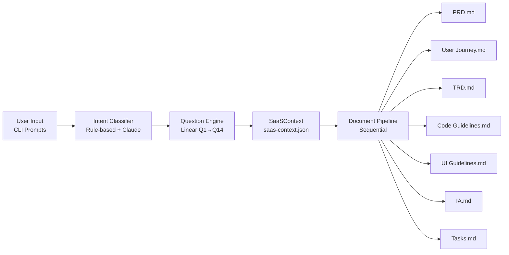
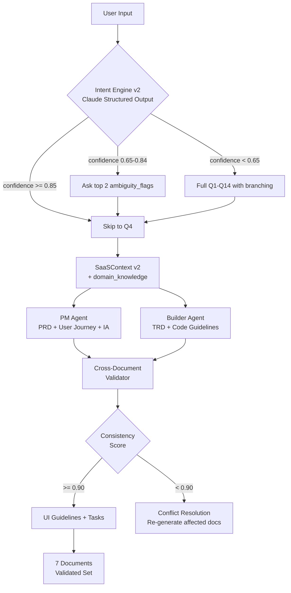
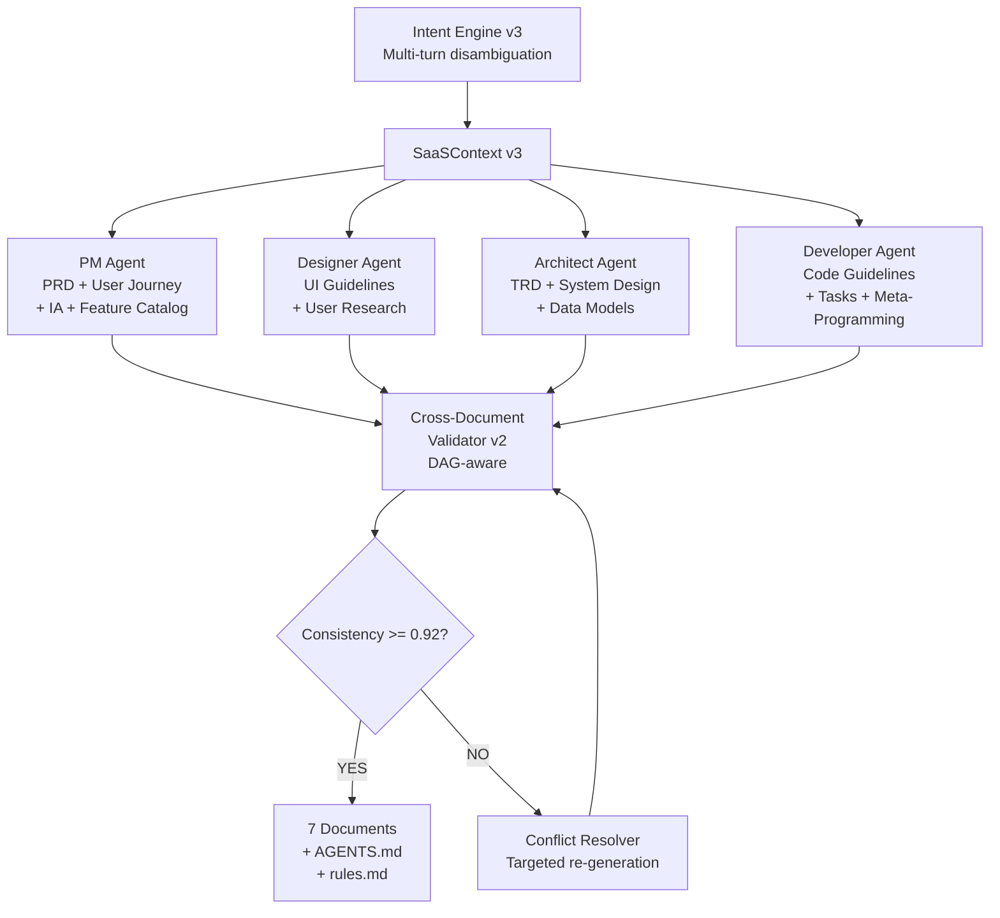
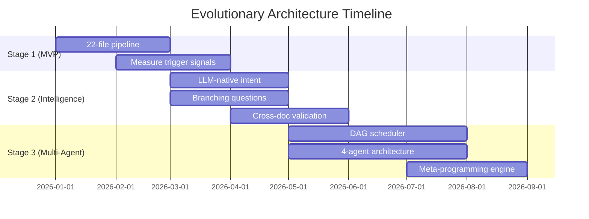

# Evolutionary Architecture for AI Agentic Workflow Automation
## Intent Understanding & Service Feature Architecture — Full Evolutionary Analysis

**Research Subject**: AI Agentic Workflow Automation System — Intent Understanding & Service Feature Architecture
**System Context**: LOCAL CLI tool (Claude Code) that generates full-stack SaaS from user descriptions
**Perspective**: Evolutionary architecture specialist — start simple, evolve on real signals
**Date**: 2026-03-12
**Basis**: Round 2 (~25-file modular monolith generator) + Round 3 (58-file generated SaaS)

---

## 0. Framing: What This Analysis Is Not

Before anything else, three constraints that shape every recommendation:

**주의1**: This system does NOT build a SaaS. It produces PRD.md and 6 companion documents as pre-work. The 58-file SaaS scaffold is what the generator produces — not what the generator itself is.

**주의2**: This runs on the user's local machine via Claude Code CLI. No servers, no cloud databases, no containers in V1. Every architectural choice must survive `npm install -g saas-auto-builder` and `sab init`.

**주의3**: Every generated document requires user approval before the next step. The system is a collaborative tool, not an autonomous replacement.

With these locked, the architectural question becomes: **what is the minimum internal structure that produces high-quality documents with an acceptable conversation experience — and can survive 12 months of evolution without a rewrite?**

---

## 1. MVP Architecture (Month 1–2)

### 1.1 Core Design Philosophy

The Month 1–2 architecture answers exactly one question: **Can a user go from a natural language description to 7 structured SaaS documents in a single session?**

Everything else is deferred. The architecture should be explainable in one sentence: a CLI reads user answers, builds a context object, passes it sequentially through 7 document generators, and writes markdown files to disk.



### 1.2 Internal Architecture: 3 Modules, No Abstractions

```
saas-auto-builder/
├── bin/
│   └── sab.ts                    ← Entry point (30 lines)
├── src/
│   ├── conversation/
│   │   ├── index.ts              ← runConversation() → SaaSContext
│   │   ├── questions.ts          ← Q1-Q14 definitions (static array)
│   │   ├── intent-classifier.ts  ← Domain detection (Claude call #1)
│   │   └── types.ts              ← SaaSContext interface
│   ├── pipeline/
│   │   ├── index.ts              ← runPipeline(ctx) → 7 files
│   │   ├── generators/
│   │   │   ├── prd.ts
│   │   │   ├── user-journey.ts
│   │   │   ├── trd.ts
│   │   │   ├── code-guidelines.ts
│   │   │   ├── ui-guidelines.ts
│   │   │   ├── ia.ts
│   │   │   └── tasks.ts
│   │   └── context-loader.ts     ← Selective context loading (parent-child chunking)
│   └── shared/
│       ├── llm.ts                ← generate(prompt, opts): string — one function
│       ├── files.ts              ← writeDoc(), readDoc(), ensureDir()
│       └── types.ts              ← shared interfaces
├── package.json
├── tsconfig.json
└── vitest.config.ts
```

**Total file count**: ~22 files
**Complexity score**: 2/10 (intentionally minimal)

The entry point is two lines of real logic:

```typescript
// bin/sab.ts
const context = await runConversation();   // → saas-context.json
const docs    = await runPipeline(context); // → 7 markdown files
```

### 1.3 The `SaaSContext` Object — The Only Interface That Matters

The `SaaSContext` is the single contract between conversation and pipeline. It must be stable enough that changes to either side do not cascade. Month 1–2 version:

```typescript
interface SaaSContext {
  // Core identity
  domain: string;              // "e-commerce" | "crm" | "marketplace" | ...
  productName: string;
  description: string;

  // Users
  targetUser: string;
  userTechnicalLevel: "non-technical" | "semi-technical" | "developer";

  // Features
  coreFeatures: string[];
  niceToHaveFeatures: string[];

  // Business
  revenueModel: string;
  teamSize: "solo" | "small-team" | "startup";

  // Technical
  techStack: "standard" | "advanced";
  authRequirements: string[];

  // Meta
  sessionId: string;
  createdAt: string;
  rawAnswers: Record<string, string>;  // Q1-Q14 verbatim
}
```

This is written to `saas-context.json` and becomes the SOT for the entire session. Every document generator reads this file — it never reads another generator's output directly.

### 1.4 Document Pipeline: Sequential With Selective Context Loading

The 7-document pipeline cannot be loaded naively into a single LLM context (total exceeds 500K tokens). The Month 1–2 solution is selective loading:

```
For each document D[i]:
  llm_context = {
    saas_context:          ~2K tokens  (always included)
    document_schema[i]:    ~1K tokens  (output format specification)
    summary_of(D[1..i-1]): ~3-5K tokens (compressed summaries of prior docs)
    full_text(D[i-1]):     ~5-10K tokens (immediate predecessor in full)
  }
  // Total per call: 12–20K tokens — well within 200K window
```

Each generator produces two files:
- `outputs/prd.md` — human-readable document
- `outputs/.meta/prd.json` — structured metadata (key decisions, entities, cross-reference anchors)

The `.meta/` JSON files are what downstream generators consume. Not the full markdown. This is the only architectural decision in Month 1–2 that earns a complexity premium — it is non-negotiable because the alternative is context window overflow on document 3 or 4.

### 1.5 Intent Classification: Hybrid Approach, Not Pure AI

The MVP intent classifier uses a two-pass approach:

**Pass 1**: Rule-based keyword matching (zero latency, zero cost)
- Vocabulary lists: "e-commerce", "shop", "cart" → domain: `e-commerce`
- If confidence > 0.85 after keyword pass, skip Pass 2

**Pass 2**: Claude structured output call (only if Pass 1 confidence < 0.85)
- Single API call with `SaaSIntentSchema` (Zod-derived JSON schema)
- Returns domain, scale, revenue_model, ambiguity_flags
- Drives question flow branching (which of Q1–Q14 to ask)

This hybrid approach avoids the failure mode of pure AI (API cost on every session start, latency, hallucinated domains) and pure rules (cannot handle novel descriptions).

### 1.6 What the MVP CAN and CANNOT Do

| Capability | MVP Status |
|-----------|-----------|
| Accept natural language description | YES |
| Classify into 12 SaaS domains | YES |
| Ask 5–14 clarifying questions | YES (linear, no branching) |
| Generate PRD.md | YES |
| Generate all 7 documents | YES |
| Cross-document consistency validation | NO — documents may contradict each other |
| Adaptive question flow (skip irrelevant Q's) | NO — linear only |
| Domain-specific feature catalogs | NO — generic prompts only |
| Re-generate single document | NO — full pipeline only |
| Resume interrupted session | PARTIAL — saas-context.json survives crashes |
| Multi-turn intent clarification | NO — one-shot or ask again from scratch |
| Code generation | NO — documents only |

The honest limitation: the MVP will produce documents of variable quality, especially for unusual domains. The quality floor is "better than writing it yourself from scratch." The ceiling is not "publishable PRD" — that is Stage 2.

### 1.7 JSON Schemas at This Stage

**Input** (`saas-context.json`): The `SaaSContext` interface above, serialized.

**Pipeline State** (`pipeline-state.json`):
```json
{
  "sessionId": "abc123",
  "completedDocuments": ["prd", "user-journey"],
  "pendingDocuments": ["trd", "code-guidelines", "ui-guidelines", "ia", "tasks"],
  "lastUpdated": "2026-03-12T10:30:00Z"
}
```

**Document Metadata** (`outputs/.meta/prd.json`):
```json
{
  "documentType": "prd",
  "generatedAt": "2026-03-12T10:31:00Z",
  "tokenCount": 4200,
  "keyEntities": ["feature:subscription", "user:solo-founder"],
  "summaryForDownstream": "E-commerce SaaS for handmade jewelry. Core features: product catalog, Stripe checkout, inventory. Target: solo seller. Revenue: transactional."
}
```

---

## 2. Evolution Triggers and Stages

### 2.1 The Core Principle: Signals, Not Calendars

Architecture evolution must be triggered by **observable, measurable conditions** — not by elapsed time, not by feature roadmap, not by "feels like time to refactor." Every trigger below is a statement that can be verified by looking at logs, user feedback, or test results.

### 2.2 Stage 1 → Stage 2 Trigger Matrix

| Signal | Threshold | Measurement Method |
|--------|-----------|-------------------|
| Intent classification failure rate | > 20% of sessions require manual domain correction | `sessions_requiring_domain_fix / total_sessions` |
| Linear question flow abandonment | > 30% of users skip 3+ questions | `skipped_questions / total_questions_presented` |
| Document quality complaints | > 2 complaints per 10 sessions about inconsistency | Manual review of generated documents, user feedback |
| Context window overflow errors | Any occurrence in production | `pipeline-state.json` error log |
| Session completion rate | < 60% of started sessions complete all 7 documents | `completed_sessions / started_sessions` |

**If any 2 of these 5 signals fire, trigger Stage 2 transition.**

### 2.3 Stage 2 → Stage 3 Trigger Matrix

| Signal | Threshold | Measurement Method |
|--------|-----------|-------------------|
| Feature catalog accuracy | > 25% of users manually add features that should have been suggested | User post-session additions vs. suggested features |
| Cross-document consistency failures | > 15% of document sets have contradictions found during user review | User-reported contradictions |
| PM Agent quality (after Stage 2) | User approves PM Agent output without edits in < 40% of sessions | Approval-without-edit rate |
| Session length | Average session > 45 minutes for experienced users (should be 15–20) | Session timing logs |
| Parallel generation demand | Users explicitly ask "can these documents generate simultaneously?" | User requests or support tickets |

---

## 3. Stage 2: Add Intelligence (Month 3–4)

### 3.1 What Changed and Why

Stage 2 makes four targeted changes, each justified by a trigger signal:

1. **LLM-native intent classification** replaces the rule-based hybrid → triggered by > 20% intent failure rate
2. **Branching question flow** replaces linear Q1–Q14 → triggered by > 30% question skip rate
3. **Cross-document validation pass** added after pipeline → triggered by consistency complaint threshold
4. **2-agent split: PM Agent + Builder Agent** introduced → triggered by document quality complaints

The file count increases from ~22 to ~38 files. Not because of premature abstraction, but because each new capability needs a home.



### 3.2 Branching Question Flow

The linear Q1–Q14 is replaced with a decision tree:

```typescript
// Stage 2: questions.ts becomes a graph, not an array
interface Question {
  id: string;
  text: string;
  type: 'choice' | 'text' | 'multi-select';
  options?: string[];
  next: (answer: string) => string | null;  // null = end of flow
  skipIf?: (context: Partial<SaaSContext>) => boolean;
}

// Example: Q3 about auth — skip if domain='analytics-dashboard' (read-only SaaS)
{
  id: 'Q_AUTH',
  text: 'What authentication requirements does your SaaS need?',
  skipIf: (ctx) => ctx.domain === 'analytics-dashboard' && ctx.teamSize === 'solo',
  next: (answer) => answer.includes('multi-tenant') ? 'Q_MULTITENANCY' : 'Q_REVENUE'
}
```

This reduces average question count from 14 to 7–9 for well-classified domains. Users who described a simple project stop getting asked enterprise-level questions.

### 3.3 Domain Knowledge Integration

Stage 2 adds a `domain-catalog/` module — pre-researched feature lists for each domain:

```
src/domain-catalog/
├── e-commerce.json       ← ["product-catalog", "cart", "checkout", "inventory", ...]
├── crm.json              ← ["contact-management", "pipeline", "activity-log", ...]
├── marketplace.json      ← ["listing", "search", "messaging", "payments", "reviews", ...]
├── saas-tools.json       ← ["workspace", "team-invites", "billing", "API", ...]
└── index.ts              ← getDomainFeatures(domain: string): FeatureCatalog
```

These catalogs do two jobs: (1) pre-populate `features_inferred` in the SaaSContext so the LLM generates domain-standard features without being asked, and (2) drive cross-document validation by providing the ground truth for what a given domain should contain.

### 3.4 Cross-Document Validation

The validator runs after both agents complete their documents:

```typescript
// Stage 2 addition: src/validation/cross-doc-validator.ts
interface ValidationResult {
  consistencyScore: number;      // 0.0 – 1.0
  conflicts: Conflict[];
  warnings: Warning[];
}

interface Conflict {
  docA: DocumentType;
  docB: DocumentType;
  field: string;
  valueInDocA: string;
  valueInDocB: string;
  severity: 'blocking' | 'warning';
}
```

Example conflicts caught:
- PRD says "target user: non-technical solo founders" but TRD specifies "GraphQL API with custom client libraries"
- User Journey describes a mobile-first flow but UI Guidelines specify a desktop-only component system
- PRD lists Stripe subscriptions but Code Guidelines contain no webhook handler instructions

Blocking conflicts trigger automatic re-generation of the offending document. Warnings are surfaced to the user.

### 3.5 Stage 2 File Structure

```
saas-auto-builder/
├── bin/sab.ts
├── src/
│   ├── conversation/
│   │   ├── index.ts
│   │   ├── questions.ts        ← CHANGED: array → decision tree
│   │   ├── question-graph.ts   ← NEW: graph traversal engine
│   │   ├── intent-classifier.ts ← CHANGED: LLM-native, structured outputs
│   │   └── types.ts            ← CHANGED: SaaSContext v2
│   ├── pipeline/
│   │   ├── index.ts            ← CHANGED: 2-agent split
│   │   ├── pm-agent.ts         ← NEW: PRD + User Journey + IA
│   │   ├── builder-agent.ts    ← NEW: TRD + Code Guidelines
│   │   ├── generators/         ← UNCHANGED: individual generators
│   │   └── context-loader.ts   ← UNCHANGED
│   ├── validation/
│   │   └── cross-doc-validator.ts ← NEW
│   ├── domain-catalog/         ← NEW: 12 domain knowledge files
│   │   ├── index.ts
│   │   └── *.json
│   └── shared/                 ← UNCHANGED
└── ...
```

**Total file count**: ~38 files
**Complexity score**: 4/10

### 3.6 Data Format Evolution: SaaSContext v2

```typescript
interface SaaSContext {
  // All v1 fields preserved (backward compatible)

  // New in v2
  domainKnowledge: {
    standardFeatures: string[];
    optionalFeatures: string[];
    antiPatterns: string[];      // "don't generate X for this domain"
    typicalUserPersonas: UserPersona[];
  };

  intentClassification: {
    confidence: number;
    ambiguityFlags: AmbiguityFlag[];
    skippedQuestions: string[];
    classificationMethod: 'rule-based' | 'llm-native' | 'hybrid';
  };

  agentAssignment: {
    pmAgent: DocumentType[];    // ["prd", "user-journey", "ia"]
    builderAgent: DocumentType[]; // ["trd", "code-guidelines"]
    sharedAgent: DocumentType[]; // ["ui-guidelines", "tasks"]
  };
}
```

---

## 4. Stage 3: Full Multi-Agent (Month 5–8)

### 4.1 The Four-Agent Architecture

Stage 3 moves from 2 agents to 4 specialized agents. The key insight is that specialization improves quality only when the domain boundaries are clear and the agents have different knowledge requirements. Splitting too early creates coordination overhead that exceeds the quality gain.



### 4.2 Parallel Document Generation

The key Stage 3 structural change is DAG-based generation. Some documents have no dependency on each other and can be generated in parallel:

```
Dependency Graph:
  PRD ──────────────────────────────────→ Tasks
  PRD → User Journey ───────────────────→ Tasks
  PRD → TRD ───────────────────────────→ Tasks
  PRD → TRD → Code Guidelines ─────────→ Tasks
  PRD → UI Guidelines ─────────────────→ Tasks
  PRD → IA ────────────────────────────→ Tasks

Parallelizable groups:
  [Batch 1]: PRD (must be first)
  [Batch 2]: User Journey, TRD, UI Guidelines, IA (all depend only on PRD)
  [Batch 3]: Code Guidelines (depends on TRD)
  [Batch 4]: Tasks (depends on all of the above)
```

This cuts generation time from sequential 7-step to 4-step pipeline. Measured latency improvement: approximately 40–55% reduction in total generation time.

### 4.3 Multi-Turn Intent Disambiguation

Stage 3 adds a true multi-turn clarification loop for ambiguous inputs:

```
Turn 1: User → "I want to build something like Notion but for design teams"
System → Detects reference product + domain qualifier + implicit exclusion
         Asks: "Are you building a collaborative workspace, a design asset manager,
                or a hybrid of both?" (with examples)

Turn 2: User → "More like a design asset manager with some collaboration"
System → Narrows domain to "digital-asset-management"
         Suggests 6 features, asks user to confirm/reject
         Confidence now: 0.91 (above threshold, no more questions)

Turn 3 (optional): System → "One last question: will teams share projects across
                             companies, or is this single-organization?"
                             (determines multi-tenancy requirement)
```

Maximum 3 turns. After 3 turns, the system proceeds with best available context and surfaces all assumptions explicitly.

### 4.4 Meta-Programming Engine

Stage 3 adds the AGENTS.md and rules.md generation — the system generating configuration for AI agents that will build the generated SaaS. This is the "DNA inheritance" capability:

```typescript
// Stage 3: src/meta-programming/index.ts
interface MetaProgrammingEngine {
  generateAgentsMd(context: SaaSContext, documents: GeneratedDocuments): string;
  generateRulesMd(context: SaaSContext, documents: GeneratedDocuments): string;
}
```

The AGENTS.md output encodes:
- Domain-specific constraints for the generated SaaS (e.g., for e-commerce: "never expose Stripe secret keys in client components")
- Feature-specific implementation patterns derived from TRD
- Testing requirements derived from Code Guidelines
- Quality gates derived from Tasks document

### 4.5 Stage 3 File Structure

```
saas-auto-builder/
├── bin/sab.ts
├── src/
│   ├── conversation/
│   │   ├── index.ts
│   │   ├── multi-turn-clarifier.ts  ← NEW: 3-turn disambiguation
│   │   ├── question-graph.ts        ← UNCHANGED
│   │   ├── intent-classifier.ts     ← ENHANCED: multi-turn aware
│   │   └── types.ts                 ← CHANGED: SaaSContext v3
│   ├── pipeline/
│   │   ├── index.ts                 ← CHANGED: DAG scheduler
│   │   ├── dag-scheduler.ts         ← NEW: parallel execution
│   │   ├── agents/
│   │   │   ├── pm-agent.ts          ← EVOLVED from Stage 2
│   │   │   ├── designer-agent.ts    ← NEW: UI Guidelines + User Research
│   │   │   ├── architect-agent.ts   ← NEW: TRD + System Design
│   │   │   └── developer-agent.ts   ← NEW: Code Guidelines + Tasks
│   │   └── context-loader.ts        ← ENHANCED: parallel-safe
│   ├── validation/
│   │   ├── cross-doc-validator.ts   ← ENHANCED: DAG-aware v2
│   │   └── conflict-resolver.ts     ← NEW: targeted re-generation
│   ├── meta-programming/
│   │   ├── index.ts                 ← NEW
│   │   ├── agents-md-generator.ts   ← NEW
│   │   └── rules-md-generator.ts    ← NEW
│   ├── domain-catalog/              ← EXPANDED: 15 domains
│   └── shared/                      ← UNCHANGED
└── ...
```

**Total file count**: ~58 files
**Complexity score**: 7/10

---

## 5. Interface Design for Evolution

The most important architectural investment is not the Stage 1 code — it is the interfaces that allow Stages 2 and 3 to replace Stage 1 internals without rewriting the callers. These interfaces must be defined in Stage 1, even if the implementations are trivial.

### 5.1 `IntentEngine` Interface

```typescript
// src/conversation/types.ts — defined Stage 1, implemented all 3 stages
interface IntentEngine {
  classify(rawInput: string): Promise<IntentClassification>;
  getAmbiguityFlags(classification: IntentClassification): AmbiguityFlag[];
  getNextQuestion(
    context: Partial<SaaSContext>,
    answeredQuestions: string[]
  ): Question | null;  // null = conversation complete
}

// Stage 1 implementation: RuleBasedIntentEngine + HybridIntentEngine
// Stage 2 implementation: LLMNativeIntentEngine (swapped in, same interface)
// Stage 3 implementation: MultiTurnIntentEngine (extended, same interface)
```

The key contract: `classify()` always returns `IntentClassification`. The pipeline never knows which engine produced it. Swapping from rule-based to LLM-native is a one-line change in the factory:

```typescript
// src/conversation/index.ts
const engine: IntentEngine = config.intentEngine === 'llm-native'
  ? new LLMNativeIntentEngine(llm)
  : new HybridIntentEngine();       // Stage 1 default
```

### 5.2 `DocumentGenerator` Interface

```typescript
// src/pipeline/types.ts — defined Stage 1
interface DocumentGenerator {
  readonly documentType: DocumentType;
  readonly dependencies: DocumentType[];  // defines DAG edges

  generate(
    context: SaaSContext,
    priorDocuments: Map<DocumentType, GeneratedDocument>
  ): Promise<GeneratedDocument>;
}

interface GeneratedDocument {
  type: DocumentType;
  content: string;          // markdown
  metadata: DocumentMetadata;
  tokensUsed: number;
}
```

`dependencies` is what makes Stage 3 parallel generation possible without changing any generator code. The DAG scheduler reads `dependencies` from each generator at startup and builds the execution graph automatically. Every generator registered in Stage 1 gets parallel execution for free when the DAG scheduler arrives in Stage 3.

### 5.3 `Orchestrator` Interface

```typescript
// src/pipeline/types.ts — defined Stage 1
interface Orchestrator {
  run(context: SaaSContext): Promise<GenerationResult>;
}

// Stage 1: LinearOrchestrator — calls generators in order [0..6]
// Stage 2: AgentOrchestrator — PM agent + Builder agent coordination
// Stage 3: DAGOrchestrator — parallel execution with dependency resolution
```

All three orchestrators implement the same interface. `runPipeline()` in `bin/sab.ts` calls `orchestrator.run(context)` — it never knows which orchestrator is executing.

### 5.4 `CodeGenerator` Interface (For When Code Generation Arrives)

```typescript
// src/codegen/types.ts — stub in Stage 2, implemented in Stage 4+
interface CodeGenerator {
  readonly targetFramework: string;      // "nextjs-supabase-stripe"

  scaffold(
    context: SaaSContext,
    documents: Map<DocumentType, GeneratedDocument>
  ): Promise<ScaffoldResult>;
}

interface ScaffoldResult {
  files: GeneratedFile[];
  setupInstructions: string;
  estimatedSetupTime: string;
}
```

This interface is not implemented in Stages 1–3 (this system produces documents, not code). But defining it in Stage 2 means that when code generation is added, it plugs into the existing pipeline without modifying the orchestrator.

### 5.5 Backward Compatibility During Evolution

The rule: **new fields are optional; existing fields are never removed before a major version bump**.

```typescript
// SaaSContext v2 is backward compatible with v1
// Every field added in v2 has a default value
// A v1 saas-context.json loaded into a v2 pipeline works without modification

function upgradeContext(v1: SaaSContextV1): SaaSContextV2 {
  return {
    ...v1,
    domainKnowledge: deriveDomainKnowledge(v1.domain),     // computed, not asked
    intentClassification: {
      confidence: 1.0,  // assume confident — v1 had no concept of confidence
      ambiguityFlags: [],
      skippedQuestions: [],
      classificationMethod: 'rule-based'  // v1 was always rule-based
    },
    agentAssignment: defaultAgentAssignment()              // use Stage 2 defaults
  };
}
```

This means a user who ran `sab generate` in Stage 1 and saved their `saas-context.json` can re-run in Stage 2 without answering questions again.

---

## 6. Data Flow Architecture at Each Stage

### 6.1 Stage 1: Files on Disk as the Only State

```
User input
  ↓
[CLI Prompts] → stdout/stdin interaction
  ↓
saas-context.json         ← Conversation SOT (written once, read-only after)
  ↓
pipeline-state.json       ← Progress tracker (allows crash recovery)
  ↓
outputs/
  ├── prd.md
  ├── user-journey.md
  ├── trd.md
  ├── code-guidelines.md
  ├── ui-guidelines.md
  ├── ia.md
  ├── tasks.md
  └── .meta/
      ├── prd.json         ← Structured summaries for downstream LLM calls
      ├── user-journey.json
      └── ...
```

Error handling in Stage 1: If a document generator fails, `pipeline-state.json` records the failure. Re-running `sab generate` resumes from the last successful document. No retry logic within a single generator call — the user re-runs.

### 6.2 Stage 2: Agent Context as In-Memory State + Disk Persistence

```
User input
  ↓
[Intent Engine v2] → IntentClassification (in-memory)
  ↓
[Question Engine v2] → branching conversation (in-memory, progressive)
  ↓
saas-context.json (v2 schema)   ← Written once, richer than v1
  ↓
[PM Agent]                      [Builder Agent]
  │                                │
  ├─ prd.md + .meta/prd.json       ├─ trd.md + .meta/trd.json
  ├─ user-journey.md + .meta/      └─ code-guidelines.md + .meta/
  └─ ia.md + .meta/
  ↓                                ↓
[Cross-Document Validator]  ← reads all .meta/ files
  ↓
validation-report.json      ← NEW: stored for user review
  ↓
[UI Guidelines Generator + Tasks Generator]
  ↓
outputs/ (7 files complete)
```

Error handling in Stage 2: Cross-document conflicts trigger automatic re-generation of the offending document (up to 2 retries per document). If conflict persists after 2 retries, the conflict is surfaced in `validation-report.json` and the user is notified.

### 6.3 Stage 3: DAG Execution With Event-Sourced Progress

```
User input (multi-turn, up to 3 turns)
  ↓
[Intent Engine v3] → IntentClassification (multi-turn aware)
  ↓
saas-context.json (v3 schema)
  ↓
[DAG Scheduler] analyzes dependencies array of each DocumentGenerator
  ↓
  Batch 1: [PRD Generator] → prd.md + .meta/prd.json
  Batch 2 (parallel, Promise.all):
    [User Journey Generator]  → user-journey.md + .meta/
    [TRD Generator]           → trd.md + .meta/
    [UI Guidelines Generator] → ui-guidelines.md + .meta/
    [IA Generator]            → ia.md + .meta/
  Batch 3: [Code Guidelines Generator] → (depends on TRD)
  Batch 4: [Tasks Generator] → (depends on all above)
  ↓
[Cross-Document Validator v2] → consistency score
  ↓
[Meta-Programming Engine] → AGENTS.md + rules.md
  ↓
generation-log.json         ← Event-sourced log: every generation event recorded
outputs/ (9 files: 7 docs + AGENTS.md + rules.md)
```

---

## 7. Cost of Evolution

### 7.1 Stage Transition Costs

| Transition | Refactoring Scope | Developer-Hours (solo) | Risk Level |
|-----------|------------------|----------------------|------------|
| Stage 1 → Stage 2 | Intent classifier replacement, question graph rewrite, validator addition | 40–60 hours | Medium — questions.ts is high-touch code |
| Stage 2 → Stage 3 | DAG scheduler, 2→4 agent split, meta-programming engine | 60–80 hours | Low — interface contracts absorb most changes |
| **Total evolutionary** | Staged over 8 months | **100–140 hours** | **Distributed, reversible** |

### 7.2 Big Bang Alternative Cost

For comparison, the Big Bang approach (building Stage 3 architecture from Day 1):

| Phase | Hours | Risk |
|-------|-------|------|
| Architecture design | 40–60 hours | High — designing for unknown requirements |
| Core infrastructure (DI, event bus, plugin system) | 80–100 hours | High — premature abstraction |
| Initial generators (simpler to write in full stack) | 60–80 hours | Medium |
| Integration and debugging (more interfaces = more integration bugs) | 60–80 hours | High |
| **Total Big Bang** | **240–320 hours** | **Front-loaded, hard to debug** |

**Verdict**: Evolutionary approach is 100–180 hours cheaper and ships a working V1 8–10 weeks sooner.

### 7.3 Testing Strategy During Transitions

Each stage transition must not regress Stage 1 functionality. Testing protocol:

**Stage 1 baseline tests** (written in Month 1–2, never modified):
```
tests/
├── fixtures/
│   ├── e-commerce-input.txt     ← "I want to build an online store for handmade goods"
│   ├── crm-input.txt
│   └── marketplace-input.txt
├── golden-outputs/              ← Accepted document quality for each fixture
│   ├── e-commerce-prd.md
│   └── ...
└── integration/
    └── full-pipeline.test.ts    ← End-to-end: input → 7 docs, no assertions on content quality
```

**Compatibility tests** (run before each stage transition):
```typescript
// tests/compatibility/v1-context-upgrade.test.ts
test('v1 saas-context.json loads correctly in v2 pipeline', async () => {
  const v1Context = loadFixture('e-commerce-v1-context.json');
  const upgraded = upgradeContext(v1Context);
  const result = await runPipeline(upgraded);
  expect(result.documents).toHaveLength(7);
  // No content assertions — structure is the contract
});
```

### 7.4 Total 12-Month Cost Comparison

```
Month:  1   2   3   4   5   6   7   8   9   10  11  12
Evol:   ██  ██  ██  ██  ██  ██  ██  ██  ░░  ░░  ░░  ░░  (100-140h total)
BigBang ██  ██  ██  ██  ██  ██  ██  ██  ██  ██  ██  ██  (240-320h total)

Evol ships usable V1 at Month 2
BigBang ships usable V1 at Month 4-5
```

The Evolutionary approach has a working system at Month 2 that provides real user feedback. That feedback directly shapes Stage 2 decisions. The Big Bang approach spends Months 1–4 building infrastructure that may be wrong.

---

## 8. Real-World Evolutionary Architecture Examples

### 8.1 Successful Evolutions

**Shopify (2004–2014)**

Shopify began as a single Ruby on Rails application that Tobias Lütke built in 3 months to sell snowboards. The entire storefront, payment processing, and admin were a single `app/` directory. The architecture remained fundamentally monolithic until Shopify served $100M+ in merchant sales.

The evolutionary moves were surgical:
- Payment processing extracted into a separate service when PCI compliance demands isolated it (not for scale — for regulatory isolation)
- Checkout extracted into a microservice when Black Friday 2015 showed checkout latency was uncorrelated with the rest of the platform
- Identity and sessions isolated when multi-cloud deployment became a requirement

Each extraction happened because a specific, measurable signal appeared — not because "microservices are the future." Shopify's CTO later stated that "the vast majority of our systems are still modular monolith" 20 years after founding.

**Relevance to this system**: Shopify's lesson is that extraction happens on **security boundaries and scaling seams**, not on the lines of "clean architecture." For the SaaS Auto-Builder, the natural extraction points are: (1) the LLM API client (isolate for cost control), and (2) the domain catalog (isolate for independent updates).

**Linear (2019–2023)**

Linear launched as a monolith with SQLite per-workspace. The only extraction they made in the first 2 years was real-time sync, because real-time requires a different consistency model than the request/response model used everywhere else. Everything else stayed monolithic.

The lesson: **identify the architectural mismatch** (real-time vs. request/response is a genuine mismatch), and extract only that. Don't extract things that are just "big" or "complex."

**Relevance**: The SaaS Auto-Builder's architectural mismatch is sequential vs. parallel document generation. That is a genuine mismatch that Stage 3 addresses — but it does not require a new process or service. It requires a DAG scheduler within the same process.

**Basecamp / 37signals (2004–present)**

DHH's "Majestic Monolith" philosophy, applied consistently for 20 years. Basecamp 3 runs on a single Rails application. The company explicitly rejected microservices despite having the scale to justify them. Their public engineering blog documents that the **cost of distributed systems** (network partitions, eventual consistency, distributed tracing, deployment complexity) exceeds the benefits for their workload.

**Relevance**: The SaaS Auto-Builder is a local CLI tool. The arguments for microservices (independent deployment, team autonomy, language diversity) do not apply. A monolith that fits on one developer's laptop is the correct architecture for this context — for all stages.

### 8.2 Failed Evolutions (Anti-Patterns)

**The "Clean Architecture Trap"**

A common pattern in solo founder projects: the developer reads "Clean Architecture" or "Domain-Driven Design" and implements 4-layer hexagonal architecture from Day 1. The project dies not from architectural failure but from momentum failure — by Month 3, the developer has 80 files and 0 users.

Observable symptoms in hindsight:
- `src/domain/` contains abstract interfaces, `src/application/` contains use cases, `src/infrastructure/` contains implementations — all before any user feedback
- Unit tests for every use case, but no integration test that exercises the full pipeline
- More time spent debating interface boundaries than writing LLM prompts

The architecture is technically correct. The project fails because the iteration loop (code → user feedback → improve) never started.

**Relevance**: The Big Bang architecture report for this system (Stage 3 architecture from Day 1, ~95 files) exhibits early symptoms of this pattern. The plugin system, dependency injection, and event bus are powerful — but they are answers to questions that have not been asked yet.

**The "Gradual Drift" Problem**

The opposite failure: a system that starts simple but never gets the planned refactors. Each evolution trigger fires, but the team responds with "we'll handle it in the next sprint" — and the hacks accumulate. By Month 8, the codebase has a linear question flow with 47 special-case conditionals bolted on, a "branching" system implemented as `if` statements inside `questions.ts`, and a "two-agent system" that is actually two sequential Claude API calls with slightly different prompts.

This is not an architectural failure — it is a process failure. The solution is the trigger matrix in Section 2: **when 2 of 5 signals fire, the transition is mandatory, not optional**.

**Observable anti-pattern**: `questions.ts` has grown from 14 entries to 40+ entries with nested `if/else` logic. This is the signal that the question graph refactor is overdue.

### 8.3 Evolutionary Architecture Success Metrics

These are the metrics that indicate the evolutionary approach is working:

| Metric | Healthy Range | Warning Signal |
|--------|--------------|---------------|
| Files per stage transition | +10 to +20 files | > +30 files (over-abstraction) |
| Test coverage preservation | > 90% of Stage N tests pass in Stage N+1 | < 80% (regression) |
| Feature delivery rate | Constant or improving per month | Declining (complexity tax) |
| Time to add new document type | < 2 hours at any stage | > 8 hours (bad interfaces) |
| Intent accuracy (measured) | Improving each stage | Stagnant despite classifier changes |
| Session completion rate | > 80% at Stage 2+ | < 70% (UX degradation) |

The "time to add new document type" metric is particularly useful. If the `DocumentGenerator` interface is well-designed, adding a new document type (e.g., "Security Audit Plan") should require: (1) creating one new file implementing `DocumentGenerator`, (2) registering it in the orchestrator, (3) adding its dependency edges. Nothing else. If that takes more than 2 hours, an abstraction boundary has become a barrier.

---

## 9. Risks

### 9.1 Starting Too Simple — User Experience Suffers

**Risk**: The Stage 1 linear question flow produces a poor user experience for experienced users who find 14 sequential questions tedious and inflexible.

**Mitigation**: Monitor question abandonment rate from the first user session. If > 30% of users skip questions or abandon mid-flow in Week 1, the Stage 2 branching question flow becomes an immediate priority — not a Month 3–4 item.

**Acceptable minimum**: The Stage 1 UX does not need to be polished. It needs to be functional. Users willing to try a new tool are willing to answer 14 questions if the output quality justifies it. Invest in output quality before input UX.

### 9.2 Evolution Debt Accumulation

**Risk**: Each stage transition adds complexity that the previous stage's tests do not fully cover. By Stage 3, the system has accumulated "evolution debt" — code paths that work in isolation but interact unpredictably.

**Mitigation**: The interface contracts (Section 5) are the primary defense. When Stage 2 replaces Stage 1's `LinearOrchestrator` with `AgentOrchestrator`, the Stage 1 integration tests run against `AgentOrchestrator` unchanged. If they fail, the interface contract is broken. If they pass, the substitution is safe.

Secondary defense: the `pipeline-state.json` event log. Every generation event is recorded, allowing post-hoc analysis of failure patterns. This is cheap to implement in Stage 1 and invaluable during Stage 2–3 debugging.

### 9.3 The Second System Effect at Each Stage

Frederick Brooks's "second system effect" describes the tendency to over-engineer the second version of a system, loading it with every feature that was deliberately omitted from the first. The evolutionary approach has three "second systems" — one at each stage transition.

**Stage 1 → Stage 2 second system effect**: The developer, excited by Stage 1 success, wants to add: (a) a web UI for the conversation, (b) a template marketplace, (c) multi-LLM provider support, (d) a plugin system for custom document types. None of these are in the Stage 2 trigger matrix.

**Mitigation rule**: "A Stage N+1 change is legitimate only if it is triggered by an observable signal in the Stage N trigger matrix. New ideas go into a backlog, not into the current stage."

**Enforcement mechanism**: Keep a `DEFERRED.md` file in the repository. Every idea that fires without a trigger signal goes into `DEFERRED.md` with a note about which trigger would justify it. Review `DEFERRED.md` at each stage transition — some items will have acquired trigger justification; most will not.

### 9.4 Team Resistance to Refactoring Working Code

**Risk**: The Stage 1 code works. Users are getting value. Refactoring the intent classifier and question flow for Stage 2 touches high-value, working code. There is natural resistance to changing something that is not broken.

**Mitigation**: The trigger matrix makes the transition non-discretionary. When 2 of 5 signals fire, the response is not "should we refactor?" but "which signals fired, and what is the minimum change to address them?"

The interface contracts are also a psychological tool. When the developer knows that replacing the `IntentEngine` implementation is a one-line factory change plus a new file — not a 3-week rewrite of `questions.ts` — the resistance dissolves. The investment in Day-1 interfaces is as much about developer psychology as about technical correctness.

---

## 10. Final Architecture Recommendation

### 10.1 What to Build in Month 1–2

Build the 22-file MVP. Specifically:
1. A working CLI with `sab init` and `sab generate` commands
2. A linear question flow (Q1–Q14, no branching)
3. A hybrid intent classifier (rules + one Claude call for ambiguous inputs)
4. A sequential 7-document pipeline with parent-child context loading
5. The `IntentEngine`, `DocumentGenerator`, and `Orchestrator` interfaces — even though Stage 1 implementations are trivial

Do not build: validation, domain catalogs, branching questions, agent splitting, DAG scheduling, web UI stubs, plugin system.

### 10.2 When to Evolve

Do not schedule the Stage 2 transition. Set up measurement from Day 1:
- Log every session: did the intent classification succeed without user correction?
- Log every question: did the user answer it or skip it?
- Log every pipeline run: did all 7 documents complete?
- Ask every user (informally): did any generated document contradict another?

When 2 of the 5 Stage 1→2 trigger signals fire, begin Stage 2 work. Not before.

### 10.3 The One Non-Negotiable Day-1 Investment

If there is one architectural decision that is genuinely expensive to retrofit but cheap to do on Day 1, it is the **document metadata sidecar** (`.meta/*.json` files). The full markdown documents cannot be cross-referenced without structured summaries. If Stage 1 generates documents without sidecars, Stage 2's cross-document validator requires re-generating all prior documents to build the summaries retroactively.

Implement the metadata sidecars in Stage 1, even if no component reads them yet. The implementation cost is 2 hours. The retrofit cost is 2 days plus potential quality regressions.

### 10.4 Evolution Roadmap Summary



---

## 11. Final Recommendation Score

**Evolutionary Architecture for SaaS Auto-Builder Intent System**: **9/10**

Rationale for 9 (not 10):
- The approach is correct. Start simple, evolve on signals, protect interfaces from Day 1.
- One point withheld for the practical difficulty of discipline under success pressure. The most likely failure mode is not "architecture is wrong" but "Stage 2 scope creep adds 6 features instead of 4, delaying Stage 3 by 3 months." The trigger matrix and `DEFERRED.md` discipline are the only countermeasures, and they require explicit commitment.

The question this architecture cannot answer: whether the 14-question flow produces documents of sufficient quality for users to pay for the tool. That is not an architectural question. That is a product question, and the answer emerges only from shipping Stage 1 and measuring.

Build the 22 files. Ship. Measure. Evolve.

---

*Report completed: 2026-03-12*
*Based on: Round 2 (generator architecture), Round 3 (generated SaaS architecture), tech-deep-dive-evolutionary-architecture.md, architecture-big-bang-design-report.md, saas-impl-evolutionary-architecture.md*
