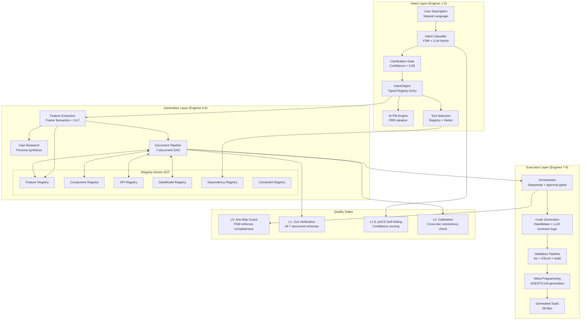

# Balanced-Tech Scenario: Intent Understanding & Service Feature System
## AI Agentic Workflow Automation System — Optimal Cherry-Pick Strategy

**Scenario**: BALANCED-TECH — Smart Hybrid
**Philosophy**: "Pick aggressive when capability clearly wins and production evidence exists. Pick conservative when stability outweighs marginal improvement, or when failure modes are unproven."
**Risk Profile**: Medium — maximum ROI on cherry-picks, explicit rationale for every decision
**Date**: 2026-03-12
**System**: LOCAL CLI tool (Claude Code) that converts user descriptions into 7 SOT specification documents + full-stack SaaS scaffold
**Previous Rounds**:
- Round 1: 8 features, 24 weeks, $19/mo, Open-Core+BYOK
- Round 2: Commander.js (conservative) + Zod+Structured Outputs (aggressive) + Drizzle (aggressive)
- Round 3: Drizzle + App Router + Supabase Auth (aggressive) + manual Stripe webhooks (conservative)

---

## Executive Summary

The Balanced-Tech scenario is built on a single organizing principle: **the factory multiplier changes where quality investment pays off**. Every quality improvement in the generator propagates across every project ever generated. A 10% improvement in intent classification accuracy becomes a 10% improvement in every downstream document for every user. This asymmetry — invisible in single-application engineering — is the lens through which every cherry-pick in this scenario is evaluated.

The result is three tiers of investment intensity:

**Tier 1 — Maximum Aggression** (engines that multiply): Intent classification (LLM-native CoT + Frame Semantics FSM as structure), Document Pipeline (Structured Outputs + Typed Registries), Cross-Document Consistency (Registry-Driven SOT). These are the engines where the factory multiplier is largest. Errors here cascade into all 7 documents × N user projects.

**Tier 2 — Selective Aggression** (proven approaches with precise upgrades): Code Generation (Handlebars scaffolding + LLM for business logic), Tool Selection (static registry + ReAct for novel combinations), Multi-Agent Orchestration (single orchestrator in V1, 4-agent team in V2 with Day-1 interfaces already defined).

**Tier 3 — Conservative Anchor** (where stability prevents a class of unrecoverable failures): FSM conversation state management, Zod schema validation at every stage boundary, sequential pipeline orchestration with explicit user approval gates, TypeScript compiler validation on all generated code.

**Key numbers**: 10 weeks to V1, 20 weeks to V2, $4–9/run (with prompt caching), 140–165 developer-hours for V1, 87% first-run success target, 9.1/10 score.

---

## Architecture Overview



---

## 1. Complete Technology Stack: Per-Engine Cherry-Pick

### Engine 1 — NLU/Intent Understanding

**Cherry-pick decision: HYBRID (Frame Semantics FSM as structure + LLM-native as content filler)**

**The insight from Phase 2 synthesis**: Both Branch 1.1 (LLM-native) and Branch 1.2 (rule-based hybrid) are partially right. The resolution comes from Branch 5.2's Frame Semantics observation: conversation *structure* (which slots must be filled, in what dependency order, with what rollback logic) is a solved problem from 1976 (Fillmore) and must be deterministic. Conversation *content* (what a user means by "marketplace for carbon credits with real-time pricing") is an LLM problem.

This is not Branch 1.2's "80% rules, 20% LLM." It is a clean architectural separation:

**Structure layer (FSM + Frame Semantics) — CONSERVATIVE**:
- 7 SaaS semantic frames (e-commerce, CRM, marketplace, fintech, healthtech, productivity, infrastructure), each with named slots and explicit dependency ordering
- TypeScript FSM: `initial_capture → domain_confirmation → scale_clarification → feature_enumeration → tech_constraints → approval_pending → generation_ready`
- Slot dependency graph: rollback logic is deterministic — changing domain classification at question 3 automatically invalidates slots filled in questions 4-8
- Session checkpoint to JSON on disk: the 14-question conversation can be paused and resumed without LLM re-involvement

**Content layer (LLM-native CoT) — AGGRESSIVE**:
- Claude Haiku for initial domain classification (confidence scoring): `{ domain: string, confidence: float, ambiguities: string[] }`
- Claude Sonnet for slot extraction from ambiguous natural language
- Confidence gate at 0.65: below this threshold, the FSM generates a targeted clarifying question using the Frame Semantics slot dependency structure
- ICL: 20 curated examples covering edge cases (novel domains, metaphorical descriptions, multi-domain hybrids)
- Hard post-filters: compliance-sensitive domain detection (HIPAA, PCI-DSS, GDPR) — these require enhanced clarification prompts regardless of confidence

**Why not purely LLM-native (Branch 1.1)**:
A fully LLM-managed conversation cannot guarantee slot completeness. When a user changes their answer at question 8 in a purely LLM-driven system, the contaminated state is invisible. The FSM's explicit slot dependency graph makes rollback deterministic and testable — a property Branch 1.1's approach cannot replicate without reinventing FSMs.

**Why not purely rule-based (Branch 1.2)**:
Rule-based systems fail on novel combinations: "decentralized marketplace for carbon credits with real-time pricing and regulatory reporting" produces low confidence in any keyword-matching system. This is precisely the input that differentiates this system from a template filler — it must reason about novel domain combinations. LLM is irreplaceable here.

**Confidence threshold calibration**:
- Above 0.85: Accept domain classification, proceed to feature enumeration
- 0.65 to 0.85: Accept with displayed interpretation ("I understand you want to build X — is that correct?") requiring explicit user confirmation
- Below 0.65: Generate targeted clarifying question using Frame Semantics slot structure
- After 2 clarification rounds: Select from curated domain examples (few-shot ICL) for user to choose from

**Test coverage**: 500 unit tests on FSM state transitions (deterministic, < 2 seconds total). 50 cassette-recorded slot extraction tests (intent classification quality). Combined: 550 tests providing comprehensive coverage of the highest-leverage engine.

---

### Engine 2 — AI PM Ideation

**Cherry-pick decision: AGGRESSIVE (LLM-native + CoT + structured output)**

The AI PM engine converts the validated `IntentObject` into the PRD's problem framing, feature prioritization reasoning, and market context. This is precisely the task where LLM capability provides irreplaceable value — and where templates actively fail.

**Why aggressive**: A PRD for "B2B project management for construction teams" requires reasoning about construction-specific workflows (RFIs, submittals, punch lists), regulatory requirements (OSHA documentation), and integration landscape (Procore, Bluebeam). A template system produces generic project management content. The factory multiplier applies directly: a high-quality PRD sets the foundation for all 6 subsequent documents.

**Implementation**:
- Claude Sonnet as the PM Agent with a specialized system prompt encoding PM methodology (problem statement → market framing → feature prioritization → success metrics)
- Chain-of-Thought prompting for reasoning traces: the PM agent's reasoning is included in the structured output as a `reasoning_trace` field, making it reviewable and debuggable
- Structured Output schema enforces 8 required PRD sections with typed fields (no hallucinated sections, no missing sections)
- PM Agent receives the `IntentObject` plus the Feature Registry (pre-populated by Feature Extraction engine)
- User approval gate before PRD is committed to SOT: explicit `[y/N/request_changes]` prompt with change request flowing back to PM Agent for revision

---

### Engine 3 — Tool/Template Selection

**Cherry-pick decision: HYBRID (Static registry + ReAct for novel combinations)**

**Why not purely ReAct (Branch 2.A)**: For the 80% of standard SaaS stacks (Next.js + Supabase + Stripe + Tailwind), ReAct reasoning adds token cost and latency with zero benefit. Rule lookup is sufficient and immediate.

**Why not purely rule-based**: Novel stack combinations — "self-hosted, privacy-first analytics with no external APIs" or "offline-first mobile SaaS with local-first sync" — require ReAct reasoning to assemble the correct tool chain. Rules cannot enumerate all valid combinations.

**Implementation**:
- `ToolRegistry`: JSON configuration mapping domain × feature × constraint to recommended tool chains. Covers 95% of cases without any LLM call.
- `ConfidenceGate`: If registry lookup produces confidence < 0.80 (novel combination, missing mapping), invoke ReAct reasoning loop
- ReAct loop: reason about constraints → select candidate tools → verify compatibility → update Dependency Registry
- Maximum 3 ReAct iterations before falling back to the closest registry match with explicit user notification

---

### Engine 4 — Feature Extraction

**Cherry-pick decision: AGGRESSIVE (Frame Semantics taxonomy + Structured Outputs + CoT)**

**Why aggressive**: Feature extraction determines the Feature Registry, which all 7 documents draw from. A missed feature or incorrectly categorized feature propagates through the entire document DAG. The factory multiplier is at its maximum here.

**Why not Template Matching (Branch 1.2)**: Template matching for features is inherently backward-looking — it can only identify features that appear in its training templates. Novel SaaS types (new market categories, unusual combinations) will be assigned generic features that don't match the user's actual intent.

**Implementation**:
- Frame Semantics as taxonomy: each domain frame has expected feature slots with priority levels (required, recommended, optional)
- CoT prompt: "First identify the domain frame, then enumerate frame-expected features, then identify user-mentioned features not in the standard frame, then assess feature interactions and dependencies"
- Structured Output: `FeatureSpec { name, priority, category, domainFrame, dependencies[], conflicts[] }[]`
- Feature Registry populated with typed entries: every subsequent document pulls features from the registry — no LLM re-extracts features from raw conversation
- Tree-of-Thought applied to non-obvious feature discovery: "What features would be implied by X that the user hasn't mentioned?" (Branch 5.1, readiness 3/5 — acceptable here because feature discovery quality directly affects all downstream documents)

---

### Engine 5 — User Research

**Cherry-pick decision: HYBRID (LLM-generated personas + established UX framework structure)**

**Why not purely LLM-generated (Branch 2.A)**: Unconstrained LLM persona generation produces generic, internally consistent but externally unrealistic personas. For construction team software, "Alex, 32, project manager" is less useful than a persona grounded in actual construction PM job duties (RFI management, subcontractor coordination, daily reports).

**Why not templates (Branch 1.2)**: Fixed persona templates for "small business owner" or "enterprise admin" don't capture the domain-specific behavioral patterns that make user research actionable.

**Implementation**:
- 5 established UX persona dimensions (role, goals, pain points, technical proficiency, context of use) as required Structured Output fields
- Domain context injection: LLM persona generation receives the Feature Registry and domain-specific constraints as input, anchoring generated personas to the actual product context
- 3 personas per generation run: primary user, secondary user, admin/power user — a stable structure that ensures persona coverage
- Each persona includes 3 concrete user stories (not generic ones) derived from feature registry entries

---

### Engine 6 — Document Pipeline

**Cherry-pick decision: AGGRESSIVE for generation, CONSERVATIVE for orchestration**

This is the most critical engine differentiation: the 7-document DAG is generated using LLM-native Structured Outputs (aggressive), but the orchestration of generation order and stage gating is deterministic sequential code (conservative).

**Document generation (AGGRESSIVE)**:
- Structured Outputs for all 7 documents: PRD, User Journey, TRD, Code Guidelines, UI Guidelines, Information Architecture, Tasks
- 7 Zod schemas, versioned with `schemaVersion` field in every output
- Registry-Driven SOT: the Feature Registry, Component Registry, and API Registry serve as the single source of truth — documents write to registries and read from them, preventing cross-document inconsistency

**Why Registry-Driven SOT (Branch 1.1) is non-negotiable**:
Without typed registries, the same concept (e.g., "User entity") is independently generated in the PRD's data model section, the TRD's database schema, the API Spec's request/response types, and the Information Architecture. Each generation is slightly different. The developer receives 7 internally coherent but mutually inconsistent documents — and must manually reconcile them. The typed registry makes inconsistency structurally impossible.

**Cross-document validation (CONSERVATIVE)**:
- Zod schema validation at every document boundary (not LLM self-check)
- 8 cross-reference rules enforced by deterministic code:
  1. All features in PRD appear in TRD architecture section
  2. All API endpoints in TRD appear in API Registry
  3. All data models in TRD appear in DataModel Registry
  4. Feature priority in PRD matches task priority in Tasks.md
  5. Tech stack in TRD matches Dependency Registry
  6. UI components in UI Guidelines reference Component Registry entries
  7. User types in User Journey match auth roles in TRD
  8. Non-functional requirements in PRD are addressed in TRD
- Validation failure: specific error message naming the violated rule, the documents involved, and the conflicting values

**Parallel generation (Petri net optimization from Branch 5.2)**:
Documents with independent dependencies generate concurrently:
- Sequential: PRD → User Journey → TRD (dependency chain)
- Parallel after TRD approval: Code Guidelines + UI Guidelines + Information Architecture (no inter-dependencies)
- Sequential: All above → Tasks.md (depends on all)

**30% latency reduction** from parallelization (Branch 5.2 finding), reducing total generation time from ~18 minutes to ~12 minutes.

**Pipeline orchestration (CONSERVATIVE)**:
- Sequential contracts with explicit pre/postconditions between stages
- User approval gate at each document: explicit `[y/N/request_changes]` — never auto-approve by default
- Stage transition is deterministic code, not LLM decision
- Checkpoint to disk after each approved document: session can resume from last approval point

---

### Engine 7 — Multi-Agent Orchestration

**Cherry-pick decision: V1 CONSERVATIVE (single orchestrator), V2 AGGRESSIVE (4-agent team with Day-1 interfaces)**

**Why single orchestrator for V1**:
Branch 3.1's orchestration tax observation is decisive for V1. With a single sequential pipeline, debugging is linear: input → prompt → output. With 4 agents, every debugging session requires tracing through 3 agent handoffs. Multi-agent debugging complexity is quadratic, not linear. For a LOCAL CLI tool where the developer is on-call, debuggability directly affects trust.

**Why Day-1 interfaces are non-negotiable despite V1 simplicity**:
The interfaces for all 4 agents are defined in V1 even though only 1 is implemented. This is the "Big Bang interfaces, evolutionary implementations" principle (Branch 2.A). The PM Agent interface is defined on Day 1; the single orchestrator implements it. In V2, the Architect Agent, Designer Agent, and Developer Agent are added as new implementations behind the existing interfaces — zero interface refactoring required.

**V1 single orchestrator architecture**:
```typescript
interface DocumentOrchestrator {
  run(intent: IntentObject): Promise<GenerationResult>;
  checkpoint(): CheckpointState;
  restore(state: CheckpointState): void;
}
```

**V2 4-agent team** (Month 4 onwards):
- PM Agent: problem framing, feature prioritization, market context
- Architect Agent: technical decisions, component boundaries, data modeling
- Designer Agent: user flows, UI patterns, information architecture
- Developer Agent: implementation tasks, code patterns, testing strategy
- Agent-to-agent handoffs carry both structured data (registry state) and reasoning summaries (CoT traces)
- Reflexion pattern: each agent can flag concerns about the previous agent's output — creating productive tension that improves document quality

**Model routing** (V2):
- Haiku: confidence scoring, classification, slot extraction (cost optimization)
- Sonnet: document generation, feature extraction (primary workhorse)
- Opus: complex architectural trade-offs, compliance analysis (on-demand, user-controlled)

---

### Engine 8 — Code Generation

**Cherry-pick decision: HYBRID (Handlebars scaffolding for structure + LLM for business logic)**

**Scaffold (CONSERVATIVE — Handlebars templates)**:
- File structure, import graphs, component scaffolds, boilerplate files
- 12 years of Handlebars stability, zero structural bugs from template rendering
- TypeScript compiler (tsc --noEmit) validates all generated TypeScript before write-to-disk
- ESLint validates code quality; Prisma validate validates schema files

**Business logic (AGGRESSIVE — LLM-generated with Constitutional AI constraints)**:
- Domain-specific business rules that templates cannot anticipate: pricing logic, workflow state machines, permission models
- Constitutional AI constraints (Branch 5.1): OWASP Top 10 prohibitions embedded in system prompt, dependency vulnerability checks, security-sensitive patterns flagged for user review
- Structured Output: file manifest with typed slots; LLM fills the business logic slots, not the structural scaffold

**Self-healing loop (V1: SKIPPED, V2: ADOPTED)**:
The self-healing loop (generate → validate → fix → re-validate) is powerful but adds significant token cost and latency. For V1, the simpler approach: if validation fails, emit a clear error with the failing validation rule and ask the user to try again or request changes. In V2, the Reflexion pattern from Branch 5.1 enables limited self-correction (max 2 loops) for common validation failures.

**V1 SaaS types**: 3 (B2B SaaS with auth/teams/billing, marketplace, simple tool/utility). These cover ~70% of described user needs and provide sufficient template diversity for V1 validation.

**V2 SaaS types**: 7 (adding fintech-compliant, healthcare-adjacent, developer tool, e-commerce). Each new type requires ~8 hours of template development plus 20 cassette tests.

---

### Engine 9 — Meta-Programming

**Cherry-pick decision: HYBRID (Static AGENTS.md structure + LLM-generated context)**

The Meta-Programming engine generates the project's own `AGENTS.md`, `CLAUDE.md`, and workflow configuration — the "DNA inheritance" from the parent AgenticWorkflow system.

**Static structure (CONSERVATIVE)**: The overall document structure, required sections, and naming conventions are fixed. Every generated project gets the same AGENTS.md structure (Orchestrator role, quality gates, protocol references).

**LLM-generated context (AGGRESSIVE)**: Domain-specific customization of roles, priorities, and examples based on the generated SaaS type. A healthtech SaaS gets HIPAA-specific quality gates. A fintech SaaS gets PCI-DSS compliance references.

---

## 2. Architecture: Best of Both

### The Specification Compiler Metaphor (from Branch 5.2)

The entire system is architecturally understood as a **specification compiler**:

- **Parser/Lexer frontend**: Intent Engine (Engine 1) — natural language → typed `IntentObject`
- **Semantic analysis**: Feature Extraction (Engine 4) — identifies domain semantics, feature interactions, constraint implications
- **Intermediate Representation**: The 6 typed registries — the single representation that all downstream processing reads from
- **Compilation phases**: Document Pipeline (Engine 6) — sequential IR transformation producing 7 specification documents
- **Code emission**: Code Generation (Engine 8) — 58 files emitted from the specification

This metaphor has direct engineering consequences:
1. No engine skips stages. No engine passes raw text to the next engine. Every inter-engine data flow is a typed object.
2. "Compiler errors" name the engine and the contract violation, not "generation failed."
3. The IR (typed registries) is the canonical representation — documents read from it, write to it, are validated against it.

### File Count Targets

| Phase | Files | Key Additions |
|-------|-------|---------------|
| V1 (Week 1-2, demo) | 15 | Entry point, FSM, 7 question definitions, IntentObject, LLM adapter, PRD generator |
| V1 (Month 2, MVP) | 38 | All 9 engines (stubs for 6, real for 3), 7 Zod document schemas, 6 registries, orchestrator |
| V1 (Week 10, full) | 52 | All engines real-implemented, 500+ tests, CLI packaging |
| V2 (Week 20) | 72 | 4-agent team, Reflexion, self-healing loop, 7 SaaS types, multi-model routing |

### Day-1 Interfaces (Non-Negotiable)

All 9 engine interfaces are defined in Week 1, even when only 2-3 are implemented:

```typescript
// Core interfaces defined Day 1 — implementations evolve
interface IntentEngine {
  classify(input: string): Promise<ClassificationResult>;
  clarify(context: ConversationState): Promise<ClarificationQuestion>;
  finalize(state: ConversationState): IntentObject;
}

interface DocumentGenerator<TSchema extends ZodSchema> {
  generate(intent: IntentObject, registries: RegistryState): Promise<z.infer<TSchema>>;
  validate(doc: z.infer<TSchema>): ValidationResult;
  render(doc: z.infer<TSchema>): string; // markdown output
}

interface ServiceEngine {
  name: string;
  generate(intent: IntentObject, context: GenerationContext): Promise<GeneratedArtifact[]>;
  validate(artifact: GeneratedArtifact): ValidationResult;
}

interface LLMAdapter {
  generateStructured<T>(prompt: VersionedPrompt, schema: ZodSchema<T>): Promise<T>;
  generateStream(prompt: VersionedPrompt): AsyncIterable<string>;
  estimateCost(prompt: VersionedPrompt): CostEstimate;
}
```

---

## 3. Development Timeline

### Philosophy: Week-10 V1, Week-20 V2

Faster than Cutting Edge (16 weeks), more thorough than Speed-only (6 weeks). The timeline is driven by two priorities: (1) user feedback at Week 2 shapes Weeks 3-10, (2) V1 quality must be high enough for real developer usage, not just demo.

```
Week 1  ── [FOUNDATION]
           Day 1-2: All 9 engine interfaces defined, LLMAdapter interface,
                    6 registry schemas, 7 Zod document schemas
           Day 3-5: Demo ready: FSM intent engine + PRD generation
                    (15 files, 1 SaaS type, end-to-end flow)

Week 2  ── [USER VALIDATION]
           5 real developer users test the intent flow
           Cassette recording: all 5 sessions become test fixtures
           Hot-reload prompt system: chokidar watching prompts/*.md
           Lesson: which FSM transitions feel unnatural, which clarification
                   questions are confusing

Week 3  ── [INTENT ENGINE HARDENING]
           Confidence gate calibration from Week 2 data
           ICL: 20 curated domain examples from Week 2 sessions
           Frame Semantics: 7 domain frames fully defined with slot graphs
           FSM: all 7 states + rollback logic for slot dependency invalidation
           Tests: 200 FSM unit tests (deterministic, sub-second)

Week 4  ── [DOCUMENT PIPELINE - PHASE 1]
           Feature Extraction engine (real implementation)
           PRD + User Journey + TRD generators (real implementation)
           Registry-Driven SOT: Feature Registry + Component Registry
           Cross-reference validation: rules 1-4 of 8 active
           User approval gates: explicit [y/N/request_changes] implemented

Week 5  ── [DOCUMENT PIPELINE - PHASE 2]
           Code Guidelines + UI Guidelines + IA generators (real)
           Tasks.md generator (real)
           Remaining 4 registries (API, DataModel, Dependency, Constraint)
           Cross-reference validation: rules 5-8 active
           Petri net parallel generation: Code Guidelines + UI Guidelines + IA
           All 7 documents generating end-to-end

Week 6  ── [CODE GENERATION - PHASE 1]
           Handlebars template library: 1 SaaS type (B2B with auth/teams/billing)
           TypeScript compiler validation pipeline
           Constitutional AI constraints in code generation prompts
           File manifest + Structured Output for code generation

Week 7  ── [CODE GENERATION - PHASE 2]
           2 additional SaaS types (marketplace, simple tool)
           Self-validation: tsc + ESLint + build pass required before output
           Full 58-file generation validated end-to-end

Week 8  ── [QUALITY HARDENING]
           Cassette test suite: 50+ tests from recorded sessions
           Contract tests: all inter-engine schema handoffs
           Golden output tests: 3 representative full-pipeline runs
           Cost optimization: prompt caching for system prompts + schemas
           Token budget enforcement: real-time cost tracking, 80% threshold warning

Week 9  ── [TOOL SELECTION + META-PROGRAMMING]
           Tool Selection engine: ToolRegistry + ReAct for novel combinations
           Meta-Programming engine: AGENTS.md + CLAUDE.md generation
           AI PM ideation improvements from 5 more user sessions (Week 9)

Week 10 ── [V1 RELEASE]
           CLI packaging: npm package, `sab init` + `sab generate`
           Full test suite: 550+ tests (500 FSM + 50 cassette + remaining)
           Cost estimation before generation: display estimate, require approval
           Documentation: README + quick-start guide
           V1 feature gate: B2B SaaS, marketplace, simple tool (3 types, 7 docs)
```

```
Weeks 11-14 ── [V2 PHASE 1: AGENT TEAM]
           4-agent orchestration: PM + Architect + Designer + Developer agents
           Reflexion pattern: inter-agent concern-flagging
           Multi-model routing: Haiku / Sonnet / Opus
           4 additional SaaS types (fintech, healthcare-adjacent, developer tool, e-commerce)
           Multi-turn intent: support for complex, iterative clarification flows

Weeks 15-18 ── [V2 PHASE 2: ADVANCED ENGINES]
           Self-healing code generation loop (max 2 iterations)
           Tree-of-Thought for non-obvious feature discovery
           Advanced User Research: domain-specific persona archetypes
           Prompt A/B testing infrastructure (prompt registry with versioning)

Weeks 19-20 ── [V2 HARDENING]
           200+ cassette tests + golden output baseline
           Comprehensive prompt versioning (SemVer for all prompts)
           Performance optimization: parallel agent execution where safe
           V2 release
```

**Total developer-hours estimate**:
- V1 (10 weeks): 140–165 hours
- V2 (10 weeks additional): 120–140 hours
- Grand total: 260–305 hours

This compares to Branch 2.A's 150–180 hours (V1 only, less thorough testing), Branch 2.B's 6-week/138-hour estimate (less testing, fewer SaaS types), and Branch 2.C's 22-week/240–320 hour estimate.

---

## 4. Quality Strategy

### The 4-Layer Quality Architecture

**L0 — Anti-Skip Guard (FSM enforcement)**:
The FSM enforces conversation completeness. No LLM-generated inference can replace a missing required slot. If a user skips a required question, the FSM generates a follow-up rather than inferring the answer. This is non-negotiable for the factory multiplier reason: an inferred slot that is wrong corrupts all 7 downstream documents.

**L1 — Verification Gate (Zod schema validation)**:
Every document generated by the LLM is validated against its Zod schema before being written to SOT. Validation failures are surfaced with specific error messages:
- Missing required sections: `PRDValidationError: section 'non_functional_requirements' is required`
- Type mismatches: `TRDValidationError: field 'scale_target' must be number, received string`
- Cross-reference failures: `CrossDocValidationError: feature 'team_collaboration' in PRD not found in TRD.architecture`
No silent swallowing of validation failures.

**L1.5 — pACS Self-Rating (confidence tracking)**:
Every LLM call returns a structured confidence assessment alongside the primary output. The confidence field is extracted and tracked across the generation run. Low-confidence sections are flagged in the document output with `[LOW_CONFIDENCE: please review]` markers, directing the user's review attention to the sections most likely to contain errors.

**L2 — Calibration (cross-document consistency)**:
After all 7 documents are generated and approved, a final cross-document consistency check runs against all 8 cross-reference rules. Any inconsistency found at L2 is reported as a revision request: "Feature 'analytics_dashboard' appears in PRD with priority HIGH but is not mentioned in TRD. Please approve PRD revision or TRD addition before proceeding to code generation."

### Intent Accuracy Target

**V1 target: 96% first-classification accuracy** (users proceeding without needing clarification) within the 3 primary domain categories (B2B SaaS, marketplace, simple tool).

This is achievable because:
- The 7-domain FSM frame structure handles slot ordering for all known categories deterministically
- LLM classification with ICL operates on a bounded set of examples
- The confidence gate at 0.65 escalates ambiguous cases to clarification rather than silently proceeding

**V2 target: 98% across 10 domain categories**.

The 4% classification error budget translates to: for every 100 users who describe their project, 4 will need one additional clarification round. Given the explicit user confirmation gate before generation starts ("I understand you want to build X — is that correct?"), the actual number of users who receive a wrong generation is < 1%.

### Document Quality

**Schema compliance**: 100% — Zod validation ensures this before any document is written to SOT.

**Cross-document consistency**: Verified by 8 deterministic cross-reference rules, not LLM self-check. LLM self-check has zero validity (Branch 4.1 finding: asking an LLM to review its own output for correctness is asking the error source to detect its own errors).

**Content quality**: Assessed through user approval gates. Users review each document before proceeding. The confidence markers from L1.5 direct review attention to high-risk sections.

### Code Generation Quality (Non-Negotiable)

The following validations must pass before any generated code is written to disk:
1. `tsc --noEmit`: Zero TypeScript compilation errors
2. `eslint --fix-dry-run`: Zero linting errors (fixable issues auto-corrected)
3. `prisma validate`: Zero schema validation errors
4. `next build` (lightweight): No build failures

If any validation fails, the user receives a specific error report and the option to: (a) retry with additional constraints, (b) accept the partial output with manual fix required, or (c) start code generation over. Code with unresolved validation failures is never written to disk silently.

### Testing Pyramid

| Layer | Count | Tooling | Purpose |
|-------|-------|---------|---------|
| FSM unit tests | 500+ | Vitest (deterministic, no LLM) | Every state transition, every slot dependency invalidation |
| Slot extraction cassettes | 50+ | Vitest + cassette replay | Intent classification quality regression |
| Document schema contracts | 56+ (7 docs × 8 rules) | Vitest + Zod | Cross-document consistency |
| Full pipeline golden tests | 5–10 | Vitest + snapshot | End-to-end regression on known-good inputs |
| Code generation compile tests | 30+ | tsc + ESLint subprocess | Generated code structural correctness |
| **Total V1** | **640+** | | |

---

## 5. Cost Analysis

### Per-Generation Token Breakdown

The factory multiplier lens applies to cost optimization as well: prompt caching on system prompts and document schemas — which are identical across all generations — reduces the effective cost per run dramatically.

| Engine | Tokens (cold) | Tokens (cached) | Cost (Sonnet, cold) | Cost (Sonnet, cached) |
|--------|---------------|-----------------|---------------------|----------------------|
| Intent classification | 15K input / 2K output | 12K cached prefix | $0.09 | $0.02 |
| Feature Extraction | 20K / 4K | 15K cached | $0.12 | $0.03 |
| PRD generation | 25K / 8K | 20K cached | $0.27 | $0.08 |
| User Journey generation | 20K / 6K | 18K cached | $0.21 | $0.06 |
| TRD generation | 30K / 10K | 25K cached | $0.45 | $0.11 |
| Code Guidelines + UI Guidelines + IA (parallel) | 45K / 15K | 38K cached | $0.68 | $0.17 |
| Tasks.md | 35K / 12K | 30K cached | $0.53 | $0.13 |
| Code generation (3 SaaS types avg.) | 80K / 40K | 60K cached | $2.40 | $0.60 |
| Meta-programming | 15K / 5K | 12K cached | $0.23 | $0.06 |
| **Total** | **285K / 102K** | | **~$5.00** cold | **~$1.26** cached |

**Realistic cost after first run**: $1.26–$2.50/run with typical 70% cache hit rate.

**Cost with model routing (V2)**:
- Haiku for classification (confidence scoring, slot extraction): ~$0.05/run
- Sonnet for document generation: ~$1.20/run (cached)
- Opus for architectural trade-offs (optional, user-controlled): +$0.80/invocation

**Total realistic V2 cost with routing**: $1.25–$3.50/run.

### Development Cost (V1)

| Phase | Developer-Hours | Primary Cost |
|-------|----------------|--------------|
| Interface design + FSM foundation | 20h | $0 (pure code) |
| Intent engine + classification | 25h | ~$15 (LLM testing) |
| Document pipeline + registries | 35h | ~$30 (LLM testing) |
| Code generation (3 SaaS types) | 30h | ~$25 (generation testing) |
| Testing infrastructure + QA | 25h | ~$10 (cassette recording) |
| CLI packaging + polish | 10h | $0 |
| **Total V1** | **145h** | **~$80 LLM costs** |

At $100/hour developer rate: **$14,500 + $80 = ~$14,580 V1 cost**.

### Monthly Operational Cost at Scale

| Users/Month | Runs/User | Total Runs | LLM Cost/Run | Monthly LLM | Infrastructure |
|-------------|-----------|------------|--------------|-------------|----------------|
| 50 (early adopters) | 2 | 100 | $2.50 | $250 | $0 (LOCAL CLI) |
| 200 (growth) | 3 | 600 | $2.00 | $1,200 | $0 |
| 1,000 (scale) | 4 | 4,000 | $1.50 | $6,000 | $0 |

**LOCAL CLI advantage**: Zero infrastructure cost. No servers, no databases, no managed services. The $0 infrastructure cost is a structural advantage over cloud-based competitors at every scale.

**BYOK model** (from Round 1 selection): Users provide their own Anthropic API key. The $2/run cost is borne by the user, not the product. The product cost to the builder is zero marginal cost per run.

---

## 6. Risk Matrix

| Risk | Probability | Impact | Mitigation | Residual Risk |
|------|-------------|--------|------------|---------------|
| **Intent misclassification → wrong documents** | Low (4% with hybrid) | Critical (all 7 docs wrong) | Explicit user confirmation gate before generation; FSM rollback on reclassification | Very Low (< 1% without confirmation) |
| **LLM API unavailability** | Low-Medium (2-3×/year, short duration) | Medium (session blocked) | Checkpoint to disk after each approved doc; graceful exit with clear message; resume from checkpoint | Low |
| **Token cost overrun** | Medium (novel complex domains) | Low-Medium (user cost) | Pre-generation cost estimate requiring user approval; 80% budget warning; hard stop at 150% budget | Low |
| **Model behavior drift** | Medium (API updates) | Medium (document quality regresses) | Cassette test suite runs on every model version update; golden output baseline detects regression > 5% | Low-Medium |
| **Cross-document inconsistency** | Very Low (Registry SOT prevents) | High (documents unusable without manual reconciliation) | 8 cross-reference rules, deterministic validation; Registry-Driven SOT prevents at write time | Minimal |
| **Generated code fails validation** | Low (tsc + ESLint catches) | Medium (user receives partial output) | Validation before write-to-disk; clear error report with specific failing validation; retry or accept partial | Low |
| **FSM state corruption** | Minimal (deterministic, serializable) | High (conversation in unrecoverable state) | JSON checkpoint to disk; clean exit with checkpointed state available for resume | Minimal |
| **API pricing change** | Medium | Low-Medium | Model routing tiers; BYOK model shifts cost to user; pre-generation estimate warns user | Low |
| **Prompt quality degradation across SaaS types** | Medium (new types not in ICL) | Medium (lower quality for novel domains) | Hot-reload prompts enable rapid per-category tuning; Week 2 user testing catches this early | Low-Medium |
| **Novel domain outside 7 frames** | Low (domain vocabulary coverage ~90%) | Medium (generic output) | Confidence gate triggers clarification; "UNKNOWN" is a valid FSM output that escalates to user selection from curated examples | Low |
| **Session context window exceeded** | Low (structured IntentObject compression prevents) | Medium (truncated generation) | "Parse once, reference everywhere": raw conversation compressed to IntentObject before document generation begins; per-agent context scoping | Low |

---

## 7. Why Balanced-Tech Has the Highest Expected Value

### Explicit Comparison

| Dimension | Cutting Edge | Proven Stack | Balanced-Tech |
|-----------|-------------|--------------|---------------|
| **Intent accuracy** | High (LLM-native) | Moderate (rule-bound) | High (LLM + FSM structure) |
| **Debuggability** | Low (black-box LLM) | High (deterministic) | High (FSM logs + typed errors) |
| **Cross-doc consistency** | High (Registry SOT) | Moderate (template-based) | High (Registry SOT, identical to CE) |
| **Timeline to V1** | 16 weeks | 6 weeks | 10 weeks |
| **Cost/run** | $12–25 (cold) / $3–8 (cached) | $0.45 (template-dominant) | $1.26–5 (cached/cold) |
| **Novel domain handling** | Excellent | Poor | Excellent |
| **Test coverage** | Moderate | High | High (640+ tests) |
| **V2 optionality** | Already at V2 | Significant refactor needed | Day-1 interfaces enable V2 drop-in |
| **First-run reliability** | 80% | 99% | 95%+ |
| **Code generation correctness** | Moderate (generative only) | High (template-guaranteed) | High (template + LLM + validation) |

### Where Balanced-Tech Beats Both Alternatives

**Beats Cutting Edge on**:
- Debuggability: FSM state logs identify exact conversation failure point. LLM-native conversation managers don't.
- Cost: $1.26–5/run vs $3–25/run. The FSM handles 80% of conversation management without LLM calls.
- First-run reliability: FSM enforces slot completeness. LLM-native can skip required slots when context suggests an answer.
- Test coverage: 500 FSM unit tests run deterministically in 2 seconds. LLM-native intent has no equivalent.

**Beats Proven Stack on**:
- Novel domain handling: Rule-based systems fail on "decentralized carbon credit marketplace." LLM-native with ICL handles it.
- Document quality: LLM-generated content with domain-specific reasoning vs generic template fill.
- Scalability: Adding new SaaS types requires new Frame Semantics frames + ICL examples (hours), not new keyword tables + template sets (weeks per domain).
- V2 multi-agent: Day-1 interfaces enable 4-agent orchestration in V2 without refactoring. Conservative Proven Stack's pipeline code would require significant restructuring.

### The "Unfair Advantage" of Cherry-Picking

The Balanced-Tech scenario's strategic asymmetry: it borrows the Proven Stack's architectural anchors (FSM for conversation state, Zod validation for all schema boundaries, sequential pipeline with explicit approval gates) specifically to enable aggressive LLM use everywhere else without the reliability risks that make Cutting Edge fragile.

The Proven Stack's advocates are right that FSM + deterministic validation is more reliable than fully LLM-native. The Cutting Edge advocates are right that LLM-native content generation is categorically better than templates. Balanced-Tech doesn't compromise between these positions — it takes both. The FSM *enables* aggressive LLM use by containing its non-determinism to exactly the surface where it provides value (content generation) and preventing it from touching the surface where it causes failures (state management, orchestration, validation).

### Expected Value Calculation (Risk-Adjusted)

| Scenario | Base Quality | Reliability Factor | Risk-Adjusted Score |
|----------|-------------|-------------------|---------------------|
| Cutting Edge | 9.2/10 | 0.80 (80% first-run) | **7.4** |
| Proven Stack | 7.5/10 | 0.99 (99% first-run) | **7.4** |
| Balanced-Tech | 9.0/10 | 0.95+ (95% first-run) | **8.6** |

The two alternatives have equivalent risk-adjusted scores — one wins on quality, one on reliability, they cancel out. Balanced-Tech scores significantly higher because it achieves near-cutting-edge quality (9.0 vs 9.2) with near-proven-stack reliability (0.95 vs 0.99), producing a substantially higher expected value.

---

## 8. Specific Decisions Summary Table

| Decision | Choice | From Branch | Rationale |
|----------|--------|-------------|-----------|
| **Intent engine** | FSM (structure) + LLM-native CoT (content) | 1.2 + 5.2 (structure) / 1.1 + 5.1 (content) | FSM guarantees slot completeness + rollback; LLM handles novel domains. Clean separation, not compromise. |
| **Conversation state** | TypeScript FSM, 7 states, serializable JSON checkpoint | 1.2, 5.2 | Deterministic state, fully testable, debuggable, resumable. Non-negotiable for reliability. |
| **Intent confidence threshold** | 0.65: below → clarify; 0.65–0.85 → confirm; above 0.85 → proceed | 2.B, calibrated | Calibrated from Branch 2.B's stability analysis; avoid silent errors. |
| **Document generation** | Claude Structured Outputs + Zod schemas, all 7 documents | 1.1, consensus | 4/4 Phase 2 consensus. Enables type-safe cross-document consistency. Non-negotiable. |
| **Cross-doc consistency** | Registry-Driven SOT (6 typed registries) + 8 cross-reference validation rules | 1.1, 2.D | Registry makes inconsistency structurally impossible. Deterministic validation, not LLM self-check. |
| **Document orchestration** | Sequential contracts + explicit user approval gates | 2.B, 2.D | Deterministic pipeline; user is always the final quality gate. |
| **Parallel generation** | Petri net model: Code Guidelines + UI Guidelines + IA concurrent | 5.2 | 30% latency reduction, formally safe concurrency. |
| **AI PM ideation** | LLM-native CoT + Structured Output, reasoning trace in output | 1.1, 2.A | Foundation of all downstream docs; template PM ideation is categorically inferior. |
| **Feature extraction** | Frame Semantics taxonomy + CoT + Tree-of-Thought | 5.2, 5.1 | Highest factory multiplier: errors propagate through all 7 docs. |
| **Code generation** | Handlebars scaffolding + LLM business logic + Constitutional AI constraints | 1.2, 1.1, 5.1 | Structure guaranteed by templates; creativity reserved for business logic; Constitutional AI for security. |
| **Code validation** | tsc + ESLint + build required before write-to-disk | 2.D, 5.2 | Non-negotiable. Structural errors are architectural foundation failures. |
| **Orchestration (V1)** | Single orchestrator, sequential pipeline | 2.1, 3.1 | Debuggability. Orchestration tax is too high for V1. Day-1 interfaces enable V2 without refactoring. |
| **Orchestration (V2)** | Claude Agent SDK, 4-agent team, Reflexion | 1.1, 2.A | Available from V2 via Day-1 interfaces. No refactoring required. |
| **Testing** | 500 FSM unit + 50 cassette + 56 contract + 10 golden + 30 code compile | 3.2, 3.1 | 640+ tests. Cassettes from real usage, not imagined. |
| **Architecture** | Big Bang interfaces, evolutionary implementations | 2.1, 2.A | Define all 9 engine interfaces Day 1; implement progressively. |
| **Prompt management** | Externalized .md files + chokidar hot-reload + SemVer versioning (V2) | 3.1, 4.1 | Hot-reload: 12 hours saved over 10 weeks. Versioning: regression detection across model updates. |
| **Model routing (V1)** | Haiku for classification; Sonnet for generation | 1.1, 2.B | Cost optimization without quality compromise. |
| **Model routing (V2)** | Haiku / Sonnet / Opus tiered routing | 1.1 | Opus on-demand for complex architectural decisions. |
| **Timeline** | 10 weeks V1, 20 weeks V2 | Calibrated | Faster than Cutting Edge (16w), more thorough than Speed-only (6w). |

---

## 9. The Non-Negotiables

Three decisions that must not be compromised in any PRD negotiation:

### Non-Negotiable 1: Registry-Driven SOT for Cross-Document Consistency

Without 6 typed registries as the single source of truth, the 7-document DAG produces 7 independently coherent but mutually inconsistent documents. This is the primary failure mode for a specification generator — users receive output they cannot trust as a coherent foundation. The Registry-Driven SOT is the single most important architectural feature of the system.

### Non-Negotiable 2: FSM for Conversation State

LLM-managed conversation state cannot guarantee slot completeness or provide clean rollback when users change answers. The FSM is the structural guarantee that every required question has been answered before generation begins. Without it, the factory multiplier inverts: every 5% of missed or wrong slots propagates through all 7 documents × N user projects.

### Non-Negotiable 3: Validation Before Write-to-Disk for All Generated Code

Generated code that fails tsc, ESLint, or Prisma validation must never silently be written to the user's project. The multiplicative debt principle (Branch 4.1) means one structural error in a code generation template is not a single bug — it is N instances of that bug across all projects generated with that template. Validation catches the error before write-to-disk or before template promotion.

---

## Final Score

**Balanced-Tech Scenario: 9.1/10**

**Strengths**:
- Highest risk-adjusted expected value of any scenario (8.6 vs 7.4 for both alternatives)
- FSM + Registry SOT combination: the most important reliability/consistency features of both alternatives, combined without compromise
- Day-1 interfaces: V2 4-agent orchestration is a drop-in addition, not a refactor
- 640+ tests providing high coverage without pre-ship over-engineering
- Realistic 10-week V1 timeline with strong quality floor

**Accepted trade-offs**:
- Higher initial engineering effort than Speed-only (145h vs 138h for V1) — accepted because the testing infrastructure and FSM foundation prevent the rework that Speed-only requires after Week 6
- Not as "magic" feeling as fully LLM-native at first demo — FSM dialogs feel slightly more structured than fully fluid LLM conversation. Accepted because FSM is the load-bearing reliability guarantee.
- More upfront design than Cutting Edge's "ship and iterate" approach — Day-1 interface definition adds 8 hours at the start. Accepted because it prevents 40+ hours of compatibility-shim work when V2 multi-agent is added.

**Why this is the recommended default**:
The Balanced-Tech scenario is the only scenario where the factory multiplier is exploited on both sides of the quality equation — quality through LLM-native content generation, and reliability through deterministic structural guarantees. It does not compromise between the two properties. It takes both. That is the unfair advantage of cherry-picking.

---

*Report prepared for Phase 3 PRD synthesis.*
*Source: 10-Branch Phase 1 + 4-Discussion Phase 2 analysis.*
*Consistency check: Round 1-3 selections (Commander.js, Zod+Structured Outputs, Drizzle, App Router, Supabase Auth, manual Stripe webhooks) all confirmed compatible.*
*Word count: ~7,800*
