# AI Agentic Workflow Automation System: CUTTING EDGE Scenario

**Scenario**: CUTTING EDGE (Maximum Innovation)
**Philosophy**: "Push every boundary. Use the most capable technology at every layer. The result justifies the risk."
**Risk Profile**: HIGH — offset by highest architectural ceiling, strongest competitive moat, and capabilities neither Balanced nor Proven scenarios can achieve
**Date**: 2026-03-12
**System Context**: LOCAL CLI tool (Claude Code) that generates full-stack SaaS from user descriptions
**Scope**: 9 Service Engines — intent through meta-programming
**Pre-work context**: PRD.md preparation research
**User approval**: Required at defined checkpoints

---

## Executive Summary

The Cutting Edge scenario makes a unified architectural bet: that the 2025–2026 convergence of Claude Agent SDK, Structured Outputs, Tree-of-Thought reasoning, Multi-Agent Debate, Constitutional AI self-correction, and Petri net-optimized parallel document generation creates a system capable of things that no alternative approach can match.

Where the Balanced scenario uses rule-based intent parsing for reliability, this scenario deploys full LLM-native Chain-of-Thought + Tree-of-Thought for intent that understands *what you meant*, not just *what you said*. Where Proven uses FSM-driven document pipelines, this scenario orchestrates 4 specialized agents (PM, Designer, Architect, Developer) with parallel generation guided by formal Petri net topology — producing all 7 SOT documents 30% faster at 60%+ lower cost via prompt caching. Where Conservative hands off code generation to templates, this scenario generates AST-aware code with a self-healing loop, then generates the generated project's own AI rules, agent personas, and AGENTS.md — a system that reproduces itself in every child.

The trade-off is honest: this scenario requires the greatest development effort (~20 weeks to V1), carries real dependency risk from pre-1.0 technologies, and demands a technology leader comfortable with 20–25% failure probability on any given sprint. The upside is equally honest: this is the only scenario where the system proactively suggests features the user did not mention, where inconsistencies between documents are caught by Constitutional AI before the user sees them, where code passes tests before it reaches the user's filesystem, and where every generated project inherits the parent system's quality DNA.

**Final Score: 8.5/10**

---

## Architecture Overview

```mermaid
flowchart TD
    USER["User Terminal\nssaas-builder create 'My idea'"]

    subgraph CLI["CLI Layer (Commander.js + Ink)"]
        INPUT["Input Parsing\nIntent Capture"]
        APPROVAL["User Approval Gates\n(human) checkpoints"]
    end

    subgraph ENGINE1["Engine 1: NLU/Intent"]
        COT["Chain-of-Thought\nIntent Decomposition"]
        TOT["Tree-of-Thought\nAmbiguity Resolution"]
        CAI1["Constitutional AI\nSelf-Validation"]
        PROACT["Proactive Feature\nSuggestion Engine"]
    end

    subgraph ENGINE2["Engine 2: AI PM Ideation"]
        DEBATE["Multi-Agent Debate\nOptimist vs Pessimist PM"]
        REFLEX2["Reflexion\nIterative Refinement"]
        RAG["RAG from\nSaaS Examples DB"]
    end

    subgraph ENGINE3["Engine 3: Tool/Template Selection"]
        REACT3["ReAct Pattern\nReason → Act → Observe"]
        MCP3["MCP Server\nTemplate Catalog"]
        COMPAT["Compatibility\nValidator"]
    end

    subgraph ENGINE4["Engine 4: Feature Extraction"]
        STRUCT4["Structured Outputs\nFeature Taxonomy"]
        COT4["CoT Decomposition\nVague → Concrete"]
    end

    subgraph ENGINE5["Engine 5: User Research"]
        PERSONA["LLM Persona\nSynthesis"]
        JOURNEY["User Journey\nGeneration"]
        EDGE["Edge Case\nDetection"]
    end

    subgraph ENGINE6["Engine 6: Document Pipeline"]
        PETRI["Petri Net\nTopology Optimizer"]
        PARALLEL["Parallel Generation\nDAG-Aware"]
        CAI6["Constitutional AI\nSelf-Review per Doc"]
        CACHE["Prompt Caching\n60%+ Cost Reduction"]
        subgraph DOCS["7 SOT Documents"]
            PRD["PRD"]
            UJ["User Journey"]
            TRD["TRD"]
            CG["Code Guidelines"]
            UIG["UI Guidelines"]
            IA["IA"]
            TASKS["Tasks"]
        end
        REG["6 JSON Registries\nCross-Doc Consistency"]
    end

    subgraph ENGINE7["Engine 7: Multi-Agent Orchestration"]
        LEAD["Orchestrator Agent\nTeam Lead"]
        PM_AGENT["PM Agent"]
        DESIGNER["Designer Agent"]
        ARCH["Architect Agent"]
        DEV_AGENT["Developer Agent"]
        ROUTING["Model Routing\nHaiku/Sonnet/Opus"]
        REFLEX7["Reflexion\nLearn from Failures"]
    end

    subgraph ENGINE8["Engine 8: Code Generation"]
        AST["AST-Aware\nGeneration"]
        SELFHEAL["Self-Healing Loop\nGenerate→Test→Fix (3x)"]
        DEPGRAPH["Dependency Layer\nParallel (5 layers)"]
        FULLGEN["58-File Full\nGeneration"]
    end

    subgraph ENGINE9["Engine 9: Meta-Programming"]
        PROMPTPROG["Prompt Programming\nGenerate Prompts for Child"]
        DNA["DNA Inheritance\nsoul.md Pattern"]
        AGENTSMD["AGENTS.md\nTailored to Child Stack"]
    end

    USER --> CLI
    CLI --> ENGINE1
    ENGINE1 --> ENGINE2
    ENGINE2 --> ENGINE3
    ENGINE3 --> ENGINE4
    ENGINE4 --> ENGINE5
    ENGINE5 --> ENGINE6
    ENGINE6 --> ENGINE7
    ENGINE7 --> ENGINE8
    ENGINE8 --> ENGINE9
    ENGINE9 --> APPROVAL
    APPROVAL --> USER

    style ENGINE1 fill:#ff6b6b,color:#fff
    style ENGINE2 fill:#ee5a24,color:#fff
    style ENGINE6 fill:#0984e3,color:#fff
    style ENGINE7 fill:#6c5ce7,color:#fff
    style ENGINE9 fill:#00b894,color:#fff
```



---

## 1. Complete Technology Stack: All 9 Service Engines

### Engine 1 — NLU/Intent Understanding

**Primary Technology**: LLM-native intent via Claude Structured Outputs + Chain-of-Thought + Tree-of-Thought + Constitutional AI

| Dimension | Specification |
|-----------|--------------|
| **Core approach** | Zero rule-based layer. Full Claude Sonnet 4.6 reasoning on every intent inference |
| **Simple intents** | Single-pass CoT: `"I want a project management SaaS"` → structured intent object in 1 LLM call |
| **Complex intents** | Multi-step CoT decomposition: `"Something like Notion but for lawyers"` → domain analysis → feature extraction → target user identification → constraint derivation |
| **Ambiguous intents** | Tree-of-Thought: 3–5 candidate interpretations generated in parallel branches → scored by Constitutional AI self-evaluator → highest-score branch selected, alternatives surfaced to user |
| **Constitutional AI** | Self-validation pass: the system evaluates its own intent understanding against 7 constitutional principles (completeness, specificity, feasibility, market fit, technical clarity, scope clarity, novelty) before proceeding |
| **Proactive suggestions** | System analyzes intent → identifies standard SaaS features not mentioned but statistically common for the domain (e.g., user mentions "project tracker" → system suggests: team collaboration, Gantt view, time tracking, integrations with Slack) — surfaced as optional additions |
| **Structured output schema** | Zod schema with 14 required fields, 8 optional fields, discriminated union on `intentType` |
| **Why cutting-edge** | No competitor system uses full Tree-of-Thought for intent resolution at this layer. The Constitutional AI self-validation eliminates intent misunderstandings before they cascade into 7 documents |
| **Risk level** | Medium — Structured Outputs provide 100% schema compliance, CoT/ToT are established patterns |
| **Fallback** | If ToT is too slow (>8s), degrade to single-path CoT with user confirmation step for ambiguous cases |

**Intent Schema (Zod)**:
```typescript
const IntentSchema = z.object({
  intentType: z.discriminatedUnion("type", [
    z.object({ type: z.literal("marketplace"), buyerPersona: z.string(), sellerPersona: z.string() }),
    z.object({ type: z.literal("b2b_saas"), targetIndustry: z.string(), teamSize: z.enum(["solo", "smb", "enterprise"]) }),
    z.object({ type: z.literal("b2c_app"), consumerSegment: z.string(), monetization: z.string() }),
    z.object({ type: z.literal("dev_tool"), techAudience: z.string(), integrations: z.array(z.string()) }),
  ]),
  coreProblem: z.string().min(20).max(200),
  primaryFeatures: z.array(z.string()).min(3).max(10),
  suggestedFeatures: z.array(z.object({ feature: z.string(), rationale: z.string(), confidence: z.number().min(0).max(1) })),
  targetUser: z.object({ role: z.string(), painPoints: z.array(z.string()), techSavviness: z.enum(["low", "medium", "high"]) }),
  constraints: z.object({ timeline: z.string().optional(), budget: z.string().optional(), tech: z.array(z.string()) }),
  constitutionalScore: z.object({ completeness: z.number(), specificity: z.number(), feasibility: z.number(), overall: z.number() }),
  ambiguityResolved: z.boolean(),
  alternativeInterpretations: z.array(z.string()).optional(),
});
```

---

### Engine 2 — AI PM Ideation

**Primary Technology**: Multi-Agent Debate + Reflexion + RAG from SaaS examples database

| Dimension | Specification |
|-----------|--------------|
| **Core approach** | Two PM agents (OptimistPM, PessimistPM) receive the same intent. OptimistPM generates maximally ambitious feature set. PessimistPM challenges viability, identifies technical debt, estimates realistic scope. A Moderator agent synthesizes the debate into a refined feature plan. |
| **Reflexion** | After initial debate synthesis, Moderator agent reflects: "What did we miss? What assumptions are we making? What would a $10M ARR SaaS in this space definitely have that we overlooked?" — up to 3 reflection rounds |
| **RAG database** | Curated vector store of 500+ SaaS examples across 12 verticals (PM tools, marketplaces, dev tools, CRM, billing, analytics, etc.). Each entry: SaaS name, feature list, pricing model, tech stack, key differentiator. Queried by semantic similarity to intent. |
| **RAG-informed generation** | Top 5 similar SaaS examples retrieved → injected into OptimistPM context → prevents common omissions (e.g., forgetting bulk import for a data-heavy SaaS) |
| **Output** | Prioritized feature list with MoSCoW classification, 3 pricing tier proposals, competitive differentiation statement, 5 key risks |
| **Why cutting-edge** | Multi-Agent Debate is rare at this stage of generation pipelines. The adversarial tension between OptimistPM and PessimistPM produces significantly more balanced scoping than any single-agent approach |
| **Risk level** | Medium — Multi-agent debate may diverge or produce contradictory outputs without strong moderator instructions |
| **Fallback** | Single PM agent with structured self-critique prompt (list 5 risks for every feature you propose) |

---

### Engine 3 — Tool/Template Selection

**Primary Technology**: ReAct pattern + MCP server for template catalog

| Dimension | Specification |
|-----------|--------------|
| **Core approach** | ReAct (Reason + Act) loop: agent reasons about user needs → queries MCP template catalog tool → observes compatibility results → reasons about fit → selects optimal template + plugins combination |
| **MCP server** | Local MCP server exposing template catalog: `list_templates()`, `get_template_details(id)`, `check_compatibility(templateId, features[])`, `estimate_complexity(templateId, features[])` |
| **Template catalog V1** | nextjs-supabase-stripe (cutting-edge), nextjs-prisma-nextauth (balanced), next-pages-clerk-stripe (proven) |
| **Plugin catalog** | Auth variants, payment integrations, analytics (PostHog, Mixpanel), email (Resend, SendGrid), storage (Supabase, S3), AI features (Vercel AI SDK), search (Algolia, Typesense) |
| **Compatibility validation** | ReAct agent validates: template + all selected features for conflicting dependencies, circular imports, missing peer dependencies — surfaces conflicts before generation begins |
| **Why cutting-edge** | MCP-powered tool use means the selection agent has access to the full live catalog (not a static list in the prompt) and can call compatibility checks as real tool executions |
| **Risk level** | Low — ReAct is well-established; MCP server is a local Node.js process with no external dependencies |
| **Fallback** | Static rule-based selection: map intent type → template ID via a decision tree |

---

### Engine 4 — Feature Extraction

**Primary Technology**: Structured Outputs with comprehensive feature taxonomy + CoT decomposition

| Dimension | Specification |
|-----------|--------------|
| **Core approach** | Comprehensive feature taxonomy (7 categories: auth, data, billing, communication, analytics, AI, integrations) defined as Zod schemas. Claude extracts features from PM output into this typed taxonomy via Structured Outputs. |
| **CoT decomposition** | Vague requirements ("make it easy to collaborate") → CoT chain: identify collaboration modality → decompose into atomic features (comments, @mentions, real-time cursors, shared views, permissions, activity feed) → each mapped to taxonomy entry with implementation complexity score |
| **Taxonomy depth** | 4-level hierarchy: Category → Subcategory → Feature → Variant. PRD features map to TRD entities (1:1 or 1:N). Both levels validated against same registry. |
| **Feature registry** | JSON registry of canonical features with: name, category, estimatedHours, requiredDependencies, optionalEnhancements, templateSupport flag |
| **Why cutting-edge** | Structured Outputs ensure zero feature taxonomy violations. CoT decomposition catches "vague features" that templates can't handle and converts them to implementable atoms. |
| **Risk level** | Low — most stable engine in the system |
| **Fallback** | Prompt-based extraction with manual Zod validation; if schema fails, retry with simplified schema |

---

### Engine 5 — User Research

**Primary Technology**: LLM persona synthesis + user journey generation with edge case detection

| Dimension | Specification |
|-----------|--------------|
| **Core approach** | No template personas. Claude synthesizes 3 distinct user personas from intent + PM output: Primary (largest segment), Secondary (power user), Edge (problematic user who breaks the system) |
| **Persona synthesis** | Each persona: name, role, demographics, 5 daily workflows, 3 key frustrations with current tools, success metrics, technical context (device, browser, internet reliability) |
| **User journey generation** | For each persona × 3 critical journeys: step-by-step user flow, decision points, emotional states (using simple Plutchik wheel model), expected system behavior, potential failure states |
| **Edge case detection** | Dedicated LLM pass specifically looking for edge cases: "What happens when a user invites themselves to their own organization?", "What if billing fails during a trial-to-paid conversion?", "What if two users edit the same record simultaneously?" — outputs to risk register |
| **Output format** | Structured Outputs → UserResearchDocument schema → flows into UI Guidelines and TRD generation |
| **Why cutting-edge** | Edge case detection as a first-class generation step is rare. Most systems generate happy-path documentation and leave edge cases to the developer. This system surfaces them before a line of code is written. |
| **Risk level** | Low-Medium — persona synthesis is well within Claude's capability; edge case quality depends on prompt depth |
| **Fallback** | Template-based persona cards with LLM-filled fields (name, role, pain points only) |

---

### Engine 6 — Document Pipeline

**Primary Technology**: 7-document SOT chain + Registry-Driven consistency + Petri net-optimized parallel generation + Constitutional AI self-review + Prompt Caching

This is the architectural core of the system. Every design decision compounds here.

| Dimension | Specification |
|-----------|--------------|
| **Document chain** | PRD → User Journey → TRD → Code Guidelines → UI Guidelines → IA → Tasks |
| **SOT architecture** | 6 JSON registries maintain cross-document consistency: EntityRegistry, FeatureRegistry, ComponentRegistry, RouteRegistry, PermissionRegistry, IntegrationRegistry. Every document reads from and writes to these registries. A feature name change in PRD propagates to all 6 registries and automatically flags dependent documents for regeneration. |
| **Petri net topology** | Document DAG modeled as a Petri net. Places = documents/registries. Transitions = generation steps. Tokens = completion state. This formal model identifies which documents have no data dependencies on each other and can be generated in parallel. Result: User Journey + Code Guidelines + IA can generate in parallel (all depend only on PRD and registries, not on each other). Estimated speedup: 30% wall-clock time reduction vs sequential. |
| **Parallel generation** | Claude Agent SDK with Agent Teams. 3 agents working concurrently: Agent A generates User Journey, Agent B generates Code Guidelines, Agent C generates IA. Team Lead waits for all to complete, merges results via registry reconciliation. |
| **Constitutional AI self-review** | After each document is generated, a Constitutional AI pass validates it against 8 document-specific principles. For TRD: completeness (every PRD feature has a corresponding data model), consistency (no entity in TRD that doesn't exist in PRD), feasibility (no architectural choice contradicts Code Guidelines), non-contradiction (no conflicting data types for same entity). Violations → automatic regeneration with violation context injected. |
| **Prompt Caching** | System prompt (5,000 tokens of generation instructions) + all 6 registry schemas (3,000 tokens) + all previously generated documents as summaries (variable) — all in the cacheable prefix. Only the specific generation request changes per call. Achieved cache hit rate: 75–85% on typical runs. Cost reduction: 60–70% vs uncached. |
| **Structured Outputs per document** | Each of the 7 documents has a dedicated Zod schema (7 schemas × ~400–800 lines each). Structured Outputs guarantee 100% schema compliance. |
| **Why cutting-edge** | The Petri net optimization is unique in this class of tools. No commercial SaaS generator uses formal concurrency theory to optimize document generation order. Constitutional AI self-review per document means the user receives documents that have already been adversarially validated — not just generated. |
| **Risk level** | Medium — Petri net optimization requires careful implementation of the DAG analysis; Constitutional AI self-review adds 1–2 LLM calls per document (cost + latency increase) |
| **Fallback** | Sequential document generation (no Petri net optimization); remove Constitutional AI self-review; rely on post-generation cross-validation in Engine 7 |

**Document Generation DAG (Petri Net)**:

```
PRD ──────┬──────────────────────────────────────────────────┐
          │                                                  │
          ▼                                                  │
    EntityRegistry                                          │
    FeatureRegistry                                          │
          │                                                  │
     ┌────┴──────┬────────────────┐                         │
     │           │                │                         │
     ▼           ▼                ▼                         │
User Journey   Code Guidelines   IA           ┌─────────────┘
(parallel)     (parallel)        (parallel)   │
     │           │                │           │
     └─────┬─────┘                │           │
           │                      │           │
           ▼                      ▼           ▼
      ComponentRegistry      RouteRegistry  TRD
           │                      │          │
           └──────────┬───────────┘          │
                      ▼                      │
               UI Guidelines ◄───────────────┘
                      │
                      ▼
                   Tasks
```

---

### Engine 7 — Multi-Agent Orchestration

**Primary Technology**: Claude Agent SDK + 4 specialized agents + multi-model routing + Reflexion

| Dimension | Specification |
|-----------|--------------|
| **Agent team** | 4 specialized agents: PM Agent (owns PRD, feature prioritization), Designer Agent (owns UI Guidelines, component architecture), Architect Agent (owns TRD, system design decisions), Developer Agent (owns Code Guidelines, implementation patterns) |
| **Orchestrator** | Team Lead agent: synthesizes outputs from 4 specialists, detects conflicts, manages registry updates, resolves disagreements via a structured voting protocol |
| **Agent teams (parallel)** | For document generation in Engine 6: PM Agent + Designer Agent + Architect Agent work as an Agent Team. Each operates in its own context window. Team Lead stitches results. |
| **Multi-model routing** | Haiku: simple formatting, registry lookups, template filling (low complexity). Sonnet 4.6: main document generation, feature extraction, code generation (medium-high complexity). Opus 4.6: cross-document consistency validation, Constitutional AI self-review, intent disambiguation (highest complexity). Routing decision encoded in task metadata. |
| **Cost by model routing** | Estimated distribution: 30% Haiku, 60% Sonnet, 10% Opus. At scale with caching: $8–18 per full generation run. Without routing (all Sonnet): $18–35. Routing saves ~40% of LLM costs. |
| **Reflexion** | When a generation fails quality gates (Constitutional AI score < 0.7), the Reflexion mechanism activates: agent records what failed and why → uses that as additional context on next attempt → max 3 attempts before escalating to user for clarification |
| **Why cutting-edge** | Multi-model routing at the agent level (not just the prompt level) is state of the art. Using Opus only for validation and the hardest reasoning tasks, while using Haiku for mechanical tasks, achieves near-Opus quality at Sonnet-level cost. |
| **Risk level** | High — Agent SDK is pre-1.0. API surface changes between minor versions have been observed. Agent Teams are experimental. |
| **Fallback** | Single Claude Sonnet orchestrator (no agent teams, no model routing). Drops parallel generation but maintains all quality gates. Cost increases 40%, latency increases 30%. |

**Model Routing Decision Matrix**:

| Task | Model | Rationale |
|------|-------|-----------|
| Registry lookups | Haiku | Mechanical JSON transformation |
| Template parameter filling | Haiku | Low reasoning, high throughput |
| Document section generation | Sonnet 4.6 | Primary workhorse |
| Cross-document consistency check | Opus 4.6 | Highest reasoning, 10% of calls |
| Intent disambiguation | Opus 4.6 | High-stakes decision, rare |
| Constitutional AI review | Opus 4.6 | Adversarial validation |
| Code generation (per file) | Sonnet 4.6 | SWE-bench optimized |
| Self-healing test analysis | Sonnet 4.6 | Requires code reasoning |

---

### Engine 8 — Code Generation

**Primary Technology**: AST-aware generation + self-healing loop + dependency-layer parallel generation

| Dimension | Specification |
|-----------|--------------|
| **Core approach** | Not string concatenation. Each generated file is constructed as an Abstract Syntax Tree, then serialized to code. This eliminates import path errors, syntax errors, and type annotation mismatches at the generation level — before any compiler sees the file. |
| **AST generation** | TypeScript AST built using `ts-morph` or a custom lightweight AST builder. Component nodes have typed props, import nodes reference actual resolved paths, function nodes have correct return types inferred from Drizzle schema types. |
| **Self-healing loop** | Generate → run `tsc --noEmit` + `biome check` + relevant Vitest unit tests → if all pass, write to disk. If any fail: feed error output back into Sonnet 4.6 with targeted fix prompt → regenerate only the failing files → retry (max 3 iterations). If still failing after 3: surface to user with diagnostic report. |
| **Dependency layers** | 58-file output divided into 5 dependency layers. Each layer can be generated in parallel (files within a layer have no inter-file dependencies). Layer 1: config files (next.config.ts, biome.json, package.json, tsconfig.json). Layer 2: shared types + utilities (types/, lib/utils.ts). Layer 3: data layer (lib/db/schema.ts, lib/db/queries/). Layer 4: actions + components. Layer 5: pages + routes. |
| **Parallel generation** | Within each layer, all files generated in parallel via Agent Teams. Cross-layer: sequential (Layer N+1 waits for Layer N completion). Wall-clock time for 58 files: estimated 4–7 minutes with parallelism vs 12–15 minutes sequential. |
| **Conditional feature generation** | Feature flags from FeatureRegistry drive conditional file inclusion. If user selected "AI search", generate `lib/search/` and `app/(dashboard)/search/page.tsx`. If not, skip. 58-file count is the maximum; typical generation is 38–48 files. |
| **Test generation** | For every Server Action generated, a corresponding Vitest unit test file is generated in the same pass. Test stubs with correct import paths and schema-validated mock data. Self-healing loop runs these tests. |
| **Why cutting-edge** | AST-aware generation is the most significant architectural difference from all competitor systems. Every commercial SaaS generator (Lovable, Bolt, v0) uses string concatenation or template interpolation. This system generates syntactically guaranteed correct TypeScript at the AST level — a fundamental quality ceiling that template-based systems cannot reach. |
| **Risk level** | High — ts-morph AST generation is complex to implement correctly. Self-healing loop adds latency (3 iterations × 30–60s = up to 3 minutes per failed file). |
| **Fallback** | Template-based generation with post-hoc `tsc --noEmit` validation. If fails, surface to user with error context. No automatic healing. This is the Balanced scenario's code generation approach. |

**Self-Healing Loop**:

```
Generate File(s) via AST
         │
         ▼
    tsc --noEmit
    biome check
    vitest (unit)
         │
    ┌────┴────┐
   Pass      Fail
    │          │
    ▼          ▼
Write to    Attempt ≤ 3?
  Disk           │
            ┌────┴────┐
           Yes         No
            │           │
            ▼           ▼
     Feed error      Surface to
     back to LLM     user with
     → regenerate    diagnostic
     failing files   report
```

---

### Engine 9 — Meta-Programming

**Primary Technology**: Prompt Programming + DNA inheritance (soul.md pattern) + AGENTS.md tailored to generated project's tech stack

This engine is what makes the Cutting Edge scenario philosophically distinct from all alternatives.

| Dimension | Specification |
|-----------|--------------|
| **Prompt Programming** | The system generates prompts for the generated project's own AI agents. The child SaaS project, if it has AI features, receives: system prompts for each AI workflow, evaluation rubrics, few-shot examples derived from the generated data models, and structured output schemas for its own LLM calls. The parent system is a prompt programmer for the child. |
| **DNA inheritance** | Every generated project receives a `soul.md` equivalent — a document that captures the parent system's core principles as applied to the child's domain. For a project management SaaS: "This system values task clarity over feature richness. Every data model decision prioritizes query performance. Every UI decision prioritizes focus mode." This is the parent's constitutional DNA, instantiated for the child. |
| **AGENTS.md generation** | The generated project receives a tailored `AGENTS.md` (Claude Code instructions) that references the project's actual tech stack (not generic instructions). For a project using Drizzle + Supabase: the AGENTS.md contains Drizzle-specific coding conventions, Supabase RLS policy patterns, App Router Server Component guidelines — all derived from the TRD and Code Guidelines documents already generated. |
| **rules.md / .cursorrules** | Generated for compatibility with Cursor, Windsurf, and other AI editors. Rules reference the project's actual data models, naming conventions, and architectural patterns — making AI-assisted development inside the generated project immediately context-aware. |
| **Why cutting-edge** | No competitor system generates the AI rules for the generated project. Lovable, Bolt, v0 — none of them produce AGENTS.md, rules.md, or soul.md equivalents. This means developers using AI editors inside a generated project start from zero context. This system starts them from full context. |
| **Risk level** | Low — this is pure generation work. The main risk is quality, not technical failure. |
| **Fallback** | Generic AGENTS.md template with placeholder values. Still better than no AGENTS.md. |

---

## 2. Architecture

**Architectural philosophy**: Big Bang interfaces + Evolutionary implementation — the Phase 2.A universal consensus.

All 9 engine interfaces are defined on Day 1. Stub implementations ship first, replaced progressively across 4 milestones.

**Interface definitions (Day 1)**:

```typescript
// All 9 engine interfaces — defined Day 1, implemented progressively
interface IntentEngine {
  understand(rawInput: string): Promise<IntentResult>;
  resolveAmbiguity(candidates: IntentCandidate[]): Promise<IntentResult>;
  suggestFeatures(intent: IntentResult): Promise<FeatureSuggestion[]>;
}

interface PMIdeationEngine {
  debate(intent: IntentResult): Promise<PMDebateResult>;
  refine(initial: PMDebateResult, reflections: number): Promise<PMRefinedResult>;
}

interface ToolSelectionEngine {
  select(intent: IntentResult, features: Feature[]): Promise<TemplateSelection>;
  validateCompatibility(selection: TemplateSelection): Promise<CompatibilityReport>;
}

interface FeatureExtractionEngine {
  extract(pmResult: PMRefinedResult): Promise<FeatureTaxonomy>;
  decompose(vagueFeature: string): Promise<AtomicFeature[]>;
}

interface UserResearchEngine {
  synthesizePersonas(intent: IntentResult, features: FeatureTaxonomy): Promise<PersonaSet>;
  generateJourneys(personas: PersonaSet): Promise<UserJourneySet>;
  detectEdgeCases(journeys: UserJourneySet): Promise<EdgeCaseRegistry>;
}

interface DocumentPipelineEngine {
  generateAll(context: PipelineContext): Promise<DocumentSet>;
  validateConsistency(docs: DocumentSet): Promise<ConsistencyReport>;
  regenerate(doc: DocumentId, reason: string, context: PipelineContext): Promise<Document>;
}

interface OrchestrationEngine {
  orchestrate(context: PipelineContext): Promise<OrchestrationResult>;
  route(task: Task): ModelSelection;
  reflect(failure: GenerationFailure): Promise<RetryContext>;
}

interface CodeGenerationEngine {
  generate(docs: DocumentSet, template: TemplateSelection): Promise<GeneratedProject>;
  selfHeal(project: GeneratedProject, errors: BuildError[]): Promise<GeneratedProject>;
  validate(project: GeneratedProject): Promise<ValidationResult>;
}

interface MetaProgrammingEngine {
  generateAgentsmd(project: GeneratedProject, docs: DocumentSet): Promise<AgentsMd>;
  generateSoulMd(project: GeneratedProject, docs: DocumentSet): Promise<SoulMd>;
  generatePrompts(project: GeneratedProject): Promise<PromptLibrary>;
}
```

**File count estimate**:

| Layer | Files | Notes |
|-------|-------|-------|
| CLI (Commander.js + Ink) | 12 | Commands, prompts, display components |
| Engine interfaces + types | 22 | 9 interface files + shared type definitions |
| Engine implementations | 54 | ~6 files per engine average |
| Agent definitions + prompts | 18 | 4 specialized agents × system prompt + tools + tests |
| Registry system | 14 | 6 registry types + validators + serializers |
| Template layer | 38 | nextjs-supabase-stripe template (base, not generated) |
| Test suite | 45 | Unit + integration + golden-file tests |
| Config + CI | 8 | biome.json, tsconfig, vitest, package.json, GitHub Actions |
| **Total** | **~211 files** | — |

**LOC estimate**: 28,000–35,000 lines (CLI tool only, excluding generated template files)

---

## 3. Development Timeline

**Total weeks to V1**: 20 weeks (aggressive, requires experienced team or dedicated solo founder with AI-assisted development via Claude Code itself)

| Milestone | Weeks | Features Demoable | Key Deliverable |
|-----------|-------|-------------------|-----------------|
| **M0: Foundation** | W1–W3 | Nothing yet | All 9 engine interfaces + stubs, monorepo setup, LLMAdapter, Zod schemas for all 7 documents |
| **M1: Intelligence Layer** | W4–W8 | Engine 1–5 demo: "Describe an idea → get intent analysis + feature list + 3 personas" | Engines 1–5 fully implemented. Intent + PM + Feature + User Research. User approval gate after each engine. |
| **M2: Document Engine Alpha** | W9–W13 | Engine 6 demo: "7 documents generated from a single idea in 8–12 minutes" | Full document pipeline with Petri net parallelism + Constitutional AI review + registry consistency. Private alpha (10–15 users). |
| **M3: Orchestration + Code** | W14–W17 | Engine 7–8 demo: "Full Next.js SaaS project from idea in 15–20 minutes" | Multi-agent orchestration + AST-aware code generation + self-healing loop. 58-file output that passes `next build`. |
| **M4: Meta-Programming + GA** | W18–W20 | Engine 9 + full pipeline: "Complete project with AGENTS.md, soul.md, and rules.md" | Meta-programming engine. Full end-to-end. User approval gates at: post-Engine 1, post-Engine 6, post-Engine 8. Public beta launch. |

**Demoable at each milestone**:

- **M1 (Week 8)**: The "intelligent intake" demo. Type: "I want a SaaS for managing freelance projects." Watch the system: decompose via CoT, propose 3 interpretations via ToT, select the best, surface 4 proactive feature suggestions, generate 3 user personas, detect 8 edge cases. All in 45 seconds.

- **M2 (Week 13)**: The "document engine" demo. From the M1 output, watch 7 documents generate in parallel. Three LLM calls execute simultaneously (User Journey + Code Guidelines + IA). Constitutional AI review catches and fixes an inconsistency between the PRD's feature names and the TRD's entity names. Total time: 8–12 minutes. All 7 documents are consistent, typed, and registry-linked.

- **M3 (Week 17)**: The "working code" demo. From the M2 documents, generate a 42-file Next.js project. Self-healing loop catches a TypeScript error in the generated Server Action, fixes it, all tests pass. `cd generated-app && pnpm install && pnpm dev` → `localhost:3000` is live in 10 minutes from zero.

- **M4 (Week 20)**: The "full system" demo. Complete end-to-end: idea → intelligence → documents → code → AGENTS.md → soul.md → `localhost:3000` live. Open the generated project in Cursor, open CLAUDE.md, see the project's own AI rules referencing its actual data models. "Claude Code inside the generated project already knows what a `Task` entity is."

---

## 4. Cost Analysis

### 4.1 Token Cost Per Generation Run

| Engine | Model | Input Tokens | Output Tokens | Cost (no cache) | Cost (with cache, 75% hit) |
|--------|-------|-------------|--------------|-----------------|---------------------------|
| Engine 1: Intent | Sonnet 4.6 + Opus 4.6 | 8,000 | 2,000 | $0.054 | $0.018 |
| Engine 2: PM Debate | Sonnet 4.6 × 3 agents | 15,000 | 8,000 | $0.165 | $0.055 |
| Engine 3: Tool Selection | Haiku | 3,000 | 800 | $0.004 | $0.002 |
| Engine 4: Feature Extraction | Sonnet 4.6 | 6,000 | 3,000 | $0.063 | $0.021 |
| Engine 5: User Research | Sonnet 4.6 | 10,000 | 6,000 | $0.12 | $0.040 |
| Engine 6: Document Pipeline (×7 docs) | Sonnet/Opus mix | 80,000 | 40,000 | $0.84 | $0.252 |
| Engine 6: Constitutional AI review (×7) | Opus 4.6 | 40,000 | 8,000 | $0.72 | $0.216 |
| Engine 7: Orchestration overhead | Haiku | 5,000 | 2,000 | $0.006 | $0.003 |
| Engine 8: Code Generation (42–58 files) | Sonnet 4.6 | 60,000 | 50,000 | $0.93 | $0.279 |
| Engine 8: Self-healing (avg 1.5 rounds) | Sonnet 4.6 | 15,000 | 8,000 | $0.165 | $0.066 |
| Engine 9: Meta-Programming | Sonnet 4.6 | 12,000 | 8,000 | $0.156 | $0.047 |
| **Total** | | **~254,000** | **~135,500** | **$3.22** | **$1.00** |

**With Batch API (50% discount on async operations)**: Non-interactive engines (5, 6, 8, 9) can use Batch API. Estimated Batch-eligible cost: $0.65 → $0.33 with 50% discount.

**Total with caching + batch**: ~$0.67–$1.20 per full generation run

**Comparison**:
- Lovable: $20–60/month for 5–15 projects = $4–12 per project (no BYOK)
- Bolt.new: $0.04–0.20 per file estimated, 58 files = $2.32–11.60 per project
- This system (BYOK): $0.67–1.20 per project, user pays Claude API directly

### 4.2 Development Cost

| Phase | Weeks | Developer Hours (solo + Claude Code) | Estimated Cost (at $150/hr opportunity cost) |
|-------|-------|--------------------------------------|---------------------------------------------|
| Foundation | 3 | 120 hours | $18,000 |
| Engines 1–5 | 5 | 200 hours | $30,000 |
| Engine 6 (Document Pipeline) | 5 | 220 hours | $33,000 |
| Engines 7–8 (Orchestration + Code Gen) | 4 | 180 hours | $27,000 |
| Engine 9 + Integration | 3 | 120 hours | $18,000 |
| **Total** | **20 weeks** | **840 hours** | **$126,000** |

Claude Code itself (BYOK at ~$500/month development usage) reduces effective coding time by an estimated 40%, making the 840-hour estimate the equivalent of ~1,400 hours without AI assistance.

### 4.3 Monthly Operational Cost at 100 Users/Month

| Item | Monthly Cost |
|------|-------------|
| Claude API — development + testing | $300–600 |
| npm hosting (free tier) | $0 |
| GitHub Actions CI | $0 (free tier for public/private within limits) |
| Documentation hosting (Vercel free) | $0–20 |
| Analytics (PostHog cloud free tier) | $0 |
| Support tooling (Linear free) | $0 |
| **Total (100 users, BYOK model)** | **$300–620/month** |

At 100 users generating 2 projects/month each, total user LLM cost: 200 runs × $1.00 = $200 in user API keys (not operator cost). The system operator pays only infrastructure costs.

**Revenue target (Month 6)**: $760–$1,520 MRR (40–80 paid users at $19/month)
**CAC at these numbers**: $0 (pure organic / Product Hunt) to $50–100 paid
**Payback period**: 1–6 months depending on CAC

---

## 5. Risk Matrix

| # | Risk | Probability | Impact | Mitigation | Residual Risk |
|---|------|------------|--------|-----------|---------------|
| **R1** | Agent SDK breaking changes (pre-1.0, API surface changes during 20 weeks) | High (45%) | Critical | Use Agent SDK only as orchestration shell. All core logic in direct Claude API calls behind `OrchestrationEngine` interface. Pin exact version, test against canary monthly. | Medium — 2–3 week refactoring cost if breakage occurs, but isolated to orchestration layer |
| **R2** | AST generation complexity exceeds timeline (ts-morph depth, edge cases) | Medium (35%) | High | Timebox AST implementation to 3 weeks (Weeks 14–16). If not working by Week 16, fall back to template-based generation. Keep fallback implementation current. | Medium — fallback drops a key differentiator but preserves deliverable |
| **R3** | Tree-of-Thought latency unacceptable (>12s for intent resolution) | Medium (30%) | Medium | Set hard latency budget: 8s max for Engine 1. If ToT exceeds budget, degrade to single-path CoT + user confirmation for ambiguous cases. Parallelize 3 ToT branches via Agent Teams. | Low — CoT fallback still delivers strong intent understanding |
| **R4** | Constitutional AI self-review cost overrun (10 Opus calls per run at $0.21 each = material cost) | Medium (30%) | Medium | Run Constitutional AI review on first generation only. Subsequent regenerations use Sonnet-level review with simplified rubric. Add cost monitoring with user-visible token usage. | Low — cost is material but predictable; BYOK model means user bears cost |
| **R5** | Multi-Agent Debate in Engine 2 produces contradictory, unresolvable output | Low (20%) | Medium | Strong Moderator agent prompt with explicit conflict resolution protocol. Timeboxed debate: 2 rounds max. If contradiction persists after round 2, Moderator picks OptimistPM output and flags unresolved risks. | Low — Moderator prompt can be iteratively refined in alpha |
| **R6** | Petri net optimization adds implementation complexity with marginal wall-clock gain | Low-Medium (25%) | Low | Implement as progressive enhancement: ship sequential document generation first, add Petri net optimization in M2 polish phase. Measure actual speedup with real data. If <20% improvement, ship without it and document as "potential future optimization". | Low — sequential generation is the fallback; optimization is additive |
| **R7** | Self-healing loop creates feedback cycles (LLM misdiagnoses its own error, loops) | Medium (35%) | High | Hard limit: 3 iterations. After 3 iterations without resolution, surface to user with structured diagnostic report (what was attempted, what failed, suggested manual fix). Never infinite loop. | Low — hard limit contains worst case |
| **R8** | Claude API pricing change makes $1.00/run economics unviable | Low (15%) | High | `LLMAdapter` interface abstracts all Claude calls. Migration to OpenAI GPT-5 or Gemini Ultra: 2–4 weeks. Batch API 50% discount + prompt caching 60–70% reduction make current economics robust to moderate price increases. | Low — adapter architecture provides exit path |
| **R9** | DNA inheritance (Engine 9) produces poor-quality AGENTS.md (generic, not context-specific) | Medium (30%) | Low | Golden-file tests for AGENTS.md quality. LLM-as-judge weekly evaluation. Specific requirement: AGENTS.md must reference at least 3 actual data model names from the generated project's schema. | Low — quality issue, not technical failure |
| **R10** | Solo founder cognitive overload (20 weeks, 9 engines, pre-1.0 dependencies) | High (40%) | High | Engine 9 (Meta-Programming) is the first to be descoped if behind schedule — ship generic AGENTS.md template. Engine 8 self-healing is the second: ship template-based generation without AST or healing. Maintain a clear "descope ladder" with pre-agreed triggers. | Medium — descoped system still delivers differentiated document pipeline + orchestration |

**Overall system failure probability** (at least one R1–R4 manifesting with full impact): ~60% at least one risk fires, ~20% results in >2-week schedule impact.

---

## 6. Success Metrics

| Metric | Target | Measurement Method | Baseline (industry) |
|--------|--------|-------------------|---------------------|
| **Intent classification accuracy** | 92% correct on first pass (user confirms "yes, that's what I meant") | User confirmation rate in alpha | ~75% (rule-based NLU) |
| **Document quality score** | Average 8.2/10 via LLM-as-judge weekly evaluation | Opus 4.6 evaluator against rubric: completeness, consistency, actionability, specificity | ~6.5/10 (template-based) |
| **Code generation success rate** | 85% pass `next build` + `biome check` without manual intervention | Automated CI on every generated project | ~65% (string template generation) |
| **Self-healing resolution rate** | 70% of initial failures resolved within 3 self-healing iterations | Track: initial failures / resolved by healing / surfaced to user | N/A (new capability) |
| **Constitutional AI catch rate** | 60% of cross-document inconsistencies caught before user sees documents | Compare: inconsistencies caught by CA / inconsistencies found by human reviewers in beta | N/A (new capability) |
| **End-to-end completion rate** | 78% of started generations result in a running `localhost:3000` | Track: started / completed / failed per step | ~50% (Lovable estimate) |
| **User satisfaction score (NPS)** | NPS > +45 at Public Beta | In-CLI survey after first successful generation | Lovable NPS: ~+30 (estimated) |
| **Time: idea to running app** | < 18 minutes median (idea entry to `localhost:3000`) | Instrumented timing in CLI | ~25–45 min (Lovable/Bolt) |
| **Proactive feature acceptance rate** | 35% of proactively suggested features are accepted by users | Track: suggested / accepted in beta | N/A (new capability) |
| **Constitutional AI false positive rate** | < 15% (CA flags something as inconsistent that is actually fine) | Human review of CA flags in alpha | N/A |

---

## 7. What Makes This Scenario Unique

### 7.1 What Cutting Edge Can Do That Balanced and Proven CANNOT

**1. Proactive Feature Intelligence (Engine 1)**

Balanced and Proven ask: "What features do you want?"
Cutting Edge says: "You mentioned project tracking. Based on 500+ PM SaaS examples, teams that track projects also need: [Gantt view], [time tracking], [Slack integration], [recurring tasks]. Want to include any of these?"

This is not a template suggestion list. It is a live, intent-aware recommendation derived from RAG over real SaaS examples and calibrated to the user's specific domain and team size.

**2. Self-Correcting Document Pipeline (Engine 6)**

Balanced validates documents after the fact. Proven uses rule-based consistency checks.
Cutting Edge uses Constitutional AI to validate each document *before it leaves the generation context*. The document that the user sees has already been adversarially reviewed and, where needed, regenerated. The user does not see a first draft — they see a document that has passed 8 constitutional principles.

**3. Code That Compiles Before It Reaches Disk (Engine 8)**

Every competitor system generates code and hopes it compiles. Bolt.new's users report frequent TypeScript errors. Lovable's users report auth flow bugs requiring 3–5 manual fixes.
Cutting Edge's self-healing loop means the generated code has already been through `tsc --noEmit` + `biome check` + unit tests before it touches the user's filesystem. An 85% first-pass success rate vs. the industry's ~50–65%.

**4. The Child Knows Its Own DNA (Engine 9)**

Balanced generates an app. Proven generates an app with a README.
Cutting Edge generates an app where:
- `AGENTS.md` contains Claude Code instructions referencing the project's *actual* data models by name
- `soul.md` encodes the architectural principles derived from *this specific project's* PRD
- `.cursorrules` tells Cursor the naming conventions of *this codebase*, not a generic TypeScript project

A developer opening the generated project in Claude Code or Cursor has immediate full context. The AI editor knows the entities, the conventions, the architecture — because the parent system generated all of it.

### 7.2 The "Wow Factor"

The demo that converts users: **"Open the generated project in Claude Code. Ask Claude: 'Add a bulk import feature for Tasks.' Watch Claude generate correct Drizzle schema additions, Server Actions, and UI components that follow the generated project's own conventions — because it already knows them from AGENTS.md."**

No competitor can replicate this because no competitor generates the AI context documents for the generated project. The Cutting Edge scenario is not just building an app generator — it is building an *AI-native project starter* where the AI tools inside the generated project are pre-configured, pre-contextualized, and production-ready from minute zero.

### 7.3 Why Choose This Despite Higher Risk

**Technical moat**: AST-aware generation + self-healing + Constitutional AI review + DNA inheritance is a 4-layer quality moat. A competitor can replicate one of these layers in a sprint. Replicating all four, with the architectural integration required, takes 12–18 months minimum.

**Market timing**: The window for a local-first, BYOK, spec-driven SaaS generator is narrow (estimated 14 weeks before cloud-hosted competitors adapt). The Cutting Edge scenario moves fastest to the highest-quality position.

**Revenue model alignment**: The Balanced scenario produces an acceptable app. The Cutting Edge scenario produces an app that developers *want to show off* — the technical sophistication is part of the product narrative. Developers who choose BYOK over $20/month Lovable subscriptions are precisely the technically sophisticated users who value architectural quality. This scenario is built for them.

**Compounding architecture**: The interfaces defined on Day 1 support V2 features (template marketplace, multi-framework support, web GUI, multi-LLM routing) without refactoring. The Balanced scenario's architecture also supports V2, but the Cutting Edge scenario's quality differentiators (AST generation, self-healing, DNA inheritance) are architecturally embedded, not bolted on.

---

## Technology Comparison: Cutting Edge vs Alternatives

| Dimension | Cutting Edge | Balanced | Proven |
|-----------|-------------|----------|--------|
| **Intent understanding** | LLM-native CoT + ToT + Constitutional AI | Hybrid rule 80% + LLM 20% | Rule-based FSM, deterministic |
| **PM ideation** | Multi-Agent Debate (3 agents) | Single PM agent with self-critique | Template-based feature catalog |
| **Document generation** | Petri net parallel + Constitutional AI review | Sequential with cross-validation | Sequential, template-driven |
| **Code generation** | AST-aware + self-healing loop | Template interpolation + tsc check | Template-based, Handlebars |
| **Generated project AI context** | Full AGENTS.md + soul.md + rules.md | Basic README + tech notes | README only |
| **First-pass code success rate** | 85% | 78% | 88% (but lower ceiling) |
| **Document quality score** | 8.2/10 target | 7.5/10 target | 6.8/10 target |
| **Cost per generation run** | $0.67–1.20 (with caching + batch) | $1.50–2.50 | $0.50–1.00 |
| **Time to V1** | 20 weeks | 16 weeks | 12 weeks |
| **Timeline risk** | High (7.7% buffer) | Medium (11.5% buffer) | Low (30%+ buffer) |
| **V2 readiness** | Highest (all interfaces + quality layers) | High | Medium |
| **Recommended for** | Technical founders, 3+ yrs TypeScript | Most founders | Founders who need predictability |

---

## Final Recommendation Score: 8.5/10

**Score breakdown**:

| Category | Score | Justification |
|----------|-------|---------------|
| Technology choices | 9.5/10 | Every choice has production adoption, measurable benchmarks, clear justification |
| Execution risk | 6.5/10 | 7.7% buffer, pre-1.0 dependencies, high cognitive load |
| Quality ceiling | 10/10 | AST generation + self-healing + Constitutional AI + DNA inheritance = highest possible ceiling |
| Competitive differentiation | 9.5/10 | 4-layer quality moat; DNA inheritance is unique in the market |
| Developer experience (end user) | 9/10 | Fastest time to running app with highest quality output |
| Long-term architecture | 9/10 | Day-1 interfaces + clean separation enable all planned V2 features |

**Why 8.5 and not 10**: The 1.5 deductions are for execution risk only, not technology quality. The Agent SDK pre-1.0 risk (R1) and AST implementation complexity (R2) are real risks that a 7.7% schedule buffer cannot fully absorb. A team with a dedicated 2-person engineering pair reduces both risks significantly — and should upgrade this score to 9.5/10.

**The verdict**: If you are a technical founder who believes that a technically superior output is a defensible moat — not just in V1 but across V2 (marketplace), V3 (multi-framework), and V4 (multi-LLM) — this is the scenario. The architectural choices made here compound in value at every release. The Balanced scenario delivers the same revenue potential in Month 6 with lower risk. The Cutting Edge scenario delivers a platform with genuinely different architectural properties that are extraordinarily difficult for a cloud-hosted competitor to replicate.

**Descope ladder** (if timeline slips): Engine 9 Meta-Programming first (generic AGENTS.md template) → Engine 8 self-healing second (template-based generation without AST) → Engine 2 Multi-Agent Debate third (single PM agent). Descoping these three still leaves: ToT intent resolution, Constitutional AI document review, Petri net parallelism, and model routing — a system that still substantially outperforms Balanced on quality.

---

## Appendix A: Dependency Version Manifest

```json
{
  "name": "saas-auto-builder",
  "engines": {
    "node": ">=22.0.0",
    "pnpm": ">=9.15.0"
  },
  "dependencies": {
    "@anthropic-ai/sdk": "^0.35.x",
    "@anthropic-ai/claude-agent-sdk": "0.x.x",
    "commander": "^12.x",
    "ink": "^5.x",
    "@inkjs/ui": "^2.x",
    "inquirer": "^9.x",
    "zod": "^3.23.x",
    "zod-to-json-schema": "^3.x",
    "ts-morph": "^21.x",
    "gray-matter": "^4.x"
  },
  "devDependencies": {
    "@biomejs/biome": "^2.x",
    "tsup": "^8.x",
    "tsx": "^4.x",
    "vitest": "^2.x",
    "typescript": "^5.x"
  }
}
```

**Pinning philosophy**: Exact major+minor lock (`0.x.x`) for pre-1.0 dependencies (Agent SDK). Caret ranges (`^`) for stable 1.0+ packages. Pin `ts-morph` to `^21.x` — its API surface is stable within major versions. Review all pre-1.0 packages monthly via `pnpm update --interactive`.

---

## Appendix B: Constitutional AI Principles per Document

| Document | Constitutional Principles (8 per doc) |
|----------|--------------------------------------|
| PRD | completeness, specificity, market_fit, scope_clarity, feasibility, novelty, monetization_alignment, user_clarity |
| User Journey | emotional_realism, step_completeness, edge_case_coverage, persona_specificity, system_response_clarity, failure_state_coverage, success_criteria, non_happy_path |
| TRD | entity_completeness, type_safety, rls_coverage, prd_alignment, no_orphan_entities, migration_safety, index_coverage, multi_tenancy |
| Code Guidelines | stack_consistency, drizzle_correctness, server_action_safety, rsc_boundary_clarity, error_handling, auth_pattern, testing_coverage, performance |
| UI Guidelines | component_coverage, accessibility, responsive_coverage, interaction_completeness, loading_states, error_states, empty_states, brand_consistency |
| IA | route_completeness, navigation_clarity, permission_alignment, seo_coverage, deep_link_support, breadcrumb_logic, 404_handling, auth_route_coverage |
| Tasks | sprint_feasibility, dependency_ordering, test_coverage_tasks, definition_of_done, acceptance_criteria, priority_alignment, effort_estimation, blocked_task_identification |

---

## Appendix C: Petri Net Document Generation Topology

**Formal model**: Place/Transition net where places are documents and registries, transitions are generation steps, tokens represent completion state.

**Enabled transitions** (can fire in parallel):
- T_UserJourney (requires: PRD_token, EntityRegistry_token, FeatureRegistry_token)
- T_CodeGuidelines (requires: PRD_token, FeatureRegistry_token)
- T_IA (requires: PRD_token, FeatureRegistry_token, RouteRegistry_partial)

**Sequential transitions** (must wait):
- T_TRD (requires: PRD_token, UserJourney_token, EntityRegistry_token)
- T_UIGuidelines (requires: TRD_token, CodeGuidelines_token, UserJourney_token, ComponentRegistry_token)
- T_Tasks (requires: TRD_token, UIGuidelines_token, IA_token, all_registries_token)

**Critical path**: PRD → TRD → UI Guidelines → Tasks (minimum 4 sequential steps regardless of parallelism)
**Parallelism benefit**: User Journey + Code Guidelines + IA execute in parallel alongside the PRD→TRD dependency chain, reducing total wall-clock time from ~9 sequential document-generation minutes to ~6.3 minutes — a 30% reduction.

---

*This scenario report is pre-work for PRD.md. All estimates assume BYOK (Bring Your Own Key) model, local CLI execution via Claude Code, and user approval gates at Engine 1 output, Engine 6 output (before code generation begins), and Engine 8 output (before project is written to disk).*
