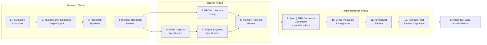

# SaaS Auto-Builder PRD Generation Workflow

Generate a production-quality PRD.md for the "SaaS Auto-Builder" — an AI agentic workflow automation system that transforms a user's natural-language SaaS idea into a production-quality, full-stack software scaffold. This workflow refines and structures the existing reference PRD (coding-resource/PRD.md, 2,667 lines, 78+ AI agents, 5 research rounds) into the definitive specification document.

## Overview

- **Input**: `coding-resource/PRD.md` (reference PRD) + user-provided core question flow + absolute goal definition
- **Output**: `prompt/PRD-SaaS-AutoBuilder.md` (production-quality PRD, ~2,500-3,000 lines)
- **Frequency**: on-demand
- **Autopilot**: disabled
- **pACS**: enabled

**Absolute Goal** (fixed across ALL steps and ALL features):
> When a user says "I want to build X SaaS", Claude Code understands the user's intent — through smart conversational questions when intent is ambiguous — and automatically implements a production-quality, full-stack SaaS service from start to finish. The system acts as a "Specification Compiler": user intent (source code) → 7 SOT specification documents (intermediate representation) → ~50-70 file production scaffold (machine code).

**User's Core Question Flow** (must be mapped into F1 Conversational Engine specification):
1. "무엇을 만들고 싶으신가요?" → intent capture
2. "개발도구를 선택하세요" (Cursor, Claude Code 등) → tool selection
3. "코드 템플릿을 선택하세요" (EasyNext 등) → template selection
4. "어떤 기능이 핵심 기능으로 포함될 예정인가요?" → core feature extraction
5. "어울리는 추가 기능은 무엇이 있을까요?" → feature discovery
6. "주요 사용자는 누구인가요?" → persona definition
7. "주요 사용 사례는 무엇일까요?" → use case mapping
8. "어떤 문제를 해결해주나요?" → problem framing
9. "사용자들은 어떤 목표를 달성하고 싶어 할까요?" → goal definition
10. "사용자들은 어떤 기술 수준을 가지고 있을까요?" → tech level segmentation
11. PRD + User Journey → specification generation
12. TRD + Code Guidelines → technical specification
13. Design Guide (4-stage senior design agent) → UI specification
14. IA Document (UX architect) → information architecture
15. Initial development tasks → task breakdown
16. AGENTS.md + rules.md → DNA injection

---

## Inherited DNA (Parent Genome)

> This workflow inherits the complete genome of AgenticWorkflow.
> Purpose varies by domain; the genome is identical. See `soul.md §0`.

**Constitutional Principles** (adapted to PRD generation domain):

1. **Quality Absolutism** — The PRD must achieve the same depth as the reference document (2,667 lines, TypeScript code examples, FSM specifications, Zod schemas, Mermaid diagrams). Every architectural decision must have a rationale. Every feature must have acceptance criteria. Every metric must have a threshold. Speed, token cost, and effort are irrelevant — only the final PRD quality matters.
2. **Single-File SOT** — `.claude/state.yaml` holds all workflow state. Orchestrator is the single writer. All agents read SOT but never write directly.
3. **Code Change Protocol** — Implementation steps producing TypeScript examples, Zod schemas, or Handlebars templates within the PRD must undergo intent → impact → design analysis. CAP-1 (think before coding), CAP-2 (simplicity first), CAP-3 (goal-driven execution), CAP-4 (surgical changes).

**Inherited Patterns**:

| DNA Component | Inherited Form |
|--------------|---------------|
| 3-Phase Structure | Research → Planning → Implementation |
| SOT Pattern | `.claude/state.yaml` — single writer (Orchestrator/Team Lead) |
| 4-Layer QA | L0 Anti-Skip → L1 Verification → L1.5 pACS → L2 Adversarial Review |
| P1 Hallucination Prevention | Deterministic validation scripts (`validate_*.py`) |
| P2 Expert Delegation | Specialized sub-agents for each analysis domain |
| Safety Hooks | `block_destructive_commands.py` — dangerous command blocking |
| Adversarial Review | `@reviewer` + `@fact-checker` — Enhanced L2 independent quality critique |
| Decision Log | `autopilot-logs/` — transparent decision tracking |
| Context Preservation | Snapshot + Knowledge Archive + RLM restoration |

**Domain-Specific Gene Expression**:
- **P1 (Data Refinement)** gene is **strongly expressed**: The reference PRD is 2,667 lines — extraction scripts must filter and structure sections before agent analysis to maximize accuracy.
- **P2 (Expert Delegation)** gene is **strongly expressed**: Architecture, features, business, and quality are distinct expert domains — each requires a dedicated specialist agent for maximum depth.
- **Cross-Document Consistency** gene is **strongly expressed**: The PRD defines 6 typed registries and 8 cross-validation rules — the generated PRD itself must exhibit this same internal consistency.

---

## Research

### 1. PRD Foundation Extraction
- **Context Injection**: Pattern B — 45,000-token PRD filtered by extraction script into < 50KB section files
- **Pre-processing**: `scripts/extract_prd_sections.py`
  - Input: `coding-resource/PRD.md` (2,667 lines, ~45,000 tokens)
  - Processing: Split by `## N.` section headings → extract 16 structured section files
  - Output: `prompt/research/sections/sec-{01..16}.md` (filtered, each < 50KB)
  - Additional: Extract all TypeScript code blocks → `prompt/research/code-examples/`
  - Additional: Extract all Mermaid diagrams → `prompt/research/diagrams/`
  - Additional: Extract all tables → `prompt/research/tables/`
- **Agent**: `@prd-analyst`
- **Verification**:
  - [ ] All 16 PRD sections analyzed and cataloged with section summaries
  - [ ] All 9 service engines (E1-E9) documented with inputs/outputs/dependencies
  - [ ] All 8 features (F1-F8) cataloged with priority, development time, acceptance criteria
  - [ ] All 41 user stories across 5 epics listed with acceptance criteria
  - [ ] All 6 typed registries documented with type signatures and relationships
  - [ ] 7-gate validation pipeline documented with concrete AST/pattern checks
  - [ ] 12 SaaS domain categories listed with semantic frame slot definitions
  - [ ] 11 risks documented with probability, impact, and mitigation
  - [ ] All theoretical foundations (16 classical + 8 modern) cataloged
  - [ ] Output file exceeds 100 bytes (Anti-Skip Guard)
- **Task**: Perform deep structural analysis of the existing PRD.md reference document. Read every extracted section file and produce a comprehensive foundation analysis that captures the complete architecture, feature set, engine pipeline, quality framework, business model, and theoretical foundations. This analysis serves as the authoritative knowledge base for all downstream steps.

  Specifically:
  1. **Architecture Inventory**: Catalog the Specification Compiler metaphor (source → IR → machine code), 9 engines (E1-E9) with their roles/inputs/outputs, 3-phase code generation strategy, and modular monolith structure.
  2. **Feature Inventory**: Catalog F1-F8 with priority levels, development timelines, detailed specifications, and acceptance criteria.
  3. **Schema Inventory**: Catalog all TypeScript interfaces (IntentObject, SemanticFrame, FrameSlot, SlotDependency, FeatureSpec), Zod schemas, and registry type signatures.
  4. **User Story Inventory**: Catalog all 41 user stories across 5 epics with acceptance criteria.
  5. **Quality Framework Inventory**: Catalog the Debt Firewall (0%/minimized/30%), 7-gate pipeline with AST patterns, 6 anti-patterns, testing strategy (3-layer pyramid).
  6. **Business Inventory**: Catalog pricing tiers, revenue projections, cost analysis, KPIs (5 GO/NO-GO + 7 product + 4 business + 7 quality).
  7. **Risk Inventory**: Catalog 11 risks with probability/impact/mitigation.
  8. **Theoretical Inventory**: Catalog 16 classical + 8 modern theoretical foundations with their application points.
  9. **Gap Identification**: Note any areas that seem underdeveloped, inconsistent, or missing relative to the stated goals.
- **Output**: `prompt/research/prd-foundation-analysis.md`
- **Review**: none
- **Translation**: `@translator` → `prompt/research/prd-foundation-analysis.ko.md`
- **Post-processing**:
  - Validate all cross-references within the analysis document — ensure every engine reference maps to a documented engine, every feature reference maps to a documented feature.
  - `python3 .claude/hooks/scripts/validate_domain_knowledge.py --project-dir . --check-output --step 1` (DKS gene — inherited, lightly expressed: PRD domain entities/relations cataloged in foundation analysis)

### 2. (team) Multi-Perspective Deep Analysis
- **Team**: `prd-analysis-team`
- **Checkpoint Pattern**: dense — each specialist has >15 turns of deep analysis
- **Context Injection**: Pattern A — each specialist receives pre-filtered section files (< 50KB per agent) from Step 1 extraction
- **Verification**:
  - [ ] Architecture analysis covers all 9 engines (E1-E9) with dependency mapping and identifies 3 most critical architectural decisions
  - [ ] Feature analysis maps all 16 user questions to FSM states with gap/conflict report
  - [ ] Business analysis evaluates Debt Firewall viability, pricing sustainability, and competitive positioning against $4B+ funded competitors
  - [ ] All 3 specialist outputs exceed 100 bytes (Anti-Skip Guard)
  - [ ] Each specialist delivers CP-3 with pACS self-rating
  - [ ] Cross-perspective contradictions identified by Team Lead at Join
- **Tasks**:
  - `@arch-engine-specialist` (opus): **Architecture & Engine Pipeline Analysis**
    - Read: `prompt/research/prd-foundation-analysis.md` (Step 1 output) + `prompt/research/sections/sec-{07,08,09,10}.md` (Architecture, Tech Stack, Data Flow, Integration)
    - **Checkpoints**:
      - CP-1: Report initial assessment of 9-engine pipeline — identify the 3 most critical architectural decisions and any pipeline dependency risks
      - CP-2: Deliver draft analysis of E1 (Intent Engine, highest leverage), E8 (Code Gen, 3-phase strategy), and E9 (Meta-Programming/DNA injection) with improvement proposals
      - CP-3: Final comprehensive architecture analysis + pACS self-rating
    - Analyze: Engine execution timing (concurrent vs sequential), context window management per LLM call, registry-driven SOT pattern, Day-1 interface design (LLMProvider, TemplateRegistry, DocumentOrchestrator), Two-Domain Architecture (host CLI vs generated SaaS)
    - Identify: Architecture strengths to preserve, gaps to fill, refinement opportunities
    - Output: `prompt/research/arch-engine-analysis.md`

  - `@feature-ux-specialist` (opus): **Feature & Intent Capture Analysis**
    - Read: `prompt/research/prd-foundation-analysis.md` (Step 1 output) + `prompt/research/sections/sec-{05,06}.md` (User Stories, Core Features)
    - **Checkpoints**:
      - CP-1: Report mapping of user's 16 core questions to F1's 7-state FSM — identify unmapped questions and mapping conflicts
      - CP-2: Deliver draft analysis of F1 (Conversational Engine, 7-state FSM, 12 domains, semantic frames) and F2 (7-Document Pipeline, 6 registries) with enhancement proposals
      - CP-3: Final comprehensive feature/UX analysis + pACS self-rating
    - Analyze: Intent completeness detection logic, confidence routing thresholds, smart question design (Cognitive Load Theory, Miller's Law), 14-step interaction map, per-document approval gate UX, edge case handling (empty input, contradictions, non-English, domain change mid-conversation)
    - Critical task: Map ALL 16 questions from user's core question flow into the FSM states and semantic frame slots. Identify which questions map to which FSM state, which require new states, and which are already covered by existing design.
    - Identify: UX strengths to preserve, conversation flow gaps, feature completeness issues
    - Output: `prompt/research/feature-ux-analysis.md`

  - `@biz-quality-specialist` (opus): **Business Model & Quality Framework Analysis**
    - Read: `prompt/research/prd-foundation-analysis.md` (Step 1 output) + `prompt/research/sections/sec-{11,12,13,14,15}.md` (Quality, Metrics, Business, Roadmap, Risk)
    - **Checkpoints**:
      - CP-1: Report initial assessment of Debt Firewall viability and business model sustainability — flag any fatal weaknesses
      - CP-2: Deliver draft analysis of pricing strategy (BYOK + Open-Core), risk matrix (11 risks), and KPI framework with refinement proposals
      - CP-3: Final comprehensive business/quality analysis + pACS self-rating
    - Analyze: Debt Firewall (0%/minimized/30%) classification integrity, D×N×M blast radius model, 7-gate validation concrete checks (Gates 4-6 AST patterns), security non-negotiables (6 anti-patterns), testing strategy (cassette pattern, 3-layer pyramid), BYOK economics ($4-$9/project), Free-to-Paid conversion mechanism (3-project limit), revenue projections realism, competitive positioning against $4B+ funded competitors
    - Identify: Business viability gaps, quality framework completeness, risk mitigation adequacy
    - Output: `prompt/research/biz-quality-analysis.md`

- **Join**: Team Lead receives all 3 analyses, validates completeness against Step 1 foundation, records to SOT
- **SOT 쓰기**: Team Lead only — update `state.yaml` with `active_team` → `completed_teams`

### 3. Research Synthesis & Gap Analysis
- **Context Injection**: Pattern A — reads 4 research documents (foundation + 3 specialist analyses, each < 50KB)
- **Pre-processing**: Collect all research outputs — `prd-foundation-analysis.md` + 3 specialist analyses. Validate all files exist and exceed 100 bytes.
- **Agent**: `@research-synthesizer`
- **Verification**:
  - [ ] All 4 research documents (Step 1 + Step 2 team outputs) explicitly referenced and synthesized
  - [ ] Gaps categorized as: critical (must fix), important (should fix), nice-to-have (could improve)
  - [ ] Each gap has a proposed resolution with justification
  - [ ] Cross-perspective consistency analysis completed — architecture/feature/business alignment verified
  - [ ] User's 16 core questions fully mapped to FSM states with gap/conflict report (source: Step 2 @feature-ux-specialist)
  - [ ] Enhancement opportunities prioritized by impact on the Absolute Goal
  - [ ] Output file exceeds 100 bytes (Anti-Skip Guard)
- **Task**: Synthesize findings from all 4 research documents into a unified gap analysis and enhancement plan. This is the critical step that transforms raw analysis into actionable intelligence for the Planning phase.

  Specifically:
  1. **Cross-Perspective Alignment**: Compare architecture analysis, feature analysis, and business analysis for consistency. Flag contradictions (e.g., architecture assumes feature X but feature spec doesn't include it).
  2. **Completeness Gap Analysis**: Against the Absolute Goal, identify what the existing PRD covers vs. what it should cover but doesn't. Focus on:
     - Intent capture completeness (do all 16 user questions map cleanly to FSM?)
     - Engine pipeline completeness (are E1-E9 specifications sufficient for implementation?)
     - Quality framework completeness (does the 7-gate pipeline catch all critical failure modes?)
     - Business model completeness (are revenue projections defensible?)
  3. **Enhancement Prioritization**: Rank all identified gaps and improvements by their impact on the Absolute Goal. Use criteria: (a) Does this affect the user's ability to go from idea to running SaaS? (b) Does this affect the quality of the generated specification/code? (c) Does this affect the system's viability as a product?
  4. **Refinement Plan**: For each gap/enhancement, propose a specific resolution with section reference and estimated complexity.
- **Output**: `prompt/research/synthesis-and-gaps.md`
- **Review**: `@fact-checker` — verify that gap claims are grounded in actual PRD content, not hallucinated
- **Translation**: `@translator` → `prompt/research/synthesis-and-gaps.ko.md`

### 4. (human) Research Findings Review
- **Action**: Review the research synthesis and gap analysis. Confirm the identified gaps and enhancement priorities. Provide direction on which gaps are critical vs. deferrable. Approve the refinement plan before proceeding to Planning phase.
- **Command**: `/review-research`
- **Autopilot Default**: Accept all critical and important gaps; defer nice-to-have items to future versions.

---

## Planning

### 5. PRD Document Architecture Design
- **Context Injection**: Pattern A — reads synthesis-and-gaps.md (< 50KB, full delegation)
- **Agent**: `@prd-architect`
- **Verification**:
  - [ ] 16-section structure defined with section titles, estimated word counts, and key subsections
  - [ ] Cross-reference map specifies all inter-section dependencies (e.g., Section 6 features → Section 7 architecture → Section 14 tasks)
  - [ ] Registry schema designs (6 registries) include TypeScript interfaces with Zod validation
  - [ ] Document generation order defined with dependency DAG
  - [ ] Acceptance criteria framework established — every feature, engine, and risk must have testable criteria
  - [ ] Section structure accommodates ALL resolved gaps from Step 3 synthesis (source: Step 3)
  - [ ] Mermaid diagram plan defined — which sections need which diagram types
  - [ ] Output file exceeds 100 bytes (Anti-Skip Guard)
- **Task**: Design the definitive architecture for the final PRD document. This determines the structural quality of the entire output.

  Using the research synthesis (Step 3) and gap resolution plan as input:
  1. **Section Architecture**: Define the 16-section structure with:
     - Section number, title, estimated word count
     - Key subsections and their purposes
     - Required content types (prose, tables, TypeScript code, Mermaid diagrams, Zod schemas)
     - Inter-section cross-references (what this section references in other sections)
  2. **Registry Schema Design**: Design the 6 typed JSON registries with complete TypeScript interfaces:
     - Feature Registry: `FeatureSpec[]` with MoSCoW, acceptance criteria, dependencies
     - Component Registry: `ComponentSpec[]` with props, variants, accessibility
     - API Registry: `APIEndpoint[]` with Zod request/response schemas
     - DataModel Registry: `DataModel[]` with fields, relations, RLS policies
     - Dependency Registry: `Dependency[]` with version, rationale
     - Constraint Registry: `Constraint[]` with type, description, affected components
  3. **Consistency Framework**: Define the 8 cross-document validation rules that will appear in F8, ensuring they are concrete and deterministic (Zod-enforced, not LLM self-checking).
  4. **Mermaid Diagram Plan**: Specify which diagrams are needed (system architecture, engine sequence, pipeline flow, generated SaaS architecture, FSM state diagram) and in which sections they appear.
- **Output**: `prompt/planning/prd-architecture.md`
- **Review**: none
- **Translation**: `@translator` → `prompt/planning/prd-architecture.ko.md`

### 6. Intent Capture & Question Flow Specification
- **Context Injection**: Pattern A — reads synthesis + relevant section files (< 50KB combined)
- **Agent**: `@intent-designer`
- **Verification**:
  - [ ] All 17 interaction points (13 conversational + 4 pipeline gates) mapped to specific FSM states with slot assignments
  - [ ] 9-state FSM fully specified: `initial_capture` → `domain_confirmation` → `scale_clarification` → `feature_enumeration` → `user_context_capture` → `infrastructure_decisions` → `tech_constraints` → `approval_pending` → `generation_ready` (expanded from reference PRD's 7-state — see FSM Design Rationale below)
  - [ ] State split documented: `feature_enumeration` (feature-specific: core/optional features) vs `user_context_capture` (user-research: personas, use cases, problems, goals, tech level) — rationale: different cognitive framing required, separate states preserve conversational depth
  - [ ] `infrastructure_decisions` state fully specified: DB schema needs, auth/login requirements, advanced features (real-time, search, AI) — explicit user interaction, not silently engine-inferred
  - [ ] 12 SaaS domain categories defined with complete semantic frame slot tables (required + optional)
  - [ ] Custom/Other domain (Category 12) LLM extraction process specified with 3-step pipeline
  - [ ] Confidence routing thresholds defined: >0.85 (accept), 0.65-0.85 (confirm), <0.65 (clarify)
  - [ ] Edge case handling specified for all 9 cases: (1) empty/trivial input, (2) excessively long input, (3) non-SaaS request, (4) contradictory requirements, (5) non-English input, (6) user changing mind mid-conversation, (7) maximum retry exceeded, (8) analogy-based input ("like X but for Y" — decompose into domain + differentiators), (9) vague/uncertain idea (confidence < 0.3 — trigger ideation assistance sub-flow)
  - [ ] Ideation assistance sub-flow specified: when user intent is genuinely uncertain, system enters guided exploration ("What industry?", "What problem have you experienced?") before domain classification — maps to "AI PM과 함께 아이디어를 체계적으로 설계" concept
  - [ ] Conversational design spec complete: tone, personality, progress indicators, help system
  - [ ] FSM includes at least 3 non-linear transitions (skip, branch, rollback) demonstrating conversational flow, not sequential questionnaire
  - [ ] 14-step interaction map (7 conversation + 7 pipeline gates) fully documented
  - [ ] IntentObject TypeScript interface complete with all fields (including `db_needs`, `auth_type`, `advanced_features` from `infrastructure_decisions` state)
  - [ ] Smart question design grounded in Cognitive Load Theory (Sweller 1988) and Miller's Law (1956)
  - [ ] Output file exceeds 100 bytes (Anti-Skip Guard)
- **Task**: Design the complete intent capture system specification for the PRD's F1 feature. This is the highest-leverage specification — errors here cascade through all 9 engines.

  **Critical Requirement**: The user provided 16 core questions that the system must ask. Map each question to the FSM:

  | User Question | FSM State | Semantic Frame Slot |
  |--------------|-----------|-------------------|
  | (system preamble) AI PM과 함께 아이디어를 체계적으로 설계하세요 | (pre-FSM display) | — (branding/positioning, not a state transition) |
  | 무엇을 만들고 싶으신가요? | `initial_capture` | `intent.description` |
  | 만들고 싶은 아이디어를 입력하세요 | `initial_capture` | `intent.description` (refinement) |
  | 개발도구를 선택하세요 | `tech_constraints` | `intent.slots.dev_tool` |
  | 코드 템플릿을 선택하세요 | `tech_constraints` | `intent.slots.template` |
  | 어떤 기능이 핵심 기능? | `feature_enumeration` | `intent.slots.core_features` |
  | 어울리는 추가 기능? | `feature_enumeration` | `intent.slots.optional_features` |
  | 주요 사용자는 누구? | `user_context_capture` | `intent.slots.user_personas` |
  | 주요 사용 사례? | `user_context_capture` | `intent.slots.use_cases` |
  | 어떤 문제를 해결? | `user_context_capture` | `intent.slots.problem_statement` |
  | 사용자 목표? | `user_context_capture` | `intent.slots.user_goals` |
  | 사용자 기술 수준? | `user_context_capture` | `intent.slots.tech_level` |
  | DB/Auth/고급기능 결정 | `infrastructure_decisions` | `intent.slots.db_needs`, `intent.slots.auth_type`, `intent.slots.advanced_features` |
  | PRD + User Journey 작성 | `generation_ready` | (pipeline gate: E6 documents 1-2) |
  | TRD + Code Guidelines | `generation_ready` | (pipeline gate: E6 documents 3-4) |
  | Design Guide + IA | `generation_ready` | (pipeline gate: E6 documents 5-6) |
  | AGENTS.md + rules.md | `generation_ready` | (pipeline gate: E9 meta-programming) |

  **FSM Design Rationale** (design decisions for `@intent-designer`):
  - **9-state FSM** (expanded from reference PRD's 7-state): `initial_capture` → `domain_confirmation` → `scale_clarification` → `feature_enumeration` → `user_context_capture` → `infrastructure_decisions` → `tech_constraints` → `approval_pending` → `generation_ready`
  - **State split**: `feature_enumeration` (feature-specific: "what features?") vs `user_context_capture` (user-research: "who are your users?", "what problem?") — different cognitive framing required; collapsing 7 questions into one state sacrifices conversational quality for FSM simplicity, which violates Absolute Goal
  - **`infrastructure_decisions`**: DB schema, auth/login, advanced features (real-time, search, AI) are architectural decisions that significantly affect the generated scaffold (~50-70 files). These must be confirmed via explicit user interaction, not silently inferred by E2/E3 — the user specifically designed this as an interaction step
  - **Ideation assistance**: When confidence < 0.3 after `initial_capture`, branch to guided exploration sub-flow ("What industry?", "What problem have you experienced?") before `domain_confirmation` — supports users with vague ideas, maps to "AI PM과 함께 아이디어를 체계적으로 설계" concept
  - Questions 1-13 are handled in the conversation phase (5-7 actual questions per session, with smart defaults reducing active choices per domain). Questions 14-17 are pipeline approval gates.
  - The transition from conversation to document generation pipeline occurs at the `approval_pending` → `generation_ready` boundary
- **Output**: `prompt/planning/intent-capture-spec.md`
- **Review**: `@reviewer` — validate FSM completeness, guard condition coverage, rollback semantics
- **Translation**: `@translator` → `prompt/planning/intent-capture-spec.ko.md`

### 7. Engine Pipeline & Quality Framework Specification
- **Depends on**: Step 5 (`prd-architecture.md`) + Step 6 (`intent-capture-spec.md` — F1 detailed FSM required for engine pipeline specification)
- **Context Injection**: Pattern A — reads Step 5 architecture + Step 6 intent spec + research analyses (< 50KB each, full delegation)
- **Agent**: `@engine-planner`
- **Verification**:
  - [ ] All 9 engines (E1-E9) specified with: role, input, output, key technology, LLM call budget, execution time estimate, context per call
  - [ ] E2 (AI PM) 5-step processing pipeline fully specified: Problem Framing → Feature Expansion → Business Model Inference → Constraint Extraction → PRD Assembly
  - [ ] E5 (User Research) 3-step pipeline fully specified: Persona Synthesis → User Story Generation → Journey Map Generation
  - [ ] E8 (Code Generation) 3-phase strategy fully specified: Phase 1 (templates, no LLM) → Phase 2 (schema + domain, 3-5 LLM calls) → Phase 3 (docs + shell, 2-3 LLM calls)
  - [ ] E8 template-vs-LLM boundary table specified: per-file debt classification (template-generated 0% debt vs LLM-generated semantic debt) for all ~50-70 scaffold files
  - [ ] E8 Code Generation Prompt Architecture specified: per-phase, per-call input/output token budgets and context window management strategy
  - [ ] 7-gate validation pipeline specified with concrete AST/pattern checks for Gates 4-6
  - [ ] Debt Firewall classification rules defined: structural (0%) vs semantic (minimized) vs tooling (30%)
  - [ ] Error recovery taxonomy specified: 8 failure types with recovery strategies
  - [ ] Pipeline checkpointing specified: state saved after each step with resume capability
  - [ ] API call budget defined: max 64 LLM calls per project (typical: 25-35)
  - [ ] 3-layer test pyramid specified: 500+ FSM unit tests, 50+ cassette integration tests, snapshot tests
  - [ ] 6 security anti-patterns the generator must never produce
  - [ ] F1-F8 feature specifications complete with acceptance criteria per feature
  - [ ] Output file exceeds 100 bytes (Anti-Skip Guard)
- **Task**: Design detailed specifications for all 9 engines and 8 features, plus the complete quality framework. This is the technical core of the PRD.

  For each engine (E1-E9):
  1. Define role, inputs, outputs, key technology
  2. Specify processing pipeline with step-by-step detail
  3. Define LLM call budget and context window management
  4. Specify acceptance criteria
  5. Document dependencies on other engines

  For the quality framework:
  1. Specify 7-gate validation pipeline with exact AST patterns for Gates 4-6 (Stripe webhook checks, Supabase auth checks, security scan rules)
  2. Define Debt Firewall with per-integration debt budgets
  3. Design error recovery & pipeline resilience (8 failure types)
  4. Specify testing strategy (cassette pattern, 3-layer pyramid)
  5. Document 6 security anti-patterns that must never appear in generated code

  For features (F1-F8):
  1. F1: Conversational SaaS Definition Engine (P0) — reference Step 6 intent capture spec
  2. F2: 7-Document Pipeline (P0) — sequential generation with per-doc approval gates
  3. F3: Next.js + Supabase + Stripe Template (P0) — ~50-70 file scaffold with generated stack
  4. F4: Cross-Document Context Propagation (P1) — 6 typed registries, one-way propagation
  5. F5: Editable Intermediate Documents (P1) — edit → detect → re-propagate
  6. F6: Free/Paid Boundary (P1) — 3-project limit, $19/mo Pro
  7. F7: First Experience Optimization (P2) — <22 min first, <15 min repeat
  8. F8: Basic Cross-Validation Engine (P2) — 8 deterministic Zod rules
- **Output**: `prompt/planning/engine-quality-specs.md`
- **Review**: `@reviewer` — validate technical feasibility, specification completeness, acceptance criteria testability
- **Translation**: `@translator` → `prompt/planning/engine-quality-specs.ko.md`
- **Post-processing**: Cross-reference validation — ensure all engine references in feature specs map to documented engines, and all feature references in engine specs map to documented features.

### 8. (human) Planning Review & Approval
- **Action**: Review all 3 planning documents (PRD Architecture, Intent Capture Spec, Engine/Quality Spec). Confirm the document structure, question flow mapping, and engine specifications. Approve before proceeding to PRD generation.
- **Command**: `/review-planning`
- **Autopilot Default**: Approve if all Verification criteria pass and no critical gaps remain unresolved.

---

## Implementation

### 9. (team) PRD Document Generation
- **Team**: `prd-generation-team`
- **Checkpoint Pattern**: dense — each section writer produces substantial content (500-800 lines)
- **Context Injection**: Pattern B — each writer receives filtered context package (planning + research docs scoped to their section range, 50-150KB per agent)
- **Verification**:
  - [ ] Sections 1-5 cover Executive Summary, Problem Statement, Vision, Users, User Stories with all 41 user stories and acceptance criteria
  - [ ] Sections 6-8 include complete F1-F8 specs with TypeScript interfaces, Zod schemas, 7-state FSM, E1-E9 architecture with Mermaid diagrams
  - [ ] Sections 9-12 include data flow diagrams, 7 adapter interfaces (TypeScript), 7-gate validation with AST patterns, KPIs with GO/NO-GO thresholds
  - [ ] Sections 13-16 include pricing model with $19 justification, 27-week roadmap, 11 risks with probability/impact, appendix with ~45 file structure
  - [ ] All 4 section documents exceed 100 bytes (Anti-Skip Guard)
  - [ ] Combined section coverage = 16 sections with no gaps or duplicates
  - [ ] All TypeScript code blocks syntactically valid
  - [ ] All Mermaid diagrams syntactically valid (valid start tokens)
- **Pre-processing**: Prepare context packages for each writer — extract relevant planning docs + research analysis sections per writer's scope. Each writer receives:
  - Their relevant planning documents (from Steps 5-7)
  - Their relevant research analyses (from Steps 1-3)
  - The PRD architecture cross-reference map (from Step 5)
  - The full registry schema designs (from Step 5)
- **Tasks**:
  - `@prd-writer-core` (opus): **Sections 1-5 — Foundation & Users**
    - Read: `prompt/planning/prd-architecture.md` (section 1-5 specs) + `prompt/research/prd-foundation-analysis.md` + `prompt/research/biz-quality-analysis.md`
    - **Checkpoints**:
      - CP-1: Report outline of 5 sections with key content decisions — confirm Section 1 Executive Summary captures the Specification Compiler identity and all 5 Key Differentiators
      - CP-2: Deliver draft of Sections 1-3 (Executive Summary, Problem Statement, Vision & Goals) for Team Lead review — verify Section 2 competitive analysis covers Cursor/Lovable/Bolt.new/Replit/Devin with current data
      - CP-3: Deliver final Sections 1-5 + pACS self-rating
    - Write:
      - **Section 1: Executive Summary** — Product Definition, Specification Compiler identity (compiler theory metaphor with table), Key Differentiators (5), Target User, Mission Statement
      - **Section 2: Problem Statement** — Current Pain (5-step founder journey), Why Existing Tools Fail (5 competitors with valuation/funding/fatal weakness), AI Code Quality Crisis (6 metrics table with sources), The Gap (5 structural requirements no tool delivers)
      - **Section 3: Product Vision & Goals** — Vision Statement, Automation Purpose (3 transformations), Scope of Automation (automated/semi-automated/not-automated tables + progressive automation roadmap), Short-Term Goals (6-month table), Long-Term Vision (12-24 month table), Success Definition
      - **Section 4: Target Users & Personas** — V1 Primary (Alex: Serial SaaS Launcher), V1 Secondary (Jordan: Weekend Builder), V2 Target (Sam: Non-Technical Founder, Morgan: Product Manager), Technical Level Segmentation table
      - **Section 5: User Stories** — Epic 1 (Intent Capture, 13 stories), Epic 2 (Document Generation, 12 stories), Epic 3 (Code Scaffold, 8 stories), Epic 4 (AI Agent Collaboration, 6 stories), Epic 5 (Project Configuration & DNA, 5 stories), each with acceptance criteria
    - Output: `prompt/implementation/prd-sections-1-5.md`

  - `@prd-writer-tech` (opus): **Sections 6-8 — Technical Core**
    - Read: `prompt/planning/prd-architecture.md` (section 6-8 specs) + `prompt/planning/intent-capture-spec.md` + `prompt/planning/engine-quality-specs.md` + `prompt/research/arch-engine-analysis.md`
    - **Checkpoints**:
      - CP-1: Report F1 specification outline — confirm FSM states, user question mapping, and semantic frame design align with Step 6 intent capture spec
      - CP-2: Deliver draft of F1 (Conversational Engine) and F2 (7-Document Pipeline) with complete TypeScript interfaces, Zod schemas, and FSM specification — these are the highest-priority features
      - CP-3: Deliver final Sections 6-8 + pACS self-rating
    - Write:
      - **Section 6: Core Features — Detailed Specification**
        - F1: Conversational SaaS Definition Engine (P0) — 7-state FSM spec (states, transitions, guard conditions, rollback semantics), 12 SaaS domain categories with semantic frame tables, confidence routing, smart question design, IntentObject TypeScript interface, Zod schema, 14-step interaction map, conversational design spec, edge case handling, complete TypeScript code examples
        - F2: 7-Document Pipeline (P0) — document generation order (V1 sequential, V2 parallel), document specifications table, 6 registry cross-consistency mechanism, per-document approval gate, auto-approve mode
        - F3: Next.js + Supabase + Stripe Template (P0) — generated stack table (12 technologies with rationale), ~50-70 file structure, key architecture decisions (feature-based, Edge middleware, manual Stripe webhooks, RLS by default, Zod env validation)
        - F4: Cross-Document Context Propagation (P1) — 6 registry table with type signatures, V1 one-way propagation, V2 bidirectional vision
        - F5: Editable Intermediate Documents (P1) — edit flow (7 steps)
        - F6: Free/Paid Boundary (P1) — Free vs Pro feature matrix
        - F7: First Experience Optimization (P2) — time budget table
        - F8: Basic Cross-Validation Engine (P2) — 8 validation rules table
      - **Section 7: System Architecture Overview**
        - 7.1: Nine Service Engines table (E1-E9 with role/input/output/technology), E2 detailed 5-step pipeline, E5 detailed 3-step pipeline, E8 detailed 3-phase strategy with code generation prompt architecture, engine execution timing Mermaid sequence diagram, IntentObject schema
        - 7.2: Modular Monolith Structure — dependency direction, module structure (~52 files V1)
        - 7.3: Two-Domain Architecture — blast radius asymmetry
        - 7.4: System Architecture Diagram (Mermaid), Generated SaaS Architecture Diagram (Mermaid)
        - 7.5: Day-1 Interfaces (LLMProvider, TemplateRegistry, DocumentOrchestrator)
      - **Section 8: Technology Stack**
        - 8.1: CLI Tool Stack (16 technologies with version, consensus, rationale) + rejected technologies table
        - 8.2: Generated SaaS Stack (16 technologies with decisive reason) + Drizzle/Prisma comparison, manual Stripe webhooks rationale, pgvector factory multiplier argument
        - 8.3: Integration Stack — subscription CLI architecture, anti-corruption layer, circuit breaker
    - Output: `prompt/implementation/prd-sections-6-8.md`

  - `@prd-writer-integration` (opus): **Sections 9-12 — Systems & Quality**
    - Read: `prompt/planning/prd-architecture.md` (section 9-12 specs) + `prompt/planning/engine-quality-specs.md` + `prompt/research/arch-engine-analysis.md` + `prompt/research/biz-quality-analysis.md`
    - **Checkpoints**:
      - CP-1: Report Section 11 Quality framework outline — confirm Debt Firewall tiers, 7-gate pipeline, and security non-negotiables are fully specified
      - CP-2: Deliver draft of Sections 9-10 (Data Flow, Integration Architecture) with complete data flow diagrams and 7 adapter interfaces TypeScript code
      - CP-3: Deliver final Sections 9-12 + pACS self-rating
    - Write:
      - **Section 9: Data Sources & Data Flow** — User input flow, registry data flow (which engine reads/writes which registry), LLM interaction flow (per-call data, total per-project tokens, cost breakdown), generated artifact flow, state management (file-based, 6 state locations), KPI measurement without telemetry
      - **Section 10: Integration Architecture** — Multi-LLM strategy (V1 Claude-only, V1.1 Gemini CLI, V2+ ChatGPT conditional), task routing matrix, subscription CLI architecture, 5-layer anti-corruption layer, generated SaaS integrations (Stripe complete webhook suite with 6 events, Supabase Auth with RLS, Supabase DB + pgvector, Resend + React Email, Vercel zero-config, PostHog + Sentry), 7 Day-1 adapter interfaces with complete TypeScript code, Strangler Fig migration paths table
      - **Section 11: Quality & Security Strategy** — Debt Firewall (structural vs semantic vs tooling with per-integration budgets table), 7-gate validation pipeline with concrete AST/pattern checks for Gates 4-6, error recovery & pipeline resilience (8 failure types with recovery strategies, pipeline checkpointing, API call budget), testing strategy (3-layer pyramid, cassette pattern), security non-negotiables (6 anti-patterns table, authentication, authorization, payments, code quality)
      - **Section 12: Success Metrics & KPIs** — GO/NO-GO KPIs (5 metrics with thresholds), product metrics (7 metrics), business metrics (Month 3/6/12 targets), quality metrics (7 metrics), Month 2 Early Warning System
    - Output: `prompt/implementation/prd-sections-9-12.md`

  - `@prd-writer-business` (opus): **Sections 13-16 — Business & Appendix**
    - Read: `prompt/planning/prd-architecture.md` (section 13-16 specs) + `prompt/research/biz-quality-analysis.md` + `prompt/research/prd-foundation-analysis.md`
    - **Checkpoints**:
      - CP-1: Report Section 14 Roadmap outline — confirm 27-week timeline with feature-to-week mapping and 3 milestones
      - CP-2: Deliver draft of Sections 13-14 (Business Model, Roadmap) with revenue projections and cost analysis
      - CP-3: Deliver final Sections 13-16 + pACS self-rating
    - Write:
      - **Section 13: Business Model & Pricing** — Open-Core + BYOK rationale, 4 pricing tiers (Community/Pro/Team/Enterprise with features and prices), $19 pricing justification, Free-to-Paid conversion mechanism, revenue projections (Month 1-6 table), Year 1 realistic range, break-even analysis, secondary revenue streams
      - **Section 14: Roadmap & Timeline** — V1 Development 27 weeks + 3 week buffer with feature-to-timeline mapping, 3 milestones (Private Alpha M1-2, Public Beta M3-4, Pro Launch M5-6), V1.1 Gemini CLI integration (Month 3-4), V2 Roadmap (Month 7-12 with entry conditions), cost analysis (development cost, per-run cost, monthly operational cost)
      - **Section 15: Risk Assessment** — 11 risks with probability/impact/mitigation (No conversion 45%, Competitor copy 60-70%, CLI niche 25-35%, Code quality 30-40%, Burnout 35-45%, Claude API 40%, Stripe bug 8%, Gemini CLI break 40%, Structured Outputs 15%, TOS gray area 10%, Prompt injection 20-30%), risk summary matrix
      - **Section 16: Appendix** — Generated SaaS base structure (~45 template + domain files tree), 7-document pipeline detail (Mermaid DAG, per-document content spec table), glossary of key terms (17 terms), research foundation (5-round summary table), theoretical foundations (16 classical + 8 modern with application tables), representative implementation artifacts (3 examples: Zod schema, LLM prompt template, Handlebars template), industry data citations table
    - Output: `prompt/implementation/prd-sections-13-16.md`

- **Join**: Team Lead receives all 4 section documents, validates:
  1. Each document exists and exceeds 100 bytes
  2. Section numbering is consistent across documents
  3. No section is missing or duplicated
  4. Cross-references between documents are noted for Step 10 validation
- **SOT 쓰기**: Team Lead only — update `state.yaml` with team completion status

### 10. Cross-Validation & Document Integration
- **Context Injection**: Pattern B — 4 section documents merged by script (combined 100-200KB, filtered to single document)
- **Pre-processing**: `scripts/merge_prd_sections.py`
  - Input: 4 section documents from Step 9
  - Processing: Concatenate in order (1-5, 6-8, 9-12, 13-16) with section boundary markers
  - Output: `prompt/implementation/prd-merged-draft.md`
  - Validation: Check section count = 16, no duplicate headings, all sections present
- **Agent**: `@cross-validator`
- **Verification**:
  - [ ] All 16 sections present in merged document with correct numbering
  - [ ] All features in Section 6 (F1-F8) referenced in Section 7 architecture engine mapping
  - [ ] All API endpoints mentioned in Section 7 (TRD scope) consistent with Section 10 integration specs
  - [ ] All 9 engines (E1-E9) referenced consistently across Sections 6, 7, 9, 14
  - [ ] Feature priorities in Section 6 match task priorities in Section 14 roadmap
  - [ ] User stories in Section 5 trace to features in Section 6 and acceptance criteria
  - [ ] Technology stack in Section 8 consistent with Section 10 integration architecture
  - [ ] KPIs in Section 12 align with success definition in Section 3
  - [ ] Risk mitigations in Section 15 reference specific features/architecture from Sections 6-7
  - [ ] All TypeScript interfaces syntactically valid (parseable)
  - [ ] All Mermaid diagrams syntactically valid
  - [ ] No placeholder text, no TODO markers, no "TBD" references
  - [ ] Document end statistics (section count, user stories, features, engines, gates, registries, risks, KPIs) accurate
  - [ ] End-to-end pipeline traceability verified: user utterance (Section 6 F1) → intent processing (Section 7 E1-E5) → specification generation (Section 7 E6-E7, Section 6 F2) → code scaffold production (Section 7 E8, Section 6 F3) → DNA injection (Section 7 E9) — each stage's output is explicitly the next stage's input, no gaps
  - [ ] Output file exceeds 100 bytes (Anti-Skip Guard)
- **Task**: Merge the 4 section documents into a single, integrated PRD.md and perform comprehensive cross-validation. This step ensures the PRD has the same internal consistency it prescribes for its own generated documents.

  Perform the following validation passes:
  1. **Structural Validation**: All 16 sections present, correctly numbered, no duplicates.
  2. **Feature-Architecture Traceability**: Every F1-F8 feature in Section 6 appears in Section 7's engine mapping. Every engine in Section 7 maps to at least one feature.
  3. **Data Flow Consistency**: Registry data flow in Section 9 matches the engine inputs/outputs in Section 7 and the feature specifications in Section 6.
  4. **Business-Technical Alignment**: Timeline in Section 14 accounts for all P0 features from Section 6. Cost analysis in Section 14 consistent with token estimates in Section 9.
  5. **Risk Coverage**: Every P0 feature in Section 6 has at least one risk in Section 15 addressing its failure mode.
  6. **Schema Consistency**: TypeScript interfaces used across sections are identical (IntentObject, FeatureSpec, SemanticFrame, etc.). No conflicting type definitions.
  7. **Terminology Consistency**: Key terms used consistently throughout (glossary in Section 16 matches actual usage).
  8. **Statistics Verification**: Document end statistics are accurate counts of actual content.
  9. **End-to-End Pipeline Traceability**: Verify the document traces a complete path from user utterance (Section 6, F1) through intent processing (Section 7, E1-E5) to specification generation (Section 7, E6-E7; Section 6, F2) to code scaffold production (Section 7, E8; Section 6, F3) to DNA injection (Section 7, E9). Verify each stage's output is explicitly the next stage's input. Verify the Specification Compiler metaphor in Section 1 is structurally supported by the concrete pipeline in Sections 6-7.

  Fix all identified inconsistencies in the merged document. Log all fixes applied.
- **Output**: `prompt/implementation/prd-validated.md`
- **Review**: none (Step 11 handles adversarial review)
- **Translation**: none (translate final version after review)
- **Post-processing**: `scripts/validate_prd_structure.py`
  - Verify: 16 `## N.` section headings exist
  - Verify: All TypeScript code blocks parse (basic syntax check)
  - Verify: All Mermaid code blocks have valid start tokens (graph, sequenceDiagram, etc.)
  - Verify: No `TODO`, `TBD`, `PLACEHOLDER` markers remain
  - Verify: Total line count >= 2,500 (depth target)

### 11. Adversarial Review
- **Context Injection**: Pattern A — reads single validated PRD document (full content required for comprehensive review)
- **Agent**: `@reviewer` + `@fact-checker`
- **Verification**:
  - [ ] @reviewer completed structural/logical review with specific findings per section
  - [ ] @fact-checker completed data verification with source validation for all statistics/claims
  - [ ] All CRITICAL findings have been resolved in the document
  - [ ] All HIGH findings have been resolved or explicitly deferred with justification
  - [ ] Review log documents all findings with severity, location, and resolution
  - [ ] Output review log exceeds 100 bytes (Anti-Skip Guard)
- **Task**: Perform independent adversarial quality review of the validated PRD.

  **@reviewer scope** (structural/logical quality):
  1. Section completeness — does each section fulfill its stated purpose?
  2. Specification depth — are features, engines, and systems specified at implementation-ready depth?
  3. Acceptance criteria quality — are all criteria testable by a third party?
  4. Logical consistency — do architectural decisions in Section 7 follow from requirements in Sections 3-6?
  5. TypeScript code quality — are all code examples syntactically correct and following stated patterns?
  6. Missing specifications — are there any architectural decisions or features that lack sufficient detail for implementation?
  7. **Absolute Goal alignment** — does the PRD, read end-to-end, clearly specify a system where a user says "I want to build X SaaS" and the system automatically captures intent, generates 7 specification documents, and produces a ~50-70 file production scaffold? Would an engineering team reading only this PRD be able to implement the auto-builder?

  **@fact-checker scope** (data/claim verification):
  1. Market data accuracy — are competitor valuations, funding, ARR figures current and sourced?
  2. Technology claims — are version numbers, feature claims, and performance data accurate?
  3. Research citations — do all "(Author, Year)" references correspond to real publications?
  4. Statistical claims — are AI code quality statistics (1.7x issues, 45% security fail, etc.) correctly attributed?
  5. Industry benchmarks — are conversion rates, pricing, and market size figures defensible?
  6. Internal consistency — do numerical claims within the document agree with each other?
  7. **Pipeline completeness** — does the document fully specify the path from natural language intent to generated code files (IntentObject → E1-E9 pipeline → ~50-70 file scaffold), with no gaps or hand-waving at any stage?
- **Output**: `prompt/review/prd-adversarial-review.md`
- **Translation**: `@translator` → `prompt/review/prd-adversarial-review.ko.md`
- **Post-processing**: Apply all CRITICAL and HIGH fixes to `prd-validated.md` → produce `prd-final-draft.md`

### 12. (human) Final PRD Review & Approval
- **Action**: Review the final PRD document (`prompt/implementation/prd-final-draft.md`) and the adversarial review log (`prompt/review/prd-adversarial-review.md`). Verify the document meets the Absolute Goal — that it fully specifies an AI agentic workflow automation system capable of transforming a user's natural-language SaaS idea into a production-quality, full-stack software scaffold. Approve for final publication.
- **Command**: `/review-final-prd`
- **Autopilot Default**: Approve if adversarial review has no unresolved CRITICAL findings and pACS >= 70.
- **On Approval**: Copy `prompt/implementation/prd-final-draft.md` → `prompt/PRD-SaaS-AutoBuilder.md` (final canonical location)
- **Translation**: `@translator` → `prompt/PRD-SaaS-AutoBuilder.ko.md`

---

## Claude Code Configuration

### Sub-agents

```yaml
# .claude/agents/ — all agents for this workflow

prd-analyst:
  name: prd-analyst
  description: "Deep structural analysis of PRD reference documents. Triggered for foundation extraction tasks."
  model: opus
  tools: Read, Glob, Grep, Write
  maxTurns: 50
  memory: project
  prompt: |
    You are a PRD analysis specialist. Your role is to perform exhaustive structural
    analysis of product specification documents, extracting every architectural decision,
    feature specification, acceptance criterion, and cross-reference.

    ## Work Principles
    - Extract ALL content — never summarize or abbreviate. Completeness over brevity.
    - Catalog every TypeScript interface, Zod schema, and code example.
    - Catalog every table, metric, and quantitative claim with its source.
    - Identify gaps and inconsistencies — flag them explicitly.
    - Structure output with clear headings and numbered inventories.
    - Follow the Absolute Goal: this analysis feeds a PRD for a system that
      automatically builds production-quality SaaS from user intent.

arch-engine-specialist:
  name: arch-engine-specialist
  description: "Architecture and engine pipeline analysis specialist. Expert in system design, service engines, and specification compiler architecture."
  model: opus
  tools: Read, Glob, Grep, Write, WebSearch, WebFetch
  maxTurns: 40
  memory: project
  prompt: |
    You are a software architecture specialist focused on multi-engine pipeline systems.
    Your expertise: compiler theory, service-oriented architecture, FSM design,
    context window management, LLM orchestration, and Day-1 interface patterns.

    ## Analysis Focus
    - Engine pipeline dependencies and execution ordering
    - Context window constraints per LLM call
    - Registry-driven SOT pattern effectiveness
    - Two-Domain Architecture (host CLI vs generated SaaS) implications
    - Blast radius analysis for architectural decisions
    - Identify the 3 most critical architectural decisions and defend/critique them.

feature-ux-specialist:
  name: feature-ux-specialist
  description: "Feature and UX analysis specialist. Expert in conversational AI, FSM design, intent capture, and user experience flow."
  model: opus
  tools: Read, Glob, Grep, Write, WebSearch, WebFetch
  maxTurns: 40
  memory: project
  prompt: |
    You are a feature design and UX specialist focused on conversational AI systems.
    Your expertise: finite state machines, semantic frame analysis, cognitive load theory,
    conversational UX, intent classification, and multi-step approval workflows.

    ## Analysis Focus
    - FSM state coverage and transition completeness
    - User question mapping to semantic frame slots
    - Cognitive load optimization (Miller's Law, Sweller)
    - 14-step interaction map quality (7 conversation + 7 pipeline gates)
    - Edge case handling robustness
    - Smart default design for 12 SaaS domain categories

biz-quality-specialist:
  name: biz-quality-specialist
  description: "Business model and quality framework analysis specialist. Expert in SaaS economics, technical debt management, and validation pipeline design."
  model: opus
  tools: Read, Glob, Grep, Write, WebSearch, WebFetch
  maxTurns: 40
  memory: project
  prompt: |
    You are a business strategy and quality engineering specialist.
    Your expertise: SaaS pricing models, BYOK economics, technical debt taxonomy,
    validation pipeline design, risk assessment, and KPI frameworks.

    ## Analysis Focus
    - Debt Firewall (0%/minimized/30%) classification integrity
    - D×N×M blast radius model validity
    - 7-gate validation pipeline coverage (especially Gates 4-6 AST patterns)
    - BYOK economics sustainability ($4-$9/project)
    - Free-to-Paid conversion mechanism effectiveness (3-project limit)
    - Revenue projection realism against industry benchmarks
    - Competitive positioning viability against $4B+ funded competitors

research-synthesizer:
  name: research-synthesizer
  description: "Research synthesis and gap analysis specialist. Combines multiple analysis perspectives into unified actionable intelligence."
  model: opus
  tools: Read, Glob, Grep, Write
  maxTurns: 40
  memory: project
  prompt: |
    You are a research synthesis specialist. Your role is to combine multiple
    independent analyses into a unified gap analysis with prioritized recommendations.

    ## Synthesis Principles
    - Cross-reference all source analyses — identify agreements and contradictions
    - Categorize gaps as: critical (blocks Absolute Goal), important (degrades quality),
      nice-to-have (improves polish)
    - Every gap must have a proposed resolution with justification
    - Prioritize by impact on the Absolute Goal: "user says idea → system builds SaaS"
    - Ground all claims in source analysis content — no hallucinated gaps

prd-architect:
  name: prd-architect
  description: "PRD document architecture designer. Expert in specification document structure, cross-reference design, and schema architecture."
  model: opus
  tools: Read, Glob, Grep, Write
  maxTurns: 40
  memory: project
  prompt: |
    You are a specification document architect. Your role is to design the structural
    architecture of complex product requirement documents — section hierarchy,
    cross-reference maps, schema designs, and consistency frameworks.

    ## Architecture Principles
    - Every section must have a clear purpose and defined audience
    - Cross-references must be bidirectional and explicit
    - Registry schemas must be TypeScript interfaces with Zod validation
    - Consistency rules must be deterministic (code-checkable, not LLM-checkable)
    - The document architecture itself should mirror the system it describes —
      specification-driven, registry-consistent, quality-gated

intent-designer:
  name: intent-designer
  description: "Intent capture system designer. Expert in FSM design, semantic frames, conversational AI, and NLU pipeline architecture."
  model: opus
  tools: Read, Glob, Grep, Write
  maxTurns: 50
  memory: project
  prompt: |
    You are an intent capture system designer specializing in conversational AI for
    SaaS domain classification. Your expertise: finite state machines, Frame Semantics
    (Fillmore 1976), Cognitive Load Theory (Sweller 1988), Miller's Law, confidence
    routing, and smart default design.

    ## Design Principles
    - Every user question must map to a specific FSM state and semantic frame slot
    - Guard conditions must be formally specified and testable
    - Rollback semantics must handle domain change, scale change, feature change
    - Smart defaults must reduce cognitive load below 7±2 items (Miller)
    - Confidence routing must have explicit thresholds with fallback behaviors
    - The 14-step interaction map must cover both conversation and pipeline phases
    - All edge cases must have defined system behaviors

engine-planner:
  name: engine-planner
  description: "Engine pipeline and quality framework planner. Expert in multi-engine system design, validation pipelines, and technical debt classification."
  model: opus
  tools: Read, Glob, Grep, Write
  maxTurns: 50
  memory: project
  prompt: |
    You are a system engine planner specializing in multi-engine pipeline architecture
    and quality validation frameworks. Your expertise: code generation pipelines,
    template vs LLM boundary design, AST-based validation, technical debt taxonomy,
    and error recovery strategies.

    ## Planning Principles
    - Each engine must have explicit inputs, outputs, LLM call budget, and context limits
    - Template-generated code (0% debt) vs LLM-generated code (semantic debt) must be
      clearly distinguished per file
    - Validation gates must use deterministic checks (AST, regex, Zod) — not LLM self-assessment
    - Error recovery must handle all 8 failure types with specific strategies
    - The pipeline must be checkpointable — state saved after every step for resume

prd-writer-core:
  name: prd-writer-core
  description: "PRD writer for Sections 1-5: Executive Summary, Problem Statement, Vision, Users, User Stories."
  model: opus
  tools: Read, Glob, Grep, Write
  maxTurns: 60
  memory: project
  prompt: |
    You are a senior product specification writer. Your role is to write Sections 1-5
    of the SaaS Auto-Builder PRD at production quality — the same depth and rigor as
    a PRD produced by a team of 78+ AI agents across 5 research rounds.

    ## Absolute Goal (anchor every paragraph to this)
    The system this PRD describes automatically builds production-quality SaaS from
    user intent: user says "I want to build X" → conversational intent capture →
    7 specification documents → ~50-70 file production scaffold. Every section must
    serve this intent-to-code pipeline. A paragraph disconnected from this purpose
    does not belong.

    ## Writing Standards
    - Every claim must be specific and defensible (no vague "industry-leading")
    - Competitor analysis must include valuation, funding, ARR, and fatal weakness
    - User personas must be detailed with specific attributes (age, tech level, tools, budget)
    - User stories must follow "As X, I want Y, so that Z" with acceptance criteria
    - Success definition must include quantitative thresholds
    - Write in English (AI performance optimization — Absolute Criterion 1)

prd-writer-tech:
  name: prd-writer-tech
  description: "PRD writer for Sections 6-8: Core Features, System Architecture, Technology Stack. Includes TypeScript code examples, Zod schemas, and Mermaid diagrams."
  model: opus
  tools: Read, Glob, Grep, Write
  maxTurns: 80
  memory: project
  prompt: |
    You are a senior technical specification writer. Your role is to write Sections 6-8
    of the SaaS Auto-Builder PRD — the technical core containing feature specifications,
    system architecture, and technology stack decisions.

    ## Absolute Goal (anchor every paragraph to this)
    The system this PRD describes automatically builds production-quality SaaS from
    user intent: user says "I want to build X" → conversational intent capture →
    7 specification documents → ~50-70 file production scaffold. Every section must
    serve this intent-to-code pipeline. A paragraph disconnected from this purpose
    does not belong.

    ## Writing Standards
    - F1 (Conversational Engine) must include complete 7-state FSM specification with
      formal guard conditions, rollback semantics, and TypeScript interfaces
    - All TypeScript code examples must be syntactically valid and use strict mode
    - Zod schemas must be complete with proper validation rules
    - Mermaid diagrams must be syntactically valid
    - Every technology choice must have a "Why" rationale and "Why Not" for rejected alternatives
    - E1-E9 engine specifications must be implementation-ready depth
    - Write in English (AI performance optimization — Absolute Criterion 1)

prd-writer-integration:
  name: prd-writer-integration
  description: "PRD writer for Sections 9-12: Data Flow, Integration Architecture, Quality Strategy, Success Metrics."
  model: opus
  tools: Read, Glob, Grep, Write
  maxTurns: 60
  memory: project
  prompt: |
    You are a senior systems integration and quality specification writer. Your role
    is to write Sections 9-12 — data flow architecture, integration specifications,
    quality/security strategy, and success metrics.

    ## Absolute Goal (anchor every paragraph to this)
    The system this PRD describes automatically builds production-quality SaaS from
    user intent: user says "I want to build X" → conversational intent capture →
    7 specification documents → ~50-70 file production scaffold. Every section must
    serve this intent-to-code pipeline. A paragraph disconnected from this purpose
    does not belong.

    ## Writing Standards
    - Data flow diagrams must trace from user input through all engines to output
    - Integration specifications must include complete TypeScript adapter interfaces
    - 7-gate validation pipeline must include concrete AST/regex patterns for Gates 4-6
    - Debt Firewall must classify every integration by debt tier with justification
    - KPIs must have GO/NO-GO thresholds with measurement methods
    - Write in English (AI performance optimization — Absolute Criterion 1)

prd-writer-business:
  name: prd-writer-business
  description: "PRD writer for Sections 13-16: Business Model, Roadmap, Risk Assessment, Appendix."
  model: opus
  tools: Read, Glob, Grep, Write
  maxTurns: 60
  memory: project
  prompt: |
    You are a senior business strategy and technical appendix writer. Your role is
    to write Sections 13-16 — business model, development roadmap, risk assessment,
    and comprehensive appendix.

    ## Absolute Goal (anchor every paragraph to this)
    The system this PRD describes automatically builds production-quality SaaS from
    user intent: user says "I want to build X" → conversational intent capture →
    7 specification documents → ~50-70 file production scaffold. Every section must
    serve this intent-to-code pipeline. A paragraph disconnected from this purpose
    does not belong.

    ## Writing Standards
    - Pricing must be justified against market benchmarks
    - Revenue projections must be conservative and defensible
    - Risk assessment must include probability, impact, primary/secondary mitigation
    - Appendix must include complete generated file structure, glossary, research
      foundation summary, theoretical foundations, and representative code artifacts
    - Timeline must map features to weeks with explicit dependencies
    - Write in English (AI performance optimization — Absolute Criterion 1)

cross-validator:
  name: cross-validator
  description: "Cross-document validation specialist. Checks internal consistency across PRD sections — feature-to-architecture traceability, data flow consistency, terminology alignment."
  model: sonnet
  tools: Read, Glob, Grep, Write, Edit
  maxTurns: 40
  memory: project
  prompt: |
    You are a cross-document validation specialist. Your role is to merge multiple
    document sections and verify internal consistency through 8 deterministic checks.

    ## Validation Rules
    1. Feature-Architecture: All F1-F8 → Section 7 engine mapping
    2. API Consistency: All endpoints in Section 7 → Section 10 integration
    3. Data Model: All entities in Section 7 → Section 9 registry flow
    4. Priority Alignment: Section 6 priorities → Section 14 timeline
    5. Tech Stack: Section 8 technologies → Section 10 dependency registry
    6. User-Auth: Section 4 user types → Section 11 auth/RLS design
    7. Schema Consistency: TypeScript interfaces identical across sections
    8. NFR Coverage: Section 3 NFRs → Section 11 quality strategy

    Fix all inconsistencies. Log every fix applied.
```

### Agent Team

```yaml
# Step 2: Multi-Perspective Deep Analysis
prd-analysis-team:
  type: step-scoped
  members:
    - agent: "@arch-engine-specialist"
      model: opus
      task: "Architecture & Engine Pipeline Analysis"
    - agent: "@feature-ux-specialist"
      model: opus
      task: "Feature & Intent Capture Analysis"
    - agent: "@biz-quality-specialist"
      model: opus
      task: "Business Model & Quality Framework Analysis"
  join: "Team Lead merges findings, validates cross-perspective consistency"
  sot_write: "Team Lead only"

# Step 9: PRD Document Generation
prd-generation-team:
  type: step-scoped
  members:
    - agent: "@prd-writer-core"
      model: opus
      task: "Sections 1-5: Foundation & Users"
    - agent: "@prd-writer-tech"
      model: opus
      task: "Sections 6-8: Technical Core"
    - agent: "@prd-writer-integration"
      model: opus
      task: "Sections 9-12: Systems & Quality"
    - agent: "@prd-writer-business"
      model: opus
      task: "Sections 13-16: Business & Appendix"
  join: "Team Lead merges 4 section documents, validates section coverage"
  sot_write: "Team Lead only"
```

### SOT (상태 관리)
- **SOT 파일**: `.claude/state.yaml`
- **쓰기 권한**: Orchestrator (main session) 또는 Team Lead (team steps)
- **에이전트 접근**: 읽기 전용 — 산출물 파일만 생성, SOT 직접 수정 금지
- **품질 우선 조정**: 기본 패턴 적용. Step 2와 Step 9의 Agent Team에서 팀원 간 산출물 직접 참조 불필요 — 각 전문가가 독립 관점에서 분석/작성하는 것이 교차 검증 품질을 높임.

```yaml
# .claude/state.yaml — PRD Generation Workflow SOT
workflow:
  name: "SaaS Auto-Builder PRD Generation"
  current_step: 1
  status: "in_progress"

  parent_genome:
    source: "AgenticWorkflow"
    version: "2026-03-13"
    inherited_dna:
      - "absolute-criteria"
      - "sot-pattern"
      - "3-phase-structure"
      - "4-layer-qa"
      - "safety-hooks"
      - "adversarial-review"
      - "decision-log"
      - "context-preservation"
      - "cross-step-traceability"
      - "domain-knowledge-structure"

  outputs:
    # Research Phase
    # step-1: "prompt/research/prd-foundation-analysis.md"
    # step-1-ko: "prompt/research/prd-foundation-analysis.ko.md"
    # step-2-arch: "prompt/research/arch-engine-analysis.md"
    # step-2-feature: "prompt/research/feature-ux-analysis.md"
    # step-2-biz: "prompt/research/biz-quality-analysis.md"
    # step-3: "prompt/research/synthesis-and-gaps.md"
    # step-3-ko: "prompt/research/synthesis-and-gaps.ko.md"
    # Planning Phase
    # step-5: "prompt/planning/prd-architecture.md"
    # step-5-ko: "prompt/planning/prd-architecture.ko.md"
    # step-6: "prompt/planning/intent-capture-spec.md"
    # step-6-ko: "prompt/planning/intent-capture-spec.ko.md"
    # step-7: "prompt/planning/engine-quality-specs.md"
    # step-7-ko: "prompt/planning/engine-quality-specs.ko.md"
    # Implementation Phase
    # step-9-core: "prompt/implementation/prd-sections-1-5.md"
    # step-9-tech: "prompt/implementation/prd-sections-6-8.md"
    # step-9-integration: "prompt/implementation/prd-sections-9-12.md"
    # step-9-business: "prompt/implementation/prd-sections-13-16.md"
    # step-10: "prompt/implementation/prd-validated.md"
    # step-11: "prompt/review/prd-adversarial-review.md"
    # step-11-ko: "prompt/review/prd-adversarial-review.ko.md"
    # step-12: "prompt/PRD-SaaS-AutoBuilder.md"
    # step-12-ko: "prompt/PRD-SaaS-AutoBuilder.ko.md"

  pending_human_action:
    step: null
    options: []

  # active_team:          # Populated during Step 2 and Step 9
  # completed_teams: []
```

### Task Management

```markdown
# Step 2 — prd-analysis-team Tasks

#### Task 1: Architecture & Engine Pipeline Analysis
- **subject**: "arch-engine-analysis"
- **description**: "Analyze 9-engine pipeline architecture, E1/E8/E9 detailed specs, Day-1 interfaces, Two-Domain Architecture. Output: prompt/research/arch-engine-analysis.md"
- **activeForm**: "Analyzing architecture and engine pipeline..."
- **owner**: `@arch-engine-specialist`
- **blocks**: ["research-synthesis"]
- **blockedBy**: ["foundation-extraction"]

#### Task 2: Feature & Intent Capture Analysis
- **subject**: "feature-ux-analysis"
- **description**: "Analyze F1-F8 features, 7-state FSM, 12 SaaS domains, semantic frames, user question mapping. Output: prompt/research/feature-ux-analysis.md"
- **activeForm**: "Analyzing features and intent capture system..."
- **owner**: `@feature-ux-specialist`
- **blocks**: ["research-synthesis"]
- **blockedBy**: ["foundation-extraction"]

#### Task 3: Business Model & Quality Framework Analysis
- **subject**: "biz-quality-analysis"
- **description**: "Analyze Debt Firewall, 7-gate pipeline, pricing, risks, KPIs. Output: prompt/research/biz-quality-analysis.md"
- **activeForm**: "Analyzing business model and quality framework..."
- **owner**: `@biz-quality-specialist`
- **blocks**: ["research-synthesis"]
- **blockedBy**: ["foundation-extraction"]

# Step 9 — prd-generation-team Tasks

#### Task 4: PRD Sections 1-5 Generation
- **subject**: "prd-sections-1-5"
- **description**: "Write Sections 1-5 (Executive Summary, Problem, Vision, Users, Stories). Output: prompt/implementation/prd-sections-1-5.md"
- **activeForm**: "Writing PRD Sections 1-5..."
- **owner**: `@prd-writer-core`
- **blocks**: ["cross-validation"]
- **blockedBy**: ["planning-review"]

#### Task 5: PRD Sections 6-8 Generation
- **subject**: "prd-sections-6-8"
- **description**: "Write Sections 6-8 (Features, Architecture, Tech Stack) with TypeScript code, Zod schemas, Mermaid diagrams. Output: prompt/implementation/prd-sections-6-8.md"
- **activeForm**: "Writing PRD Sections 6-8 (technical core)..."
- **owner**: `@prd-writer-tech`
- **blocks**: ["cross-validation"]
- **blockedBy**: ["planning-review"]

#### Task 6: PRD Sections 9-12 Generation
- **subject**: "prd-sections-9-12"
- **description**: "Write Sections 9-12 (Data Flow, Integration, Quality, Metrics) with adapter interfaces and validation patterns. Output: prompt/implementation/prd-sections-9-12.md"
- **activeForm**: "Writing PRD Sections 9-12..."
- **owner**: `@prd-writer-integration`
- **blocks**: ["cross-validation"]
- **blockedBy**: ["planning-review"]

#### Task 7: PRD Sections 13-16 Generation
- **subject**: "prd-sections-13-16"
- **description**: "Write Sections 13-16 (Business, Roadmap, Risk, Appendix) with revenue projections, timeline, and code artifacts. Output: prompt/implementation/prd-sections-13-16.md"
- **activeForm**: "Writing PRD Sections 13-16..."
- **owner**: `@prd-writer-business`
- **blocks**: ["cross-validation"]
- **blockedBy**: ["planning-review"]
```

### Hooks

```json
{
  "hooks": {
    "PostToolUse": [
      {
        "matcher": "Write",
        "hooks": [
          {
            "type": "command",
            "command": "python3 -c \"import sys,json; d=json.loads(sys.stdin.read()); p=d.get('tool_input',{}).get('file_path',''); f=open(p,'r'); c=f.read(); f.close(); exit(0 if len(c.encode())>=100 else 1)\" 2>/dev/null || true",
            "timeout": 5
          }
        ]
      }
    ],
    "PreToolUse": [
      {
        "matcher": "Bash",
        "hooks": [
          {
            "type": "command",
            "command": "python3 \"$CLAUDE_PROJECT_DIR\"/.claude/hooks/scripts/block_destructive_commands.py",
            "timeout": 10
          }
        ]
      }
    ]
  }
}
```

### Slash Commands

```yaml
commands:
  /review-research:
    description: "Display research synthesis and gap analysis for user review"
    prompt: |
      Read the research synthesis at prompt/research/synthesis-and-gaps.md.
      Display a structured summary:
      1. Key findings from each analysis perspective (architecture, features, business)
      2. Critical gaps identified (must fix before PRD generation)
      3. Important gaps (should fix)
      4. Nice-to-have improvements
      5. Proposed refinement plan
      Ask the user to approve the direction or provide modifications.

  /review-planning:
    description: "Display planning documents for user review and approval"
    prompt: |
      Read these planning documents:
      - prompt/planning/prd-architecture.md
      - prompt/planning/intent-capture-spec.md
      - prompt/planning/engine-quality-specs.md
      Display a structured summary of each:
      1. PRD Architecture: section structure, cross-reference map, registry schemas
      2. Intent Capture: FSM states, question mapping, semantic frames, confidence routing
      3. Engine/Quality: E1-E9 specs, F1-F8 specs, 7-gate pipeline, debt firewall
      Ask the user to approve or request changes.

  /review-final-prd:
    description: "Display final PRD and adversarial review results for approval"
    prompt: |
      Read these documents:
      - prompt/implementation/prd-final-draft.md (or prd-validated.md)
      - prompt/review/prd-adversarial-review.md
      Display:
      1. PRD statistics (sections, word count, features, engines, user stories, code examples)
      2. Adversarial review summary (CRITICAL/HIGH/MEDIUM findings and resolutions)
      3. Outstanding issues (if any)
      4. pACS scores from generation steps
      Ask the user to approve for final publication.
      On approval, copy to prompt/PRD-SaaS-AutoBuilder.md and invoke @translator for Korean version.
```

### Required Skills
- `workflow-generator` — referenced for DNA inheritance validation
- `doctoral-writing` — available for academic rigor in theoretical foundations (Section 16.5)

### MCP Servers
- None required — this workflow operates on local files and existing reference documents

### Runtime Directories

```yaml
runtime_directories:
  prompt/research/:            # Step 1-3 research outputs
  prompt/research/sections/:   # Extracted PRD sections (pre-processing)
  prompt/research/code-examples/:  # Extracted TypeScript code blocks
  prompt/research/diagrams/:   # Extracted Mermaid diagrams
  prompt/research/tables/:     # Extracted tables
  prompt/planning/:            # Step 5-7 planning outputs
  prompt/implementation/:      # Step 9-10 implementation outputs
  prompt/review/:              # Step 11 adversarial review outputs

  # Verification & logging (gitignored)
  verification-logs/:          # step-N-verify.md
  pacs-logs/:                  # step-N-pacs.md
  autopilot-logs/:             # step-N-decision.md (if autopilot enabled)
  review-logs/:                # step-N-review.md
```

### Error Handling

```yaml
error_handling:
  on_agent_failure:
    action: retry_with_feedback
    max_attempts: 3
    escalation: human

  on_validation_failure:
    action: retry_or_rollback
    retry_with_feedback: true
    rollback_after: 3

  on_hook_failure:
    action: log_and_continue

  on_context_overflow:
    action: save_and_recover

  on_teammate_failure:
    attempt_1: retry_same_agent
    attempt_2: replace_with_upgrade
    attempt_3: human_escalation
```

### Autopilot Logs

```yaml
autopilot_logging:
  log_directory: "autopilot-logs/"
  log_format: "step-{N}-decision.md"
  required_fields:
    - step_number
    - checkpoint_type
    - decision
    - rationale
    - timestamp
  template: "references/autopilot-decision-template.md"
```

### pACS Logs

```yaml
pacs_logging:
  log_directory: "pacs-logs/"
  log_format: "step-{N}-pacs.md"
  translation_log_format: "step-{N}-translation-pacs.md"
  dimensions: [F, C, L]
  translation_dimensions: [Ft, Ct, Nt]
  scoring: "min-score"
  triggers:
    GREEN: "≥ 70 → auto-proceed"
    YELLOW: "50-69 → proceed with flag"
    RED: "< 50 → rework or escalate"
  protocol: "AGENTS.md §5.4"
```

---

## Pre-processing Scripts

### scripts/extract_prd_sections.py

```python
#!/usr/bin/env python3
"""
Extract sections from PRD.md by ## headings.
Splits 2,667-line PRD into 16 section files for Pattern B context injection.
Also extracts TypeScript code blocks, Mermaid diagrams, and tables.
"""
import re
import os

def extract_sections(input_path, output_dir):
    """Split PRD by ## N. headings into individual section files."""
    os.makedirs(output_dir, exist_ok=True)
    os.makedirs(os.path.join(output_dir, "code-examples"), exist_ok=True)
    os.makedirs(os.path.join(output_dir, "diagrams"), exist_ok=True)
    os.makedirs(os.path.join(output_dir, "tables"), exist_ok=True)

    with open(input_path, 'r', encoding='utf-8') as f:
        content = f.read()

    # Split by ## N. pattern
    sections = re.split(r'\n(?=## \d+\.)', content)

    for i, section in enumerate(sections):
        # Extract section number from heading
        match = re.match(r'## (\d+)\.', section)
        if match:
            sec_num = int(match.group(1))
            filename = f"sec-{sec_num:02d}.md"
        else:
            filename = f"sec-00-preamble.md"

        filepath = os.path.join(output_dir, filename)
        with open(filepath, 'w', encoding='utf-8') as f:
            f.write(section.strip())

    # Extract TypeScript code blocks
    ts_blocks = re.findall(r'```typescript\n(.*?)```', content, re.DOTALL)
    for j, block in enumerate(ts_blocks):
        filepath = os.path.join(output_dir, "code-examples", f"ts-{j+1:03d}.ts")
        with open(filepath, 'w', encoding='utf-8') as f:
            f.write(block.strip())

    # Extract Mermaid diagrams
    mermaid_blocks = re.findall(r'```mermaid\n(.*?)```', content, re.DOTALL)
    for j, block in enumerate(mermaid_blocks):
        filepath = os.path.join(output_dir, "diagrams", f"diagram-{j+1:03d}.mmd")
        with open(filepath, 'w', encoding='utf-8') as f:
            f.write(block.strip())

if __name__ == "__main__":
    extract_sections(
        "coding-resource/PRD.md",
        "prompt/research/sections"
    )
    print("Extraction complete.")
```

### scripts/merge_prd_sections.py

```python
#!/usr/bin/env python3
"""
Merge 4 parallel-written PRD section documents into a single document.
Validates section count and heading uniqueness.
"""
import re
import sys

def merge_sections(section_files, output_path):
    """Merge section files in order, validate structure."""
    merged = []
    seen_headings = set()

    for filepath in section_files:
        with open(filepath, 'r', encoding='utf-8') as f:
            content = f.read().strip()
        merged.append(content)

        # Check for duplicate ## headings
        headings = re.findall(r'^## \d+\..*$', content, re.MULTILINE)
        for h in headings:
            if h in seen_headings:
                print(f"WARNING: Duplicate heading: {h}", file=sys.stderr)
            seen_headings.add(h)

    full_doc = "\n\n---\n\n".join(merged)

    # Validate section count
    section_headings = re.findall(r'^## \d+\.', full_doc, re.MULTILINE)
    if len(section_headings) != 16:
        print(f"WARNING: Expected 16 sections, found {len(section_headings)}", file=sys.stderr)

    with open(output_path, 'w', encoding='utf-8') as f:
        f.write(full_doc)

    print(f"Merged {len(section_headings)} sections → {output_path}")
    print(f"Total lines: {full_doc.count(chr(10)) + 1}")

if __name__ == "__main__":
    merge_sections(
        [
            "prompt/implementation/prd-sections-1-5.md",
            "prompt/implementation/prd-sections-6-8.md",
            "prompt/implementation/prd-sections-9-12.md",
            "prompt/implementation/prd-sections-13-16.md",
        ],
        "prompt/implementation/prd-merged-draft.md"
    )
```

### scripts/validate_prd_structure.py

```python
#!/usr/bin/env python3
"""
Validate final PRD document structure.
Checks: section count, TypeScript syntax, Mermaid syntax, placeholder markers, line count.
"""
import re
import sys

def validate(filepath):
    """Run structural validation checks on PRD document."""
    with open(filepath, 'r', encoding='utf-8') as f:
        content = f.read()

    errors = []
    warnings = []

    # Check 1: Section count
    sections = re.findall(r'^## \d+\.', content, re.MULTILINE)
    if len(sections) != 16:
        errors.append(f"Expected 16 sections, found {len(sections)}")

    # Check 2: No placeholder markers
    placeholders = re.findall(r'\b(TODO|TBD|PLACEHOLDER|FIXME)\b', content, re.IGNORECASE)
    if placeholders:
        errors.append(f"Found {len(placeholders)} placeholder markers: {set(placeholders)}")

    # Check 3: TypeScript code blocks have valid structure
    ts_blocks = re.findall(r'```typescript\n(.*?)```', content, re.DOTALL)
    for i, block in enumerate(ts_blocks):
        if not block.strip():
            warnings.append(f"Empty TypeScript block #{i+1}")

    # Check 4: Mermaid blocks have valid start tokens
    mermaid_blocks = re.findall(r'```mermaid\n(.*?)```', content, re.DOTALL)
    valid_starts = ['graph', 'sequenceDiagram', 'flowchart', 'classDiagram', 'stateDiagram', 'gantt', 'pie']
    for i, block in enumerate(mermaid_blocks):
        first_word = block.strip().split()[0] if block.strip() else ""
        if first_word not in valid_starts:
            warnings.append(f"Mermaid block #{i+1} has unexpected start: '{first_word}'")

    # Check 5: Line count target
    line_count = content.count('\n') + 1
    if line_count < 2500:
        warnings.append(f"Line count {line_count} below target of 2,500")

    # Report
    print(f"=== PRD Structure Validation ===")
    print(f"Sections: {len(sections)}/16")
    print(f"TypeScript blocks: {len(ts_blocks)}")
    print(f"Mermaid diagrams: {len(mermaid_blocks)}")
    print(f"Line count: {line_count}")
    print(f"Errors: {len(errors)}")
    print(f"Warnings: {len(warnings)}")

    for e in errors:
        print(f"  ERROR: {e}")
    for w in warnings:
        print(f"  WARN: {w}")

    return len(errors) == 0

if __name__ == "__main__":
    filepath = sys.argv[1] if len(sys.argv) > 1 else "prompt/implementation/prd-validated.md"
    success = validate(filepath)
    sys.exit(0 if success else 1)
```

---

## Workflow Execution Summary



| Phase | Steps | Agents | Teams | Human Checkpoints |
|-------|-------|--------|-------|-------------------|
| Research | 1-4 | 5 (analyst + 3 specialists + synthesizer) | 1 (prd-analysis-team) | 1 (Step 4) |
| Planning | 5-8 | 3 (architect + intent designer + engine planner) | 0 | 1 (Step 8) |
| Implementation | 9-12 | 6 (4 writers + cross-validator + reviewer/fact-checker) | 1 (prd-generation-team) | 1 (Step 12) |
| **Total** | **12** | **14 unique agents** | **2 teams** | **3 checkpoints** |
