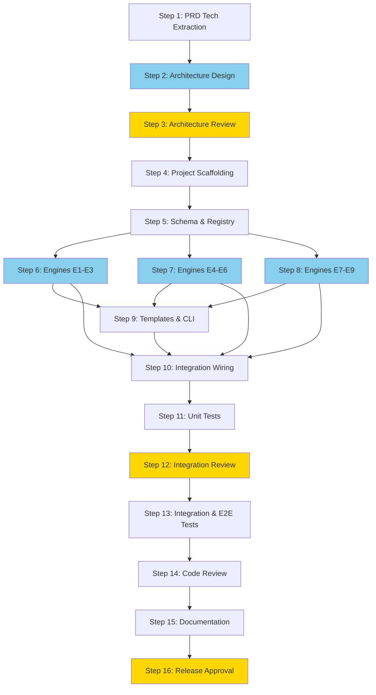

# Full-Stack SaaS Auto-Builder Development Workflow

PRD 승인 후, SaaS Auto-Builder CLI 도구를 자동 구현하는 풀스택 개발 워크플로우. Phase 1(PRD 생성) → 사용자 최종 승인 → Phase 2(이 워크플로우)로 연결되는 듀얼 워크플로우의 2단계.

## Overview

- **Input**: Approved PRD (`prompt/PRD-SaaS-AutoBuilder.md` — Phase 1 Step 12 output)
- **Output**: Complete SaaS Auto-Builder CLI tool (9 engines, 6 registries, ~50-70 generated file templates)
- **Steps**: 16 steps in 4 phases
- **Frequency**: on-demand (after Phase 1 PRD approval)
- **Autopilot**: disabled
- **pACS**: enabled (4 dimensions: F/C/L/T — T for Testability, pACS-Code variant)

### Implementation Target

**SaaS Auto-Builder**: A local CLI tool that transforms natural-language SaaS ideas into production-quality, full-stack software scaffolds.

| Component | Count | Details |
|-----------|-------|---------|
| Engines | 9 | E1(NLU/Intent) → E2(AI PM) → E3(Tool Selection) → E4(Feature Extraction) → E5(User Research) → E6(Document Pipeline) → E7(Orchestration) → E8(Code Generation) → E9(Meta-Programming) |
| Registries | 6 | Feature, Component, API, DataModel, Dependency, Constraint (Zod schemas) |
| Document Pipeline | 7 | PRD → User Journey → TRD → Code Guidelines → UI Guidelines → IA → Tasks |
| Features | 8 | F1(Conversational Engine) F2(Document Pipeline) F3(Template System) F4(Context Propagation) F5(Editable Docs) F6(Free/Paid) F7(First Experience) F8(Validation Engine) |

**Tech Stack (CLI)**: Node.js 22 / TypeScript strict / Commander.js / Inquirer.js / @anthropic-ai/sdk / Zod / Handlebars
**Tech Stack (Generated)**: Next.js 15 / Supabase / Stripe / Drizzle ORM / shadcn/ui / Tailwind CSS v4

### Phase Summary

| Phase | Steps | Focus | Human Checkpoint |
|-------|-------|-------|-----------------|
| A: Analysis & Design | 1-3 | PRD analysis, architecture design | Step 3 |
| B: Core Implementation | 4-10 | Scaffolding, schemas, engines, CLI, integration | — |
| C: Integration & Testing | 11-14 | Unit tests, integration tests, code review | Step 12 |
| D: Delivery | 15-16 | Documentation, final polish | Step 16 |

### 5-Layer Quality Gates (Code-Specific)

```
L0 (Anti-Skip)     → File exists + > 100 bytes
L1 (Compilation)   → tsc --noEmit (deterministic — P1 gene: "code doesn't lie")
L1.5 (pACS-Code)   → F(Fidelity)/C(Completeness)/L(Logic)/T(Testability)
L2 (Code Review)   → @code-reviewer adversarial review
L3 (Integration)   → Full system build + test suite + mock E2E [NEW in Phase 2]
```

**Key difference from Phase 1**: L1 is compiler-based (deterministic), not LLM-based. P1 gene expression — code has a compiler, so use it.

**pACS-Code 4th dimension**: T (Testability) — whether unit tests exist for the module and pass. Code without tests scores T=0 regardless of other dimensions.

---

## Inherited DNA (Parent Genome)

> This workflow inherits the complete genome of AgenticWorkflow.
> Purpose varies by domain; the genome is identical. See `soul.md §0`.

**Constitutional Principles** (adapted to full-stack code generation):

1. **Quality Absolutism** — Every engine, registry, and template must compile cleanly (`tsc --noEmit`), pass its test suite, and satisfy adversarial code review. Speed and token cost are completely ignored. A partially working engine is worse than no engine.
2. **Single-File SOT** — `.claude/state.yaml` holds all shared state. Only the Orchestrator writes to it. Engine implementation agents produce source files only — no SOT writes.
3. **Code Change Protocol** — Every code modification follows Intent → Impact Analysis → Change Design (CCP 3-step). Coding anchor points: CAP-1 (think before coding), CAP-2 (simplicity first), CAP-3 (goal-based execution), CAP-4 (surgical changes). This gene is **strongly expressed** in Phase 2.

**Inherited Patterns**:

| DNA Component | Inherited Form |
|--------------|---------------|
| 3-Phase Structure | Analysis/Design → Implementation → Testing/Delivery (extended to 4 phases for code workflows) |
| SOT Pattern | `.claude/state.yaml` — single writer (Orchestrator) |
| 5-Layer QA | L0 Anti-Skip → L1 Compilation → L1.5 pACS-Code → L2 Code Review → L3 Integration |
| P1 Hallucination Prevention | `validate_typescript.py` (tsc), `validate_tests.py` (vitest), `validate_schema_consistency.py` (Zod), `validate_api_contracts.py`, `validate_integration.py` |
| P2 Expert Delegation | 9 specialized agents + 4 agent teams for parallel engine implementation |
| Safety Hooks | `block_destructive_commands.py` — dangerous command blocking |
| Adversarial Review | `@code-reviewer` — Enhanced L2 independent code quality critique |
| Decision Log | `autopilot-logs/` — transparent decision tracking |
| Context Preservation | Snapshot + Knowledge Archive + RLM restoration |

**Domain-Specific Gene Expression**:

| Gene | Expression Level | Rationale |
|------|-----------------|-----------|
| **CCP (Code Change Protocol)** | **STRONG** | Every step produces code — CCP 3-step mandatory |
| **P1 (Deterministic Validation)** | **STRONG** | TypeScript compiler + Vitest = objective truth. LLM verification is P1 violation for code |
| **L3 (Integration Gate)** | **NEW** | Phase 1 had no L3. Code must integrate — individual module quality is necessary but insufficient |
| **pACS-T (Testability)** | **NEW** | 4th pACS dimension. Untested code = unknown quality regardless of F/C/L scores |
| **Registry-Driven Consistency** | **STRONG** | 6 Zod registries are SOT for cross-module references. Direct imports between engines = architecture violation |

---

## Phase A: Analysis & Design

### 1. PRD Technical Extraction
- **Pre-processing**: `python3 scripts/extract_engine_specs.py --input prompt/PRD-SaaS-AutoBuilder.md --output-dir dev/analysis/sections/`
  - Extracts: Engine specs (E1-E9), registry schemas, API contracts, tech stack, feature specs (F1-F8), generated file catalog
  - Rationale: PRD is ~2,700 lines. Pre-processing extracts the ~40% that matters for technical implementation (P1 — noise reduction)
- **Context Injection**: Pattern B (Filtered — PRD > 100KB, extract tech-relevant sections)
- **Agent**: `@prd-tech-analyst` (opus)
- **Verification**:
  - [ ] All 9 engines (E1-E9) have extracted: input type, output type, key technology, dependencies, error handling strategy
  - [ ] All 6 registries have extracted: Zod schema fields, validation rules, cross-registry references
  - [ ] All 8 features (F1-F8) have extracted: priority, dependencies, engine mapping, acceptance criteria
  - [ ] Tech stack table covers both CLI stack and generated stack with exact versions
  - [ ] Output format matches Step 2 input requirements: engine specs are individually addressable (source: Step 2 architecture-design-team inputs)
- **Task**: Analyze the approved PRD to extract all technical specifications needed for implementation. Produce a structured technical analysis that maps every engine, registry, feature, and API contract to implementation requirements. Identify architectural constraints, cross-engine dependencies, and risk areas.
- **Output**: `dev/analysis/prd-tech-analysis.md`
- **Review**: `@fact-checker` — verify extracted specs match PRD source
- **Translation**: none (technical analysis, not user-facing)
- **Post-processing**: `python3 scripts/validate_tech_extraction.py --input dev/analysis/prd-tech-analysis.md --prd prompt/PRD-SaaS-AutoBuilder.md`
  - Validates: all E1-E9 covered, all F1-F8 covered, all 6 registries covered, no placeholder markers

### 2. (team) Architecture Design
- **Team**: `architecture-design-team`
- **Checkpoint Pattern**: dense (each member > 10 turns expected)
- **Context Injection**: Pattern A (Full Delegation — each member reads Step 1 output + specific PRD sections)
- **Tasks**:
  - `@engine-architect` (opus): Design system architecture — engine pipeline, module boundaries, inter-engine communication protocol, dependency graph, error propagation strategy. Focus on the compiler metaphor: front-end (E1-E5) → IR (7 documents) → back-end (E6-E8) → linker (E9).
    - **Checkpoints**:
      - CP-1: Engine dependency graph + module boundary document
      - CP-2: Inter-engine communication protocol (typed interfaces)
      - CP-3: Complete system architecture specification
    - **Output**: `dev/architecture/system-architecture.md`
  - `@schema-designer` (opus): Design data model — 6 Zod registry schemas (Feature, Component, API, DataModel, Dependency, Constraint), shared types, cross-registry validation rules, IntentObject schema, 7-document schemas. Every type must be Zod-first.
    - **Checkpoints**:
      - CP-1: Registry schema drafts (6 schemas)
      - CP-2: Cross-registry validation rules + IntentObject schema
      - CP-3: Complete data model specification with Zod code
    - **Output**: `dev/architecture/data-model-design.md`
  - `@template-architect` (opus): Design template system — Handlebars template hierarchy, generated project file structure (~50-70 files), template variable mapping from registries, LLM vs template boundary per file category. Include E8's 3-phase generation strategy.
    - **Checkpoints**:
      - CP-1: Generated file catalog with source method (Template/LLM/Hybrid)
      - CP-2: Handlebars template hierarchy + variable mapping
      - CP-3: Complete template system specification
    - **Output**: `dev/architecture/template-system-design.md`
- **Join**: All 3 members complete → Orchestrator validates cross-consistency (engine interfaces match schema types, template variables match registry fields)
- **SOT**: Orchestrator only writes to `state.yaml`. Members produce output files only.
- **Verification** (post-join):
  - [ ] Engine interfaces in system-architecture.md reference exact Zod types from data-model-design.md
  - [ ] Template variables in template-system-design.md map to registry fields in data-model-design.md
  - [ ] All 9 engines have defined: TypeScript interface, input type, output type, error type
  - [ ] All 6 registries have complete Zod schemas with field-level documentation
  - [ ] Generated file catalog covers all ~50-70 files from PRD E8 specification (source: Step 1)
  - [ ] Directory structure is defined: `src/engines/`, `src/registries/`, `src/templates/`, `src/cli/`, `src/types/`
- **Review**: `@reviewer` — architectural consistency, interface completeness
- **Translation**: none
- **Post-processing**: `python3 scripts/validate_architecture_consistency.py --arch dev/architecture/system-architecture.md --schema dev/architecture/data-model-design.md --templates dev/architecture/template-system-design.md`

### 3. (human) Architecture Review
- **Action**: Review architecture design artifacts from Step 2. Verify engine boundaries, schema completeness, template strategy, and cross-document consistency. Approve or request revisions.
- **Command**: `/review-architecture`
- **Autopilot Default**: Approve if all Step 2 verification criteria passed and @reviewer verdict is PASS

---

## Phase B: Core Implementation

### 4. Project Scaffolding
- **Pre-processing**: `python3 scripts/generate_project_config.py --arch dev/architecture/system-architecture.md --schema dev/architecture/data-model-design.md`
  - Generates: `dev/scaffolding/project-config.json` (package.json fields, tsconfig options, directory structure)
- **Context Injection**: Pattern A (Full Delegation — architecture outputs < 50KB each)
- **Agent**: `@project-scaffolder` (sonnet)
- **Verification**:
  - [ ] `package.json` exists with all dependencies from PRD §8.1 tech stack (Node.js 22, TypeScript 5.x, Commander.js v12+, Inquirer.js v8, @anthropic-ai/sdk, Zod v3.x, Handlebars)
  - [ ] `tsconfig.json` exists with `strict: true`, `noEmit` configured
  - [ ] Directory structure matches architecture: `src/engines/`, `src/registries/`, `src/templates/`, `src/cli/`, `src/types/`, `tests/unit/`, `tests/integration/`, `tests/e2e/`
  - [ ] `biome.json` or equivalent linter config exists
  - [ ] `.env.example` with required environment variables (ANTHROPIC_API_KEY at minimum)
  - [ ] L1 passes: `tsc --noEmit` exits 0 on empty project (source: Step 5 schema implementation depends on this)
- **Task**: Create the complete project scaffolding for the SaaS Auto-Builder CLI tool. Generate all configuration files, directory structure, and boilerplate. The project must compile cleanly with TypeScript strict mode from the start.
- **Output**: `src/` directory structure + config files (`package.json`, `tsconfig.json`, `biome.json`, `.env.example`, `vitest.config.ts`)
- **Review**: none (mechanical scaffolding, L1 compilation is sufficient)
- **Translation**: none
- **Post-processing**: `python3 .claude/hooks/scripts/validate_typescript.py --project-dir . --src-dir src/`

### 5. Schema & Registry Implementation
- **Context Injection**: Pattern A (Full Delegation — data-model-design.md is the primary input)
- **Agent**: `@schema-designer` (opus)
- **Verification**:
  - [ ] All 6 registries implemented as Zod schemas: `src/registries/feature.ts`, `src/registries/component.ts`, `src/registries/api.ts`, `src/registries/data-model.ts`, `src/registries/dependency.ts`, `src/registries/constraint.ts`
  - [ ] `src/registries/index.ts` exports all registries with unified validation API
  - [ ] `src/types/intent.ts` defines IntentObject with Zod schema matching PRD E1 specification
  - [ ] `src/types/index.ts` exports all shared types
  - [ ] Cross-registry references use typed identifiers (not string literals)
  - [ ] L1 passes: `tsc --noEmit` exits 0 (source: Step 6-8 engines depend on these types)
  - [ ] Unit tests exist: `tests/unit/registries/*.test.ts` with Zod validation edge cases
- **Task**: Implement all 6 Zod registries and shared TypeScript types based on the data model design from Step 2. Every registry must have: schema definition, type inference (`z.infer<>`), validation function, and factory function. Implement IntentObject and all inter-engine types. Write unit tests for schema validation.
- **Output**: `src/registries/` (6 files + index.ts) + `src/types/` (shared types) + `tests/unit/registries/` (test files)
- **Review**: `@code-reviewer` — schema correctness, type safety, test coverage
- **Translation**: none
- **Post-processing**:
  - `python3 .claude/hooks/scripts/validate_typescript.py --project-dir . --src-dir src/`
  - `python3 .claude/hooks/scripts/validate_tests.py --project-dir . --test-dir tests/unit/registries/`
  - `python3 .claude/hooks/scripts/validate_schema_consistency.py --project-dir . --registry-dir src/registries/`

### 6. (team) Engine Implementation — Front-End Engines (E1-E3)
- **Team**: `engine-frontend-team`
- **Checkpoint Pattern**: dense (each engine > 10 turns expected)
- **Context Injection**: Pattern B (Filtered — each member receives engine-specific PRD section + architecture spec + registry types)
- **Pre-processing**: `python3 scripts/extract_engine_context.py --engines E1,E2,E3 --prd prompt/PRD-SaaS-AutoBuilder.md --arch dev/architecture/system-architecture.md --output-dir dev/engine-context/`
- **Tasks**:
  - `@engine-impl-e1` (opus): Implement E1 NLU/Intent Engine — 7-state FSM, domain classification, slot extraction via Claude structured outputs, IntentObject production. Handle: `initial_capture → domain_confirmation → scale_clarification → feature_enumeration → tech_constraints → approval_pending → generation_ready`.
    - **Checkpoints**:
      - CP-1: FSM state machine + transitions implemented
      - CP-2: Claude structured output integration + slot extraction
      - CP-3: Full E1 with unit tests
    - **Output**: `src/engines/e1-intent/` + `tests/unit/engines/e1-intent/`
  - `@engine-impl-e2` (opus): Implement E2 AI PM Engine — PRD expansion from IntentObject, Feature Registry population, problem framing, approval gate. Claude Sonnet + CoT prompting.
    - **Checkpoints**:
      - CP-1: PRD expansion prompt chain
      - CP-2: Feature Registry population logic
      - CP-3: Full E2 with unit tests
    - **Output**: `src/engines/e2-aipm/` + `tests/unit/engines/e2-aipm/`
  - `@engine-impl-e3` (opus): Implement E3 Tool Selection Engine — tech stack selection from IntentObject + constraints, static ToolRegistry (95% cases) + ReAct for novel combinations, Dependency Registry population.
    - **Checkpoints**:
      - CP-1: Static ToolRegistry with default stacks
      - CP-2: ReAct fallback for novel combinations
      - CP-3: Full E3 with unit tests
    - **Output**: `src/engines/e3-tools/` + `tests/unit/engines/e3-tools/`
- **Join**: All 3 engines complete → Orchestrator validates cross-engine interfaces (E1 output → E2/E3 input types match)
- **SOT**: Orchestrator only. Members produce source files only.
- **Verification** (post-join):
  - [ ] E1 output type (IntentObject) matches E2 and E3 input types exactly
  - [ ] L1 passes: `tsc --noEmit` for all 3 engines
  - [ ] Unit tests pass: `vitest run tests/unit/engines/e1-intent/ tests/unit/engines/e2-aipm/ tests/unit/engines/e3-tools/`
  - [ ] Each engine exports a typed async function with Zod-validated input/output
  - [ ] Error handling follows architecture spec: each engine throws typed errors (source: Step 2 system-architecture.md)
- **Review**: `@code-reviewer` — interface compliance, type safety, error handling
- **Translation**: none
- **Post-processing**:
  - `python3 .claude/hooks/scripts/validate_typescript.py --project-dir . --src-dir src/engines/`
  - `python3 .claude/hooks/scripts/validate_tests.py --project-dir . --test-dir tests/unit/engines/`
  - `python3 .claude/hooks/scripts/validate_api_contracts.py --project-dir . --engines E1,E2,E3 --spec dev/analysis/prd-tech-analysis.md`

### 7. (team) Engine Implementation — Core Engines (E4-E6)
- **Team**: `engine-analysis-team`
- **Checkpoint Pattern**: dense
- **Context Injection**: Pattern B (Filtered)
- **Pre-processing**: `python3 scripts/extract_engine_context.py --engines E4,E5,E6 --prd prompt/PRD-SaaS-AutoBuilder.md --arch dev/architecture/system-architecture.md --output-dir dev/engine-context/`
- **Tasks**:
  - `@engine-impl-e4` (opus): Implement E4 Feature Extraction Engine — Feature Registry population from IntentObject + domain frame, Frame Semantics + Tree of Thoughts discovery, priority scoring, structured output extraction.
    - **Checkpoints**:
      - CP-1: Domain frame loading + feature extraction logic
      - CP-2: ToT discovery + priority scoring
      - CP-3: Full E4 with unit tests
    - **Output**: `src/engines/e4-features/` + `tests/unit/engines/e4-features/`
  - `@engine-impl-e5` (opus): Implement E5 User Research Engine — persona synthesis (3 personas), user story generation, UX persona schema, structured outputs from Feature Registry.
    - **Checkpoints**:
      - CP-1: Persona schema + synthesis prompt
      - CP-2: User story generation from feature map
      - CP-3: Full E5 with unit tests
    - **Output**: `src/engines/e5-research/` + `tests/unit/engines/e5-research/`
  - `@engine-impl-e6` (opus): Implement E6 Document Pipeline Engine — 7-document DAG generation (PRD → User Journey → TRD → Code Guidelines → UI Guidelines → IA → Tasks), registry-driven SOT, Zod validation at each document boundary.
    - **Checkpoints**:
      - CP-1: DAG execution order + document schemas
      - CP-2: Registry-driven cross-document consistency
      - CP-3: Full E6 with unit tests
    - **Output**: `src/engines/e6-docs/` + `tests/unit/engines/e6-docs/`
- **Join**: All 3 engines complete → Orchestrator validates E4 output feeds E5, E5+E4 feed E6
- **SOT**: Orchestrator only.
- **Verification** (post-join):
  - [ ] E4 Feature Registry output matches E5 input type
  - [ ] E6 consumes all 6 registries as input
  - [ ] L1 passes: `tsc --noEmit` for E4, E5, E6
  - [ ] Unit tests pass for all 3 engines
  - [ ] E6 DAG execution order matches PRD specification: PRD → User Journey → TRD → Code Guidelines → UI Guidelines → IA → Tasks
  - [ ] Each document output has Zod validation at boundary (source: Step 2 data-model-design.md)
- **Review**: `@code-reviewer` — pipeline correctness, registry integration
- **Translation**: none
- **Post-processing**:
  - `python3 .claude/hooks/scripts/validate_typescript.py --project-dir . --src-dir src/engines/`
  - `python3 .claude/hooks/scripts/validate_tests.py --project-dir . --test-dir tests/unit/engines/`
  - `python3 .claude/hooks/scripts/validate_api_contracts.py --project-dir . --engines E4,E5,E6 --spec dev/analysis/prd-tech-analysis.md`

### 8. (team) Engine Implementation — Back-End Engines (E7-E9)
- **Team**: `code-generation-team`
- **Checkpoint Pattern**: dense
- **Context Injection**: Pattern B (Filtered)
- **Pre-processing**: `python3 scripts/extract_engine_context.py --engines E7,E8,E9 --prd prompt/PRD-SaaS-AutoBuilder.md --arch dev/architecture/system-architecture.md --output-dir dev/engine-context/`
- **Tasks**:
  - `@engine-impl-e7` (opus): Implement E7 Multi-Agent Orchestration Engine — single orchestrator (V1) coordinating E1→E9 pipeline, error recovery, progress reporting, cost tracking. State machine for pipeline execution.
    - **Checkpoints**:
      - CP-1: Pipeline state machine + execution order
      - CP-2: Error recovery + progress reporting
      - CP-3: Full E7 with unit tests
    - **Output**: `src/engines/e7-orchestration/` + `tests/unit/engines/e7-orchestration/`
  - `@engine-impl-e8` (opus): Implement E8 Code Generation Engine — 3-phase strategy: Phase 1 (Handlebars structural, ~30 files), Phase 2 (LLM schema+domain, 3-5 calls), Phase 3 (LLM app shell+docs, 2-3 calls). Template rendering + LLM-generated business logic.
    - **Checkpoints**:
      - CP-1: Phase 1 Handlebars template rendering engine
      - CP-2: Phase 2 LLM-driven schema + domain generation
      - CP-3: Phase 3 + full E8 with unit tests
    - **Output**: `src/engines/e8-codegen/` + `tests/unit/engines/e8-codegen/`
  - `@engine-impl-e9` (opus): Implement E9 Meta-Programming Engine — AGENTS.md + CLAUDE.md generation for generated projects, DNA injection, project context extraction. Static structure + LLM-populated context.
    - **Checkpoints**:
      - CP-1: Template structure for AGENTS.md and CLAUDE.md
      - CP-2: LLM context population from project analysis
      - CP-3: Full E9 with unit tests
    - **Output**: `src/engines/e9-meta/` + `tests/unit/engines/e9-meta/`
- **Join**: All 3 engines complete → Orchestrator validates E7 orchestrates E1-E9, E8 consumes all 7 documents + 6 registries
- **SOT**: Orchestrator only.
- **Verification** (post-join):
  - [ ] E7 pipeline definition includes all 9 engines in correct order
  - [ ] E8 consumes all 7 document types and all 6 registries
  - [ ] E8 3-phase strategy implemented: Phase 1 (template), Phase 2 (LLM 3-5 calls), Phase 3 (LLM 2-3 calls)
  - [ ] E9 generates valid AGENTS.md and CLAUDE.md markdown
  - [ ] L1 passes: `tsc --noEmit` for E7, E8, E9
  - [ ] Unit tests pass for all 3 engines
  - [ ] File count for Phase 1 template output >= 30 files (source: PRD E8 specification)
- **Review**: `@code-reviewer` — generation correctness, template fidelity
- **Translation**: none
- **Post-processing**:
  - `python3 .claude/hooks/scripts/validate_typescript.py --project-dir . --src-dir src/engines/`
  - `python3 .claude/hooks/scripts/validate_tests.py --project-dir . --test-dir tests/unit/engines/`
  - `python3 .claude/hooks/scripts/validate_api_contracts.py --project-dir . --engines E7,E8,E9 --spec dev/analysis/prd-tech-analysis.md`

### 9. Template System & CLI Implementation
- **Context Injection**: Pattern A (Full Delegation — template design + architecture < 50KB)
- **Agent**: `@template-architect` (opus)
- **Verification**:
  - [ ] Handlebars templates exist in `src/templates/` for all template-generated files from PRD E8: config files, auth infrastructure, billing infrastructure, shared utilities
  - [ ] Template variable mapping from registries is implemented in `src/templates/renderer.ts`
  - [ ] Commander.js CLI entry point exists: `src/cli/index.ts` with `create`, `generate`, `validate` subcommands
  - [ ] Inquirer.js interactive prompts match PRD F1 specification: 5-7 smart questions
  - [ ] CLI help text and error messages are user-friendly
  - [ ] L1 passes: `tsc --noEmit`
  - [ ] Unit tests exist for template rendering and CLI argument parsing
  - [ ] Template output matches generated file catalog from Step 2 (source: template-system-design.md)
- **Task**: Implement the Handlebars template system for E8's Phase 1 (structural generation) and the Commander.js + Inquirer.js CLI interface. Templates must render all ~30 config/auth/billing/utility files from registry data. CLI must handle the complete user interaction flow.
- **Output**: `src/templates/` (Handlebars templates + renderer) + `src/cli/` (Commander.js + Inquirer.js) + `tests/unit/templates/` + `tests/unit/cli/`
- **Review**: `@code-reviewer` — template correctness, CLI UX
- **Translation**: none
- **Post-processing**:
  - `python3 .claude/hooks/scripts/validate_typescript.py --project-dir . --src-dir src/`
  - `python3 .claude/hooks/scripts/validate_tests.py --project-dir . --test-dir tests/unit/templates/ tests/unit/cli/`

### 10. Integration Wiring
- **Pre-processing**: `python3 scripts/collect_engine_interfaces.py --src-dir src/engines/ --output dev/integration/engine-interfaces.json`
  - Extracts all engine export signatures for interface validation
- **Context Injection**: Pattern B (Filtered — collect interface signatures from all engines)
- **Agent**: `@api-engineer` (opus)
- **Verification**:
  - [ ] `src/pipeline/index.ts` wires E1→E2→E3→E4→E5→E6→E7→E8→E9 in correct order
  - [ ] Pipeline execution handles partial failures gracefully (retry, skip, or abort per engine)
  - [ ] Registry passing between engines uses shared state (not file I/O between steps)
  - [ ] Cost tracking accumulates Anthropic API token usage across all LLM calls
  - [ ] Progress reporting emits events for CLI progress display
  - [ ] `src/index.ts` exports the main entry point that CLI calls
  - [ ] L1 passes: `tsc --noEmit` for entire `src/` directory
  - [ ] Integration smoke test: pipeline instantiates without error (no actual LLM calls)
  - [ ] All cross-engine imports use registry types, not direct engine internals (source: Step 2 system-architecture.md)
- **Task**: Wire all 9 engines into the execution pipeline. Implement the main orchestration flow that E7 manages. Connect CLI entry points to the pipeline. Implement cost tracking, progress reporting, and error recovery. Ensure all inter-engine communication uses typed interfaces through registries.
- **Output**: `src/pipeline/` (orchestration wiring) + `src/index.ts` (main entry) + `tests/unit/pipeline/`
- **Review**: `@code-reviewer` — integration correctness, error handling, type safety
- **Translation**: none
- **Post-processing**:
  - `python3 .claude/hooks/scripts/validate_typescript.py --project-dir . --src-dir src/`
  - `python3 .claude/hooks/scripts/validate_tests.py --project-dir . --test-dir tests/unit/pipeline/`

---

## Phase C: Integration & Testing

### 11. Unit Test Suite
- **Context Injection**: Pattern B (Filtered — scan source for untested modules)
- **Pre-processing**: `python3 scripts/analyze_test_coverage.py --src-dir src/ --test-dir tests/unit/ --output dev/testing/coverage-gaps.json`
  - Identifies modules with missing or insufficient tests
- **Agent**: `@test-engineer` (sonnet)
- **Verification**:
  - [ ] Every engine (E1-E9) has unit tests in `tests/unit/engines/`
  - [ ] All 6 registries have unit tests in `tests/unit/registries/`
  - [ ] Template renderer has unit tests
  - [ ] CLI argument parsing has unit tests
  - [ ] Pipeline orchestration has unit tests
  - [ ] `vitest run` passes with 0 failures
  - [ ] Code coverage >= 80% (lines) as reported by `vitest --coverage`
  - [ ] Edge cases tested: invalid inputs, timeout scenarios, malformed LLM responses
- **Task**: Complete the unit test suite. Fill gaps identified by coverage analysis. Write edge case tests for every engine, registry, template, and CLI module. Ensure all Zod schemas have validation edge case tests. Target 80%+ line coverage.
- **Output**: `tests/unit/` (complete test suite)
- **Review**: none (tests are self-validating — if they pass, they pass)
- **Translation**: none
- **Post-processing**:
  - `python3 .claude/hooks/scripts/validate_tests.py --project-dir . --test-dir tests/unit/ --coverage-threshold 80`

### 12. (human) Integration Review
- **Action**: Review the complete codebase. Verify engine implementations match PRD specifications. Check cross-engine integration. Review test coverage. Approve or request revisions.
- **Command**: `/review-integration`
- **Autopilot Default**: Approve if L1 (tsc) passes, unit tests pass with 80%+ coverage, and all L2 (@code-reviewer) verdicts were PASS

### 13. Integration & E2E Testing
- **Pre-processing**: `python3 scripts/generate_test_fixtures.py --registries src/registries/ --output tests/fixtures/`
  - Generates mock IntentObjects, registry data, and LLM responses for integration tests
- **Context Injection**: Pattern B (Filtered — generate test fixtures from schemas)
- **Agent**: `@test-engineer` (sonnet)
- **Verification**:
  - [ ] Integration tests exist in `tests/integration/` covering: E1→E2 handoff, E4→E5→E6 pipeline, E7 full orchestration (mocked LLM), E8 template rendering (no LLM)
  - [ ] E2E mock tests exist in `tests/e2e/` covering: CLI command → full pipeline → file output (with mocked Anthropic API)
  - [ ] All integration tests pass: `vitest run tests/integration/`
  - [ ] All E2E tests pass: `vitest run tests/e2e/`
  - [ ] Generated output file count matches expected range (45-70 files) in E2E test
  - [ ] No runtime type errors in pipeline execution
  - [ ] L3 gate: full `tsc --noEmit && vitest run` passes on complete project
- **Task**: Write integration tests for cross-engine communication and E2E tests for the full CLI-to-output pipeline. Use mocked Anthropic API responses (no real LLM calls in tests). Verify generated project structure matches PRD specifications.
- **Output**: `tests/integration/` + `tests/e2e/` + `tests/fixtures/`
- **Review**: `@code-reviewer` — test quality, mock fidelity, coverage adequacy
- **Translation**: none
- **Post-processing**:
  - `python3 .claude/hooks/scripts/validate_tests.py --project-dir . --test-dir tests/ --coverage-threshold 80`
  - `python3 .claude/hooks/scripts/validate_integration.py --project-dir .`

### 14. Adversarial Code Review
- **Context Injection**: Pattern B (Filtered — collect key files for review)
- **Pre-processing**: `python3 scripts/collect_review_targets.py --src-dir src/ --output dev/review/review-manifest.json`
  - Collects: all source files, import graphs, type coverage, test coverage, complexity metrics
- **Agent**: `@code-reviewer` (opus)
- **Verification**:
  - [ ] Review covers all 9 engines, 6 registries, template system, CLI, and pipeline
  - [ ] Each module reviewed for: type safety, error handling, security (no eval, no SQL injection, no command injection), performance (no unbounded loops, no memory leaks)
  - [ ] Cross-module consistency verified: import graph has no circular dependencies
  - [ ] All Critical issues from review are resolved (code is modified in response)
  - [ ] Final verdict is PASS
  - [ ] Review report includes specific file:line references for all findings
- **Task**: Perform comprehensive adversarial review of the complete codebase. Check every engine for type safety, error handling, security vulnerabilities, and performance issues. Verify cross-module consistency and architectural compliance. Produce a detailed review report. Fix all Critical issues directly.
- **Output**: `dev/review/code-review-report.md` (review report) + source code fixes
- **Review**: none (this step IS the review)
- **Translation**: none
- **Post-processing**:
  - `python3 .claude/hooks/scripts/validate_typescript.py --project-dir . --src-dir src/`
  - `python3 .claude/hooks/scripts/validate_tests.py --project-dir . --test-dir tests/`

---

## Phase D: Delivery

### 15. Documentation & Polish
- **Context Injection**: Pattern A (Full Delegation)
- **Agent**: `@docs-engineer` (sonnet)
- **Verification**:
  - [ ] `README.md` exists with: installation, quick start, usage examples, configuration, architecture overview
  - [ ] `ARCHITECTURE.md` exists with: system design, engine descriptions, data flow diagrams
  - [ ] `CONTRIBUTING.md` exists with: development setup, testing, code style
  - [ ] `CHANGELOG.md` exists with initial version entry
  - [ ] API documentation exists for all public interfaces
  - [ ] CLI `--help` output is accurate and complete
  - [ ] No TODO, TBD, PLACEHOLDER, or [INSERT] markers in any documentation
  - [ ] `npm run build` (tsup) produces valid output in `dist/`
  - [ ] `npm link` followed by `saas-autobuilder --help` works correctly
- **Task**: Write comprehensive documentation. Polish the codebase for release: ensure consistent code formatting (Biome), clean up any TODO comments, verify all error messages are user-friendly, ensure CLI UX is polished. Build the project with tsup and verify the CLI works end-to-end.
- **Output**: `README.md`, `ARCHITECTURE.md`, `CONTRIBUTING.md`, `CHANGELOG.md` + build output in `dist/`
- **Review**: `@reviewer` — documentation completeness, accuracy
- **Translation**: `@translator` → `README.ko.md` (Korean README for Korean-speaking users)
- **Post-processing**: `python3 scripts/validate_docs.py --project-dir .`

### 16. (human) Release Approval
- **Action**: Final review of the complete SaaS Auto-Builder CLI tool. Verify it works end-to-end: CLI input → engine pipeline → generated project output. Approve for release or request final revisions.
- **Command**: `/review-release`
- **Autopilot Default**: Approve if all L3 gates pass (tsc + vitest + E2E), documentation complete, and code-review verdict is PASS

---

## Claude Code Configuration

### Sub-agents

```yaml
# .claude/agents/ — Phase 2 specific agents

prd-tech-analyst:
  name: prd-tech-analyst
  description: "Analyze approved PRD to extract technical implementation requirements"
  model: opus
  tools: [Read, Glob, Grep, Write]
  maxTurns: 40
  memory: project

engine-architect:
  name: engine-architect
  description: "Design system architecture — engine pipeline, module boundaries, interfaces"
  model: opus
  tools: [Read, Glob, Grep, Write]
  maxTurns: 60
  memory: project

schema-designer:
  name: schema-designer
  description: "Design and implement Zod schemas, registries, and shared types"
  model: opus
  tools: [Read, Glob, Grep, Write, Bash]
  maxTurns: 60
  memory: project

template-architect:
  name: template-architect
  description: "Design and implement Handlebars template system and CLI interface"
  model: opus
  tools: [Read, Glob, Grep, Write, Bash]
  maxTurns: 60
  memory: project

project-scaffolder:
  name: project-scaffolder
  description: "Create project scaffolding — directory structure, configs, boilerplate"
  model: sonnet
  tools: [Read, Glob, Write, Bash]
  maxTurns: 30
  memory: project

engine-implementer:
  name: engine-implementer
  description: "Implement individual SaaS Auto-Builder engines (E1-E9)"
  model: opus
  tools: [Read, Glob, Grep, Write, Bash]
  maxTurns: 80
  memory: project
  # Note: Spawned as @engine-impl-e1 through @engine-impl-e9
  # Each instance receives engine-specific context via prompt

api-engineer:
  name: api-engineer
  description: "Wire engines into execution pipeline — integration, orchestration, error recovery"
  model: opus
  tools: [Read, Glob, Grep, Write, Bash]
  maxTurns: 60
  memory: project

test-engineer:
  name: test-engineer
  description: "Write unit, integration, and E2E tests — Vitest + mocked LLM"
  model: sonnet
  tools: [Read, Glob, Grep, Write, Bash]
  maxTurns: 60
  memory: project

code-reviewer:
  name: code-reviewer
  description: "Adversarial code review — type safety, security, architecture compliance"
  model: opus
  tools: [Read, Glob, Grep, Write, Bash]
  maxTurns: 60
  memory: project

docs-engineer:
  name: docs-engineer
  description: "Write project documentation — README, ARCHITECTURE, CONTRIBUTING, API docs"
  model: sonnet
  tools: [Read, Glob, Grep, Write, Bash]
  maxTurns: 40
  memory: project
```

> **Model Selection Rationale (Absolute Criterion 1)**:
> - **opus**: All engine implementation (E1-E9), architecture design, schema design, code review — quality-critical creative tasks
> - **sonnet**: Project scaffolding, testing, documentation — structured tasks with clear specifications
> - Engine implementers use opus because each engine requires deep understanding of the PRD specification, compiler metaphor, and cross-engine interface contracts

### Agent Teams (Parallel Collaboration)

```markdown
#### Team 1: architecture-design-team (Step 2)
- Purpose: Parallel design of system architecture, data model, and template system
- Members: @engine-architect, @schema-designer, @template-architect (3 members)
- SOT: Orchestrator writes state.yaml. Members produce output files only.
- Quality justification: 3 independent expert perspectives produce richer, more consistent architecture than sequential design

#### Team 2: engine-frontend-team (Step 6)
- Purpose: Parallel implementation of compiler front-end engines (E1-E3)
- Members: @engine-impl-e1, @engine-impl-e2, @engine-impl-e3 (3 members)
- SOT: Orchestrator writes state.yaml. Members produce source files only.
- Quality justification: E1-E3 have minimal cross-dependencies (E1→E2, E1→E3 but not E2↔E3). Parallel implementation with post-join interface validation is safe.

#### Team 3: engine-analysis-team (Step 7)
- Purpose: Parallel implementation of analysis/extraction engines (E4-E6)
- Members: @engine-impl-e4, @engine-impl-e5, @engine-impl-e6 (3 members)
- SOT: Orchestrator writes state.yaml. Members produce source files only.
- Quality justification: E4-E6 share input patterns (registries) but produce independent outputs. Parallel implementation maximizes quality by giving each engine full context window attention.

#### Team 4: code-generation-team (Step 8)
- Purpose: Parallel implementation of code generation engines (E7-E9)
- Members: @engine-impl-e7, @engine-impl-e8, @engine-impl-e9 (3 members)
- SOT: Orchestrator writes state.yaml. Members produce source files only.
- Quality justification: E7 (orchestration), E8 (code gen), E9 (meta) are architecturally independent. Each is complex enough to benefit from dedicated agent attention.
```

### SOT (State Management)

- **SOT File**: `.claude/state.yaml`
- **Writer**: Orchestrator only (single write point — Absolute Criterion 2)
- **Agent Access**: Read-only. Agents produce output files; Orchestrator records in SOT.
- **Quality Override**: None needed. Standard SOT pattern applies — engine agents are fully independent within their team steps.

#### Phase 2 SOT Schema

```yaml
workflow:
  name: "fullstack-saas-autobuilder"
  current_step: 1
  status: "in_progress"     # in_progress | completed | failed | paused

  parent_genome:
    source: "AgenticWorkflow"
    version: "2026-03-13"
    inherited_dna: ["absolute-criteria", "sot-pattern", "4-phase-structure", "5-layer-qa", "safety-hooks", "adversarial-review", "decision-log", "context-preservation", "ccp-strong", "pacs-code-4d"]

  outputs:
    # Phase A
    # step-1: "dev/analysis/prd-tech-analysis.md"
    # step-2: "dev/architecture/manifest.md"
    # step-3: "approved-by-user"
    # Phase B
    # step-4: "src/ (scaffolding)"
    # step-5: "src/registries/ + src/types/"
    # step-6: "src/engines/e1-intent/ + e2-aipm/ + e3-tools/"
    # step-7: "src/engines/e4-features/ + e5-research/ + e6-docs/"
    # step-8: "src/engines/e7-orchestration/ + e8-codegen/ + e9-meta/"
    # step-9: "src/templates/ + src/cli/"
    # step-10: "src/pipeline/ + src/index.ts"
    # Phase C
    # step-11: "tests/unit/"
    # step-12: "approved-by-user"
    # step-13: "tests/integration/ + tests/e2e/"
    # step-14: "dev/review/code-review-report.md"
    # Phase D
    # step-15: "README.md + docs/"
    # step-16: "approved-by-user"

  # active_team: (populated during team steps)
  #   name: "engine-frontend-team"
  #   status: "partial"
  #   tasks_completed: []
  #   tasks_pending: ["e1-intent", "e2-aipm", "e3-tools"]
  #   completed_summaries: {}
  # completed_teams: []

  pacs:
    dimensions: [F, C, L, T]     # 4 dimensions for code (T = Testability)
    # history:
    #   step-1: {score: 85, weak: "C"}
    #   step-5: {score: 78, weak: "T"}

  verification:
    # last_verified_step: 0
    # retries: {}
```

### Hooks

```json
{
  "hooks": {
    "PreToolUse": [
      {
        "matcher": "Bash",
        "hooks": [{
          "type": "command",
          "command": "python3 \"$CLAUDE_PROJECT_DIR\"/.claude/hooks/scripts/block_destructive_commands.py",
          "timeout": 10
        }]
      },
      {
        "matcher": "Edit|Write",
        "hooks": [{
          "type": "command",
          "command": "python3 \"$CLAUDE_PROJECT_DIR\"/.claude/hooks/scripts/predictive_debug_guard.py",
          "timeout": 10
        }]
      }
    ],
    "PostToolUse": [
      {
        "matcher": "Write",
        "hooks": [{
          "type": "command",
          "command": "python3 \"$CLAUDE_PROJECT_DIR\"/.claude/hooks/scripts/validate_typescript.py --project-dir \"$CLAUDE_PROJECT_DIR\" --changed-file \"$(echo $TOOL_INPUT | python3 -c 'import sys,json; print(json.load(sys.stdin).get(\"file_path\",\"\"))')\" 2>/dev/null || true",
          "timeout": 30
        }]
      },
      {
        "matcher": "Bash|Read",
        "hooks": [{
          "type": "command",
          "command": "python3 \"$CLAUDE_PROJECT_DIR\"/.claude/hooks/scripts/output_secret_filter.py",
          "timeout": 10
        }]
      }
    ],
    "SessionStart": [
      {
        "hooks": [{
          "type": "command",
          "command": "python3 \"$CLAUDE_PROJECT_DIR\"/.claude/hooks/scripts/restore_context.py",
          "timeout": 15
        }]
      }
    ],
    "Stop": [
      {
        "hooks": [{
          "type": "command",
          "command": "python3 \"$CLAUDE_PROJECT_DIR\"/.claude/hooks/scripts/generate_context_summary.py",
          "timeout": 30
        }]
      }
    ]
  }
}
```

### 5 New Validation Scripts (Phase 2 Specific)

| Script | Purpose | L-Layer | Trigger |
|--------|---------|---------|---------|
| `validate_typescript.py` | Run `tsc --noEmit`, structure errors as JSON | L1 | Post-Write hook + step post-processing |
| `validate_tests.py` | Run `vitest`, check coverage threshold (80%) | L1/L3 | Step post-processing |
| `validate_api_contracts.py` | Engine interface ↔ PRD spec match | L1.5 | After engine implementation steps |
| `validate_schema_consistency.py` | Zod schema consistency, duplicate detection | L1.5 | After schema/registry steps |
| `validate_integration.py` | Full pipeline mock E2E execution | L3 | After integration testing step |

### Pre-processing Scripts (Phase 2 Specific)

| Script | Purpose | Used In |
|--------|---------|---------|
| `scripts/extract_engine_specs.py` | Extract engine/registry/feature specs from PRD | Step 1 |
| `scripts/extract_engine_context.py` | Extract engine-specific context for team members | Steps 6, 7, 8 |
| `scripts/generate_project_config.py` | Generate project configuration from architecture | Step 4 |
| `scripts/collect_engine_interfaces.py` | Collect engine export signatures for integration | Step 10 |
| `scripts/analyze_test_coverage.py` | Identify untested modules | Step 11 |
| `scripts/generate_test_fixtures.py` | Generate mock data from Zod schemas | Step 13 |
| `scripts/collect_review_targets.py` | Collect review targets with metrics | Step 14 |
| `scripts/validate_tech_extraction.py` | Validate extraction completeness | Step 1 post |
| `scripts/validate_architecture_consistency.py` | Cross-validate architecture documents | Step 2 post |
| `scripts/validate_docs.py` | Validate documentation completeness | Step 15 post |

### Slash Commands

```yaml
commands:
  /review-architecture:
    description: "Step 3 — Review architecture design artifacts and approve"
    file: ".claude/commands/review-architecture.md"

  /review-integration:
    description: "Step 12 — Review integrated codebase and approve"
    file: ".claude/commands/review-integration.md"

  /review-release:
    description: "Step 16 — Final release review and approval"
    file: ".claude/commands/review-release.md"

  /run-dev-workflow:
    description: "Execute the full-stack development workflow (Phase 2)"
    file: ".claude/commands/run-dev-workflow.md"

  /dev-status:
    description: "Show current development workflow status"
    file: ".claude/commands/dev-status.md"
```

### Runtime Directories

```yaml
runtime_directories:
  # Implementation outputs
  dev/analysis/:           # Step 1 — PRD technical analysis
  dev/architecture/:       # Step 2 — Architecture design artifacts
  dev/engine-context/:     # Steps 6-8 — Filtered engine context
  dev/integration/:        # Step 10 — Integration artifacts
  dev/testing/:            # Step 11 — Coverage analysis
  dev/review/:             # Step 14 — Code review report

  # Source code (version controlled)
  src/engines/:            # E1-E9 engine implementations
  src/registries/:         # 6 Zod registries
  src/types/:              # Shared TypeScript types
  src/templates/:          # Handlebars templates
  src/cli/:                # Commander.js + Inquirer.js
  src/pipeline/:           # Integration wiring

  # Tests (version controlled)
  tests/unit/:             # Unit tests (Steps 5-11)
  tests/integration/:      # Integration tests (Step 13)
  tests/e2e/:              # E2E mock tests (Step 13)
  tests/fixtures/:         # Test fixtures (Step 13)

  # Quality gates (runtime)
  verification-logs/:      # L1 compilation logs
  pacs-logs/:              # pACS-Code scoring logs
  review-logs/:            # L2 code review logs
  autopilot-logs/:         # Autopilot decision logs
```

### Error Handling

```yaml
error_handling:
  on_agent_failure:
    action: retry_with_feedback
    max_attempts: 3          # I-1 Sisyphus: max 3 retries with different approach
    escalation: human

  on_compilation_failure:    # L1 — tsc --noEmit
    action: retry_with_error_context
    max_attempts: 3
    feedback: "TypeScript compilation errors attached. Fix all type errors."

  on_test_failure:           # L1/L3 — vitest
    action: retry_with_test_output
    max_attempts: 2
    feedback: "Test failures attached. Fix failing tests without modifying test expectations."

  on_validation_failure:     # L1.5 — schema/contract validation
    action: retry_with_validation_report
    max_attempts: 2
    rollback_after: 3

  on_hook_failure:
    action: log_and_continue

  on_context_overflow:
    action: save_and_recover

  on_teammate_failure:
    attempt_1: retry_same_agent
    attempt_2: replace_with_upgrade    # sonnet → opus
    attempt_3: human_escalation
```

### pACS-Code Logs (4-Dimension Variant)

```yaml
pacs_logging:
  log_directory: "pacs-logs/"
  log_format: "step-{N}-pacs.md"
  dimensions: [F, C, L, T]
  dimension_definitions:
    F: "Fidelity — How accurately does the code implement the PRD specification?"
    C: "Completeness — Are all required functions, types, and exports present?"
    L: "Logical Coherence — Is the code internally consistent and architecturally sound?"
    T: "Testability — Do unit tests exist and pass? Coverage adequate?"
  scoring: "min-score"              # pACS = min(F, C, L, T)
  triggers:
    GREEN: ">= 70 → auto-proceed"
    YELLOW: "50-69 → proceed with flag"
    RED: "< 50 → rework or escalate"
  protocol: "AGENTS.md §5.4 (extended with T dimension)"
```

### Autopilot Logs

```yaml
autopilot_logging:
  log_directory: "autopilot-logs/"
  log_format: "step-{N}-decision.md"
  required_fields:
    - step_number
    - checkpoint_type        # slash_command | ask_user_question
    - decision
    - rationale              # Absolute Criterion 1 based
    - quality_evidence       # L1/L2/L3 gate results
    - timestamp
```

---

## Notation

| Notation | Meaning |
|----------|---------|
| `(human)` | Human review/approval required |
| `(team)` | Agent Team parallel execution |
| `@agent-name` | Sub-agent invocation |
| `@translator` | Translation sub-agent (Translation field) |
| `/command-name` | Slash command execution |
| `Review: @code-reviewer` | L2 adversarial code review |
| `L1: tsc --noEmit` | L1 deterministic compilation gate |
| `L3: validate_integration.py` | L3 integration gate |
| `pACS-Code(F/C/L/T)` | 4-dimension code quality self-assessment |

---

## Step Dependency Graph



**Legend**: Yellow = human checkpoint, Blue = agent team (parallel)

**Parallelization Opportunities**:
- Steps 6, 7, 8 can execute in parallel (3 engine teams, independent)
- Steps 6-8 and Step 9 have partial overlap (Step 9 depends on E8 template specs from Step 8, but CLI can start with architecture specs)

---

## Quality Checkpoint Summary

| Step | L0 | L1 (tsc) | L1.5 (pACS) | L2 (Review) | L3 (Integration) |
|------|----|---------|---------|---------|----|
| 1 | file > 100B | — | F/C/L | @fact-checker | — |
| 2 | files > 100B | — | F/C/L | @reviewer | — |
| 4 | files exist | tsc --noEmit | F/C/L/T | — | — |
| 5 | files exist | tsc --noEmit | F/C/L/T | @code-reviewer | — |
| 6 | files exist | tsc --noEmit | F/C/L/T | @code-reviewer | — |
| 7 | files exist | tsc --noEmit | F/C/L/T | @code-reviewer | — |
| 8 | files exist | tsc --noEmit | F/C/L/T | @code-reviewer | — |
| 9 | files exist | tsc --noEmit | F/C/L/T | @code-reviewer | — |
| 10 | files exist | tsc --noEmit | F/C/L/T | @code-reviewer | — |
| 11 | files exist | vitest pass | F/C/L/T | — | — |
| 13 | files exist | vitest pass | F/C/L/T | @code-reviewer | validate_integration.py |
| 14 | report exist | tsc --noEmit | — | (this IS L2) | — |
| 15 | files exist | npm run build | F/C/L | @reviewer | — |
