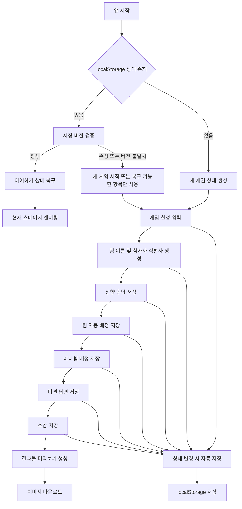

# 로컬 저장 데이터 설계

## 1. 문서 목적

이 문서는 팀빌딩 성경 미션 게임 웹앱의 MVP 구현을 위한 데이터 저장 구조와 데이터 플로우를 정의한다. `docs/requirement.md`, `docs/prd.md`, `docs/userflow.md`의 실제 요구사항을 기준으로 하며, 서버 데이터베이스는 사용하지 않는다.

## 2. 저장 방식 원칙

### 2.1 영속 DB 없음

MVP에서는 PostgreSQL, MySQL, Firebase, Supabase 같은 외부 영속 데이터베이스를 사용하지 않는다. 모든 데이터는 사용자의 브라우저 안에서만 관리한다.

- 회원가입 없음
- 로그인 없음
- 서버 저장 없음
- 실시간 동기화 없음
- 관리자 계정 없음
- 온라인 랭킹 없음

### 2.2 저장 계층

앱은 두 계층으로 데이터를 관리한다.

| 계층 | 역할 | 유지 범위 |
| --- | --- | --- |
| 메모리 상태 | 현재 화면 렌더링과 즉시 상호작용 처리 | 탭이 열려 있는 동안 |
| `localStorage` | 새로고침 복구와 이어하기를 위한 임시 저장 | 같은 브라우저에서 사용자가 삭제하기 전까지 |

### 2.3 개인정보 원칙

앱은 개인정보 전용 필드를 제공하지 않는다. 참가자는 실명 대신 참가자 번호 또는 별칭으로 식별한다.

저장하지 않는 데이터:

- 실명
- 전화번호
- 이메일
- 생년월일
- 주소
- 계정 정보
- 비밀번호

자유 입력란에는 사용자가 개인정보를 직접 입력할 가능성이 있으므로, 결과물 생성 전 검토 안내를 제공한다.

## 3. localStorage 키 설계

MVP에서는 저장 키를 단일 키 중심으로 관리한다.

| 키 | 용도 |
| --- | --- |
| `retreat-game:v1:state` | 현재 게임 전체 진행 상태 |

추후 확장이 필요한 경우 아래 키를 추가할 수 있다.

| 키 | 용도 |
| --- | --- |
| `retreat-game:v1:settings` | 사용자 기기별 표시 설정 |
| `retreat-game:v1:last-session` | 마지막 세션 요약 |

MVP에서는 상태 분산 저장보다 단일 상태 객체 저장을 우선한다. 단계 간 데이터 의존성이 많기 때문에 하나의 객체로 저장하면 복구와 초기화가 단순해진다.

## 4. 전체 데이터 플로우



## 5. 단계별 데이터 플로우

### 5.1 앱 시작 및 복구

1. 앱 시작 시 `retreat-game:v1:state`를 조회한다.
2. 저장 데이터가 없으면 새 게임 초기 상태를 만든다.
3. 저장 데이터가 있으면 JSON 파싱과 `schemaVersion`을 검증한다.
4. 검증에 성공하면 저장된 `currentRoute` 또는 `currentStage` 기준으로 이어서 진행한다.
5. 검증에 실패하면 새 게임 시작과 기존 데이터 삭제 흐름을 제공한다.

### 5.2 게임 설정

입력 데이터:

- 게임 제목
- 전체 참가 인원 수
- 팀 수
- 주제 키워드
- 대상 연령대 또는 난이도

처리 데이터:

- 팀별 목표 인원 수
- 기본 콘텐츠 세트 선택
- 스테이지 초기 상태

저장 결과:

- `game.config`
- `game.stage`
- `content.selectedSet`

### 5.3 팀 이름과 참가자 식별자

입력 데이터:

- 팀 이름
- 참가자 임시 이름 또는 번호

처리 데이터:

- 팀 수만큼 팀 객체 생성
- 참가 인원 수만큼 참가자 객체 생성
- 내부 식별자 생성

저장 결과:

- `teams`
- `participants`

### 5.4 성향 질문과 팀 자동 구성

입력 데이터:

- 참가자별 성향 질문 응답

처리 데이터:

- 성향 점수 계산
- 대표 성향과 보조 성향 산출
- 팀별 인원 균형 계산
- 성향이 분산되도록 팀 배정

저장 결과:

- `personalityResponses`
- `personalityResults`
- `teamAssignments`
- `stageProgress.stage1`

### 5.5 2단계 아이템 획득

입력 데이터:

- 팀 목록
- 기본 아이템 목록
- 아이템 배정 실행

처리 데이터:

- 팀별 랜덤 아이템 매칭
- 결과 공개 상태 계산

저장 결과:

- `itemAssignments`
- `itemRevealState`
- `stageProgress.stage2`

### 5.6 3단계 성경 협업 미션

입력 데이터:

- 팀별 선택형 답변
- 팀별 서술형 답변
- 아이템 사용 상태

처리 데이터:

- 선택형 정답 여부
- 서술형 입력 완료 여부
- 팀별 미션 완료 상태

저장 결과:

- `missionResponses.stage3`
- `usedItems`
- `stageProgress.stage3`

### 5.7 4단계 최종 미션

입력 데이터:

- 팀별 최종 답변
- 진행자 완료 확인
- 힌트 또는 도구 사용 여부

처리 데이터:

- 팀별 최종 미션 완료 상태
- 전체 4단계 완료 가능 여부

저장 결과:

- `missionResponses.stage4`
- `stageProgress.stage4`

### 5.8 팀별 소감과 결과물

입력 데이터:

- 기억에 남는 말씀 또는 키워드
- 팀이 함께 해결한 것
- 감사한 점
- 앞으로 실천하고 싶은 것

처리 데이터:

- 팀별 소감 검증
- 결과 카드 데이터 구성
- 이미지 파일명 생성

저장 결과:

- `reflections`
- `exportState`

## 6. localStorage 상태 스키마

아래 구조는 TypeScript 타입 기준의 권장 스키마다.

```ts
type GameStorageState = {
  schemaVersion: 1;
  appVersion?: string;
  savedAt: string;
  game: GameMeta;
  teams: Team[];
  participants: Participant[];
  personalityResponses: PersonalityResponse[];
  personalityResults: PersonalityResult[];
  teamAssignments: TeamAssignment[];
  itemAssignments: ItemAssignment[];
  itemRevealState: ItemRevealState;
  missionResponses: MissionResponses;
  usedItems: UsedItem[];
  reflections: Reflection[];
  exportState: ExportState;
};
```

## 7. 상세 스키마

### 7.1 GameMeta

```ts
type GameMeta = {
  sessionId: string;
  title: string;
  config: GameConfig;
  stage: StageState;
  content: ContentSelection;
};
```

```ts
type GameConfig = {
  participantCount: number;
  teamCount: number;
  topicKeyword: string;
  ageGroup: "elementary" | "middleHigh" | "youngAdult";
  difficulty: "easy" | "normal" | "hard";
};
```

MVP 기본값:

| 필드 | 기본값 |
| --- | --- |
| `title` | `수련회 팀빌딩 성경 미션 게임` |
| `topicKeyword` | `공동체` |
| `ageGroup` | `middleHigh` |
| `difficulty` | `normal` |

### 7.2 StageState

```ts
type StageState = {
  currentStage: 1 | 2 | 3 | 4 | "reflection" | "export";
  currentRoute:
    | "setup"
    | "team-names"
    | "personality"
    | "team-result"
    | "stage2"
    | "stage3"
    | "stage4"
    | "reflection"
    | "export";
  progress: StageProgress;
};
```

```ts
type StageProgress = {
  stage1: StageProgressItem;
  stage2: StageProgressItem;
  stage3: StageProgressItem;
  stage4: StageProgressItem;
};
```

```ts
type StageProgressItem = {
  status: "locked" | "active" | "completed";
  completedAt?: string;
};
```

### 7.3 ContentSelection

```ts
type ContentSelection = {
  contentSetId: string;
  topicKeyword: string;
  biblePassage?: string;
};
```

기본 콘텐츠 자체는 코드 또는 설정 파일에서 관리한다. `localStorage`에는 사용자가 선택하거나 진행 중 참조해야 하는 최소 식별자만 저장한다.

### 7.4 Team

```ts
type Team = {
  id: string;
  name: string;
  order: number;
};
```

저장 예시:

```json
{
  "id": "team_1",
  "name": "믿음팀",
  "order": 1
}
```

### 7.5 Participant

```ts
type Participant = {
  id: string;
  displayName: string;
  order: number;
};
```

`displayName`은 실명이 아니라 참가자 번호 또는 별칭을 전제로 한다. 예시는 `참가자 1`, `참가자 2`처럼 생성한다.

### 7.6 PersonalityResponse

```ts
type PersonalityResponse = {
  participantId: string;
  answers: PersonalityAnswer[];
  updatedAt: string;
};
```

```ts
type PersonalityAnswer = {
  questionId: string;
  score: 1 | 2 | 3 | 4 | 5;
};
```

### 7.7 PersonalityResult

```ts
type PersonalityResult = {
  participantId: string;
  scores: {
    idea: number;
    analysis: number;
    action: number;
    encouragement: number;
  };
  primaryType: PersonalityType;
  secondaryType?: PersonalityType;
};
```

```ts
type PersonalityType = "idea" | "analysis" | "action" | "encouragement";
```

화면 표시명:

| 값 | 표시명 |
| --- | --- |
| `idea` | 아이디어형 |
| `analysis` | 분석형 |
| `action` | 실행형 |
| `encouragement` | 격려형 |

### 7.8 TeamAssignment

```ts
type TeamAssignment = {
  teamId: string;
  participantIds: string[];
  distribution: Record<PersonalityType, number>;
  confirmedAt?: string;
};
```

팀 배정 결과는 참가자 객체에 직접 저장하지 않고 별도 배열로 관리한다. 성향 응답 수정 후 팀 배정을 다시 생성하기 쉽도록 하기 위함이다.

### 7.9 ItemAssignment

```ts
type ItemAssignment = {
  teamId: string;
  itemId: string;
  assignedAt: string;
};
```

```ts
type ItemRevealState = {
  mode: "all" | "sequence";
  revealedTeamIds: string[];
  finalized: boolean;
};
```

아이템 상세 콘텐츠는 기본 콘텐츠 설정 파일에 둔다. `localStorage`에는 팀과 아이템의 연결 결과만 저장한다.

### 7.10 MissionResponses

```ts
type MissionResponses = {
  stage3: Stage3MissionResponse[];
  stage4: Stage4MissionResponse[];
};
```

```ts
type Stage3MissionResponse = {
  teamId: string;
  missionId: string;
  answer: string | string[];
  isCorrect?: boolean;
  isCompleted: boolean;
  updatedAt: string;
};
```

```ts
type Stage4MissionResponse = {
  teamId: string;
  finalAnswer: string;
  facilitatorConfirmed: boolean;
  isCompleted: boolean;
  updatedAt: string;
};
```

선택형 문제는 `isCorrect`를 사용할 수 있다. 서술형 문제나 선언문형 미션은 `isCompleted`와 `facilitatorConfirmed`를 중심으로 판단한다.

### 7.11 UsedItem

```ts
type UsedItem = {
  teamId: string;
  itemId: string;
  stage: 3 | 4;
  missionId?: string;
  usedAt: string;
};
```

아이템 중복 사용 제한이 필요한 경우 `teamId + itemId` 조합으로 사용 여부를 확인한다.

### 7.12 Reflection

```ts
type Reflection = {
  teamId: string;
  memorableWord: string;
  solvedTogether: string;
  thankfulPoint: string;
  actionCommitment: string;
  updatedAt: string;
};
```

소감 필드는 결과물 이미지에 표시되므로 각 필드는 화면과 이미지 레이아웃에서 길이 제한 또는 줄바꿈 처리가 필요하다.

### 7.13 ExportState

```ts
type ExportState = {
  previewReady: boolean;
  selectedTeamIds: string[];
  lastDownloadedAt?: string;
  lastError?: string;
};
```

다운로드 결과 파일 자체는 `localStorage`에 저장하지 않는다. 미리보기와 다운로드에 필요한 원본 데이터만 상태에서 조합한다.

## 8. 기본 콘텐츠 데이터와 저장 데이터의 분리

기본 콘텐츠는 앱 코드 또는 별도 설정 파일에서 관리한다.

저장하지 않고 코드에 두는 데이터:

- 성향 질문 5개
- 성향 질문별 점수 매핑
- 2단계 기본 아이템 6개
- 3단계 성경 협업 퀴즈 5개
- 4단계 최종 미션 1개
- 기본 주제와 대상 연령대

`localStorage`에 저장하는 데이터:

- 사용자가 입력한 설정값
- 사용자가 입력한 팀 이름
- 참가자 식별자
- 질문 응답
- 자동 배정 결과
- 아이템 배정 결과
- 미션 답변
- 소감
- 진행 상태

이 분리를 유지하면 추후 관리자용 콘텐츠 편집 화면이나 서버 저장 기능을 추가하더라도 MVP 데이터 구조를 크게 바꾸지 않아도 된다.

## 9. 저장 시점

상태 변경이 발생한 뒤 검증 가능한 단위마다 저장한다.

| 흐름 | 저장 시점 |
| --- | --- |
| 게임 설정 | 설정 유효성 통과 후 다음 단계 이동 시 |
| 팀 이름 | 팀 이름이 모두 유효해진 뒤 다음 단계 이동 시 |
| 참가자 식별자 | 자동 생성 또는 수정 완료 시 |
| 성향 응답 | 참가자별 응답 변경 시 |
| 팀 배정 | 자동 배정 생성 또는 확정 시 |
| 스테이지 이동 | 현재 단계 완료 후 다음 단계 이동 시 |
| 아이템 배정 | 배정 결과 확정 시 |
| 미션 답변 | 팀별 답변 입력 또는 제출 시 |
| 아이템 사용 | 사용 실행 시 |
| 소감 | 팀별 소감 저장 시 |
| 다운로드 | 다운로드 시도 결과 업데이트 시 |

## 10. 복구 및 초기화 정책

### 10.1 정상 복구

저장 데이터가 정상인 경우:

1. `schemaVersion`을 확인한다.
2. 필수 최상위 필드를 확인한다.
3. 저장된 `currentRoute`로 이동한다.
4. 완료된 스테이지와 입력 데이터를 화면에 복원한다.

### 10.2 손상 데이터

JSON 파싱 실패, 필수 필드 누락, 버전 불일치가 발생하면 다음 중 하나를 제공한다.

- 새 게임 시작
- 저장 데이터 삭제
- 복구 가능한 항목만 사용

MVP에서는 구현 복잡도를 줄이기 위해 새 게임 시작과 저장 데이터 삭제를 우선한다.

### 10.3 새 게임 시작

새 게임 시작 시 기존 `retreat-game:v1:state`를 삭제하거나 새 초기 상태로 덮어쓴다. 같은 기기에서 이전 행사 데이터가 노출되지 않도록 사용자에게 초기화 여부를 확인한다.

## 11. 검증 규칙

### 11.1 게임 설정

- `participantCount`는 1 이상이어야 한다.
- `teamCount`는 2 이상이어야 한다.
- `teamCount`는 `participantCount`보다 클 수 없다.
- MVP 기본 팀 수 범위는 2~6팀이다.

### 11.2 팀

- 팀 이름은 비어 있을 수 없다.
- 팀 이름은 중복될 수 없다.
- 팀 이름은 결과물 표시 영역에 맞게 길이 제한을 둔다.

### 11.3 참가자

- 참가자 수는 `participantCount`와 일치해야 한다.
- 내부 `id`는 중복될 수 없다.
- 표시명은 비어 있으면 자동 생성값을 사용한다.

### 11.4 성향 응답

- 모든 참가자가 필수 질문에 답해야 팀 배정을 실행할 수 있다.
- 응답값은 허용된 점수 범위 안에 있어야 한다.

### 11.5 팀 배정

- 모든 참가자는 정확히 하나의 팀에 배정되어야 한다.
- 빈 팀은 허용하지 않는다.
- 팀별 인원 차이는 가능한 한 1명 이하로 유지한다.

### 11.6 미션과 소감

- 팀별 필수 답변이 비어 있으면 해당 단계 완료로 처리하지 않는다.
- 서술형 답변과 소감은 저장 가능 길이와 결과물 표시 길이를 분리해 관리한다.
- 결과물 생성 전 누락된 팀 소감이 있으면 다운로드를 제한한다.

## 12. 동시성 및 브라우저 제약

MVP는 한 기기에서 진행자가 조작하는 흐름을 우선한다. 여러 탭에서 같은 게임을 동시에 열면 마지막 저장 상태가 우선될 수 있다.

고려 사항:

- 저장 시 `savedAt`을 갱신한다.
- 앱 활성화 시 저장된 `savedAt`이 현재 메모리 상태보다 최신인지 확인할 수 있다.
- 여러 탭 충돌 해결은 MVP 필수 기능이 아니다.
- 비공개 브라우징 환경에서는 `localStorage`가 유지되지 않을 수 있다.
- 저장 용량 초과 시 현재 세션 상태는 유지하고 저장 실패 상태를 표시한다.

## 13. 보안 및 데이터 삭제

브라우저 로컬 저장은 서버 저장보다 단순하지만, 같은 기기를 다른 사람이 사용할 경우 이전 행사 데이터가 보일 수 있다. 따라서 앱에는 저장 데이터 삭제 흐름이 필요하다.

필수 동작:

- 새 게임 시작 시 기존 데이터 초기화 확인
- 저장된 게임 삭제 버튼 제공
- 결과물 생성 전 개인정보 입력 주의 안내

## 14. MVP 이후 확장 고려

MVP 이후 서버 저장이나 관리자 화면을 추가하더라도 현재 스키마는 다음 방식으로 확장할 수 있다.

- `sessionId`를 서버 세션 식별자로 확장
- `Team`, `Participant`, `MissionResponses`, `Reflection`을 서버 리소스로 분리
- 기본 콘텐츠 설정을 관리자 편집 데이터로 전환
- 이미지 다운로드 외 PDF 다운로드 상태를 `exportState`에 추가

단, MVP 단계에서는 위 확장을 구현하지 않는다.
