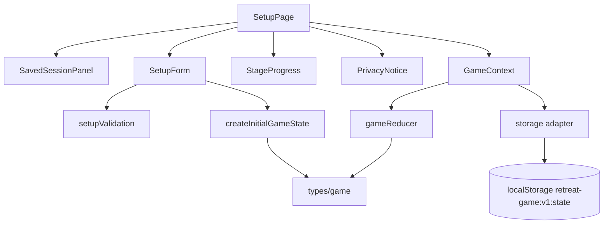

# 시작/설정 페이지 구현 계획

## 개요

이 문서는 `docs/requirement.md`, `docs/prd.md`, `docs/userflow.md`, `docs/database.md`, `docs/usecases/001-game-setup/spec.md`를 기준으로 시작/설정 페이지를 구현하기 위한 계획이다. 아직 코드베이스가 없으므로 `Vite + React + TypeScript`, `Context + useReducer`, `localStorage` MVP 구조를 전제로 한다.

목표는 진행자가 로그인 없이 새 게임을 시작하거나 저장된 게임을 이어가고, 전체 참가 인원 수, 팀 수, 게임 제목, 주제 키워드를 입력해 다음 페이지인 팀 이름 및 참가자 준비 흐름으로 이동 가능한 상태를 만드는 것이다.

### 구현 대상 모듈

| 모듈 | 예상 위치 | 설명 |
| --- | --- | --- |
| 설정 페이지 | `src/pages/SetupPage.tsx` | 시작 화면, 이어하기/새 게임, 설정 폼, 오류 표시, 다음 이동을 담당한다. |
| 설정 폼 컴포넌트 | `src/features/setup/SetupForm.tsx` | 제목, 참가 인원, 팀 수, 주제 키워드 입력 UI를 담당한다. |
| 저장 상태 선택 컴포넌트 | `src/features/setup/SavedSessionPanel.tsx` | 유효한 저장 상태가 있을 때 이어하기/새 게임 선택을 제공한다. |
| 개인정보 안내 컴포넌트 | `src/components/PrivacyNotice.tsx` | 개인정보 미수집 원칙과 별칭 사용 안내를 재사용 UI로 제공한다. |
| 진행 표시 컴포넌트 | `src/components/StageProgress.tsx` | 4단계 진행 상태를 표시한다. 설정 화면에서는 전체 단계 안내만 보여준다. |
| 게임 상태 Context | `src/store/GameContext.tsx` | `useReducer` 상태, 액션 디스패치, 자동 저장 흐름을 제공한다. |
| 게임 리듀서 | `src/store/gameReducer.ts` | 설정 변경, 새 게임 생성, 이어하기, 저장 오류 액션을 처리한다. |
| 타입 정의 | `src/types/game.ts` | `GameStorageState`, `GameConfig`, `StageState` 등 공통 타입을 정의한다. |
| 설정 검증 | `src/features/setup/setupValidation.ts` | 참가 인원 수, 팀 수, 기본값 적용 검증을 독립 함수로 제공한다. |
| 초기 상태 생성 | `src/store/createInitialGameState.ts` | 검증된 설정을 받아 스키마 버전 1의 초기 게임 상태를 만든다. |
| 로컬 저장소 어댑터 | `src/lib/storage.ts` | `retreat-game:v1:state` 읽기/쓰기/삭제와 파싱 오류 처리를 담당한다. |

## 관련 유스케이스

- `UC-001 게임 시작 및 기본 설정`
- 후행 유스케이스: `UC-002 팀 이름 및 참가자 식별자 준비`
- 연관 흐름: 임시 저장 및 복구, 스테이지 진행 표시, 개인정보 비수집 흐름

## 상태/입력/검증

### 페이지 입력

| 입력 | 필수 | 기본값 | 저장 위치 | 비고 |
| --- | --- | --- | --- | --- |
| 게임 제목 | 선택 | `수련회 팀빌딩 성경 미션 게임` | `game.title` | 결과물에도 사용된다. |
| 전체 참가 인원 수 | 필수 | 없음 | `game.config.participantCount` | 1 이상이어야 한다. |
| 팀 수 | 필수 | 없음 | `game.config.teamCount` | 2~6팀, 참가 인원 수 이하. |
| 주제 키워드 | 선택 | `공동체` | `game.config.topicKeyword`, `game.content.topicKeyword` | 미입력 시 기본값 적용. |
| 연령대 | MVP 내부값 | `middleHigh` | `game.config.ageGroup` | UI 노출은 선택 사항이다. |
| 난이도 | MVP 내부값 | `normal` | `game.config.difficulty` | UI 노출은 선택 사항이다. |

### 상태 데이터

| 상태 | 타입 | 변경 조건 | 화면 반영 |
| --- | --- | --- | --- |
| `setupDraft` | `SetupDraft` | 입력값 변경 | 입력 필드와 검증 메시지 갱신 |
| `validationErrors` | `Record<string, string>` | 다음 클릭 또는 입력값 변경 | 필드별 오류 표시 |
| `savedSessionStatus` | `"none" \| "valid" \| "invalid"` | 앱 시작 시 localStorage 확인 | 이어하기 패널 또는 손상 안내 표시 |
| `storageWarning` | `string | undefined` | 저장 실패 | 새로고침 복구 불가 안내 |
| `game.stage.currentRoute` | `"setup" \| "team-names"` | 설정 저장 성공 | 팀 이름 페이지로 이동 |

`setupDraft`는 페이지 로컬 상태로 둘 수 있다. 검증된 값만 `GameContext`에 저장한다. 이렇게 하면 유효하지 않은 설정이 전역 상태와 `localStorage`에 확정 저장되지 않는다.

### 검증 규칙

| 코드 | 조건 | 처리 | 메시지 |
| --- | --- | --- | --- |
| `INVALID_PARTICIPANT_COUNT` | 참가 인원 수가 비어 있거나 1 미만 또는 숫자가 아님 | 다음 이동 차단 | `전체 참가 인원 수를 1명 이상으로 입력해 주세요.` |
| `INVALID_TEAM_COUNT` | 팀 수가 2 미만, 6 초과, 참가 인원 수 초과 | 다음 이동 차단 | `팀 수는 2~6팀 사이이며 참가 인원 수보다 많을 수 없습니다.` |
| `INVALID_SAVED_STATE` | 저장 JSON 파싱 실패, 스키마 버전 불일치, 필수 필드 누락 | 이어하기 제한 | `저장된 진행 상태를 불러올 수 없습니다. 새 게임을 시작해 주세요.` |
| `LOCAL_STORAGE_SAVE_FAILED` | localStorage 쓰기 실패 | 메모리 상태로 계속 진행 | `현재 진행은 계속할 수 있지만 새로고침 후 복구되지 않을 수 있습니다.` |

### 리듀서 액션

| 액션 | payload | 처리 |
| --- | --- | --- |
| `RESTORE_SAVED_STATE` | `GameStorageState` | 저장 상태를 전역 상태로 복구하고 `currentRoute` 기준 화면을 보여준다. |
| `START_NEW_GAME` | `GameConfigInput` | 기존 상태를 초기화하고 새 `GameStorageState`를 생성한다. |
| `SET_ROUTE` | `{ route: "team-names" }` | 설정 완료 후 팀 이름 페이지로 이동한다. |
| `SET_STORAGE_ERROR` | `{ message: string }` | 저장 실패 안내를 상태에 남긴다. |
| `DELETE_SAVED_STATE` | 없음 | localStorage 키를 삭제하고 새 설정 입력 상태로 전환한다. |

## 컴포넌트 계획

### `SetupPage`

- 앱 시작 시 `storage.loadGameState()` 결과를 확인한다.
- 유효한 저장 상태가 있으면 `SavedSessionPanel`을 먼저 보여준다.
- 새 게임 시작 선택 시 설정 폼을 보여준다.
- 설정 완료 시 `validateSetupInput`을 실행하고, 성공하면 `createInitialGameState`로 초기 상태를 만든다.
- 저장 성공 여부와 관계없이 메모리 상태는 갱신한다. 저장 실패 시 안내만 표시한다.

### `SavedSessionPanel`

- 유효한 저장 상태가 있을 때 `이어하기`, `새 게임 시작`, `저장 데이터 삭제` 액션을 제공한다.
- 손상 상태이면 이어하기 버튼은 제공하지 않고 새 게임 시작 또는 삭제만 제공한다.
- 새 게임 시작은 기존 데이터가 덮어써질 수 있음을 확인한 뒤 진행한다.

### `SetupForm`

- 숫자 입력은 모바일에서 조작하기 쉽게 `inputMode="numeric"`을 사용한다.
- 팀 수는 MVP 범위인 2~6을 명확히 제한한다.
- 주제 키워드 미입력 시 `공동체`가 적용됨을 짧게 표시한다.
- 제출 전 입력 문자열을 숫자로 파싱하고, 공백 제목/주제는 기본값으로 치환한다.

### `StageProgress`

- 4단계 스테이지를 표시한다.
- 설정 페이지에서는 아직 Stage 1이 시작 전임을 보여준다.
- 색상만으로 상태를 구분하지 않고 텍스트 상태도 함께 표시한다.

## Mermaid 모듈 관계도

## 구현 계획

1. `src/types/game.ts`에 `GameStorageState`, `GameMeta`, `GameConfig`, `StageState`, `StageProgress`, `ContentSelection` 타입을 먼저 정의한다.
2. `src/lib/storage.ts`에 단일 키 `retreat-game:v1:state` 기반 `loadGameState`, `saveGameState`, `deleteGameState`를 만든다.
3. `src/features/setup/setupValidation.ts`에 `validateSetupInput`과 `normalizeSetupInput`을 만든다.
4. `src/store/createInitialGameState.ts`에서 `schemaVersion: 1`, `savedAt`, `sessionId`, `stage.currentRoute: "team-names"`를 포함한 초기 상태를 생성한다.
5. `src/store/gameReducer.ts`에서 새 게임, 복구, 경로 이동, 저장 오류 액션을 처리한다.
6. `src/store/GameContext.tsx`에서 reducer와 localStorage 저장 side effect를 연결한다.
7. `src/features/setup/SetupForm.tsx`와 `SavedSessionPanel.tsx`를 구현한다.
8. `src/pages/SetupPage.tsx`에서 저장 상태 확인, 폼 제출, 이어하기 흐름을 연결한다.

## 테스트/QA 체크

### 단위 테스트

- `validateSetupInput({ participantCount: 12, teamCount: 4 })`는 성공해야 한다.
- 참가자 0명은 `INVALID_PARTICIPANT_COUNT`를 반환해야 한다.
- 참가자 3명, 팀 4개는 `INVALID_TEAM_COUNT`를 반환해야 한다.
- 팀 수 1개 또는 7개는 `INVALID_TEAM_COUNT`를 반환해야 한다.
- 주제 키워드가 공백이면 `공동체`로 정규화되어야 한다.
- `createInitialGameState`는 `schemaVersion: 1`, `currentRoute: "team-names"`, `stage1.active`, `stage2.locked`, `stage3.locked`, `stage4.locked`를 생성해야 한다.

### 화면 QA

- 모바일 폭에서 숫자 입력, 팀 수 입력, 다음 버튼이 한 손 조작 가능한 크기인지 확인한다.
- 저장 상태가 있으면 이어하기와 새 게임 시작 선택지가 보이는지 확인한다.
- 손상된 저장 데이터가 있으면 이어하기가 제한되는지 확인한다.
- localStorage 저장 실패를 강제로 발생시켜도 현재 세션에서 다음 화면으로 이동 가능한지 확인한다.
- 개인정보를 요구하는 입력 필드가 없는지 확인한다.
- 색상 없이도 현재 진행 상태를 텍스트로 이해할 수 있는지 확인한다.
