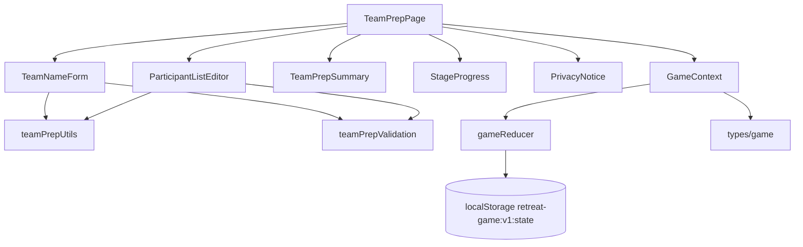

# 팀 이름 및 참가자 준비 페이지 구현 계획

## 개요

이 문서는 `docs/requirement.md`, `docs/prd.md`, `docs/userflow.md`, `docs/database.md`, `docs/usecases/002-team-names-participants/spec.md`를 기준으로 팀 이름 및 참가자 식별자 준비 페이지를 구현하기 위한 계획이다. 기술 전제는 `Vite + React + TypeScript`, `Context + useReducer`, `localStorage` MVP이다.

목표는 UC-001에서 저장된 `participantCount`, `teamCount`를 기준으로 팀 이름과 참가자 식별자를 준비하고, 1단계 성향 질문을 진행할 수 있는 상태로 저장한 뒤 `personality` 경로로 이동하는 것이다.

### 구현 대상 모듈

| 모듈 | 예상 위치 | 설명 |
| --- | --- | --- |
| 팀 준비 페이지 | `src/pages/TeamPrepPage.tsx` | 팀 이름 입력, 참가자 식별자 확인, 다음 이동을 담당한다. |
| 팀 이름 폼 | `src/features/teamPrep/TeamNameForm.tsx` | 팀 수만큼 입력칸을 렌더링하고 자동 생성 버튼을 제공한다. |
| 참가자 식별자 목록 | `src/features/teamPrep/ParticipantListEditor.tsx` | 참가자 번호 자동 생성 목록과 별칭 수정을 제공한다. |
| 팀/참가자 요약 | `src/features/teamPrep/TeamPrepSummary.tsx` | 현재 팀 수, 참가자 수, 다음 단계 준비 상태를 요약한다. |
| 개인정보 안내 | `src/components/PrivacyNotice.tsx` | 실명, 전화번호, 이메일 대신 팀명/별칭 사용 안내를 표시한다. |
| 진행 표시 | `src/components/StageProgress.tsx` | Stage 1 준비 상태를 보여준다. |
| 팀 준비 유틸 | `src/features/teamPrep/teamPrepUtils.ts` | 기본 팀 이름, 참가자 ID, 표시명 생성을 담당한다. |
| 팀 준비 검증 | `src/features/teamPrep/teamPrepValidation.ts` | 팀 이름 누락, 중복, 길이, 참가자 수 불일치를 검증한다. |
| 게임 리듀서 | `src/store/gameReducer.ts` | 팀/참가자 저장과 경로 이동 액션을 처리한다. |

## 관련 유스케이스

- 선행 유스케이스: `UC-001 게임 시작 및 기본 설정`
- 대상 유스케이스: `UC-002 팀 이름 및 참가자 식별자 준비`
- 후행 유스케이스: `UC-003 성향 질문 기반 팀 자동 구성`
- 연관 흐름: 개인정보 비수집, 임시 저장 및 복구

## 상태/입력/검증

### 페이지 입력

| 입력 | 필수 | 기본값 | 저장 위치 | 비고 |
| --- | --- | --- | --- | --- |
| 팀 이름 | 필수 | 자동 생성 가능 | `teams[].name` | 중복 불가, 공백 불가 |
| 참가자 표시명 | 선택 | `참가자 1` ~ `참가자 N` | `participants[].displayName` | 내부 ID는 별도 유지 |

### 상태 데이터

| 상태 | 타입 | 변경 조건 | 화면 반영 |
| --- | --- | --- | --- |
| `teamDrafts` | `{ id: string; name: string; order: number }[]` | 팀 이름 입력, 자동 생성 | 팀 이름 필드와 오류 표시 갱신 |
| `participantDrafts` | `{ id: string; displayName: string; order: number }[]` | 참가자 자동 생성, 별칭 수정 | 참가자 목록 갱신 |
| `validationErrors` | `Record<string, string>` | 다음 클릭 또는 입력 변경 | 누락/중복 오류 표시 |
| `game.teams` | `Team[]` | 유효성 통과 후 저장 | 다음 페이지에서 참조 |
| `game.participants` | `Participant[]` | 유효성 통과 후 저장 | 성향 질문 대상 목록 |
| `game.stage.currentRoute` | `"team-names" \| "personality"` | 저장 성공 후 이동 | 1단계 성향 질문 화면으로 전환 |

`teamDrafts`와 `participantDrafts`는 페이지 로컬 상태로 시작한다. 기존 저장 상태가 있으면 전역 상태의 `teams`, `participants`에서 초기화하고, 개수가 설정값과 다르면 설정값 기준으로 보정한다.

### 검증 규칙

| 코드 | 조건 | 처리 | 메시지 |
| --- | --- | --- | --- |
| `TEAM_NAME_REQUIRED` | 하나 이상의 팀 이름이 비어 있거나 공백만 포함 | 다음 이동 차단 | `모든 팀 이름을 입력해 주세요.` |
| `DUPLICATE_TEAM_NAME` | 공백 제거 후 같은 팀 이름이 둘 이상 존재 | 다음 이동 차단 | `팀 이름은 서로 다르게 입력해 주세요.` |
| `TEAM_NAME_TOO_LONG` | 팀 이름이 표시 제한보다 김 | 다음 이동 차단 또는 안내 | `팀 이름은 결과물에 표시될 수 있도록 짧게 입력해 주세요.` |
| `PARTICIPANT_COUNT_MISMATCH` | 참가자 목록 길이가 `participantCount`와 다름 | 자동 보정 후 안내 | `참가자 목록을 전체 인원 수에 맞게 다시 준비했습니다.` |
| `PRIVACY_REVIEW_RECOMMENDED` | 실명/연락처로 보이는 패턴이 입력됨 | 진행은 가능하되 안내 표시 | `실명, 전화번호, 이메일 대신 팀 이름이나 별칭을 사용해 주세요.` |

### 리듀서 액션

| 액션 | payload | 처리 |
| --- | --- | --- |
| `UPSERT_TEAMS_AND_PARTICIPANTS` | `{ teams: Team[]; participants: Participant[] }` | 전역 상태의 팀/참가자 목록을 갱신한다. |
| `SET_ROUTE` | `{ route: "personality" }` | 다음 경로를 성향 질문으로 전환한다. |
| `RESET_PERSONALITY_DEPENDENTS` | 없음 | 팀/참가자 변경 시 기존 성향 응답, 결과, 팀 배정을 초기화한다. |
| `SET_STORAGE_ERROR` | `{ message: string }` | 저장 실패 안내를 남긴다. |

팀 또는 참가자 구성이 변경되면 이후 단계 데이터가 무효화될 수 있으므로, 이 페이지 저장 시 `personalityResponses`, `personalityResults`, `teamAssignments`는 비우는 것이 안전하다.

## 컴포넌트 계획

### `TeamPrepPage`

- UC-001 완료 상태와 `game.config.participantCount`, `game.config.teamCount` 존재를 확인한다.
- 설정이 없거나 유효하지 않으면 설정 페이지로 돌아가도록 안내한다.
- 기존 저장된 팀/참가자 데이터가 있으면 설정값에 맞춰 복원한다.
- 다음 버튼 클릭 시 검증 후 `UPSERT_TEAMS_AND_PARTICIPANTS`, `RESET_PERSONALITY_DEPENDENTS`, `SET_ROUTE("personality")`를 실행한다.

### `TeamNameForm`

- `teamCount`만큼 입력 필드를 렌더링한다.
- 자동 생성 버튼은 `믿음팀`, `소망팀`, `사랑팀`, `기쁨팀`, `은혜팀`, `섬김팀`처럼 중복 없는 기본 이름을 순서대로 적용한다.
- 입력값은 앞뒤 공백을 제거해 검증하되, 입력 중에는 사용자가 편집하기 쉽게 원문을 유지한다.
- 오류는 필드 가까이에 표시한다.

### `ParticipantListEditor`

- `participantCount`만큼 `참가자 1`부터 자동 표시명을 만든다.
- 별칭 수정은 선택 기능으로 제공한다.
- 표시명이 비어 있으면 저장 시 자동 표시명으로 대체한다.
- 내부 ID는 `participant_1`, `participant_2`처럼 표시명과 분리한다.

### `TeamPrepSummary`

- 현재 팀 수와 참가자 수를 요약한다.
- 팀별 예상 인원 범위를 보여준다. 예: 10명/3팀이면 `3~4명`.
- 모든 팀 이름이 유효할 때 다음 단계 가능 상태를 표시한다.

## Mermaid 모듈 관계도

## 구현 계획

1. `src/features/teamPrep/teamPrepUtils.ts`에 `createDefaultTeams(teamCount)`, `createDefaultParticipants(participantCount)`, `reconcileParticipants(existing, participantCount)`를 만든다.
2. `src/features/teamPrep/teamPrepValidation.ts`에 `validateTeams`, `validateParticipantCount`, `hasPrivacyRiskPattern`을 만든다.
3. `src/store/gameReducer.ts`에 팀/참가자 저장 액션과 성향 의존 데이터 초기화 액션을 추가한다.
4. `src/features/teamPrep/TeamNameForm.tsx`를 구현한다.
5. `src/features/teamPrep/ParticipantListEditor.tsx`를 구현한다.
6. `src/features/teamPrep/TeamPrepSummary.tsx`를 구현한다.
7. `src/pages/TeamPrepPage.tsx`에서 설정값 읽기, 초깃값 생성, 검증, 저장, 경로 이동을 연결한다.

## 테스트/QA 체크

### 단위 테스트

- `createDefaultTeams(4)`는 중복 없는 4개 팀을 생성해야 한다.
- `createDefaultParticipants(12)`는 내부 ID가 중복되지 않는 12명을 생성해야 한다.
- 팀 이름 하나가 공백이면 `TEAM_NAME_REQUIRED`를 반환해야 한다.
- 같은 팀 이름이 두 개 있으면 `DUPLICATE_TEAM_NAME`을 반환해야 한다.
- 참가자 목록 10명인데 설정값이 12명이면 `reconcileParticipants`가 12명으로 보정해야 한다.
- 팀/참가자 저장 액션 후 `teams.length === teamCount`, `participants.length === participantCount`여야 한다.
- 팀/참가자 변경 시 `personalityResponses`, `personalityResults`, `teamAssignments`가 초기화되어야 한다.

### 화면 QA

- 2~6팀 범위에서 팀 이름 입력칸 개수가 정확한지 확인한다.
- 자동 생성 버튼이 기존 빈 칸을 채우고 중복 이름을 만들지 않는지 확인한다.
- 참가자 별칭을 입력하지 않아도 `참가자 N` 표시명으로 다음 단계 이동 가능한지 확인한다.
- 중복 팀 이름 입력 시 다음 단계 이동이 차단되는지 확인한다.
- 실명/연락처로 보이는 값을 입력했을 때 개인정보 안내가 표시되는지 확인한다.
- 모바일 폭에서 참가자 목록이 너무 길어져도 입력과 다음 버튼이 사용 가능한지 확인한다.
- localStorage 저장 실패 시에도 현재 세션에서 성향 질문 화면으로 이동 가능한지 확인한다.
