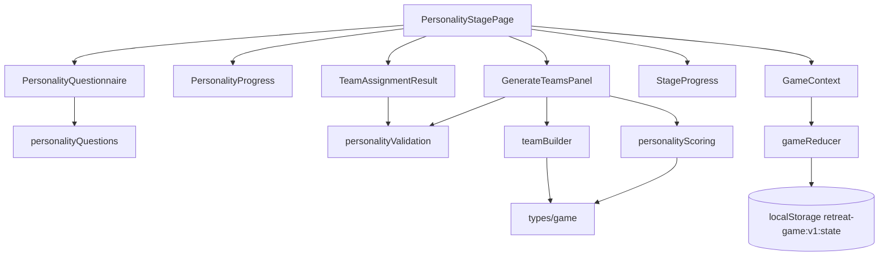

# 1단계 성향 질문 및 팀 구성 페이지 구현 계획

## 개요

이 문서는 `docs/requirement.md`, `docs/prd.md`, `docs/userflow.md`, `docs/database.md`, `docs/usecases/003-personality-team-building/spec.md`를 기준으로 1단계 성향 질문 및 팀 구성 결과 페이지를 구현하기 위한 계획이다. 기술 전제는 `Vite + React + TypeScript`, `Context + useReducer`, `localStorage` MVP이다.

목표는 참가자별 간이 성향 질문 5개 응답을 수집하고, 아이디어형/분석형/실행형/격려형 점수를 계산한 뒤, 팀별 인원과 성향이 최대한 균형을 이루도록 자동 배정 결과를 생성하고 확정하는 것이다.

### 구현 대상 모듈

| 모듈 | 예상 위치 | 설명 |
| --- | --- | --- |
| 성향 스테이지 페이지 | `src/pages/PersonalityStagePage.tsx` | 질문 입력 모드와 팀 결과 모드를 전환하며 1단계 전체 흐름을 담당한다. |
| 성향 질문 폼 | `src/features/personality/PersonalityQuestionnaire.tsx` | 참가자별 5개 질문 응답 UI를 제공한다. |
| 응답 진행률 | `src/features/personality/PersonalityProgress.tsx` | 참가자별 응답 완료 상태와 전체 진행률을 표시한다. |
| 팀 생성 버튼 영역 | `src/features/personality/GenerateTeamsPanel.tsx` | 누락 검증, 팀 자동 구성 실행, 재생성 안내를 담당한다. |
| 팀 결과 화면 | `src/features/personality/TeamAssignmentResult.tsx` | 팀별 참가자 목록과 성향 분포를 표시한다. |
| 성향 콘텐츠 | `src/content/personalityQuestions.ts` | 기본 성향 질문 5개와 점수 매핑을 코드 데이터로 분리한다. |
| 성향 계산 로직 | `src/features/personality/personalityScoring.ts` | 응답을 성향 점수와 대표/보조 성향으로 변환한다. |
| 팀 배정 로직 | `src/features/personality/teamBuilder.ts` | 인원 균형과 성향 분산을 고려해 팀을 자동 배정한다. |
| 성향 검증 | `src/features/personality/personalityValidation.ts` | 응답 누락, 팀/참가자 데이터 존재 여부, 빈 팀 검증을 담당한다. |
| 게임 리듀서 | `src/store/gameReducer.ts` | 성향 응답 저장, 결과 저장, 팀 배정 확정, Stage 1 완료 액션을 처리한다. |

## 관련 유스케이스

- 선행 유스케이스: `UC-001 게임 시작 및 기본 설정`, `UC-002 팀 이름 및 참가자 식별자 준비`
- 대상 유스케이스: `UC-003 성향 질문 기반 팀 자동 구성`
- 후행 유스케이스: 2단계 주제 키워드 확인 및 아이템 획득
- 연관 흐름: 스테이지 진행 표시, 임시 저장 및 복구, 개인정보 비수집

## 상태/입력/검증

### 페이지 입력

| 입력 | 필수 | 저장 위치 | 비고 |
| --- | --- | --- | --- |
| 참가자별 질문 응답 | 필수 | `personalityResponses[]` | 각 질문 점수는 1~5 |
| 팀 자동 구성 실행 | 필수 | `personalityResults[]`, `teamAssignments[]` | 모든 응답 완료 후 가능 |
| 팀 구성 확정 | 필수 | `stageProgress.stage1` | 확정 후 2단계 이동 가능 |

### 상태 데이터

| 상태 | 타입 | 변경 조건 | 화면 반영 |
| --- | --- | --- | --- |
| `personalityResponses` | `PersonalityResponse[]` | 질문 응답 입력/수정 | 참가자별 완료 상태 갱신 |
| `personalityResults` | `PersonalityResult[]` | 점수 계산 실행 | 대표 성향 표시와 팀 배정 입력값 |
| `teamAssignments` | `TeamAssignment[]` | 팀 자동 구성 실행 | 팀 결과 화면 표시 |
| `assignmentStatus` | `"idle" \| "dirty" \| "generated" \| "confirmed"` | 응답 수정, 생성, 확정 | 재생성 필요/확정 가능 상태 표시 |
| `stageProgress.stage1.status` | `"active" \| "completed"` | 팀 구성 확정 | 진행 표시 갱신 |
| `game.stage.currentRoute` | `"personality" \| "team-result" \| "stage2"` | 결과 생성/확정 | 화면 모드 또는 다음 스테이지 전환 |

응답 수정 후 기존 `teamAssignments`가 있으면 `assignmentStatus`를 `dirty`로 바꾸고 재생성을 요구한다. 오래된 배정 결과를 확정하지 않도록 한다.

### 성향 질문 데이터

MVP 기본 질문은 코드 데이터로 둔다. 각 질문은 특정 성향에 가중치를 주는 방식으로 계산한다.

| 질문 ID | 표시 질문 | 연결 성향 |
| --- | --- | --- |
| `q1` | 새로운 활동을 시작할 때 나는 먼저 아이디어를 내는 편이다. | `idea` |
| `q2` | 문제를 풀 때 나는 조용히 정리하고 분석하는 편이다. | `analysis` |
| `q3` | 팀 활동에서 나는 사람들을 격려하는 역할을 자주 한다. | `encouragement` |
| `q4` | 시간이 부족할 때 나는 빠르게 결정하고 실행하는 편이다. | `action` |
| `q5` | 모르는 내용이 나오면 나는 질문을 많이 하는 편이다. | `idea` 또는 보조 점수 |

점수는 1~5 선택값을 사용한다. 전문 성향검사가 아니라 간이 팀빌딩 질문임을 화면에 안내한다.

### 검증 규칙

| 코드 | 조건 | 처리 | 메시지 |
| --- | --- | --- | --- |
| `PERSONALITY_RESPONSE_INCOMPLETE` | 한 명 이상의 참가자가 5문항을 모두 답하지 않음 | 팀 자동 구성 차단 | `모든 참가자의 성향 질문 응답을 완료해 주세요.` |
| `TEAM_BUILDING_SOURCE_DATA_MISSING` | `teams` 또는 `participants`가 비어 있음 | 팀 준비 페이지 안내 | `팀 이름과 참가자 목록을 먼저 준비해 주세요.` |
| `PARTICIPANT_COUNT_MISMATCH` | 참가자 수가 설정값과 다름 | 자동 구성 차단 | `참가자 목록을 전체 인원 수에 맞게 확인해 주세요.` |
| `EMPTY_TEAM_ASSIGNMENT` | 배정 결과에 빈 팀이 있음 | 확정 차단 및 재생성 | `빈 팀이 생기지 않도록 팀 구성을 다시 생성해 주세요.` |
| `LOCAL_STORAGE_SAVE_FAILED` | 저장 실패 | 현재 세션 유지 | `현재 진행은 계속할 수 있지만 새로고침 후 복구되지 않을 수 있습니다.` |

### 리듀서 액션

| 액션 | payload | 처리 |
| --- | --- | --- |
| `UPDATE_PERSONALITY_RESPONSE` | `{ participantId, questionId, score }` | 특정 참가자 응답을 갱신하고 기존 배정 상태를 `dirty`로 만든다. |
| `SAVE_PERSONALITY_RESULTS` | `{ results: PersonalityResult[] }` | 계산된 성향 결과를 저장한다. |
| `GENERATE_TEAM_ASSIGNMENTS` | `{ assignments: TeamAssignment[] }` | 자동 배정 결과를 저장하고 결과 화면으로 전환한다. |
| `CONFIRM_STAGE1_ASSIGNMENTS` | `{ confirmedAt: string }` | 배정 결과에 확정 시간을 남기고 Stage 1을 완료한다. |
| `SET_ROUTE` | `{ route: "stage2" }` | 2단계 화면으로 이동한다. |
| `SET_STORAGE_ERROR` | `{ message: string }` | 저장 실패 안내를 남긴다. |

## 컴포넌트 계획

### `PersonalityStagePage`

- `teams`와 `participants`가 유효한지 먼저 확인한다.
- 응답 입력 화면과 팀 구성 결과 화면을 하나의 페이지 상태로 전환한다.
- 모든 응답 완료 여부에 따라 팀 자동 구성 버튼 활성 상태를 결정한다.
- 팀 구성 확정 시 `stageProgress.stage1.status`를 `completed`로 바꾸고 2단계 이동 버튼을 표시한다.

### `PersonalityQuestionnaire`

- 참가자별로 5개 질문을 렌더링한다.
- 점수 선택은 모바일에서 누르기 쉬운 segmented/radio 형태로 제공한다.
- 참가자 카드 또는 섹션은 고정된 제목과 완료 상태를 보여준다.
- 응답 변경 즉시 `UPDATE_PERSONALITY_RESPONSE`를 dispatch한다.

### `PersonalityProgress`

- 전체 완료 참가자 수와 전체 참가자 수를 표시한다.
- 응답 누락 참가자 목록을 보여준다.
- 색상만으로 완료/미완료를 구분하지 않는다.

### `GenerateTeamsPanel`

- 팀 자동 구성 실행 전 `validatePersonalityResponses`를 실행한다.
- 응답 수정 후 기존 배정이 오래된 상태이면 재생성 필요 안내를 표시한다.
- 생성 성공 시 `scorePersonalityResponses`, `buildBalancedTeams` 순서로 실행한다.

### `TeamAssignmentResult`

- 팀별 참가자 목록과 성향 분포를 표시한다.
- 각 참가자는 표시명과 대표 성향만 보여준다.
- 팀별 인원 차이가 최대 1명인지 확인하고, 빈 팀이면 확정 버튼을 비활성화한다.
- 확정 후 2단계 이동 버튼을 제공한다.

## Mermaid 모듈 관계도

## 팀 자동 배정 알고리즘 계획

1. 참가자별 성향 결과를 대표 성향 기준으로 그룹화한다.
2. 팀별 목표 인원 수를 계산한다. 예: 10명/3팀이면 목표는 4, 3, 3명이다.
3. 대표 성향 그룹을 순회하며 현재 해당 성향이 가장 적고, 목표 인원에 도달하지 않은 팀에 참가자를 배정한다.
4. 모든 성향 그룹 배정 후 남는 참가자는 인원이 가장 적은 팀에 배정한다.
5. 각 팀의 `distribution`을 계산한다.
6. 빈 팀이 있으면 인원이 가장 많은 팀에서 한 명을 이동해 빈 팀을 제거한다.
7. 최종 결과에서 모든 참가자가 정확히 하나의 팀에 포함되는지 검증한다.

## 구현 계획

1. `src/content/personalityQuestions.ts`에 기본 질문 5개와 성향 매핑을 정의한다.
2. `src/features/personality/personalityScoring.ts`에 `scoreParticipant`, `scoreAllParticipants`, `getPrimaryAndSecondaryType`을 만든다.
3. `src/features/personality/teamBuilder.ts`에 `calculateTargetTeamSizes`, `buildBalancedTeams`, `calculateDistribution`을 만든다.
4. `src/features/personality/personalityValidation.ts`에 응답 완료, 원천 데이터, 빈 팀, 중복 배정 검증 함수를 만든다.
5. `src/store/gameReducer.ts`에 성향 응답/결과/배정/확정 액션을 추가한다.
6. `src/features/personality/PersonalityQuestionnaire.tsx`를 구현한다.
7. `src/features/personality/PersonalityProgress.tsx`를 구현한다.
8. `src/features/personality/GenerateTeamsPanel.tsx`를 구현한다.
9. `src/features/personality/TeamAssignmentResult.tsx`를 구현한다.
10. `src/pages/PersonalityStagePage.tsx`에서 전체 흐름과 경로 이동을 연결한다.

## 테스트/QA 체크

### 단위 테스트

- 참가자 한 명이 5문항에 모두 답하면 대표 성향이 계산되어야 한다.
- 일부 질문 응답이 누락되면 `PERSONALITY_RESPONSE_INCOMPLETE`를 반환해야 한다.
- 참가자 12명, 팀 4개는 팀별 3명씩 배정되어야 한다.
- 참가자 10명, 팀 3개는 팀별 인원 차이가 최대 1명이어야 한다.
- 모든 참가자는 정확히 하나의 팀에만 포함되어야 한다.
- 특정 성향이 많아도 빈 팀이 생성되면 안 된다.
- 응답 수정 후 기존 배정 상태는 `dirty`가 되어야 한다.
- 팀 구성 확정 후 `stageProgress.stage1.status`는 `completed`가 되어야 한다.

### 화면 QA

- Stage 1이 활성 상태로 표시되는지 확인한다.
- 참가자별 질문 5개가 모두 보이고 모바일에서 선택 컨트롤을 누르기 쉬운지 확인한다.
- 응답 누락 참가자를 진행자가 쉽게 찾을 수 있는지 확인한다.
- 모든 응답 전에는 팀 자동 구성 실행이 막히는지 확인한다.
- 자동 구성 결과에서 팀별 참가자와 성향 분포가 읽기 쉬운지 확인한다.
- 응답을 수정하면 재생성이 필요하다는 상태가 보이는지 확인한다.
- 팀 구성 확정 후 2단계 이동 가능 상태가 표시되는지 확인한다.
- 간이 질문이며 전문 성향검사가 아니라는 안내가 표시되는지 확인한다.
- localStorage 저장 실패 시 현재 결과 화면은 유지되는지 확인한다.
