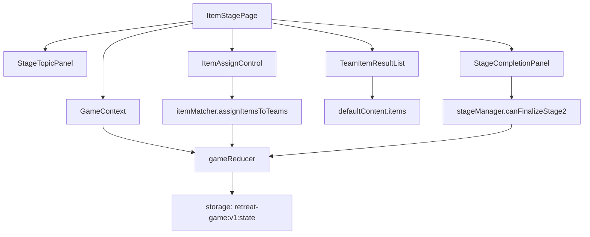

# 004 Item Stage Implementation Plan

## 개요

이 문서는 `Stage 2: 주제 및 아이템 획득` 페이지 구현 계획이다. 코드베이스는 아직 없으므로 Vite + React + TypeScript, Context + useReducer, `localStorage` MVP 구조를 기준으로 한다.

- 페이지 위치: `src/pages/ItemStagePage.tsx`
- 상태 위치: `src/store/GameContext.tsx`, `src/store/gameReducer.ts`
- 콘텐츠 위치: `src/data/defaultContent.ts`
- 도메인 로직 위치: `src/features/items/itemMatcher.ts`, `src/features/stages/stageManager.ts`
- 저장소 위치: `src/lib/storage.ts`
- 공통 UI 위치: `src/components/StageProgress.tsx`, `src/components/Notice.tsx`, `src/components/PrimaryAction.tsx`

목표는 1단계 팀 구성이 완료된 팀 목록을 기준으로 주제 키워드를 보여주고, 팀별 힌트/도구 아이템을 랜덤 배정한 뒤 공개 및 확정 상태를 저장하여 3단계로 이동할 수 있게 하는 것이다.

## 관련 유스케이스

- `docs/usecases/004-stage2-item-assignment/spec.md`
- 선행: UC-001 게임 설정, UC-002 팀 이름 입력, UC-003 성향 기반 팀 구성
- 후행: UC-005 3단계 성경 기반 협업 미션

참조 요구사항:

- `docs/requirement.md`: 2단계는 주제 키워드 표시와 힌트/도구 아이템 획득을 수행한다.
- `docs/prd.md`: MVP에서는 사다리타기 애니메이션 대신 랜덤 매칭 방식으로 구현할 수 있다.
- `docs/userflow.md`: 팀 데이터가 없으면 배정하지 않고, 재배정 시 기존 결과를 덮어쓴다.
- `docs/database.md`: `itemAssignments`, `itemRevealState`, `stageProgress.stage2`를 `retreat-game:v1:state`에 저장한다.

## 상태/입력/검증

### 사용하는 상태

```ts
type ItemAssignment = {
  teamId: string;
  itemId: string;
  assignedAt: string;
};

type ItemRevealState = {
  mode: "all" | "sequence";
  revealedTeamIds: string[];
  finalized: boolean;
};
```

읽는 상태:

- `game.config.topicKeyword`
- `game.content.topicKeyword`
- `game.stage.progress.stage1.status`
- `game.stage.progress.stage2.status`
- `teams`
- `teamAssignments`
- `itemAssignments`
- `itemRevealState`

변경하는 상태:

- `itemAssignments`
- `itemRevealState`
- `game.stage.currentStage`
- `game.stage.currentRoute`
- `game.stage.progress.stage2`
- `game.stage.progress.stage3`

### 사용자 입력

- 아이템 배정 실행
- 공개 방식 선택: `all` 또는 `sequence`
- 전체 공개 실행
- 다음 팀 공개 실행
- 확정 전 재배정 실행
- 2단계 완료 확인
- 3단계 이동 실행

### 검증 규칙

- `stageProgress.stage1.status === "completed"`가 아니면 2단계 배정을 차단한다.
- `teams.length >= 2`여야 한다.
- `teamAssignments`가 비어 있으면 팀 구성이 완료되지 않은 것으로 처리한다.
- 콘텐츠 아이템 목록이 비어 있으면 기본 아이템 6개를 사용한다.
- 모든 팀에 `ItemAssignment`가 1개 이상 있어야 2단계 완료가 가능하다.
- 순차 공개 모드에서는 모든 팀 ID가 `revealedTeamIds`에 있어야 완료 확인을 활성화한다.
- `itemRevealState.finalized === true` 이후 재배정은 기본 MVP에서는 비활성화한다.

## 컴포넌트 계획

### `ItemStagePage`

- 2단계 페이지 컨테이너.
- `GameContext`에서 상태와 dispatch 함수를 가져온다.
- 선행 조건을 확인하고 실패 시 안내와 이전 단계 이동 액션을 보여준다.
- 주제 키워드, 아이템 배정 컨트롤, 팀별 결과, 완료 버튼을 배치한다.

### `StageTopicPanel`

- 현재 주제 키워드를 크게 표시한다.
- 키워드가 비어 있으면 `공동체`를 표시한다.
- 3단계와 4단계에서 이어 사용할 주제임을 짧게 안내한다.

### `ItemAssignControl`

- 공개 방식 선택과 배정 실행 버튼을 제공한다.
- 배정 전: `아이템 배정하기`
- 배정 후 확정 전: `다시 배정하기`, `결과 공개`
- 확정 후: 읽기 전용 상태

### `TeamItemResultList`

- 팀별 아이템 결과를 표시한다.
- `mode === "all"`이면 전체 공개 후 모든 결과를 표시한다.
- `mode === "sequence"`이면 `revealedTeamIds`에 포함된 팀만 결과를 표시한다.
- 미공개 팀은 고정 높이의 대기 카드로 표시해 레이아웃 흔들림을 줄인다.

### `ItemCard`

- 아이템 이름, 짧은 설명, 사용 가능 단계(`3단계`, `4단계`)를 표시한다.
- 아이템 상세 데이터는 `defaultContent.ts`에서 `itemId`로 조회한다.

### `StageCompletionPanel`

- 완료 가능 여부와 누락 조건을 표시한다.
- 완료 가능하면 `2단계 완료` 버튼을 제공한다.
- 완료 후 `3단계로 이동` 버튼을 활성화한다.

## 리듀서/액션 계획

필요 액션:

```ts
type GameAction =
  | { type: "stage2/setRevealMode"; mode: "all" | "sequence" }
  | { type: "stage2/assignItems"; assignments: ItemAssignment[]; assignedAt: string }
  | { type: "stage2/revealAll" }
  | { type: "stage2/revealTeam"; teamId: string }
  | { type: "stage2/finalize"; completedAt: string }
  | { type: "stage/goToStage3" };
```

리듀서 동작:

- `stage2/setRevealMode`: 공개 방식 변경, 확정 전만 허용.
- `stage2/assignItems`: 기존 배정 결과를 새 결과로 대체하고 `revealedTeamIds`를 초기화.
- `stage2/revealAll`: 모든 팀 ID를 `revealedTeamIds`에 저장.
- `stage2/revealTeam`: 지정 팀 ID를 중복 없이 추가.
- `stage2/finalize`: `itemRevealState.finalized = true`, `stage2.status = "completed"`, `stage3.status = "active"`.
- `stage/goToStage3`: `currentStage = 3`, `currentRoute = "stage3"`.

## 도메인 로직 계획

### `assignItemsToTeams(teams, items, now)`

- 팀 순서를 기준으로 배정 결과를 만든다.
- 아이템 수가 팀 수보다 많으면 셔플 후 팀 수만큼 사용한다.
- 아이템 수가 팀 수보다 적으면 기본 아이템 세트로 보완한다.
- 반환값은 `ItemAssignment[]`이다.

### `canFinalizeStage2(state)`

- 팀이 존재하는지 확인한다.
- 모든 팀에 아이템이 배정되었는지 확인한다.
- 공개 방식에 따라 공개 완료 여부를 확인한다.
- 이미 확정된 경우 true를 반환한다.

## Mermaid 모듈 관계도



## 테스트/QA 체크

### 유닛 테스트

- `assignItemsToTeams`가 2~6개 팀에 대해 각 팀 1개 아이템을 배정한다.
- 아이템 목록이 팀 수보다 많을 때 중복 없이 배정한다.
- 아이템 목록이 비었을 때 기본 아이템 세트를 사용한다.
- `canFinalizeStage2`는 배정 전 false, 전체 공개 후 true를 반환한다.
- 순차 공개 모드에서 일부 팀만 공개된 경우 false를 반환한다.

### 통합 테스트

- 1단계 완료 상태와 팀 데이터가 있는 상태에서 2단계 진입이 가능하다.
- 아이템 배정 후 새로고침해도 같은 `itemAssignments`가 복구된다.
- 확정 전 재배정 시 기존 `revealedTeamIds`가 초기화된다.
- 2단계 확정 후 `stageProgress.stage2.status`는 `completed`, `stageProgress.stage3.status`는 `active`가 된다.

### 화면 QA

- 모바일 폭에서 팀 카드와 아이템 이름이 잘리지 않는다.
- 현재 스테이지가 2단계로 표시되고 1단계 완료 상태가 보인다.
- 팀 데이터가 없을 때 배정 버튼이 비활성화되고 안내가 표시된다.
- `localStorage` 저장 실패 시 현재 화면 상태는 유지되고 저장 실패 안내가 표시된다.
