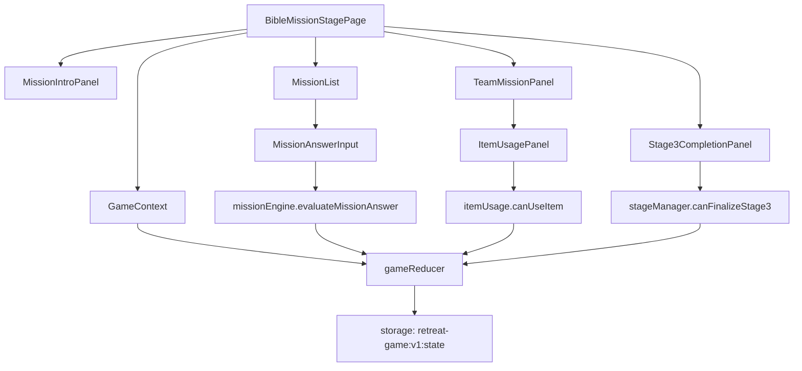

# 005 Bible Mission Stage Implementation Plan

## 개요

이 문서는 `Stage 3: 성경 협업 미션` 페이지 구현 계획이다. 코드베이스는 아직 없으므로 Vite + React + TypeScript, Context + useReducer, `localStorage` MVP 구조를 기준으로 한다.

- 페이지 위치: `src/pages/BibleMissionStagePage.tsx`
- 상태 위치: `src/store/GameContext.tsx`, `src/store/gameReducer.ts`
- 콘텐츠 위치: `src/data/defaultContent.ts`
- 도메인 로직 위치: `src/features/missions/missionEngine.ts`, `src/features/items/itemUsage.ts`, `src/features/stages/stageManager.ts`
- 저장소 위치: `src/lib/storage.ts`
- 공통 UI 위치: `src/components/StageProgress.tsx`, `src/components/Notice.tsx`, `src/components/TeamStatusBadge.tsx`

목표는 2단계에서 배정된 아이템과 주제 키워드를 바탕으로 팀별 성경 협업 미션 답변을 수집하고, 아이템 사용 상태를 기록하며, 진행자 확인 후 4단계로 이동할 수 있게 하는 것이다.

## 관련 유스케이스

- `docs/usecases/005-stage3-bible-mission/spec.md`
- 선행: UC-004 2단계 주제 확인 및 팀별 힌트/도구 아이템 배정
- 후행: UC-006 4단계 최종 성경 미션

참조 요구사항:

- `docs/requirement.md`: 3단계는 성경 퀴즈, 말씀 빈칸, 인물과 사건 연결, 주제 적용 토론을 포함할 수 있다.
- `docs/prd.md`: 기본 콘텐츠는 중고등부 대상, 주제 `공동체` 기준으로 제공한다.
- `docs/userflow.md`: 선택형은 정답 여부를 기록하고, 서술형은 입력 여부와 진행자 확인을 기준으로 완료한다.
- `docs/database.md`: `missionResponses.stage3`, `usedItems`, `stageProgress.stage3`를 저장한다.

## 상태/입력/검증

### 사용하는 상태

```ts
type Stage3MissionResponse = {
  teamId: string;
  missionId: string;
  answer: string | string[];
  isCorrect?: boolean;
  isCompleted: boolean;
  updatedAt: string;
};

type UsedItem = {
  teamId: string;
  itemId: string;
  stage: 3 | 4;
  missionId?: string;
  usedAt: string;
};
```

읽는 상태:

- `game.config.topicKeyword`
- `game.config.ageGroup`
- `game.config.difficulty`
- `game.stage.progress.stage2.status`
- `teams`
- `itemAssignments`
- `itemRevealState.finalized`
- `missionResponses.stage3`
- `usedItems`

변경하는 상태:

- `missionResponses.stage3`
- `usedItems`
- `game.stage.currentStage`
- `game.stage.currentRoute`
- `game.stage.progress.stage3`
- `game.stage.progress.stage4`

### 사용자 입력

- 팀별 선택형 답안 선택
- 팀별 서술형 답변 작성
- 팀별 아이템 사용 실행
- 팀별 답변 저장 또는 제출
- 진행자 3단계 완료 확인
- 4단계 이동 실행

### 검증 규칙

- `stageProgress.stage2.status === "completed"`가 아니면 3단계 진입을 제한한다.
- `itemRevealState.finalized === true`가 아니면 아이템 기반 안내는 제한하고 2단계 완료 안내를 표시한다.
- 모든 팀에 필수 미션 답변이 있어야 한다.
- 선택형 미션은 `answer`가 허용된 선택지 ID에 포함되어야 한다.
- 서술형 미션은 공백 제거 후 1자 이상이어야 한다.
- 답변 길이는 모바일 화면과 결과물 확장을 고려해 미션당 300자 이내로 제한한다.
- 같은 팀의 같은 아이템은 한 번만 사용할 수 있다.
- 콘텐츠 미션 목록이 비어 있으면 기본 성경 미션 세트를 사용한다.

## 컴포넌트 계획

### `BibleMissionStagePage`

- 3단계 페이지 컨테이너.
- 선행 조건을 확인하고 실패 시 2단계 이동 안내를 보여준다.
- 주제 키워드, 미션 목록, 팀별 답변 입력, 아이템 사용, 완료 상태를 통합한다.

### `MissionIntroPanel`

- 현재 주제, 대상 연령대, 3단계 목적을 표시한다.
- 개인정보를 답변에 쓰지 않도록 짧은 안내를 제공한다.

### `MissionList`

- 기본 미션 5개를 순서대로 표시한다.
- 미션 유형별 입력 컴포넌트를 선택한다.
- 선택형, 빈칸형, 연결형, 서술형, 한 문장 고백형을 MVP에서 동일한 `MissionAnswerInput` 인터페이스로 다룬다.

### `TeamMissionPanel`

- 팀별 답변 입력 영역.
- 팀 이름, 보유 아이템, 사용한 아이템, 답변 완료 상태를 보여준다.
- 팀 수 2~6개 기준으로 아코디언 또는 탭 없이 세로 카드 목록으로 구현한다.

### `MissionAnswerInput`

- 미션 유형에 따라 radio/select/textarea를 렌더링한다.
- 입력 변경 시 `stage3/updateResponse` 액션을 dispatch한다.
- 선택형은 즉시 정답 여부를 계산하되, 화면에는 경쟁 점수보다 완료 상태 중심으로 표시한다.

### `ItemUsagePanel`

- 팀이 2단계에서 받은 아이템을 보여준다.
- 이미 사용한 아이템은 비활성화한다.
- 사용 시 `stage3/useItem` 액션을 dispatch한다.

### `Stage3CompletionPanel`

- 팀별 미완료 미션 수를 표시한다.
- 모든 필수 답변이 완료되면 진행자 확인 버튼을 활성화한다.
- 진행자 확인 후 4단계 이동 버튼을 제공한다.

## 리듀서/액션 계획

필요 액션:

```ts
type GameAction =
  | {
      type: "stage3/updateResponse";
      teamId: string;
      missionId: string;
      answer: string | string[];
      isCorrect?: boolean;
      isCompleted: boolean;
      updatedAt: string;
    }
  | { type: "stage3/useItem"; teamId: string; itemId: string; missionId?: string; usedAt: string }
  | { type: "stage3/finalize"; completedAt: string }
  | { type: "stage/goToStage4" };
```

리듀서 동작:

- `stage3/updateResponse`: `teamId + missionId` 기준으로 upsert한다.
- `stage3/useItem`: 같은 `teamId + itemId` 사용 기록이 있으면 상태를 바꾸지 않는다.
- `stage3/finalize`: `stage3.status = "completed"`, `stage4.status = "active"`로 변경한다.
- `stage/goToStage4`: `currentStage = 4`, `currentRoute = "stage4"`로 이동한다.

## 도메인 로직 계획

### `getStage3Missions(contentSetId, topicKeyword, ageGroup, difficulty)`

- 기본 콘텐츠 세트에서 3단계 미션 5개를 반환한다.
- 조건에 맞는 콘텐츠가 없으면 주제 `공동체`, 대상 `middleHigh`, 난이도 `normal` 기본값을 사용한다.

### `evaluateMissionAnswer(mission, answer)`

- 선택형: 정답 선택지와 비교해 `isCorrect`를 계산한다.
- 서술형: 공백 제거 후 값이 있으면 `isCompleted = true`로 계산한다.
- 정답 데이터가 없는 미션: `isCorrect`를 생략하고 `isCompleted`만 반환한다.

### `canUseItem(state, teamId, itemId)`

- 해당 팀의 `itemAssignments`에 itemId가 있어야 한다.
- `usedItems`에 같은 `teamId + itemId`가 없어야 한다.
- 아이템 데이터가 없으면 false를 반환한다.

### `canFinalizeStage3(state, missions)`

- 모든 팀이 모든 필수 미션에 대해 `isCompleted === true`인 응답을 가져야 한다.
- 현장 진행을 위해 추후 강제 완료 옵션을 둘 수 있으나 MVP에서는 필수 답변 완료를 기준으로 한다.

## Mermaid 모듈 관계도



## 테스트/QA 체크

### 유닛 테스트

- `getStage3Missions`가 기본 미션 5개를 반환한다.
- 선택형 답변의 정답/오답이 `isCorrect`에 기록된다.
- 서술형 공백 답변은 `isCompleted = false`가 된다.
- `canUseItem`은 보유하지 않은 아이템과 이미 사용한 아이템을 거부한다.
- `canFinalizeStage3`는 누락 답변이 하나라도 있으면 false를 반환한다.

### 통합 테스트

- 2단계 완료 상태에서 3단계 페이지가 렌더링된다.
- 팀별 답변 입력 후 `missionResponses.stage3`에 upsert된다.
- 아이템 사용 후 `usedItems`에 stage 3 기록이 저장된다.
- 새로고침 후 답변과 아이템 사용 상태가 복구된다.
- 3단계 완료 후 `stageProgress.stage3.status`는 `completed`, `stageProgress.stage4.status`는 `active`가 된다.

### 화면 QA

- 모바일 폭에서 팀별 답변 카드가 세로로 안정적으로 표시된다.
- 긴 서술형 답변 입력 시 textarea가 화면을 밀어내지 않고 제한 안내가 표시된다.
- 진행자는 미완료 팀과 미완료 미션을 한눈에 확인할 수 있다.
- 아이템이 없거나 모두 사용된 팀은 사용 가능한 아이템 없음 상태를 본다.
- `localStorage` 저장 실패 시 현재 입력값은 유지되고 저장 실패 안내가 표시된다.
