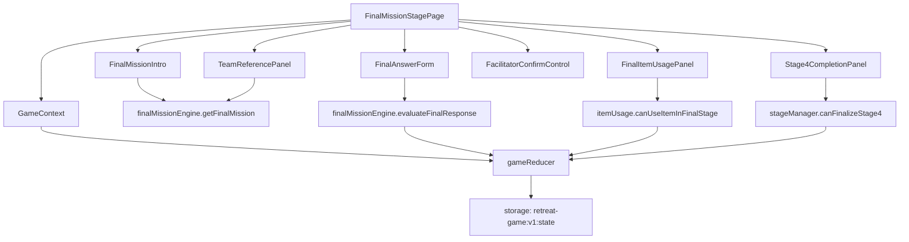

# 006 Final Mission Stage Implementation Plan

## 개요

이 문서는 `Stage 4: 최종 미션` 페이지 구현 계획이다. 코드베이스는 아직 없으므로 Vite + React + TypeScript, Context + useReducer, `localStorage` MVP 구조를 기준으로 한다.

- 페이지 위치: `src/pages/FinalMissionStagePage.tsx`
- 상태 위치: `src/store/GameContext.tsx`, `src/store/gameReducer.ts`
- 콘텐츠 위치: `src/data/defaultContent.ts`
- 도메인 로직 위치: `src/features/missions/finalMissionEngine.ts`, `src/features/items/itemUsage.ts`, `src/features/stages/stageManager.ts`
- 저장소 위치: `src/lib/storage.ts`
- 공통 UI 위치: `src/components/StageProgress.tsx`, `src/components/Notice.tsx`, `src/components/TeamStatusBadge.tsx`

목표는 2단계 아이템과 3단계 답변을 참조해 팀별 최종 답변, 선언문, 실천 약속을 작성하게 하고, 진행자 확인 후 4단계를 완료하여 소감 작성 흐름으로 이동 가능하게 하는 것이다.

## 관련 유스케이스

- `docs/usecases/006-stage4-final-mission/spec.md`
- 선행: UC-005 3단계 성경 기반 팀 협업 미션 진행
- 후행: UC-007 팀별 소감 작성, UC-008 결과물 미리보기 및 이미지 다운로드

참조 요구사항:

- `docs/requirement.md`: 최종 미션은 앞 단계 힌트와 도구를 활용해 최종 답변 또는 결과물을 완성한다.
- `docs/prd.md`: 4단계는 팀별 최종 답변 입력과 완료 상태 표시를 제공한다.
- `docs/userflow.md`: 정답형은 정답 기준, 선언문/실천 약속형은 입력 완료와 진행자 확인 기준으로 처리한다.
- `docs/database.md`: `missionResponses.stage4`, `usedItems`, `stageProgress.stage4`를 저장한다.

## 상태/입력/검증

### 사용하는 상태

```ts
type Stage4MissionResponse = {
  teamId: string;
  finalAnswer: string;
  facilitatorConfirmed: boolean;
  isCompleted: boolean;
  updatedAt: string;
};

type UsedItem = {
  teamId: string;
  itemId: string;
  stage: 3 | 4;
  missionId?: string;
  usedAt: string;
};
```

읽는 상태:

- `game.config.topicKeyword`
- `game.stage.progress.stage3.status`
- `teams`
- `itemAssignments`
- `missionResponses.stage3`
- `missionResponses.stage4`
- `usedItems`

변경하는 상태:

- `missionResponses.stage4`
- `usedItems`
- `game.stage.currentStage`
- `game.stage.currentRoute`
- `game.stage.progress.stage4`

### 사용자 입력

- 팀별 최종 답변 작성
- 남은 힌트/도구 아이템 사용
- 팀별 진행자 완료 확인
- 4단계 전체 완료 확인
- 소감 작성 단계 이동 실행

### 검증 규칙

- `stageProgress.stage3.status === "completed"`가 아니면 4단계 진입을 제한한다.
- 팀별 최종 답변은 공백 제거 후 1자 이상이어야 팀별 완료 확인이 가능하다.
- 최종 답변은 결과물 화면 확장을 고려해 500자 이내로 제한한다.
- `facilitatorConfirmed === true`이고 최종 답변이 있으면 `isCompleted = true`로 본다.
- 남은 아이템이 없으면 아이템 사용 영역은 비활성 상태로 표시하되 미션 진행은 허용한다.
- 같은 팀의 같은 아이템은 3단계 또는 4단계를 통틀어 중복 사용하지 않는다.
- 기본 최종 미션 콘텐츠가 없으면 기본 선언문형 미션을 사용한다.
- 일부 팀이 미완료인 경우 MVP 기본값은 전체 완료를 제한한다. 현장 판단 강제 완료는 후속 옵션으로 분리한다.

## 컴포넌트 계획

### `FinalMissionStagePage`

- 4단계 페이지 컨테이너.
- 선행 조건을 확인하고 실패 시 3단계 완료 안내를 보여준다.
- 최종 미션 안내, 팀별 참조 정보, 답변 입력, 완료 확인, 소감 이동을 통합한다.

### `FinalMissionIntro`

- 최종 미션 제목, 주제 키워드, 미션 설명을 표시한다.
- 예: 공동체 주제에 맞는 팀 선언문 또는 실천 약속 작성.
- 점수 경쟁보다 협력 결과물을 남기는 흐름임을 짧게 안내한다.

### `TeamReferencePanel`

- 팀별 2단계 아이템과 3단계 대표 답변을 요약해서 보여준다.
- 3단계 답변이 많을 경우 미션 제목과 답변 첫 줄 중심으로 축약한다.
- 참조 정보는 읽기 전용이다.

### `FinalAnswerForm`

- 팀별 최종 답변 textarea.
- 입력 변경 시 `stage4/updateFinalAnswer` 액션을 dispatch한다.
- 공백 답변, 길이 초과, 개인정보 입력 주의 안내를 표시한다.

### `FinalItemUsagePanel`

- 4단계에서 사용할 수 있는 남은 아이템을 표시한다.
- 이미 3단계에서 사용한 아이템은 사용 완료로 표시한다.
- 사용 가능한 아이템이 없으면 비활성 안내를 표시한다.

### `FacilitatorConfirmControl`

- 팀별 최종 답변 확인 체크 또는 버튼을 제공한다.
- 답변이 비어 있으면 확인을 비활성화한다.
- 확인 시 `facilitatorConfirmed`와 `isCompleted`를 함께 갱신한다.

### `Stage4CompletionPanel`

- 전체 팀 완료 상태를 표시한다.
- 모든 팀의 `isCompleted`가 true이면 4단계 완료 버튼을 활성화한다.
- 완료 후 소감 작성 단계로 이동 버튼을 제공한다.

## 리듀서/액션 계획

필요 액션:

```ts
type GameAction =
  | { type: "stage4/updateFinalAnswer"; teamId: string; finalAnswer: string; updatedAt: string }
  | { type: "stage4/useItem"; teamId: string; itemId: string; usedAt: string }
  | { type: "stage4/confirmTeam"; teamId: string; confirmed: boolean; updatedAt: string }
  | { type: "stage4/finalize"; completedAt: string }
  | { type: "stage/goToReflection" };
```

리듀서 동작:

- `stage4/updateFinalAnswer`: `teamId` 기준으로 stage4 응답을 upsert하고, 답변이 수정되면 기존 확인 상태를 false로 되돌린다.
- `stage4/useItem`: 같은 `teamId + itemId` 사용 기록이 있으면 상태를 바꾸지 않고, 가능하면 stage 4 사용 기록을 추가한다.
- `stage4/confirmTeam`: 최종 답변이 있는 팀만 `facilitatorConfirmed`를 갱신하고 `isCompleted`를 계산한다.
- `stage4/finalize`: 모든 팀 완료 시 `stage4.status = "completed"`로 저장한다.
- `stage/goToReflection`: `currentStage = "reflection"`, `currentRoute = "reflection"`으로 이동한다.

## 도메인 로직 계획

### `getFinalMission(contentSetId, topicKeyword, ageGroup, difficulty)`

- 기본 콘텐츠 세트에서 4단계 최종 미션 1개를 반환한다.
- 콘텐츠가 없으면 공동체 실천 약속 작성형 기본 미션을 반환한다.

### `buildTeamReferences(state, teamId)`

- 팀의 2단계 아이템을 찾는다.
- 팀의 3단계 답변 목록을 찾는다.
- 최종 미션 화면에 필요한 요약 데이터만 반환한다.

### `canUseItemInFinalStage(state, teamId, itemId)`

- 해당 팀이 배정받은 아이템인지 확인한다.
- `usedItems`에서 같은 `teamId + itemId` 기록이 있으면 false를 반환한다.
- 아이템이 없어도 최종 미션 자체는 진행 가능하다.

### `evaluateFinalResponse(response)`

- `finalAnswer.trim().length > 0`인지 확인한다.
- `facilitatorConfirmed === true`인지 확인한다.
- 두 조건이 모두 충족되면 `isCompleted = true`로 계산한다.

### `canFinalizeStage4(state)`

- 모든 팀이 stage4 응답을 가지고 있는지 확인한다.
- 모든 팀의 `isCompleted === true`인지 확인한다.

## Mermaid 모듈 관계도



## 테스트/QA 체크

### 유닛 테스트

- `getFinalMission`은 기본 최종 미션 1개를 반환한다.
- `buildTeamReferences`는 팀별 아이템과 3단계 답변 요약을 반환한다.
- `evaluateFinalResponse`는 답변과 진행자 확인이 모두 있을 때만 완료로 판단한다.
- `canUseItemInFinalStage`는 3단계에서 이미 사용한 아이템을 거부한다.
- `canFinalizeStage4`는 한 팀이라도 미완료이면 false를 반환한다.

### 통합 테스트

- 3단계 완료 상태에서 4단계 페이지가 렌더링된다.
- 팀별 최종 답변 입력 시 `missionResponses.stage4`에 저장된다.
- 답변 수정 시 기존 진행자 확인이 해제된다.
- 진행자 확인 후 팀별 `facilitatorConfirmed`와 `isCompleted`가 true가 된다.
- 4단계 완료 후 `stageProgress.stage4.status`는 `completed`, `currentRoute`는 `reflection`으로 이동 가능하다.
- 새로고침 후 최종 답변, 아이템 사용, 진행자 확인 상태가 복구된다.

### 화면 QA

- 모바일 폭에서 참조 정보와 답변 입력 영역이 겹치지 않는다.
- 긴 최종 답변은 textarea 내부에서 스크롤 또는 높이 제한으로 처리된다.
- 팀별 완료/미완료 상태가 색상 외 텍스트와 아이콘으로도 구분된다.
- 남은 아이템이 없을 때도 최종 답변 작성은 가능하다.
- `localStorage` 저장 실패 시 현재 입력값은 유지되고 저장 실패 안내가 표시된다.
