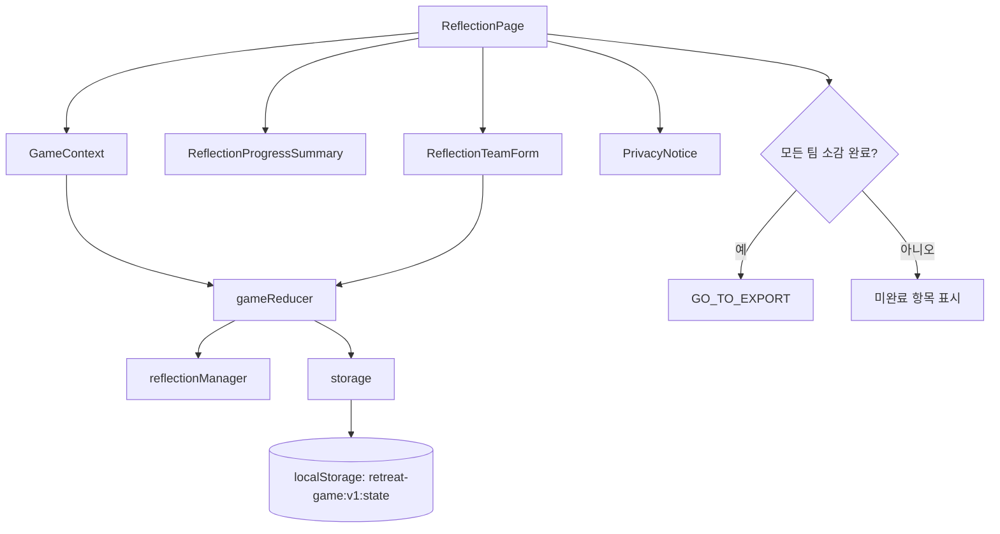

# 007 Reflection Page Implementation Plan

## 개요

이 문서는 `UC-007 팀별 소감 작성`을 구현하기 위한 페이지 단위 계획이다. 기준 문서는 `docs/requirement.md`, `docs/prd.md`, `docs/userflow.md`, `docs/database.md`, `docs/usecases/007-reflection/spec.md`, 연관 문서 `docs/usecases/008-result-export/spec.md`, `docs/usecases/009-session-recovery/spec.md`이다.

전제 기술 스택은 Vite + React + TypeScript이며, 전역 상태는 Context + `useReducer`, 임시 저장은 `localStorage` 단일 키 `retreat-game:v1:state`를 사용한다. 로그인, 서버 저장, 개인정보 전용 입력 필드는 구현하지 않는다.

### 구현 모듈 목록

| 모듈 | 권장 위치 | 설명 |
| --- | --- | --- |
| `ReflectionPage` | `src/pages/reflection/ReflectionPage.tsx` | 팀별 소감 작성 화면의 최상위 페이지 컴포넌트 |
| `ReflectionTeamForm` | `src/features/reflection/components/ReflectionTeamForm.tsx` | 한 팀의 4개 소감 필드를 입력하고 오류를 표시 |
| `ReflectionProgressSummary` | `src/features/reflection/components/ReflectionProgressSummary.tsx` | 전체 팀 중 작성 완료 팀 수와 미완료 팀을 표시 |
| `PrivacyNotice` | `src/shared/components/PrivacyNotice.tsx` | 자유 입력란과 결과물에 개인정보를 넣지 않도록 안내 |
| `reflectionManager` | `src/features/reflection/reflectionManager.ts` | 소감 생성, 수정, 검증, 완료 여부 계산 |
| `gameReducer` 확장 | `src/app/state/gameReducer.ts` | `UPDATE_REFLECTION`, `SAVE_REFLECTIONS`, `GO_TO_EXPORT` 액션 처리 |
| `GameContext` 사용 | `src/app/state/GameContext.tsx` | `state`, `dispatch`를 페이지와 컴포넌트에 제공 |
| `storage` 사용 | `src/shared/storage/storage.ts` | 상태 변경 후 `retreat-game:v1:state`에 자동 저장 |

## 관련 유스케이스

- 선행: `UC-006 4단계 최종 미션`
- 주 대상: `UC-007 팀별 소감 작성`
- 후행: `UC-008 결과물 미리보기 및 이미지 다운로드`
- 연관: `UC-009 임시 저장 및 세션 복구`

## 상태 / 입력 / 검증

### 참조 상태

| 상태 경로 | 타입 기준 | 사용 목적 |
| --- | --- | --- |
| `state.game.title` | `string` | 결과물에 포함될 게임 제목을 사용자에게 인지시킴 |
| `state.game.config.topicKeyword` | `string` | 기억에 남는 말씀/키워드 입력의 기본 맥락 제공 |
| `state.game.stage.currentRoute` | `"reflection"` | 현재 페이지 접근 여부 판단 |
| `state.game.stage.progress.stage4` | `StageProgressItem` | 최종 미션 완료 또는 진행자 판단 후 소감 진입 여부 확인 |
| `state.teams` | `Team[]` | 팀별 입력 폼 생성 기준 |
| `state.reflections` | `Reflection[]` | 팀별 소감 입력값 저장 |
| `state.exportState.previewReady` | `boolean` | 모든 팀 소감 완료 시 `true`로 전환 가능 |

### 입력 필드

각 팀은 `docs/database.md`의 `Reflection` 타입을 따른다.

| 필드 | 라벨 | 필수 | 검증 |
| --- | --- | --- | --- |
| `memorableWord` | 기억에 남는 말씀 또는 키워드 | 예 | 공백 제거 후 1자 이상 |
| `solvedTogether` | 팀이 함께 해결한 것 | 예 | 공백 제거 후 1자 이상 |
| `thankfulPoint` | 감사한 점 | 예 | 공백 제거 후 1자 이상 |
| `actionCommitment` | 앞으로 실천하고 싶은 것 | 예 | 공백 제거 후 1자 이상 |

### 검증 규칙

- 확정된 모든 팀에 `Reflection`이 있어야 결과물 미리보기로 이동할 수 있다.
- 4개 필드 중 하나라도 비어 있으면 해당 팀은 미완료 상태이다.
- 긴 텍스트는 저장 자체를 막기보다 결과물 표시 제한 안내를 우선한다.
- 자유 입력란에는 실명, 전화번호, 이메일 등 개인정보를 입력하지 말라는 안내를 항상 노출한다.
- 팀 목록이 비어 있으면 소감 화면을 정상 진행할 수 없으므로 이전 단계 보완 안내를 표시한다.

### Reducer 액션 계획

```ts
type GameAction =
  | {
      type: "UPDATE_REFLECTION_FIELD";
      payload: {
        teamId: string;
        field: "memorableWord" | "solvedTogether" | "thankfulPoint" | "actionCommitment";
        value: string;
      };
    }
  | { type: "SAVE_REFLECTIONS" }
  | { type: "GO_TO_EXPORT" };
```

액션 처리 원칙:

- `UPDATE_REFLECTION_FIELD`: 해당 팀의 `Reflection`이 없으면 빈 객체를 생성하고 필드 값을 갱신한다. `updatedAt`은 ISO 문자열로 갱신한다.
- `SAVE_REFLECTIONS`: 현재 입력값을 검증하고 유효한 값은 `state.reflections`에 유지한다. 외부 DB 호출은 없다.
- `GO_TO_EXPORT`: 모든 팀 소감이 유효할 때만 `game.stage.currentRoute = "export"`, `game.stage.currentStage = "export"`, `exportState.previewReady = true`로 갱신한다.

## 컴포넌트 계획

### `ReflectionPage`

책임:

- 전역 상태에서 `teams`, `reflections`, `game` 정보를 읽는다.
- 팀 목록 기준으로 `ReflectionTeamForm`을 렌더링한다.
- 전체 완료 여부를 계산해 결과물 미리보기 버튼 활성화 여부를 결정한다.
- 저장 및 다음 단계 이동 액션을 dispatch한다.

상태가 아닌 파생값:

- `completedTeamCount`
- `incompleteTeamNames`
- `canGoToExport`
- `hasLongTextWarning`

### `ReflectionTeamForm`

책임:

- 한 팀의 4개 소감 필드 입력을 담당한다.
- 필드별 누락 오류를 표시한다.
- 입력 변경 시 `UPDATE_REFLECTION_FIELD`를 dispatch한다.
- 팀 이름은 읽기 전용으로 표시한다.

구현 주의:

- 입력 컴포넌트는 모바일에서 충분히 큰 터치 영역을 갖는다.
- textarea 높이는 고정 최소 높이를 두되 내용이 길면 스크롤 또는 자동 확장을 허용한다.
- 결과물에 포함될 입력임을 폼 상단에 짧게 안내한다.

### `ReflectionProgressSummary`

책임:

- `n / total` 작성 완료 상태를 표시한다.
- 미완료 팀 목록을 표시한다.
- 다음 단계 이동 제한 사유를 짧게 보여준다.

### `PrivacyNotice`

책임:

- 실명, 전화번호, 이메일, 생년월일을 입력하지 말라는 안내를 제공한다.
- 결과물 이미지에 소감 내용이 포함된다는 점을 안내한다.
- 같은 컴포넌트를 `008-result-export`에서도 재사용한다.

## Mermaid 모듈 관계도



## Implementation Plan

1. `src/features/reflection/reflectionManager.ts`를 만든다.
   - `getReflectionForTeam(reflections, teamId)`를 구현한다.
   - `validateReflection(reflection)`은 4개 필드별 누락 여부와 `isComplete`를 반환한다.
   - `validateAllReflections(teams, reflections)`은 전체 완료 여부와 미완료 팀 ID 목록을 반환한다.

2. `src/app/state/gameReducer.ts`에 소감 액션을 추가한다.
   - `UPDATE_REFLECTION_FIELD`는 팀 ID 기준으로 기존 소감을 갱신하거나 새 소감을 생성한다.
   - `SAVE_REFLECTIONS`는 검증 결과를 상태에 반영하되 유효하지 않은 입력을 삭제하지 않는다.
   - `GO_TO_EXPORT`는 모든 팀 소감이 완료된 경우에만 export 경로로 전환한다.

3. `src/features/reflection/components/ReflectionTeamForm.tsx`를 만든다.
   - props는 `team`, `reflection`, `errors`, `onChange`로 제한한다.
   - 화면 필드는 `memorableWord`, `solvedTogether`, `thankfulPoint`, `actionCommitment` 네 개만 둔다.
   - 개인정보 전용 입력 필드는 만들지 않는다.

4. `src/features/reflection/components/ReflectionProgressSummary.tsx`를 만든다.
   - 완료 팀 수, 전체 팀 수, 미완료 팀 이름을 표시한다.
   - 미완료 상태에서는 결과물 미리보기 이동이 제한되는 이유를 표시한다.

5. `src/shared/components/PrivacyNotice.tsx`를 만든다.
   - 자유 입력란에 개인정보를 넣지 말라는 짧은 안내를 제공한다.
   - 이 컴포넌트는 export 페이지에서도 재사용 가능해야 한다.

6. `src/pages/reflection/ReflectionPage.tsx`를 만든다.
   - `GameContext`에서 상태와 dispatch를 가져온다.
   - 팀 목록이 없으면 이전 단계 보완 안내를 표시한다.
   - 저장 버튼은 현재 입력값을 유지하고 저장 상태를 갱신한다.
   - 결과물 미리보기 버튼은 `canGoToExport`가 `true`일 때만 활성화한다.

7. 라우팅 또는 화면 전환 테이블에 `currentRoute === "reflection"`일 때 `ReflectionPage`가 표시되도록 연결한다.

8. 상태 변경 후 자동 저장 훅이 있다면 `reflections`, `game.stage`, `exportState` 변경을 저장 대상에 포함한다. 없다면 `GameProvider`에서 reducer 상태 변경 후 `saveState(state)`를 호출하는 구조로 설계한다.

## 테스트 / QA 체크

### Unit Test

- `validateReflection`은 4개 필드가 모두 입력되면 `isComplete: true`를 반환한다.
- 필드 하나가 공백이면 해당 필드 오류와 `isComplete: false`를 반환한다.
- `validateAllReflections`는 팀 2~6개 기준으로 미완료 팀 ID를 정확히 반환한다.
- `UPDATE_REFLECTION_FIELD`는 기존 팀 소감만 갱신하고 다른 팀 소감을 변경하지 않는다.
- `GO_TO_EXPORT`는 미완료 팀이 있으면 route를 변경하지 않는다.

### Component Test

- 저장된 소감이 있는 상태로 진입하면 각 팀 폼에 값이 복원된다.
- 누락 필드가 있으면 다음 단계 버튼이 비활성화된다.
- 모든 팀 입력 완료 후 결과물 미리보기 버튼이 활성화된다.
- 개인정보 안내가 페이지에 표시된다.

### Manual QA

- 모바일 폭에서 팀별 폼과 버튼 텍스트가 겹치지 않는다.
- 긴 소감 입력 시 화면에서 입력값이 사라지지 않는다.
- 새로고침 후 저장된 소감이 복구된다.
- 서버 요청이 발생하지 않는다.
- 실명, 전화번호, 이메일을 요구하는 필드가 없다.
