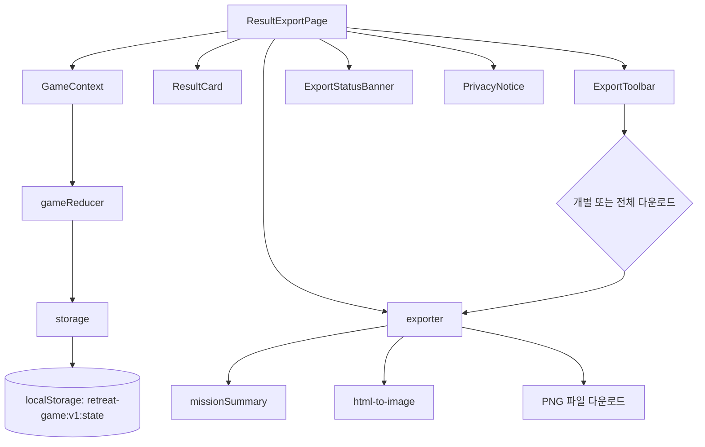

# 008 Result Export Page Implementation Plan

## 개요

이 문서는 `UC-008 결과물 미리보기 및 이미지 다운로드`를 구현하기 위한 페이지 단위 계획이다. 기준 문서는 `docs/requirement.md`, `docs/prd.md`, `docs/userflow.md`, `docs/database.md`, `docs/usecases/008-result-export/spec.md`, 선행 문서 `docs/usecases/007-reflection/spec.md`, 연관 문서 `docs/usecases/009-session-recovery/spec.md`이다.

MVP에서는 이미지 다운로드를 우선 구현한다. PDF 다운로드는 버튼, 라이브러리, 파일 생성 로직 모두 MVP 범위에서 제외하고, 데이터 조합 구조만 향후 PDF 생성에 재사용 가능하게 둔다.

### 구현 모듈 목록

| 모듈 | 권장 위치 | 설명 |
| --- | --- | --- |
| `ResultExportPage` | `src/pages/export/ResultExportPage.tsx` | 결과물 미리보기와 다운로드를 담당하는 최상위 페이지 |
| `ResultCard` | `src/features/export/components/ResultCard.tsx` | 이미지로 변환될 팀별 결과 카드 |
| `ExportToolbar` | `src/features/export/components/ExportToolbar.tsx` | 팀 선택, 개별 다운로드, 전체 다운로드, 재시도 버튼 |
| `ExportStatusBanner` | `src/features/export/components/ExportStatusBanner.tsx` | 다운로드 성공, 실패, 모바일 대체 저장 안내 표시 |
| `PrivacyNotice` | `src/shared/components/PrivacyNotice.tsx` | 결과물 생성 전 개인정보 검토 안내 |
| `exporter` | `src/features/export/exporter.ts` | 결과 카드 데이터 구성, 파일명 생성, 이미지 다운로드 실행 |
| `missionSummary` | `src/features/export/missionSummary.ts` | 2~4단계 데이터를 팀별 미션 요약으로 변환 |
| `gameReducer` 확장 | `src/app/state/gameReducer.ts` | `SET_EXPORT_SELECTION`, `EXPORT_STARTED`, `EXPORT_SUCCEEDED`, `EXPORT_FAILED` 액션 처리 |
| `storage` 사용 | `src/shared/storage/storage.ts` | `exportState`를 `localStorage`에 임시 저장 |

## 관련 유스케이스

- 선행: `UC-007 팀별 소감 작성`
- 주 대상: `UC-008 결과물 미리보기 및 이미지 다운로드`
- 연관: `UC-009 임시 저장 및 세션 복구`
- 후행: 없음

## 상태 / 입력 / 검증

### 참조 상태

| 상태 경로 | 타입 기준 | 사용 목적 |
| --- | --- | --- |
| `state.game.title` | `string` | 결과 카드 제목 |
| `state.game.config.topicKeyword` | `string` | 주제 키워드 표시 |
| `state.game.stage.currentRoute` | `"export"` | 현재 페이지 접근 여부 판단 |
| `state.teams` | `Team[]` | 팀별 결과 카드 생성 |
| `state.itemAssignments` | `ItemAssignment[]` | 팀별 획득 아이템 요약 |
| `state.missionResponses.stage3` | `Stage3MissionResponse[]` | 3단계 협업 미션 요약 |
| `state.missionResponses.stage4` | `Stage4MissionResponse[]` | 4단계 최종 미션 요약 |
| `state.reflections` | `Reflection[]` | 결과 카드 본문 |
| `state.exportState` | `ExportState` | 선택 팀, 마지막 다운로드 시각, 오류 상태 |

### 결과 카드 데이터

`ResultCard`는 저장 상태를 직접 조합하지 않고 `exporter.buildResultCards(state)`의 결과를 받는다.

```ts
type ResultCardData = {
  teamId: string;
  teamName: string;
  title: string;
  topicKeyword: string;
  itemSummary: string[];
  missionSummary: string[];
  reflection: {
    memorableWord: string;
    solvedTogether: string;
    thankfulPoint: string;
    actionCommitment: string;
  };
};
```

### 검증 규칙

- 팀 목록이 없으면 다운로드를 제한한다.
- 모든 다운로드 대상 팀에 소감 4개 필드가 있어야 한다.
- 게임 제목이 없으면 기본값 `수련회 팀빌딩 성경 미션 게임`을 사용한다.
- 주제 키워드가 없으면 기본값 `공동체`를 사용한다.
- 미션 요약이 일부 누락되어도 카드에는 "미션 기록 없음"처럼 누락을 명확히 표시한다.
- 다운로드 전 개인정보 검토 안내를 표시한다.
- 이미지 변환 실패 시 미리보기는 유지하고 재시도 가능 상태로 둔다.

### Reducer 액션 계획

```ts
type GameAction =
  | { type: "SET_EXPORT_SELECTION"; payload: { selectedTeamIds: string[] } }
  | { type: "EXPORT_STARTED"; payload: { selectedTeamIds: string[] } }
  | { type: "EXPORT_SUCCEEDED"; payload: { downloadedAt: string } }
  | { type: "EXPORT_FAILED"; payload: { errorMessage: string } };
```

액션 처리 원칙:

- `SET_EXPORT_SELECTION`: 선택한 팀 ID를 `exportState.selectedTeamIds`에 저장한다.
- `EXPORT_STARTED`: 이전 `lastError`를 초기화하고 선택 팀을 저장한다.
- `EXPORT_SUCCEEDED`: `lastDownloadedAt`을 갱신하고 `lastError`를 제거한다.
- `EXPORT_FAILED`: `lastError`를 저장하고 미리보기 데이터는 유지한다.

## 컴포넌트 계획

### `ResultExportPage`

책임:

- 결과 카드 데이터를 구성한다.
- 팀별 카드 ref를 관리해 이미지 변환 대상 DOM을 제공한다.
- 개별 다운로드와 전체 다운로드를 실행한다.
- 다운로드 성공/실패 액션을 dispatch한다.
- `PrivacyNotice`를 다운로드 버튼 근처에 배치한다.

상태가 아닌 파생값:

- `resultCards`
- `downloadableTeamIds`
- `selectedCards`
- `hasMissingRequiredData`
- `canDownload`

### `ResultCard`

책임:

- 이미지로 변환될 고정 폭 카드 레이아웃을 렌더링한다.
- 게임 제목, 주제, 팀 이름, 아이템, 미션 요약, 소감을 표시한다.
- 긴 텍스트는 줄바꿈과 최대 영역을 고려해 잘림을 최소화한다.

구현 주의:

- 다운로드 대상 DOM은 배경색을 명시한다.
- 외부 이미지나 원격 폰트에 의존하지 않는다.
- 카드 내부 텍스트가 겹치지 않도록 섹션 간 여백과 최소 높이를 둔다.

### `ExportToolbar`

책임:

- 팀 선택 UI를 제공한다.
- 선택 팀 다운로드, 전체 다운로드, 실패 시 재시도 버튼을 제공한다.
- PDF 다운로드 버튼은 MVP에서 제공하지 않는다. 문구가 필요하면 "PDF는 추후 지원" 정도의 비활성 안내만 허용한다.

### `ExportStatusBanner`

책임:

- 다운로드 성공 시각을 표시한다.
- `exportState.lastError`가 있으면 오류와 재시도 방법을 표시한다.
- 모바일 자동 다운로드 제한 가능성을 짧게 안내한다.

### `exporter`

책임:

- `buildResultCards(state)`로 카드 데이터를 조합한다.
- `createExportFileName(teamName, savedAt)`으로 안전한 파일명을 생성한다.
- `downloadElementAsImage(element, fileName)`으로 DOM을 PNG 이미지로 변환하고 다운로드한다.

라이브러리 가정:

- MVP에서는 `html-to-image` 또는 동등한 DOM-to-PNG 라이브러리를 사용한다.
- PDF 생성을 위한 `jspdf` 등은 MVP 의존성에 추가하지 않는다.

## Mermaid 모듈 관계도



## Implementation Plan

1. `src/features/export/missionSummary.ts`를 만든다.
   - 팀 ID 기준으로 아이템, 3단계 답변, 4단계 최종 답변을 읽어 짧은 문자열 배열로 변환한다.
   - 데이터가 누락되면 빈 문자열이 아니라 명확한 대체 문구를 반환한다.

2. `src/features/export/exporter.ts`를 만든다.
   - `buildResultCards(state)`는 `teams` 순서대로 `ResultCardData[]`를 반환한다.
   - `validateResultCard(card)`는 소감 필수값 누락 여부를 반환한다.
   - `createExportFileName(teamName, date)`는 공백과 특수문자를 정리한 `.png` 파일명을 반환한다.
   - `downloadElementAsImage(element, fileName)`는 이미지 변환 라이브러리를 감싸고 오류를 throw한다.

3. `src/app/state/gameReducer.ts`에 export 액션을 추가한다.
   - `SET_EXPORT_SELECTION`, `EXPORT_STARTED`, `EXPORT_SUCCEEDED`, `EXPORT_FAILED`를 처리한다.
   - 다운로드 파일 자체는 상태나 `localStorage`에 저장하지 않는다.

4. `src/features/export/components/ResultCard.tsx`를 만든다.
   - props는 `card: ResultCardData`만 받는다.
   - 카드 최상위 요소는 ref 연결이 가능하도록 `forwardRef`를 사용한다.
   - 게임 제목, 주제, 팀명, 미션 요약, 소감 4개 항목을 빠짐없이 표시한다.

5. `src/features/export/components/ExportToolbar.tsx`를 만든다.
   - 팀 선택 목록과 다운로드 버튼을 렌더링한다.
   - 다운로드 대상이 없거나 필수 데이터가 누락되면 버튼을 비활성화한다.
   - 전체 다운로드는 팀 카드들을 순차 처리하도록 호출한다.

6. `src/features/export/components/ExportStatusBanner.tsx`를 만든다.
   - `lastDownloadedAt`, `lastError`, `isExporting` 상태에 따라 메시지를 표시한다.
   - 실패 시 재시도 버튼은 마지막 선택 팀 기준으로 다시 다운로드를 호출한다.

7. `src/pages/export/ResultExportPage.tsx`를 만든다.
   - `buildResultCards`로 미리보기 데이터를 만든다.
   - 팀별 `ResultCard` ref를 `Map<string, HTMLElement>` 형태로 관리한다.
   - 개별 다운로드는 해당 팀 ref만 이미지로 변환한다.
   - 전체 다운로드는 팀 순서대로 하나씩 변환하고 실패 시 중단 또는 실패 카드 표시를 제공한다.

8. 라우팅 또는 화면 전환 테이블에 `currentRoute === "export"`일 때 `ResultExportPage`가 표시되도록 연결한다.

9. 결과물 QA를 위해 미리보기 카드의 폭, 배경색, 텍스트 줄바꿈, 버튼 영역과 카드 영역 분리를 CSS로 고정한다.

## 테스트 / QA 체크

### Unit Test

- `buildResultCards`는 팀 2~6개에 대해 같은 순서의 카드 데이터를 반환한다.
- 소감 누락 팀이 있으면 `validateResultCard`가 실패를 반환한다.
- `createExportFileName`은 팀 이름의 공백과 특수문자를 정리하고 `.png` 확장자를 붙인다.
- 미션 데이터가 없을 때도 결과 카드 생성은 실패하지 않고 대체 문구를 포함한다.
- `EXPORT_FAILED`는 `exportState.lastError`를 갱신하고 `lastDownloadedAt`을 제거하지 않는다.

### Component Test

- 모든 소감이 완료된 상태에서 팀별 결과 카드가 표시된다.
- 선택 팀 다운로드 버튼은 선택한 팀이 있을 때만 활성화된다.
- 전체 다운로드 버튼은 필수 데이터가 모두 있을 때만 활성화된다.
- 이미지 변환 함수가 실패하면 오류 배너와 재시도 버튼이 표시된다.
- 개인정보 검토 안내가 다운로드 실행 전 화면에 보인다.

### Manual QA

- 모바일 폭에서 결과 카드 내용이 버튼과 겹치지 않는다.
- 긴 소감이 줄바꿈되어 카드 밖으로 튀어나가지 않는다.
- 개별 팀 다운로드가 PNG 파일로 실행된다.
- 전체 다운로드가 팀 순서대로 실행된다.
- 다운로드 실패 후 미리보기 내용이 사라지지 않는다.
- PDF 파일이 생성되지 않는다.
- 서버 업로드나 외부 제출 기능이 없다.
