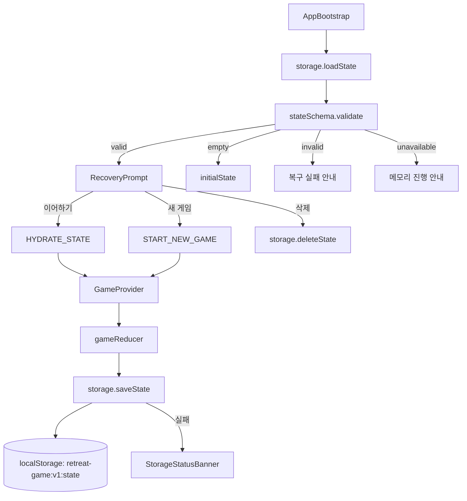
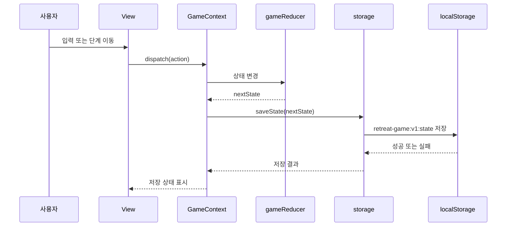

# 009 Session Recovery Implementation Plan

## 개요

이 문서는 `UC-009 임시 저장 및 세션 복구`를 구현하기 위한 페이지 및 상태 관리 계획이다. 기준 문서는 `docs/requirement.md`, `docs/prd.md`, `docs/userflow.md`, `docs/database.md`, `docs/usecases/009-session-recovery/spec.md`, 연관 문서 `docs/usecases/007-reflection/spec.md`, `docs/usecases/008-result-export/spec.md`이다.

세션 복구는 독립 페이지라기보다 앱 시작 시점의 게이트 화면과 전역 상태 저장 계층이다. 구현은 Vite + React + TypeScript, Context + `useReducer`, `localStorage` MVP를 전제로 한다. 서버 저장, 로그인, 다중 기기 동기화, 여러 탭 자동 병합은 구현하지 않는다.

### 구현 모듈 목록

| 모듈 | 권장 위치 | 설명 |
| --- | --- | --- |
| `AppBootstrap` | `src/app/AppBootstrap.tsx` | 앱 시작 시 저장 상태를 확인하고 복구/새 게임 분기를 결정 |
| `RecoveryPrompt` | `src/features/recovery/components/RecoveryPrompt.tsx` | 이어하기, 새 게임 시작, 저장 데이터 삭제 선택 화면 |
| `StorageStatusBanner` | `src/features/recovery/components/StorageStatusBanner.tsx` | 저장 실패, 복구 실패, 여러 탭 가능성 안내 |
| `storage` | `src/shared/storage/storage.ts` | `localStorage` read/write/remove, JSON 파싱, 버전 검증 |
| `stateSchema` | `src/shared/storage/stateSchema.ts` | `GameStorageState` 최소 런타임 검증 |
| `initialState` | `src/app/state/initialState.ts` | 새 게임 초기 상태 생성 |
| `GameProvider` | `src/app/state/GameContext.tsx` | reducer 상태 제공 및 상태 변경 자동 저장 연결 |
| `gameReducer` 확장 | `src/app/state/gameReducer.ts` | `HYDRATE_STATE`, `START_NEW_GAME`, `DELETE_SAVED_STATE`, `STORAGE_SAVE_FAILED` 처리 |

## 관련 유스케이스

- 주 대상: `UC-009 임시 저장 및 세션 복구`
- 연관: `UC-007 팀별 소감 작성`
- 연관: `UC-008 결과물 이미지 다운로드`
- 후행: 저장된 `currentRoute`에 따라 모든 진행 단계

## 상태 / 입력 / 검증

### localStorage 키

| 키 | 용도 |
| --- | --- |
| `retreat-game:v1:state` | 현재 게임 전체 진행 상태 저장 |

### 필수 저장 스키마

`docs/database.md`의 `GameStorageState`를 기준으로 한다.

```ts
type GameStorageState = {
  schemaVersion: 1;
  appVersion?: string;
  savedAt: string;
  game: GameMeta;
  teams: Team[];
  participants: Participant[];
  personalityResponses: PersonalityResponse[];
  personalityResults: PersonalityResult[];
  teamAssignments: TeamAssignment[];
  itemAssignments: ItemAssignment[];
  itemRevealState: ItemRevealState;
  missionResponses: MissionResponses;
  usedItems: UsedItem[];
  reflections: Reflection[];
  exportState: ExportState;
};
```

### 복구 입력

| 사용자 입력 | 처리 |
| --- | --- |
| 이어하기 | 검증된 저장 상태를 reducer에 hydrate |
| 새 게임 시작 | 기존 저장 데이터 삭제 또는 초기 상태로 덮어쓰기 후 설정 화면으로 이동 |
| 저장 데이터 삭제 | `retreat-game:v1:state` 삭제 후 삭제 완료 상태 표시 |
| 초기화 확인 | 실수 방지를 위해 새 게임/삭제 전에 확인 |

### 검증 규칙

- 저장 문자열이 없으면 새 게임 초기 상태를 사용한다.
- JSON 파싱 실패 시 정상 이어하기를 제공하지 않는다.
- `schemaVersion !== 1`이면 정상 이어하기를 제공하지 않는다.
- 필수 최상위 필드가 없으면 정상 이어하기를 제공하지 않는다.
- `game.stage.currentRoute`가 허용된 라우트가 아니면 정상 이어하기를 제공하지 않는다.
- `localStorage` 접근이 실패해도 현재 메모리 상태 진행은 유지한다.
- 같은 기기를 여러 행사에서 사용할 수 있으므로 삭제/초기화 흐름과 개인정보 안내를 제공한다.

### Reducer 액션 계획

```ts
type GameAction =
  | { type: "HYDRATE_STATE"; payload: { state: GameStorageState } }
  | { type: "START_NEW_GAME"; payload?: { confirmed: boolean } }
  | { type: "DELETE_SAVED_STATE"; payload?: { confirmed: boolean } }
  | { type: "STORAGE_SAVE_FAILED"; payload: { errorMessage: string } }
  | { type: "STORAGE_RECOVERY_FAILED"; payload: { errorMessage: string } };
```

액션 처리 원칙:

- `HYDRATE_STATE`: 저장 상태 전체를 메모리 상태로 복원한다.
- `START_NEW_GAME`: 새 초기 상태를 생성하고 `currentRoute = "setup"`으로 둔다.
- `DELETE_SAVED_STATE`: 저장소 삭제는 `storage` 모듈에서 수행하고 reducer에는 삭제 완료 UI 상태만 반영한다.
- `STORAGE_SAVE_FAILED`: 현재 진행 상태를 버리지 않고 저장 실패 메시지만 표시한다.
- `STORAGE_RECOVERY_FAILED`: 복구 불가 상태를 표시하고 새 게임 또는 삭제 선택을 가능하게 한다.

## 컴포넌트 계획

### `AppBootstrap`

책임:

- 앱 마운트 시 `storage.loadState()`를 한 번 호출한다.
- 결과에 따라 `RecoveryPrompt` 또는 현재 라우트 페이지를 렌더링한다.
- 저장 상태가 없으면 초기 상태로 `GameProvider`를 시작한다.
- 저장 상태가 손상되었으면 복구 실패 화면을 보여준다.

부트스트랩 상태:

```ts
type BootstrapStatus =
  | "checking"
  | "no-saved-state"
  | "recoverable"
  | "invalid-saved-state"
  | "storage-unavailable";
```

### `RecoveryPrompt`

책임:

- 저장된 게임 제목, 주제 키워드, 현재 단계, 저장 시각을 표시한다.
- 이어하기 버튼을 제공한다.
- 새 게임 시작 버튼은 확인 단계를 거친다.
- 저장 데이터 삭제 버튼은 확인 단계를 거친다.
- 개인정보 및 이전 행사 데이터 노출 주의 안내를 제공한다.

### `StorageStatusBanner`

책임:

- `LOCAL_STORAGE_UNAVAILABLE`, `LOCAL_STORAGE_SAVE_FAILED`, `STORED_STATE_INVALID`, `MULTI_TAB_STATE_CONFLICT`에 해당하는 안내를 표시한다.
- 저장 실패가 게임 진행 중단이 아님을 명확히 보여준다.

### `storage`

책임:

- `loadState()`로 저장 문자열을 읽고 파싱한다.
- `saveState(state)`로 `savedAt`을 갱신하고 저장한다.
- `deleteState()`로 단일 키를 삭제한다.
- 예외를 삼키지 않고 호출자에게 typed result를 반환한다.

권장 반환 타입:

```ts
type LoadStateResult =
  | { status: "empty" }
  | { status: "valid"; state: GameStorageState }
  | { status: "invalid"; reason: string }
  | { status: "unavailable"; reason: string };
```

## Mermaid 모듈 관계도



## Context 자동 저장 흐름



## Implementation Plan

1. `src/shared/storage/stateSchema.ts`를 만든다.
   - `isValidGameStorageState(value)`를 구현한다.
   - `schemaVersion`, `savedAt`, `game`, `teams`, `participants`, `missionResponses`, `reflections`, `exportState`의 존재를 최소 검증한다.
   - 복잡한 성향 점수나 미션 정답까지 검증하지 않는다.

2. `src/shared/storage/storage.ts`를 만든다.
   - 상수 `STORAGE_KEY = "retreat-game:v1:state"`를 정의한다.
   - `loadState()`, `saveState(state)`, `deleteState()`를 구현한다.
   - `saveState`는 저장 직전에 `savedAt`을 현재 ISO 문자열로 갱신한다.
   - `localStorage` 접근 예외는 `unavailable` 또는 실패 result로 반환한다.

3. `src/app/state/initialState.ts`를 만든다.
   - `createInitialState()`는 `schemaVersion: 1`, 기본 게임 제목, 기본 주제 `공동체`, 빈 배열, 초기 `exportState`를 포함한다.
   - 초기 라우트는 `setup`으로 둔다.

4. `src/app/state/gameReducer.ts`에 복구 액션을 추가한다.
   - `HYDRATE_STATE`는 검증된 저장 상태만 받는 전제로 전체 상태를 교체한다.
   - `START_NEW_GAME`은 `createInitialState()` 결과로 상태를 교체한다.
   - 저장 실패와 복구 실패는 UI에서 읽을 수 있는 `runtimeStatus` 또는 동등한 메모리 전용 상태에 반영한다.

5. `src/app/state/GameContext.tsx`를 만든다.
   - `useReducer(gameReducer, initialState)`를 사용한다.
   - 상태 변경 후 `storage.saveState`를 호출하는 effect를 둔다.
   - 부트스트랩 직후 첫 hydrate 중복 저장을 피하기 위한 `hasHydrated` ref를 둔다.

6. `src/features/recovery/components/RecoveryPrompt.tsx`를 만든다.
   - 저장된 제목, 주제, 현재 route, 저장 시각을 보여준다.
   - 이어하기는 `HYDRATE_STATE`를 dispatch한다.
   - 새 게임과 삭제는 확인 상태를 거친 뒤 실행한다.
   - 개인정보 및 같은 기기 사용 주의 안내를 표시한다.

7. `src/features/recovery/components/StorageStatusBanner.tsx`를 만든다.
   - 저장 실패, 복구 실패, 저장소 사용 불가 메시지를 표시한다.
   - 닫을 수 있는 배너로 만들되 중요한 실패는 현재 페이지에서 확인 가능해야 한다.

8. `src/app/AppBootstrap.tsx`를 만든다.
   - 앱 시작 시 `loadState()` 결과를 확인한다.
   - `empty`면 새 초기 상태로 앱을 시작한다.
   - `valid`면 `RecoveryPrompt`를 먼저 보여준다.
   - `invalid`면 새 게임 시작과 저장 데이터 삭제 옵션을 보여준다.
   - `unavailable`이면 메모리 진행 안내 후 새 게임을 시작할 수 있게 한다.

9. 모든 페이지의 단계 이동, 소감 저장, 다운로드 상태 변경이 reducer 상태를 통해 일어나도록 연결한다.
   - 페이지가 직접 `localStorage`를 쓰지 않는다.
   - 저장 책임은 `storage`와 `GameContext`로 모은다.

## 테스트 / QA 체크

### Unit Test

- `loadState`는 키가 없을 때 `{ status: "empty" }`를 반환한다.
- 깨진 JSON 문자열은 `{ status: "invalid" }`를 반환한다.
- `schemaVersion`이 1이 아니면 invalid를 반환한다.
- 필수 최상위 필드가 누락되면 invalid를 반환한다.
- 정상 상태는 `{ status: "valid", state }`를 반환한다.
- `saveState`는 `savedAt`을 갱신하고 단일 키에 저장한다.
- `deleteState`는 `retreat-game:v1:state`를 삭제한다.

### Component Test

- 정상 저장 상태가 있으면 `RecoveryPrompt`가 표시된다.
- 이어하기를 누르면 저장된 `currentRoute` 화면으로 이동한다.
- 새 게임 시작은 확인 전에는 저장 데이터를 지우지 않는다.
- 저장 데이터 삭제는 확인 후에만 실행된다.
- 손상 데이터가 있으면 복구 실패 안내와 새 게임/삭제 옵션이 표시된다.
- 저장소 사용 불가 상태에서도 앱이 빈 화면으로 멈추지 않는다.

### Manual QA

- 소감 작성 후 새로고침하면 `reflection` 경로와 입력값이 복구된다.
- 결과물 다운로드 실패 상태에서 새로고침해도 미리보기 데이터가 유지된다.
- 새 게임 시작 후 이전 팀명과 소감이 보이지 않는다.
- 저장 데이터 삭제 후 다시 접속하면 이어하기가 표시되지 않는다.
- 비공개 브라우징 또는 저장소 차단 환경에서 현재 탭 진행은 가능하다.
- 여러 탭에서 사용 시 마지막 저장 우선 가능성을 안내할 수 있다.
- 서버 요청, 로그인, 계정 정보 입력이 없다.
