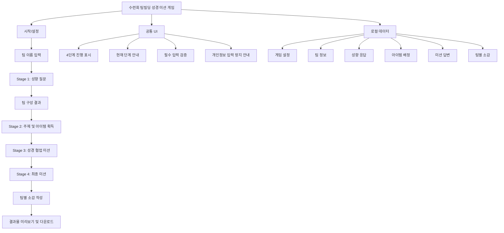

# 팀빌딩 성경 미션 게임 웹앱 PRD

## 1. 제품 개요

### 1.1 제품명

수련회 팀빌딩 성경 미션 게임 웹앱

### 1.2 제품 목적

이 웹앱은 수련회, 성경학교, 여름행사 등 교회 교육 현장에서 참가자들이 팀을 이루고 협력 미션을 수행하도록 돕는 브라우저 기반 게임이다. 진행자는 별도 서버, 로그인, 회원가입 없이 한 기기에서 게임을 시작하고, 팀 구성부터 미션 진행, 팀별 소감 다운로드까지 한 흐름으로 운영할 수 있다.

### 1.3 핵심 가치

- 개인정보 없이 팀빌딩 게임을 진행한다.
- 간단한 성향 질문으로 팀 구성을 돕는다.
- 성경 기반 퀴즈와 협업 미션으로 교육적 목적을 유지한다.
- 4단계 스테이지 흐름으로 진행 상황을 쉽게 파악한다.
- 마지막 소감을 이미지 파일로 저장해 진행자에게 제출할 수 있다.

### 1.4 MVP 범위

MVP는 서버와 로그인 없이 동작하는 단일 브라우저 웹앱으로 구현한다. 모든 진행 데이터는 브라우저 상태 또는 `localStorage`에 임시 저장하며, 실명, 연락처, 이메일, 생년월일 등 개인정보는 입력받지 않는다.

MVP에 포함한다.

- 게임 시작 설정
- 팀 이름 입력
- 4단계 스테이지 진행 표시
- 1단계 간이 성향 질문 및 팀 자동 구성
- 2단계 주제 키워드 표시 및 팀별 아이템 랜덤 배정
- 3단계 성경 기반 협업 퀴즈
- 4단계 최종 미션
- 팀별 소감 작성
- 결과 이미지 다운로드

MVP에서 제외한다.

- 회원가입, 로그인, 계정 관리
- 서버 저장, 실시간 동기화
- 온라인 랭킹, 채팅, 결제
- PDF 다운로드
- 관리자용 콘텐츠 편집 화면
- 팀 배정 드래그 앤 드롭 수정
- QR 공유

## 2. Stakeholders

| 구분 | 역할 | 주요 관심사 |
| --- | --- | --- |
| 진행자 | 수련회, 성경학교, 여름행사 담당 교역자 또는 교사 | 빠른 준비, 쉬운 진행, 개인정보 미수집, 결과물 제출 |
| 참가자 | 초등 고학년, 중고등부, 청년부 참가자 | 재미있는 팀 활동, 쉬운 참여, 협업 미션, 현재 단계 확인 |
| 보조 진행자 | 조별 교사, 스태프 | 팀별 진행 보조, 정답/완료 확인, 소감 제출 확인 |
| 교육 기획자 | 행사 주제와 성경 교육 흐름을 설계하는 담당자 | 주제와 미션의 연결성, 연령대 적합성, 콘텐츠 확장성 |

## 3. 타겟 사용자 Segment

### 3.1 Primary Segment: 진행자

- 교회 수련회, 성경학교, 여름행사에서 게임을 운영하는 교역자 또는 교사
- 기술 설정에 많은 시간을 쓰기 어렵다.
- 참가자 개인정보를 수집하지 않고 현장에서 바로 사용할 수 있는 도구가 필요하다.
- 한 화면을 참가자와 함께 보면서 단계별로 게임을 진행할 가능성이 높다.

### 3.2 Secondary Segment: 참가자

- 초등 고학년부터 청년부까지의 교회 행사 참가자
- 팀 단위로 화면을 함께 보거나, 진행자가 안내하는 화면을 따라간다.
- 정답 경쟁보다 팀원과 상의하고 표현하는 활동에 참여한다.

### 3.3 Supporting Segment: 보조 진행자

- 각 팀의 활동을 돕는 교사 또는 스태프
- 팀별 답변, 아이템, 소감 제출 상태를 확인한다.
- MVP에서는 별도 권한이나 계정을 갖지 않는다.

## 4. 포함 페이지

### 4.1 시작/설정 페이지

진행자가 게임 제목, 전체 참가 인원 수, 원하는 팀 수를 입력한다. 기본 주제는 "공동체"로 제공하되, 진행자가 주제 키워드를 수정할 수 있다.

주요 기능:

- 게임 제목 표시
- 전체 인원 수 입력
- 팀 수 입력
- 주제 키워드 입력 또는 기본값 사용
- 다음 단계 이동

### 4.2 팀 이름 입력 페이지

진행자가 팀 수에 맞춰 팀 이름을 입력한다. 팀 이름은 결과물에도 사용되므로 실명이나 개인정보를 넣지 않도록 안내한다.

주요 기능:

- 팀 수 기반 입력칸 자동 생성
- 팀 이름 필수 입력 검증
- 개인정보 입력 방지 안내

### 4.3 1단계 성향 질문 페이지

참가자별 임시 번호 또는 별칭 기준으로 간이 성향 질문에 답한다. 이 질문은 전문 성향검사가 아니라 팀 구성을 돕기 위한 간단한 활동이다.

주요 기능:

- 참가자 번호 자동 생성
- 5개 기본 성향 질문 제공
- 응답 점수화
- 아이디어형, 분석형, 실행형, 격려형 성향 산출

### 4.4 팀 구성 결과 페이지

성향 결과를 바탕으로 팀이 한쪽 성향에 치우치지 않도록 자동 배정된 결과를 보여준다.

주요 기능:

- 팀별 참가자 목록 표시
- 팀별 성향 분포 표시
- 다음 스테이지 이동

### 4.5 2단계 주제 및 아이템 획득 페이지

전체 게임 주제 키워드를 제시하고, 팀별로 힌트와 도구 아이템을 랜덤 배정한다. MVP에서는 사다리타기 애니메이션 대신 랜덤 매칭 방식으로 구현할 수 있다.

주요 기능:

- 주제 키워드 표시
- 팀별 아이템 랜덤 배정
- 아이템 결과 공개
- 다음 스테이지 이동

### 4.6 3단계 성경 협업 미션 페이지

팀원들이 함께 상의해서 푸는 성경 기반 퀴즈와 미션을 제공한다. 기본 대상은 중고등부, 기본 주제는 공동체로 설정한다.

주요 기능:

- 성경 퀴즈 5개 제공
- 팀별 답변 입력
- 힌트/아이템 활용 안내
- 완료 후 다음 스테이지 이동

### 4.7 4단계 최종 미션 페이지

앞 단계에서 얻은 힌트와 도구를 활용하여 팀별 최종 답변 또는 선언문을 작성한다.

주요 기능:

- 최종 미션 안내
- 팀별 최종 답변 입력
- 완료 상태 표시
- 소감 작성 단계 이동

### 4.8 팀별 소감 작성 페이지

각 팀이 오늘의 활동을 돌아보고 소감을 작성한다.

주요 기능:

- 팀 이름 자동 표시
- 기억에 남는 말씀 또는 키워드 입력
- 함께 해결한 것 입력
- 감사한 점 입력
- 앞으로 실천하고 싶은 것 입력

### 4.9 결과물 미리보기 및 다운로드 페이지

팀별 소감과 미션 요약을 결과 카드 형태로 보여주고 이미지로 다운로드한다.

주요 기능:

- 팀별 결과 카드 미리보기
- 행사명 또는 게임 제목 표시
- 주제 키워드 표시
- 팀별 소감 표시
- 완료한 미션 요약 표시
- 이미지 다운로드

## 5. 사용자 여정

### 5.1 진행자 여정

타겟 유저 segment: Primary Segment 진행자

1. `시작/설정 페이지`에서 전체 참가 인원 수, 팀 수, 주제 키워드를 입력한다.
2. `팀 이름 입력 페이지`에서 팀 이름을 입력한다.
3. `1단계 성향 질문 페이지`를 참가자 순서에 맞게 진행한다.
4. `팀 구성 결과 페이지`에서 자동 배정 결과를 확인하고 팀을 안내한다.
5. `2단계 주제 및 아이템 획득 페이지`에서 주제를 소개하고 팀별 아이템을 공개한다.
6. `3단계 성경 협업 미션 페이지`에서 팀별 퀴즈 풀이를 진행한다.
7. `4단계 최종 미션 페이지`에서 최종 답변 또는 팀 선언문 작성을 안내한다.
8. `팀별 소감 작성 페이지`에서 팀별 소감을 입력하게 한다.
9. `결과물 미리보기 및 다운로드 페이지`에서 팀별 이미지를 다운로드해 제출받는다.

### 5.2 참가자 여정

타겟 유저 segment: Secondary Segment 참가자

1. `1단계 성향 질문 페이지`에서 본인 번호 또는 별칭에 맞춰 간단한 질문에 답한다.
2. `팀 구성 결과 페이지`에서 본인이 속한 팀을 확인한다.
3. `2단계 주제 및 아이템 획득 페이지`에서 팀이 받은 힌트나 도구를 확인한다.
4. `3단계 성경 협업 미션 페이지`에서 팀원들과 성경 퀴즈를 함께 해결한다.
5. `4단계 최종 미션 페이지`에서 팀의 최종 답변을 함께 완성한다.
6. `팀별 소감 작성 페이지`에서 팀 활동을 돌아보고 소감을 작성한다.

### 5.3 보조 진행자 여정

타겟 유저 segment: Supporting Segment 보조 진행자

1. `팀 구성 결과 페이지`에서 담당 팀을 확인한다.
2. `3단계 성경 협업 미션 페이지`에서 팀별 토론과 답변 작성을 돕는다.
3. `4단계 최종 미션 페이지`에서 완료 여부를 확인한다.
4. `결과물 미리보기 및 다운로드 페이지`에서 팀별 제출 결과를 확인한다.

## 6. IA Tree



텍스트 구조:

```txt
수련회 팀빌딩 성경 미션 게임
├── 시작/설정
├── 팀 이름 입력
├── Stage 1: 성향 질문
│   └── 팀 구성 결과
├── Stage 2: 주제 및 아이템 획득
├── Stage 3: 성경 협업 미션
├── Stage 4: 최종 미션
├── 팀별 소감 작성
└── 결과물 미리보기 및 다운로드
```

## 7. 핵심 기능 요구사항

### 7.1 게임 설정

- 진행자는 전체 인원 수와 팀 수를 입력할 수 있어야 한다.
- 팀 수는 2~6팀을 기본 범위로 한다.
- 참가 인원은 팀 수보다 같거나 많아야 한다.
- 주제 키워드는 기본값 "공동체"를 제공한다.

### 7.2 팀 구성

- 참가자는 실명이 아닌 참가자 번호 또는 별칭으로 표시한다.
- 성향 질문은 5개를 기본 제공한다.
- 성향 분류는 아이디어형, 분석형, 실행형, 격려형으로 한다.
- 팀 자동 배정은 성향이 최대한 섞이도록 구성한다.
- 팀별 인원 차이는 최대 1명까지 허용한다.

### 7.3 스테이지 진행

- 전체 진행은 4단계 스테이지로 표시한다.
- 현재 단계, 완료 단계, 남은 단계를 시각적으로 구분한다.
- 필수 입력이 누락된 상태에서는 다음 단계로 이동할 수 없다.

### 7.4 아이템 배정

- 팀 이름과 아이템 목록을 기준으로 팀별 아이템을 랜덤 배정한다.
- 기본 아이템은 6개를 제공한다.
- 각 팀은 최소 1개의 힌트 또는 도구를 받는다.

### 7.5 성경 협업 미션

- 기본 콘텐츠는 중고등부 대상, 주제 "공동체" 기준으로 제공한다.
- 3단계에는 성경 기반 협업 퀴즈 5개를 제공한다.
- 팀별 답변을 입력할 수 있어야 한다.
- 정답 경쟁보다 토론과 협업을 유도하는 문항을 포함한다.

### 7.6 최종 미션

- 팀별로 최종 답변, 선언문, 실천 약속 중 하나의 결과물을 작성한다.
- 앞 단계에서 얻은 힌트나 아이템을 활용하도록 안내한다.
- 진행자는 완료 여부를 확인하고 다음 단계로 넘어갈 수 있다.

### 7.7 소감 및 이미지 다운로드

- 팀별로 소감 입력 항목을 제공한다.
- 결과물에는 게임 제목, 팀 이름, 주제 키워드, 미션 요약, 팀별 소감이 포함되어야 한다.
- MVP에서는 이미지 다운로드를 우선 구현한다.
- 다운로드 실패 시 다시 시도할 수 있어야 한다.

## 8. 데이터 및 저장 정책

### 8.1 저장 방식

- 서버 저장은 하지 않는다.
- 로그인과 계정은 사용하지 않는다.
- 브라우저 메모리 상태를 기본으로 사용한다.
- 새로고침 복구를 위해 `localStorage` 임시 저장을 사용할 수 있다.

### 8.2 저장 데이터

- 게임 설정
- 팀 이름
- 참가자 번호 또는 별칭
- 성향 질문 응답
- 팀 배정 결과
- 팀별 아이템
- 팀별 미션 답변
- 팀별 소감

### 8.3 개인정보 원칙

- 실명, 전화번호, 생년월일, 이메일은 입력받지 않는다.
- 화면과 결과물에는 개인정보 입력을 피하라는 안내를 제공한다.
- 결과물은 사용자의 브라우저에서 생성하고 다운로드한다.

## 9. 비기능 요구사항

### 9.1 사용성

- 모바일 브라우저 우선으로 설계한다.
- 한 화면에서 현재 단계와 다음 행동이 명확해야 한다.
- 버튼과 입력창은 행사 현장에서 빠르게 조작할 수 있을 만큼 충분히 크게 제공한다.

### 9.2 성능

- 외부 API 없이 동작한다.
- 일반적인 모바일 브라우저에서 빠르게 로드되어야 한다.
- 이미지 생성 시 긴 대기 시간이 발생하지 않도록 결과물 레이아웃을 단순하게 유지한다.

### 9.3 접근성

- 상태 구분은 색상만으로 하지 않는다.
- 주요 안내 문구는 짧고 명확하게 작성한다.
- 참가자가 함께 보는 화면이므로 본문 글자는 충분히 크게 표시한다.

### 9.4 안정성

- 필수 입력 누락 시 다음 단계 이동을 막고 이유를 보여준다.
- 새로고침 후에도 가능한 범위에서 진행 중 데이터를 복구한다.
- 다운로드 실패 시 재시도 버튼을 제공한다.

## 10. 구현 방향

### 10.1 권장 모듈

| 모듈 | 역할 |
| --- | --- |
| `gameConfig` | 게임 제목, 주제, 단계 정의, 기본 콘텐츠 관리 |
| `teamBuilder` | 성향 질문 점수화 및 팀 자동 배정 |
| `stageManager` | 현재 단계, 완료 상태, 다음 단계 이동 관리 |
| `itemMatcher` | 팀별 랜덤 아이템 배정 |
| `missionEngine` | 퀴즈, 미션, 답변, 완료 조건 관리 |
| `reflectionManager` | 팀별 소감 입력 및 검증 |
| `exporter` | 결과물 이미지 변환 및 다운로드 |
| `storage` | 브라우저 로컬 저장소 기반 임시 저장 |

### 10.2 구현 원칙

- 콘텐츠 데이터와 화면 로직을 분리한다.
- 팀 배정, 아이템 배정, 미션 판정 로직은 독립 테스트가 가능하도록 작성한다.
- 서버 저장이나 관리자 화면이 나중에 추가될 수 있도록 데이터 구조를 명확히 둔다.
- MVP에서는 복잡한 실시간 기능보다 한 기기 진행 흐름을 우선한다.

## 11. 성공 기준

- 진행자가 별도 계정 없이 게임을 시작하고 종료할 수 있다.
- 참가자 개인정보 없이 팀 구성과 미션 진행이 가능하다.
- 4단계 진행 상태가 명확하게 표시된다.
- 팀별 협업이 필요한 성경 기반 질문과 활동이 포함된다.
- 팀별 소감을 이미지 파일로 저장해 제출할 수 있다.
- 최소 기능만으로 실제 수련회 또는 성경학교 현장에서 사용할 수 있다.

## 12. MVP 구현 결정 사항

아래 항목은 MVP 구현 기준으로 확정한다.

- 우선 대상 연령대: 중고등부
- 기본 주제: 공동체
- 기본 성경 본문: 요한복음 13장 34-35절, 고린도전서 12장 12-27절, 전도서 4장 9-10절을 기본 콘텐츠 후보로 사용한다.
- MVP 운영 방식: 한 기기에서 진행자가 조작하고 참가자가 함께 보는 방식
- 결과물 형식: 이미지 다운로드만 MVP에 포함하고 PDF 다운로드는 MVP 이후 확장 기능으로 분리한다.
