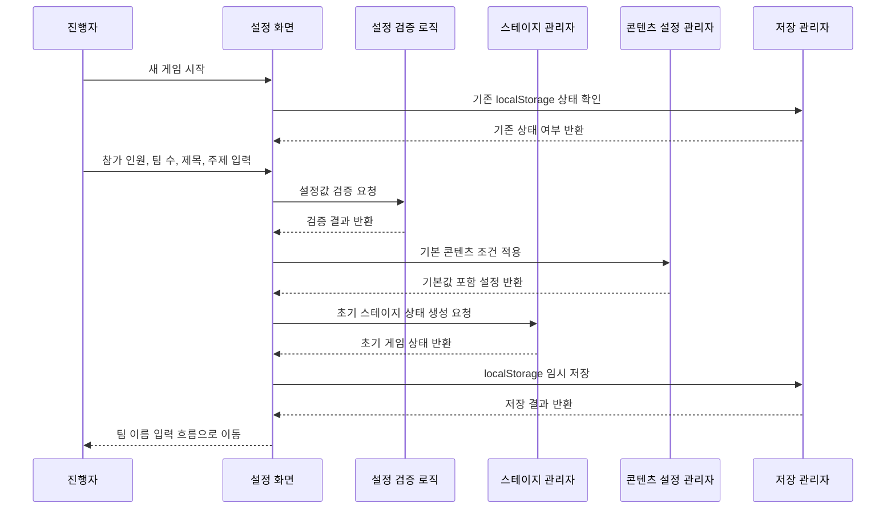

# 유스케이스 ID: UC-001

### 제목
게임 시작 및 기본 설정

---

## 1. 개요

### 1.1 목적
진행자가 수련회 팀빌딩 성경 미션 게임을 시작하기 전에 전체 참가 인원, 팀 수, 게임 제목, 주제 키워드 등 최소 설정을 입력하여 4단계 게임 진행 상태를 초기화한다.

### 1.2 범위
이 유스케이스는 MVP의 시작/설정 화면에서 새 게임 상태를 생성하고 다음 흐름인 팀 이름 및 참가자 식별자 준비로 이동 가능한 상태를 만드는 것까지 다룬다.

포함 범위:
- 게임 제목 설정
- 전체 참가 인원 수 입력
- 원하는 팀 수 입력
- 주제 키워드 설정
- 기본 연령대와 난이도 적용
- 4단계 스테이지 진행 상태 초기화
- 브라우저 상태 및 `localStorage` 임시 저장

제외 범위:
- 회원가입, 로그인, 계정 관리
- 서버 데이터베이스 저장
- 참가자 실명, 연락처, 이메일 등 개인정보 입력
- 관리자용 콘텐츠 편집 화면
- 팀 이름 입력 및 참가자 식별자 수정

### 1.3 액터
- **주요 액터**: 진행자
- **부 액터**: 보조 진행자, 참가자

---

## 2. 선행 조건

- 진행자는 웹앱 시작 화면에 접근할 수 있어야 한다.
- 브라우저는 기본적인 클라이언트 상태 관리를 지원해야 한다.
- MVP는 한 기기에서 진행자가 조작하고 참가자가 함께 보는 운영 방식을 우선한다.
- 사용자는 로그인하지 않는다.
- 시스템은 개인정보 전용 입력 필드를 제공하지 않는다.

---

## 3. 참여 컴포넌트

- **설정 화면**: 게임 제목, 참가 인원 수, 팀 수, 주제 키워드 입력을 제공한다.
- **설정 검증 로직**: 참가 인원 수와 팀 수의 유효성을 확인한다.
- **스테이지 관리자**: 4단계 진행 상태를 초기화하고 현재 경로를 관리한다.
- **콘텐츠 설정 관리자**: 기본 주제, 기본 연령대, 기본 난이도, 기본 콘텐츠 세트를 선택한다.
- **저장 관리자**: 생성된 게임 상태를 메모리 상태와 `localStorage`에 임시 저장한다.

---

## 4. 기본 플로우 (Basic Flow)

### 4.1 단계별 흐름

1. **진행자**: 게임 시작 화면에 진입한다.
   - 입력: 없음
   - 처리: 시스템은 기존 저장 상태 존재 여부를 확인한다.
   - 출력: 새 게임 시작 또는 이어하기 가능한 상태를 표시한다.

2. **진행자**: 새 게임 시작을 선택한다.
   - 입력: 새 게임 시작 실행
   - 처리: 기존 임시 저장 데이터가 있으면 덮어쓰기 또는 초기화가 필요한 상태로 판단한다.
   - 출력: 기본 설정 입력 화면을 표시한다.

3. **진행자**: 기본 설정을 입력한다.
   - 입력: 게임 제목, 전체 참가 인원 수, 팀 수, 주제 키워드
   - 처리: 비어 있는 선택 항목에는 기본값을 적용한다.
   - 출력: 입력값과 유효성 상태를 표시한다.

4. **설정 검증 로직**: 입력값을 검증한다.
   - 입력: 참가 인원 수, 팀 수, 주제 키워드
   - 처리: 참가 인원 수가 1 이상인지, 팀 수가 2 이상인지, 팀 수가 참가 인원 수를 초과하지 않는지 확인한다.
   - 출력: 유효한 경우 다음 단계 이동 가능 상태를 반환한다.

5. **스테이지 관리자**: 새 게임 진행 상태를 생성한다.
   - 입력: 검증된 설정값
   - 처리: 현재 경로를 `team-names`로 이동 가능한 상태로 만들고, 1단계는 준비 상태, 2~4단계는 잠금 상태로 초기화한다.
   - 출력: 초기 게임 상태를 생성한다.

6. **저장 관리자**: 게임 상태를 임시 저장한다.
   - 입력: 초기 게임 상태
   - 처리: `retreat-game:v1:state` 키에 단일 상태 객체로 저장한다.
   - 출력: 저장 성공 또는 저장 실패 상태를 반환한다.

7. **시스템**: 팀 이름 및 참가자 식별자 흐름으로 이동한다.
   - 입력: 설정 완료 상태
   - 처리: 설정값을 다음 유스케이스에서 참조할 수 있도록 유지한다.
   - 출력: 팀 이름 입력 화면으로 이동한다.

### 4.2 시퀀스 다이어그램

---

## 5. 대안 플로우 (Alternative Flows)

### 5.1 대안 플로우 1: 저장된 게임 이어하기

**시작 조건**: 앱 시작 시 `retreat-game:v1:state`에 유효한 저장 상태가 존재한다.

**단계**:
1. 시스템은 저장 상태의 `schemaVersion`과 필수 필드를 검증한다.
2. 진행자에게 이어하기와 새 게임 시작 선택지를 제공한다.
3. 진행자가 이어하기를 선택하면 저장된 `currentRoute` 또는 `currentStage` 기준으로 이동한다.
4. 진행자가 새 게임 시작을 선택하면 기존 데이터를 삭제하거나 새 초기 상태로 덮어쓴다.

**결과**: 진행자는 이전 상태를 이어서 진행하거나 새 게임을 시작한다.

### 5.2 대안 플로우 2: 주제 키워드 미입력

**시작 조건**: 진행자가 주제 키워드를 입력하지 않고 설정 완료를 시도한다.

**단계**:
1. 시스템은 기본 주제 키워드 `공동체`를 적용한다.
2. 기본 콘텐츠 세트도 중고등부, 일반 난이도 기준으로 연결한다.
3. 설정 완료를 허용한다.

**결과**: 기본 주제와 콘텐츠 세트로 게임을 진행할 수 있다.

### 5.3 대안 플로우 3: localStorage 사용 불가

**시작 조건**: 브라우저 정책, 비공개 모드, 저장 용량 문제 등으로 `localStorage` 저장이 실패한다.

**단계**:
1. 시스템은 현재 탭의 메모리 상태로 게임을 계속 진행한다.
2. 저장 실패 안내를 표시한다.
3. 새로고침 시 진행 상태가 복구되지 않을 수 있음을 안내한다.

**결과**: 게임은 계속 진행되지만 새로고침 복구는 보장하지 않는다.

---

## 6. 예외 플로우 (Exception Flows)

### 6.1 예외 상황 1: 참가 인원 수가 유효하지 않음

**발생 조건**: 참가 인원 수가 비어 있거나 1보다 작거나 숫자로 해석할 수 없다.

**처리 방법**:
1. 다음 단계 이동을 막는다.
2. 참가 인원 수 입력 위치에 오류 상태를 표시한다.
3. 유효한 숫자 입력을 요구한다.

**에러 코드**: `INVALID_PARTICIPANT_COUNT`

**사용자 메시지**: "전체 참가 인원 수를 1명 이상으로 입력해 주세요."

### 6.2 예외 상황 2: 팀 수가 유효하지 않음

**발생 조건**: 팀 수가 2보다 작거나 참가 인원 수보다 많거나 MVP 기본 범위인 2~6팀을 벗어난다.

**처리 방법**:
1. 다음 단계 이동을 막는다.
2. 팀 수 입력 위치에 오류 상태를 표시한다.
3. 허용 범위를 안내한다.

**에러 코드**: `INVALID_TEAM_COUNT`

**사용자 메시지**: "팀 수는 2~6팀 사이이며 참가 인원 수보다 많을 수 없습니다."

### 6.3 예외 상황 3: 저장 데이터 손상

**발생 조건**: 저장된 JSON 파싱 실패, 필수 필드 누락, `schemaVersion` 불일치가 발생한다.

**처리 방법**:
1. 이어하기를 제한한다.
2. 새 게임 시작 또는 저장 데이터 삭제 흐름을 제공한다.
3. 손상 데이터를 자동으로 서버에 전송하지 않는다.

**에러 코드**: `INVALID_SAVED_STATE`

**사용자 메시지**: "저장된 진행 상태를 불러올 수 없습니다. 새 게임을 시작해 주세요."

---

## 7. 후행 조건 (Post-conditions)

### 7.1 성공 시

- **데이터베이스 변경**: 외부 데이터베이스 변경은 없다.
- **로컬 저장 변경**: `retreat-game:v1:state`에 초기 게임 상태가 저장된다.
- **시스템 상태**: 게임 설정, 콘텐츠 선택, 스테이지 초기 상태가 생성된다.
- **외부 시스템**: 외부 API 또는 외부 저장소와 상호작용하지 않는다.

### 7.2 실패 시

- **데이터 롤백**: 유효하지 않은 설정은 저장하지 않는다.
- **시스템 상태**: 시작/설정 화면에 머무른다.
- **저장 상태**: 기존 저장 데이터는 사용자의 명시적 새 게임 시작 또는 삭제 전까지 유지한다.

---

## 8. 비기능 요구사항

### 8.1 성능
- 설정 검증과 초기 상태 생성은 일반적인 모바일 브라우저에서 즉시 체감될 만큼 빠르게 처리되어야 한다.
- 외부 API 호출 없이 동작해야 한다.

### 8.2 보안
- 로그인, 비밀번호, 계정 정보를 요구하지 않는다.
- 개인정보 전용 입력 필드를 제공하지 않는다.
- 입력 데이터는 사용자의 브라우저 안에서만 관리한다.

### 8.3 가용성
- 네트워크 연결 없이도 기본 설정 흐름을 사용할 수 있어야 한다.
- `localStorage`가 실패해도 현재 세션 진행은 가능해야 한다.

---

## 9. UI/UX 요구사항

### 9.1 화면 구성
- 게임 제목 입력 또는 기본 제목 표시
- 전체 참가 인원 수 입력
- 팀 수 입력
- 주제 키워드 입력 또는 기본값 표시
- 개인정보 미수집 안내
- 기존 저장 상태가 있을 경우 이어하기와 새 게임 시작 선택
- 다음 단계 이동 버튼

### 9.2 사용자 경험
- 모바일 브라우저에서 숫자 입력과 다음 단계 이동이 쉽게 이루어져야 한다.
- 필수 입력 누락 시 이동을 막고 이유를 바로 보여줘야 한다.
- 현재 설정이 이후 팀 구성과 미션 진행에 사용된다는 점을 짧게 안내해야 한다.
- 설정 완료 후 사용자는 자연스럽게 팀 이름 입력으로 이어져야 한다.

---

## 10. 테스트 시나리오

### 10.1 성공 케이스

| 테스트 케이스 ID | 입력값 | 기대 결과 |
|----------------|--------|----------|
| TC-UC001-01 | 참가자 12명, 팀 4개, 주제 공동체 | 초기 게임 상태가 생성되고 팀 이름 입력으로 이동한다. |
| TC-UC001-02 | 참가자 7명, 팀 3개, 주제 미입력 | 기본 주제 공동체가 적용되고 다음 단계로 이동한다. |
| TC-UC001-03 | 기존 저장 상태 존재 후 이어하기 선택 | 저장된 현재 경로로 복구된다. |
| TC-UC001-04 | 기존 저장 상태 존재 후 새 게임 시작 선택 | 기존 상태 초기화 확인 후 새 설정 흐름을 시작한다. |

### 10.2 실패 케이스

| 테스트 케이스 ID | 입력값 | 기대 결과 |
|----------------|--------|----------|
| TC-UC001-05 | 참가자 0명, 팀 2개 | 다음 단계 이동이 막히고 참가 인원 오류가 표시된다. |
| TC-UC001-06 | 참가자 3명, 팀 4개 | 다음 단계 이동이 막히고 팀 수 오류가 표시된다. |
| TC-UC001-07 | 참가자 10명, 팀 1개 | 다음 단계 이동이 막히고 최소 팀 수 오류가 표시된다. |
| TC-UC001-08 | 손상된 localStorage 상태 | 이어하기를 제한하고 새 게임 시작을 안내한다. |

---

## 11. 관련 유스케이스

- **선행 유스케이스**: 없음
- **후행 유스케이스**: UC-002 팀 이름 및 참가자 식별자 준비
- **연관 유스케이스**: 임시 저장 및 복구, 스테이지 진행 표시

---

## 12. 변경 이력

| 버전 | 날짜 | 작성자 | 변경 내용 |
|------|------|--------|-----------|
| 1.0 | 2026-05-26 | Codex | 초기 작성 |

---

## 부록

### A. 용어 정의
- **진행자**: 게임을 시작하고 단계 이동을 조작하는 교역자, 교사, 스태프.
- **주제 키워드**: 성경 미션 전체를 묶는 핵심 단어. MVP 기본값은 `공동체`.
- **localStorage**: 같은 브라우저에서 새로고침 복구를 위해 사용하는 임시 저장소.

### B. 참고 자료
- `docs/requirement.md`
- `docs/prd.md`
- `docs/userflow.md`
- `docs/database.md`
