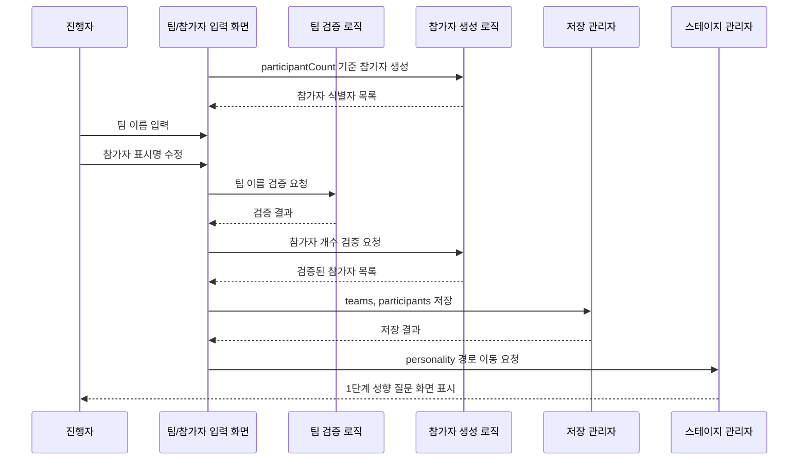

# 유스케이스 ID: UC-002

### 제목
팀 이름 및 참가자 식별자 준비

---

## 1. 개요

### 1.1 목적
게임 설정에서 정한 팀 수와 참가 인원 수를 기준으로 팀 이름과 참가자 식별자를 준비하여 1단계 성향 질문을 진행할 수 있는 상태를 만든다.

### 1.2 범위
이 유스케이스는 팀 이름 입력, 기본 팀 이름 자동 생성, 참가자 번호 기반 식별자 자동 생성, 선택적 별칭 수정, 입력 검증, `localStorage` 임시 저장을 다룬다.

포함 범위:
- 팀 수만큼 팀 이름 입력 슬롯 생성
- 팀 이름 자동 생성 및 수정
- 참가 인원 수만큼 참가자 식별자 생성
- 참가자 번호 또는 별칭 기반 표시명 관리
- 팀 이름 필수 입력 및 중복 검증
- 개인정보 미수집 안내
- 브라우저 상태 및 `localStorage` 임시 저장

제외 범위:
- 실명, 전화번호, 이메일 등 개인정보 수집
- 로그인 또는 계정 기반 참가자 관리
- 서버 기반 참가자 데이터 저장
- 팀 자동 배정 실행
- 팀 배정 드래그 앤 드롭 수정

### 1.3 액터
- **주요 액터**: 진행자
- **부 액터**: 참가자, 보조 진행자

---

## 2. 선행 조건

- UC-001 게임 시작 및 기본 설정이 성공적으로 완료되어야 한다.
- `participantCount`와 `teamCount`가 유효한 값으로 존재해야 한다.
- 시스템은 현재 경로를 `team-names`로 표시할 수 있어야 한다.
- 사용자는 로그인하지 않는다.
- 참가자 식별은 실명 대신 참가자 번호 또는 별칭을 사용한다.

---

## 3. 참여 컴포넌트

- **팀 이름 입력 화면**: 팀 수에 맞는 팀 이름 입력 영역을 제공한다.
- **참가자 식별자 준비 화면 또는 섹션**: 참가자 번호와 선택적 별칭 입력을 제공한다.
- **팀 검증 로직**: 팀 이름 누락, 공백, 중복, 길이 제한을 확인한다.
- **참가자 생성 로직**: 참가 인원 수만큼 내부 ID와 표시명을 생성한다.
- **저장 관리자**: 팀 목록과 참가자 목록을 메모리 상태와 `localStorage`에 임시 저장한다.
- **스테이지 관리자**: 다음 흐름인 1단계 성향 질문으로 이동 가능한지 판단한다.

---

## 4. 기본 플로우 (Basic Flow)

### 4.1 단계별 흐름

1. **시스템**: 설정값을 기준으로 팀 입력 슬롯을 생성한다.
   - 입력: `teamCount`
   - 처리: 팀 수만큼 빈 팀 입력 슬롯을 만든다.
   - 출력: 팀 이름 입력 목록을 표시한다.

2. **시스템**: 참가자 식별자를 자동 생성한다.
   - 입력: `participantCount`
   - 처리: 내부 ID와 `참가자 1`, `참가자 2` 형태의 표시명을 생성한다.
   - 출력: 참가자 식별자 목록을 표시한다.

3. **진행자**: 팀 이름을 입력한다.
   - 입력: 팀 이름 목록
   - 처리: 입력값의 앞뒤 공백을 제거하고 화면 상태에 반영한다.
   - 출력: 팀 이름 입력 상태를 표시한다.

4. **진행자**: 필요한 경우 참가자 표시명을 수정한다.
   - 입력: 참가자 번호 또는 별칭
   - 처리: 내부 ID는 유지하고 화면 표시명만 수정한다.
   - 출력: 수정된 참가자 식별자 목록을 표시한다.

5. **팀 검증 로직**: 팀 이름을 검증한다.
   - 입력: 팀 이름 목록
   - 처리: 비어 있음, 공백만 포함, 중복, 표시 길이를 확인한다.
   - 출력: 유효성 결과와 오류 위치를 반환한다.

6. **참가자 생성 로직**: 참가자 목록의 개수를 검증한다.
   - 입력: 참가자 목록, `participantCount`
   - 처리: 참가자 수가 설정값과 일치하는지 확인한다.
   - 출력: 성향 질문에 사용할 참가자 목록을 반환한다.

7. **저장 관리자**: 팀과 참가자 데이터를 임시 저장한다.
   - 입력: 팀 목록, 참가자 목록
   - 처리: `retreat-game:v1:state`의 `teams`와 `participants`를 갱신한다.
   - 출력: 저장 결과를 반환한다.

8. **시스템**: 1단계 성향 질문으로 이동한다.
   - 입력: 유효한 팀 목록과 참가자 목록
   - 처리: 현재 경로를 `personality`로 전환한다.
   - 출력: 성향 질문 응답 화면을 표시한다.

### 4.2 시퀀스 다이어그램

---

## 5. 대안 플로우 (Alternative Flows)

### 5.1 대안 플로우 1: 팀 이름 자동 생성

**시작 조건**: 진행자가 팀 이름을 직접 정하지 않고 자동 생성을 선택한다.

**단계**:
1. 시스템은 팀 수만큼 기본 팀 이름을 생성한다.
2. 기본 이름은 중복되지 않아야 한다.
3. 진행자는 자동 생성된 이름을 필요에 따라 수정할 수 있다.

**결과**: 팀 이름 입력 시간을 줄이고 다음 단계로 진행할 수 있다.

### 5.2 대안 플로우 2: 참가자 식별자 자동 유지

**시작 조건**: 진행자가 참가자별 별칭을 입력하지 않는다.

**단계**:
1. 시스템은 `참가자 1`부터 `참가자 N`까지 자동 표시명을 유지한다.
2. 내부 ID는 표시명과 별도로 유지한다.
3. 성향 질문은 자동 표시명 기준으로 진행된다.

**결과**: 개인정보 입력 없이 빠르게 성향 질문을 시작할 수 있다.

### 5.3 대안 플로우 3: 설정 변경으로 팀 수 또는 참가자 수 변경

**시작 조건**: 진행자가 이전 설정 화면으로 돌아가 `teamCount` 또는 `participantCount`를 변경한다.

**단계**:
1. 팀 수가 증가하면 추가 팀 입력 슬롯을 생성한다.
2. 팀 수가 감소하면 초과 팀 데이터를 제거하기 전에 영향 범위를 안내한다.
3. 참가자 수가 변경되면 참가자 목록을 재계산한다.
4. 이후 성향 응답이나 팀 배정 결과가 있다면 재생성이 필요함을 표시한다.

**결과**: 현재 설정값과 팀/참가자 데이터가 일관되게 유지된다.

---

## 6. 예외 플로우 (Exception Flows)

### 6.1 예외 상황 1: 팀 이름 누락

**발생 조건**: 하나 이상의 팀 이름이 비어 있거나 공백만 포함한다.

**처리 방법**:
1. 다음 단계 이동을 막는다.
2. 누락된 팀 입력칸을 표시한다.
3. 직접 입력 또는 자동 생성을 안내한다.

**에러 코드**: `TEAM_NAME_REQUIRED`

**사용자 메시지**: "모든 팀 이름을 입력해 주세요."

### 6.2 예외 상황 2: 팀 이름 중복

**발생 조건**: 같은 팀 이름이 두 개 이상 존재한다.

**처리 방법**:
1. 다음 단계 이동을 막는다.
2. 중복된 팀 이름을 표시한다.
3. 서로 다른 이름을 입력하도록 안내한다.

**에러 코드**: `DUPLICATE_TEAM_NAME`

**사용자 메시지**: "팀 이름은 서로 다르게 입력해 주세요."

### 6.3 예외 상황 3: 참가자 목록 불일치

**발생 조건**: 참가자 목록 개수가 설정된 전체 참가 인원 수와 일치하지 않는다.

**처리 방법**:
1. 참가자 목록을 설정값 기준으로 다시 생성한다.
2. 복구 가능한 기존 표시명은 순서대로 유지한다.
3. 성향 질문으로 이동하기 전에 목록 개수를 다시 검증한다.

**에러 코드**: `PARTICIPANT_COUNT_MISMATCH`

**사용자 메시지**: "참가자 목록을 전체 인원 수에 맞게 다시 준비했습니다."

### 6.4 예외 상황 4: 개인정보로 보이는 입력

**발생 조건**: 시스템이 자유 입력값에 개인정보가 포함되었을 가능성을 감지하거나 결과물 표시 전 검토가 필요한 경우.

**처리 방법**:
1. 저장 자체를 서버로 전송하지 않는다.
2. 개인정보 입력을 피하라는 안내를 표시한다.
3. 진행자가 입력값을 검토하고 수정할 수 있게 한다.

**에러 코드**: `PRIVACY_REVIEW_RECOMMENDED`

**사용자 메시지**: "실명, 전화번호, 이메일 대신 팀 이름이나 별칭을 사용해 주세요."

---

## 7. 후행 조건 (Post-conditions)

### 7.1 성공 시

- **데이터베이스 변경**: 외부 데이터베이스 변경은 없다.
- **로컬 저장 변경**: `teams`와 `participants`가 `retreat-game:v1:state`에 저장된다.
- **시스템 상태**: 성향 질문 응답에 필요한 팀과 참가자 데이터가 준비된다.
- **외부 시스템**: 외부 API 또는 외부 저장소와 상호작용하지 않는다.

### 7.2 실패 시

- **데이터 롤백**: 유효하지 않은 팀 이름은 확정 저장하지 않는다.
- **시스템 상태**: 팀 이름 및 참가자 준비 화면에 머무른다.
- **저장 상태**: 이전에 유효했던 저장 상태가 있으면 유지한다.

---

## 8. 비기능 요구사항

### 8.1 성능
- 팀과 참가자 목록 생성은 참가 인원 수 기준으로 즉시 처리되어야 한다.
- 외부 API 호출 없이 동작해야 한다.

### 8.2 보안
- 개인정보 전용 입력 필드를 제공하지 않는다.
- 팀 이름과 참가자 표시명은 사용자의 브라우저 안에서만 관리한다.
- 참가자 내부 ID는 화면 표시명과 분리하여 관리한다.

### 8.3 가용성
- `localStorage` 저장 실패 시에도 현재 세션에서는 팀 이름과 참가자 목록을 유지해야 한다.
- 새로고침 후 저장 상태가 유효하면 팀과 참가자 목록을 복구해야 한다.

---

## 9. UI/UX 요구사항

### 9.1 화면 구성
- 설정된 팀 수만큼의 팀 이름 입력칸
- 팀 이름 자동 생성 버튼
- 참가자 번호 또는 별칭 목록
- 참가자 표시명 자동 생성 상태
- 개인정보 미수집 안내
- 다음 단계 이동 버튼
- 필수 입력 오류 표시

### 9.2 사용자 경험
- 진행자가 행사 현장에서 빠르게 팀 이름을 입력하거나 자동 생성할 수 있어야 한다.
- 참가자 실명을 요구하지 않는 구조가 명확해야 한다.
- 팀 이름은 이후 결과물에도 사용되므로 너무 긴 이름은 표시 제한 또는 안내가 필요하다.
- 참가자 표시명은 중복될 수 있어도 내부 ID는 중복되지 않아야 한다.

---

## 10. 테스트 시나리오

### 10.1 성공 케이스

| 테스트 케이스 ID | 입력값 | 기대 결과 |
|----------------|--------|----------|
| TC-UC002-01 | 팀 수 4, 팀 이름 4개 입력 | 팀 목록이 저장되고 성향 질문으로 이동한다. |
| TC-UC002-02 | 참가자 12명, 별칭 미입력 | `참가자 1`~`참가자 12`가 자동 생성된다. |
| TC-UC002-03 | 팀 이름 자동 생성 실행 | 팀 수만큼 중복 없는 기본 팀 이름이 생성된다. |
| TC-UC002-04 | 참가자 일부 별칭 수정 | 내부 ID는 유지되고 표시명만 변경된다. |

### 10.2 실패 케이스

| 테스트 케이스 ID | 입력값 | 기대 결과 |
|----------------|--------|----------|
| TC-UC002-05 | 팀 이름 하나 비움 | 다음 단계 이동이 막히고 누락 오류가 표시된다. |
| TC-UC002-06 | 같은 팀 이름 2개 입력 | 다음 단계 이동이 막히고 중복 오류가 표시된다. |
| TC-UC002-07 | 참가자 목록 개수 손상 | 설정 인원 수 기준으로 참가자 목록을 재생성한다. |
| TC-UC002-08 | 실명 또는 연락처로 보이는 값 입력 | 개인정보 대신 별칭 사용 안내를 표시한다. |

---

## 11. 관련 유스케이스

- **선행 유스케이스**: UC-001 게임 시작 및 기본 설정
- **후행 유스케이스**: UC-003 성향 질문 기반 팀 자동 구성
- **연관 유스케이스**: 임시 저장 및 복구, 개인정보 비수집 흐름

---

## 12. 변경 이력

| 버전 | 날짜 | 작성자 | 변경 내용 |
|------|------|--------|-----------|
| 1.0 | 2026-05-26 | Codex | 초기 작성 |

---

## 부록

### A. 용어 정의
- **팀 이름**: 게임 진행과 결과물에 표시되는 팀의 이름.
- **참가자 식별자**: 실명이 아닌 참가자 번호 또는 별칭으로 참가자를 구분하는 표시명.
- **내부 ID**: 화면 표시명과 별도로 시스템이 참가자와 팀을 구분하기 위해 사용하는 값.

### B. 참고 자료
- `docs/requirement.md`
- `docs/prd.md`
- `docs/userflow.md`
- `docs/database.md`
