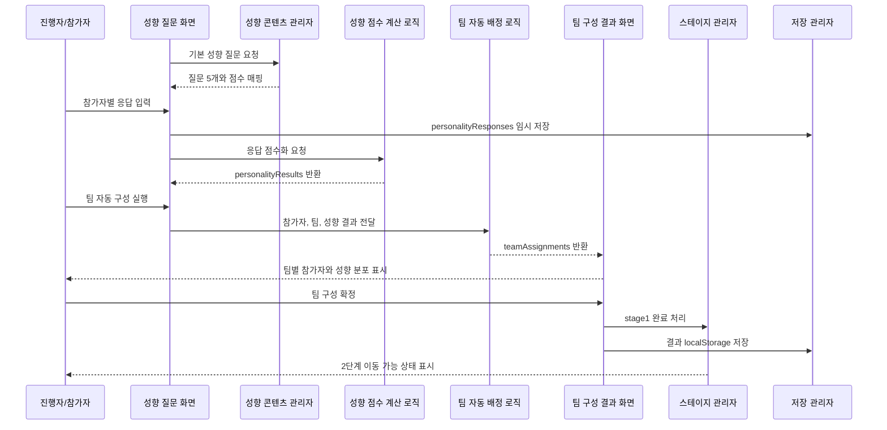

# 유스케이스 ID: UC-003

### 제목
성향 질문 기반 팀 자동 구성

---

## 1. 개요

### 1.1 목적
참가자별 간이 성향 질문 응답을 점수화하여 아이디어형, 분석형, 실행형, 격려형 성향을 산출하고, 팀별 인원과 성향이 최대한 균형을 이루도록 자동 배정 결과를 생성한다.

### 1.2 범위
이 유스케이스는 1단계 성향 질문 응답, 성향 점수 계산, 팀 자동 배정, 팀 구성 결과 확정, 1단계 완료 상태 저장을 다룬다.

포함 범위:
- 기본 성향 질문 5개 제공
- 참가자별 응답 입력 및 수정
- 성향 점수 계산
- 대표 성향과 보조 성향 산출
- 팀별 인원 균형 계산
- 성향 분산을 고려한 팀 자동 배정
- 팀별 성향 분포 표시
- 1단계 완료 상태 저장
- 브라우저 상태 및 `localStorage` 임시 저장

제외 범위:
- 전문 심리검사 또는 공식 성향검사 제공
- 개인정보 기반 참가자 분석
- 서버 기반 팀 배정 저장
- 드래그 앤 드롭 방식의 수동 팀 조정
- 점수판 또는 경쟁 랭킹

### 1.3 액터
- **주요 액터**: 진행자
- **부 액터**: 참가자, 보조 진행자

---

## 2. 선행 조건

- UC-001 게임 시작 및 기본 설정이 완료되어야 한다.
- UC-002 팀 이름 및 참가자 식별자 준비가 완료되어야 한다.
- `teams`와 `participants`가 유효한 상태로 존재해야 한다.
- 성향 질문 기본 콘텐츠가 앱에 포함되어 있어야 한다.
- 사용자는 로그인하지 않는다.
- 참가자는 실명 대신 참가자 번호 또는 별칭으로 표시되어야 한다.

---

## 3. 참여 컴포넌트

- **성향 질문 화면**: 참가자별 성향 질문 응답 입력을 제공한다.
- **성향 질문 콘텐츠 관리자**: 기본 성향 질문 5개와 점수 매핑을 제공한다.
- **성향 점수 계산 로직**: 응답을 아이디어형, 분석형, 실행형, 격려형 점수로 변환한다.
- **팀 자동 배정 로직**: 인원 균형과 성향 분산을 고려해 참가자를 팀에 배정한다.
- **팀 구성 결과 화면**: 팀별 참가자 목록과 성향 분포를 표시한다.
- **스테이지 관리자**: 1단계 완료 상태와 2단계 이동 가능 상태를 관리한다.
- **저장 관리자**: 성향 응답, 성향 결과, 팀 배정 결과를 `localStorage`에 임시 저장한다.

---

## 4. 기본 플로우 (Basic Flow)

### 4.1 단계별 흐름

1. **시스템**: 성향 질문 화면을 표시한다.
   - 입력: 참가자 목록, 기본 성향 질문 세트
   - 처리: 참가자별 응답 입력 상태를 초기화한다.
   - 출력: 참가자 식별자와 5개 질문을 표시한다.

2. **참가자 또는 진행자**: 참가자별 질문 응답을 입력한다.
   - 입력: 각 질문에 대한 선택값
   - 처리: 응답값을 참가자 ID와 질문 ID 기준으로 임시 저장한다.
   - 출력: 참가자별 응답 진행 상태를 표시한다.

3. **성향 점수 계산 로직**: 응답을 점수화한다.
   - 입력: 참가자별 질문 응답
   - 처리: 각 응답을 아이디어형, 분석형, 실행형, 격려형 점수로 변환한다.
   - 출력: 참가자별 성향 점수와 대표 성향을 반환한다.

4. **시스템**: 모든 필수 응답 완료 여부를 확인한다.
   - 입력: 참가자 수, 응답 목록
   - 처리: 각 참가자가 모든 필수 질문에 답했는지 검증한다.
   - 출력: 팀 자동 배정 실행 가능 상태를 표시한다.

5. **진행자**: 팀 자동 구성 생성을 실행한다.
   - 입력: 팀 자동 구성 실행
   - 처리: 팀 배정 로직을 호출한다.
   - 출력: 팀 구성 결과 생성 중 상태를 표시한다.

6. **팀 자동 배정 로직**: 팀별 목표 인원 수를 계산한다.
   - 입력: 참가자 수, 팀 수
   - 처리: 팀별 인원 차이가 최대 1명이 되도록 목표 인원을 정한다.
   - 출력: 팀별 목표 인원 범위를 반환한다.

7. **팀 자동 배정 로직**: 성향 분산을 고려해 참가자를 배정한다.
   - 입력: 참가자별 대표 성향, 보조 성향, 팀별 목표 인원
   - 처리: 같은 성향이 한 팀에 몰리지 않도록 참가자를 분산하고 남는 인원은 인원 균형을 우선해 배정한다.
   - 출력: 팀별 참가자 목록과 성향 분포를 생성한다.

8. **팀 구성 결과 화면**: 배정 결과를 표시한다.
   - 입력: 팀 배정 결과
   - 처리: 팀별 참가자 목록과 성향 분포를 읽기 쉬운 형태로 구성한다.
   - 출력: 팀 구성 결과를 표시한다.

9. **진행자**: 팀 구성을 확정한다.
   - 입력: 팀 구성 확정 실행
   - 처리: `teamAssignments`와 `stageProgress.stage1`을 갱신한다.
   - 출력: 2단계 이동 가능 상태를 표시한다.

10. **저장 관리자**: 1단계 결과를 임시 저장한다.
   - 입력: 성향 응답, 성향 결과, 팀 배정 결과, 1단계 완료 상태
   - 처리: `retreat-game:v1:state`에 관련 데이터를 저장한다.
   - 출력: 저장 결과를 반환한다.

### 4.2 시퀀스 다이어그램

---

## 5. 대안 플로우 (Alternative Flows)

### 5.1 대안 플로우 1: 모든 응답이 비슷한 성향으로 치우침

**시작 조건**: 대부분의 참가자가 같은 대표 성향으로 계산된다.

**단계**:
1. 시스템은 성향 균형보다 팀별 인원 균형을 우선한다.
2. 가능한 범위에서 보조 성향을 참고해 분산한다.
3. 팀별 성향 분포에 편중 가능성을 표시한다.

**결과**: 완전한 성향 균형이 어렵더라도 인원 균형이 맞는 팀 배정 결과를 제공한다.

### 5.2 대안 플로우 2: 응답 수정 후 재배정

**시작 조건**: 진행자 또는 참가자가 응답 완료 후 일부 응답을 수정한다.

**단계**:
1. 시스템은 기존 성향 결과와 팀 배정 결과가 최신이 아님을 표시한다.
2. 수정된 응답을 다시 점수화한다.
3. 진행자가 팀 자동 구성을 다시 실행한다.
4. 기존 팀 배정 결과는 새 결과로 덮어쓴다.

**결과**: 최신 응답 기준의 팀 구성 결과가 생성된다.

### 5.3 대안 플로우 3: 기본 질문 데이터 누락

**시작 조건**: 선택된 콘텐츠 세트에서 성향 질문 데이터가 비어 있거나 불러올 수 없다.

**단계**:
1. 시스템은 앱에 내장된 기본 성향 질문 5개를 사용한다.
2. 기본 점수 매핑을 적용한다.
3. 진행자에게 기본 질문으로 진행 중임을 표시한다.

**결과**: 콘텐츠 데이터 일부가 누락되어도 1단계 진행은 중단되지 않는다.

---

## 6. 예외 플로우 (Exception Flows)

### 6.1 예외 상황 1: 일부 참가자 응답 누락

**발생 조건**: 한 명 이상의 참가자가 필수 성향 질문에 모두 답하지 않았다.

**처리 방법**:
1. 팀 자동 구성 실행을 막는다.
2. 응답이 누락된 참가자와 질문을 표시한다.
3. 누락 응답 입력 후 다시 실행하도록 안내한다.

**에러 코드**: `PERSONALITY_RESPONSE_INCOMPLETE`

**사용자 메시지**: "모든 참가자의 성향 질문 응답을 완료해 주세요."

### 6.2 예외 상황 2: 팀 또는 참가자 데이터 없음

**발생 조건**: `teams` 또는 `participants`가 비어 있거나 설정값과 일치하지 않는다.

**처리 방법**:
1. 팀 자동 구성을 실행하지 않는다.
2. 팀 이름 및 참가자 준비 흐름으로 돌아가도록 안내한다.
3. 저장 상태가 손상되었으면 새 게임 시작 또는 데이터 삭제를 안내한다.

**에러 코드**: `TEAM_BUILDING_SOURCE_DATA_MISSING`

**사용자 메시지**: "팀 이름과 참가자 목록을 먼저 준비해 주세요."

### 6.3 예외 상황 3: 팀 배정 결과에 빈 팀 발생

**발생 조건**: 자동 배정 결과에서 특정 팀에 참가자가 한 명도 배정되지 않는다.

**처리 방법**:
1. 배정 결과를 확정하지 않는다.
2. 인원 균형 기준으로 재배정을 실행한다.
3. 재배정 후에도 실패하면 설정값 검토를 안내한다.

**에러 코드**: `EMPTY_TEAM_ASSIGNMENT`

**사용자 메시지**: "빈 팀이 생기지 않도록 팀 구성을 다시 생성해 주세요."

### 6.4 예외 상황 4: localStorage 저장 실패

**발생 조건**: 성향 응답 또는 배정 결과 저장 중 브라우저 저장소 오류가 발생한다.

**처리 방법**:
1. 현재 세션 메모리 상태는 유지한다.
2. 저장 실패 상태를 표시한다.
3. 새로고침 시 복구되지 않을 수 있음을 안내한다.

**에러 코드**: `LOCAL_STORAGE_SAVE_FAILED`

**사용자 메시지**: "현재 진행은 계속할 수 있지만 새로고침 후 복구되지 않을 수 있습니다."

---

## 7. 후행 조건 (Post-conditions)

### 7.1 성공 시

- **데이터베이스 변경**: 외부 데이터베이스 변경은 없다.
- **로컬 저장 변경**: `personalityResponses`, `personalityResults`, `teamAssignments`, `stageProgress.stage1`이 `retreat-game:v1:state`에 저장된다.
- **시스템 상태**: 1단계가 완료 상태가 되고 2단계 주제 및 아이템 획득으로 이동 가능해진다.
- **외부 시스템**: 외부 API 또는 외부 저장소와 상호작용하지 않는다.

### 7.2 실패 시

- **데이터 롤백**: 불완전한 팀 배정 결과는 확정하지 않는다.
- **시스템 상태**: 성향 질문 또는 팀 구성 결과 화면에 머무른다.
- **저장 상태**: 마지막으로 유효했던 응답과 배정 결과만 유지한다.

---

## 8. 비기능 요구사항

### 8.1 성능
- 성향 점수 계산과 자동 배정은 일반적인 모바일 브라우저에서 빠르게 완료되어야 한다.
- 팀 수 2~6개, 기본 참가 규모에서 외부 API 없이 클라이언트에서 처리되어야 한다.

### 8.2 보안
- 성향 질문은 전문 검사로 오해되지 않도록 간이 팀빌딩 질문으로 제공한다.
- 실명, 연락처, 이메일 등 개인정보를 요구하지 않는다.
- 응답과 배정 결과는 사용자의 브라우저 안에서만 임시 저장한다.

### 8.3 가용성
- 새로고침 후 저장 상태가 유효하면 응답 진행 상태와 팀 배정 결과를 복구해야 한다.
- 질문 콘텐츠가 일부 누락되어도 기본 내장 질문으로 진행할 수 있어야 한다.

---

## 9. UI/UX 요구사항

### 9.1 화면 구성
- 4단계 진행 표시 중 1단계 활성 상태
- 참가자 식별자별 질문 응답 영역
- 기본 성향 질문 5개
- 응답 진행률 또는 완료 상태
- 팀 자동 구성 실행 버튼
- 팀별 참가자 목록
- 팀별 성향 분포 표시
- 팀 구성 확정 및 2단계 이동 버튼
- 개인정보 미수집 및 간이 질문 안내

### 9.2 사용자 경험
- 참가자별 응답 누락 여부를 쉽게 확인할 수 있어야 한다.
- 성향 유형은 아이디어형, 분석형, 실행형, 격려형처럼 이해하기 쉬운 표시명을 사용한다.
- 팀 결과는 경쟁보다 협력과 균형을 강조하는 방식으로 보여준다.
- 필수 응답이 완료되기 전에는 팀 자동 구성을 실행할 수 없거나 실행 시 누락 항목을 명확히 보여줘야 한다.

---

## 10. 테스트 시나리오

### 10.1 성공 케이스

| 테스트 케이스 ID | 입력값 | 기대 결과 |
|----------------|--------|----------|
| TC-UC003-01 | 참가자 12명 전원 5문항 응답, 팀 4개 | 팀별 3명씩 배정되고 성향 분포가 표시된다. |
| TC-UC003-02 | 참가자 10명, 팀 3개 | 팀별 인원 차이가 최대 1명인 배정 결과가 생성된다. |
| TC-UC003-03 | 다양한 성향 응답 | 같은 성향이 가능한 범위에서 분산 배정된다. |
| TC-UC003-04 | 팀 구성 확정 | 1단계가 완료되고 2단계 이동 가능 상태가 된다. |

### 10.2 실패 케이스

| 테스트 케이스 ID | 입력값 | 기대 결과 |
|----------------|--------|----------|
| TC-UC003-05 | 일부 참가자 응답 누락 | 팀 자동 구성이 막히고 누락 항목이 표시된다. |
| TC-UC003-06 | 팀 목록 없음 | 팀 이름 준비 흐름으로 돌아가도록 안내한다. |
| TC-UC003-07 | 참가자 목록 개수 불일치 | 자동 배정을 막고 참가자 목록 재확인을 안내한다. |
| TC-UC003-08 | 저장소 오류 발생 | 현재 세션은 유지하고 저장 실패 안내를 표시한다. |

---

## 11. 관련 유스케이스

- **선행 유스케이스**: UC-001 게임 시작 및 기본 설정, UC-002 팀 이름 및 참가자 식별자 준비
- **후행 유스케이스**: 2단계 주제 키워드 확인 및 아이템 획득
- **연관 유스케이스**: 스테이지 진행 표시, 임시 저장 및 복구, 개인정보 비수집 흐름

---

## 12. 변경 이력

| 버전 | 날짜 | 작성자 | 변경 내용 |
|------|------|--------|-----------|
| 1.0 | 2026-05-26 | Codex | 초기 작성 |

---

## 부록

### A. 용어 정의
- **간이 성향 질문**: 전문 검사가 아니라 팀 구성을 돕기 위한 간단한 활동 질문.
- **대표 성향**: 참가자 응답 점수 중 가장 높게 산출된 성향 유형.
- **성향 분포**: 팀 안에 아이디어형, 분석형, 실행형, 격려형 참가자가 어떻게 구성되어 있는지 나타낸 값.
- **팀 자동 배정**: 참가자 수와 성향 결과를 기준으로 팀별 인원과 성향을 균형 있게 나누는 처리.

### B. 참고 자료
- `docs/requirement.md`
- `docs/prd.md`
- `docs/userflow.md`
- `docs/database.md`
