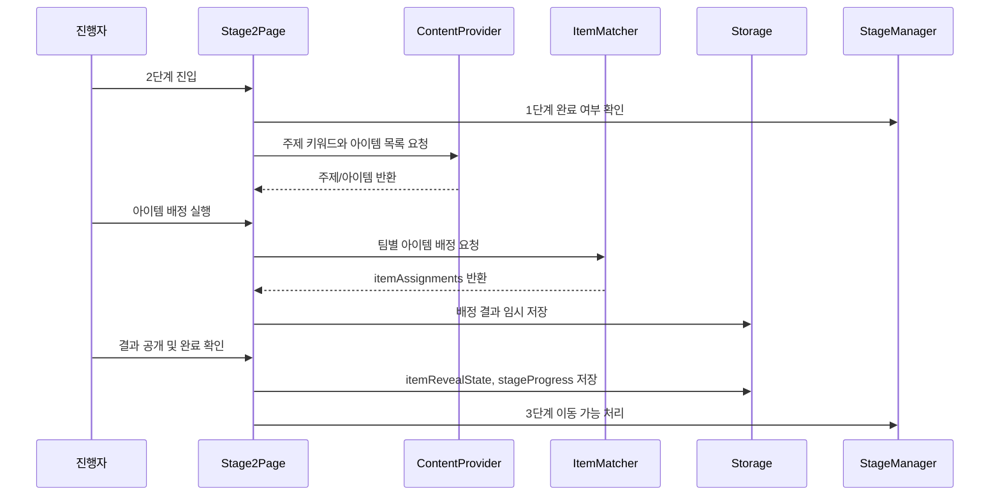

# 유스케이스 ID: UC-004

### 제목
2단계 주제 확인 및 팀별 힌트/도구 아이템 배정

---

## 1. 개요

### 1.1 목적
1단계에서 확정된 팀을 기준으로 전체 게임의 성경 주제 키워드를 제시하고, 3단계와 4단계 협업 미션에 사용할 힌트 또는 도구 아이템을 팀별로 배정한다.

### 1.2 범위
이 유스케이스는 2단계 화면에서 주제 키워드를 확인하고, 팀별 아이템을 랜덤 매칭 또는 사다리타기 방식으로 배정하며, 진행자가 결과 공개와 확정을 완료하는 흐름을 다룬다.

제외 사항:
- 관리자용 아이템 편집 화면
- 서버 저장 또는 실시간 동기화
- 팀별 기기 간 동시 공개
- 아이템 효과의 세부 사용 판정

### 1.3 액터
- **주요 액터**: 진행자
- **부 액터**: 참가 팀, 보조 진행자

---

## 2. 선행 조건

- 게임 설정이 완료되어 있어야 한다.
- 팀 이름이 팀 수만큼 입력되어 있어야 한다.
- 1단계 팀 구성이 확정되어 있어야 한다.
- `stageProgress.stage1.status`가 `completed`여야 한다.
- `teams`와 `teamAssignments`가 유효한 상태로 존재해야 한다.
- 기본 콘텐츠 세트에 2단계 아이템 목록이 존재해야 한다. 목록이 없으면 기본 아이템 세트를 사용한다.

---

## 3. 참여 컴포넌트

- **StageManager**: 현재 스테이지, 완료 상태, 다음 단계 이동 가능 여부를 관리한다.
- **GameConfig/ContentProvider**: 주제 키워드와 기본 아이템 콘텐츠를 제공한다.
- **ItemMatcher**: 팀 목록과 아이템 목록을 기준으로 팀별 아이템을 배정한다.
- **Storage**: `localStorage`의 `retreat-game:v1:state`에 배정 결과와 공개 상태를 임시 저장한다.
- **Stage2Page**: 주제, 아이템 배정 실행, 결과 공개, 진행자 확정 UI를 제공한다.

---

## 4. 기본 플로우 (Basic Flow)

### 4.1 단계별 흐름

1. **진행자**: 2단계 화면에 진입한다.
   - 입력: 다음 단계 이동 실행
   - 처리: 시스템은 1단계 완료 여부와 팀 데이터를 확인한다.
   - 출력: 현재 단계가 `Stage 2: 주제 및 아이템 획득`으로 표시된다.

2. **시스템**: 전체 게임 주제 키워드를 표시한다.
   - 입력: `game.config.topicKeyword`, `game.content.topicKeyword`
   - 처리: 저장된 주제 키워드가 없으면 기본값 `공동체`를 적용한다.
   - 출력: 진행자와 참가 팀이 함께 볼 수 있는 주제 키워드가 표시된다.

3. **진행자**: 아이템 배정을 실행한다.
   - 입력: 아이템 배정 실행
   - 처리: `ItemMatcher`가 팀 목록과 아이템 목록을 기준으로 팀별 아이템을 배정한다.
   - 출력: 공개 전 상태 또는 배정 준비 완료 상태가 표시된다.

4. **시스템**: 배정 결과를 임시 저장한다.
   - 입력: 팀별 아이템 매칭 결과
   - 처리: `itemAssignments`, `itemRevealState`를 갱신하고 `localStorage`에 저장한다.
   - 출력: 새로고침 후에도 같은 배정 결과를 복구할 수 있는 상태가 된다.

5. **진행자**: 결과 공개 방식을 선택하거나 기본 공개 방식을 사용한다.
   - 입력: 전체 공개 또는 순차 공개
   - 처리: 시스템은 공개된 팀 ID를 `itemRevealState.revealedTeamIds`에 반영한다.
   - 출력: 팀별 획득 아이템과 간단한 사용 안내가 표시된다.

6. **진행자**: 2단계 완료를 확인한다.
   - 입력: 진행자 완료 확인
   - 처리: 시스템은 모든 팀에 아이템이 배정되었는지 확인하고 `itemRevealState.finalized`를 `true`로 설정한다.
   - 출력: 2단계 완료 상태와 3단계 이동 가능 상태가 표시된다.

7. **StageManager**: 3단계 이동을 준비한다.
   - 입력: 2단계 완료 상태
   - 처리: `stageProgress.stage2.status`를 `completed`로 저장하고 `stageProgress.stage3.status`를 `active`로 전환한다.
   - 출력: 진행 표시 영역에 2단계 완료가 반영된다.

### 4.2 시퀀스 다이어그램

---

## 5. 대안 플로우 (Alternative Flows)

### 5.1 대안 플로우 1: 순차 공개

**시작 조건**: 진행자가 전체 공개 대신 팀별 순차 공개를 선택한다.

**단계**:
1. 시스템은 첫 번째 팀 결과만 공개한다.
2. 진행자가 다음 팀 공개를 실행할 때마다 `revealedTeamIds`에 팀 ID를 추가한다.
3. 모든 팀의 결과가 공개되면 완료 확인 버튼을 활성화한다.

**결과**: 순차 공개 상태가 `localStorage`에 저장되며, 새로고침 후에도 공개된 팀 목록을 복구한다.

### 5.2 대안 플로우 2: 아이템 재배정

**시작 조건**: 진행자가 결과 확정 전 재배정을 실행한다.

**단계**:
1. 시스템은 기존 `itemAssignments`를 새 배정 결과로 대체한다.
2. `itemRevealState.revealedTeamIds`를 초기화한다.
3. 재배정된 결과를 다시 저장한다.

**결과**: 가장 최근 배정 결과만 유효한 아이템 결과로 남는다.

---

## 6. 예외 플로우 (Exception Flows)

### 6.1 예외 상황 1: 팀 데이터 없음

**발생 조건**: `teams`가 비어 있거나 1단계 팀 구성이 확정되지 않은 상태에서 2단계 배정을 시도한다.

**처리 방법**:
1. 아이템 배정을 실행하지 않는다.
2. 1단계 팀 구성 결과 화면으로 돌아갈 수 있는 안내를 제공한다.

**에러 코드**: `STAGE2_TEAMS_REQUIRED`

**사용자 메시지**: "팀 구성이 완료되어야 아이템을 배정할 수 있습니다."

### 6.2 예외 상황 2: 아이템 목록 없음

**발생 조건**: 선택된 콘텐츠 세트에 아이템 목록이 비어 있다.

**처리 방법**:
1. 기본 아이템 세트를 적용한다.
2. 기본 세트도 사용할 수 없으면 배정을 중단한다.

**에러 코드**: `STAGE2_ITEMS_EMPTY`

**사용자 메시지**: "사용할 아이템이 없어 기본 아이템을 불러옵니다."

### 6.3 예외 상황 3: localStorage 저장 실패

**발생 조건**: 브라우저 저장소 제한, 비공개 모드, 저장소 접근 제한으로 상태 저장에 실패한다.

**처리 방법**:
1. 현재 메모리 상태로 진행을 유지한다.
2. 새로고침 시 복구되지 않을 수 있음을 표시한다.

**에러 코드**: `LOCAL_STORAGE_SAVE_FAILED`

**사용자 메시지**: "임시 저장에 실패했습니다. 현재 화면을 유지한 상태로 진행해 주세요."

---

## 7. 후행 조건 (Post-conditions)

### 7.1 성공 시

- **데이터베이스 변경**: 외부 데이터베이스 변경 없음. `localStorage`의 `retreat-game:v1:state`에 `itemAssignments`, `itemRevealState`, `stageProgress.stage2`가 저장된다.
- **시스템 상태**: 2단계가 완료되고 3단계가 활성화된다.
- **외부 시스템**: 외부 API 또는 외부 저장소와 상호작용하지 않는다.

### 7.2 실패 시

- **데이터 롤백**: 확정 전 재배정 실패 시 기존 확정 결과는 유지한다.
- **시스템 상태**: 2단계는 완료 처리되지 않으며, 진행자는 다시 배정을 시도하거나 이전 단계 데이터를 확인한다.

---

## 8. 비기능 요구사항

### 8.1 성능
- 팀 수 2~6개 기준으로 배정 결과는 즉시 표시되어야 한다.
- 외부 API 없이 브라우저 내부 데이터만 사용한다.

### 8.2 보안
- 로그인, 권한, 서버 인증을 사용하지 않는다.
- 아이템 배정 결과에는 팀 이름과 아이템 ID만 저장하며 개인정보 전용 필드는 포함하지 않는다.

### 8.3 가용성
- 새로고침 후에도 확정된 아이템 배정과 공개 상태를 복구해야 한다.
- `localStorage`를 사용할 수 없는 경우 현재 세션 안에서만 진행 가능해야 한다.

---

## 9. UI/UX 요구사항

### 9.1 화면 구성
- 4단계 진행 표시 영역
- 주제 키워드 표시 영역
- 팀 목록과 아이템 배정 실행 버튼
- 팀별 아이템 결과 영역
- 진행자 완료 확인 버튼
- 3단계 이동 버튼

### 9.2 사용자 경험
- 진행자가 한 기기에서 조작하고 참가 팀이 함께 볼 수 있도록 결과 영역을 명확하게 표시한다.
- 아이템은 3단계와 4단계에서 어떻게 사용할 수 있는지 짧게 안내한다.
- 2단계 완료 전에는 3단계 이동을 제한한다.

---

## 10. 테스트 시나리오

### 10.1 성공 케이스

| 테스트 케이스 ID | 입력값 | 기대 결과 |
|----------------|--------|----------|
| TC-004-01 | 4개 팀, 기본 아이템 6개 | 각 팀에 1개 아이템이 배정되고 2단계 완료 가능 |
| TC-004-02 | 순차 공개 선택 | 공개된 팀 ID가 저장되고 다음 팀 공개 가능 |
| TC-004-03 | 재배정 후 완료 확인 | 기존 결과가 새 결과로 대체되고 확정 상태 저장 |

### 10.2 실패 케이스

| 테스트 케이스 ID | 입력값 | 기대 결과 |
|----------------|--------|----------|
| TC-004-04 | 팀 데이터 없음 | 아이템 배정 차단 및 팀 구성 필요 안내 |
| TC-004-05 | 아이템 목록 비어 있음 | 기본 아이템 세트 적용 |
| TC-004-06 | localStorage 저장 실패 | 현재 세션 진행 유지 및 저장 실패 안내 |

---

## 11. 관련 유스케이스

- **선행 유스케이스**: UC-001 게임 설정, UC-002 팀 이름 입력, UC-003 1단계 성향 질문 및 팀 구성
- **후행 유스케이스**: UC-005 3단계 성경 기반 협업 미션
- **연관 유스케이스**: UC-006 4단계 최종 미션, 팀별 소감 작성, 결과물 다운로드

---

## 12. 변경 이력

| 버전 | 날짜 | 작성자 | 변경 내용 |
|------|------|--------|-----------|
| 1.0 | 2026-05-26 | Codex | 초기 작성 |

---

## 부록

### A. 용어 정의
- **아이템**: 3단계 또는 4단계 미션에서 사용할 수 있는 힌트, 키워드 카드, 정답 후보 제거권, 협력 요청권 등의 도구.
- **진행자 확인**: 다음 단계로 이동하기 전 진행자가 결과 공개와 배정 확정을 명시적으로 확인하는 행위.

### B. 참고 자료
- `docs/requirement.md`
- `docs/prd.md`
- `docs/userflow.md`
- `docs/database.md`
