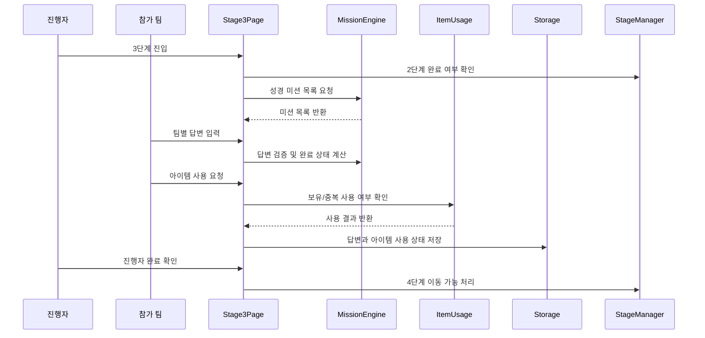

# 유스케이스 ID: UC-005

### 제목
3단계 성경 기반 팀 협업 미션 진행

---

## 1. 개요

### 1.1 목적
팀별로 2단계에서 획득한 힌트와 도구를 활용해 성경 기반 협업 퀴즈와 토론형 미션을 해결하도록 한다. 정답 경쟁보다 팀원 간 상의, 말씀 이해, 주제 적용을 중심으로 진행한다.

### 1.2 범위
이 유스케이스는 3단계 화면에서 미션 목록을 표시하고, 팀별 답변을 입력하며, 아이템 사용 상태와 진행자 확인을 통해 3단계 완료 여부를 관리하는 흐름을 다룬다.

제외 사항:
- 외부 성경 API 연동
- 자동 난이도 추천
- 실시간 팀별 기기 동기화
- 관리자용 문제 편집 화면

### 1.3 액터
- **주요 액터**: 진행자
- **부 액터**: 참가 팀, 보조 진행자

---

## 2. 선행 조건

- 1단계 팀 구성이 확정되어 있어야 한다.
- 2단계 아이템 배정이 완료되어 있어야 한다.
- `stageProgress.stage2.status`가 `completed`여야 한다.
- `teams`, `itemAssignments`, `itemRevealState.finalized`가 유효해야 한다.
- 기본 콘텐츠 세트에 3단계 성경 기반 미션이 존재해야 한다. 미션 데이터가 누락되면 기본 미션 세트를 사용한다.

---

## 3. 참여 컴포넌트

- **StageManager**: 3단계 진입 가능 여부와 완료 상태를 관리한다.
- **MissionEngine**: 성경 미션 목록, 답변 저장, 선택형 정답 판정, 서술형 완료 조건을 관리한다.
- **ItemMatcher/ItemUsage**: 팀이 획득한 아이템의 사용 가능 여부와 사용 상태를 관리한다.
- **Storage**: `missionResponses.stage3`, `usedItems`, `stageProgress.stage3`를 `localStorage`에 임시 저장한다.
- **Stage3Page**: 미션, 팀별 답변 입력, 아이템 사용, 진행자 확인 UI를 제공한다.

---

## 4. 기본 플로우 (Basic Flow)

### 4.1 단계별 흐름

1. **진행자**: 3단계 화면에 진입한다.
   - 입력: 3단계 이동 실행
   - 처리: 시스템은 2단계 완료 상태와 아이템 배정 결과를 확인한다.
   - 출력: 현재 단계가 `Stage 3: 성경 협업 미션`으로 표시된다.

2. **시스템**: 주제와 연령대에 맞는 성경 미션을 표시한다.
   - 입력: `topicKeyword`, `ageGroup`, `difficulty`, 기본 콘텐츠 세트
   - 처리: 주제 `공동체`, 기본 대상 `중고등부`, 난이도 `normal` 기준 미션을 불러온다.
   - 출력: 성경 퀴즈, 말씀 빈칸, 인물/사건 연결, 토론형 문항이 표시된다.

3. **참가 팀**: 팀원들과 상의해 답변을 작성한다.
   - 입력: 선택형 답안, 서술형 답변, 팀별 토론 결과
   - 처리: 시스템은 팀 ID와 미션 ID를 기준으로 답변을 임시 저장한다.
   - 출력: 팀별 답변 입력 상태가 표시된다.

4. **참가 팀**: 필요한 경우 2단계 아이템을 사용한다.
   - 입력: 아이템 사용 실행
   - 처리: 시스템은 해당 팀이 보유한 아이템인지, 이미 사용한 아이템인지 확인한다.
   - 출력: 사용 가능하면 `usedItems`에 저장되고 해당 미션의 힌트 또는 도구 사용 상태가 표시된다.

5. **MissionEngine**: 답변 완료 여부를 판단한다.
   - 입력: 팀별 답변, 미션 유형, 아이템 사용 상태
   - 처리: 선택형 문제는 정답 여부를 기록하고, 서술형 문제는 입력 여부와 진행자 확인 대기 상태를 기록한다.
   - 출력: 팀별 미션 진행 상태와 완료 후보 상태가 표시된다.

6. **진행자**: 팀별 답변을 확인하고 3단계 완료를 승인한다.
   - 입력: 진행자 완료 확인
   - 처리: 시스템은 필수 미션의 팀별 답변이 모두 존재하는지 확인한다.
   - 출력: 3단계 완료 가능 상태가 표시된다.

7. **StageManager**: 3단계를 완료 처리한다.
   - 입력: 진행자 완료 확인, 필수 답변 완료 상태
   - 처리: `stageProgress.stage3.status`를 `completed`로 저장하고 `stageProgress.stage4.status`를 `active`로 전환한다.
   - 출력: 4단계 이동 가능 상태가 표시된다.

### 4.2 시퀀스 다이어그램

---

## 5. 대안 플로우 (Alternative Flows)

### 5.1 대안 플로우 1: 정답 데이터가 없는 토론형 미션

**시작 조건**: 미션 유형이 서술형, 고백문 작성, 말씀 적용 토론 등 자동 정답 판정이 불가능한 유형이다.

**단계**:
1. 시스템은 정답 여부 대신 답변 입력 여부를 확인한다.
2. 진행자는 팀의 답변을 현장에서 확인한다.
3. 진행자가 완료 확인을 실행하면 해당 팀의 미션을 완료 처리한다.

**결과**: `isCorrect` 없이 `isCompleted` 중심으로 저장된다.

### 5.2 대안 플로우 2: 아이템 없이 미션 진행

**시작 조건**: 2단계 아이템 데이터가 누락되었거나 진행자가 아이템 사용 없이 3단계를 진행하기로 한다.

**단계**:
1. 시스템은 아이템 사용 영역을 비활성화하거나 "사용 가능한 아이템 없음" 상태로 표시한다.
2. 팀은 답변 입력만으로 미션을 진행한다.
3. 진행자는 동일하게 완료 여부를 확인한다.

**결과**: `usedItems` 추가 없이 3단계 답변과 완료 상태가 저장된다.

### 5.3 대안 플로우 3: 일부 팀 먼저 완료

**시작 조건**: 일부 팀이 먼저 모든 필수 답변을 제출한다.

**단계**:
1. 시스템은 팀별 완료 상태를 개별 표시한다.
2. 진행자는 아직 미완료인 팀을 확인한다.
3. 모든 팀이 완료하거나 진행자가 현장 상황에 따라 완료 확인을 실행한다.

**결과**: 팀별 진행 상태가 유지되고, 진행자 확인 후 3단계 전체 완료 여부가 결정된다.

---

## 6. 예외 플로우 (Exception Flows)

### 6.1 예외 상황 1: 답변 누락

**발생 조건**: 팀별 필수 미션 답변이 비어 있는 상태에서 제출 또는 완료 확인을 시도한다.

**처리 방법**:
1. 누락된 팀과 미션을 표시한다.
2. 3단계 완료 처리를 제한한다.

**에러 코드**: `STAGE3_REQUIRED_ANSWER_MISSING`

**사용자 메시지**: "아직 답변하지 않은 팀 또는 미션이 있습니다."

### 6.2 예외 상황 2: 아이템 중복 사용

**발생 조건**: 한 번만 사용할 수 있는 아이템을 같은 팀이 다시 사용하려고 한다.

**처리 방법**:
1. 아이템 사용을 차단한다.
2. 기존 사용 기록을 유지한다.

**에러 코드**: `ITEM_ALREADY_USED`

**사용자 메시지**: "이미 사용한 아이템입니다."

### 6.3 예외 상황 3: 미션 콘텐츠 누락

**발생 조건**: 선택된 콘텐츠 세트에서 3단계 미션을 불러올 수 없다.

**처리 방법**:
1. 기본 성경 미션 세트를 불러온다.
2. 기본 세트도 없으면 3단계 진행을 중단하고 안내를 표시한다.

**에러 코드**: `STAGE3_CONTENT_MISSING`

**사용자 메시지**: "미션 데이터를 불러오지 못해 기본 미션을 사용합니다."

### 6.4 예외 상황 4: localStorage 저장 실패

**발생 조건**: 답변 또는 아이템 사용 상태를 임시 저장하지 못한다.

**처리 방법**:
1. 메모리 상태로 현재 입력을 유지한다.
2. 저장 실패 안내를 표시하고 새로고침을 피하도록 안내한다.

**에러 코드**: `LOCAL_STORAGE_SAVE_FAILED`

**사용자 메시지**: "임시 저장에 실패했습니다. 현재 화면을 유지한 상태로 진행해 주세요."

---

## 7. 후행 조건 (Post-conditions)

### 7.1 성공 시

- **데이터베이스 변경**: 외부 데이터베이스 변경 없음. `localStorage`의 `retreat-game:v1:state`에 `missionResponses.stage3`, `usedItems`, `stageProgress.stage3`가 저장된다.
- **시스템 상태**: 3단계가 완료되고 4단계가 활성화된다.
- **외부 시스템**: 외부 API 또는 외부 저장소와 상호작용하지 않는다.

### 7.2 실패 시

- **데이터 롤백**: 유효하지 않은 답변 제출은 저장하지 않는다. 이미 저장된 유효 답변과 아이템 사용 기록은 유지한다.
- **시스템 상태**: 3단계는 완료 처리되지 않으며, 진행자는 누락된 팀 또는 미션을 확인한다.

---

## 8. 비기능 요구사항

### 8.1 성능
- 기본 미션 5개와 2~6개 팀 기준으로 입력 상태가 즉시 반영되어야 한다.
- 자동 저장은 사용자 입력 경험을 방해하지 않아야 한다.

### 8.2 보안
- 실명, 연락처, 계정 정보 입력란을 제공하지 않는다.
- 자유 입력 답변에는 개인정보를 쓰지 않도록 안내한다.
- 모든 답변은 브라우저 로컬 상태와 `localStorage`에만 저장한다.

### 8.3 가용성
- 새로고침 후에도 팀별 답변, 아이템 사용 상태, 완료 상태를 복구해야 한다.
- `localStorage` 사용이 불가능한 환경에서는 현재 탭 세션 안에서만 진행한다.

---

## 9. UI/UX 요구사항

### 9.1 화면 구성
- 4단계 진행 표시 영역
- 주제 키워드와 성경 미션 안내 영역
- 팀별 답변 입력 영역
- 팀별 아이템 사용 상태 영역
- 진행자 확인 영역
- 4단계 이동 버튼

### 9.2 사용자 경험
- 팀원들이 함께 상의해야 하는 질문임을 드러내는 구조로 답변 입력을 배치한다.
- 선택형과 서술형 미션의 완료 조건을 구분해 표시한다.
- 진행자는 어느 팀이 완료되었고 어느 팀이 대기 중인지 한눈에 확인할 수 있어야 한다.

---

## 10. 테스트 시나리오

### 10.1 성공 케이스

| 테스트 케이스 ID | 입력값 | 기대 결과 |
|----------------|--------|----------|
| TC-005-01 | 모든 팀이 선택형/서술형 답변 입력 | 팀별 완료 상태가 표시되고 진행자 확인 가능 |
| TC-005-02 | 한 팀이 보유 아이템 사용 | `usedItems`에 사용 기록 저장 및 화면 반영 |
| TC-005-03 | 진행자가 3단계 완료 확인 | `stageProgress.stage3` 완료, 4단계 활성화 |

### 10.2 실패 케이스

| 테스트 케이스 ID | 입력값 | 기대 결과 |
|----------------|--------|----------|
| TC-005-04 | 필수 답변 누락 | 완료 처리 차단 및 누락 항목 표시 |
| TC-005-05 | 이미 사용한 아이템 재사용 | 사용 차단 및 기존 사용 기록 유지 |
| TC-005-06 | 미션 콘텐츠 누락 | 기본 미션 세트 적용 또는 진행 중단 안내 |

---

## 11. 관련 유스케이스

- **선행 유스케이스**: UC-004 2단계 주제 확인 및 팀별 힌트/도구 아이템 배정
- **후행 유스케이스**: UC-006 4단계 최종 미션
- **연관 유스케이스**: 팀별 소감 작성, 결과물 미리보기 및 이미지 다운로드

---

## 12. 변경 이력

| 버전 | 날짜 | 작성자 | 변경 내용 |
|------|------|--------|-----------|
| 1.0 | 2026-05-26 | Codex | 초기 작성 |

---

## 부록

### A. 용어 정의
- **성경 협업 미션**: 팀원이 함께 성경 내용, 주제 키워드, 적용 질문을 토론해 답변하는 미션.
- **진행자 확인**: 자동 정답 판정이 어렵거나 현장 판단이 필요한 답변을 진행자가 완료로 승인하는 행위.

### B. 참고 자료
- `docs/requirement.md`
- `docs/prd.md`
- `docs/userflow.md`
- `docs/database.md`
