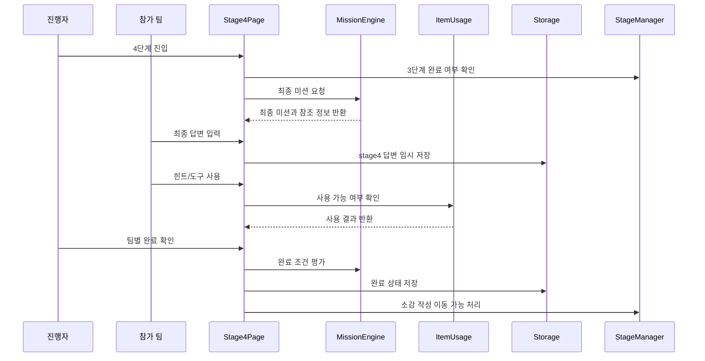

# 유스케이스 ID: UC-006

### 제목
4단계 최종 성경 미션 진행 및 완료 확인

---

## 1. 개요

### 1.1 목적
팀별로 2단계에서 얻은 힌트/도구와 3단계에서 작성한 답변을 바탕으로 최종 성경 미션을 완성한다. 최종 미션은 공동체 주제에 맞는 팀 선언문, 실천 약속, 최종 답변 등 협업 결과물을 만들고 진행자가 완료 여부를 확인하는 데 목적이 있다.

### 1.2 범위
이 유스케이스는 4단계 화면에서 최종 미션을 표시하고, 팀별 최종 답변을 입력하며, 아이템 활용 여부와 진행자 확인을 통해 4단계를 완료하고 소감 작성 흐름으로 이동하는 과정을 다룬다.

제외 사항:
- 소감 작성 자체
- 결과물 다운로드. 이미지 다운로드는 UC-008에서 다룬다.
- 최종 미션 콘텐츠 편집 화면
- 점수판 또는 경쟁 순위 산정
- 서버 저장 또는 외부 제출

### 1.3 액터
- **주요 액터**: 진행자
- **부 액터**: 참가 팀, 보조 진행자

---

## 2. 선행 조건

- 1단계 팀 구성이 확정되어 있어야 한다.
- 2단계 아이템 배정이 완료되어 있어야 한다.
- 3단계 성경 협업 미션이 완료되어 있어야 한다.
- `stageProgress.stage3.status`가 `completed`여야 한다.
- `teams`, `itemAssignments`, `missionResponses.stage3`가 유효한 상태여야 한다.
- 기본 콘텐츠 세트에 4단계 최종 미션 1개 이상이 존재해야 한다.

---

## 3. 참여 컴포넌트

- **StageManager**: 4단계 진입 가능 여부, 완료 상태, 소감 작성 단계 이동을 관리한다.
- **MissionEngine**: 최종 미션 콘텐츠, 팀별 최종 답변, 완료 조건을 관리한다.
- **ItemUsage**: 4단계에서 사용할 수 있는 힌트 또는 도구의 사용 상태를 관리한다.
- **Storage**: `missionResponses.stage4`, `usedItems`, `stageProgress.stage4`를 `localStorage`에 임시 저장한다.
- **Stage4Page**: 최종 미션 안내, 팀별 답변 입력, 진행자 확인 UI를 제공한다.

---

## 4. 기본 플로우 (Basic Flow)

### 4.1 단계별 흐름

1. **진행자**: 4단계 화면에 진입한다.
   - 입력: 4단계 이동 실행
   - 처리: 시스템은 3단계 완료 여부와 팀별 미션 답변 데이터를 확인한다.
   - 출력: 현재 단계가 `Stage 4: 최종 미션`으로 표시된다.

2. **시스템**: 최종 미션과 참조 정보를 표시한다.
   - 입력: 기본 콘텐츠 세트, 주제 키워드, 2단계 아이템, 3단계 답변
   - 처리: 주제와 연결된 최종 미션을 불러오고 팀별 참조 정보를 정리한다.
   - 출력: 최종 암호/키워드, 팀 선언문, 상황극 대사, 공동체 실천 약속 중 하나의 미션이 표시된다.

3. **참가 팀**: 최종 답변을 팀별로 작성한다.
   - 입력: 팀별 최종 답변 또는 선언문
   - 처리: 시스템은 팀 ID 기준으로 `missionResponses.stage4`를 임시 저장한다.
   - 출력: 팀별 입력 완료 상태가 표시된다.

4. **참가 팀**: 필요한 경우 남은 힌트 또는 도구 아이템을 사용한다.
   - 입력: 4단계 아이템 사용 실행
   - 처리: 시스템은 아이템 보유 여부와 중복 사용 제한을 확인하고 `usedItems`에 기록한다.
   - 출력: 사용한 힌트와 도구 상태가 표시된다.

5. **진행자**: 팀별 최종 답변을 확인한다.
   - 입력: 팀별 완료 확인
   - 처리: 정답형 미션은 정답 기준을 확인하고, 선언문/실천 약속형 미션은 입력 완료와 현장 판단을 기준으로 확인한다.
   - 출력: 팀별 `facilitatorConfirmed`와 `isCompleted` 상태가 갱신된다.

6. **진행자**: 4단계 전체 완료를 확정한다.
   - 입력: 4단계 완료 확인
   - 처리: 시스템은 필수 팀의 완료 상태를 확인하고 `stageProgress.stage4.status`를 `completed`로 저장한다.
   - 출력: 소감 작성 단계로 이동 가능한 상태가 표시된다.

7. **StageManager**: 소감 작성 흐름을 준비한다.
   - 입력: 4단계 완료 상태
   - 처리: `currentStage`를 `reflection`, `currentRoute`를 `reflection`으로 전환할 수 있게 한다.
   - 출력: 팀별 소감 작성 화면 이동이 가능해진다.

### 4.2 시퀀스 다이어그램

---

## 5. 대안 플로우 (Alternative Flows)

### 5.1 대안 플로우 1: 결과물형 미션

**시작 조건**: 최종 미션이 팀 선언문, 공동체 실천 약속, 짧은 상황극 대사처럼 정답이 하나로 정해지지 않은 유형이다.

**단계**:
1. 시스템은 정답 여부 대신 최종 답변 입력 여부를 확인한다.
2. 진행자는 내용이 주제와 연결되는지 현장에서 확인한다.
3. 진행자가 팀별 완료 확인을 실행하면 `facilitatorConfirmed`를 `true`로 저장한다.

**결과**: `isCompleted`와 `facilitatorConfirmed`가 최종 완료 기준이 된다.

### 5.2 대안 플로우 2: 일부 팀 미완료 상태에서 진행자 확정

**시작 조건**: 시간 제한 등 현장 사정으로 일부 팀이 최종 답변을 완성하지 못했다.

**단계**:
1. 시스템은 미완료 팀을 표시한다.
2. 진행자는 미완료 팀을 보완하도록 하거나 현장 판단으로 종료할 수 있다.
3. 진행자가 전체 완료를 확정하면 완료 기준과 미완료 상태가 결과 요약에 반영된다.

**결과**: 현장 진행 우선 원칙에 따라 소감 작성 단계로 이동할 수 있다.

### 5.3 대안 플로우 3: 아이템 없이 최종 미션 진행

**시작 조건**: 2단계 아이템이 없거나 3단계에서 모두 사용되어 남은 아이템이 없다.

**단계**:
1. 시스템은 아이템 영역을 비활성화하거나 사용 가능한 아이템이 없음을 표시한다.
2. 팀은 3단계 답변과 주제 키워드를 바탕으로 최종 답변을 작성한다.
3. 진행자는 동일하게 완료 여부를 확인한다.

**결과**: `usedItems` 추가 없이 4단계 답변과 완료 상태만 저장된다.

---

## 6. 예외 플로우 (Exception Flows)

### 6.1 예외 상황 1: 최종 답변 누락

**발생 조건**: 특정 팀의 최종 답변이 비어 있는데 팀별 완료 확인을 시도한다.

**처리 방법**:
1. 해당 팀을 미완료로 표시한다.
2. 팀별 완료 확인을 제한하거나 진행자에게 현장 판단 확정을 요구한다.

**에러 코드**: `STAGE4_FINAL_ANSWER_MISSING`

**사용자 메시지**: "최종 답변이 입력되지 않은 팀이 있습니다."

### 6.2 예외 상황 2: 3단계 미완료

**발생 조건**: `stageProgress.stage3.status`가 `completed`가 아닌 상태에서 4단계 진입을 시도한다.

**처리 방법**:
1. 4단계 진입을 제한한다.
2. 3단계 화면으로 이동할 수 있는 안내를 제공한다.

**에러 코드**: `STAGE3_NOT_COMPLETED`

**사용자 메시지**: "3단계 미션을 완료한 뒤 최종 미션으로 이동할 수 있습니다."

### 6.3 예외 상황 3: 최종 미션 콘텐츠 누락

**발생 조건**: 선택된 콘텐츠 세트에 4단계 최종 미션이 없다.

**처리 방법**:
1. 기본 최종 미션을 적용한다.
2. 기본 미션도 없으면 진행을 중단하고 안내를 표시한다.

**에러 코드**: `STAGE4_CONTENT_MISSING`

**사용자 메시지**: "최종 미션 데이터를 불러오지 못해 기본 미션을 사용합니다."

### 6.4 예외 상황 4: localStorage 저장 실패

**발생 조건**: 최종 답변, 진행자 확인 상태, 아이템 사용 기록을 임시 저장하지 못한다.

**처리 방법**:
1. 현재 메모리 상태로 진행을 유지한다.
2. 새로고침 시 복구되지 않을 수 있음을 표시한다.

**에러 코드**: `LOCAL_STORAGE_SAVE_FAILED`

**사용자 메시지**: "임시 저장에 실패했습니다. 현재 화면을 유지한 상태로 진행해 주세요."

---

## 7. 후행 조건 (Post-conditions)

### 7.1 성공 시

- **데이터베이스 변경**: 외부 데이터베이스 변경 없음. `localStorage`의 `retreat-game:v1:state`에 `missionResponses.stage4`, `usedItems`, `stageProgress.stage4`가 저장된다.
- **시스템 상태**: 4단계가 완료되고 소감 작성 흐름이 활성화된다.
- **외부 시스템**: 외부 API 또는 외부 저장소와 상호작용하지 않는다.

### 7.2 실패 시

- **데이터 롤백**: 유효하지 않은 최종 답변 또는 중복 아이템 사용은 저장하지 않는다. 기존 유효 답변과 진행자 확인 상태는 유지한다.
- **시스템 상태**: 4단계는 완료 처리되지 않으며, 진행자는 미완료 팀 또는 누락 데이터를 확인한다.

---

## 8. 비기능 요구사항

### 8.1 성능
- 팀 수 2~6개 기준으로 최종 답변 입력과 완료 상태가 즉시 반영되어야 한다.
- 3단계 답변과 아이템 참조 정보는 화면 전환 시 지연 없이 표시되어야 한다.

### 8.2 보안
- 로그인, 계정, 서버 권한을 사용하지 않는다.
- 최종 답변에는 실명, 전화번호, 이메일 등 개인정보를 입력하지 않도록 안내한다.
- 모든 데이터는 브라우저 메모리와 `localStorage`에만 저장한다.

### 8.3 가용성
- 새로고침 후에도 팀별 최종 답변, 진행자 확인 상태, 완료 상태를 복구해야 한다.
- 저장소를 사용할 수 없는 환경에서는 현재 세션에서만 이어 진행할 수 있어야 한다.

---

## 9. UI/UX 요구사항

### 9.1 화면 구성
- 4단계 진행 표시 영역
- 최종 미션 안내 영역
- 팀별 2단계 아이템 및 3단계 답변 참조 영역
- 팀별 최종 답변 입력 영역
- 팀별 진행자 확인 컨트롤
- 소감 작성 단계 이동 버튼

### 9.2 사용자 경험
- 최종 미션은 앞 단계의 힌트와 답변을 활용한다는 연결성이 분명해야 한다.
- 팀별 완료 상태가 한눈에 보여야 한다.
- 점수 경쟁보다 팀의 고백, 실천, 협력 결과를 남기는 흐름으로 안내한다.

---

## 10. 테스트 시나리오

### 10.1 성공 케이스

| 테스트 케이스 ID | 입력값 | 기대 결과 |
|----------------|--------|----------|
| TC-006-01 | 모든 팀이 최종 답변 입력 | 팀별 완료 확인 가능 |
| TC-006-02 | 진행자가 모든 팀 완료 확인 | `stageProgress.stage4` 완료, 소감 작성 이동 가능 |
| TC-006-03 | 4단계에서 남은 아이템 사용 | `usedItems`에 stage 4 사용 기록 저장 |

### 10.2 실패 케이스

| 테스트 케이스 ID | 입력값 | 기대 결과 |
|----------------|--------|----------|
| TC-006-04 | 3단계 미완료 상태에서 진입 | 4단계 접근 차단 및 3단계 완료 안내 |
| TC-006-05 | 최종 답변 빈 값 | 팀별 완료 확인 제한 및 누락 표시 |
| TC-006-06 | 최종 미션 콘텐츠 없음 | 기본 최종 미션 적용 또는 진행 중단 안내 |

---

## 11. 관련 유스케이스

- **선행 유스케이스**: UC-005 3단계 성경 기반 팀 협업 미션 진행
- **후행 유스케이스**: 팀별 소감 작성, 결과물 미리보기 및 이미지 다운로드
- **연관 유스케이스**: UC-004 2단계 주제 확인 및 팀별 힌트/도구 아이템 배정

---

## 12. 변경 이력

| 버전 | 날짜 | 작성자 | 변경 내용 |
|------|------|--------|-----------|
| 1.0 | 2026-05-26 | Codex | 초기 작성 |

---

## 부록

### A. 용어 정의
- **최종 미션**: 앞 단계에서 얻은 힌트, 아이템, 성경 미션 답변을 바탕으로 팀별 최종 답변 또는 결과물을 완성하는 4단계 활동.
- **진행자 확인**: 팀의 최종 답변이 현장 기준에 맞게 완료되었는지 진행자가 승인하는 행위.

### B. 참고 자료
- `docs/requirement.md`
- `docs/prd.md`
- `docs/userflow.md`
- `docs/database.md`
