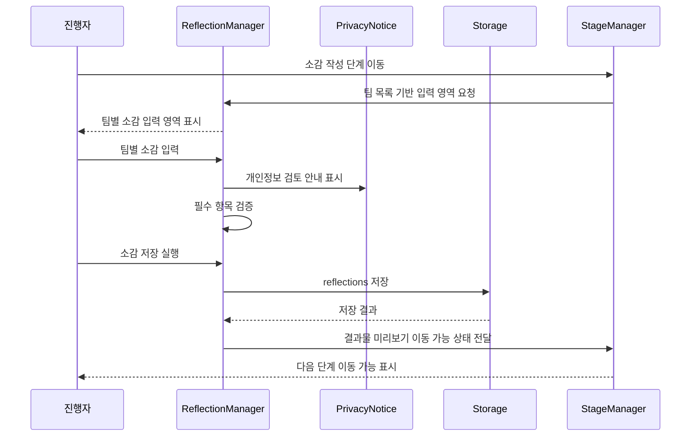

# 유스케이스 ID: UC-007

### 제목
팀별 소감 작성

---

## 1. 개요

### 1.1 목적
4단계 최종 미션을 마친 뒤 각 팀이 활동을 돌아보고, 결과물 다운로드에 사용할 팀별 소감 데이터를 완성한다.

### 1.2 범위
이 유스케이스는 팀별 소감 입력, 필수 항목 검증, 개인정보 검토 안내, 로컬 임시 저장, 결과물 미리보기 단계로 이동 가능한 상태 전환을 다룬다.

제외 사항:

- 결과 파일 생성. 이미지 다운로드는 UC-008에서 다루고, PDF는 MVP 이후 기능으로 분리한다.
- 진행자에게 파일 제출하는 외부 절차
- 서버 저장, 로그인, 계정 기반 제출
- 소감 내용 자동 평가 또는 성경적 해석 판정

### 1.3 액터
- **주요 액터**: 진행자
- **부 액터**: 참가자, 보조 진행자

---

## 2. 선행 조건

- 게임 설정, 팀 이름, 팀 구성 결과가 생성되어 있다.
- 4단계 최종 미션이 완료되었거나 진행자가 소감 작성으로 이동 가능한 상태로 판단했다.
- 확정된 팀 목록이 존재한다.
- 앱은 서버 저장 없이 브라우저 메모리 상태와 `localStorage` 임시 저장을 사용한다.

---

## 3. 참여 컴포넌트

- **StageManager**: 현재 경로를 `reflection`으로 전환하고 진행 상태를 관리한다.
- **ReflectionManager**: 팀별 소감 입력값을 관리하고 필수 항목을 검증한다.
- **Storage**: 소감 데이터를 `retreat-game:v1:state`에 임시 저장한다.
- **PrivacyNotice**: 자유 입력란에 개인정보를 넣지 않도록 안내하고 결과물 생성 전 검토를 유도한다.
- **ExportPreviewPreparation**: 저장된 소감이 결과물 미리보기에서 사용할 수 있는 상태인지 확인한다.

---

## 4. 기본 플로우 (Basic Flow)

### 4.1 단계별 흐름

1. **진행자**: 4단계 완료 후 소감 작성 단계로 이동한다.
   - 입력: 소감 작성 단계 이동 실행
   - 처리: 시스템은 현재 경로를 `reflection`으로 설정한다.
   - 출력: 팀별 소감 입력 화면이 표시된다.

2. **ReflectionManager**: 확정된 팀 목록을 기준으로 입력 영역을 생성한다.
   - 입력: `teams`
   - 처리: 각 팀의 기존 `reflections` 저장 여부를 확인한다.
   - 출력: 팀 이름별 소감 입력 묶음이 표시된다.

3. **참가자 또는 진행자**: 팀별 소감 항목을 입력한다.
   - 입력: 기억에 남는 말씀 또는 키워드, 함께 해결한 것, 감사한 점, 앞으로 실천하고 싶은 것
   - 처리: 입력값을 팀 ID 기준으로 임시 상태에 반영한다.
   - 출력: 팀별 작성 상태가 갱신된다.

4. **ReflectionManager**: 필수 항목 입력 여부를 검증한다.
   - 입력: 팀별 소감 입력값
   - 처리: 공백 제거 후 빈 항목과 표시 길이 초과 가능성을 확인한다.
   - 출력: 완료된 팀과 보완이 필요한 팀을 구분해 표시한다.

5. **PrivacyNotice**: 결과물에 포함될 입력값 검토를 안내한다.
   - 입력: 팀별 자유 입력값
   - 처리: 실명, 연락처, 이메일 등 개인정보를 입력하지 말아야 한다는 원칙을 표시한다.
   - 출력: 사용자가 결과물 생성 전 내용을 다시 확인할 수 있다.

6. **진행자**: 소감 저장을 실행한다.
   - 입력: 저장 실행
   - 처리: 유효한 팀별 소감을 `Reflection` 데이터로 저장하고 `updatedAt`을 갱신한다.
   - 출력: 저장 완료 상태가 표시된다.

7. **Storage**: 변경된 상태를 로컬에 임시 저장한다.
   - 입력: `reflections`, `game.stage.currentRoute`
   - 처리: 단일 상태 객체를 `retreat-game:v1:state`에 저장한다.
   - 출력: 새로고침 후 복구 가능한 상태가 된다.

8. **StageManager**: 모든 필수 소감이 완료되면 결과물 미리보기 이동을 허용한다.
   - 입력: 팀별 소감 완료 상태
   - 처리: 모든 팀의 필수 항목 입력 여부를 확인한다.
   - 출력: 결과물 미리보기 및 다운로드 단계로 이동 가능한 상태가 표시된다.

### 4.2 시퀀스 다이어그램

---

## 5. 대안 플로우 (Alternative Flows)

### 5.1 일부 팀 소감만 먼저 저장

**시작 조건**: 모든 팀이 동시에 소감을 완성하지 못했다.

**단계**:
1. 진행자가 작성 완료된 팀의 소감을 저장한다.
2. 시스템은 완료된 팀의 `Reflection`만 저장하고 미완료 팀을 표시한다.
3. 진행자는 미완료 팀의 항목을 나중에 이어서 작성한다.

**결과**: 작성된 소감은 보존되지만, 모든 필수 팀 소감이 완료되기 전까지 전체 다운로드 준비 상태는 제한된다.

### 5.2 4단계 미션 완료 전 소감 작성 허용

**시작 조건**: 현장 진행상 일부 미션을 생략하고 소감 작성이 필요하다.

**단계**:
1. 진행자가 소감 작성 단계로 이동한다.
2. 시스템은 4단계 미완료 상태를 유지하되 소감 입력은 허용한다.
3. 결과물 미리보기에서는 미션 요약 누락 가능성을 표시한다.

**결과**: 소감은 저장되지만 결과물 생성 전 누락된 미션 데이터 검토가 필요하다.

---

## 6. 예외 플로우 (Exception Flows)

### 6.1 필수 소감 항목 누락

**발생 조건**: 한 팀 이상이 필수 항목을 비워 둔 상태에서 저장 또는 다음 단계 이동을 시도한다.

**처리 방법**:
1. 누락된 팀과 항목을 표시한다.
2. 소감 데이터는 입력된 범위까지 임시 상태에 유지한다.
3. 결과물 미리보기 이동은 제한한다.

**에러 코드**: `REFLECTION_REQUIRED_FIELD_MISSING`

**사용자 메시지**: "아직 작성하지 않은 소감 항목이 있습니다."

### 6.2 소감 텍스트가 표시 가능 범위를 초과

**발생 조건**: 입력값이 결과물 카드에 표시하기 어려울 정도로 길다.

**처리 방법**:
1. 저장 가능 여부와 결과물 표시 제한을 분리해 판단한다.
2. 화면에는 줄바꿈 또는 축약 가능성을 안내한다.
3. 다운로드 전 미리보기에서 잘림 여부를 확인하게 한다.

**에러 코드**: `REFLECTION_TEXT_TOO_LONG`

**사용자 메시지**: "결과물에 잘 보이도록 소감을 조금 줄여 주세요."

### 6.3 로컬 저장 실패

**발생 조건**: `localStorage` 사용 불가, 비공개 브라우징 제한, 용량 초과 등이 발생한다.

**처리 방법**:
1. 현재 메모리 상태의 입력값은 유지한다.
2. 저장 실패 상태를 표시한다.
3. 새로고침 시 복구되지 않을 수 있음을 안내한다.

**에러 코드**: `LOCAL_STORAGE_SAVE_FAILED`

**사용자 메시지**: "임시 저장에 실패했습니다. 현재 화면을 닫기 전에 결과를 확인해 주세요."

---

## 7. 후행 조건 (Post-conditions)

### 7.1 성공 시

- **데이터베이스 변경**: 외부 데이터베이스 변경은 없다. `localStorage`의 `retreat-game:v1:state.reflections`가 갱신된다.
- **시스템 상태**: 모든 팀의 소감이 유효하면 `export` 단계 이동이 가능하다.
- **외부 시스템**: 외부 시스템 연동은 없다.

### 7.2 실패 시

- **데이터 롤백**: 서버 트랜잭션이 없으므로 롤백은 없다. 유효하지 않은 팀 소감은 완료 상태로 처리하지 않는다.
- **시스템 상태**: 현재 입력 화면에 머물며 보완이 필요한 항목을 표시한다.

---

## 8. 비기능 요구사항

### 8.1 성능
- 팀 수 2~6개 기준으로 입력 상태 변경과 검증은 즉시 반응해야 한다.
- 소감 저장은 외부 API 없이 브라우저 내부에서 처리한다.

### 8.2 보안
- 로그인, 실명, 연락처, 이메일 입력 필드를 제공하지 않는다.
- 자유 입력란에는 개인정보 입력을 피하라는 안내를 제공한다.
- 저장 데이터는 같은 브라우저에 남을 수 있으므로 삭제 흐름과 연결되어야 한다.

### 8.3 가용성
- 새로고침 후에도 정상 저장된 소감은 복구되어야 한다.
- `localStorage`를 사용할 수 없는 환경에서는 현재 세션 안에서만 입력을 유지한다.

---

## 9. UI/UX 요구사항

### 9.1 화면 구성
- 4단계 스테이지 완료 후 소감 작성 단계임을 알 수 있는 진행 표시
- 팀 이름별 소감 입력 영역
- 기억에 남는 말씀 또는 키워드 입력
- 팀이 함께 해결한 것 입력
- 감사한 점 입력
- 앞으로 실천하고 싶은 것 입력
- 팀별 작성 완료 상태
- 개인정보 입력 주의 안내
- 저장 및 결과물 미리보기 이동 버튼

### 9.2 사용자 경험
- 진행자가 한 기기에서 팀별 소감을 빠르게 입력할 수 있어야 한다.
- 미완료 팀과 항목이 명확해야 한다.
- 결과물에 포함될 내용임을 입력 전에 이해할 수 있어야 한다.
- 개인정보 검토는 방해가 아니라 다운로드 전 확인 흐름으로 느껴져야 한다.

---

## 10. 테스트 시나리오

### 10.1 성공 케이스

| 테스트 케이스 ID | 입력값 | 기대 결과 |
|----------------|--------|----------|
| TC-007-01 | 모든 팀의 4개 소감 항목 입력 | 소감 저장 후 결과물 미리보기 이동 가능 |
| TC-007-02 | 기존 저장 소감이 있는 상태에서 소감 단계 진입 | 저장된 소감이 팀별로 복원됨 |
| TC-007-03 | 일부 팀 소감 수정 후 저장 | 해당 팀의 `updatedAt`과 입력값이 갱신됨 |

### 10.2 실패 케이스

| 테스트 케이스 ID | 입력값 | 기대 결과 |
|----------------|--------|----------|
| TC-007-04 | 한 팀의 감사한 점 누락 | 누락 항목 표시, 다음 단계 이동 제한 |
| TC-007-05 | 지나치게 긴 소감 입력 | 결과물 표시 제한 안내 |
| TC-007-06 | `localStorage` 저장 실패 | 현재 입력 유지, 저장 실패 안내 |

---

## 11. 관련 유스케이스

- **선행 유스케이스**: UC-006 4단계 최종 미션
- **후행 유스케이스**: UC-008 결과물 이미지 다운로드
- **연관 유스케이스**: UC-009 임시 저장 및 복구

---

## 12. 변경 이력

| 버전 | 날짜 | 작성자 | 변경 내용 |
|------|------|--------|-----------|
| 1.0 | 2026-05-26 | Codex | 초기 작성 |

---

## 부록

### A. 용어 정의
- **소감**: 팀 활동 후 기억에 남는 말씀, 협업 내용, 감사, 실천 다짐을 정리한 텍스트.
- **개인정보 검토**: 결과물에 실명, 연락처, 이메일 등 개인정보가 포함되지 않았는지 사용자가 확인하는 절차.

### B. 참고 자료
- `docs/requirement.md`
- `docs/prd.md`
- `docs/userflow.md`
- `docs/database.md`
