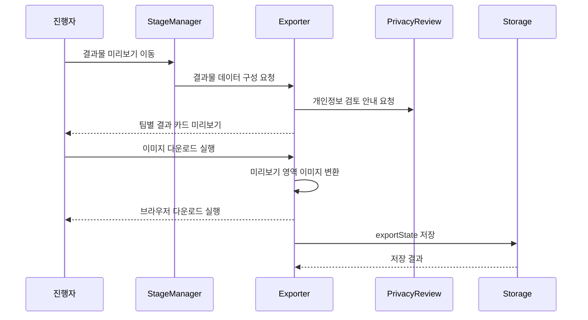

# 유스케이스 ID: UC-008

### 제목
결과물 미리보기 및 이미지 다운로드

---

## 1. 개요

### 1.1 목적
팀별 소감과 미션 요약을 결과 카드 형태로 확인하고, MVP 우선 범위인 이미지 파일로 다운로드해 진행자에게 제출할 수 있게 한다.

### 1.2 범위
이 유스케이스는 결과물 데이터 구성, 미리보기, 개인정보 검토, 개별 팀 또는 전체 팀 이미지 다운로드, 다운로드 실패 재시도를 다룬다.

제외 사항:

- PDF 다운로드 구현
- 서버 업로드 또는 온라인 제출
- QR 공유, 이메일 전송, 메신저 전송
- 이미지 편집 기능

PDF 다운로드는 MVP 이후 기능으로 분리하되, 결과물 데이터 구조는 향후 PDF 생성에도 재사용 가능해야 한다.

### 1.3 액터
- **주요 액터**: 진행자
- **부 액터**: 보조 진행자, 참가자

---

## 2. 선행 조건

- 확정된 팀 목록이 존재한다.
- 2단계 아이템 배정, 3단계 협업 미션, 4단계 최종 미션 데이터가 가능한 범위에서 저장되어 있다.
- 모든 필수 팀 소감이 저장되어 있다.
- 결과물에 표시할 게임 제목과 주제 키워드가 존재한다. 없으면 기본값을 사용할 수 있다.
- 결과물 생성 전 개인정보 입력 주의 안내가 제공되어야 한다.

---

## 3. 참여 컴포넌트

- **StageManager**: 현재 경로를 `export`로 전환하고 다운로드 단계 접근 가능 여부를 관리한다.
- **ReflectionManager**: 팀별 소감 완료 상태를 제공한다.
- **MissionEngine**: 완료한 미션 요약 데이터를 제공한다.
- **Exporter**: 결과물 미리보기 데이터를 구성하고 이미지 다운로드를 실행한다.
- **Storage**: `exportState`와 다운로드 시도 결과를 `localStorage`에 임시 저장한다.
- **PrivacyReview**: 결과물에 포함될 자유 입력값 검토를 안내한다.

---

## 4. 기본 플로우 (Basic Flow)

### 4.1 단계별 흐름

1. **진행자**: 소감 작성 완료 후 결과물 미리보기 단계로 이동한다.
   - 입력: 결과물 미리보기 이동 실행
   - 처리: 시스템은 필수 소감 완료 여부를 확인한다.
   - 출력: 결과물 미리보기 화면이 표시된다.

2. **Exporter**: 결과물 데이터를 구성한다.
   - 입력: 게임 제목, 팀 이름, 주제 키워드, 미션 요약, 팀별 소감
   - 처리: 팀별 결과 카드에 표시할 데이터를 조합한다.
   - 출력: 미리보기 데이터가 준비된다.

3. **PrivacyReview**: 다운로드 전 개인정보 검토를 요청한다.
   - 입력: 팀 이름, 미션 답변, 팀별 소감
   - 처리: 자유 입력값에 개인정보가 포함되지 않아야 함을 안내한다.
   - 출력: 진행자가 표시 내용을 검토할 수 있다.

4. **진행자**: 팀별 결과물 미리보기를 확인한다.
   - 입력: 팀별 또는 전체 결과물 선택
   - 처리: 시스템은 선택된 팀의 결과 카드만 다운로드 대상으로 지정한다.
   - 출력: 다운로드 가능한 대상이 표시된다.

5. **진행자**: 이미지 다운로드를 실행한다.
   - 입력: 개별 팀 다운로드 또는 전체 다운로드 실행
   - 처리: Exporter는 미리보기 영역을 이미지로 변환하고 파일명을 생성한다.
   - 출력: 브라우저 다운로드가 시작된다.

6. **Storage**: 다운로드 시도 결과를 저장한다.
   - 입력: 선택 팀 ID, 다운로드 성공 시각 또는 오류 메시지
   - 처리: `exportState`의 `selectedTeamIds`, `lastDownloadedAt`, `lastError`를 갱신한다.
   - 출력: 다운로드 상태가 화면에 반영된다.

### 4.2 시퀀스 다이어그램

---

## 5. 대안 플로우 (Alternative Flows)

### 5.1 개별 팀 결과물 다운로드

**시작 조건**: 진행자가 특정 팀 결과물만 먼저 저장하려 한다.

**단계**:
1. 진행자가 다운로드할 팀을 선택한다.
2. 시스템은 선택된 팀의 결과 카드만 이미지 변환 대상으로 지정한다.
3. 브라우저가 해당 팀 결과물 파일을 다운로드한다.

**결과**: 선택된 팀의 이미지 파일만 생성된다.

### 5.2 전체 팀 결과물 다운로드

**시작 조건**: 모든 팀의 소감과 결과를 한 번에 저장하려 한다.

**단계**:
1. 진행자가 전체 다운로드를 실행한다.
2. 시스템은 팀별 결과 카드를 순서대로 이미지 변환한다.
3. 브라우저 정책에 따라 파일별 다운로드 또는 하나의 이미지 묶음 형태로 처리한다.

**결과**: 모든 팀 결과물이 다운로드 대상이 된다.

### 5.3 모바일 브라우저 대체 저장

**시작 조건**: 모바일 브라우저에서 자동 다운로드가 제한된다.

**단계**:
1. 시스템은 이미지 생성 결과를 화면에 표시한다.
2. 진행자는 브라우저의 저장, 공유, 길게 누르기 등 기기 기본 기능으로 저장한다.
3. 시스템은 다운로드가 제한될 수 있음을 안내한다.

**결과**: 자동 다운로드가 실패해도 결과 이미지를 저장할 수 있는 대체 흐름을 제공한다.

---

## 6. 예외 플로우 (Exception Flows)

### 6.1 결과물 데이터 누락

**발생 조건**: 팀 이름, 소감, 주제 키워드, 미션 요약 등 필수 표시 데이터가 누락되었다.

**처리 방법**:
1. 누락된 항목을 표시한다.
2. 다운로드 실행을 제한한다.
3. 사용자가 관련 단계로 돌아가 보완할 수 있게 한다.

**에러 코드**: `EXPORT_DATA_INCOMPLETE`

**사용자 메시지**: "결과물에 필요한 정보가 아직 부족합니다."

### 6.2 이미지 변환 실패

**발생 조건**: 이미지 변환 라이브러리 오류, 브라우저 제한, 렌더링 대상 누락이 발생한다.

**처리 방법**:
1. 오류 상태를 `exportState.lastError`에 저장한다.
2. 재시도 버튼을 제공한다.
3. 미리보기 화면은 유지한다.

**에러 코드**: `IMAGE_EXPORT_FAILED`

**사용자 메시지**: "이미지 생성에 실패했습니다. 다시 시도해 주세요."

### 6.3 긴 텍스트로 인한 결과물 잘림

**발생 조건**: 소감이나 미션 답변이 결과 카드 표시 영역을 초과한다.

**처리 방법**:
1. 미리보기에서 잘림 가능성을 표시한다.
2. 줄바꿈, 영역 확장, 축약 중 MVP에서 정한 표시 규칙을 적용한다.
3. 필요하면 소감 작성 단계로 돌아가 수정하게 한다.

**에러 코드**: `EXPORT_PREVIEW_OVERFLOW`

**사용자 메시지**: "결과물에서 일부 내용이 잘릴 수 있습니다. 미리보기를 확인해 주세요."

---

## 7. 후행 조건 (Post-conditions)

### 7.1 성공 시

- **데이터베이스 변경**: 외부 데이터베이스 변경은 없다. `localStorage`의 `exportState.lastDownloadedAt`이 갱신될 수 있다.
- **시스템 상태**: 결과물 미리보기와 다운로드 완료 또는 재시도 가능 상태가 유지된다.
- **외부 시스템**: 브라우저 다운로드 기능만 사용한다.

### 7.2 실패 시

- **데이터 롤백**: 다운로드 파일 자체는 저장 상태에 포함하지 않으므로 롤백 대상이 없다.
- **시스템 상태**: `exportState.lastError`를 표시하고 재시도 가능 상태를 유지한다.

---

## 8. 비기능 요구사항

### 8.1 성능
- 결과물 레이아웃은 모바일 브라우저에서도 이미지 생성 대기 시간이 길지 않도록 단순하게 유지한다.
- 팀 수 2~6개 기준으로 개별 또는 전체 다운로드가 가능해야 한다.

### 8.2 보안
- 결과물은 사용자의 브라우저에서 생성하며 서버로 업로드하지 않는다.
- 실명, 전화번호, 이메일 등 개인정보 전용 필드를 제공하지 않는다.
- 다운로드 전 자유 입력값에 개인정보가 없는지 검토 안내를 제공한다.

### 8.3 가용성
- 다운로드 실패 시 재시도할 수 있어야 한다.
- 자동 다운로드가 제한되는 브라우저에서는 대체 저장 흐름을 고려한다.

---

## 9. UI/UX 요구사항

### 9.1 화면 구성
- 4단계 완료 및 소감 작성 완료 상태 표시
- 팀별 결과 카드 미리보기
- 게임 제목 또는 행사명
- 주제 키워드
- 팀 이름
- 완료 미션 요약
- 팀별 소감
- 개인정보 검토 안내
- 개별 팀 다운로드 버튼
- 전체 다운로드 버튼
- 다운로드 실패 시 재시도 버튼

### 9.2 사용자 경험
- 진행자는 다운로드 전에 결과물이 실제로 어떻게 보이는지 확인할 수 있어야 한다.
- 다운로드 우선순위는 이미지이며 PDF는 MVP 이후 기능으로 명확히 구분한다.
- 오류가 발생해도 작성한 소감과 미리보기 데이터가 사라지지 않아야 한다.

---

## 10. 테스트 시나리오

### 10.1 성공 케이스

| 테스트 케이스 ID | 입력값 | 기대 결과 |
|----------------|--------|----------|
| TC-008-01 | 모든 팀 소감 완료 후 미리보기 진입 | 팀별 결과 카드가 표시됨 |
| TC-008-02 | 특정 팀 선택 후 이미지 다운로드 | 선택 팀 결과 이미지 다운로드 실행 |
| TC-008-03 | 전체 다운로드 실행 | 모든 팀 결과물이 다운로드 대상이 됨 |
| TC-008-04 | 다운로드 성공 | `exportState.lastDownloadedAt` 갱신 |

### 10.2 실패 케이스

| 테스트 케이스 ID | 입력값 | 기대 결과 |
|----------------|--------|----------|
| TC-008-05 | 소감 누락 상태에서 다운로드 | 누락 항목 표시, 다운로드 제한 |
| TC-008-06 | 이미지 변환 오류 발생 | 오류 안내와 재시도 버튼 표시 |
| TC-008-07 | 긴 소감 포함 | 미리보기에서 표시 제한 또는 줄바꿈 확인 가능 |

---

## 11. 관련 유스케이스

- **선행 유스케이스**: UC-007 팀별 소감 작성
- **후행 유스케이스**: 없음
- **연관 유스케이스**: UC-009 임시 저장 및 복구

---

## 12. 변경 이력

| 버전 | 날짜 | 작성자 | 변경 내용 |
|------|------|--------|-----------|
| 1.0 | 2026-05-26 | Codex | 초기 작성 |

---

## 부록

### A. 용어 정의
- **결과 카드**: 팀 이름, 주제 키워드, 미션 요약, 팀별 소감을 담은 다운로드용 시각 영역.
- **이미지 다운로드**: MVP에서 우선 제공하는 결과물 저장 방식.
- **PDF 다운로드**: MVP 이후 확장 기능.

### B. 참고 자료
- `docs/requirement.md`
- `docs/prd.md`
- `docs/userflow.md`
- `docs/database.md`
