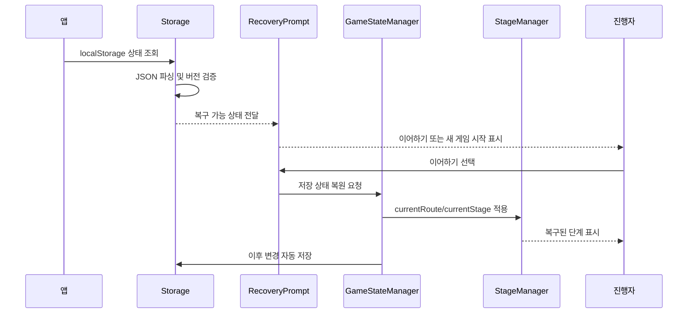

# 유스케이스 ID: UC-009

### 제목
임시 저장 및 세션 복구

---

## 1. 개요

### 1.1 목적
게임 진행 중 새로고침, 브라우저 재진입, 실수로 인한 화면 이탈이 발생해도 가능한 범위에서 진행 상태를 복구하고, 새 게임 시작 또는 저장 데이터 삭제를 안전하게 수행한다.

### 1.2 범위
이 유스케이스는 `localStorage` 기반 자동 저장, 앱 시작 시 저장 상태 확인, 정상 복구, 손상 데이터 처리, 저장 데이터 초기화, 개인정보 검토 원칙을 다룬다.

제외 사항:

- 서버 저장
- 로그인 기반 세션 관리
- 여러 기기 간 동기화
- 여러 탭 충돌 자동 병합
- 클라우드 백업

### 1.3 액터
- **주요 액터**: 진행자
- **부 액터**: 보조 진행자

---

## 2. 선행 조건

- 앱은 브라우저 메모리 상태를 기본 상태 저장소로 사용한다.
- 새로고침 복구를 위해 `localStorage` 단일 키 `retreat-game:v1:state`를 사용할 수 있다.
- 저장 상태에는 `schemaVersion`, `savedAt`, `game`, `teams`, `participants`, `reflections`, `exportState` 등 필수 최상위 필드가 포함되어야 한다.
- 사용자는 로그인하지 않으며, 앱은 개인정보 전용 입력 필드를 제공하지 않는다.

---

## 3. 참여 컴포넌트

- **Storage**: 상태 직렬화, 저장, 조회, 삭제, 파싱, 버전 검증을 담당한다.
- **StageManager**: 복구된 `currentRoute`와 `currentStage` 기준으로 화면을 결정한다.
- **GameStateManager**: 메모리 상태와 저장 상태 간 동기화를 관리한다.
- **RecoveryPrompt**: 이어하기, 새 게임 시작, 저장 데이터 삭제 선택지를 제공한다.
- **PrivacyNotice**: 같은 기기를 여러 행사에서 사용할 때 이전 데이터 노출 가능성과 개인정보 미입력 원칙을 안내한다.

---

## 4. 기본 플로우 (Basic Flow)

### 4.1 단계별 흐름

1. **시스템**: 앱 시작 시 저장 상태를 조회한다.
   - 입력: `retreat-game:v1:state`
   - 처리: `localStorage`에 저장된 문자열 존재 여부를 확인한다.
   - 출력: 저장 상태 있음 또는 없음으로 분기한다.

2. **Storage**: 저장 상태를 검증한다.
   - 입력: 저장된 JSON 문자열
   - 처리: JSON 파싱, `schemaVersion`, 필수 필드, `savedAt`을 확인한다.
   - 출력: 정상 복구 가능 여부가 결정된다.

3. **RecoveryPrompt**: 정상 저장 상태가 있으면 이어하기 선택지를 제공한다.
   - 입력: 저장된 게임 제목, 주제 키워드, 현재 단계, 저장 시각
   - 처리: 사용자가 이어하기 또는 새 게임 시작을 선택할 수 있게 한다.
   - 출력: 복구 선택 화면이 표시된다.

4. **진행자**: 이어하기를 실행한다.
   - 입력: 이어하기 실행
   - 처리: 저장 상태를 메모리 상태로 복원한다.
   - 출력: 저장된 현재 경로 또는 현재 스테이지 화면이 표시된다.

5. **StageManager**: 복구된 진행 상태를 반영한다.
   - 입력: `game.stage.currentRoute`, `game.stage.progress`
   - 처리: 완료 단계, 현재 단계, 잠긴 단계를 재구성한다.
   - 출력: 복구된 화면과 진행 표시가 표시된다.

6. **Storage**: 이후 상태 변경 시 자동 저장한다.
   - 입력: 설정, 팀, 응답, 미션, 소감, 다운로드 상태 변경
   - 처리: 검증 가능한 단위마다 단일 상태 객체를 덮어쓴다.
   - 출력: `savedAt`이 갱신된 상태가 저장된다.

### 4.2 시퀀스 다이어그램

---

## 5. 대안 플로우 (Alternative Flows)

### 5.1 저장 상태가 없는 경우

**시작 조건**: `retreat-game:v1:state`가 존재하지 않는다.

**단계**:
1. 시스템은 새 게임 시작 상태를 생성한다.
2. 진행자는 게임 설정 입력부터 시작한다.
3. 유효한 설정이 입력되면 이후 변경 시점부터 자동 저장한다.

**결과**: 복구 안내 없이 새 게임 흐름이 시작된다.

### 5.2 새 게임 시작으로 기존 데이터 초기화

**시작 조건**: 저장 상태가 있지만 진행자가 새 게임을 시작하려 한다.

**단계**:
1. 시스템은 기존 데이터가 삭제되거나 덮어써질 수 있음을 안내한다.
2. 진행자가 초기화를 확인한다.
3. Storage는 기존 `retreat-game:v1:state`를 삭제하거나 초기 상태로 덮어쓴다.
4. 시스템은 새 게임 설정 화면으로 이동한다.

**결과**: 이전 행사 데이터가 노출되지 않고 새 게임을 시작한다.

### 5.3 저장 데이터 삭제만 실행

**시작 조건**: 진행자가 같은 기기에서 이전 행사 데이터를 지우고 싶다.

**단계**:
1. 진행자가 저장 데이터 삭제를 실행한다.
2. 시스템은 삭제 확인을 요청한다.
3. Storage는 `retreat-game:v1:state`를 삭제한다.
4. 시스템은 삭제 완료 상태를 표시한다.

**결과**: 브라우저에 남은 게임 진행 데이터가 제거된다.

---

## 6. 예외 플로우 (Exception Flows)

### 6.1 저장 데이터 손상 또는 버전 불일치

**발생 조건**: JSON 파싱 실패, `schemaVersion` 불일치, 필수 필드 누락이 발생한다.

**처리 방법**:
1. 정상 이어하기를 제공하지 않는다.
2. MVP에서는 새 게임 시작 또는 저장 데이터 삭제를 우선 제공한다.
3. 복구 가능한 항목만 사용하는 확장은 MVP 이후로 둔다.

**에러 코드**: `STORED_STATE_INVALID`

**사용자 메시지**: "저장된 진행 상태를 불러올 수 없습니다. 새 게임을 시작하거나 저장 데이터를 삭제해 주세요."

### 6.2 로컬 저장소 사용 불가

**발생 조건**: 브라우저 정책, 비공개 브라우징, 사용자 설정으로 `localStorage` 접근이 실패한다.

**처리 방법**:
1. 메모리 상태로 현재 세션 진행은 유지한다.
2. 새로고침 후 복구되지 않을 수 있음을 안내한다.
3. 저장 실패 상태를 화면에 표시한다.

**에러 코드**: `LOCAL_STORAGE_UNAVAILABLE`

**사용자 메시지**: "이 브라우저에서는 임시 저장을 사용할 수 없습니다."

### 6.3 저장 용량 초과

**발생 조건**: `localStorage` 용량 초과로 저장이 실패한다.

**처리 방법**:
1. 현재 화면의 메모리 상태는 유지한다.
2. 마지막 저장 성공 시각과 현재 저장 실패 상태를 구분한다.
3. 불필요하게 긴 소감이나 이전 데이터를 정리하도록 안내한다.

**에러 코드**: `LOCAL_STORAGE_QUOTA_EXCEEDED`

**사용자 메시지**: "임시 저장 공간이 부족합니다. 데이터를 정리한 뒤 다시 시도해 주세요."

### 6.4 여러 탭에서 동시에 사용

**발생 조건**: 같은 브라우저에서 동일 앱을 여러 탭으로 열어 서로 다른 상태를 저장한다.

**처리 방법**:
1. MVP에서는 마지막 저장 데이터가 우선될 수 있음을 전제로 한다.
2. `savedAt` 기준으로 현재 메모리 상태보다 최신 저장 데이터가 있는지 확인할 수 있다.
3. 자동 병합은 제공하지 않는다.

**에러 코드**: `MULTI_TAB_STATE_CONFLICT`

**사용자 메시지**: "다른 탭에서 더 최근 진행 상태가 저장되었을 수 있습니다."

---

## 7. 후행 조건 (Post-conditions)

### 7.1 성공 시

- **데이터베이스 변경**: 외부 데이터베이스 변경은 없다. `localStorage`의 `retreat-game:v1:state`가 생성, 갱신, 삭제된다.
- **시스템 상태**: 저장된 현재 경로와 진행 상태 기준으로 화면이 복구된다.
- **외부 시스템**: 외부 시스템 연동은 없다.

### 7.2 실패 시

- **데이터 롤백**: 서버 트랜잭션이 없으므로 롤백은 없다. 저장 실패 시 현재 메모리 상태를 유지한다.
- **시스템 상태**: 복구 불가 또는 저장 실패 상태를 표시하고 새 게임 시작이나 삭제 흐름을 제공한다.

---

## 8. 비기능 요구사항

### 8.1 성능
- 앱 시작 시 저장 상태 확인과 검증은 사용자가 체감할 정도로 지연되지 않아야 한다.
- 상태 저장은 입력 흐름을 방해하지 않도록 검증 가능한 단위에서 수행한다.

### 8.2 보안
- 서버와 계정에 데이터를 저장하지 않는다.
- 개인정보 전용 입력 필드를 제공하지 않는다.
- 같은 기기를 다른 행사가 사용할 수 있으므로 저장 데이터 삭제 흐름을 제공한다.
- 자유 입력란에 개인정보가 남을 수 있으므로 결과물 생성 전 검토 안내와 초기화 안내를 제공한다.

### 8.3 가용성
- 정상 저장 상태는 새로고침 후 이어서 진행할 수 있어야 한다.
- 저장이 불가능한 환경에서도 현재 탭이 열려 있는 동안은 진행할 수 있어야 한다.
- 손상 데이터가 앱 시작을 막지 않아야 한다.

---

## 9. UI/UX 요구사항

### 9.1 화면 구성
- 저장된 게임 존재 안내
- 저장된 게임 제목, 주제 키워드, 현재 단계, 저장 시각
- 이어하기 버튼
- 새 게임 시작 버튼
- 저장 데이터 삭제 버튼
- 초기화 확인 안내
- 저장 실패 또는 복구 실패 안내
- 개인정보 및 이전 행사 데이터 노출 주의 안내

### 9.2 사용자 경험
- 진행자는 실수로 새로고침해도 이어하기 가능 여부를 즉시 알 수 있어야 한다.
- 새 게임 시작과 데이터 삭제는 실수 방지를 위해 확인 단계를 거쳐야 한다.
- 저장 실패 안내는 현재 진행 자체가 중단된 것처럼 보이지 않아야 한다.

---

## 10. 테스트 시나리오

### 10.1 성공 케이스

| 테스트 케이스 ID | 입력값 | 기대 결과 |
|----------------|--------|----------|
| TC-009-01 | 정상 `retreat-game:v1:state` 존재 | 이어하기 선택지가 표시됨 |
| TC-009-02 | 이어하기 실행 | 저장된 `currentRoute` 화면으로 복구됨 |
| TC-009-03 | 소감 입력 후 새로고침 | 저장된 소감이 복구됨 |
| TC-009-04 | 새 게임 시작 확인 | 기존 저장 데이터 초기화 후 설정 화면 표시 |
| TC-009-05 | 저장 데이터 삭제 확인 | `retreat-game:v1:state` 삭제 완료 표시 |

### 10.2 실패 케이스

| 테스트 케이스 ID | 입력값 | 기대 결과 |
|----------------|--------|----------|
| TC-009-06 | 깨진 JSON 저장값 | 복구 불가 안내, 새 게임 또는 삭제 제공 |
| TC-009-07 | `schemaVersion` 불일치 | 정상 이어하기 제한 |
| TC-009-08 | `localStorage` 접근 실패 | 메모리 진행 유지, 임시 저장 불가 안내 |
| TC-009-09 | 저장 용량 초과 | 현재 화면 유지, 저장 실패 안내 |

---

## 11. 관련 유스케이스

- **선행 유스케이스**: 전체 게임 진행 흐름
- **후행 유스케이스**: 저장 상태에 따라 모든 진행 단계
- **연관 유스케이스**: UC-007 팀별 소감 작성, UC-008 결과물 이미지 다운로드

---

## 12. 변경 이력

| 버전 | 날짜 | 작성자 | 변경 내용 |
|------|------|--------|-----------|
| 1.0 | 2026-05-26 | Codex | 초기 작성 |

---

## 부록

### A. 용어 정의
- **임시 저장**: 브라우저 `localStorage`에 진행 상태를 저장해 새로고침 후 복구하는 방식.
- **세션 복구**: 저장된 상태를 메모리 상태로 되돌려 이전 진행 단계에서 이어가는 동작.
- **초기화**: 기존 저장 데이터를 삭제하거나 새 초기 상태로 덮어쓰는 동작.

### B. 참고 자료
- `docs/requirement.md`
- `docs/prd.md`
- `docs/userflow.md`
- `docs/database.md`
